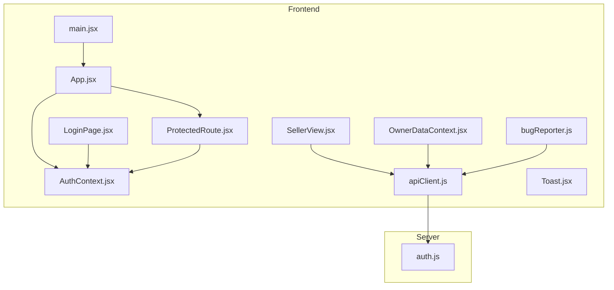
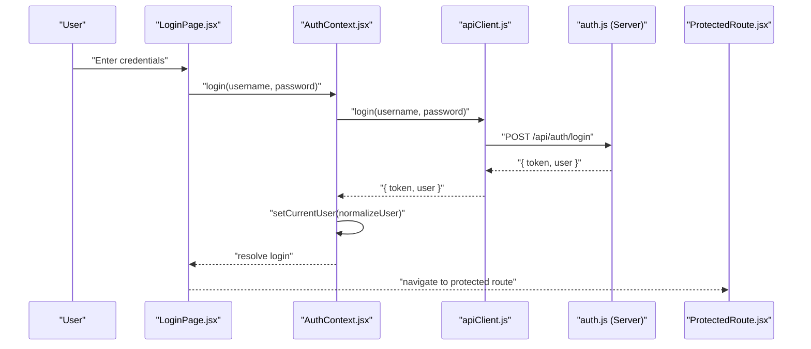
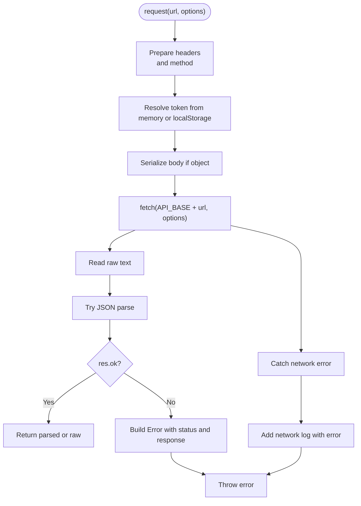
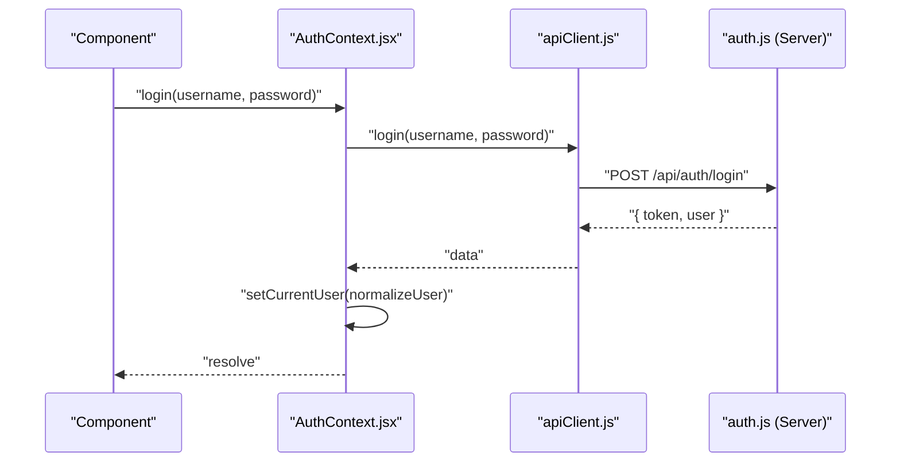
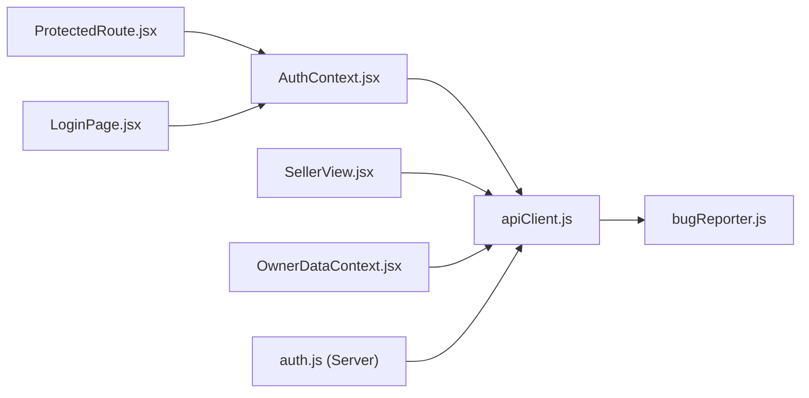

# API Client Integration

<cite>
**Referenced Files in This Document**
- [apiClient.js](file://src/utils/apiClient.js)
- [AuthContext.jsx](file://src/contexts/AuthContext.jsx)
- [ProtectedRoute.jsx](file://src/components/ProtectedRoute.jsx)
- [bugReporter.js](file://src/utils/bugReporter.js)
- [main.jsx](file://src/main.jsx)
- [App.jsx](file://src/App.jsx)
- [LoginPage.jsx](file://src/views/LoginPage.jsx)
- [SellerView.jsx](file://src/views/SellerView.jsx)
- [OwnerDataContext.jsx](file://src/contexts/OwnerDataContext.jsx)
- [Toast.jsx](file://src/components/Toast.jsx)
- [auth.js](file://server/auth.js)
- [DispatcherShiftClose.jsx](file://src/views/DispatcherShiftClose.jsx)
- [TicketSellingView.jsx](file://src/components/dispatcher/TicketSellingView.jsx)
- [mockData.js](file://src/data/mockData.js)
- [package.json](file://package.json)
</cite>

## Table of Contents
1. [Introduction](#introduction)
2. [Project Structure](#project-structure)
3. [Core Components](#core-components)
4. [Architecture Overview](#architecture-overview)
5. [Detailed Component Analysis](#detailed-component-analysis)
6. [Dependency Analysis](#dependency-analysis)
7. [Performance Considerations](#performance-considerations)
8. [Troubleshooting Guide](#troubleshooting-guide)
9. [Conclusion](#conclusion)
10. [Appendices](#appendices)

## Introduction
This document explains how the frontend integrates with the backend API using a centralized client utility, how authentication tokens are handled, and how React components consume the API safely and efficiently. It covers base URL configuration, request/response processing, authentication flows, protected routes, error handling strategies, request/response transformations, and practical usage patterns across components. It also includes guidance on performance optimization, caching, and offline considerations.

## Project Structure
The API integration spans several layers:
- Frontend client utility encapsulates HTTP requests and token handling
- Authentication context manages login/logout and user state
- Protected routing enforces role-based access
- Views and components orchestrate API calls and present results
- Server-side authentication middleware validates tokens and roles

**Diagram sources**
- [main.jsx](file://src/main.jsx#L15-L23)
- [App.jsx](file://src/App.jsx#L40-L136)
- [AuthContext.jsx](file://src/contexts/AuthContext.jsx#L19-L78)
- [ProtectedRoute.jsx](file://src/components/ProtectedRoute.jsx#L4-L35)
- [apiClient.js](file://src/utils/apiClient.js#L10-L88)
- [LoginPage.jsx](file://src/views/LoginPage.jsx#L8-L79)
- [SellerView.jsx](file://src/views/SellerView.jsx#L37-L370)
- [OwnerDataContext.jsx](file://src/contexts/OwnerDataContext.jsx#L21-L128)
- [Toast.jsx](file://src/components/Toast.jsx#L3-L42)
- [bugReporter.js](file://src/utils/bugReporter.js#L8-L13)
- [auth.js](file://server/auth.js#L10-L40)

**Section sources**
- [main.jsx](file://src/main.jsx#L1-L26)
- [App.jsx](file://src/App.jsx#L1-L139)
- [apiClient.js](file://src/utils/apiClient.js#L1-L360)
- [AuthContext.jsx](file://src/contexts/AuthContext.jsx#L1-L79)
- [ProtectedRoute.jsx](file://src/components/ProtectedRoute.jsx#L1-L38)
- [bugReporter.js](file://src/utils/bugReporter.js#L1-L55)

## Core Components
- ApiClient: centralizes HTTP requests, token injection, request/response logging, and domain-specific helpers for selling, presales, tickets, schedule templates, and owner data.
- AuthContext: handles login, logout, initial token validation, and exposes user state to components.
- ProtectedRoute: guards routes by authentication and role checks.
- bugReporter: global network and error logging around fetch calls.

Key capabilities:
- Base URL: all requests are prefixed with a base path
- Token handling: reads from memory or localStorage and injects Authorization header
- Request/response processing: auto-JSON serialization, safe JSON parsing, unified error extraction, and network log aggregation
- Domain helpers: dedicated methods for trips, slots, boats, presales, tickets, transfers, schedule templates, and owner dashboard

**Section sources**
- [apiClient.js](file://src/utils/apiClient.js#L4-L88)
- [AuthContext.jsx](file://src/contexts/AuthContext.jsx#L19-L78)
- [ProtectedRoute.jsx](file://src/components/ProtectedRoute.jsx#L4-L35)
- [bugReporter.js](file://src/utils/bugReporter.js#L8-L13)

## Architecture Overview
The frontend composes a layered integration:
- Application bootstrap initializes providers and routes
- AuthContext loads persisted tokens and validates them on startup
- ProtectedRoute enforces authentication and role checks
- Components call ApiClient methods to perform CRUD operations
- bugReporter records network traces and unhandled errors

**Diagram sources**
- [LoginPage.jsx](file://src/views/LoginPage.jsx#L56-L79)
- [AuthContext.jsx](file://src/contexts/AuthContext.jsx#L55-L63)
- [apiClient.js](file://src/utils/apiClient.js#L91-L98)
- [auth.js](file://server/auth.js#L120-L142)
- [ProtectedRoute.jsx](file://src/components/ProtectedRoute.jsx#L8-L35)

## Detailed Component Analysis

### ApiClient: Base URL, Token Handling, Request/Response Processing
- Base URL: requests are made against a fixed base path
- Token resolution: prefers in-memory token; falls back to localStorage keys for token, authToken, or jwt
- Authorization header: Bearer token injected automatically
- Body serialization: objects are JSON-stringified unless FormData
- Response parsing: attempts JSON parse; logs raw text fallback
- Error handling: constructs Error with status and response payload; logs network traces

**Diagram sources**
- [apiClient.js](file://src/utils/apiClient.js#L23-L88)

**Section sources**
- [apiClient.js](file://src/utils/apiClient.js#L4-L88)

### Authentication Flow: Login, Logout, Token Storage, Protected Routes
- Login: posts credentials to backend, receives token and user; sets token in memory
- Logout: calls backend logout endpoint (best-effort), clears token
- Token storage: token is stored in memory and optionally persisted in localStorage; ApiClient reads from localStorage if not in memory
- Protected routes: enforce authentication and role checks; owner role bypasses strict role checks for owner-related paths

**Diagram sources**
- [AuthContext.jsx](file://src/contexts/AuthContext.jsx#L55-L63)
- [apiClient.js](file://src/utils/apiClient.js#L91-L98)
- [auth.js](file://server/auth.js#L120-L142)

**Section sources**
- [AuthContext.jsx](file://src/contexts/AuthContext.jsx#L19-L78)
- [apiClient.js](file://src/utils/apiClient.js#L90-L103)
- [ProtectedRoute.jsx](file://src/components/ProtectedRoute.jsx#L4-L35)
- [auth.js](file://server/auth.js#L10-L40)

### React Integration Patterns: Hook Usage, Loading States, Error Handling
Common patterns observed in components:
- Hook usage: components consume AuthContext and OwnerDataContext to manage authentication state and owner data refresh
- Loading states: components set and clear loading flags around async API calls
- Error handling: try/catch blocks capture errors; user-visible messages are shown via toasts
- Data mapping: components transform API responses into UI-friendly shapes

Example patterns:
- LoginPage: collects credentials, calls login, persists remembered login, displays error messages
- SellerView: orchestrates multi-step selling flow, loads boats/trips, creates presales, shows toasts for success/error
- OwnerDataContext: normalizes nested response shapes and performs stale-check refreshes

**Section sources**
- [LoginPage.jsx](file://src/views/LoginPage.jsx#L8-L79)
- [SellerView.jsx](file://src/views/SellerView.jsx#L150-L170)
- [OwnerDataContext.jsx](file://src/contexts/OwnerDataContext.jsx#L6-L11)

### Request/Response Transformation Utilities and Data Mapping
- ApiClient helpers: domain-specific methods encapsulate endpoint URLs and normalize payloads/responses
- OwnerDataContext normalization: flattens nested data structures returned by owner endpoints
- UI helpers: components filter and map lists (e.g., filtering presales by slot identifiers)

**Section sources**
- [apiClient.js](file://src/utils/apiClient.js#L105-L358)
- [OwnerDataContext.jsx](file://src/contexts/OwnerDataContext.jsx#L6-L11)
- [SellerView.jsx](file://src/views/SellerView.jsx#L192-L207)

### Practical Examples: API Client Usage Across Components
- SellerView: loads boats, filters trips by date and sellability, creates presales, and triggers owner data refresh
- OwnerDataContext: refreshes pending-by-day data with stale checks and parallel fetching
- DispatcherShiftClose: fetches backend ledger summaries and computes derived values
- TicketSellingView: caches trips in session storage to reduce reload flicker

**Section sources**
- [SellerView.jsx](file://src/views/SellerView.jsx#L172-L210)
- [OwnerDataContext.jsx](file://src/contexts/OwnerDataContext.jsx#L52-L90)
- [DispatcherShiftClose.jsx](file://src/views/DispatcherShiftClose.jsx#L96-L118)
- [TicketSellingView.jsx](file://src/components/dispatcher/TicketSellingView.jsx#L100-L132)

## Dependency Analysis
- ApiClient depends on bugReporter for network logging
- AuthContext depends on ApiClient for login/logout and user retrieval
- ProtectedRoute depends on AuthContext for authentication and role checks
- Components depend on ApiClient and contexts for data and state
- Server auth.js provides middleware for token verification and role enforcement

**Diagram sources**
- [apiClient.js](file://src/utils/apiClient.js#L2)
- [bugReporter.js](file://src/utils/bugReporter.js#L8-L13)
- [AuthContext.jsx](file://src/contexts/AuthContext.jsx#L2)
- [ProtectedRoute.jsx](file://src/components/ProtectedRoute.jsx#L2)
- [LoginPage.jsx](file://src/views/LoginPage.jsx#L3)
- [SellerView.jsx](file://src/views/SellerView.jsx#L8)
- [OwnerDataContext.jsx](file://src/contexts/OwnerDataContext.jsx#L2)
- [auth.js](file://server/auth.js#L10-L40)

**Section sources**
- [apiClient.js](file://src/utils/apiClient.js#L1-L360)
- [AuthContext.jsx](file://src/contexts/AuthContext.jsx#L1-L79)
- [ProtectedRoute.jsx](file://src/components/ProtectedRoute.jsx#L1-L38)
- [bugReporter.js](file://src/utils/bugReporter.js#L1-L55)
- [auth.js](file://server/auth.js#L1-L154)

## Performance Considerations
- Network logging: bugReporter captures request durations and payloads for diagnostics
- Caching: TicketSellingView caches trips in session storage to minimize re-fetches
- Parallelization: OwnerDataContext refreshes multiple days concurrently
- Minimal re-renders: SellerView uses memoized steps and controlled state transitions
- Avoid unnecessary work: ApiClient auto-serializes bodies and parses JSON only when needed

Recommendations:
- Use OwnerDataContext refresh methods to invalidate and refetch owner data after mutations
- Persist frequently accessed lists in sessionStorage or local cache where appropriate
- Debounce rapid UI-triggered API calls (e.g., search/filter)
- Consider adding retry/backoff for transient network errors

**Section sources**
- [bugReporter.js](file://src/utils/bugReporter.js#L8-L13)
- [TicketSellingView.jsx](file://src/components/dispatcher/TicketSellingView.jsx#L100-L132)
- [OwnerDataContext.jsx](file://src/contexts/OwnerDataContext.jsx#L67-L90)
- [SellerView.jsx](file://src/views/SellerView.jsx#L37-L74)

## Troubleshooting Guide
Common issues and strategies:
- Network errors: ApiClient throws captured errors; bugReporter logs details including status and response body
- Authentication failures: server returns 401/403; AuthContext clears state and redirects to login
- Business logic errors: server returns structured error responses; components display user-friendly messages via toasts
- Token persistence: ensure token is stored in localStorage or kept in memory; ApiClient reads from both locations

Practical tips:
- Inspect network logs via bugReporter to diagnose request/response anomalies
- Verify Authorization header presence in requests
- Normalize server responses in contexts to simplify UI logic
- Use toasts for immediate feedback on success and failure

**Section sources**
- [apiClient.js](file://src/utils/apiClient.js#L63-L87)
- [bugReporter.js](file://src/utils/bugReporter.js#L15-L43)
- [auth.js](file://server/auth.js#L15-L40)
- [Toast.jsx](file://src/components/Toast.jsx#L3-L42)

## Conclusion
The API client integration centers on a robust, reusable ApiClient that handles base URL configuration, token management, and request/response processing. Authentication is managed by AuthContext with seamless integration into ProtectedRoute for role-based access. Components consistently use these utilities to implement loading states, error handling, and data transformations. With caching, parallelization, and logging, the system balances reliability and performance while remaining maintainable.

## Appendices

### API Client Methods Overview
- Authentication: login, logout
- Selling: getTrips, getSlots, getBoats, getBoatSlotsByType, dispatcher slot CRUD, removeTripsForDeletedBoats
- Presales: createPresale, getPresales, getPresalesForSlot, getPresale, acceptPayment, cancelTripPending, transferPresaleToSlot, markPresalePayment, cancelPresale, movePresale, updatePresaleSeats, markPresaleUsed, refundPresale, deletePresale, getPresaleTickets, getSlotTickets
- Tickets: markTicketUsed, refundTicket, deleteTicket, transferTicket, markTicketAsUsed, transferTicketToSlot, getAllActiveSlots, getTransferOptions
- Schedule Templates: getScheduleTemplates, createScheduleTemplate, updateScheduleTemplate, deleteScheduleTemplate, getScheduleTemplateItems, createScheduleTemplateItem, updateScheduleTemplateItem, deleteScheduleTemplateItem, generateSchedule, generateSlotsFromTemplateItems
- Owner: getOwnerDashboard

**Section sources**
- [apiClient.js](file://src/utils/apiClient.js#L90-L358)

### Server Authentication Contract
- authenticateToken middleware verifies JWT and attaches user record
- Role guards: isAdmin, canSell, canDispatchManageSlots, canOwnerAccess, canOwnerOrAdmin
- Login endpoint validates credentials and returns token and user
- Me endpoint returns current user profile

**Section sources**
- [auth.js](file://server/auth.js#L10-L75)
- [auth.js](file://server/auth.js#L120-L151)

### Example: Owner Data Refresh Pattern
OwnerDataContext provides a refresh mechanism that:
- Normalizes input (days, affected days, single day)
- Performs parallel fetches for multiple days
- Applies stale-check using request IDs
- Updates state without overwriting unaffected days

**Section sources**
- [OwnerDataContext.jsx](file://src/contexts/OwnerDataContext.jsx#L52-L90)

### Example: Offline Considerations
While the primary integration relies on backend APIs, the system includes:
- Session storage caching for trips to reduce flicker
- Optional backend deposit flag to gracefully degrade functionality when endpoints are unavailable
- Manual offline migration scripts for owner analytics data

**Section sources**
- [TicketSellingView.jsx](file://src/components/dispatcher/TicketSellingView.jsx#L100-L132)
- [DispatcherShiftClose.jsx](file://src/views/DispatcherShiftClose.jsx#L11-L30)
- [migrate-manual-offline.js](file://server/migrate-manual-offline.js#L1-L52)