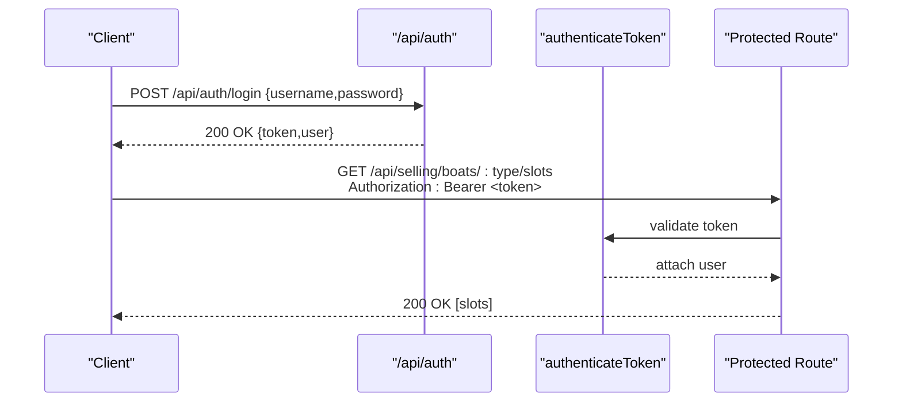

# API Reference

<cite>
**Referenced Files in This Document**
- [index.js](file://server/index.js)
- [auth.js](file://server/auth.js)
- [selling.mjs](file://server/selling.mjs)
- [admin.mjs](file://server/admin.mjs)
- [owner.mjs](file://server/owner.mjs)
- [dispatcher-shift.mjs](file://server/dispatcher-shift.mjs)
- [dispatcher-shift-ledger.mjs](file://server/dispatcher-shift-ledger.mjs)
- [trip-templates.mjs](file://server/trip-templates.mjs)
- [schedule-template-items.mjs](file://server/schedule-template-items.mjs)
- [sales-transactions.mjs](file://server/sales-transactions.mjs)
- [db.js](file://server/db.js)
- [ownerSetup.mjs](file://server/ownerSetup.mjs)
</cite>

## Table of Contents
1. [Introduction](#introduction)
2. [Project Structure](#project-structure)
3. [Core Components](#core-components)
4. [Architecture Overview](#architecture-overview)
5. [Detailed Component Analysis](#detailed-component-analysis)
6. [Dependency Analysis](#dependency-analysis)
7. [Performance Considerations](#performance-considerations)
8. [Troubleshooting Guide](#troubleshooting-guide)
9. [Conclusion](#conclusion)
10. [Appendices](#appendices)

## Introduction
This document describes all REST API endpoints for the boat ticket application. It covers authentication, selling, admin, owner, and dispatcher APIs with HTTP methods, URL patterns, request/response formats, authentication requirements, and error handling. Practical cURL examples and common use cases are included, along with parameter validation notes, response status codes, and security considerations.

## Project Structure
The server mounts route groups under the /api namespace:
- /api/auth: authentication endpoints
- /api/selling: ticket selling, slot availability, presales, and trip templates
- /api/admin: administrative operations (users, boats, slots, settings)
- /api/owner: analytics and reporting
- /api/dispatcher: dispatcher shift operations and ledger summaries

**Diagram sources**
- [index.js](file://server/index.js#L25-L40)

**Section sources**
- [index.js](file://server/index.js#L25-L40)

## Core Components
- Authentication middleware enforces JWT-based access and role checks.
- Selling module handles ticket sales, seat availability, presales, and slot resolution.
- Admin module manages users, boats, slots, and system settings.
- Owner module exposes analytics and reporting endpoints.
- Dispatcher module supports shift deposits and ledger summaries.

**Section sources**
- [auth.js](file://server/auth.js#L10-L75)
- [selling.mjs](file://server/selling.mjs#L442-L638)
- [admin.mjs](file://server/admin.mjs#L17-L549)
- [owner.mjs](file://server/owner.mjs#L118-L512)
- [dispatcher-shift.mjs](file://server/dispatcher-shift.mjs#L7-L59)
- [dispatcher-shift-ledger.mjs](file://server/dispatcher-shift-ledger.mjs#L78-L350)

## Architecture Overview
High-level API flow:
- Clients call /api/auth/login to obtain a JWT.
- Subsequent requests include Authorization: Bearer <token>.
- Routes enforce role-based access (seller, dispatcher, admin, owner).
- Data access uses SQLite via better-sqlite3 with migrations applied at startup.

**Diagram sources**
- [auth.js](file://server/auth.js#L120-L151)
- [selling.mjs](file://server/selling.mjs#L462-L638)

## Detailed Component Analysis

### Authentication API
- Purpose: Login, logout, and token validation.
- Base Path: /api/auth

Endpoints:
- POST /api/auth/login
  - Description: Authenticate user and return JWT.
  - Auth: None
  - Request JSON:
    - username: string (required)
    - password: string (required)
  - Responses:
    - 200 OK: { token: string, user: { id, username, role } }
    - 400 Bad Request: { error: string }
    - 401 Unauthorized: { error: string }
    - 500 Internal Server Error: { error: string }
  - cURL example:
    - curl -X POST https://host/api/auth/login -H "Content-Type: application/json" -d '{"username":"john","password":"pass"}'

- GET /api/auth/me
  - Description: Get current user profile.
  - Auth: Bearer JWT
  - Responses:
    - 200 OK: { id, username, role }
    - 401 Unauthorized: { error: string }
    - 403 Forbidden: { error: string }
    - 500 Internal Server Error: { error: string }

Security and validation:
- Token verification uses HS256 with a server secret.
- Active user check enforced during token validation.
- Password comparison supports bcrypt or plain text fallback for development.

**Section sources**
- [auth.js](file://server/auth.js#L120-L151)

### Selling API
- Purpose: Ticket management, seat selection, presale handling, and transaction processing.
- Base Path: /api/selling

Common roles: seller, dispatcher, admin, owner (some endpoints)

Endpoints:
- GET /api/selling/boats
  - Description: List active boats.
  - Auth: Bearer JWT, role: seller/dispatcher/admin/owner
  - Responses: 200 OK [boats], 500 Internal Server Error

- GET /api/selling/boats/:type/slots
  - Description: List available generated slots for a boat type (speed/cruise/banana).
  - Auth: Bearer JWT, role: seller/dispatcher/admin/owner
  - Query: none
  - Responses: 200 OK { slots, meta }, 400 Bad Request, 500 Internal Server Error
  - Notes: Filters out slots with zero seats and future trips.

- POST /api/selling/presales
  - Description: Create a presale (booking) with seat selection and prepayment.
  - Auth: Bearer JWT, role: seller/dispatcher
  - Request JSON:
    - slotUid: string (required)
    - customerName: string (required)
    - customerPhone: string (required)
    - numberOfSeats: integer or tickets object (mutually exclusive)
    - tickets: { adult, teen, child } (optional)
    - prepaymentAmount: integer (optional)
    - prepaymentComment: string (optional)
    - payment_method: "CASH"|"CARD"|"MIXED"|"CASHLESS" (optional)
    - cash_amount/card_amount: integers (optional, for mixed)
  - Responses:
    - 201 Created: { ok: true, presale_id, ... }
    - 400 Bad Request: { ok: false, code, message }
    - 409 Conflict: { ok: false, code, message }
    - 500 Internal Server Error: { ok: false, error }

- POST /api/selling/presales/:id/confirm
  - Description: Confirm a presale and issue tickets.
  - Auth: Bearer JWT, role: seller/dispatcher
  - Path Params: id (presale id)
  - Responses:
    - 200 OK: { ok: true, tickets: [...] }
    - 400 Bad Request: { ok: false, code, message }
    - 404 Not Found: { ok: false, error }
    - 500 Internal Server Error: { ok: false, error }

- POST /api/selling/presales/:id/cancel
  - Description: Cancel a presale and release seats.
  - Auth: Bearer JWT, role: seller/dispatcher
  - Path Params: id (presale id)
  - Responses:
    - 200 OK: { ok: true }
    - 404 Not Found: { ok: false, error }
    - 500 Internal Server Error: { ok: false, error }

- GET /api/selling/presales/:id/tickets
  - Description: Retrieve issued tickets for a presale.
  - Auth: Bearer JWT, role: seller/dispatcher
  - Path Params: id (presale id)
  - Responses: 200 OK [tickets], 404 Not Found, 500 Internal Server Error

Validation and constraints:
- Seat capacity checks for manual and generated slots.
- Ticket breakdown validation (adult/teen/child) and total seat limits.
- Time and duration constraints vary by boat type (banana vs others).
- Prepayment and payment method validation.

**Section sources**
- [selling.mjs](file://server/selling.mjs#L442-L638)
- [selling.mjs](file://server/selling.mjs#L642-L820)

### Admin API
- Purpose: User management, boat administration, and system configuration.
- Base Path: /api/admin
- Auth: Bearer JWT, role: admin/owner

Endpoints:
- GET /api/admin/boats
  - Query: showArchived=true|false
  - Responses: 200 OK [boats], 500 Internal Server Error

- GET /api/admin/boats/:id
  - Responses: 200 OK boat, 404 Not Found, 500 Internal Server Error

- POST /api/admin/boats
  - Request JSON: { name, type }
  - Responses: 201 Created, 400 Bad Request, 500 Internal Server Error

- PUT /api/admin/boats/:id
  - Request JSON: { name, type }
  - Responses: 200 OK, 400 Bad Request, 404 Not Found, 500 Internal Server Error

- PATCH /api/admin/boats/:id/active
  - Request JSON: { is_active: 0|1 }
  - Responses: 200 OK, 400 Bad Request, 404 Not Found, 500 Internal Server Error

- DELETE /api/admin/boats/:id
  - Behavior: soft-delete if dependencies exist; otherwise hard-delete.
  - Responses: 200 OK { ok: true } or { ok: true, message, slots, generated_slots }, 404 Not Found, 500 Internal Server Error

- GET /api/admin/boats/:id/slots
  - Responses: 200 OK [slots], 404 Not Found, 500 Internal Server Error

- POST /api/admin/boats/:id/slots
  - Request JSON: { time, price, capacity, duration_minutes, price_adult, price_child, price_teen }
  - Responses: 201 Created, 400 Bad Request, 404 Not Found, 500 Internal Server Error

- GET /api/admin/users
  - Query: role=seller|dispatcher|admin
  - Responses: 200 OK [users], 500 Internal Server Error

- POST /api/admin/users
  - Request JSON: { username, password, role }
  - Responses: 201 Created, 400 Bad Request, 409 Conflict, 500 Internal Server Error

- PATCH /api/admin/users/:id
  - Request JSON: { is_active: 0|1 }
  - Responses: 200 OK, 400 Bad Request, 404 Not Found, 500 Internal Server Error

- POST /api/admin/users/:id/reset-password
  - Request JSON: { password }
  - Responses: 200 OK, 400 Bad Request, 404 Not Found, 500 Internal Server Error

- DELETE /api/admin/users/:id
  - Responses: 200 OK, 400 Bad Request, 404 Not Found, 500 Internal Server Error

- GET /api/admin/stats
  - Description: Dashboard stats for today (revenue, tickets sold, trips).
  - Responses: 200 OK { totalRevenue, totalTicketsSold, speedTrips, cruiseTrips }, 500 Internal Server Error

- GET /api/admin/work-zone
  - Responses: 200 OK { coordinates, geometry }, 500 Internal Server Error

- GET /api/admin/settings/working-zone
  - Legacy endpoint.
  - Responses: 200 OK { coordinates, geometry }, 500 Internal Server Error

- PUT /api/admin/settings/working-zone
  - Request JSON: { coordinates, geometry }
  - Responses: 200 OK, 400 Bad Request, 500 Internal Server Error

**Section sources**
- [admin.mjs](file://server/admin.mjs#L17-L549)

### Owner API
- Purpose: Analytics, reporting, and business insights.
- Base Path: /api/owner
- Auth: Bearer JWT, role: owner

Endpoints:
- GET /api/owner/money/summary?preset=today|yesterday|7d|30d|90d|last_nonzero_day
  - Responses: 200 OK { ok, data: { preset, range, totals: { revenue, cash, card } }, meta }, 500 Internal Server Error

- GET /api/owner/money/pending-by-day?day=today|tomorrow|day2
  - Responses: 200 OK { ok, data: { day, sum|sum_pending|amount|total, tickets, trips }, meta }, 500 Internal Server Error

- GET /api/owner/money/compare-days?preset=7d|30d|90d
  - Responses: 200 OK { ok, data: { preset, range, rows: [{ day, revenue, cash, card }] }, meta }, 500 Internal Server Error

- GET /api/owner/boats?preset=today|yesterday|7d|month|all
  - Responses: 200 OK { ok, data: { preset, range, totals, boats: [{ boat_id, boat_name, boat_type, revenue, tickets, trips, source }] }, meta }, 500 Internal Server Error

- GET /api/owner/money/collected-today-by-tripday
  - Responses: 200 OK { ok, data: { collected_day, by_trip_day: { today: {...}, tomorrow: {...}, day2: {...} } }, meta }, 500 Internal Server Error

Notes:
- Money endpoints aggregate by “trip day” using generated_slots or fallbacks.
- Percent fill estimation uses generated_slots seats_left when available.

**Section sources**
- [owner.mjs](file://server/owner.mjs#L118-L512)

### Dispatcher API
- Purpose: Trip management, passenger handling, shift operations.
- Base Path: /api/dispatcher
- Auth: Bearer JWT, role: dispatcher

Endpoints:
- POST /api/dispatcher/shift/deposit
  - Description: Record a dispatcher shift deposit (cash/card/terminal).
  - Request JSON: { type: "DEPOSIT_TO_OWNER_CASH"|"DEPOSIT_TO_OWNER_TERMINAL"|"SALARY_PAYOUT_CASH", amount: number }
  - Responses: 200 OK { ok: true }, 400 Bad Request, 500 Internal Server Error

- GET /api/dispatcher/shift-ledger/summary?business_day=YYYY-MM-DD
  - Description: Shift summary with accepted sales and deposits.
  - Responses: 200 OK { ok, business_day, is_closed, total_revenue, cash_total, card_total, sellers, ... }, 500 Internal Server Error

- GET /api/dispatcher/shift/summary
  - Alias for shift ledger summary.

**Section sources**
- [dispatcher-shift.mjs](file://server/dispatcher-shift.mjs#L7-L59)
- [dispatcher-shift-ledger.mjs](file://server/dispatcher-shift-ledger.mjs#L78-L350)

### Trip Templates API
- Purpose: Manage trip templates for scheduling.
- Base Path: /api/selling/trip-templates
- Auth: Bearer JWT, role: dispatcher

Endpoints:
- GET /api/selling/trip-templates/templates
  - Responses: 200 OK [templates], 500 Internal Server Error

- GET /api/selling/trip-templates/templates/:id
  - Responses: 200 OK template, 404 Not Found, 500 Internal Server Error

- POST /api/selling/trip-templates/templates
  - Request JSON: { product_type, time, duration_minutes, capacity, price_adult, price_child, price_teen?, is_active? }
  - Responses: 201 Created, 400 Bad Request, 500 Internal Server Error

- PATCH /api/selling/trip-templates/templates/:id
  - Request JSON: partial fields (time, duration_minutes, capacity, price_* fields, is_active)
  - Responses: 200 OK, 400 Bad Request, 404 Not Found, 500 Internal Server Error

- DELETE /api/selling/trip-templates/templates/:id
  - Responses: 200 OK, 404 Not Found, 500 Internal Server Error

**Section sources**
- [trip-templates.mjs](file://server/trip-templates.mjs#L48-L319)

### Schedule Template Items API
- Purpose: Define recurring schedules with weekday masks and generate trips.
- Base Path: /api/selling/schedule-template-items
- Auth: Bearer JWT, role: dispatcher

Endpoints:
- GET /api/selling/schedule-template-items
  - Responses: 200 OK [items], 500 Internal Server Error

- GET /api/selling/schedule-template-items/:id
  - Responses: 200 OK { ok, item }, 404 Not Found, 500 Internal Server Error

- POST /api/selling/schedule-template-items
  - Request JSON: { name?, boat_id?, type, departure_time, duration_minutes, capacity, price_adult, price_child, price_teen?, weekdays_mask, is_active? }
  - Responses: 201 Created { ok, item }, 400 Bad Request, 404 Not Found, 409 Conflict, 500 Internal Server Error

- PATCH /api/selling/schedule-template-items/:id
  - Request JSON: partial fields (name, boat_id, type, departure_time, duration_minutes, capacity, price_*, weekdays_mask, is_active)
  - Responses: 200 OK { ok, item }, 400 Bad Request, 404 Not Found, 500 Internal Server Error

- DELETE /api/selling/schedule-template-items/:id
  - Query: deleteFutureTrips=true
  - Responses: 200 OK { ok, message, id, deletedFutureTrips?, futureTripsDeleted? }, 404 Not Found, 409 Conflict, 500 Internal Server Error

- POST /api/selling/schedule-template-items/generate
  - Request JSON: { date_from: "YYYY-MM-DD", date_to: "YYYY-MM-DD" }
  - Responses: 200 OK { ok, message, generated, skipped, skip_reasons, generated_slots?, skipped_slots? }, 400 Bad Request, 500 Internal Server Error

- DELETE /api/selling/trips-for-deleted-boats
  - Auth: admin
  - Responses: 200 OK { ok, message, deleted, deleted_generated, deleted_manual }, 500 Internal Server Error

**Section sources**
- [schedule-template-items.mjs](file://server/schedule-template-items.mjs#L65-L800)

### Sales Transactions Canonical Layer
- Purpose: Owner analytics layer that records sales transactions after trip completion.
- Base Path: internal (used by scheduler)
- Behavior:
  - Creates sales_transactions table if missing.
  - Inserts canonical rows for generated slots after trip completion.
  - Supports idempotent inserts and safe schema evolution.

**Section sources**
- [sales-transactions.mjs](file://server/sales-transactions.mjs#L34-L237)

## Dependency Analysis
Key runtime dependencies and relationships:
- Express app mounts route modules under /api/*.
- All protected routes depend on authenticateToken middleware.
- Role guards (isAdmin, canSell, canDispatchManageSlots, canOwnerAccess) enforce permissions.
- SQLite schema is initialized and migrated at startup.

**Diagram sources**
- [index.js](file://server/index.js#L25-L40)

**Section sources**
- [index.js](file://server/index.js#L25-L40)
- [auth.js](file://server/auth.js#L10-L75)
- [db.js](file://server/db.js#L38-L800)
- [ownerSetup.mjs](file://server/ownerSetup.mjs#L19-L98)

## Performance Considerations
- SQLite WAL mode enabled for concurrency.
- Indexes exist for primary tables (e.g., generated_slots unique index).
- Seat availability recalculated efficiently using aggregated counts.
- Schema-safe queries with column existence checks for analytics.

[No sources needed since this section provides general guidance]

## Troubleshooting Guide
Common issues and resolutions:
- 401 Unauthorized on protected endpoints: ensure Authorization header with valid Bearer token.
- 403 Forbidden: verify user role meets endpoint requirements.
- Capacity exceeded errors: reduce requested seats or choose another slot.
- Validation errors on presales: check required fields and seat/ticket breakdown rules.
- Schema migration failures: review logs for failed ALTER TABLE statements.

**Section sources**
- [auth.js](file://server/auth.js#L10-L40)
- [selling.mjs](file://server/selling.mjs#L52-L94)
- [db.js](file://server/db.js#L38-L800)

## Conclusion
The API provides comprehensive coverage for authentication, selling, administration, owner analytics, and dispatcher operations. Use Bearer tokens for protected endpoints, adhere to role-based access controls, and follow the validation rules documented above. For production deployments, secure tokens, monitor rate limits, and maintain consistent schema migrations.

[No sources needed since this section summarizes without analyzing specific files]

## Appendices

### Authentication Requirements
- All protected endpoints require Authorization: Bearer <token>.
- Token must be signed by the server and not expired.
- User must be active.

**Section sources**
- [auth.js](file://server/auth.js#L10-L40)

### Rate Limiting and Security
- No built-in rate limiter in the provided code.
- Recommended: apply rate limiting at reverse proxy or middleware level.
- Transport security: use HTTPS/TLS in production.
- Token storage: clients should persist securely and avoid logging tokens.

[No sources needed since this section provides general guidance]

### API Versioning Strategy
- No explicit versioning scheme observed in the codebase.
- Recommendation: introduce /api/v1/ prefix and evolve under version control.

[No sources needed since this section provides general guidance]

### Database Schema Notes
- Users table supports roles: seller, dispatcher, admin, owner.
- Presales and tickets tables include payment and status fields.
- Generated slots and schedule templates enable dynamic scheduling.

**Section sources**
- [db.js](file://server/db.js#L38-L800)