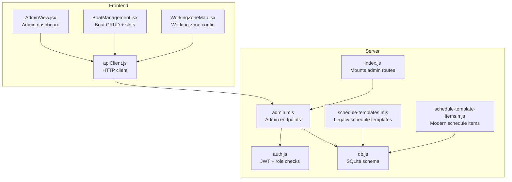
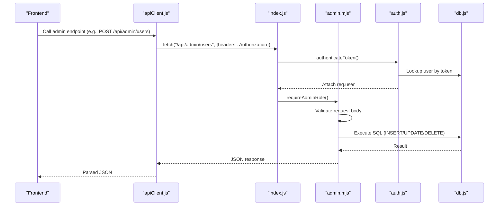
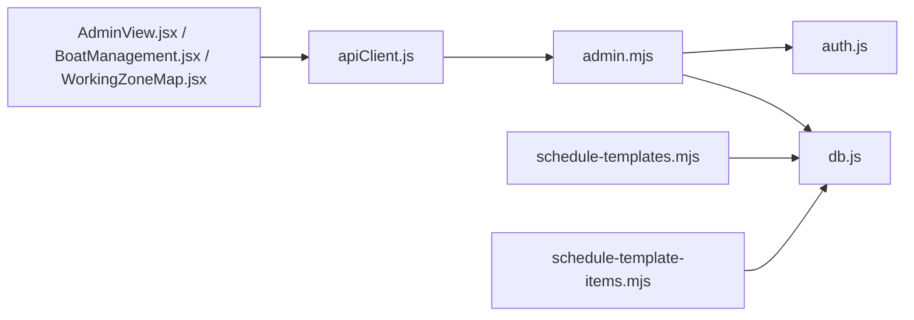

# Admin API

<cite>
**Referenced Files in This Document**
- [server/admin.mjs](file://server/admin.mjs)
- [server/auth.js](file://server/auth.js)
- [server/index.js](file://server/index.js)
- [server/db.js](file://server/db.js)
- [server/schedule-templates.mjs](file://server/schedule-templates.mjs)
- [server/schedule-template-items.mjs](file://server/schedule-template-items.mjs)
- [src/views/AdminView.jsx](file://src/views/AdminView.jsx)
- [src/components/admin/BoatManagement.jsx](file://src/components/admin/BoatManagement.jsx)
- [src/components/admin/WorkingZoneMap.jsx](file://src/components/admin/WorkingZoneMap.jsx)
- [src/utils/apiClient.js](file://src/utils/apiClient.js)
</cite>

## Table of Contents
1. [Introduction](#introduction)
2. [Project Structure](#project-structure)
3. [Core Components](#core-components)
4. [Architecture Overview](#architecture-overview)
5. [Detailed Component Analysis](#detailed-component-analysis)
6. [Dependency Analysis](#dependency-analysis)
7. [Performance Considerations](#performance-considerations)
8. [Troubleshooting Guide](#troubleshooting-guide)
9. [Conclusion](#conclusion)
10. [Appendices](#appendices)

## Introduction
This document provides comprehensive API documentation for administrative endpoints. It covers user management, boat fleet administration, system configuration, schedule template management, and working zone configuration. The documentation includes request/response schemas, authentication requirements (admin role), validation rules, examples, and security considerations.

## Project Structure
The administrative API is implemented in the server module and mounted under `/api/admin`. Authentication middleware enforces role-based access, requiring either admin or owner roles for administrative operations. The frontend integrates with these endpoints through a shared API client.

**Diagram sources**
- [server/index.js](file://server/index.js#L39-L40)
- [server/admin.mjs](file://server/admin.mjs#L1-L549)
- [server/auth.js](file://server/auth.js#L1-L154)
- [server/db.js](file://server/db.js#L1-L800)
- [server/schedule-templates.mjs](file://server/schedule-templates.mjs#L1-L760)
- [server/schedule-template-items.mjs](file://server/schedule-template-items.mjs#L1-L825)
- [src/views/AdminView.jsx](file://src/views/AdminView.jsx#L1-L382)
- [src/components/admin/BoatManagement.jsx](file://src/components/admin/BoatManagement.jsx#L1-L784)
- [src/components/admin/WorkingZoneMap.jsx](file://src/components/admin/WorkingZoneMap.jsx#L1-L117)
- [src/utils/apiClient.js](file://src/utils/apiClient.js#L1-L360)

**Section sources**
- [server/index.js](file://server/index.js#L39-L40)
- [server/admin.mjs](file://server/admin.mjs#L1-L549)
- [server/auth.js](file://server/auth.js#L1-L154)
- [server/db.js](file://server/db.js#L1-L800)

## Core Components
- Admin router: Provides user management, boat management, statistics, and working zone configuration endpoints.
- Authentication: JWT-based middleware with role checks (admin/owner).
- Database: SQLite schema with tables for users, boats, boat_slots, schedule templates, and generated slots.
- Schedule template systems: Legacy schedule templates and modern schedule template items with generation logic.

Key responsibilities:
- Enforce admin/owner role for administrative endpoints.
- Validate inputs and enforce business rules (e.g., boat types, pricing, capacity).
- Provide CRUD operations for users and boats, plus slot management.
- Manage working zone configuration persisted as JSON in settings.

**Section sources**
- [server/admin.mjs](file://server/admin.mjs#L1-L549)
- [server/auth.js](file://server/auth.js#L1-L154)
- [server/db.js](file://server/db.js#L1-L800)

## Architecture Overview
Administrative endpoints are protected by JWT authentication and role checks. Requests flow from the frontend through the API client to Express routes, which validate inputs, apply business rules, and interact with the SQLite database.

**Diagram sources**
- [src/utils/apiClient.js](file://src/utils/apiClient.js#L23-L88)
- [server/index.js](file://server/index.js#L39-L40)
- [server/auth.js](file://server/auth.js#L10-L40)
- [server/admin.mjs](file://server/admin.mjs#L290-L329)
- [server/db.js](file://server/db.js#L1-L800)

## Detailed Component Analysis

### Authentication and Authorization
- Token verification: Uses JWT secret to verify tokens and attach user record to request.
- Role enforcement: Admin endpoints require admin or owner role; owner endpoints require owner role.
- Active user check: Disabled users cannot access protected endpoints.

Security considerations:
- Tokens must be sent in Authorization header as Bearer token.
- Admin endpoints reject non-admin/owner users.
- Password hashing uses bcrypt; fallback to bcryptjs if unavailable.

**Section sources**
- [server/auth.js](file://server/auth.js#L10-L40)
- [server/auth.js](file://server/auth.js#L42-L71)
- [server/auth.js](file://server/auth.js#L120-L151)

### User Management Endpoints
- GET /api/admin/users
  - Query parameters: role (optional filter).
  - Response: Array of users with id, username, role, is_active.
  - Validation: None required; returns filtered list by role if provided.
  - Security: Requires admin/owner role.

- POST /api/admin/users
  - Request body: username, password, role.
  - Validation:
    - username/password/role required.
    - username uniqueness enforced.
    - role must be one of seller, dispatcher, admin.
    - password length >= 4 enforced.
  - Behavior: Creates user with is_active = 1 and hashed password.
  - Response: Created user object.
  - Security: Requires admin/owner role.

- PATCH /api/admin/users/:id
  - Request body: is_active (0 or 1).
  - Validation: is_active must be 0 or 1.
  - Behavior: Updates user activity status.
  - Response: Updated user object.
  - Security: Requires admin/owner role.

- POST /api/admin/users/:id/reset-password
  - Request body: password.
  - Validation: password must be string and length >= 4.
  - Behavior: Resets user password with bcrypt hash.
  - Response: { ok: true, userId }.
  - Security: Requires admin/owner role.

- DELETE /api/admin/users/:id
  - Validation: id must be finite number; self-deletion blocked.
  - Behavior: Soft deletes user by setting is_active = 0.
  - Response: { ok: true, userId }.
  - Security: Requires admin/owner role.

Example workflows:
- Create a new seller:
  - POST /api/admin/users with { username, password, role: "seller" }.
  - Response includes created user.
- Disable a user:
  - PATCH /api/admin/users/:id with { is_active: 0 }.
- Reset a user’s password:
  - POST /api/admin/users/:id/reset-password with { password: "..." }.

Bulk operations:
- Not supported in current implementation. Use multiple PATCH requests for batch updates.

Validation errors:
- 400: Invalid input (missing fields, wrong types).
- 409: Conflict (e.g., user already exists).
- 404: Not found (user not found).
- 403: Forbidden (insufficient permissions).

**Section sources**
- [server/admin.mjs](file://server/admin.mjs#L266-L288)
- [server/admin.mjs](file://server/admin.mjs#L290-L329)
- [server/admin.mjs](file://server/admin.mjs#L331-L354)
- [server/admin.mjs](file://server/admin.mjs#L356-L387)
- [server/admin.mjs](file://server/admin.mjs#L389-L415)

### Boat Management Endpoints
- GET /api/admin/boats
  - Query parameters: showArchived (boolean).
  - Behavior: Returns all boats if showArchived=true; otherwise only active boats.
  - Response: Array of { id, name, type, is_active }.
  - Security: Requires admin/owner role.

- GET /api/admin/boats/:id
  - Path parameter: id.
  - Response: Boat object { id, name, type, is_active }.
  - Security: Requires admin/owner role.

- POST /api/admin/boats
  - Request body: name, type.
  - Validation:
    - name and type required.
    - type must be one of speed, cruise, banana.
  - Behavior: Inserts new boat with is_active = 1.
  - Response: { boat: Boat }.
  - Security: Requires admin/owner role.

- PUT /api/admin/boats/:id
  - Path parameter: id.
  - Request body: name, type.
  - Validation:
    - name and type required.
    - type must be one of speed, cruise, banana.
  - Behavior: Updates existing boat.
  - Response: { boat: UpdatedBoat }.
  - Security: Requires admin/owner role.

- PATCH /api/admin/boats/:id/active
  - Path parameter: id.
  - Request body: is_active (0 or 1).
  - Validation: is_active must be 0 or 1.
  - Behavior: Toggles boat activity.
  - Response: { boat: UpdatedBoat }.
  - Security: Requires admin/owner role.

- DELETE /api/admin/boats/:id
  - Path parameter: id.
  - Behavior:
    - If boat has dependencies (slots or generated_slots), soft delete by setting is_active = 0 and return counts.
    - Otherwise, hard delete.
  - Response:
    - Soft delete: { ok: true, message, slots, generated_slots }.
    - Hard delete: { ok: true }.
  - Security: Requires admin/owner role.

- GET /api/admin/boats/:id/slots
  - Path parameter: id.
  - Response: Array of slots with fields including time, price, capacity, duration_minutes, price_adult/child/teen, seats_left, is_active.
  - Security: Requires admin/owner role.

- POST /api/admin/boats/:id/slots
  - Path parameter: id.
  - Request body: time, price, capacity, duration_minutes, price_adult, price_child, price_teen.
  - Validation:
    - time and capacity required.
    - duration_minutes defaults to 60 if omitted.
    - price_* fields optional; capacity initializes seats_left.
  - Behavior: Creates a new slot for the specified boat.
  - Response: New slot object.
  - Security: Requires admin/owner role.

Example workflows:
- Create a new banana boat:
  - POST /api/admin/boats with { name: "Boat 1", type: "banana" }.
- Add a slot for a speed boat:
  - POST /api/admin/boats/:id/slots with { time: "12:00", capacity: 12, duration_minutes: 60 }.
- Archive a boat with existing slots:
  - DELETE /api/admin/boats/:id returns message indicating soft archive and counts.

Bulk operations:
- Not supported. Use multiple POST/PUT/DELETE requests.

Validation errors:
- 400: Invalid input (missing fields, wrong types).
- 404: Not found (boat/slot not found).
- 403: Forbidden (insufficient permissions).

**Section sources**
- [server/admin.mjs](file://server/admin.mjs#L17-L40)
- [server/admin.mjs](file://server/admin.mjs#L42-L57)
- [server/admin.mjs](file://server/admin.mjs#L59-L83)
- [server/admin.mjs](file://server/admin.mjs#L85-L114)
- [server/admin.mjs](file://server/admin.mjs#L116-L139)
- [server/admin.mjs](file://server/admin.mjs#L141-L180)
- [server/admin.mjs](file://server/admin.mjs#L182-L216)
- [server/admin.mjs](file://server/admin.mjs#L218-L264)

### System Configuration Endpoints
- GET /api/admin/stats
  - Response: { totalRevenue, totalTicketsSold, speedTrips, cruiseTrips }.
  - Behavior: Aggregates revenue and ticket counts for today, and counts of speed/cruise trips.
  - Security: Requires admin/owner role.

- GET /api/admin/work-zone
  - Response: Parsed JSON object from settings key "work_zone".
  - Behavior: Returns current working zone configuration or {} if not set.
  - Security: Requires admin/owner role.

- GET /api/admin/settings/working-zone (legacy)
  - Response: Same as above for backward compatibility.
  - Security: Requires admin/owner role.

- PUT /api/admin/settings/working-zone
  - Request body: { coordinates, geometry }.
  - Validation: geometry required.
  - Behavior: Stores JSON-encoded work zone configuration under settings key "work_zone".
  - Response: { ok: true, coordinates, geometry }.
  - Security: Requires admin/owner role.

Example workflow:
- Set working zone:
  - PUT /api/admin/settings/working-zone with { geometry: { ... } }.
- Retrieve working zone:
  - GET /api/admin/work-zone returns the stored configuration.

Validation errors:
- 400: Invalid input (missing geometry).
- 403: Forbidden (insufficient permissions).

**Section sources**
- [server/admin.mjs](file://server/admin.mjs#L418-L472)
- [server/admin.mjs](file://server/admin.mjs#L474-L496)
- [server/admin.mjs](file://server/admin.mjs#L498-L520)
- [server/admin.mjs](file://server/admin.mjs#L522-L547)

### Schedule Template Management Endpoints
These endpoints manage schedule templates and generated slots. They are primarily used by dispatchers but are documented here for completeness.

- GET /api/selling/schedule-templates
  - Response: Array of schedule templates with weekday, time, product_type, capacity, prices, duration_minutes, is_active.
  - Validation: None required.
  - Security: Requires dispatcher role.

- POST /api/selling/schedule-templates
  - Request body: weekday (1-7), time (HH:MM), product_type (speed/cruise/banana), capacity, price_adult, price_child, duration_minutes, optional boat_id/boat_type/is_active.
  - Validation:
    - time format HH:MM, hours 08-21, minutes 00/30.
    - duration_minutes depends on product_type (40 for banana, 60/120/180 for others).
    - price_adult/price_child must be positive.
    - capacity must be 12 for banana.
    - boat_id must match boat type if provided.
  - Behavior: Creates template and optionally auto-generates slots for next 14 days.
  - Response: Created template.
  - Security: Requires dispatcher role.

- PATCH /api/selling/schedule-templates/:id
  - Path parameter: id.
  - Request body: Partial fields (weekday/time/product_type/duration_minutes/capacity/price_*).
  - Validation: Same as POST for updated fields.
  - Behavior: Updates template; returns updated template.
  - Response: Updated template.
  - Security: Requires dispatcher role.

- DELETE /api/selling/schedule-templates/:id
  - Path parameter: id.
  - Behavior: Deletes template.
  - Response: { message, id }.
  - Security: Requires dispatcher role.

- POST /api/selling/schedule-templates/:id/generate
  - Path parameter: id.
  - Request body: { fromDate, days }.
  - Validation: fromDate required (YYYY-MM-DD), days optional positive integer.
  - Behavior: Generates slots for the template within the date range.
  - Response: { ok, message, created, skipped, generated_slots, skipped_slots }.
  - Security: Requires dispatcher role.

- POST /api/selling/schedule-templates/generate
  - Request body: { date_from, date_to }.
  - Validation: Both dates required (YYYY-MM-DD), date_from <= date_to.
  - Behavior: Generates slots for all active templates within the date range.
  - Response: { message, generated, skipped, generated_slots, skipped_slots }.
  - Security: Requires dispatcher role.

- GET /api/selling/generated-slots
  - Query parameters: date_from, date_to, or date.
  - Response: Array of generated slots with boat details.
  - Security: Requires dispatcher role.

- GET /api/selling/generated-slots/active
  - Response: Array of active, available slots (is_active=1, seats_left>0, boat is_active=1).
  - Security: Requires seller/dispatcher.

**Section sources**
- [server/schedule-templates.mjs](file://server/schedule-templates.mjs#L48-L66)
- [server/schedule-templates.mjs](file://server/schedule-templates.mjs#L98-L218)
- [server/schedule-templates.mjs](file://server/schedule-templates.mjs#L387-L539)
- [server/schedule-templates.mjs](file://server/schedule-templates.mjs#L541-L569)
- [server/schedule-templates.mjs](file://server/schedule-templates.mjs#L305-L385)
- [server/schedule-templates.mjs](file://server/schedule-templates.mjs#L571-L683)
- [server/schedule-templates.mjs](file://server/schedule-templates.mjs#L685-L725)
- [server/schedule-templates.mjs](file://server/schedule-templates.mjs#L727-L758)

### Modern Schedule Template Items Endpoints
- GET /api/selling/schedule-template-items
  - Response: Array of items with formatted weekdays.
  - Security: Requires dispatcher role.

- GET /api/selling/schedule-template-items/:id
  - Path parameter: id.
  - Response: Item with formatted weekdays.
  - Security: Requires dispatcher role.

- POST /api/selling/schedule-template-items
  - Request body: name, boat_id, type, departure_time, duration_minutes, capacity, price_adult, price_child, price_teen, weekdays_mask, optional is_active.
  - Validation:
    - departure_time, type, capacity, price_adult, price_child, duration_minutes, weekdays_mask required.
    - time format and duration constraints.
    - price_teen forbidden for banana.
    - capacity must be 12 for banana.
    - weekdays_mask must be non-zero.
    - boat_id must match type if provided.
    - Duplicate prevention for same parameters.
  - Response: { ok: true, item }.
  - Security: Requires dispatcher role.

- PATCH /api/selling/schedule-template-items/:id
  - Path parameter: id.
  - Request body: Partial fields (same validations as POST).
  - Response: { ok: true, item }.
  - Security: Requires dispatcher role.

- DELETE /api/selling/schedule-template-items/:id
  - Path parameter: id.
  - Query parameter: deleteFutureTrips (optional).
  - Validation: Conflicts with existing sales or invalid prices blocked.
  - Behavior: Deletes item; optionally deletes future trips if deleteFutureTrips=true.
  - Response: { ok: true, message, id, deletedFutureTrips, futureTripsDeleted }.
  - Security: Requires dispatcher role.

- POST /api/selling/schedule-template-items/generate
  - Request body: { date_from, date_to }.
  - Validation: Same as schedule-templates/generate.
  - Behavior: Generates slots for all active items within the date range, respecting boat active status and existing slots.
  - Response: { ok, message, generated, skipped, skip_reasons, generated_slots, skipped_slots }.
  - Security: Requires dispatcher role.

- DELETE /api/selling/trips-for-deleted-boats
  - Behavior: Removes generated/manual slots associated with deleted boats.
  - Response: { ok, message, deleted, deleted_generated, deleted_manual }.
  - Security: Requires admin role.

**Section sources**
- [server/schedule-template-items.mjs](file://server/schedule-template-items.mjs#L65-L90)
- [server/schedule-template-items.mjs](file://server/schedule-template-items.mjs#L92-L124)
- [server/schedule-template-items.mjs](file://server/schedule-template-items.mjs#L126-L284)
- [server/schedule-template-items.mjs](file://server/schedule-template-items.mjs#L286-L466)
- [server/schedule-template-items.mjs](file://server/schedule-template-items.mjs#L468-L545)
- [server/schedule-template-items.mjs](file://server/schedule-template-items.mjs#L547-L766)
- [server/schedule-template-items.mjs](file://server/schedule-template-items.mjs#L768-L800)

### Working Zone Management Endpoints
- GET /api/admin/work-zone
  - Response: JSON object from settings key "work_zone" or {}.
  - Security: Requires admin/owner role.

- PUT /api/admin/settings/working-zone
  - Request body: { coordinates, geometry }.
  - Validation: geometry required.
  - Behavior: Stores JSON-encoded work zone configuration.
  - Response: { ok: true, coordinates, geometry }.
  - Security: Requires admin/owner role.

Frontend integration:
- AdminView uses apiClient.getWorkingZone and apiClient.saveWorkingZone to load and persist working zone configuration.

**Section sources**
- [server/admin.mjs](file://server/admin.mjs#L474-L496)
- [server/admin.mjs](file://server/admin.mjs#L522-L547)
- [src/views/AdminView.jsx](file://src/views/AdminView.jsx#L24-L48)
- [src/components/admin/WorkingZoneMap.jsx](file://src/components/admin/WorkingZoneMap.jsx#L24-L45)

## Dependency Analysis
- Admin endpoints depend on:
  - Authentication middleware (JWT + role checks).
  - Database access via db.js for SQLite operations.
  - Business rules enforced in handlers (e.g., boat types, pricing, capacity).
- Schedule template endpoints depend on:
  - Boat type and capacity validation.
  - Unique constraints on generated slots.
  - Boat active status for slot generation.

**Diagram sources**
- [server/admin.mjs](file://server/admin.mjs#L1-L549)
- [server/auth.js](file://server/auth.js#L1-L154)
- [server/db.js](file://server/db.js#L1-L800)
- [server/schedule-templates.mjs](file://server/schedule-templates.mjs#L1-L760)
- [server/schedule-template-items.mjs](file://server/schedule-template-items.mjs#L1-L825)
- [src/views/AdminView.jsx](file://src/views/AdminView.jsx#L1-L382)
- [src/components/admin/BoatManagement.jsx](file://src/components/admin/BoatManagement.jsx#L1-L784)
- [src/components/admin/WorkingZoneMap.jsx](file://src/components/admin/WorkingZoneMap.jsx#L1-L117)
- [src/utils/apiClient.js](file://src/utils/apiClient.js#L1-L360)

**Section sources**
- [server/admin.mjs](file://server/admin.mjs#L1-L549)
- [server/schedule-templates.mjs](file://server/schedule-templates.mjs#L1-L760)
- [server/schedule-template-items.mjs](file://server/schedule-template-items.mjs#L1-L825)

## Performance Considerations
- Database operations:
  - Use prepared statements for all CRUD operations to prevent SQL injection and improve performance.
  - Indexes: Unique constraints on boat_id+time for boat_slots; unique index on generated_slots (trip_date, time, boat_id).
- Validation:
  - Validate inputs early to avoid unnecessary database writes.
- Pagination:
  - Current endpoints return full lists; consider adding pagination for large datasets.
- Caching:
  - Static configuration (e.g., settings) can be cached in memory for frequent reads.

[No sources needed since this section provides general guidance]

## Troubleshooting Guide
Common issues and resolutions:
- Authentication failures:
  - Ensure Authorization header contains a valid Bearer token.
  - Verify token is not expired and user is active.
- Permission denied:
  - Admin endpoints require admin or owner role.
  - Owner endpoints require owner role.
- Validation errors:
  - Check required fields and data types (e.g., is_active must be 0 or 1).
  - Boat type must be one of speed, cruise, banana.
  - Time format must be HH:MM with hours 08-21 and minutes 00/30 for schedule templates.
- Conflict scenarios:
  - User already exists when creating user.
  - Duplicate schedule template items prevented by unique constraints.
  - Cannot delete boat/user if dependencies exist; use soft delete/archive behavior.

**Section sources**
- [server/auth.js](file://server/auth.js#L10-L40)
- [server/admin.mjs](file://server/admin.mjs#L64-L72)
- [server/admin.mjs](file://server/admin.mjs#L152-L159)
- [server/schedule-template-items.mjs](file://server/schedule-template-items.mjs#L230-L240)

## Conclusion
The administrative API provides comprehensive capabilities for managing users, boats, schedule templates, and system configuration. It enforces strict authentication and authorization, validates inputs, and applies business rules. The frontend integrates seamlessly through a shared API client, enabling efficient administrative workflows.

[No sources needed since this section summarizes without analyzing specific files]

## Appendices

### Request/Response Schemas

- User Management
  - POST /api/admin/users
    - Request: { username: string, password: string, role: "seller"|"dispatcher"|"admin" }
    - Response: { id: number, username: string, role: string, is_active: 0|1 }
  - PATCH /api/admin/users/:id
    - Request: { is_active: 0|1 }
    - Response: { id: number, username: string, role: string, is_active: 0|1 }
  - POST /api/admin/users/:id/reset-password
    - Request: { password: string }
    - Response: { ok: true, userId: number }
  - DELETE /api/admin/users/:id
    - Response: { ok: true, userId: number }

- Boat Management
  - POST /api/admin/boats
    - Request: { name: string, type: "speed"|"cruise"|"banana" }
    - Response: { boat: { id: number, name: string, type: string, is_active: 0|1 } }
  - PUT /api/admin/boats/:id
    - Request: { name: string, type: "speed"|"cruise"|"banana" }
    - Response: { boat: { id: number, name: string, type: string, is_active: 0|1 } }
  - PATCH /api/admin/boats/:id/active
    - Request: { is_active: 0|1 }
    - Response: { boat: { id: number, name: string, type: string, is_active: 0|1 } }
  - DELETE /api/admin/boats/:id
    - Response: { ok: true } | { ok: true, message: string, slots: number, generated_slots: number }
  - POST /api/admin/boats/:id/slots
    - Request: { time: string, price?: number, capacity: number, duration_minutes?: number, price_adult?: number, price_child?: number, price_teen?: number }
    - Response: { id: number, boat_id: number, time: string, price: number|null, capacity: number, is_active: 0|1, duration_minutes: number, price_adult: number|null, price_child: number|null, price_teen: number|null, seats_left: number }

- System Configuration
  - GET /api/admin/stats
    - Response: { totalRevenue: number, totalTicketsSold: number, speedTrips: number, cruiseTrips: number }
  - PUT /api/admin/settings/working-zone
    - Request: { coordinates?: any, geometry: any }
    - Response: { ok: true, coordinates?: any, geometry: any }

- Schedule Templates (Modern)
  - POST /api/selling/schedule-template-items
    - Request: { name?: string, boat_id?: number, type: "speed"|"cruise"|"banana", departure_time: string, duration_minutes: number, capacity: number, price_adult: number, price_child: number, price_teen?: number|null, weekdays_mask: number, is_active?: 0|1 }
    - Response: { ok: true, item: any }
  - PATCH /api/selling/schedule-template-items/:id
    - Request: Partial fields (same as POST)
    - Response: { ok: true, item: any }
  - DELETE /api/selling/schedule-template-items/:id
    - Query: deleteFutureTrips?: boolean
    - Response: { ok: true, message: string, id: number, deletedFutureTrips?: boolean, futureTripsDeleted?: number }

**Section sources**
- [server/admin.mjs](file://server/admin.mjs#L290-L329)
- [server/admin.mjs](file://server/admin.mjs#L331-L354)
- [server/admin.mjs](file://server/admin.mjs#L356-L387)
- [server/admin.mjs](file://server/admin.mjs#L389-L415)
- [server/admin.mjs](file://server/admin.mjs#L59-L83)
- [server/admin.mjs](file://server/admin.mjs#L85-L114)
- [server/admin.mjs](file://server/admin.mjs#L116-L139)
- [server/admin.mjs](file://server/admin.mjs#L141-L180)
- [server/admin.mjs](file://server/admin.mjs#L218-L264)
- [server/admin.mjs](file://server/admin.mjs#L418-L472)
- [server/admin.mjs](file://server/admin.mjs#L522-L547)
- [server/schedule-template-items.mjs](file://server/schedule-template-items.mjs#L126-L284)
- [server/schedule-template-items.mjs](file://server/schedule-template-items.mjs#L286-L466)
- [server/schedule-template-items.mjs](file://server/schedule-template-items.mjs#L468-L545)

### Examples

- User administration workflow
  - Create a new seller:
    - POST /api/admin/users with { username: "john", password: "securePass", role: "seller" }.
  - Update user status:
    - PATCH /api/admin/users/:id with { is_active: 0 }.
  - Reset password:
    - POST /api/admin/users/:id/reset-password with { password: "newPass" }.
  - Delete user:
    - DELETE /api/admin/users/:id.

- Boat fleet management
  - Create a banana boat:
    - POST /api/admin/boats with { name: "Banana 1", type: "banana" }.
  - Add a slot:
    - POST /api/admin/boats/:id/slots with { time: "12:00", capacity: 12, duration_minutes: 40 }.
  - Archive boat with dependencies:
    - DELETE /api/admin/boats/:id returns archive message and counts.

- System configuration update
  - Set working zone:
    - PUT /api/admin/settings/working-zone with { geometry: { ... } }.
  - Retrieve configuration:
    - GET /api/admin/work-zone returns current settings.

**Section sources**
- [src/views/AdminView.jsx](file://src/views/AdminView.jsx#L107-L160)
- [src/components/admin/BoatManagement.jsx](file://src/components/admin/BoatManagement.jsx#L76-L101)
- [src/components/admin/BoatManagement.jsx](file://src/components/admin/BoatManagement.jsx#L213-L248)
- [src/components/admin/WorkingZoneMap.jsx](file://src/components/admin/WorkingZoneMap.jsx#L35-L45)

### Administrative Security Considerations
- Always send Authorization: Bearer <token> header.
- Admin endpoints require admin or owner role; owner endpoints require owner role.
- Self-deletion is blocked for user management.
- Soft delete semantics preserve data integrity while archiving records.
- Passwords are hashed using bcrypt; fallback to bcryptjs if unavailable.

**Section sources**
- [server/auth.js](file://server/auth.js#L10-L40)
- [server/auth.js](file://server/auth.js#L42-L71)
- [server/admin.mjs](file://server/admin.mjs#L398-L400)
- [server/admin.mjs](file://server/admin.mjs#L152-L159)