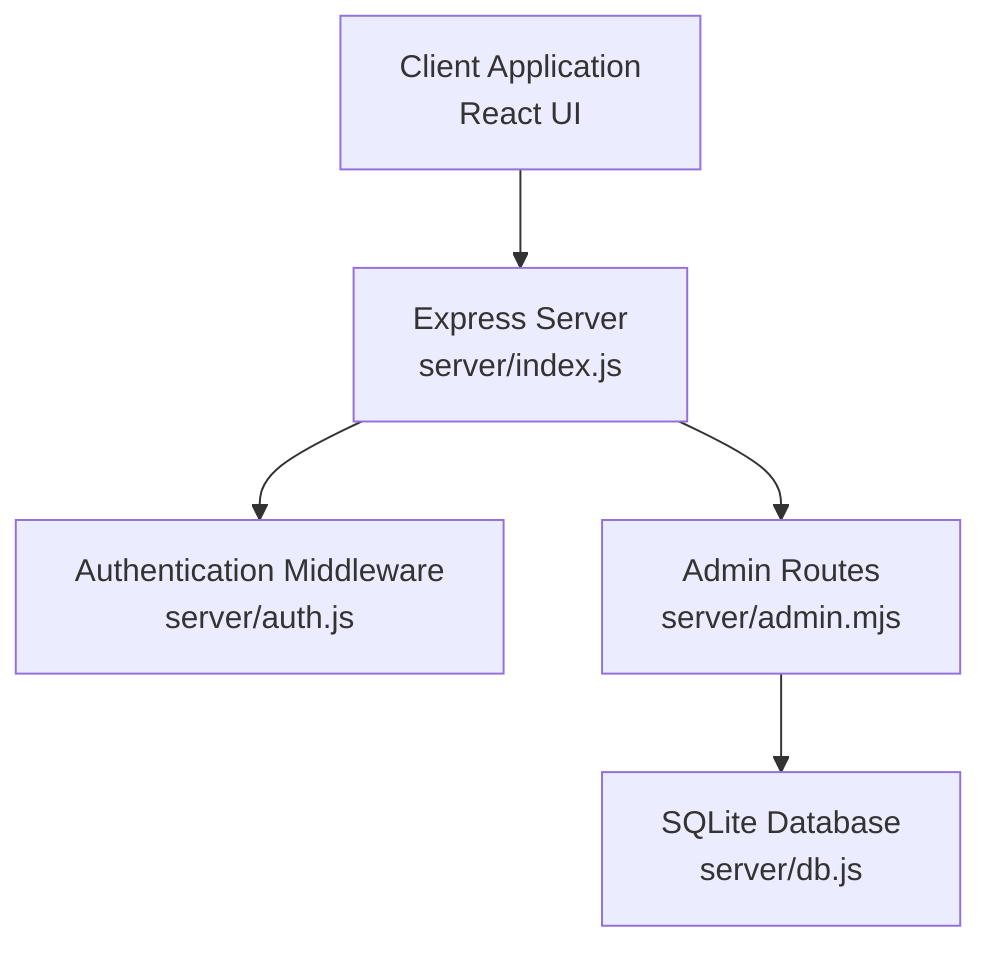
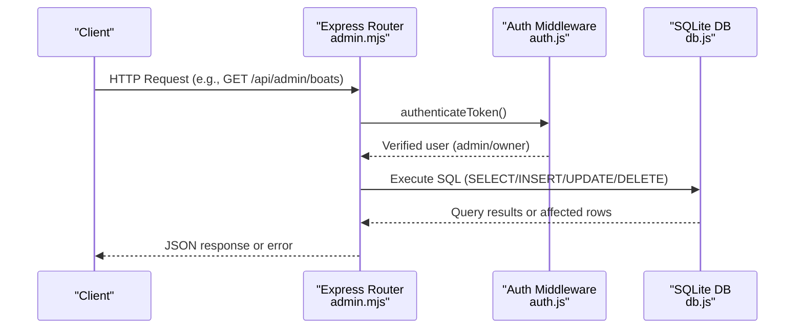
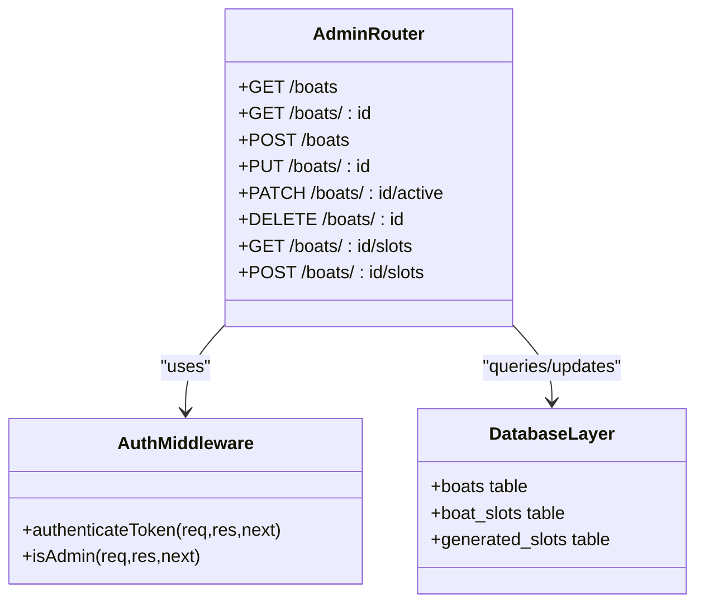
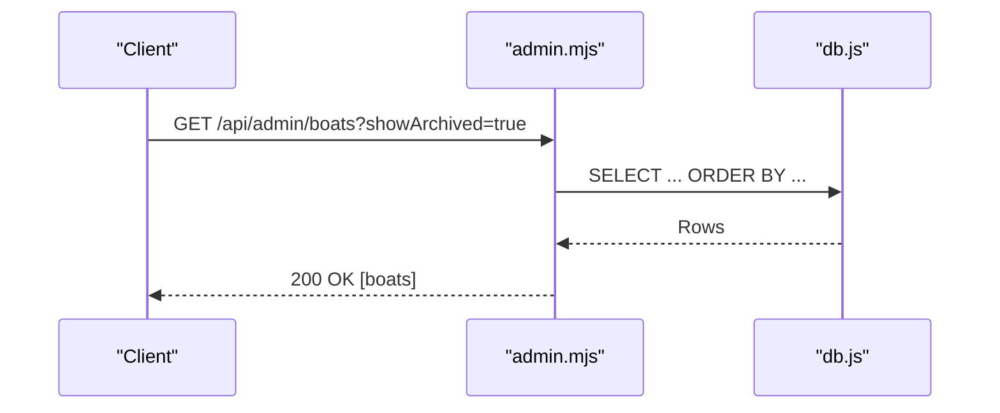
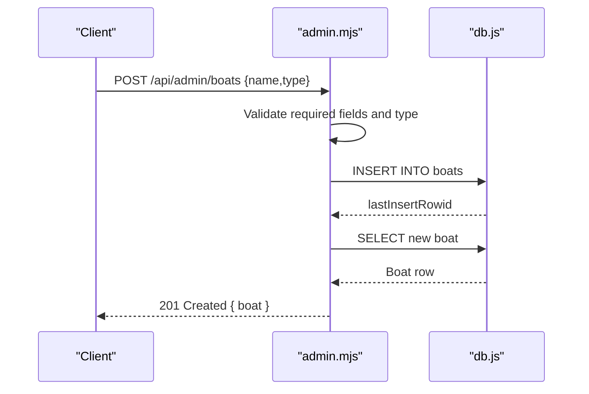
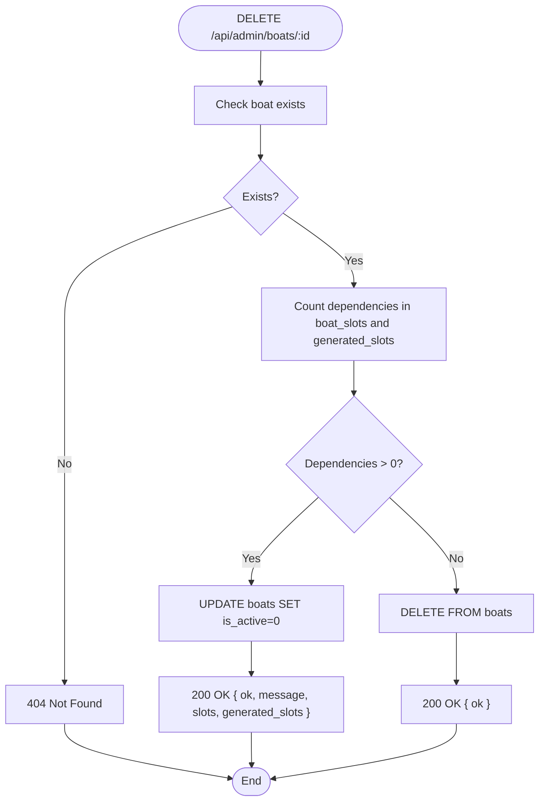
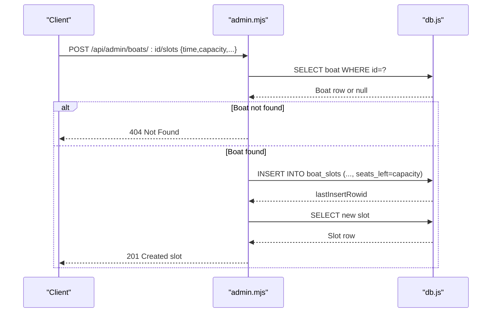
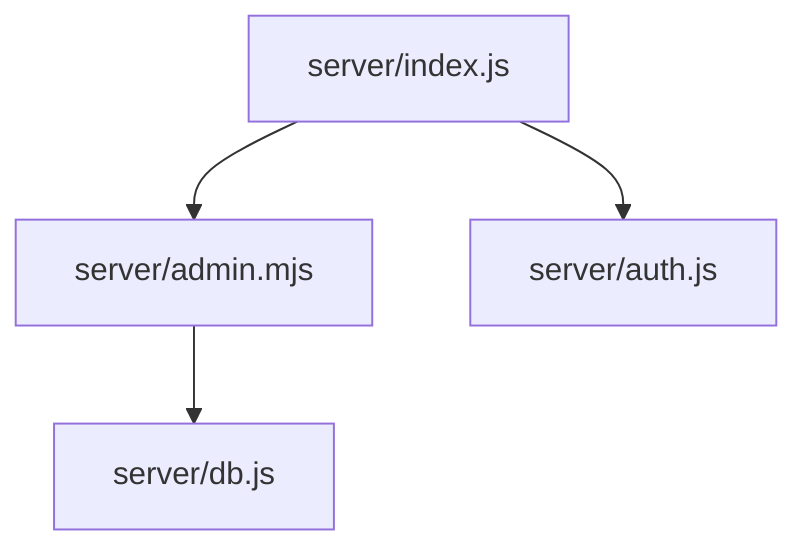

# Boat Management API

<cite>
**Referenced Files in This Document**
- [server/index.js](file://server/index.js)
- [server/admin.mjs](file://server/admin.mjs)
- [server/db.js](file://server/db.js)
- [server/auth.js](file://server/auth.js)
- [src/utils/apiClient.js](file://src/utils/apiClient.js)
- [src/components/admin/BoatManagement.jsx](file://src/components/admin/BoatManagement.jsx)
</cite>

## Table of Contents
1. [Introduction](#introduction)
2. [Project Structure](#project-structure)
3. [Core Components](#core-components)
4. [Architecture Overview](#architecture-overview)
5. [Detailed Component Analysis](#detailed-component-analysis)
6. [Dependency Analysis](#dependency-analysis)
7. [Performance Considerations](#performance-considerations)
8. [Troubleshooting Guide](#troubleshooting-guide)
9. [Conclusion](#conclusion)

## Introduction
This document provides comprehensive API documentation for boat management endpoints in the Beach Boat Ticket Sales System. It covers CRUD operations for boats and slot management, including request/response schemas, validation rules, dependency checks for safe deletion, and error handling. The API is protected and requires authenticated admin or owner access.

## Project Structure
The boat management API is implemented in the server module and mounted under `/api/admin`. The Express application registers the admin routes and applies authentication middleware globally for admin endpoints.

**Diagram sources**
- [server/index.js](file://server/index.js#L39-L40)
- [server/admin.mjs](file://server/admin.mjs#L1-L15)
- [server/auth.js](file://server/auth.js#L10-L40)
- [server/db.js](file://server/db.js#L39-L85)

**Section sources**
- [server/index.js](file://server/index.js#L39-L40)

## Core Components
- Authentication and Authorization: JWT-based authentication verifies the user and ensures the account is active. Admin-only endpoints are protected by a role-check middleware.
- Admin Routes: Implements boat and slot management endpoints under `/api/admin`.
- Database Layer: Uses SQLite via better-sqlite3 with migrations and constraints for boats and slots.

Key responsibilities:
- Boat CRUD: listing, retrieving, creating, updating, toggling activation, and deleting with dependency-aware soft/hard deletion.
- Slot CRUD: listing boat-specific slots and creating new slots with pricing and capacity settings.
- Validation: Enforces boat types, slot constraints (e.g., banana-specific rules), and capacity vs. seats-left consistency.

**Section sources**
- [server/auth.js](file://server/auth.js#L10-L40)
- [server/admin.mjs](file://server/admin.mjs#L7-L15)
- [server/db.js](file://server/db.js#L55-L85)

## Architecture Overview
The boat management API follows a layered architecture:
- Presentation: Express routes in admin.mjs expose REST endpoints.
- Domain: Route handlers validate inputs, enforce business rules, and orchestrate updates.
- Persistence: SQLite-backed with migrations ensuring schema consistency.

**Diagram sources**
- [server/admin.mjs](file://server/admin.mjs#L17-L40)
- [server/auth.js](file://server/auth.js#L10-L40)
- [server/db.js](file://server/db.js#L39-L85)

## Detailed Component Analysis

### Boat Endpoints

#### GET /api/admin/boats
- Purpose: List boats with optional archived filtering.
- Query parameters:
  - `showArchived`: Boolean flag to include archived (inactive) boats.
- Response: Array of boat objects with fields: id, name, type, is_active.
- Behavior:
  - If `showArchived=true`: returns all boats ordered by activity and name.
  - Otherwise: returns only active boats ordered by name.
- Access: Admin or Owner.

Example request:
- GET /api/admin/boats?showArchived=true

Example response:
- 200 OK: [{ id: 1, name: "Speedy", type: "speed", is_active: 1 }, ...]

**Section sources**
- [server/admin.mjs](file://server/admin.mjs#L17-L40)

#### GET /api/admin/boats/:id
- Purpose: Retrieve a specific boat by ID.
- Path parameters:
  - `id`: Numeric boat identifier.
- Response: Boat object with fields: id, name, type, is_active.
- Error handling:
  - 404 Not Found if boat does not exist.

Example request:
- GET /api/admin/boats/1

Example response:
- 200 OK: { id: 1, name: "Speedy", type: "speed", is_active: 1 }

**Section sources**
- [server/admin.mjs](file://server/admin.mjs#L42-L57)

#### POST /api/admin/boats
- Purpose: Create a new boat.
- Request body:
  - name: Non-empty string.
  - type: One of "speed", "cruise", "banana".
- Response: Created boat object wrapped in `{ boat }`.
- Validation:
  - Required fields: name, type.
  - Type must be one of the allowed values.
- Access: Admin or Owner.

Example request:
- POST /api/admin/boats
- Body: { name: "Sunset", type: "cruise" }

Example response:
- 201 Created: { boat: { id: 2, name: "Sunset", type: "cruise", is_active: 1 } }

**Section sources**
- [server/admin.mjs](file://server/admin.mjs#L59-L83)

#### PUT /api/admin/boats/:id
- Purpose: Update an existing boat’s name and type.
- Path parameters:
  - `id`: Numeric boat identifier.
- Request body:
  - name: Non-empty string.
  - type: One of "speed", "cruise", "banana".
- Response: Updated boat object wrapped in `{ boat }`.
- Validation:
  - Required fields: name, type.
  - Type must be one of the allowed values.
- Error handling:
  - 404 Not Found if boat does not exist.

Example request:
- PUT /api/admin/boats/1
- Body: { name: "Speedy Deluxe", type: "speed" }

Example response:
- 200 OK: { boat: { id: 1, name: "Speedy Deluxe", type: "speed", is_active: 1 } }

**Section sources**
- [server/admin.mjs](file://server/admin.mjs#L85-L114)

#### PATCH /api/admin/boats/:id/active
- Purpose: Toggle a boat’s activation status.
- Path parameters:
  - `id`: Numeric boat identifier.
- Request body:
  - is_active: Integer 0 or 1.
- Response: Updated boat object wrapped in `{ boat }`.
- Validation:
  - is_active must be 0 or 1.
- Error handling:
  - 404 Not Found if boat does not exist.

Example request:
- PATCH /api/admin/boats/1/active
- Body: { is_active: 0 }

Example response:
- 200 OK: { boat: { id: 1, name: "Speedy Deluxe", type: "speed", is_active: 0 } }

**Section sources**
- [server/admin.mjs](file://server/admin.mjs#L116-L139)

#### DELETE /api/admin/boats/:id
- Purpose: Delete a boat with dependency-aware behavior.
- Path parameters:
  - `id`: Numeric boat identifier.
- Behavior:
  - Dependency check: Count related entries in `boat_slots` and `generated_slots`.
  - If dependencies exist: Soft delete by setting `is_active = 0`.
  - If no dependencies: Hard delete by removing the record.
- Response:
  - Soft delete: { ok: true, message: "Boat archived (dependencies exist)", slots, generated_slots }.
  - Hard delete: { ok: true }.
- Error handling:
  - 404 Not Found if boat does not exist.

Example requests:
- DELETE /api/admin/boats/1

Example responses:
- Soft delete: { ok: true, message: "Boat archived (dependencies exist)", slots: 2, generated_slots: 0 }
- Hard delete: { ok: true }

**Section sources**
- [server/admin.mjs](file://server/admin.mjs#L141-L180)

### Slot Endpoints

#### GET /api/admin/boats/:id/slots
- Purpose: List all slots for a specific boat.
- Path parameters:
  - `id`: Numeric boat identifier.
- Response: Array of slot objects with fields:
  - id, boat_id, time, price, capacity, is_active, duration_minutes, price_adult, price_child, price_teen, seats_left.
- Validation:
  - Returns 404 Not Found if boat does not exist.

Example request:
- GET /api/admin/boats/1/slots

Example response:
- 200 OK: [{ id: 101, boat_id: 1, time: "14:00", price: 1500, capacity: 12, is_active: 1, duration_minutes: 60, price_adult: 1500, price_child: 800, price_teen: 1200, seats_left: 5 }, ...]

**Section sources**
- [server/admin.mjs](file://server/admin.mjs#L182-L216)

#### POST /api/admin/boats/:id/slots
- Purpose: Create a new slot for a boat.
- Path parameters:
  - `id`: Numeric boat identifier (boat_id).
- Request body:
  - time: Non-empty string (ISO time).
  - price: Integer (legacy field; defaults to 0 if omitted).
  - capacity: Positive integer (required).
  - duration_minutes: Integer; defaults to 60 if omitted.
  - price_adult: Integer (optional).
  - price_child: Integer (optional).
  - price_teen: Integer (optional).
- Validation:
  - Boat existence checked before insertion.
  - Required: time, capacity.
  - Defaults: price=0, duration_minutes=60, price_* fields nullable.
- Response: Created slot object with all fields.
- Access: Admin or Owner.

Example request:
- POST /api/admin/boats/1/slots
- Body: { time: "15:30", capacity: 12, duration_minutes: 60, price_adult: 1500, price_child: 800, price_teen: 1200 }

Example response:
- 201 Created: { id: 102, boat_id: 1, time: "15:30", price: 0, capacity: 12, is_active: 1, duration_minutes: 60, price_adult: 1500, price_child: 800, price_teen: 1200, seats_left: 12 }

**Section sources**
- [server/admin.mjs](file://server/admin.mjs#L218-L264)

### Request/Response Schemas

#### Boat Schema
- Properties:
  - id: integer
  - name: string
  - type: string ("speed" | "cruise" | "banana")
  - is_active: integer (0 or 1)

#### Slot Schema
- Properties:
  - id: integer
  - boat_id: integer
  - time: string (time)
  - price: integer (legacy; nullable)
  - capacity: integer
  - is_active: integer (0 or 1)
  - duration_minutes: integer (nullable)
  - price_adult: integer (nullable)
  - price_child: integer (nullable)
  - price_teen: integer (nullable)
  - seats_left: integer

Notes:
- For banana-type boats, duration_minutes is enforced to 40 minutes in related flows (see related backend logic).
- seats_left is initialized to capacity upon slot creation.

**Section sources**
- [server/admin.mjs](file://server/admin.mjs#L182-L216)
- [server/admin.mjs](file://server/admin.mjs#L218-L264)
- [server/db.js](file://server/db.js#L68-L85)

### Validation Rules and Business Rules

- Boat type validation:
  - Allowed values: "speed", "cruise", "banana".
- Slot creation validation:
  - Required: time, capacity.
  - Defaults: price=0, duration_minutes=60.
  - Age-based pricing: price_adult, price_child, price_teen are optional integers.
- Dependency-aware deletion:
  - Before deletion, the system counts related entries in boat_slots and generated_slots.
  - If dependencies exist, the boat is archived (is_active=0) instead of removed.
- Additional constraints (enforced elsewhere in the system):
  - Banana-specific rules: duration often fixed to 40 minutes; capacity commonly constrained to 12 in related flows.

**Section sources**
- [server/admin.mjs](file://server/admin.mjs#L68-L72)
- [server/admin.mjs](file://server/admin.mjs#L230-L232)
- [server/admin.mjs](file://server/admin.mjs#L146-L150)

### Error Handling
Common HTTP status codes:
- 200 OK: Successful GET/PUT/PATCH.
- 201 Created: Successful POST (slot creation).
- 400 Bad Request: Validation failures (missing fields, invalid type, wrong is_active value).
- 404 Not Found: Entity not found (boat/slot).
- 500 Internal Server Error: Unexpected server errors.

Typical error responses:
- JSON object with an error field containing a descriptive message.

**Section sources**
- [server/admin.mjs](file://server/admin.mjs#L36-L39)
- [server/admin.mjs](file://server/admin.mjs#L53-L56)
- [server/admin.mjs](file://server/admin.mjs#L64-L66)
- [server/admin.mjs](file://server/admin.mjs#L122-L124)
- [server/admin.mjs](file://server/admin.mjs#L176-L179)

## Architecture Overview

**Diagram sources**
- [server/auth.js](file://server/auth.js#L10-L40)
- [server/admin.mjs](file://server/admin.mjs#L17-L180)
- [server/db.js](file://server/db.js#L55-L85)

## Detailed Component Analysis

### Endpoint Call Flows

#### GET /api/admin/boats

**Diagram sources**
- [server/admin.mjs](file://server/admin.mjs#L17-L40)
- [server/db.js](file://server/db.js#L55-L66)

#### POST /api/admin/boats

**Diagram sources**
- [server/admin.mjs](file://server/admin.mjs#L59-L83)
- [server/db.js](file://server/db.js#L55-L66)

#### DELETE /api/admin/boats/:id

**Diagram sources**
- [server/admin.mjs](file://server/admin.mjs#L141-L180)

#### POST /api/admin/boats/:id/slots

**Diagram sources**
- [server/admin.mjs](file://server/admin.mjs#L218-L264)
- [server/db.js](file://server/db.js#L68-L85)

### UI Integration Notes
- The React admin component interacts with the API via the shared API client.
- It handles loading states, error messages, and updates local state after successful operations.

**Section sources**
- [src/utils/apiClient.js](file://src/utils/apiClient.js#L117-L119)
- [src/utils/apiClient.js](file://src/utils/apiClient.js#L225-L233)
- [src/components/admin/BoatManagement.jsx](file://src/components/admin/BoatManagement.jsx#L52-L74)
- [src/components/admin/BoatManagement.jsx](file://src/components/admin/BoatManagement.jsx#L225-L233)

## Dependency Analysis
- Route registration: Admin routes are mounted under `/api/admin` and protected by authentication middleware.
- Authentication: JWT verification and active user check.
- Database: Centralized initialization and migrations ensure consistent schema for boats and slots.

**Diagram sources**
- [server/index.js](file://server/index.js#L39-L40)
- [server/admin.mjs](file://server/admin.mjs#L1-L15)
- [server/auth.js](file://server/auth.js#L10-L40)
- [server/db.js](file://server/db.js#L39-L85)

**Section sources**
- [server/index.js](file://server/index.js#L39-L40)
- [server/auth.js](file://server/auth.js#L10-L40)
- [server/db.js](file://server/db.js#L39-L85)

## Performance Considerations
- SQLite is file-based and suitable for small to medium loads. For higher concurrency or larger datasets, consider indexing strategies and connection pooling.
- Queries for listing boats and slots are straightforward; ensure appropriate indexes exist on frequently filtered columns (e.g., is_active, time).
- Batch operations should be considered for bulk slot generation or updates.

## Troubleshooting Guide
- Authentication failures:
  - Missing or invalid token: 401/403 responses from auth middleware.
  - Disabled user account: 403 response indicating inactive account.
- Boat operations:
  - 400 Bad Request: Missing required fields or invalid type.
  - 404 Not Found: Boat not found for GET/PUT/PATCH/DELETE.
- Slot operations:
  - 400 Bad Request: Missing time or capacity; invalid is_active value.
  - 404 Not Found: Boat not found when creating slots.
- Deletion behavior:
  - Soft archive occurs when dependencies exist; verify counts in response.

**Section sources**
- [server/auth.js](file://server/auth.js#L15-L27)
- [server/admin.mjs](file://server/admin.mjs#L64-L66)
- [server/admin.mjs](file://server/admin.mjs#L122-L124)
- [server/admin.mjs](file://server/admin.mjs#L146-L150)

## Conclusion
The boat management API provides robust CRUD capabilities for boats and slots with strong validation, dependency-aware deletion, and clear error handling. The modular design keeps authentication centralized and routes focused on domain logic, while the database layer enforces schema consistency through migrations.