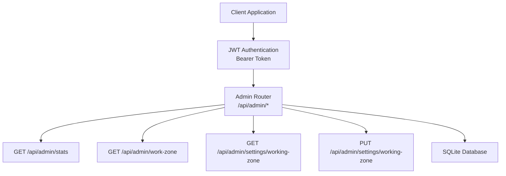
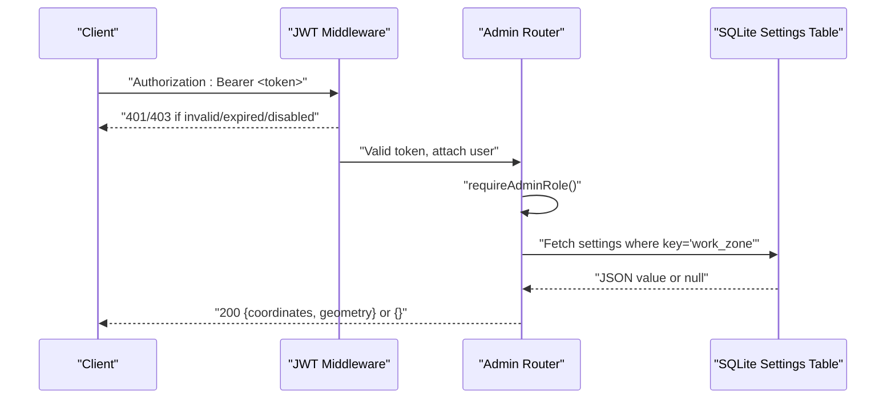
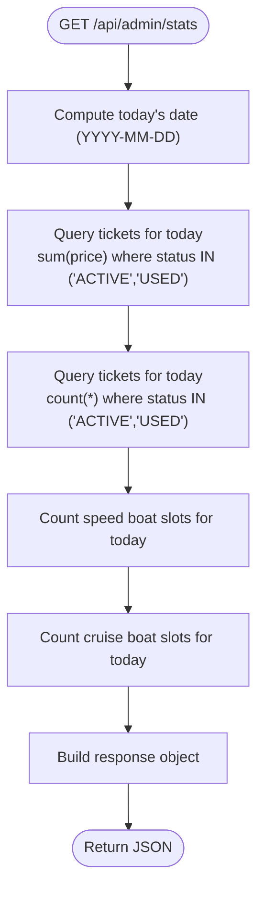
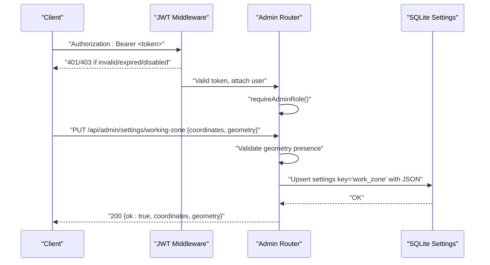
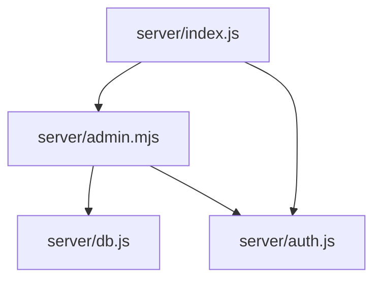

# System Configuration API

<cite>
**Referenced Files in This Document**
- [server/index.js](file://server/index.js)
- [server/admin.mjs](file://server/admin.mjs)
- [server/auth.js](file://server/auth.js)
- [server/db.js](file://server/db.js)
- [src/utils/apiClient.js](file://src/utils/apiClient.js)
- [src/views/AdminView.jsx](file://src/views/AdminView.jsx)
- [src/components/admin/WorkingZoneMap.jsx](file://src/components/admin/WorkingZoneMap.jsx)
</cite>

## Table of Contents
1. [Introduction](#introduction)
2. [Project Structure](#project-structure)
3. [Core Components](#core-components)
4. [Architecture Overview](#architecture-overview)
5. [Detailed Component Analysis](#detailed-component-analysis)
6. [Dependency Analysis](#dependency-analysis)
7. [Performance Considerations](#performance-considerations)
8. [Troubleshooting Guide](#troubleshooting-guide)
9. [Conclusion](#conclusion)

## Introduction
This document provides comprehensive API documentation for system configuration endpoints in the boat ticket sales system. It covers:
- Dashboard statistics endpoint for retrieving daily revenue, ticket sales, and trip counts
- Working zone management endpoints for geographic configuration
- Authentication requirements and data validation rules
- Error handling and operational guidelines
- Practical examples for system monitoring and geographic area setup

The system uses JWT-based authentication, Express.js for routing, and SQLite for persistence. All endpoints under `/api/admin` require administrative privileges.

## Project Structure
The API endpoints are organized under the `/api/admin` namespace and are mounted in the main server entry point. Authentication middleware enforces role-based access control.

**Diagram sources**
- [server/index.js](file://server/index.js#L39-L40)
- [server/admin.mjs](file://server/admin.mjs#L418-L549)
- [server/auth.js](file://server/auth.js#L10-L40)

**Section sources**
- [server/index.js](file://server/index.js#L39-L40)
- [server/admin.mjs](file://server/admin.mjs#L1-L15)

## Core Components
This section documents the primary configuration endpoints and their behavior.

### Authentication and Authorization
- All `/api/admin` endpoints require a valid JWT bearer token in the Authorization header.
- The token must be signed with the configured secret and must represent an active user account.
- Administrative access is required; endpoints enforce role checks.

Key behaviors:
- Missing or malformed Authorization header returns 401 Unauthorized.
- Invalid or expired tokens return 403 Forbidden.
- Non-admin users receive 403 Forbidden.
- Disabled accounts return 403 Forbidden.

**Section sources**
- [server/auth.js](file://server/auth.js#L10-L40)
- [server/admin.mjs](file://server/admin.mjs#L7-L15)

### Dashboard Statistics Endpoint
- Method: GET
- Path: `/api/admin/stats`
- Purpose: Retrieve daily aggregated metrics for the current day.

Response schema:
- totalRevenue: number (sum of ticket prices for active/used tickets sold today)
- totalTicketsSold: number (count of active/used tickets sold today)
- speedTrips: number (count of speed boat slots scheduled for today)
- cruiseTrips: number (count of cruise boat slots scheduled for today)

Date filtering:
- The endpoint filters data for the current calendar date (YYYY-MM-DD).

Error handling:
- On database errors, returns 500 with an error message.

**Section sources**
- [server/admin.mjs](file://server/admin.mjs#L418-L472)

### Working Zone Management Endpoints
These endpoints manage geographic configuration data stored in the settings table.

#### GET /api/admin/work-zone
- Method: GET
- Path: `/api/admin/work-zone`
- Purpose: Retrieve current work zone configuration.
- Response: JSON object containing the stored configuration (coordinates and geometry).
- Behavior: Returns empty object `{}` if no configuration exists.

#### GET /api/admin/settings/working-zone (Legacy)
- Method: GET
- Path: `/api/admin/settings/working-zone`
- Purpose: Compatibility endpoint returning the same configuration as above.
- Response: Same as above.

#### PUT /api/admin/settings/working-zone
- Method: PUT
- Path: `/api/admin/settings/working-zone`
- Purpose: Update work zone configuration.
- Request body:
  - geometry: required object (geographic shape definition)
  - coordinates: optional array (coordinate points for the polygon)
- Validation:
  - Rejects requests without geometry field.
- Persistence:
  - Stores configuration as a JSON string under the key "work_zone" in the settings table.
  - Creates the record if it does not exist; updates otherwise.
- Response:
  - On success: returns { ok: true, coordinates, geometry }.
  - On validation failure: returns 400 with an error message.
  - On database errors: returns 500 with an error message.

**Section sources**
- [server/admin.mjs](file://server/admin.mjs#L474-L549)
- [server/db.js](file://server/db.js#L87-L93)

## Architecture Overview
The configuration endpoints integrate with authentication middleware and the database layer. The admin router enforces role-based access and delegates to database operations.

**Diagram sources**
- [server/auth.js](file://server/auth.js#L10-L40)
- [server/admin.mjs](file://server/admin.mjs#L474-L496)
- [server/db.js](file://server/db.js#L87-L93)

## Detailed Component Analysis

### Dashboard Statistics Processing Flow
The statistics endpoint performs three distinct aggregations for the current day.

**Diagram sources**
- [server/admin.mjs](file://server/admin.mjs#L418-L472)

**Section sources**
- [server/admin.mjs](file://server/admin.mjs#L418-L472)

### Working Zone Configuration Update Flow
The PUT endpoint validates the request body and persists the configuration.

**Diagram sources**
- [server/admin.mjs](file://server/admin.mjs#L522-L547)
- [server/db.js](file://server/db.js#L87-L93)

**Section sources**
- [server/admin.mjs](file://server/admin.mjs#L522-L547)

### Frontend Integration Patterns
The frontend integrates with the API through a shared client utility and specific views.

- API client automatically attaches Authorization headers and handles network logging.
- Admin view displays dashboard statistics.
- Working zone map component loads and saves configuration.

**Section sources**
- [src/utils/apiClient.js](file://src/utils/apiClient.js#L23-L88)
- [src/views/AdminView.jsx](file://src/views/AdminView.jsx)
- [src/components/admin/WorkingZoneMap.jsx](file://src/components/admin/WorkingZoneMap.jsx#L24-L45)

## Dependency Analysis
The admin endpoints depend on authentication middleware and the database layer. The server mounts the admin router with authentication enforced.

**Diagram sources**
- [server/index.js](file://server/index.js#L39-L40)
- [server/admin.mjs](file://server/admin.mjs#L1-L15)
- [server/auth.js](file://server/auth.js#L10-L40)
- [server/db.js](file://server/db.js#L87-L93)

**Section sources**
- [server/index.js](file://server/index.js#L39-L40)
- [server/admin.mjs](file://server/admin.mjs#L1-L15)

## Performance Considerations
- The statistics endpoint performs three separate queries against the tickets and boat_slots tables. Consider adding database indexes on frequently filtered columns (e.g., created_at, status, time) to improve query performance.
- The working zone endpoints operate on a single settings table row. Ensure the settings table has appropriate indexing for the key column.
- JWT verification occurs on every request; caching tokens client-side reduces unnecessary re-authentication overhead.

## Troubleshooting Guide
Common issues and resolutions:

- 401 Unauthorized
  - Cause: Missing or malformed Authorization header.
  - Resolution: Include a valid Bearer token in the Authorization header.

- 403 Forbidden
  - Cause: Invalid/expired token, disabled account, or insufficient permissions.
  - Resolution: Re-authenticate and verify the user's role is admin or owner.

- 400 Bad Request (Working Zone Update)
  - Cause: Missing geometry field in the request body.
  - Resolution: Provide a geometry object in the request body.

- 500 Internal Server Error
  - Cause: Database errors during query execution or settings upsert.
  - Resolution: Check server logs for SQL exceptions and verify database connectivity.

**Section sources**
- [server/auth.js](file://server/auth.js#L10-L40)
- [server/admin.mjs](file://server/admin.mjs#L527-L529)
- [server/admin.mjs](file://server/admin.mjs#L468-L471)

## Conclusion
The system provides robust configuration endpoints for dashboard analytics and geographic area management. The endpoints are secured with JWT authentication and validated by role-based middleware. Proper error handling ensures predictable responses, while the frontend integration demonstrates practical usage patterns for system monitoring and geographic setup.