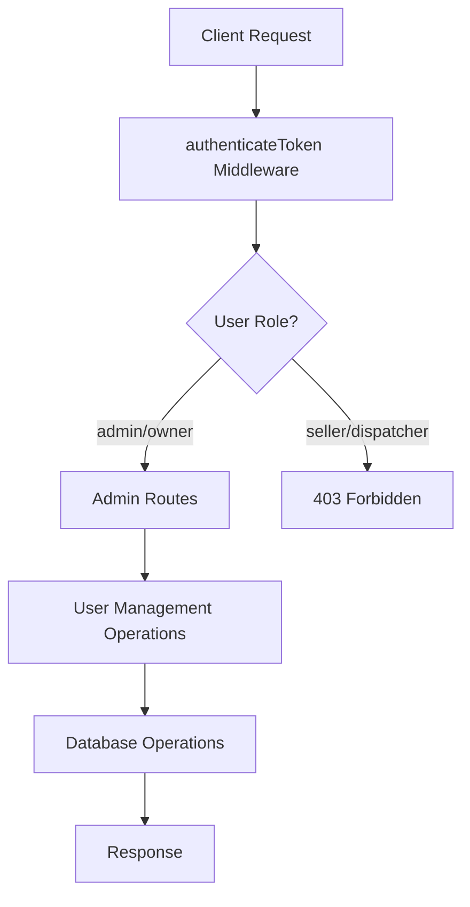

# User Management API

<cite>
**Referenced Files in This Document**
- [server/admin.mjs](file://server/admin.mjs)
- [server/auth.js](file://server/auth.js)
- [server/db.js](file://server/db.js)
- [server/index.js](file://server/index.js)
- [src/views/AdminView.jsx](file://src/views/AdminView.jsx)
- [src/utils/apiClient.js](file://src/utils/apiClient.js)
</cite>

## Table of Contents
1. [Introduction](#introduction)
2. [Authentication and Authorization](#authentication-and-authorization)
3. [API Endpoints](#api-endpoints)
4. [User Schema](#user-schema)
5. [Validation Rules](#validation-rules)
6. [Error Responses](#error-responses)
7. [Examples](#examples)
8. [Implementation Details](#implementation-details)
9. [Security Considerations](#security-considerations)

## Introduction

The User Management API provides comprehensive CRUD operations for managing user accounts within the boat ticketing system. This API enables administrators and owners to create, read, update, and manage user accounts with role-based access control, password security, and audit capabilities.

The system supports four distinct user roles: seller, dispatcher, admin, and owner, each with specific permissions and access levels. All user management operations require proper authentication and authorization through JWT tokens.

## Authentication and Authorization

### Authentication Requirements

All user management endpoints require a valid JWT bearer token in the Authorization header:

```
Authorization: Bearer <JWT_TOKEN>
```

### Authorization Levels

- **Admin Users**: Full access to all user management operations
- **Owner Users**: Full access to all user management operations  
- **Seller/Dispatcher**: Cannot access user management endpoints

### Token Validation Process

The authentication middleware performs the following checks:
1. Validates presence of Authorization header
2. Verifies JWT signature against secret key
3. Confirms user exists in database and is active
4. Ensures user account is not disabled

**Section sources**
- [server/auth.js](file://server/auth.js#L10-L40)
- [server/auth.js](file://server/auth.js#L42-L71)

## API Endpoints

### GET /api/admin/users

**Description**: Retrieve all users with optional role filtering

**Authentication**: Required (Admin/Owner)
**Authorization**: Admin/Owner only

**Query Parameters**:
- `role` (optional): Filter users by specific role (seller, dispatcher, admin)

**Response**: Array of user objects with fields: id, username, role, is_active

**Example Request**:
```bash
curl -H "Authorization: Bearer <token>" \
  "http://localhost:3001/api/admin/users?role=admin"
```

**Section sources**
- [server/admin.mjs](file://server/admin.mjs#L266-L288)

### POST /api/admin/users

**Description**: Create a new user account

**Authentication**: Required (Admin/Owner)
**Authorization**: Admin/Owner only

**Request Body**:
```json
{
  "username": "string",
  "password": "string",
  "role": "string"
}
```

**Response**: User object with fields: id, username, role, is_active

**Example Request**:
```bash
curl -X POST -H "Authorization: Bearer <token>" \
  -H "Content-Type: application/json" \
  -d '{"username":"john_doe","password":"secure_password","role":"seller"}' \
  "http://localhost:3001/api/admin/users"
```

**Section sources**
- [server/admin.mjs](file://server/admin.mjs#L290-L329)

### PATCH /api/admin/users/:id

**Description**: Activate or deactivate a user account

**Authentication**: Required (Admin/Owner)
**Authorization**: Admin/Owner only

**Request Body**:
```json
{
  "is_active": 0 | 1
}
```

**Response**: Updated user object with fields: id, username, role, is_active

**Example Request**:
```bash
curl -X PATCH -H "Authorization: Bearer <token>" \
  -H "Content-Type: application/json" \
  -d '{"is_active":0}' \
  "http://localhost:3001/api/admin/users/123"
```

**Section sources**
- [server/admin.mjs](file://server/admin.mjs#L331-L354)

### DELETE /api/admin/users/:id

**Description**: Soft-delete a user account (sets is_active to 0)

**Authentication**: Required (Admin/Owner)
**Authorization**: Admin/Owner only

**Response**: Success object with ok flag and userId

**Example Request**:
```bash
curl -X DELETE -H "Authorization: Bearer <token>" \
  "http://localhost:3001/api/admin/users/123"
```

**Section sources**
- [server/admin.mjs](file://server/admin.mjs#L389-L415)

### POST /api/admin/users/:id/reset-password

**Description**: Reset a user's password with secure hashing

**Authentication**: Required (Admin/Owner)
**Authorization**: Admin/Owner only

**Request Body**:
```json
{
  "password": "string"
}
```

**Response**: Success object with ok flag and userId

**Example Request**:
```bash
curl -X POST -H "Authorization: Bearer <token>" \
  -H "Content-Type: application/json" \
  -d '{"password":"new_secure_password"}' \
  "http://localhost:3001/api/admin/users/123/reset-password"
```

**Section sources**
- [server/admin.mjs](file://server/admin.mjs#L355-L387)

## User Schema

### Database Schema

The user table follows this structure:

| Field | Type | Constraints | Description |
|-------|------|-------------|-------------|
| id | INTEGER | PRIMARY KEY, AUTOINCREMENT | Unique user identifier |
| username | TEXT | UNIQUE, NOT NULL | User's login name |
| password_hash | TEXT | NOT NULL | Bcrypt hashed password |
| role | TEXT | CHECK IN ('seller','dispatcher','admin','owner'), NOT NULL | User's role/permission level |
| is_active | INTEGER | DEFAULT 1, NOT NULL | Account activation status |
| created_at | TEXT | DEFAULT CURRENT_TIMESTAMP | Account creation timestamp |

### Response Schema

All user operations return standardized user objects:

```json
{
  "id": "integer",
  "username": "string",
  "role": "string",
  "is_active": "integer"
}
```

**Section sources**
- [server/db.js](file://server/db.js#L41-L49)

## Validation Rules

### Username Validation
- **Required**: Yes
- **Format**: Alphanumeric with optional underscores
- **Length**: No specific minimum/maximum limit
- **Uniqueness**: Enforced at database level

### Password Validation
- **Required**: Yes
- **Minimum Length**: 4 characters
- **Hashing**: Automatically processed using bcrypt with 10 rounds
- **Storage**: Only password hash stored, plaintext not retained

### Role Validation
- **Allowed Values**: seller, dispatcher, admin
- **Database Constraint**: Enforced via CHECK constraint
- **Default**: Not applicable (required field)

### Account Status Validation
- **Expected Values**: 0 (inactive), 1 (active)
- **Type**: Integer
- **Range**: Must be exactly 0 or 1

**Section sources**
- [server/admin.mjs](file://server/admin.mjs#L295-L309)
- [server/admin.mjs](file://server/admin.mjs#L337-L339)
- [server/admin.mjs](file://server/admin.mjs#L364-L366)

## Error Responses

### Authentication Errors
- **401 Unauthorized**: Missing or invalid Authorization header
- **403 Forbidden**: Invalid/expired token or insufficient permissions

### Validation Errors
- **400 Bad Request**: Missing required fields or invalid data format
- **409 Conflict**: Duplicate username detected

### Business Logic Errors
- **400 Bad Request**: Attempting to delete self
- **404 Not Found**: User not found for update/delete operations

### System Errors
- **500 Internal Server Error**: Database errors or unexpected failures

### Error Response Format
```json
{
  "error": "string describing the error"
}
```

**Section sources**
- [server/admin.mjs](file://server/admin.mjs#L295-L303)
- [server/admin.mjs](file://server/admin.mjs#L398-L400)
- [server/auth.js](file://server/auth.js#L15-L39)

## Examples

### Bulk User Creation Workflow

1. **Prepare User Data**:
```javascript
const users = [
  { username: "seller1", password: "password123", role: "seller" },
  { username: "dispatcher1", password: "password123", role: "dispatcher" },
  { username: "admin1", password: "password123", role: "admin" }
];
```

2. **Create Users Sequentially**:
```javascript
for (const userData of users) {
  const response = await fetch('/api/admin/users', {
    method: 'POST',
    headers: {
      'Authorization': `Bearer ${token}`,
      'Content-Type': 'application/json'
    },
    body: JSON.stringify(userData)
  });
}
```

### Role Assignment Procedure

1. **Create User with Initial Role**:
```javascript
const newUser = await fetch('/api/admin/users', {
  method: 'POST',
  headers: {
    'Authorization': `Bearer ${token}`,
    'Content-Type': 'application/json'
  },
  body: JSON.stringify({
    username: "john_doe",
    password: "secure_password",
    role: "seller"
  })
});
```

2. **Update Role if Needed**:
```javascript
const updatedUser = await fetch('/api/admin/users/' + userId, {
  method: 'PATCH',
  headers: {
    'Authorization': `Bearer ${token}`,
    'Content-Type': 'application/json'
  },
  body: JSON.stringify({ role: "admin" })
});
```

### Account Deactivation Procedures

1. **Deactivate User**:
```javascript
const deactivatedUser = await fetch('/api/admin/users/' + userId, {
  method: 'PATCH',
  headers: {
    'Authorization': `Bearer ${token}`,
    'Content-Type': 'application/json'
  },
  body: JSON.stringify({ is_active: 0 })
});
```

2. **Verify Deactivation**:
```javascript
const users = await fetch('/api/admin/users?role=seller', {
  headers: { 'Authorization': `Bearer ${token}` }
});
```

## Implementation Details

### Database Operations

All user operations are performed through prepared statements to prevent SQL injection attacks. The database layer handles:

- **Data Validation**: Enforced at database level via constraints
- **Password Security**: Automatic bcrypt hashing with configurable rounds
- **Audit Trail**: Timestamps for created_at fields
- **Soft Deletion**: is_active field for logical deletion

### Password Security

- **Hashing Algorithm**: bcrypt with 10 rounds
- **Salt Generation**: Automatic salt generation by bcrypt
- **Verification**: Secure comparison using bcrypt.compare
- **Fallback**: Graceful degradation if bcrypt unavailable

### Route Organization

User management routes are organized under `/api/admin` prefix with automatic authentication middleware:



**Diagram sources**
- [server/index.js](file://server/index.js#L39-L40)
- [server/admin.mjs](file://server/admin.mjs#L7-L15)

**Section sources**
- [server/admin.mjs](file://server/admin.mjs#L1-L549)
- [server/db.js](file://server/db.js#L41-L49)

## Security Considerations

### Access Control
- All endpoints require admin or owner privileges
- Self-deletion is prevented to maintain system integrity
- Password reset requires administrative privileges

### Data Protection
- Passwords are never stored in plaintext
- JWT tokens expire after 24 hours
- Database constraints prevent invalid role assignments

### Input Sanitization
- All database operations use prepared statements
- Input validation occurs at both API and database levels
- Special characters are handled safely in usernames

### Audit Logging
- All user operations are logged through the centralized logging system
- Authentication attempts are tracked for security monitoring
- Error responses do not leak sensitive information

**Section sources**
- [server/auth.js](file://server/auth.js#L73-L75)
- [server/admin.mjs](file://server/admin.mjs#L398-L400)