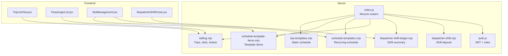
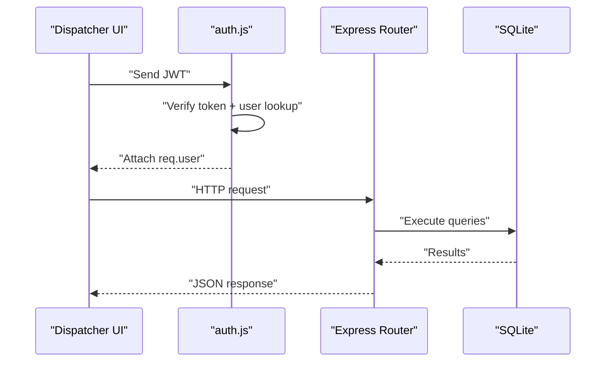
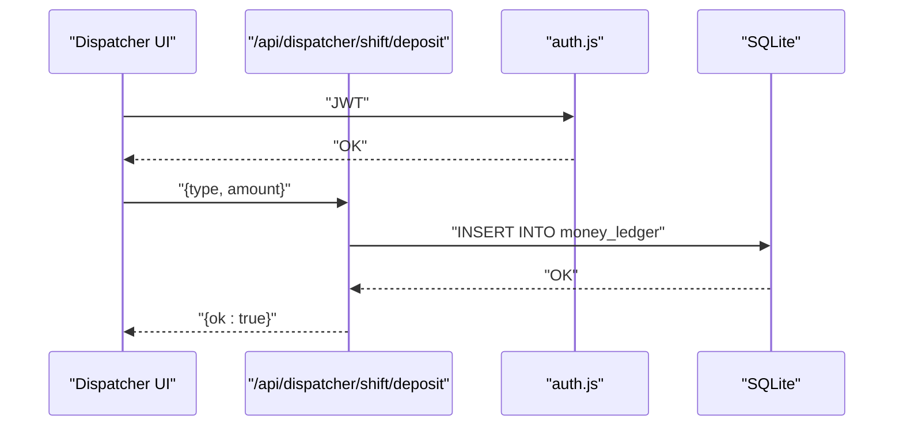
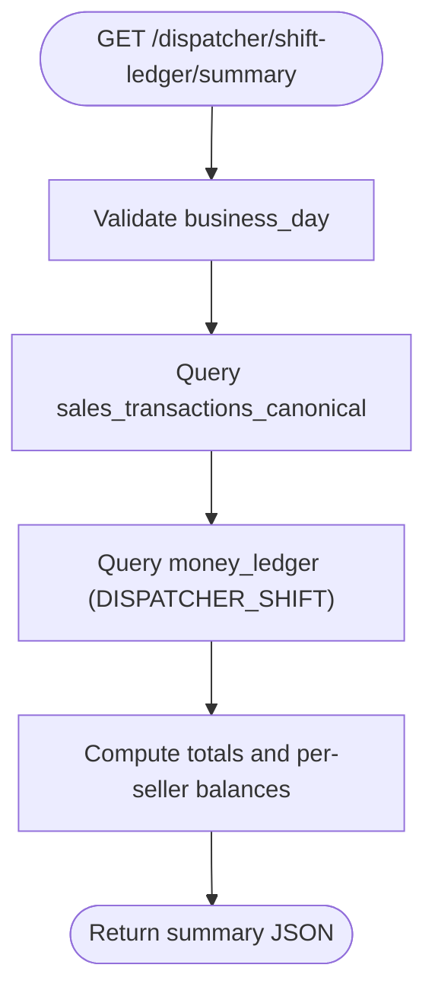
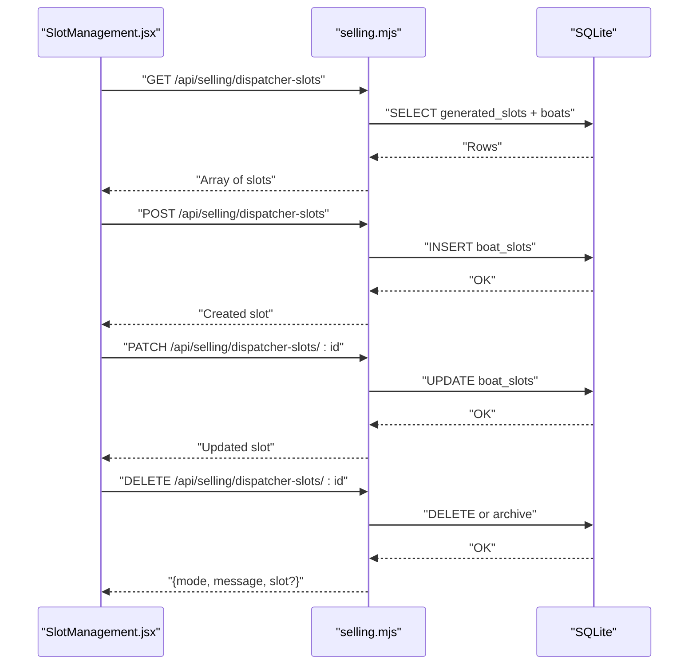
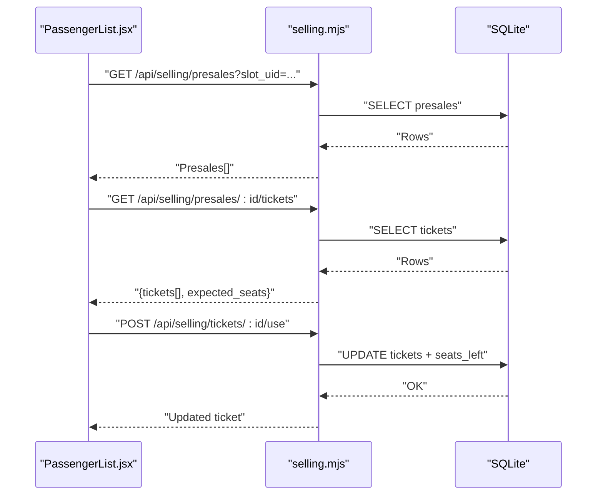
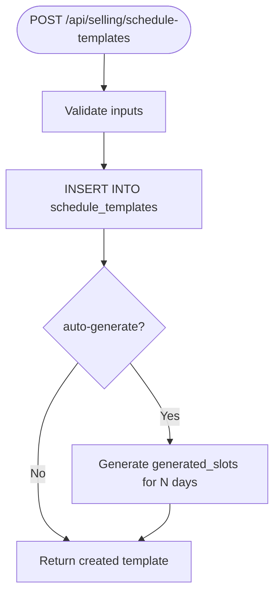
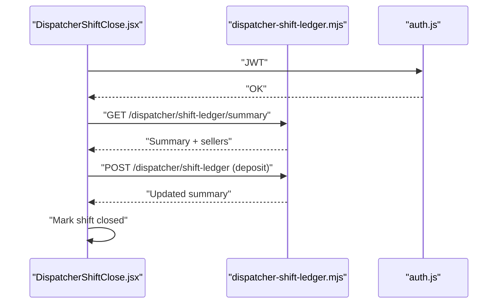
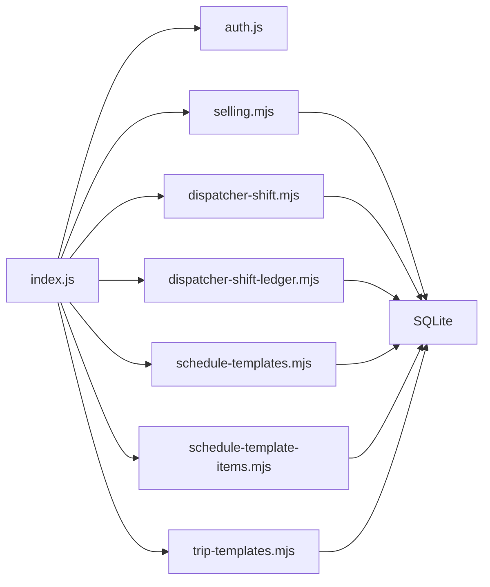

# Dispatcher API

<cite>
**Referenced Files in This Document**
- [index.js](file://server/index.js)
- [auth.js](file://server/auth.js)
- [dispatcher-shift.mjs](file://server/dispatcher-shift.mjs)
- [dispatcher-shift-ledger.mjs](file://server/dispatcher-shift-ledger.mjs)
- [schedule-templates.mjs](file://server/schedule-templates.mjs)
- [schedule-template-items.mjs](file://server/schedule-template-items.mjs)
- [trip-templates.mjs](file://server/trip-templates.mjs)
- [selling.mjs](file://server/selling.mjs)
- [TripListView.jsx](file://src/components/dispatcher/TripListView.jsx)
- [PassengerList.jsx](file://src/components/dispatcher/PassengerList.jsx)
- [SlotManagement.jsx](file://src/components/dispatcher/SlotManagement.jsx)
- [DispatcherShiftClose.jsx](file://src/views/DispatcherShiftClose.jsx)
</cite>

## Table of Contents
1. [Introduction](#introduction)
2. [Project Structure](#project-structure)
3. [Core Components](#core-components)
4. [Architecture Overview](#architecture-overview)
5. [Detailed Component Analysis](#detailed-component-analysis)
6. [Dependency Analysis](#dependency-analysis)
7. [Performance Considerations](#performance-considerations)
8. [Troubleshooting Guide](#troubleshooting-guide)
9. [Conclusion](#conclusion)

## Introduction
This document provides comprehensive API documentation for dispatcher operations and shift management in the boat ticketing application. It covers trip management (creation, modification, cancellation, status updates), passenger management (boarding control, passenger lists, attendance tracking), shift operations (opening/closing, cash handling, daily operations), slot management (capacity adjustments, seat allocation, real-time availability), and trip template management (schedule configuration and recurring trip setup). Authentication requires a dispatcher role, and the documentation includes request/response schemas, operational workflows, examples, and error handling guidance.

## Project Structure
The API is organized around Express routers mounted under `/api`. Key areas include:
- Authentication and authorization middleware
- Dispatcher shift operations and ledger summaries
- Selling routes for trips, slots, and tickets
- Schedule templates for recurring trips
- Trip templates for static schedules
- Frontend components that consume these APIs

**Diagram sources**
- [index.js](file://server/index.js#L1-L45)
- [auth.js](file://server/auth.js#L1-L154)
- [dispatcher-shift.mjs](file://server/dispatcher-shift.mjs#L1-L62)
- [dispatcher-shift-ledger.mjs](file://server/dispatcher-shift-ledger.mjs#L1-L352)
- [schedule-templates.mjs](file://server/schedule-templates.mjs#L1-L760)
- [schedule-template-items.mjs](file://server/schedule-template-items.mjs#L1-L825)
- [trip-templates.mjs](file://server/trip-templates.mjs#L1-L319)
- [selling.mjs](file://server/selling.mjs#L1-L800)
- [TripListView.jsx](file://src/components/dispatcher/TripListView.jsx#L1-L257)
- [PassengerList.jsx](file://src/components/dispatcher/PassengerList.jsx#L1-L800)
- [SlotManagement.jsx](file://src/components/dispatcher/SlotManagement.jsx#L1-L1058)
- [DispatcherShiftClose.jsx](file://src/views/DispatcherShiftClose.jsx#L1-L800)

**Section sources**
- [index.js](file://server/index.js#L1-L45)

## Core Components
- Authentication and Authorization: JWT-based with role checks; dispatcher-specific middleware enforces dispatcher-only access for sensitive endpoints.
- Dispatcher Shift Operations: Deposit cash/terminal funds into the owner ledger and compute shift summaries.
- Selling Routes: Manage trips, slots, and tickets; enforce capacity checks and seat allocation.
- Schedule Templates: Define recurring schedules with weekday/time/duration/capacity/pricing.
- Trip Templates: Static schedule templates for non-recurring trips.
- Frontend Components: Consume APIs for trip lists, passenger management, slot editing, and shift closure.

**Section sources**
- [auth.js](file://server/auth.js#L1-L154)
- [dispatcher-shift.mjs](file://server/dispatcher-shift.mjs#L1-L62)
- [dispatcher-shift-ledger.mjs](file://server/dispatcher-shift-ledger.mjs#L1-L352)
- [selling.mjs](file://server/selling.mjs#L1-L800)
- [schedule-templates.mjs](file://server/schedule-templates.mjs#L1-L760)
- [trip-templates.mjs](file://server/trip-templates.mjs#L1-L319)

## Architecture Overview
The server exposes REST endpoints grouped by functional area. Routers are mounted in index.js and protected by auth middleware. Frontend components call these endpoints to manage dispatcher workflows.

**Diagram sources**
- [index.js](file://server/index.js#L1-L45)
- [auth.js](file://server/auth.js#L1-L154)

## Detailed Component Analysis

### Authentication and Authorization
- Endpoint: POST /api/auth/login
- Purpose: Authenticate dispatcher/owner/admin and return JWT.
- Role enforcement:
  - Dispatcher-only routes: canDispatchManageSlots
  - General selling routes: canSell
  - Admin-only routes: isAdmin
- Response schema:
  - Success: { token, user: { id, username, role } }
  - Errors: { error }

**Section sources**
- [auth.js](file://server/auth.js#L1-L154)

### Dispatcher Shift Operations
- Endpoint: POST /api/dispatcher/shift/deposit
- Purpose: Record cash/terminal deposits to owner ledger for the current business day.
- Authentication: Required (dispatcher role).
- Request body:
  - type: "DEPOSIT_TO_OWNER_CASH" | "DEPOSIT_TO_OWNER_TERMINAL" | "SALARY_PAYOUT_CASH"
  - amount: number (> 0)
- Response:
  - Success: { ok: true }
  - Errors: { ok: false, error }

**Diagram sources**
- [dispatcher-shift.mjs](file://server/dispatcher-shift.mjs#L1-L62)
- [auth.js](file://server/auth.js#L1-L154)

**Section sources**
- [dispatcher-shift.mjs](file://server/dispatcher-shift.mjs#L1-L62)

### Dispatcher Shift Ledger Summary
- Endpoint: GET /api/dispatcher/shift-ledger/summary?business_day=YYYY-MM-DD
- Purpose: Retrieve daily sales and deposits summary for shift closure.
- Authentication: Required (any role).
- Response fields:
  - ok, business_day, is_closed, source
  - sales: { revenue, qty, cash, card }
  - ledger: { deposit_to_owner: { total, cash, card }, by_seller }
  - sellers: array of { seller_id, accepted, deposited, balance, cash_balance, terminal_debt, status }
  - Totals: revenue, qty, cash, card, deposit_cash, deposit_card, deposit_total

**Diagram sources**
- [dispatcher-shift-ledger.mjs](file://server/dispatcher-shift-ledger.mjs#L78-L352)

**Section sources**
- [dispatcher-shift-ledger.mjs](file://server/dispatcher-shift-ledger.mjs#L1-L352)

### Trip Management Endpoints
- Get active generated slots for selling:
  - GET /api/selling/boats/:type/slots
  - Filters: type (speed/cruise/banana), available seats, future or near-future departures
  - Response: { slots[], meta }
- Get all dispatcher slots (for UI):
  - GET /api/selling/dispatcher-slots
  - Response: array of slots with capacity, seats_left, trip_date, time, boat info
- Create manual slot:
  - POST /api/selling/dispatcher-slots
  - Body: { boat_id, time, capacity, duration_minutes, price_adult, price_child, price_teen?, active }
  - Response: created slot
- Update manual slot:
  - PATCH /api/selling/dispatcher-slots/:id
  - Body: { time, capacity, duration_minutes, price_* }
  - Response: updated slot
- Deactivate/activate slot:
  - PATCH /api/selling/dispatcher-slots/:id { active: 0|1 }
- Delete slot:
  - DELETE /api/selling/dispatcher-slots/:id
  - Response: { mode, message, slot? } where mode is "deleted" or "archived"
- Remove trips for deleted boats:
  - DELETE /api/selling/trips-for-deleted-boats
  - Response: { ok, message, deleted, deleted_generated, deleted_manual }

**Diagram sources**
- [SlotManagement.jsx](file://src/components/dispatcher/SlotManagement.jsx#L1-L1058)
- [selling.mjs](file://server/selling.mjs#L440-L800)

**Section sources**
- [selling.mjs](file://server/selling.mjs#L440-L800)
- [SlotManagement.jsx](file://src/components/dispatcher/SlotManagement.jsx#L1-L1058)

### Passenger Management Endpoints
- Get presales for a slot:
  - GET /api/selling/presales?slot_uid=...
  - Response: array of presales
- Get tickets for a presale:
  - GET /api/selling/presales/:id/tickets
  - Response: { tickets[], expected_seats, has_missing_tickets? }
- Mark ticket as used:
  - POST /api/selling/tickets/:id/use
  - Response: updated ticket
- Refund ticket:
  - POST /api/selling/tickets/:id/refund
  - Response: refunded ticket
- Transfer ticket to another slot:
  - POST /api/selling/tickets/:id/transfer { target_slot_uid }
  - Response: transfer result
- Transfer entire presale:
  - POST /api/selling/presales/:id/transfer { target_slot_uid }
  - Response: transfer result
- Cancel presale (pending):
  - POST /api/selling/presales/:id/cancel-pending
  - Response: cancellation result

**Diagram sources**
- [PassengerList.jsx](file://src/components/dispatcher/PassengerList.jsx#L1-L800)
- [selling.mjs](file://server/selling.mjs#L1-L800)

**Section sources**
- [PassengerList.jsx](file://src/components/dispatcher/PassengerList.jsx#L1-L800)
- [selling.mjs](file://server/selling.mjs#L1-L800)

### Slot Management Endpoints (Recurring Schedules)
- Schedule Templates (weekly patterns):
  - GET /api/selling/schedule-templates
  - GET /api/selling/schedule-templates/:id
  - POST /api/selling/schedule-templates { weekday, time, product_type, capacity, price_adult, price_child, price_teen?, duration_minutes, is_active? }
  - PATCH /api/selling/schedule-templates/:id { weekday?, time?, product_type?, capacity?, price_*?, duration_minutes?, is_active? }
  - DELETE /api/selling/schedule-templates/:id
  - POST /api/selling/schedule-templates/:id/generate { fromDate, days? }
  - POST /api/selling/schedule-templates/generate { date_from, date_to }
  - GET /api/selling/generated-slots { date_from?, date_to?, date? }
  - GET /api/selling/generated-slots/active
- Schedule Template Items (manual weekly patterns):
  - GET /api/selling/schedule-template-items
  - GET /api/selling/schedule-template-items/:id
  - POST /api/selling/schedule-template-items { name?, boat_id?, type, departure_time, duration_minutes, capacity, price_adult, price_child, price_teen?, weekdays_mask, is_active? }
  - PATCH /api/selling/schedule-template-items/:id { ...fields... }
  - DELETE /api/selling/schedule-template-items/:id { deleteFutureTrips? }
  - POST /api/selling/schedule-template-items/generate { date_from, date_to }

**Diagram sources**
- [schedule-templates.mjs](file://server/schedule-templates.mjs#L98-L385)
- [schedule-template-items.mjs](file://server/schedule-template-items.mjs#L126-L766)

**Section sources**
- [schedule-templates.mjs](file://server/schedule-templates.mjs#L1-L760)
- [schedule-template-items.mjs](file://server/schedule-template-items.mjs#L1-L825)

### Trip Template Management Endpoints
- Static schedule templates:
  - GET /api/selling/trip-templates/templates
  - GET /api/selling/trip-templates/templates/:id
  - POST /api/selling/trip-templates/templates { product_type, time, duration_minutes, capacity, price_adult, price_child, price_teen?, is_active? }
  - PATCH /api/selling/trip-templates/templates/:id { time?, duration_minutes?, capacity?, price_*?, is_active? }
  - DELETE /api/selling/trip-templates/templates/:id

**Section sources**
- [trip-templates.mjs](file://server/trip-templates.mjs#L1-L319)

### Shift Closure Procedures
- Endpoint: GET /api/dispatcher/shift-ledger/summary?business_day=YYYY-MM-DD
- UI flow:
  - Load summary and sellers
  - Enter deposits (cash/terminal) per seller
  - Enter salary due and mark as paid
  - Confirm closure conditions
  - Close shift

**Diagram sources**
- [DispatcherShiftClose.jsx](file://src/views/DispatcherShiftClose.jsx#L1-L800)
- [dispatcher-shift-ledger.mjs](file://server/dispatcher-shift-ledger.mjs#L78-L352)
- [auth.js](file://server/auth.js#L1-L154)

**Section sources**
- [DispatcherShiftClose.jsx](file://src/views/DispatcherShiftClose.jsx#L1-L800)
- [dispatcher-shift-ledger.mjs](file://server/dispatcher-shift-ledger.mjs#L1-L352)

## Dependency Analysis
- Mounting and routing:
  - index.js mounts auth, selling, dispatcher shift ledger, dispatcher shift, schedule templates, trip templates, admin, and owner routers.
- Authentication dependencies:
  - auth.js provides JWT verification and role guards.
- Business logic dependencies:
  - selling.mjs encapsulates capacity checks, seat accounting, and ticket operations.
  - schedule-templates.mjs and schedule-template-items.mjs coordinate recurring schedule generation and validation.
  - dispatcher-shift.mjs writes to money_ledger for shift deposits.
  - dispatcher-shift-ledger.mjs aggregates sales and ledger data for summaries.

**Diagram sources**
- [index.js](file://server/index.js#L1-L45)
- [auth.js](file://server/auth.js#L1-L154)
- [selling.mjs](file://server/selling.mjs#L1-L800)
- [dispatcher-shift.mjs](file://server/dispatcher-shift.mjs#L1-L62)
- [dispatcher-shift-ledger.mjs](file://server/dispatcher-shift-ledger.mjs#L1-L352)
- [schedule-templates.mjs](file://server/schedule-templates.mjs#L1-L760)
- [schedule-template-items.mjs](file://server/schedule-template-items.mjs#L1-L825)
- [trip-templates.mjs](file://server/trip-templates.mjs#L1-L319)

**Section sources**
- [index.js](file://server/index.js#L1-L45)

## Performance Considerations
- Capacity checks:
  - For generated slots, seats_left is recalculated from presales to prevent cache drift.
  - Manual slots rely on boat_slots.seats_left with periodic sync.
- Schema resilience:
  - Shift ledger summary uses PRAGMA checks and safe aggregations to tolerate evolving schema.
- Real-time updates:
  - Frontend components listen for dispatcher events to refresh trip lists and passenger data.
- Recommendations:
  - Batch updates for deposits and transfers.
  - Use pagination for large lists (slots, presales).
  - Index frequently queried columns (business_day, status, trip_date).

[No sources needed since this section provides general guidance]

## Troubleshooting Guide
- Authentication failures:
  - Missing/invalid/expired token or disabled user account.
  - Ensure JWT is sent in Authorization header and user.isActive = 1.
- Authorization failures:
  - Dispatcher-only endpoints require role "dispatcher".
- Capacity exceeded:
  - Requested seats exceed computed free seats; adjust booking or increase capacity.
- Template validation errors:
  - Time format must be HH:MM within 08:00–21:00, step 30 minutes.
  - Duration must be 40 for banana, 60/120/180 for boats.
  - Price and capacity validations enforced per type.
- Shift ledger schema issues:
  - Summary handles missing tables/columns gracefully; check _schema response for diagnostics.

**Section sources**
- [auth.js](file://server/auth.js#L1-L154)
- [selling.mjs](file://server/selling.mjs#L52-L94)
- [schedule-templates.mjs](file://server/schedule-templates.mjs#L7-L46)
- [schedule-template-items.mjs](file://server/schedule-template-items.mjs#L11-L50)
- [dispatcher-shift-ledger.mjs](file://server/dispatcher-shift-ledger.mjs#L333-L348)

## Conclusion
The Dispatcher API provides a comprehensive set of endpoints for managing trips, passengers, slots, templates, and shift operations. Authentication and authorization ensure secure access, while robust validation and schema-resilient summaries support reliable daily operations. The frontend components integrate closely with these endpoints to deliver real-time capabilities for dispatcher workflows.