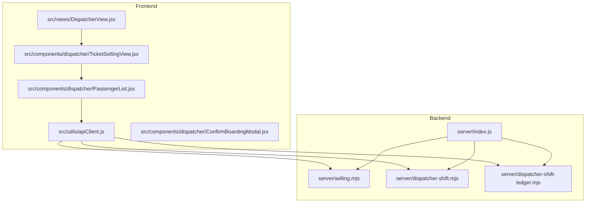
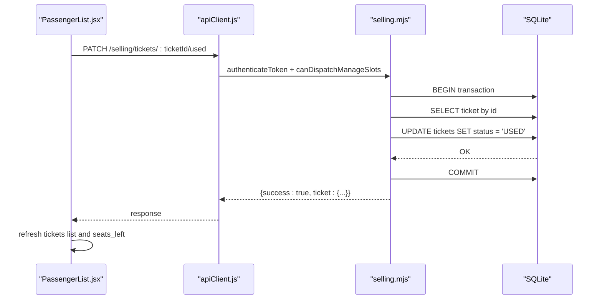
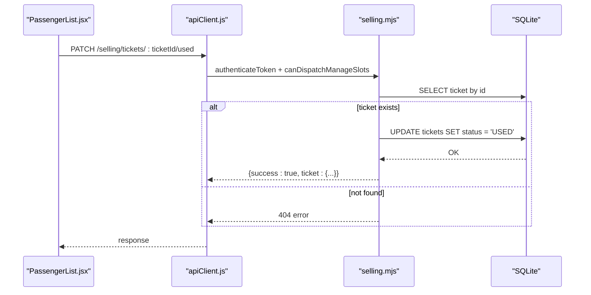
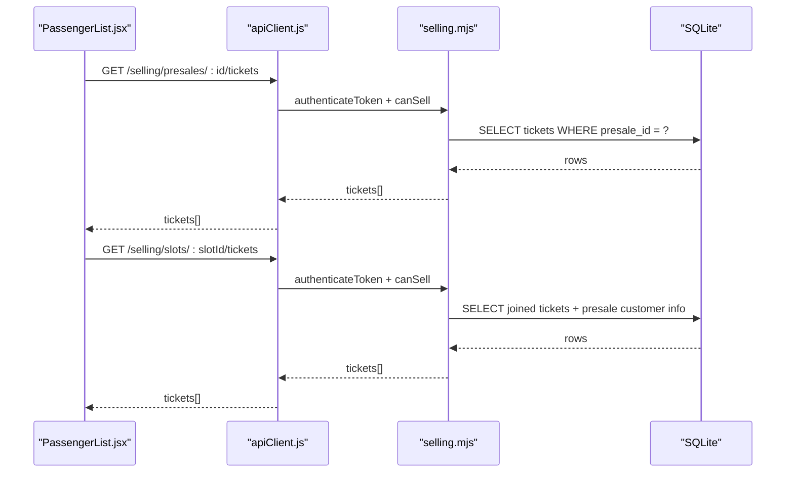
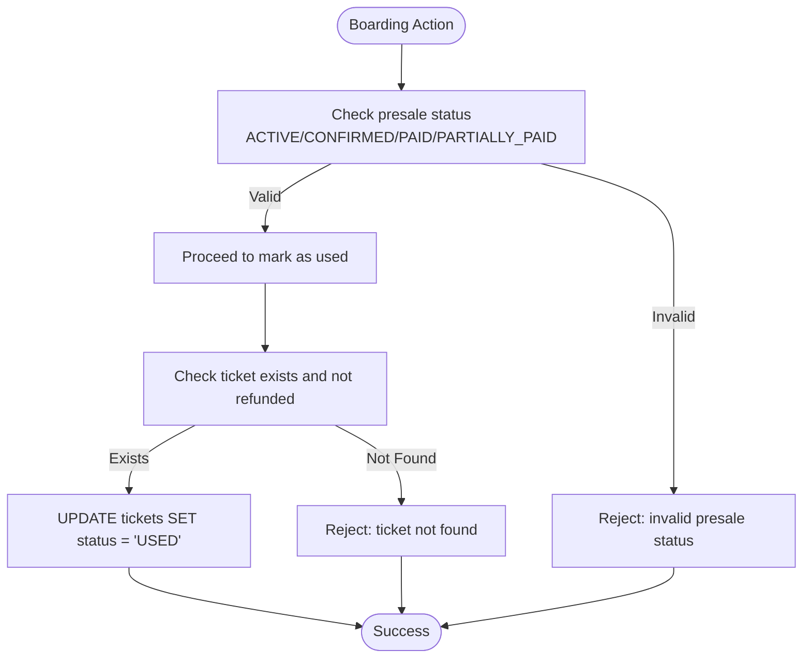
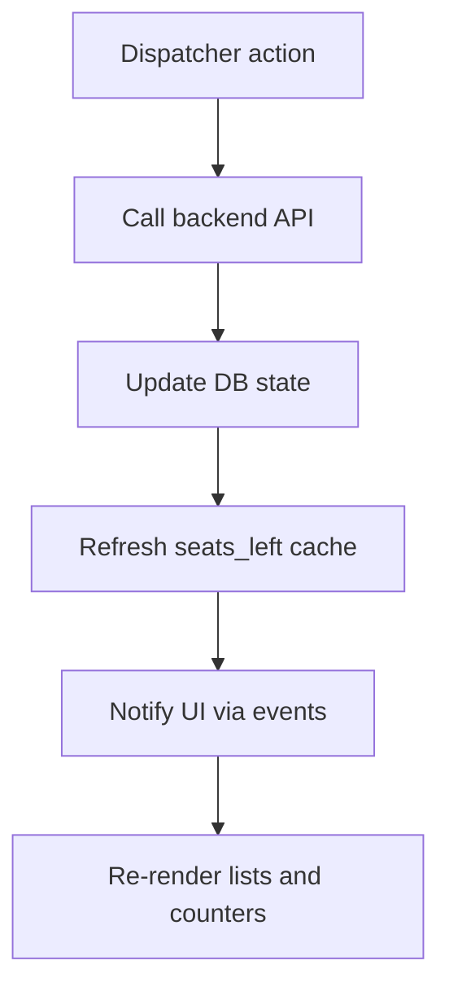
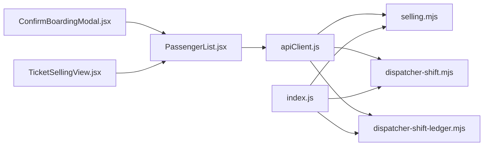

# Passenger Management

<cite>
**Referenced Files in This Document**
- [server/index.js](file://server/index.js)
- [server/selling.mjs](file://server/selling.mjs)
- [server/dispatcher-shift.mjs](file://server/dispatcher-shift.mjs)
- [server/dispatcher-shift-ledger.mjs](file://server/dispatcher-shift-ledger.mjs)
- [src/utils/apiClient.js](file://src/utils/apiClient.js)
- [src/components/dispatcher/PassengerList.jsx](file://src/components/dispatcher/PassengerList.jsx)
- [src/components/dispatcher/ConfirmBoardingModal.jsx](file://src/components/dispatcher/ConfirmBoardingModal.jsx)
- [src/components/dispatcher/TicketSellingView.jsx](file://src/components/dispatcher/TicketSellingView.jsx)
- [src/views/DispatcherView.jsx](file://src/views/DispatcherView.jsx)
</cite>

## Table of Contents
1. [Introduction](#introduction)
2. [Project Structure](#project-structure)
3. [Core Components](#core-components)
4. [Architecture Overview](#architecture-overview)
5. [Detailed Component Analysis](#detailed-component-analysis)
6. [Dependency Analysis](#dependency-analysis)
7. [Performance Considerations](#performance-considerations)
8. [Troubleshooting Guide](#troubleshooting-guide)
9. [Conclusion](#conclusion)

## Introduction
This document describes the API surface for dispatcher passenger management operations. It focuses on:
- Boarding confirmation and attendance tracking
- Passenger list retrieval for trip management and reporting
- Passenger validation and verification processes
- Request/response schemas for check-in, boarding validation, and passenger count management
- Real-time tracking, capacity management during boarding, and error handling for invalid passenger data

The backend is implemented in Express and SQLite, with a React-based frontend that consumes the APIs via a thin client wrapper.

## Project Structure
The passenger management feature spans the backend routes under `/api/selling` and related dispatcher endpoints, and the frontend components that render lists, confirm boarding, and orchestrate operations.

**Diagram sources**
- [server/index.js](file://server/index.js#L25-L40)
- [server/selling.mjs](file://server/selling.mjs#L3532-L3566)
- [server/dispatcher-shift.mjs](file://server/dispatcher-shift.mjs#L7-L59)
- [server/dispatcher-shift-ledger.mjs](file://server/dispatcher-shift-ledger.mjs#L78-L350)
- [src/utils/apiClient.js](file://src/utils/apiClient.js#L105-L297)
- [src/components/dispatcher/TicketSellingView.jsx](file://src/components/dispatcher/TicketSellingView.jsx#L58-L212)
- [src/components/dispatcher/PassengerList.jsx](file://src/components/dispatcher/PassengerList.jsx#L167-L295)
- [src/components/dispatcher/ConfirmBoardingModal.jsx](file://src/components/dispatcher/ConfirmBoardingModal.jsx#L10-L84)
- [src/views/DispatcherView.jsx](file://src/views/DispatcherView.jsx#L23-L125)

**Section sources**
- [server/index.js](file://server/index.js#L25-L40)
- [src/utils/apiClient.js](file://src/utils/apiClient.js#L105-L297)

## Core Components
- Backend routes for passenger and boarding operations:
  - Ticket usage (boarding/attendance): PATCH `/api/selling/tickets/:ticketId/used`
  - Presale usage (boarding): PATCH `/api/selling/presales/:id/used`
  - Refund operations for tickets and presales
  - Retrieval of tickets per presale and per slot
- Frontend client:
  - Unified API client wrapper for all `/api/selling/*` endpoints
  - Passenger list UI with boarding confirmation modal and quick actions
- Dispatcher shift and ledger:
  - Shift deposit endpoint for dispatcher financial operations
  - Safe ledger summary endpoint for dispatcher shift accounting

**Section sources**
- [server/selling.mjs](file://server/selling.mjs#L3532-L3566)
- [server/selling.mjs](file://server/selling.mjs#L3149-L3200)
- [server/selling.mjs](file://server/selling.mjs#L3462-L3530)
- [src/utils/apiClient.js](file://src/utils/apiClient.js#L263-L289)
- [src/utils/apiClient.js](file://src/utils/apiClient.js#L165-L257)
- [server/dispatcher-shift.mjs](file://server/dispatcher-shift.mjs#L7-L59)
- [server/dispatcher-shift-ledger.mjs](file://server/dispatcher-shift-ledger.mjs#L78-L350)

## Architecture Overview
The dispatcher passenger management flow connects the UI to backend routes through the API client. Boarding confirmation triggers a backend transaction to mark a ticket as used without affecting seat availability. Attendance tracking relies on ticket status updates and retrieval endpoints.

**Diagram sources**
- [src/components/dispatcher/PassengerList.jsx](file://src/components/dispatcher/PassengerList.jsx#L579-L733)
- [src/utils/apiClient.js](file://src/utils/apiClient.js#L263-L289)
- [server/selling.mjs](file://server/selling.mjs#L3532-L3566)

## Detailed Component Analysis

### Boarding Confirmation and Attendance Tracking
- Endpoint: PATCH `/api/selling/tickets/:ticketId/used`
- Purpose: Mark a single ticket as boarded/attended without changing seat availability.
- Validation:
  - Requires dispatcher/seller/admin role.
  - Prevents marking if ticket not found.
  - Idempotent: marking an already used ticket returns the ticket unchanged.
- Response: Returns the updated ticket object with status set to used.

**Diagram sources**
- [src/components/dispatcher/PassengerList.jsx](file://src/components/dispatcher/PassengerList.jsx#L632-L641)
- [src/utils/apiClient.js](file://src/utils/apiClient.js#L263-L289)
- [server/selling.mjs](file://server/selling.mjs#L3532-L3566)

**Section sources**
- [server/selling.mjs](file://server/selling.mjs#L3532-L3566)
- [src/utils/apiClient.js](file://src/utils/apiClient.js#L263-L289)
- [src/components/dispatcher/PassengerList.jsx](file://src/components/dispatcher/PassengerList.jsx#L579-L733)

### Passenger List Retrieval for Trip Management and Reporting
- Endpoint: GET `/api/selling/presales/:id/tickets`
  - Retrieves all tickets belonging to a presale, ordered by ticket code.
- Endpoint: GET `/api/selling/slots/:slotId/tickets`
  - Retrieves all non-cancelled/refunded tickets for a given slot (supports both manual and generated slot identifiers).
- Frontend usage:
  - The UI loads presales for a selected trip and then fetches tickets per presale.
  - Seats-left tracking is refreshed via a dedicated dispatcher slots endpoint.

**Diagram sources**
- [src/components/dispatcher/PassengerList.jsx](file://src/components/dispatcher/PassengerList.jsx#L244-L289)
- [src/utils/apiClient.js](file://src/utils/apiClient.js#L255-L261)
- [server/selling.mjs](file://server/selling.mjs#L3462-L3530)

**Section sources**
- [server/selling.mjs](file://server/selling.mjs#L3462-L3530)
- [src/utils/apiClient.js](file://src/utils/apiClient.js#L255-L261)
- [src/components/dispatcher/PassengerList.jsx](file://src/components/dispatcher/PassengerList.jsx#L244-L289)

### Passenger Validation and Verification Processes
- Eligible statuses for boarding:
  - Presale statuses: ACTIVE, CONFIRMED, PAID, PARTIALLY_PAID
  - Blocked statuses: USED, CANCELLED, REFUNDED
- Ticket usage validation:
  - Ticket must exist and not already be refunded.
  - Marking as used is idempotent for already used tickets.
- Capacity management:
  - Seat availability is tracked separately from boarding status.
  - Capacity checks are enforced for seat-occupying operations (not for marking used).

**Diagram sources**
- [server/selling.mjs](file://server/selling.mjs#L3149-L3180)
- [server/selling.mjs](file://server/selling.mjs#L3532-L3566)

**Section sources**
- [server/selling.mjs](file://server/selling.mjs#L3149-L3180)
- [server/selling.mjs](file://server/selling.mjs#L3532-L3566)

### Request/Response Schemas

#### Ticket Used (Boarding)
- Method: PATCH
- Path: `/api/selling/tickets/:ticketId/used`
- Request body: none
- Response:
  - Success: `{ success: true, ticket: { id, presale_id, ticket_code, status, price, created_at, updated_at } }`
  - Error: 404 if ticket not found; 500 on internal error

**Section sources**
- [server/selling.mjs](file://server/selling.mjs#L3532-L3566)
- [src/utils/apiClient.js](file://src/utils/apiClient.js#L263-L289)

#### Presale Used (Boarding)
- Method: PATCH
- Path: `/api/selling/presales/:id/used`
- Request body: none
- Response:
  - Success: Full presale record with updated status and computed remaining amount
  - Error: 400 if status not eligible or already processed; 500 on internal error

**Section sources**
- [server/selling.mjs](file://server/selling.mjs#L3149-L3200)
- [src/utils/apiClient.js](file://src/utils/apiClient.js#L243-L245)

#### Tickets by Presale
- Method: GET
- Path: `/api/selling/presales/:id/tickets`
- Response: Array of tickets with fields: id, presale_id, ticket_code, status, price, created_at, updated_at

**Section sources**
- [server/selling.mjs](file://server/selling.mjs#L3462-L3485)
- [src/utils/apiClient.js](file://src/utils/apiClient.js#L255-L257)

#### Tickets by Slot
- Method: GET
- Path: `/api/selling/slots/:slotId/tickets`
- Notes: Supports both manual (`:slotId`) and generated (`generated:<id>`) slot identifiers
- Response: Array of tickets with customer info and ticket fields

**Section sources**
- [server/selling.mjs](file://server/selling.mjs#L3487-L3530)
- [src/utils/apiClient.js](file://src/utils/apiClient.js#L259-L261)

### Examples

#### Example: Passenger Boarding Workflow
- Steps:
  1. Dispatcher selects a ticket in the UI.
  2. Confirm boarding modal opens; dispatcher confirms.
  3. Frontend calls PATCH `/api/selling/tickets/:ticketId/used`.
  4. Backend marks ticket as used and returns updated ticket.
  5. Frontend refreshes tickets list and seats-left counters.

**Section sources**
- [src/components/dispatcher/PassengerList.jsx](file://src/components/dispatcher/PassengerList.jsx#L735-L762)
- [src/components/dispatcher/ConfirmBoardingModal.jsx](file://src/components/dispatcher/ConfirmBoardingModal.jsx#L10-L84)
- [server/selling.mjs](file://server/selling.mjs#L3532-L3566)

#### Example: List Generation for Reporting
- Steps:
  1. Dispatcher selects a trip.
  2. Frontend calls GET `/api/selling/dispatcher/slots` to get trip list.
  3. For each presale, call GET `/api/selling/presales/:id/tickets`.
  4. Combine presale and ticket data for reporting.

**Section sources**
- [src/components/dispatcher/TicketSellingView.jsx](file://src/components/dispatcher/TicketSellingView.jsx#L58-L212)
- [src/components/dispatcher/PassengerList.jsx](file://src/components/dispatcher/PassengerList.jsx#L244-L289)
- [src/utils/apiClient.js](file://src/utils/apiClient.js#L108-L128)
- [src/utils/apiClient.js](file://src/utils/apiClient.js#L174-L201)

#### Example: Attendance Recording
- Steps:
  1. Dispatcher selects a ticket.
  2. Confirm boarding modal opens; dispatcher confirms.
  3. Frontend calls PATCH `/api/selling/tickets/:ticketId/used`.
  4. Frontend refreshes UI and dispatches events to update other views.

**Section sources**
- [src/components/dispatcher/PassengerList.jsx](file://src/components/dispatcher/PassengerList.jsx#L764-L780)
- [src/components/dispatcher/ConfirmBoardingModal.jsx](file://src/components/dispatcher/ConfirmBoardingModal.jsx#L10-L84)
- [server/selling.mjs](file://server/selling.mjs#L3532-L3566)

### Real-Time Passenger Tracking and Capacity Management
- Real-time tracking:
  - UI listens for custom events to refresh trip lists and seats-left counters.
  - Seats-left is recalculated from the backend dispatcher slots endpoint.
- Capacity management:
  - Seat occupancy is counted from tickets with seat-occupying statuses.
  - Capacity checks enforce limits for seat-occupying operations.
  - For generated slots, seats_left is recomputed from presales and cached.

**Diagram sources**
- [src/components/dispatcher/PassengerList.jsx](file://src/components/dispatcher/PassengerList.jsx#L184-L196)
- [server/selling.mjs](file://server/selling.mjs#L96-L102)
- [server/selling.mjs](file://server/selling.mjs#L62-L94)

**Section sources**
- [src/components/dispatcher/PassengerList.jsx](file://src/components/dispatcher/PassengerList.jsx#L184-L196)
- [server/selling.mjs](file://server/selling.mjs#L96-L102)
- [server/selling.mjs](file://server/selling.mjs#L62-L94)

## Dependency Analysis
- Frontend-to-backend dependencies:
  - PassengerList depends on apiClient for all selling endpoints.
  - ConfirmBoardingModal coordinates boarding decisions and error messaging.
  - TicketSellingView orchestrates trip selection and list rendering.
- Backend routing:
  - Index mounts selling, dispatcher shift, and ledger routers.
  - Selling routes implement boarding, refunds, and ticket retrieval.
  - Dispatcher routes implement shift deposit and ledger summaries.

**Diagram sources**
- [src/utils/apiClient.js](file://src/utils/apiClient.js#L105-L297)
- [server/index.js](file://server/index.js#L25-L40)
- [server/selling.mjs](file://server/selling.mjs#L3532-L3566)
- [server/dispatcher-shift.mjs](file://server/dispatcher-shift.mjs#L7-L59)
- [server/dispatcher-shift-ledger.mjs](file://server/dispatcher-shift-ledger.mjs#L78-L350)
- [src/components/dispatcher/PassengerList.jsx](file://src/components/dispatcher/PassengerList.jsx#L167-L295)
- [src/components/dispatcher/ConfirmBoardingModal.jsx](file://src/components/dispatcher/ConfirmBoardingModal.jsx#L10-L84)
- [src/components/dispatcher/TicketSellingView.jsx](file://src/components/dispatcher/TicketSellingView.jsx#L58-L212)

**Section sources**
- [src/utils/apiClient.js](file://src/utils/apiClient.js#L105-L297)
- [server/index.js](file://server/index.js#L25-L40)

## Performance Considerations
- Seat availability computation:
  - For generated slots, seats_left is recomputed from presales and cached to reduce drift.
  - Manual slots rely on boat_slots.seats_left with periodic recalculation.
- Transactional operations:
  - Boarding and refund operations use transactions to maintain consistency.
- UI responsiveness:
  - Debouncing and anti-spam guards prevent excessive reloads.
  - Event-driven refresh minimizes polling and improves perceived performance.

[No sources needed since this section provides general guidance]

## Troubleshooting Guide
Common issues and resolutions:
- Invalid presale status for boarding:
  - Ensure presale status is ACTIVE, CONFIRMED, PAID, or PARTIALLY_PAID.
- Ticket not found:
  - Verify ticketId correctness and existence.
- Capacity exceeded:
  - For seat-occupying operations, ensure requested seats do not exceed free capacity.
- Shift deposit failures:
  - Validate type and amount; allowed types include deposit-related values.

**Section sources**
- [server/selling.mjs](file://server/selling.mjs#L3149-L3180)
- [server/selling.mjs](file://server/selling.mjs#L3532-L3566)
- [server/dispatcher-shift.mjs](file://server/dispatcher-shift.mjs#L12-L24)

## Conclusion
The passenger management APIs provide a robust foundation for dispatcher operations:
- Boarding confirmation is secure, idempotent, and does not alter seat availability.
- Ticket retrieval endpoints enable comprehensive reporting and trip management.
- Validation logic prevents misuse and maintains data integrity.
- Real-time updates and capacity management ensure accurate, up-to-date information during boarding.