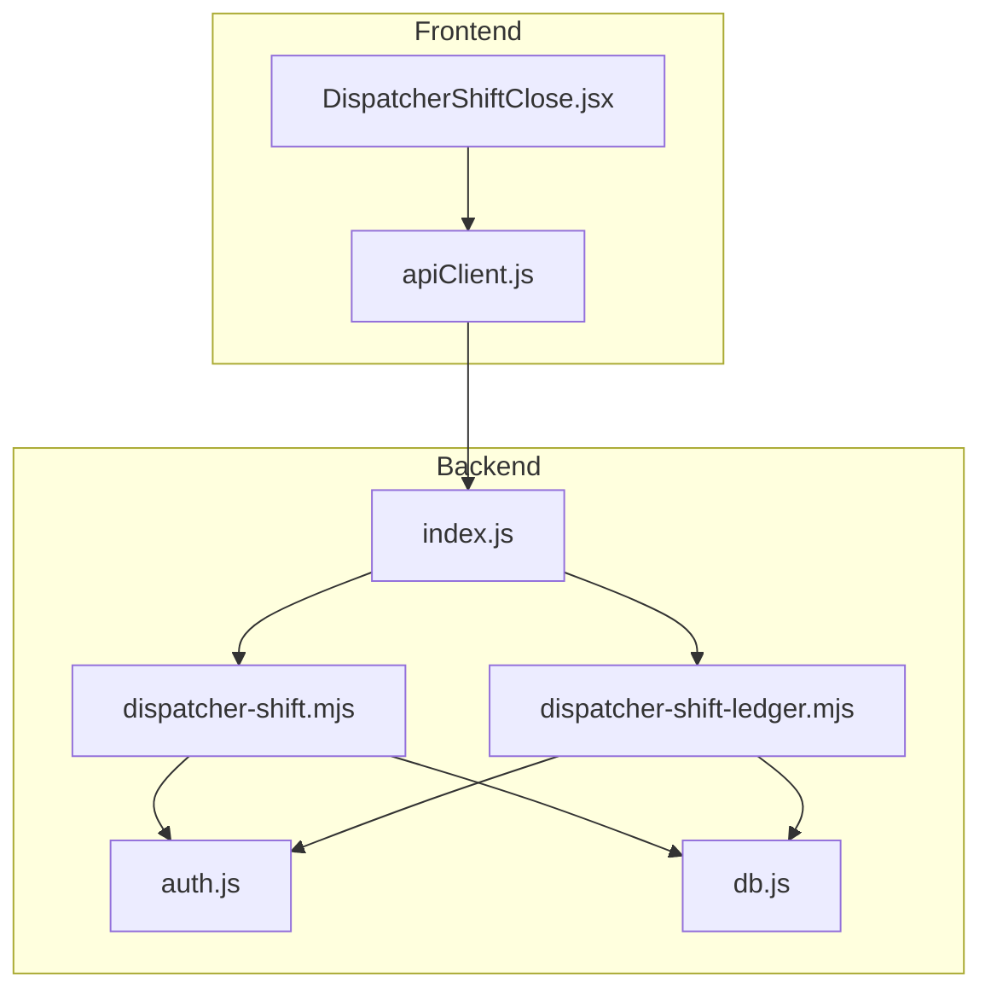
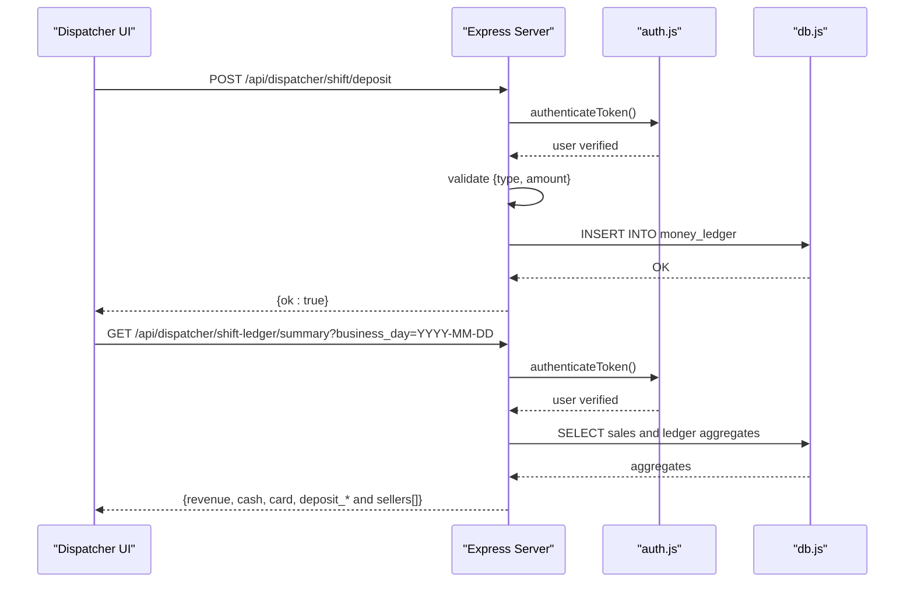
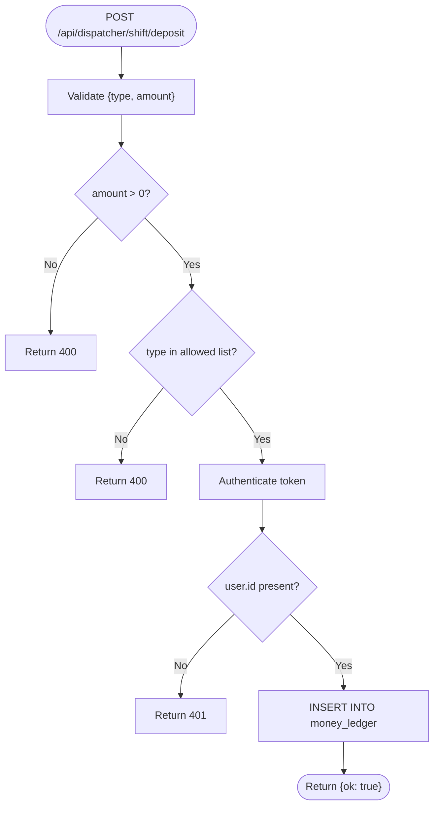
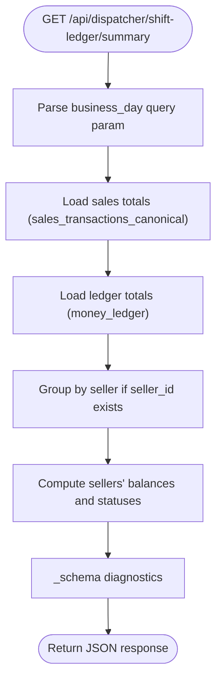
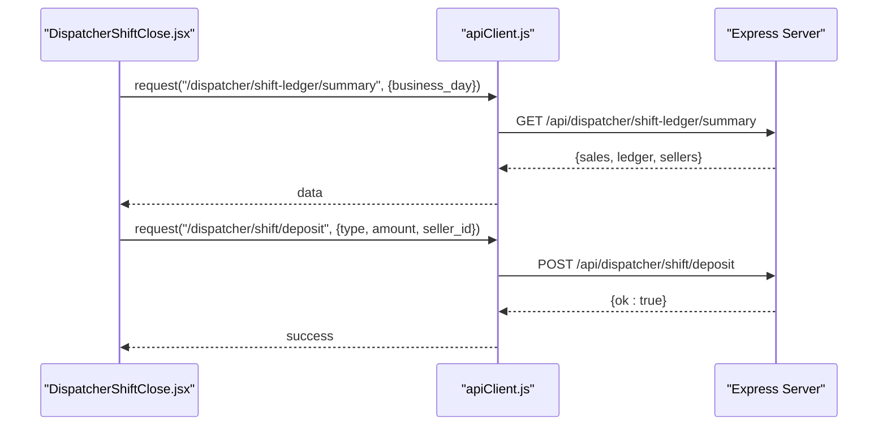
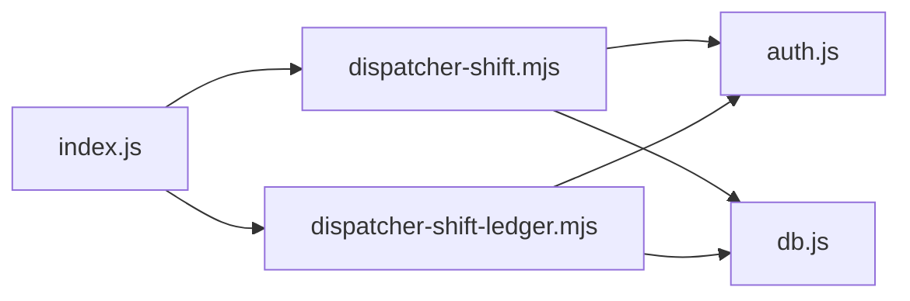

# Shift Management

<cite>
**Referenced Files in This Document**
- [index.js](file://server/index.js)
- [dispatcher-shift.mjs](file://server/dispatcher-shift.mjs)
- [dispatcher-shift-ledger.mjs](file://server/dispatcher-shift-ledger.mjs)
- [auth.js](file://server/auth.js)
- [db.js](file://server/db.js)
- [DispatcherShiftClose.jsx](file://src/views/DispatcherShiftClose.jsx)
- [apiClient.js](file://src/utils/apiClient.js)
</cite>

## Table of Contents
1. [Introduction](#introduction)
2. [Project Structure](#project-structure)
3. [Core Components](#core-components)
4. [Architecture Overview](#architecture-overview)
5. [Detailed Component Analysis](#detailed-component-analysis)
6. [Dependency Analysis](#dependency-analysis)
7. [Performance Considerations](#performance-considerations)
8. [Troubleshooting Guide](#troubleshooting-guide)
9. [Conclusion](#conclusion)

## Introduction
This document describes the dispatcher shift management APIs for cash handling and shift ledger operations. It covers:
- Deposit endpoint for cash handling with three transaction types
- Shift ledger summary for financial tracking and reconciliation
- Authentication requirements (dispatcher role)
- Request/response schemas
- Transaction processing workflows
- Examples for shift opening procedures, cash deposits, salary payouts, and shift closing processes
- Error handling for invalid amounts, unauthorized transactions, and database operations

## Project Structure
The shift management functionality is implemented as Express routes mounted under `/api/dispatcher`. The backend exposes:
- A deposit endpoint for cash handling
- A ledger summary endpoint for financial reconciliation
The frontend integrates with these endpoints via an API client and a dedicated shift closing view.

**Diagram sources**
- [index.js](file://server/index.js#L1-L45)
- [dispatcher-shift.mjs](file://server/dispatcher-shift.mjs#L1-L61)
- [dispatcher-shift-ledger.mjs](file://server/dispatcher-shift-ledger.mjs#L1-L352)
- [auth.js](file://server/auth.js#L1-L154)
- [db.js](file://server/db.js#L1-L1269)
- [DispatcherShiftClose.jsx](file://src/views/DispatcherShiftClose.jsx#L1-L800)
- [apiClient.js](file://src/utils/apiClient.js#L1-L360)

**Section sources**
- [index.js](file://server/index.js#L1-L45)

## Core Components
- Deposit endpoint for dispatcher shift cash handling
  - Endpoint: POST /api/dispatcher/shift/deposit
  - Accepts: type, amount
  - Validates: amount > 0 and type in allowed list
  - Inserts a record into money_ledger with kind=DISPATCHER_SHIFT and status=POSTED
- Shift ledger summary endpoint
  - Endpoint: GET /api/dispatcher/shift-ledger/summary
  - Returns: sales totals, deposit totals (cash/card/total), per-seller deposits, and computed balances
  - Supports business_day filtering and graceful handling of schema differences

**Section sources**
- [dispatcher-shift.mjs](file://server/dispatcher-shift.mjs#L7-L59)
- [dispatcher-shift-ledger.mjs](file://server/dispatcher-shift-ledger.mjs#L78-L350)

## Architecture Overview
The system enforces authentication and role checks, validates inputs, and persists ledger entries to SQLite. The UI coordinates deposits and shift closing based on ledger summaries.

**Diagram sources**
- [dispatcher-shift.mjs](file://server/dispatcher-shift.mjs#L8-L54)
- [dispatcher-shift-ledger.mjs](file://server/dispatcher-shift-ledger.mjs#L78-L350)
- [auth.js](file://server/auth.js#L10-L40)
- [db.js](file://server/db.js#L1-L1269)

## Detailed Component Analysis

### Deposit Endpoint: Cash Handling
- Purpose: Record cash handling operations for the current business day
- Allowed transaction types:
  - DEPOSIT_TO_OWNER_CASH
  - DEPOSIT_TO_OWNER_TERMINAL
  - SALARY_PAYOUT_CASH
- Validation:
  - type and amount required
  - amount must be greater than zero
  - type must be one of the allowed values
- Persistence:
  - Inserts into money_ledger with kind=DISPATCHER_SHIFT and status=POSTED
  - Sets event_time and business_day/trip_day to current local date/time
- Authentication:
  - Requires a valid JWT token; user must be authenticated

**Diagram sources**
- [dispatcher-shift.mjs](file://server/dispatcher-shift.mjs#L8-L54)

**Section sources**
- [dispatcher-shift.mjs](file://server/dispatcher-shift.mjs#L8-L59)

### Shift Ledger Summary: Financial Tracking and Reconciliation
- Purpose: Provide a safe, schema-tolerant summary of sales and ledger deposits for a given business_day
- Inputs:
  - Query parameter business_day (YYYY-MM-DD) or trip_day
- Outputs:
  - Sales totals: revenue, qty, cash, card
  - Deposit totals: deposit_cash, deposit_card, deposit_total
  - Per-seller breakdown: deposit_total, deposit_cash, deposit_card
  - Sellers summary: accepted, deposited, balance, and UI-friendly aliases
  - Schema diagnostics for support
- Behavior:
  - Gracefully handles missing tables/columns using PRAGMA checks
  - Filters by status=POSTED and kind=DISPATCHER_SHIFT for ledger entries
  - Computes balances and statuses for UI

**Diagram sources**
- [dispatcher-shift-ledger.mjs](file://server/dispatcher-shift-ledger.mjs#L78-L350)

**Section sources**
- [dispatcher-shift-ledger.mjs](file://server/dispatcher-shift-ledger.mjs#L78-L350)

### Frontend Integration and Workflow
- The DispatcherShiftClose view:
  - Loads ledger summary from backend
  - Allows applying cash and terminal deposits per seller
  - Supports manual salary payout entries (placeholder)
  - Prevents shift closure until all conditions are met
- API client:
  - Adds Authorization header automatically
  - Handles network logging and error propagation

**Diagram sources**
- [DispatcherShiftClose.jsx](file://src/views/DispatcherShiftClose.jsx#L96-L321)
- [apiClient.js](file://src/utils/apiClient.js#L23-L88)
- [dispatcher-shift.mjs](file://server/dispatcher-shift.mjs#L8-L54)

**Section sources**
- [DispatcherShiftClose.jsx](file://src/views/DispatcherShiftClose.jsx#L96-L321)
- [apiClient.js](file://src/utils/apiClient.js#L23-L88)

## Dependency Analysis
- Route mounting:
  - index.js mounts dispatcher-shift and dispatcher-shift-ledger routers under /api/dispatcher and /api/dispatcher/shift-ledger
- Authentication:
  - Both endpoints use authenticateToken middleware
  - Additional role checks are available via canDispatchManageSlots in auth.js
- Database:
  - money_ledger table is used for recording deposits
  - sales totals rely on sales_transactions_canonical if present

**Diagram sources**
- [index.js](file://server/index.js#L14-L35)
- [dispatcher-shift.mjs](file://server/dispatcher-shift.mjs#L1-L61)
- [dispatcher-shift-ledger.mjs](file://server/dispatcher-shift-ledger.mjs#L1-L352)
- [auth.js](file://server/auth.js#L10-L40)
- [db.js](file://server/db.js#L1036-L1057)

**Section sources**
- [index.js](file://server/index.js#L14-L35)
- [auth.js](file://server/auth.js#L10-L40)
- [db.js](file://server/db.js#L1036-L1057)

## Performance Considerations
- The ledger summary endpoint uses safe SQL queries with PRAGMA-based schema checks to avoid startup failures and reduce runtime overhead.
- Aggregations are performed server-side with indexed columns where applicable.
- The deposit endpoint performs a single INSERT operation per request, minimizing database contention.

## Troubleshooting Guide
Common issues and resolutions:
- Invalid amount or missing fields
  - Symptom: 400 Bad Request
  - Cause: amount missing, zero/non-positive, or type missing/not allowed
  - Resolution: Ensure amount > 0 and type is one of the allowed values
- Unauthorized access
  - Symptom: 401 Unauthorized
  - Cause: missing or invalid JWT token
  - Resolution: Authenticate and include a valid Bearer token
- Database errors
  - Symptom: 500 Internal Server Error
  - Cause: unexpected failure during INSERT or SELECT
  - Resolution: Check server logs; ensure money_ledger schema exists and is accessible
- Schema mismatches
  - Symptom: Missing columns in responses
  - Cause: sales_transactions_canonical or money_ledger columns not present
  - Resolution: The ledger summary endpoint gracefully handles missing tables/columns and returns diagnostics via _schema

**Section sources**
- [dispatcher-shift.mjs](file://server/dispatcher-shift.mjs#L12-L29)
- [dispatcher-shift.mjs](file://server/dispatcher-shift.mjs#L55-L58)
- [dispatcher-shift-ledger.mjs](file://server/dispatcher-shift-ledger.mjs#L332-L349)

## Conclusion
The dispatcher shift management APIs provide a robust foundation for cash handling and financial reconciliation:
- The deposit endpoint securely records cash handling events with strict validation and persistence
- The ledger summary endpoint delivers a schema-tolerant view of sales and deposits for accurate reconciliation
- The frontend integrates these endpoints to support shift opening, cash deposits, salary payouts, and shift closing workflows