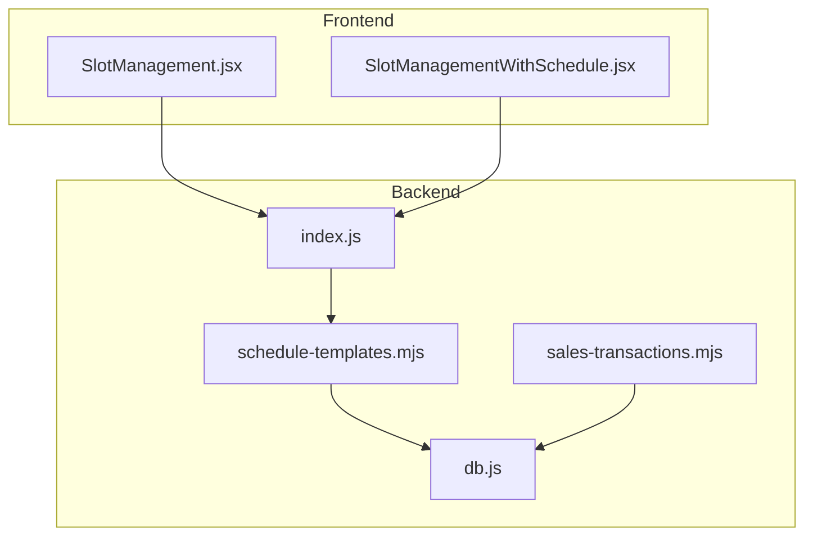
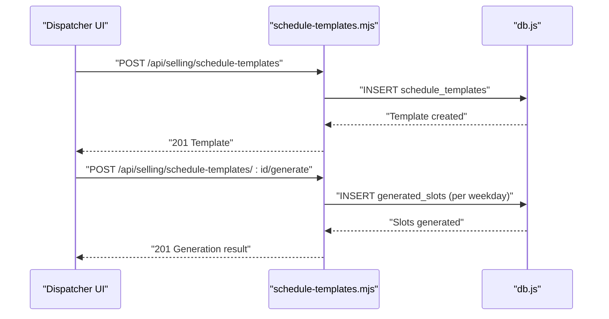
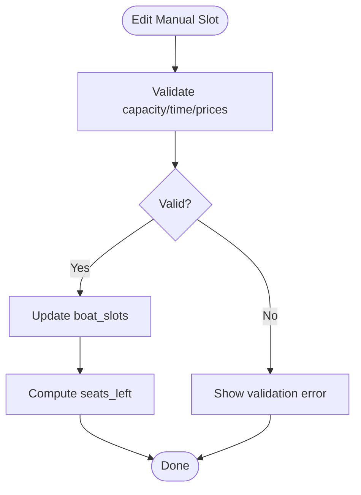
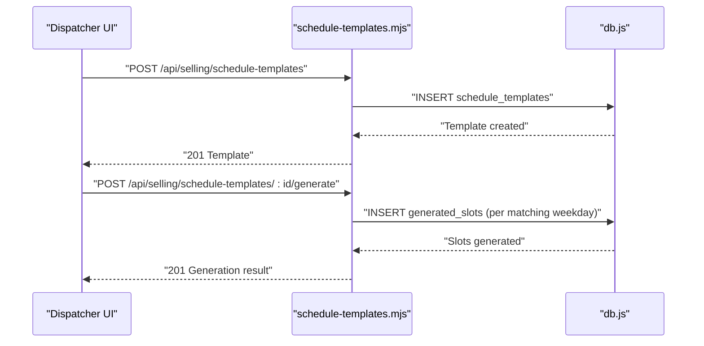
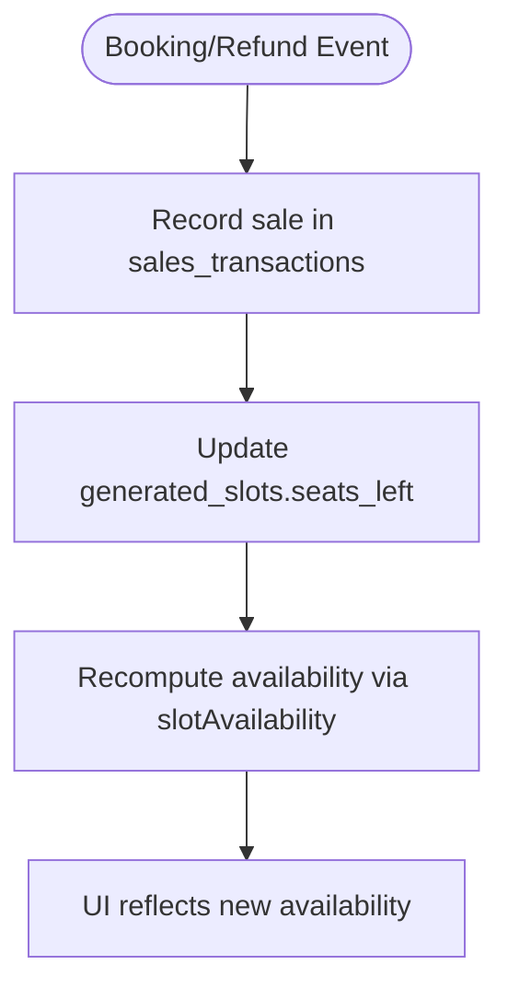
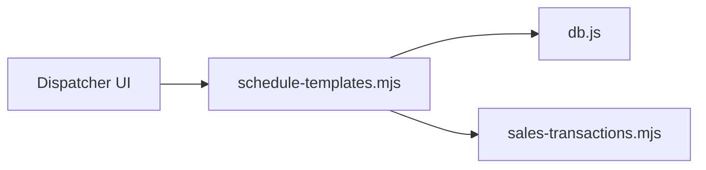

# Slot and Capacity Management

<cite>
**Referenced Files in This Document**
- [README.md](file://README.md)
- [server/index.js](file://server/index.js)
- [server/db.js](file://server/db.js)
- [server/schedule-templates.mjs](file://server/schedule-templates.mjs)
- [server/sales-transactions.mjs](file://server/sales-transactions.mjs)
- [src/components/dispatcher/SlotManagement.jsx](file://src/components/dispatcher/SlotManagement.jsx)
- [src/components/dispatcher/SlotManagementWithSchedule.jsx](file://src/components/dispatcher/SlotManagementWithSchedule.jsx)
- [src/utils/slotAvailability.js](file://src/utils/slotAvailability.js)
</cite>

## Table of Contents
1. [Introduction](#introduction)
2. [Project Structure](#project-structure)
3. [Core Components](#core-components)
4. [Architecture Overview](#architecture-overview)
5. [Detailed Component Analysis](#detailed-component-analysis)
6. [Dependency Analysis](#dependency-analysis)
7. [Performance Considerations](#performance-considerations)
8. [Troubleshooting Guide](#troubleshooting-guide)
9. [Conclusion](#conclusion)

## Introduction
This document describes the slot and capacity management APIs used by dispatchers to configure, operate, and monitor trip slots. It covers:
- Slot creation, modification, and deletion for both manual and schedule-generated slots
- Real-time seat availability and capacity adjustments
- Capacity planning via schedule templates and generated slot generation
- Request/response schemas, validation rules, and operational constraints
- Examples for setting up trip slots, managing seat allocations, updating capacity limits, and handling real-time availability changes
- Overbooking prevention and slot synchronization across the system

## Project Structure
The slot and capacity management spans the backend server routes, database schema, and dispatcher UI components:
- Backend routes expose CRUD operations for schedule templates and generated slots, plus availability queries
- Database schema defines tables for manual slots, generated slots, schedule templates, and related metadata
- Frontend components provide dispatcher UI for creating/updating slots and viewing schedules

**Diagram sources**
- [server/index.js](file://server/index.js#L1-L45)
- [server/schedule-templates.mjs](file://server/schedule-templates.mjs#L1-L760)
- [server/db.js](file://server/db.js#L68-L85)
- [server/sales-transactions.mjs](file://server/sales-transactions.mjs#L34-L63)
- [src/components/dispatcher/SlotManagement.jsx](file://src/components/dispatcher/SlotManagement.jsx#L1-L1058)
- [src/components/dispatcher/SlotManagementWithSchedule.jsx](file://src/components/dispatcher/SlotManagementWithSchedule.jsx#L1-L1062)

**Section sources**
- [README.md](file://README.md#L1-L150)
- [server/index.js](file://server/index.js#L1-L45)

## Core Components
- Manual slots (boat_slots): Per-boat, per-time entries with capacity and seats_left
- Generated slots (generated_slots): Date-specific instances derived from schedule templates
- Schedule templates (schedule_templates): Repeating patterns for capacity planning
- Availability helpers (slotAvailability.js): Utilities to compute available seats

Key backend routes:
- GET/POST/PATCH/DELETE /api/selling/schedule-templates
- POST /api/selling/schedule-templates/:id/generate
- GET /api/selling/generated-slots
- GET /api/selling/generated-slots/active

**Section sources**
- [server/db.js](file://server/db.js#L68-L85)
- [server/schedule-templates.mjs](file://server/schedule-templates.mjs#L48-L758)
- [src/utils/slotAvailability.js](file://src/utils/slotAvailability.js#L1-L19)

## Architecture Overview
The dispatcher manages two complementary systems:
- Manual slot configuration for ad-hoc trips
- Schedule templates that generate date-specific slots

**Diagram sources**
- [server/schedule-templates.mjs](file://server/schedule-templates.mjs#L98-L218)
- [server/schedule-templates.mjs](file://server/schedule-templates.mjs#L305-L385)

## Detailed Component Analysis

### Manual Slot Management (boat_slots)
Manual slots are configured per boat and time. They include capacity and seats_left, which are used to enforce availability and prevent overbooking.

- Endpoint: Not exposed as a dedicated CRUD endpoint in the provided files; dispatcher UI constructs forms to edit existing slots and validates constraints before submission
- Validation highlights:
  - Capacity and seats_left must be positive integers
  - Time must be within allowed bounds and interval
  - Prices per category validated per boat type (bananas disallow teen pricing)
- Seat availability:
  - Available seats computed from seats_left
  - Sold-out detection when available seats ≤ 0

**Diagram sources**
- [src/components/dispatcher/SlotManagement.jsx](file://src/components/dispatcher/SlotManagement.jsx#L220-L354)
- [src/utils/slotAvailability.js](file://src/utils/slotAvailability.js#L7-L19)

**Section sources**
- [src/components/dispatcher/SlotManagement.jsx](file://src/components/dispatcher/SlotManagement.jsx#L19-L500)
- [src/utils/slotAvailability.js](file://src/utils/slotAvailability.js#L1-L19)

### Schedule Templates and Generated Slots
Schedule templates define recurring patterns (by weekday, time, capacity, duration, prices). Generated slots are created from templates for a date range.

- Create template:
  - Required: weekday, time, product_type, capacity, price_adult, price_child, duration_minutes
  - Validation: time format, duration by product type, capacity constraints, price positivity
- Generate slots:
  - From a single template for a date range
  - Bulk generation across all active templates for a date range
- Query generated slots:
  - List by date range or date
  - Active-only listing for selling

**Diagram sources**
- [server/schedule-templates.mjs](file://server/schedule-templates.mjs#L98-L218)
- [server/schedule-templates.mjs](file://server/schedule-templates.mjs#L305-L385)

**Section sources**
- [server/schedule-templates.mjs](file://server/schedule-templates.mjs#L48-L758)
- [server/db.js](file://server/db.js#L686-L726)

### Real-Time Seat Availability and Capacity Adjustments
Real-time availability is driven by:
- seats_left in generated_slots and boat_slots
- Price and capacity validation rules enforced at template and slot creation/update
- Canonical sales transactions recording per-slot revenue for owner analytics

**Diagram sources**
- [server/sales-transactions.mjs](file://server/sales-transactions.mjs#L167-L236)
- [src/utils/slotAvailability.js](file://src/utils/slotAvailability.js#L7-L19)

**Section sources**
- [server/sales-transactions.mjs](file://server/sales-transactions.mjs#L34-L63)
- [server/sales-transactions.mjs](file://server/sales-transactions.mjs#L167-L236)
- [src/utils/slotAvailability.js](file://src/utils/slotAvailability.js#L1-L19)

### Dispatcher UI Components
- SlotManagement.jsx: Provides form and validation for manual slot creation/editing, cancellation, and deletion
- SlotManagementWithSchedule.jsx: Extends UI to manage schedule templates and generated slots alongside manual slots

Key capabilities:
- Form validation for time, capacity, duration, and prices
- Dynamic constraints based on boat type (bananas vs others)
- Success/error messaging and state updates

**Section sources**
- [src/components/dispatcher/SlotManagement.jsx](file://src/components/dispatcher/SlotManagement.jsx#L19-L500)
- [src/components/dispatcher/SlotManagementWithSchedule.jsx](file://src/components/dispatcher/SlotManagementWithSchedule.jsx#L1-L500)

## Dependency Analysis
- UI depends on backend routes for CRUD operations on schedule templates and generated slots
- Backend routes depend on db.js for schema and data access
- Sales transaction canonicalization depends on generated_slots and presales data

**Diagram sources**
- [server/schedule-templates.mjs](file://server/schedule-templates.mjs#L48-L758)
- [server/db.js](file://server/db.js#L68-L85)
- [server/sales-transactions.mjs](file://server/sales-transactions.mjs#L34-L63)

**Section sources**
- [server/index.js](file://server/index.js#L1-L45)
- [server/schedule-templates.mjs](file://server/schedule-templates.mjs#L48-L758)
- [server/db.js](file://server/db.js#L68-L85)
- [server/sales-transactions.mjs](file://server/sales-transactions.mjs#L34-L63)

## Performance Considerations
- Indexes on generated_slots (trip_date, time, boat_id) prevent duplicate slot creation and improve lookup performance
- Unique constraints on generated_slots avoid redundant entries
- Queries filter by is_active and seats_left to minimize unnecessary data transfer
- Batch generation of slots from templates reduces per-day overhead

[No sources needed since this section provides general guidance]

## Troubleshooting Guide
Common issues and resolutions:
- Validation errors on slot creation/editing:
  - Ensure time is in allowed interval and format
  - Verify capacity and prices are positive
  - For bananas, capacity must be 12 and teen price must not be set
- Duplicate generated slots:
  - The unique index prevents insertion of identical (date, time, boat)
  - Check existing generated slots before generating
- Overbooking prevention:
  - seats_left is decremented upon valid sales; ensure sales transactions are recorded
  - Use active-only listing for selling to avoid outdated slots

**Section sources**
- [server/schedule-templates.mjs](file://server/schedule-templates.mjs#L103-L146)
- [server/db.js](file://server/db.js#L728-L751)
- [server/sales-transactions.mjs](file://server/sales-transactions.mjs#L167-L236)

## Conclusion
The slot and capacity management system combines manual slot controls with schedule-driven automation. It enforces capacity and pricing constraints, tracks real-time availability, and prevents overbooking through canonical sales transactions. Dispatcher UI components streamline configuration and monitoring, while backend routes and database constraints ensure consistency and reliability.