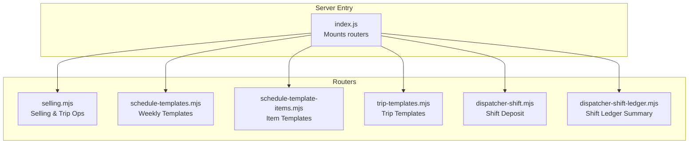
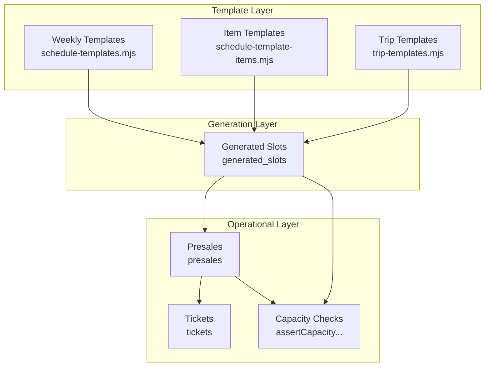
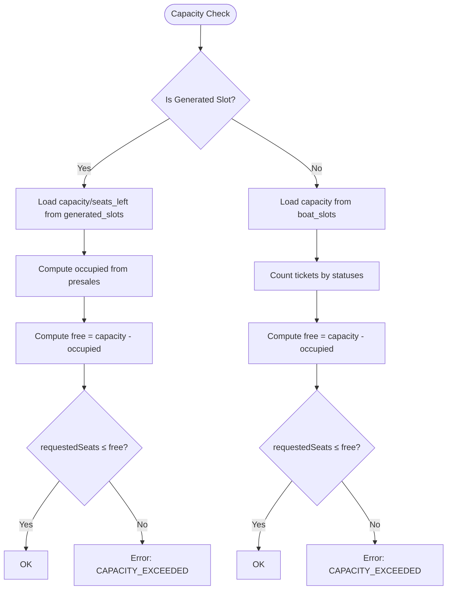
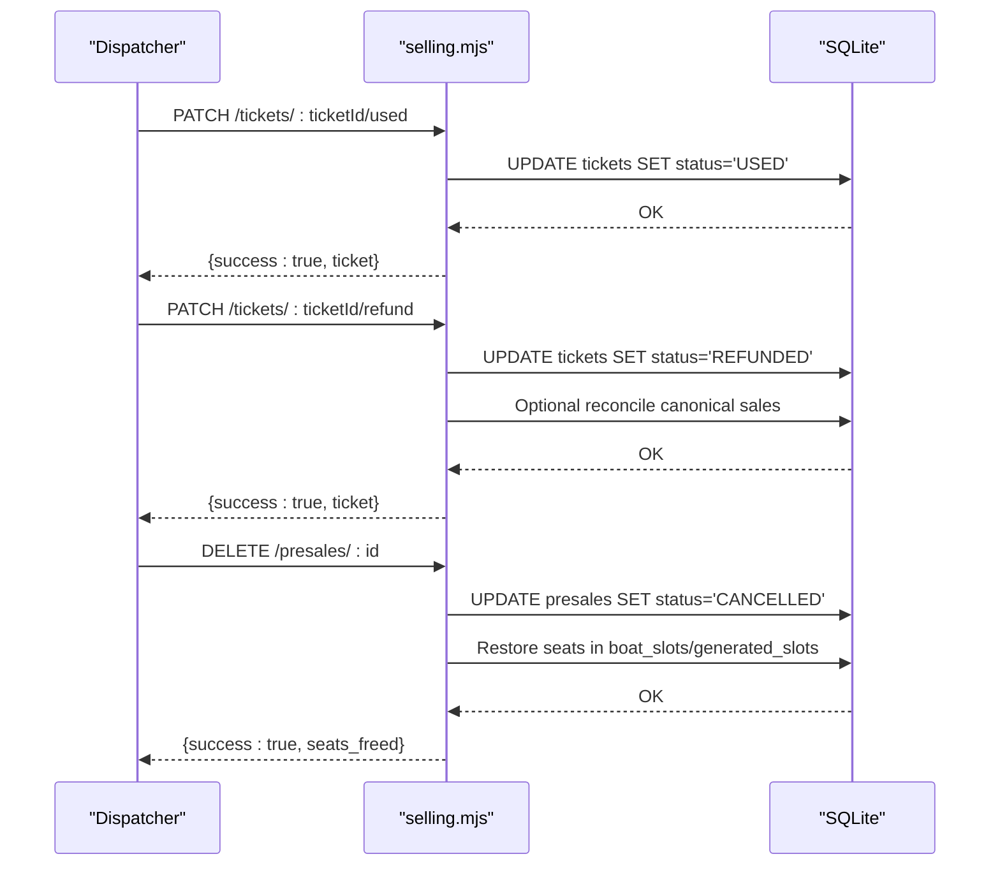
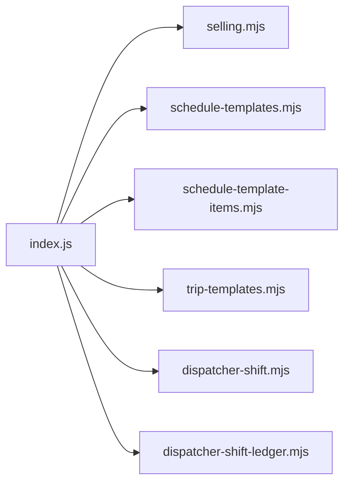

# Trip Operations

<cite>
**Referenced Files in This Document**
- [index.js](file://server/index.js)
- [selling.mjs](file://server/selling.mjs)
- [schedule-templates.mjs](file://server/schedule-templates.mjs)
- [schedule-template-items.mjs](file://server/schedule-template-items.mjs)
- [trip-templates.mjs](file://server/trip-templates.mjs)
- [dispatcher-shift.mjs](file://server/dispatcher-shift.mjs)
- [dispatcher-shift-ledger.mjs](file://server/dispatcher-shift-ledger.mjs)
</cite>

## Table of Contents
1. [Introduction](#introduction)
2. [Project Structure](#project-structure)
3. [Core Components](#core-components)
4. [Architecture Overview](#architecture-overview)
5. [Detailed Component Analysis](#detailed-component-analysis)
6. [Dependency Analysis](#dependency-analysis)
7. [Performance Considerations](#performance-considerations)
8. [Troubleshooting Guide](#troubleshooting-guide)
9. [Conclusion](#conclusion)

## Introduction
This document describes the dispatcher trip management APIs exposed by the backend. It covers:
- Trip creation via schedule templates and template items
- Trip modification and deletion
- Trip cancellation and status updates
- Real-time trip management and capacity enforcement
- Trip template management for schedule configuration and recurring setups
- Request/response schemas, validation rules, capacity constraints, and conflict resolution

The backend is an Express server that mounts multiple route groups under /api/selling, /api/dispatcher, and related namespaces. Dispatcher-specific capabilities are protected by role-based middleware.

## Project Structure
The server exposes several route modules:
- Selling routes: trip listings, presales, tickets, and capacity management
- Schedule templates: recurring schedule templates (by weekday/time)
- Schedule template items: fine-grained template items with bitmask weekdays
- Trip templates: simplified trip templates (time/duration/capacity/pricing)
- Dispatcher shift and ledger: shift deposit and financial summary

**Diagram sources**
- [index.js](file://server/index.js#L1-L45)
- [selling.mjs](file://server/selling.mjs#L1-L120)
- [schedule-templates.mjs](file://server/schedule-templates.mjs#L1-L120)
- [schedule-template-items.mjs](file://server/schedule-template-items.mjs#L1-L120)
- [trip-templates.mjs](file://server/trip-templates.mjs#L1-L120)
- [dispatcher-shift.mjs](file://server/dispatcher-shift.mjs#L1-L62)
- [dispatcher-shift-ledger.mjs](file://server/dispatcher-shift-ledger.mjs#L1-L60)

**Section sources**
- [index.js](file://server/index.js#L1-L45)

## Core Components
- Selling routes: provide trip listings, capacity checks, presales, and ticket status updates
- Schedule templates: weekly recurring templates with weekday/time/product/capacity/pricing
- Schedule template items: per-item templates with bitmask weekdays and optional boat association
- Trip templates: simplified templates with product type, time, duration, capacity, and pricing
- Dispatcher shift: allows authorized users to record shift-related deposits
- Dispatcher shift ledger: computes daily sales and ledger summaries for the dispatcher UI

Key dispatcher-protected endpoints:
- Template CRUD and generation
- Slot generation from templates
- Ticket status updates (mark used, refund)
- Presale cancellation and seat restoration

**Section sources**
- [selling.mjs](file://server/selling.mjs#L1-L120)
- [schedule-templates.mjs](file://server/schedule-templates.mjs#L48-L120)
- [schedule-template-items.mjs](file://server/schedule-template-items.mjs#L65-L125)
- [trip-templates.mjs](file://server/trip-templates.mjs#L48-L92)
- [dispatcher-shift.mjs](file://server/dispatcher-shift.mjs#L7-L59)
- [dispatcher-shift-ledger.mjs](file://server/dispatcher-shift-ledger.mjs#L78-L350)

## Architecture Overview
The backend organizes trip operations around three layers:
- Template layer: defines recurring schedules (weekly or per-item)
- Generation layer: creates generated_slots for specific dates
- Operational layer: manages presales, tickets, and capacity

**Diagram sources**
- [schedule-templates.mjs](file://server/schedule-templates.mjs#L220-L303)
- [schedule-template-items.mjs](file://server/schedule-template-items.mjs#L547-L766)
- [trip-templates.mjs](file://server/trip-templates.mjs#L94-L174)
- [selling.mjs](file://server/selling.mjs#L62-L102)

## Detailed Component Analysis

### Trip Creation and Scheduling

#### Weekly Schedule Templates (schedule-templates)
- Purpose: Define recurring trips by weekday, time, product type, capacity, and pricing
- Endpoints:
  - GET /api/selling/schedule-templates
  - GET /api/selling/schedule-templates/:id
  - POST /api/selling/schedule-templates
  - PATCH /api/selling/schedule-templates/:id
  - DELETE /api/selling/schedule-templates/:id
  - POST /api/selling/schedule-templates/:id/generate (generate for a date range)
  - POST /api/selling/schedule-templates/generate (bulk generate)
  - GET /api/selling/generated-slots
  - GET /api/selling/generated-slots/active

- Validation highlights:
  - Time format: HH:MM, 08:00–21:00, step 30 minutes
  - Duration: 40 min for banana; 60/120/180 min for boats
  - Capacity: 12 for banana
  - Product type: speed, cruise, banana
  - Price validation: positive numeric values
  - Boat type must match product type when boat_id is provided

- Generation logic:
  - Skips existing generated slots for the same date/time/boat
  - Respects is_active flag on templates and boat active status
  - Updates seats_left from capacity initially

- Example operations:
  - Create a weekly template for a specific weekday/time
  - Generate slots for the next 14 days
  - Bulk generate across a date range

**Section sources**
- [schedule-templates.mjs](file://server/schedule-templates.mjs#L48-L120)
- [schedule-templates.mjs](file://server/schedule-templates.mjs#L126-L218)
- [schedule-templates.mjs](file://server/schedule-templates.mjs#L305-L385)
- [schedule-templates.mjs](file://server/schedule-templates.mjs#L571-L683)
- [schedule-templates.mjs](file://server/schedule-templates.mjs#L685-L758)

#### Item-Based Schedule Templates (schedule-template-items)
- Purpose: Fine-grained templates with bitmask weekdays and optional boat association
- Endpoints:
  - GET /api/selling/schedule-template-items
  - GET /api/selling/schedule-template-items/:id
  - POST /api/selling/schedule-template-items
  - PATCH /api/selling/schedule-template-items/:id
  - DELETE /api/selling/schedule-template-items/:id
  - POST /api/selling/schedule-template-items/generate

- Validation highlights:
  - Time format and duration constraints
  - Weekdays mask must be non-zero
  - Duplicate detection for identical parameters
  - Boat type must match template type

- Generation logic:
  - Converts 0=Sunday to 7 for Monday alignment
  - Applies bitmask to select matching days
  - Skips if boat is inactive or slot already exists
  - Supports detailed skip reasons

- Example operations:
  - Create an item template with bitmask weekdays
  - Generate slots for a date range
  - Delete template with safety checks (future trips or active sales)

**Section sources**
- [schedule-template-items.mjs](file://server/schedule-template-items.mjs#L65-L125)
- [schedule-template-items.mjs](file://server/schedule-template-items.mjs#L126-L284)
- [schedule-template-items.mjs](file://server/schedule-template-items.mjs#L286-L466)
- [schedule-template-items.mjs](file://server/schedule-template-items.mjs#L468-L545)
- [schedule-template-items.mjs](file://server/schedule-template-items.mjs#L547-L766)

#### Simplified Trip Templates (trip-templates)
- Purpose: Lightweight templates for quick trip configuration (time/duration/capacity/pricing)
- Endpoints:
  - GET /api/selling/trip-templates/templates
  - GET /api/selling/trip-templates/templates/:id
  - POST /api/selling/trip-templates/templates
  - PATCH /api/selling/trip-templates/templates/:id
  - DELETE /api/selling/trip-templates/templates/:id

- Validation highlights:
  - Same time/duration constraints as other templates
  - Capacity and pricing validations
  - Product type restrictions

- Example operations:
  - Create a trip template for a product type/time
  - Apply template to generate trips (via schedule templates)

**Section sources**
- [trip-templates.mjs](file://server/trip-templates.mjs#L48-L92)
- [trip-templates.mjs](file://server/trip-templates.mjs#L94-L174)
- [trip-templates.mjs](file://server/trip-templates.mjs#L176-L287)
- [trip-templates.mjs](file://server/trip-templates.mjs#L289-L317)

### Real-Time Trip Management and Capacity

#### Capacity Enforcement and Seat Management
- Capacity checks:
  - For generated slots: uses generated_slots.capacity and computed presales occupancy
  - For manual slots: uses boat_slots.capacity and ticket counts
  - Enforces requested seats ≤ free seats

- Seat caching:
  - Syncs seats_left cache after operations
  - Recomputes free seats from presales for generated slots

- Pending payment recalculation:
  - Adjusts EXPECT_PAYMENT entries when presales transfer

**Diagram sources**
- [selling.mjs](file://server/selling.mjs#L62-L94)
- [selling.mjs](file://server/selling.mjs#L96-L102)
- [selling.mjs](file://server/selling.mjs#L104-L150)

**Section sources**
- [selling.mjs](file://server/selling.mjs#L52-L102)
- [selling.mjs](file://server/selling.mjs#L104-L150)

#### Ticket Status Updates
- Mark ticket as used:
  - Endpoint: PATCH /api/selling/tickets/:ticketId/used
  - Behavior: sets status to USED without changing seats_left

- Refund ticket:
  - Endpoint: PATCH /api/selling/tickets/:ticketId/refund
  - Behavior: sets status to REFUNDED and reconciles canonical sales records if present

- Presale cancellation:
  - Endpoint: DELETE /api/selling/presales/:id
  - Behavior: marks presale as cancelled, restores seats, clears presale totals

**Diagram sources**
- [selling.mjs](file://server/selling.mjs#L3532-L3566)
- [selling.mjs](file://server/selling.mjs#L3568-L3600)
- [selling.mjs](file://server/selling.mjs#L3400-L3460)

**Section sources**
- [selling.mjs](file://server/selling.mjs#L3462-L3530)
- [selling.mjs](file://server/selling.mjs#L3532-L3566)
- [selling.mjs](file://server/selling.mjs#L3568-L3600)
- [selling.mjs](file://server/selling.mjs#L3400-L3460)

### Dispatcher Financial Integration
- Shift deposit endpoint:
  - POST /api/dispatcher/shift/deposit
  - Validates type and amount, inserts into money_ledger with kind=DISPATCHER_SHIFT

- Shift ledger summary:
  - GET /api/dispatcher/shift-ledger/summary
  - Computes sales totals, deposits, and per-seller balances safely across evolving schema

**Section sources**
- [dispatcher-shift.mjs](file://server/dispatcher-shift.mjs#L7-L59)
- [dispatcher-shift-ledger.mjs](file://server/dispatcher-shift-ledger.mjs#L78-L350)

## Dependency Analysis
- Route mounting:
  - index.js mounts selling, dispatcher shift ledger, schedule templates, trip templates, and owner/admin routes
- Internal dependencies:
  - selling.mjs depends on db.js and auth.js for middleware and database access
  - Template modules depend on db.js and auth.js for validation and persistence
  - Dispatcher modules depend on db.js and auth.js for ledger operations

**Diagram sources**
- [index.js](file://server/index.js#L25-L40)

**Section sources**
- [index.js](file://server/index.js#L25-L40)

## Performance Considerations
- Capacity recomputation:
  - Prefer presales-derived occupancy for generated slots to avoid cache drift
  - Cache seats_left updates are performed after critical operations
- Batch generation:
  - Template generation loops through date ranges; ensure reasonable ranges to avoid long-running requests
- Schema evolution:
  - Ledger and sales queries use safe existence checks and column introspection to tolerate schema changes

[No sources needed since this section provides general guidance]

## Troubleshooting Guide
Common issues and resolutions:
- Capacity exceeded:
  - Cause: requested seats > free seats
  - Resolution: reduce requested seats or wait for availability
- Template conflicts:
  - Cause: duplicate template parameters or conflicting future trips
  - Resolution: adjust template parameters or delete future trips before deletion
- Invalid time/duration:
  - Cause: out-of-range or invalid format
  - Resolution: use HH:MM within 08:00–21:00 and valid durations
- Boat inactive:
  - Cause: boat deactivated during generation
  - Resolution: activate boat or choose another boat

**Section sources**
- [schedule-template-items.mjs](file://server/schedule-template-items.mjs#L468-L545)
- [schedule-templates.mjs](file://server/schedule-templates.mjs#L117-L128)
- [schedule-template-items.mjs](file://server/schedule-template-items.mjs#L157-L160)
- [schedule-template-items.mjs](file://server/schedule-template-items.mjs#L651-L662)

## Conclusion
The backend provides a robust set of APIs for dispatcher trip management:
- Templates define recurring schedules with strong validation
- Generation converts templates into actionable trips
- Operational endpoints enforce capacity, manage presales, and update ticket statuses
- Dispatcher financial endpoints integrate shift deposits and summaries

These APIs enable efficient trip lifecycle management, from planning to real-time operations.