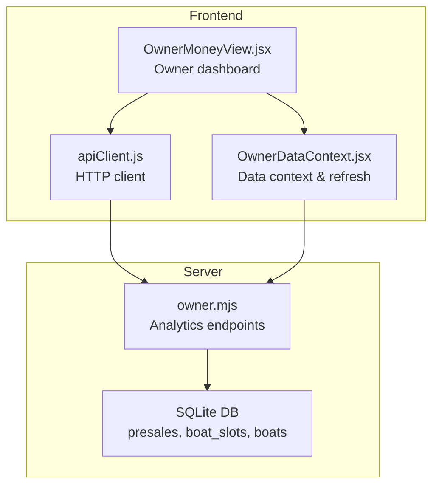
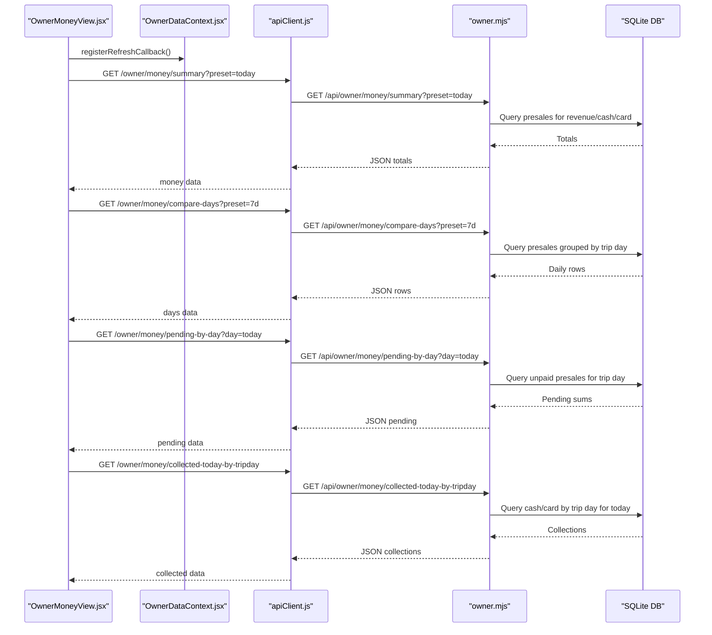
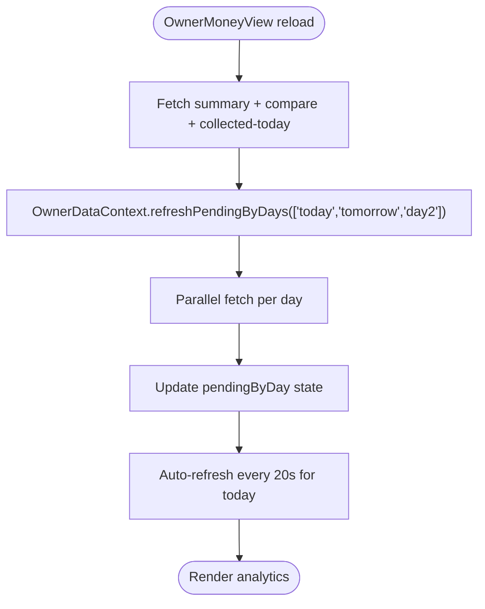
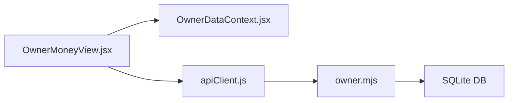

# Analytics Endpoints

<cite>
**Referenced Files in This Document**
- [owner.mjs](file://server/owner.mjs)
- [OwnerMoneyView.jsx](file://src/views/OwnerMoneyView.jsx)
- [OwnerDataContext.jsx](file://src/contexts/OwnerDataContext.jsx)
- [apiClient.js](file://src/utils/apiClient.js)
- [TIME_RULES.md](file://docs/TIME_RULES.md)
- [BUSINESS_RULES.md](file://docs/BUSINESS_RULES.md)
</cite>

## Table of Contents
1. [Introduction](#introduction)
2. [Project Structure](#project-structure)
3. [Core Components](#core-components)
4. [Architecture Overview](#architecture-overview)
5. [Detailed Component Analysis](#detailed-component-analysis)
6. [Dependency Analysis](#dependency-analysis)
7. [Performance Considerations](#performance-considerations)
8. [Troubleshooting Guide](#troubleshooting-guide)
9. [Conclusion](#conclusion)

## Introduction
This document provides detailed API documentation for owner analytics endpoints focused on revenue analytics, performance metrics, and business insights. It covers:
- Money summary endpoint for aggregated revenue, cash, and card totals by preset time ranges
- Pending-by-day endpoint for tracking outstanding payments grouped by trip day
- Compare-days endpoint for revenue comparison across time ranges
- Collected-today-by-tripday endpoint for cash collection tracking by trip day

It includes request parameters, response schemas, examples for daily reporting, trend comparisons, and cash collection monitoring, along with date range handling, trip day expressions, and business rule enforcement.

## Project Structure
The analytics endpoints are implemented in the server module and consumed by the owner UI. The UI orchestrates data fetching and displays analytics with automatic refresh and polling.

**Diagram sources**
- [owner.mjs](file://server/owner.mjs#L1-L456)
- [OwnerMoneyView.jsx](file://src/views/OwnerMoneyView.jsx#L1-L543)
- [OwnerDataContext.jsx](file://src/contexts/OwnerDataContext.jsx#L1-L132)
- [apiClient.js](file://src/utils/apiClient.js#L1-L360)

**Section sources**
- [owner.mjs](file://server/owner.mjs#L1-L456)
- [OwnerMoneyView.jsx](file://src/views/OwnerMoneyView.jsx#L1-L543)
- [OwnerDataContext.jsx](file://src/contexts/OwnerDataContext.jsx#L1-L132)
- [apiClient.js](file://src/utils/apiClient.js#L1-L360)

## Core Components
- Money summary endpoint: Computes revenue, cash, and card totals for a given preset range.
- Pending-by-day endpoint: Computes outstanding payments grouped by trip day for today, tomorrow, or day2.
- Compare-days endpoint: Provides daily revenue breakdown by trip day for a given preset range.
- Collected-today-by-tripday endpoint: Reports cash and card collections grouped by trip day for today and upcoming days.

Key business rules:
- Revenue is computed by trip day using presales business_day if available; otherwise by created_at date.
- Cash/Card are derived from explicit payment fields on presales.
- Pending is computed as revenue minus (cash + card) in the UI for today; for other presets it is zero.

**Section sources**
- [owner.mjs](file://server/owner.mjs#L30-L44)
- [owner.mjs](file://server/owner.mjs#L96-L168)
- [owner.mjs](file://server/owner.mjs#L170-L233)
- [owner.mjs](file://server/owner.mjs#L235-L272)
- [owner.mjs](file://server/owner.mjs#L401-L453)
- [OwnerMoneyView.jsx](file://src/views/OwnerMoneyView.jsx#L244-L256)

## Architecture Overview
The owner analytics endpoints are RESTful routes under /api/owner. The UI requests data and updates automatically, with polling for real-time pending data when viewing today.

**Diagram sources**
- [OwnerMoneyView.jsx](file://src/views/OwnerMoneyView.jsx#L107-L149)
- [OwnerDataContext.jsx](file://src/contexts/OwnerDataContext.jsx#L52-L90)
- [apiClient.js](file://src/utils/apiClient.js#L23-L88)
- [owner.mjs](file://server/owner.mjs#L96-L168)
- [owner.mjs](file://server/owner.mjs#L235-L272)
- [owner.mjs](file://server/owner.mjs#L170-L233)
- [owner.mjs](file://server/owner.mjs#L401-L453)

## Detailed Component Analysis

### Money Summary Endpoint
- Path: /api/owner/money/summary
- Method: GET
- Query parameters:
  - preset: today | yesterday | d7 | month | all | 7d | 30d | 90d | last_nonzero_day
- Behavior:
  - Resolves preset to a date range using server-side helpers.
  - Computes revenue as sum of total_price for active presales within the range.
  - Computes cash and card as sums of payment_cash_amount and payment_card_amount for presales with posted payments within the range.
  - Returns totals and preset/range metadata.

Response schema:
- ok: boolean
- data:
  - preset: string
  - range: object|null (from/to dates)
  - totals:
    - revenue: number
    - cash: number
    - card: number
- meta:
  - warnings: string[]

Notes:
- last_nonzero_day resolves to a single day with nonzero revenue.
- Pending is not included in totals; UI computes it as revenue - (cash + card) for today.

Example usage:
- Generate daily report: GET /api/owner/money/summary?preset=today
- Weekly trend: GET /api/owner/money/summary?preset=7d

**Section sources**
- [owner.mjs](file://server/owner.mjs#L96-L168)

### Pending-by-Day Endpoint
- Path: /api/owner/money/pending-by-day
- Method: GET
- Query parameters:
  - day: today | tomorrow | day2
- Alternative path:
  - /api/owner/money/pending-by-day/:day
- Behavior:
  - Supports both query and path params.
  - Uses trip day expression to group by business_day or created_at date.
  - Computes pending as sum of unpaid amounts for active presales on the target trip day.
  - Aggregates tickets and trips counts.

Response schema:
- ok: boolean
- data:
  - day: string
  - sum | sum_pending | amount | total: number (pending amount)
  - tickets: number
  - trips: number
- meta:
  - warnings: string[]

Examples:
- Today’s pending: GET /api/owner/money/pending-by-day?day=today
- Tomorrow’s pending: GET /api/owner/money/pending-by-day?day=tomorrow
- Day after tomorrow: GET /api/owner/money/pending-by-day?day=day2

**Section sources**
- [owner.mjs](file://server/owner.mjs#L170-L233)

### Compare-Days Endpoint
- Path: /api/owner/money/compare-days
- Method: GET
- Query parameters:
  - preset: 7d | 30d | 90d
- Behavior:
  - Resolves preset to a date range.
  - Groups presales by trip day and aggregates revenue, cash, and card totals.
  - Returns rows ordered by trip day ascending.

Response schema:
- ok: boolean
- data:
  - preset: string
  - range: object|null
  - rows: array of objects
    - day: string (trip day)
    - revenue: number
    - cash: number
    - card: number
- meta:
  - warnings: string[]

Examples:
- 7-day comparison: GET /api/owner/money/compare-days?preset=7d
- 30-day comparison: GET /api/owner/money/compare-days?preset=30d
- 90-day comparison: GET /api/owner/money/compare-days?preset=90d

**Section sources**
- [owner.mjs](file://server/owner.mjs#L235-L272)

### Collected-Today-by-Tripday Endpoint
- Path: /api/owner/money/collected-today-by-tripday
- Method: GET
- Behavior:
  - Filters presales updated today with any cash or card payment.
  - Sums cash and card amounts grouped by trip day (today, tomorrow, day2).
  - Uses business_day if present; otherwise created_at date.

Response schema:
- ok: boolean
- data:
  - collected_day: string
  - by_trip_day:
    - today:
      - revenue: number
      - cash: number
      - card: number
    - tomorrow:
      - revenue: number
      - cash: number
      - card: number
    - day2:
      - revenue: number
      - cash: number
      - card: number
- meta:
  - warnings: string[]

Examples:
- Today’s collections grouped by trip day: GET /api/owner/money/collected-today-by-tripday

**Section sources**
- [owner.mjs](file://server/owner.mjs#L401-L453)

### UI Integration and Data Flow
- OwnerMoneyView.jsx orchestrates fetching:
  - summary, compare-days, and collected-today-by-tripday
  - pending-by-day for today/tomorrow/day2 with polling
- OwnerDataContext.jsx manages:
  - Refresh callbacks for owner data
  - Parallel refresh of pending data for multiple days
  - Stale-checking per-day requests
- apiClient.js handles:
  - Base URL and token injection
  - Structured error handling

**Diagram sources**
- [OwnerMoneyView.jsx](file://src/views/OwnerMoneyView.jsx#L107-L149)
- [OwnerDataContext.jsx](file://src/contexts/OwnerDataContext.jsx#L52-L90)

**Section sources**
- [OwnerMoneyView.jsx](file://src/views/OwnerMoneyView.jsx#L107-L149)
- [OwnerDataContext.jsx](file://src/contexts/OwnerDataContext.jsx#L52-L90)
- [apiClient.js](file://src/utils/apiClient.js#L23-L88)

## Dependency Analysis
- Backend dependencies:
  - owner.mjs depends on SQLite database for presales and boat_slots tables.
  - Uses helper functions for schema-safe column detection and date range resolution.
- Frontend dependencies:
  - OwnerMoneyView.jsx consumes OwnerDataContext.jsx for shared state and refresh orchestration.
  - apiClient.js centralizes HTTP requests and error handling.

**Diagram sources**
- [OwnerMoneyView.jsx](file://src/views/OwnerMoneyView.jsx#L1-L543)
- [OwnerDataContext.jsx](file://src/contexts/OwnerDataContext.jsx#L1-L132)
- [apiClient.js](file://src/utils/apiClient.js#L1-L360)
- [owner.mjs](file://server/owner.mjs#L1-L456)

**Section sources**
- [owner.mjs](file://server/owner.mjs#L1-L456)
- [OwnerMoneyView.jsx](file://src/views/OwnerMoneyView.jsx#L1-L543)
- [OwnerDataContext.jsx](file://src/contexts/OwnerDataContext.jsx#L1-L132)
- [apiClient.js](file://src/utils/apiClient.js#L1-L360)

## Performance Considerations
- Query grouping by trip day uses a deterministic expression that prefers business_day for accuracy.
- Aggregation queries use COALESCE to ensure zero fallbacks and avoid null arithmetic.
- UI performs parallel requests for pending-by-day across multiple days to reduce latency.
- Auto-polling is limited to today to minimize unnecessary network load.

[No sources needed since this section provides general guidance]

## Troubleshooting Guide
Common issues and resolutions:
- Empty or zero totals:
  - Verify preset selection and date range; confirm presence of active presales within the range.
  - For last_nonzero_day preset, ensure at least one revenue-generating day exists.
- Unexpected pending amounts:
  - Confirm that presales are active and unpaid amounts are greater than zero for the target trip day.
  - Ensure payment_cash_amount and payment_card_amount are populated for posted payments.
- Timezone and date handling:
  - Server uses local time expressions; ensure client expectations align with local timezone.
  - For cutoff and trip day logic, refer to TIME_RULES and BUSINESS_RULES documents.

**Section sources**
- [owner.mjs](file://server/owner.mjs#L55-L77)
- [owner.mjs](file://server/owner.mjs#L30-L44)
- [TIME_RULES.md](file://docs/TIME_RULES.md#L1-L47)
- [BUSINESS_RULES.md](file://docs/BUSINESS_RULES.md#L1-L49)

## Conclusion
The owner analytics endpoints provide a robust foundation for revenue tracking, pending monitoring, trend analysis, and cash collection insights. By leveraging preset ranges, trip day expressions, and explicit cash/card aggregations, the system delivers accurate, real-time business intelligence tailored to daily operations.