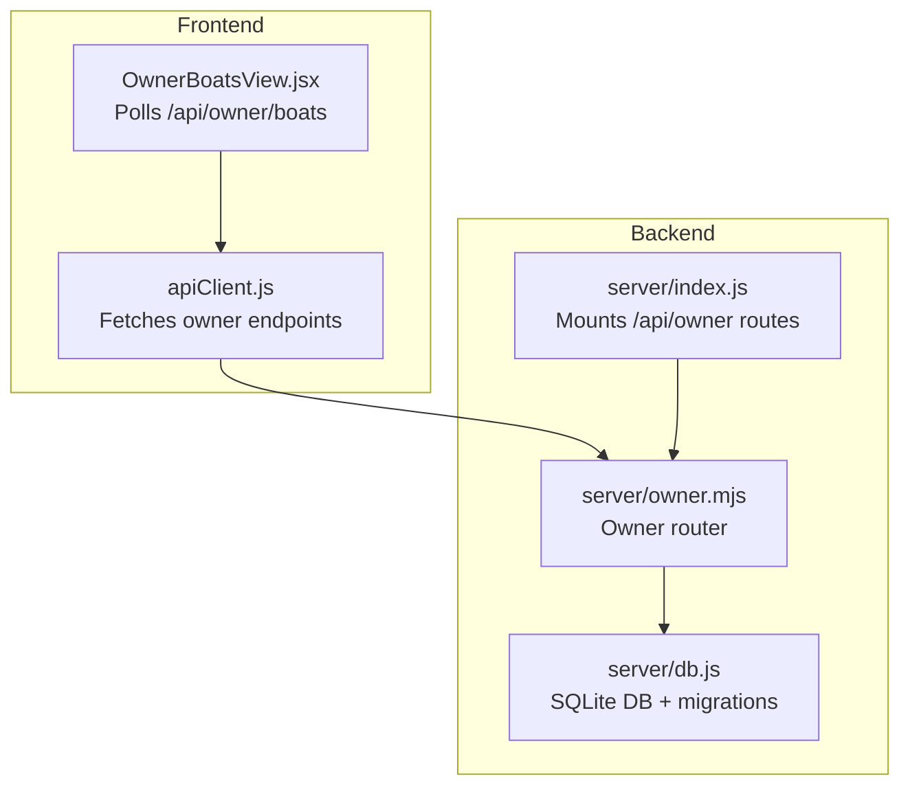
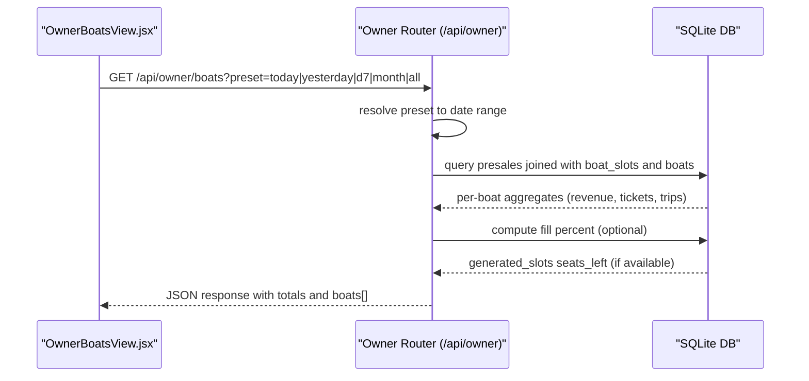
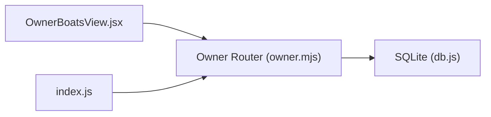

# Boat Performance Endpoints

<cite>
**Referenced Files in This Document**
- [server/index.js](file://server/index.js)
- [server/owner.mjs](file://server/owner.mjs)
- [server/db.js](file://server/db.js)
- [src/views/OwnerBoatsView.jsx](file://src/views/OwnerBoatsView.jsx)
- [src/utils/apiClient.js](file://src/utils/apiClient.js)
- [README.md](file://README.md)
</cite>

## Table of Contents
1. [Introduction](#introduction)
2. [Project Structure](#project-structure)
3. [Core Components](#core-components)
4. [Architecture Overview](#architecture-overview)
5. [Detailed Component Analysis](#detailed-component-analysis)
6. [Dependency Analysis](#dependency-analysis)
7. [Performance Considerations](#performance-considerations)
8. [Troubleshooting Guide](#troubleshooting-guide)
9. [Conclusion](#conclusion)

## Introduction
This document describes the boat performance analytics endpoint for owners, focusing on the aggregated metrics endpoint for boats. It explains the endpoint behavior, supported presets, date range filtering, aggregation logic, and response schema. It also covers database schema flexibility, fallback handling, and practical examples for ranking, capacity utilization, and performance comparisons.

## Project Structure
The boat performance analytics endpoint is part of the owner module and is mounted under the `/api/owner` namespace. The frontend integrates with the endpoint via polling and displays aggregated metrics.

**Diagram sources**
- [server/index.js](file://server/index.js#L39-L40)
- [server/owner.mjs](file://server/owner.mjs#L1-L456)
- [server/db.js](file://server/db.js#L1-L1269)
- [src/views/OwnerBoatsView.jsx](file://src/views/OwnerBoatsView.jsx#L58-L91)
- [src/utils/apiClient.js](file://src/utils/apiClient.js#L354-L358)

**Section sources**
- [server/index.js](file://server/index.js#L39-L40)
- [README.md](file://README.md#L66-L77)

## Core Components
- Endpoint: GET /api/owner/boats
- Purpose: Return aggregated boat performance metrics for the selected time window.
- Key metrics:
  - revenue: Sum of total_price for active presales
  - tickets: Count of seats sold (seat-aware) or count of presales
  - trips: Distinct number of trips (slots) served
  - totals: Aggregates across all boats plus fillPercent for generated slots
- Preset parameter: today | yesterday | d7 | month | all
- Date range: Determined by preset; supports last_nonzero_day via special handling
- Seat handling: Uses number_of_seats, qty, or seats if present; otherwise falls back to COUNT(*)
- Boat type: Uses boat_type, type, or category if present; otherwise null
- Fill percent: Best-effort calculation using generated_slots.seats_left when available

**Section sources**
- [server/owner.mjs](file://server/owner.mjs#L274-L399)

## Architecture Overview
The endpoint orchestrates schema-safe column detection, applies preset-based date ranges, aggregates per-boat metrics, and computes fill percent for generated slots.

**Diagram sources**
- [server/owner.mjs](file://server/owner.mjs#L274-L399)

## Detailed Component Analysis

### Endpoint Definition: GET /api/owner/boats
- Path: /api/owner/boats
- Method: GET
- Query parameters:
  - preset: today | yesterday | d7 | month | all
- Response shape:
  - ok: boolean
  - data: object
    - preset: string
    - range: object|null (from/to placeholders)
    - totals: object
      - revenue: number
      - tickets: number
      - trips: number
      - fillPercent: number (0–100)
    - boats: array of objects
      - boat_id: number
      - boat_name: string
      - boat_type: string|null
      - revenue: number
      - tickets: number
      - trips: number
      - source: string
  - meta: object
    - warnings: array<string>

Processing logic:
- Resolve preset to from/to expressions using presetRange().
- Build trip day expression preferring business_day if present.
- Detect seats column among number_of_seats, qty, seats; fallback to COUNT(*).
- Detect boat type column among boat_type, type, category; fallback to null.
- Join presales with boat_slots and boats; filter by status and date range.
- Aggregate by boat: SUM(total_price), SUM(seats), COUNT(DISTINCT slot).
- Compute totals across all boats.
- Optionally compute fill percent:
  - If generated_slots.seats_left exists, estimate capacity per slot as sold + max(seats_left,0).
  - Compute fillPercent = min(100, round(sold/capacity*100)).
- Return response with ok=true and data.

**Section sources**
- [server/owner.mjs](file://server/owner.mjs#L274-L399)

### Preset Parameter and Date Range Filtering
Supported presets:
- today: from = to = current local date
- yesterday: from = to = previous local date
- d7: expands to 7-day range
- month: expands to 30-day range
- all: no date range filter (include all records)
- Special handling:
  - last_nonzero_day: resolves to the most recent day with revenue > 0 and uses that single day as range

Date range resolution:
- Uses presetRange() to build SQL expressions for BETWEEN clauses.
- Trip day expression uses business_day if present; otherwise DATE(created_at).

**Section sources**
- [server/owner.mjs](file://server/owner.mjs#L55-L94)

### Aggregation Logic: Revenue, Tickets, Trips
- Revenue:
  - SUM(p.total_price) for presales with status='ACTIVE'
  - Trip day determined by getTripDayExpr()
- Tickets:
  - Seat-aware counting: SUM(number_of_seats|qty|seats) if any of these columns exist
  - Fallback: COUNT(*) presales
- Trips:
  - COUNT(DISTINCT COALESCE(p.slot_uid, p.boat_slot_id)) to deduplicate by slot

Ordering:
- ORDER BY revenue DESC, tickets DESC, trips DESC, b.id ASC

**Section sources**
- [server/owner.mjs](file://server/owner.mjs#L294-L318)

### Boat Type Detection and Fallback
- Boat type column detection uses pickFirstExisting('boats', ['boat_type', 'type', 'category'], null)
- If none found, boat_type in response is null

**Section sources**
- [server/owner.mjs](file://server/owner.mjs#L297-L297)

### Fill Percentage Calculation (Best-Effort)
- Requires generated_slots table and seats_left-like column (detected via pickFirstExisting)
- Applies only to generated slots (slot_uid starts with 'generated:')
- Estimation:
  - sold = SUM(seats) for each slot_uid
  - capacity = sold + MAX(seats_left, 0) across all generated slots
  - fillPercent = min(100, round(sold/capacity*100))
- If seats_left column is missing or estimation fails, fillPercent remains 0

**Section sources**
- [server/owner.mjs](file://server/owner.mjs#L341-L384)

### Response Schema
- Top-level:
  - ok: boolean
  - data: object
    - preset: string
    - range: object|null
    - totals: object
      - revenue: number
      - tickets: number
      - trips: number
      - fillPercent: number
    - boats: array<object>
      - boat_id: number
      - boat_name: string
      - boat_type: string|null
      - revenue: number
      - tickets: number
      - trips: number
      - source: string
  - meta: object
    - warnings: array<string>

**Section sources**
- [server/owner.mjs](file://server/owner.mjs#L386-L395)

### Frontend Integration and Polling
- OwnerBoatsView.jsx polls /api/owner/boats with preset query parameter
- Polling interval: 20 seconds
- Displays totals and grouped by boat_type
- Supports preset chips: today, yesterday, d7, month, all

**Section sources**
- [src/views/OwnerBoatsView.jsx](file://src/views/OwnerBoatsView.jsx#L58-L91)
- [src/views/OwnerBoatsView.jsx](file://src/views/OwnerBoatsView.jsx#L122-L133)

### Database Schema Flexibility and Migration
- Schema-safe helpers:
  - pragmaTableInfo(): introspects table columns
  - hasColumn(): checks existence of a column
  - pickFirstExisting(): selects first existing candidate or fallback
- Owner endpoint uses these helpers to adapt to varying schema versions:
  - seats column: number_of_seats|qty|seats
  - boat type: boat_type|type|category
  - generated_slots seats_left: seats_left|seatsLeft|left
- DB initialization and migrations ensure presence of required columns and indexes for analytics

**Section sources**
- [server/owner.mjs](file://server/owner.mjs#L9-L28)
- [server/db.js](file://server/db.js#L111-L164)
- [server/db.js](file://server/db.js#L388-L408)
- [server/db.js](file://server/db.js#L529-L557)
- [server/db.js](file://server/db.js#L616-L647)
- [server/db.js](file://server/db.js#L688-L726)
- [server/db.js](file://server/db.js#L965-L1027)

## Dependency Analysis
- Backend routing:
  - server/index.js mounts /api/owner routes
  - server/owner.mjs defines /api/owner/boats
- Data access:
  - server/owner.mjs queries SQLite via server/db.js
  - DB initialization ensures required tables and columns exist
- Frontend:
  - OwnerBoatsView.jsx calls /api/owner/boats and renders results
  - apiClient.js provides base URL and request helpers

**Diagram sources**
- [server/index.js](file://server/index.js#L39-L40)
- [server/owner.mjs](file://server/owner.mjs#L274-L399)
- [server/db.js](file://server/db.js#L1-L1269)
- [src/views/OwnerBoatsView.jsx](file://src/views/OwnerBoatsView.jsx#L58-L91)

**Section sources**
- [server/index.js](file://server/index.js#L39-L40)
- [server/owner.mjs](file://server/owner.mjs#L274-L399)
- [server/db.js](file://server/db.js#L1-L1269)

## Performance Considerations
- Aggregation uses a single pass per preset with GROUP BY and aggregate functions.
- Seat counting prefers SUM(seats) when available; otherwise COUNT(*) to reduce overhead.
- Fill percent computation is optional and only runs if generated_slots.seats_left is detected.
- Indexes and constraints are maintained during migrations to support efficient queries.

[No sources needed since this section provides general guidance]

## Troubleshooting Guide
Common issues and resolutions:
- Empty or zero totals:
  - Verify preset selection and date range; use last_nonzero_day preset if applicable.
  - Ensure presales have status='ACTIVE' and are linked to boat_slots/boats.
- Missing tickets or trips:
  - Confirm seats column exists; if not, tickets will fall back to COUNT(*).
  - Ensure slot_uid or boat_slot_id is populated for generated slots.
- Zero fill percent:
  - Confirm generated_slots has seats_left-like column; otherwise estimation is skipped.
- Unexpected boat_type:
  - The endpoint returns null if none of boat_type/type/category exist in boats table.

**Section sources**
- [server/owner.mjs](file://server/owner.mjs#L294-L318)
- [server/owner.mjs](file://server/owner.mjs#L341-L384)

## Conclusion
The /api/owner/boats endpoint provides robust, schema-adaptive boat performance analytics with flexible date filtering and seat-aware counting. It supports common owner use cases such as revenue ranking, capacity utilization analysis, and performance comparisons across boats and types. Its design accommodates evolving database schemas while maintaining predictable response shapes and efficient aggregations.