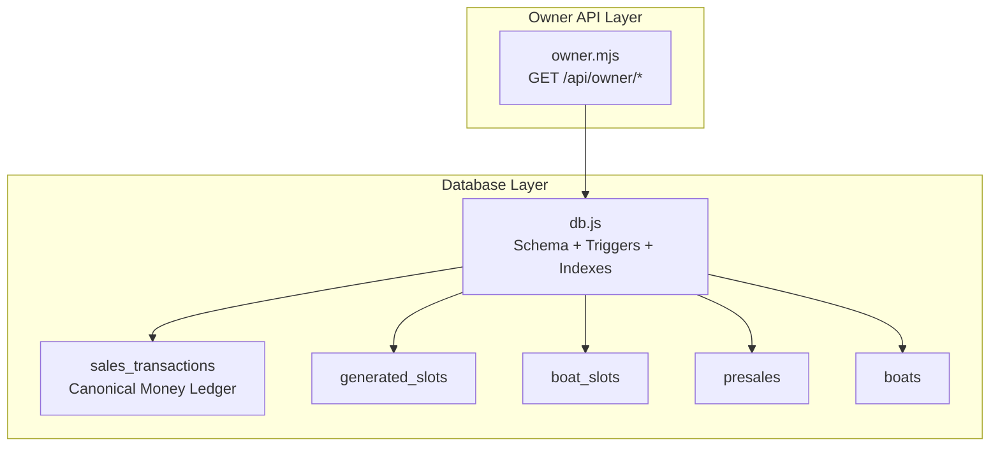
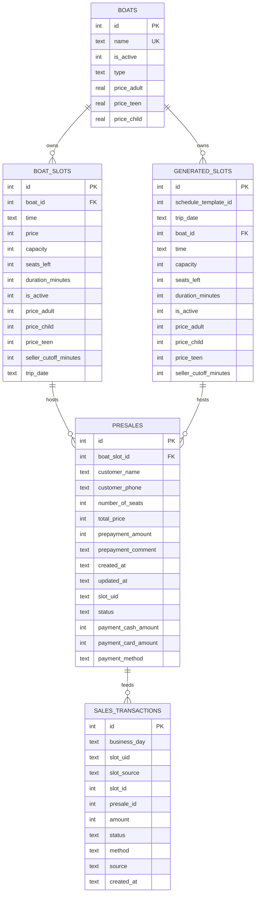
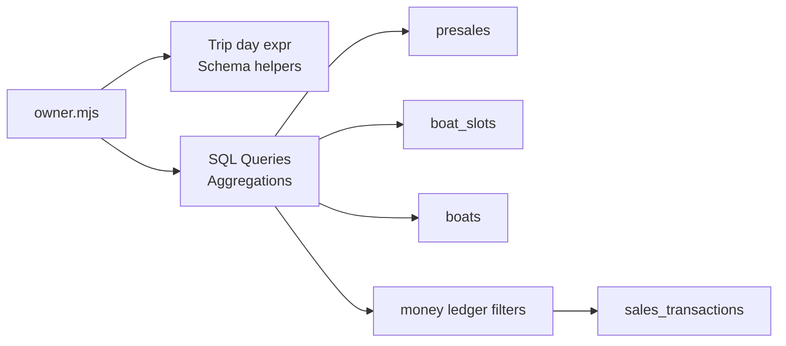

# Data Models & Schemas

<cite>
**Referenced Files in This Document**
- [owner.mjs](file://server/owner.mjs)
- [db.js](file://server/db.js)
- [sales-transactions.mjs](file://server/sales-transactions.mjs)
- [migration_add_trip_date.sql](file://server/migration_add_trip_date.sql)
- [migrate-owner-settings.js](file://server/migrate-owner-settings.js)
</cite>

## Table of Contents
1. [Introduction](#introduction)
2. [Project Structure](#project-structure)
3. [Core Components](#core-components)
4. [Architecture Overview](#architecture-overview)
5. [Detailed Component Analysis](#detailed-component-analysis)
6. [Dependency Analysis](#dependency-analysis)
7. [Performance Considerations](#performance-considerations)
8. [Troubleshooting Guide](#troubleshooting-guide)
9. [Conclusion](#conclusion)

## Introduction
This document provides comprehensive data model documentation for the owner API response structures and database relationships. It covers:
- Money summary response model with preset ranges, date expressions, and financial aggregations
- Pending-by-day response model with trip day grouping and outstanding payment calculations
- Boat performance response model with revenue, ticket, and trip aggregations
- Database schema relationships among presales, boat_slots, and boats
- Trip day expression logic for generated vs. regular slots
- Money ledger integration for payment tracking and cash/card calculations
- Data type specifications, nullable fields, and aggregation functions
- Example response payloads and data transformation logic

## Project Structure
The owner analytics and data models are primarily implemented in the server-side modules:
- Owner API endpoints and aggregation logic
- Database schema definitions and migrations
- Money ledger generation and synchronization
- Supporting migration scripts for schema evolution

**Diagram sources**
- [owner.mjs](file://server/owner.mjs#L99-L453)
- [db.js](file://server/db.js#L55-L109)
- [db.js](file://server/db.js#L688-L726)
- [db.js](file://server/db.js#L1036-L1247)

**Section sources**
- [owner.mjs](file://server/owner.mjs#L99-L453)
- [db.js](file://server/db.js#L55-L109)
- [db.js](file://server/db.js#L688-L726)
- [db.js](file://server/db.js#L1036-L1247)

## Core Components
- Owner API endpoints for money summaries, pending-by-day, compare-days, boats performance, and collected-today-by-tripday
- Canonical money ledger (sales_transactions) populated via SQLite triggers from tickets
- Schema-safe helpers for dynamic column detection and trip day expression resolution
- Preset range utilities for date window selection

Key responsibilities:
- Aggregate revenue, cash, and card totals by trip day
- Compute pending amounts by subtracting posted payments from total price
- Group by boat and compute fill percentage estimates for generated slots
- Provide daily collections grouped by trip day (today/tomorrow/day2)

**Section sources**
- [owner.mjs](file://server/owner.mjs#L99-L453)
- [db.js](file://server/db.js#L1036-L1247)

## Architecture Overview
The owner analytics rely on:
- Presales as the primary booking source
- Boat slots as the scheduling backbone
- Generated slots for dynamically created trips
- Sales transactions as the canonical money ledger

**Diagram sources**
- [db.js](file://server/db.js#L55-L109)
- [db.js](file://server/db.js#L688-L726)
- [db.js](file://server/db.js#L1036-L1051)

## Detailed Component Analysis

### Money Summary Response Model
Purpose:
- Summarize revenue, cash, and card totals for a selected preset range
- Use trip day expression to align with generated slot business day semantics

Response shape:
- ok: boolean
- data: { preset, range, totals: { revenue, cash, card } }
- meta: { warnings: string[] }

Aggregation logic:
- Revenue: SUM(total_price) from presales where status is active, filtered by trip day expression and date range
- Cash/Card: SUM(payment_cash_amount)/SUM(payment_card_amount) from presales where status is active/paid and at least one payment field is positive, filtered by trip day expression and date range
- Pending: revenue - (cash + card) computed by the UI

Date expression:
- Prefer presales.business_day if present; otherwise fall back to DATE(p.created_at)
- Supports presets: today, yesterday, d7, month, 30d, 90d, last_nonzero_day

Example payload:
{
  "ok": true,
  "data": {
    "preset": "7d",
    "range": { "from": null, "to": null },
    "totals": { "revenue": 125000, "cash": 80000, "card": 45000 }
  },
  "meta": { "warnings": [] }
}

**Section sources**
- [owner.mjs](file://server/owner.mjs#L99-L168)
- [owner.mjs](file://server/owner.mjs#L35-L44)
- [owner.mjs](file://server/owner.mjs#L55-L77)

### Pending-by-Day Response Model
Purpose:
- Compute outstanding payments grouped by trip day for a given day alias
- Use money ledger to exclude only posted sales-related entries

Response shape:
- ok: boolean
- data: {
  day: string,
  sum / sum_pending / amount / total: number (aliases for the same value),
  tickets: number,
  trips: number
}
- meta: { warnings: string[] }

Aggregation logic:
- Sum pending: SUM(GREATEST(total_price - SUM(posted payments), 0)) for ACTIVE presales on the target trip day
- Tickets: SUM(number_of_seats) if available, else COUNT(*)
- Trips: COUNT(DISTINCT slot identifier)

Date expression:
- Target day resolved from query/path param: today, tomorrow, day2
- Uses the same trip day expression as money summary

Money ledger filtering:
- Only entries where kind/type indicates sales-related payments
- Only entries with status POSTED

Example payload:
{
  "ok": true,
  "data": {
    "day": "today",
    "sum": 15000,
    "sum_pending": 15000,
    "amount": 15000,
    "total": 15000,
    "tickets": 42,
    "trips": 3
  },
  "meta": { "warnings": [] }
}

**Section sources**
- [owner.mjs](file://server/owner.mjs#L174-L233)
- [owner.mjs](file://server/owner.mjs#L46-L53)

### Boat Performance Response Model
Purpose:
- Aggregate by boat: revenue, tickets, trips for a selected preset
- Optionally compute fill percent based on generated slots

Response shape:
- ok: boolean
- data: { preset, range, totals: { revenue, tickets, trips, fillPercent }, boats: BoatRow[] }
- meta: { warnings: string[] }

Aggregation logic:
- Per boat: SUM(total_price), SUM(number_of_seats) or COUNT(*), COUNT(DISTINCT slot identifier)
- Totals: sums across all boats
- Fill percent: if generated_slots.seats_left is available, estimate capacity per slot and compute sold / capacity

Date expression:
- Same trip day expression as other money endpoints
- Range derived from preset

Example payload:
{
  "ok": true,
  "data": {
    "preset": "today",
    "range": null,
    "totals": { "revenue": 250000, "tickets": 86, "trips": 6, "fillPercent": 73 },
    "boats": [
      { "boat_id": 1, "boat_name": "Speedboat A", "boat_type": "speed", "revenue": 120000, "tickets": 42, "trips": 3, "source": "presales" },
      { "boat_id": 2, "boat_name": "Cruise B", "boat_type": "cruise", "revenue": 130000, "tickets": 44, "trips": 3, "source": "presales" }
    ]
  },
  "meta": { "warnings": [] }
}

**Section sources**
- [owner.mjs](file://server/owner.mjs#L278-L399)

### Compare-Days Response Model
Purpose:
- Provide daily revenue, cash, and card totals for a preset range
- Rows ordered by trip day ascending

Response shape:
- ok: boolean
- data: { preset, range, rows: DayRow[] }
- meta: { warnings: string[] }

Aggregation logic:
- Daily: SUM(total_price), SUM(payment_cash_amount), SUM(payment_card_amount)
- Filtered by status IN (ACTIVE, PAID) and date range

Example payload:
{
  "ok": true,
  "data": {
    "preset": "7d",
    "range": null,
    "rows": [
      { "day": "2025-01-01", "revenue": 100000, "cash": 60000, "card": 40000 },
      { "day": "2025-01-02", "revenue": 110000, "cash": 65000, "card": 45000 }
    ]
  },
  "meta": { "warnings": [] }
}

**Section sources**
- [owner.mjs](file://server/owner.mjs#L239-L272)

### Collected-Today-by-Tripday Response Model
Purpose:
- Show cash and card collections grouped by trip day for today/tomorrow/day2
- Use business_day as the authoritative trip day source

Response shape:
- ok: boolean
- data: { collected_day: "today", by_trip_day: { today, tomorrow, day2 } }
- meta: { warnings: [] }

Aggregation logic:
- Separate sums for cash and card by trip day using the business_day expression
- Filter by updated_at = today and at least one payment amount > 0

Example payload:
{
  "ok": true,
  "data": {
    "collected_day": "today",
    "by_trip_day": {
      "today": { "revenue": 95000, "cash": 55000, "card": 40000 },
      "tomorrow": { "revenue": 80000, "cash": 40000, "card": 40000 },
      "day2": { "revenue": 70000, "cash": 35000, "card": 35000 }
    }
  },
  "meta": { "warnings": [] }
}

**Section sources**
- [owner.mjs](file://server/owner.mjs#L406-L453)

### Database Schema Relationships
Tables and keys:
- boats: id PK, name UK, type, price_* columns
- boat_slots: id PK, boat_id FK → boats, time, capacity, seats_left, duration_minutes, trip_date
- generated_slots: id PK, schedule_template_id, trip_date, boat_id FK → boats, time, capacity, seats_left, duration_minutes
- presales: id PK, boat_slot_id FK → boat_slots, number_of_seats, total_price, payment_* fields, status, slot_uid
- sales_transactions: id PK, business_day, slot_uid, slot_source, slot_id, presale_id, amount, status, method, source

Constraints and indexes:
- Unique constraints and indexes to prevent duplicates and improve query performance
- Triggers to populate sales_transactions from tickets

**Section sources**
- [db.js](file://server/db.js#L55-L109)
- [db.js](file://server/db.js#L688-L726)
- [db.js](file://server/db.js#L1036-L1247)

### Trip Day Expression Logic
- Priority: presales.business_day if present; otherwise DATE(p.created_at)
- For generated slots, business_day reflects the actual trip date after transfers, while trip_date may be stale
- Used consistently across money summary, pending-by-day, compare-days, and collected-today-by-tripday

**Section sources**
- [owner.mjs](file://server/owner.mjs#L35-L44)
- [owner.mjs](file://server/owner.mjs#L412-L414)

### Money Ledger Integration
- Canonical money layer: sales_transactions
- Trigger-based population from tickets:
  - INSERT: create sales_transactions rows with business_day, presale_id, slot_id, slot_uid, slot_source, amount, qty, method, status, ticket_id
  - UPDATE: synchronize business_day, amount, method, status
  - DELETE: mark as INVALID
- Owner endpoints filter money ledger to sales-related, posted entries only

**Section sources**
- [db.js](file://server/db.js#L1036-L1247)
- [sales-transactions.mjs](file://server/sales-transactions.mjs#L34-L63)
- [sales-transactions.mjs](file://server/sales-transactions.mjs#L167-L236)

### Data Types, Nullable Fields, and Aggregations
- Numeric types: integers for counts and amounts; reals for boat prices
- Nullable fields: payment_* fields, business_day, slot_uid, status, method, source
- Aggregations:
  - SUM for revenue, cash, card, tickets
  - COUNT(DISTINCT) for trips
  - COALESCE for safe zero fallbacks
  - CASE WHEN for conditional sums and filters

**Section sources**
- [db.js](file://server/db.js#L55-L109)
- [db.js](file://server/db.js#L688-L726)
- [owner.mjs](file://server/owner.mjs#L128-L150)
- [owner.mjs](file://server/owner.mjs#L187-L209)

### Example Payloads and Transformation Logic
- Money summary: transform raw SUMs to totals; UI computes pending
- Pending-by-day: compute difference between total price and posted payments per presale; group by trip day
- Boats performance: map per-boat aggregates; compute fill percent if generated_slots supports it
- Compare-days: pivot daily aggregates by trip day
- Collected-today-by-tripday: separate cash and card sums by trip day

**Section sources**
- [owner.mjs](file://server/owner.mjs#L156-L164)
- [owner.mjs](file://server/owner.mjs#L212-L226)
- [owner.mjs](file://server/owner.mjs#L321-L329)
- [owner.mjs](file://server/owner.mjs#L258-L266)
- [owner.mjs](file://server/owner.mjs#L438-L449)

## Dependency Analysis
Owner API depends on:
- Dynamic column detection helpers to adapt to schema differences
- Trip day expression resolver to ensure consistent date semantics
- Money ledger filtering to exclude non-sales or unposted entries
- Schema-safe joins across presales, boat_slots, and boats

**Diagram sources**
- [owner.mjs](file://server/owner.mjs#L35-L44)
- [owner.mjs](file://server/owner.mjs#L46-L53)
- [db.js](file://server/db.js#L1036-L1247)

**Section sources**
- [owner.mjs](file://server/owner.mjs#L35-L53)
- [db.js](file://server/db.js#L1036-L1247)

## Performance Considerations
- Use indexes on business_day, status, and ticket_id to accelerate money ledger queries
- Prefer COALESCE and CASE WHEN to avoid expensive subqueries when possible
- Limit result sets with appropriate date ranges and statuses
- Avoid redundant joins by selecting only required columns

[No sources needed since this section provides general guidance]

## Troubleshooting Guide
Common issues and resolutions:
- Missing columns: use schema-safe helpers to detect columns and provide fallbacks
- Stale trip_date in boat_slots: rely on presales.business_day or generated_slots.trip_date for accurate trip day
- Empty or inconsistent payment fields: prefer explicit payment_cash_amount/payment_card_amount; fallback to payment_method + total_price when available
- Missing money ledger entries: ensure tickets table and required columns exist; verify triggers are created

**Section sources**
- [owner.mjs](file://server/owner.mjs#L17-L28)
- [owner.mjs](file://server/owner.mjs#L35-L44)
- [db.js](file://server/db.js#L1036-L1247)

## Conclusion
The owner analytics layer combines robust schema-safe logic with a canonical money ledger to deliver accurate financial insights. Consistent trip day expressions, careful aggregation rules, and defensive programming ensure reliable reporting across money summaries, pending calculations, boat performance, and daily collections.