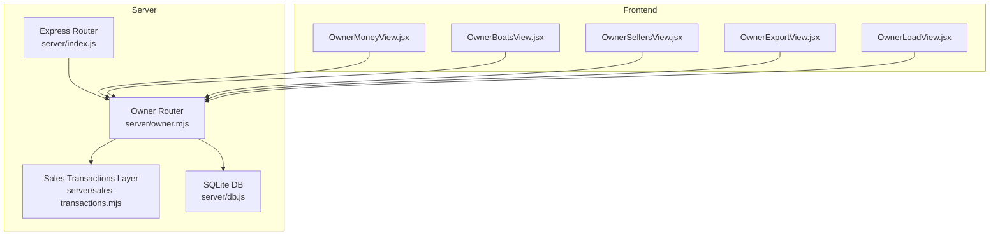
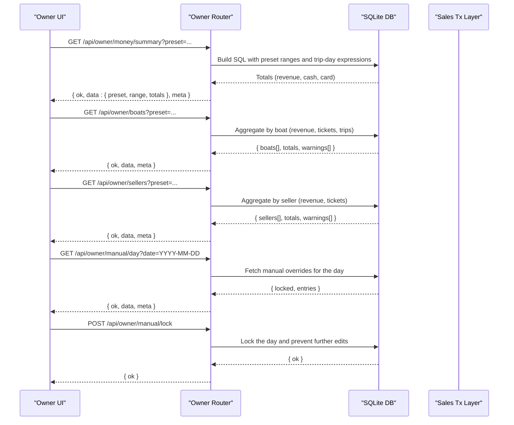
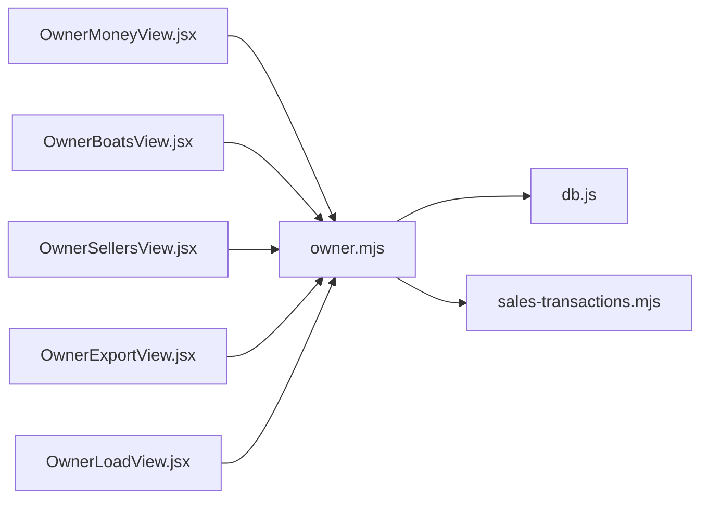

# Owner API

<cite>
**Referenced Files in This Document**
- [owner.mjs](file://server/owner.mjs)
- [sales-transactions.mjs](file://server/sales-transactions.mjs)
- [index.js](file://server/index.js)
- [OwnerExportView.jsx](file://src/views/OwnerExportView.jsx)
- [OwnerMoneyView.jsx](file://src/views/OwnerMoneyView.jsx)
- [OwnerBoatsView.jsx](file://src/views/OwnerBoatsView.jsx)
- [OwnerSellersView.jsx](file://src/views/OwnerSellersView.jsx)
- [OwnerLoadView.jsx](file://src/views/OwnerLoadView.jsx)
- [db.js](file://server/db.js)
</cite>

## Table of Contents
1. [Introduction](#introduction)
2. [Project Structure](#project-structure)
3. [Core Components](#core-components)
4. [Architecture Overview](#architecture-overview)
5. [Detailed Component Analysis](#detailed-component-analysis)
6. [Dependency Analysis](#dependency-analysis)
7. [Performance Considerations](#performance-considerations)
8. [Troubleshooting Guide](#troubleshooting-guide)
9. [Conclusion](#conclusion)
10. [Appendices](#appendices)

## Introduction
This document describes the Owner API surface for analytics, reporting, and operational insights. It covers:
- Revenue analytics endpoints (daily/weekly/monthly earnings, pending collections, comparison by day)
- Fleet and seller performance metrics
- Export endpoints for generating CSV/XLS reports
- Business intelligence patterns (trend analysis via comparison-by-day)
- Seller management and oversight (seller performance)
- Settings and manual override capabilities
- Request/response schemas, filtering, date ranges, and aggregation behavior
- Examples for generating financial reports, exporting sales data, and accessing analytics
- Data privacy, report formatting, and export limitations

## Project Structure
The Owner API is mounted under `/api/owner` and backed by SQLite. Frontend dashboards consume these endpoints to render real-time analytics and enable exports.

**Diagram sources**
- [index.js](file://server/index.js#L37-L40)
- [owner.mjs](file://server/owner.mjs#L1-L456)
- [sales-transactions.mjs](file://server/sales-transactions.mjs#L1-L237)
- [OwnerMoneyView.jsx](file://src/views/OwnerMoneyView.jsx#L1-L526)
- [OwnerBoatsView.jsx](file://src/views/OwnerBoatsView.jsx#L1-L249)
- [OwnerSellersView.jsx](file://src/views/OwnerSellersView.jsx#L1-L222)
- [OwnerExportView.jsx](file://src/views/OwnerExportView.jsx#L1-L291)
- [OwnerLoadView.jsx](file://src/views/OwnerLoadView.jsx#L1-L45)

**Section sources**
- [index.js](file://server/index.js#L37-L40)

## Core Components
- Owner analytics endpoints: money summary, pending by day, compare days, boats (fleet), and sellers
- Sales transactions canonical layer for money after trip completion
- Export utilities in the UI for CSV/XLS generation
- Manual override UI for owner-entered data and locking

Key endpoints:
- GET /api/owner/money/summary?preset=
- GET /api/owner/money/pending-by-day[/:day]?day=
- GET /api/owner/money/compare-days?preset=
- GET /api/owner/boats?preset=
- GET /api/owner/sellers?preset=
- GET /api/owner/manual/day?date=YYYY-MM-DD
- PUT /api/owner/manual/day
- POST /api/owner/manual/lock

Response shapes and parameters are documented in the Detailed Component Analysis section.

**Section sources**
- [owner.mjs](file://server/owner.mjs#L99-L168)
- [owner.mjs](file://server/owner.mjs#L174-L233)
- [owner.mjs](file://server/owner.mjs#L239-L272)
- [owner.mjs](file://server/owner.mjs#L278-L399)
- [owner.mjs](file://server/owner.mjs#L406-L453)
- [OwnerLoadView.jsx](file://src/views/OwnerLoadView.jsx#L1-L45)

## Architecture Overview
The Owner API is a thin Express router that queries SQLite tables and materializes aggregated analytics. It supports:
- Preset-based date ranges (today, yesterday, 7d, month, 30d, 90d, last_nonzero_day)
- Schema-safe column detection to handle evolving DB schemas
- Canonical money derivation via a dedicated sales transactions layer
- Export pipeline in the UI that requests analytics and formats CSV/XLS

**Diagram sources**
- [owner.mjs](file://server/owner.mjs#L99-L168)
- [owner.mjs](file://server/owner.mjs#L278-L399)
- [owner.mjs](file://server/owner.mjs#L406-L453)
- [OwnerLoadView.jsx](file://src/views/OwnerLoadView.jsx#L1-L45)

## Detailed Component Analysis

### Money Analytics Endpoints
- Purpose: Daily/weekly/monthly revenue, pending collections, and trend comparison
- Presets: today, yesterday, 7d, 30d, 90d, last_nonzero_day
- Trip day expression: business_day if present, otherwise created_at date
- Aggregations:
  - Revenue: SUM(total_price) for ACTIVE presales
  - Cash/Card: explicit payment splits when available; fallback to payment_method
  - Pending: revenue minus posted cash/card for a given trip day

Endpoints:
- GET /api/owner/money/summary?preset=
  - Response: { ok, data: { preset, range, totals: { revenue, cash, card } }, meta }
  - Warnings: "no revenue days found" when last_nonzero_day has none
- GET /api/owner/money/pending-by-day[/:day]?day=today|tomorrow|day2
  - Response: { ok, data: { day, sum|sum_pending|amount|total, tickets, trips }, meta }
- GET /api/owner/money/compare-days?preset=
  - Response: { ok, data: { preset, range, rows: [{ day, revenue, cash, card }] }, meta }

Notes:
- Pending computation uses money_ledger entries filtered to sales-related kinds/types
- Seats aggregation uses number_of_seats/qty/seats if present; otherwise counts presales

**Section sources**
- [owner.mjs](file://server/owner.mjs#L99-L168)
- [owner.mjs](file://server/owner.mjs#L174-L233)
- [owner.mjs](file://server/owner.mjs#L239-L272)

### Fleet Analytics Endpoint
- GET /api/owner/boats?preset=
  - Aggregates by boat: revenue, tickets, trips
  - Computes fillPercent using generated_slots.seats_left when available
  - Response: { ok, data: { preset, range, totals: { revenue, tickets, trips, fillPercent }, boats: [...] }, meta }

Presets mapping:
- today → today
- yesterday → yesterday
- 7d → d7
- 30d → month
- 90d → d30
- last_nonzero_day → all

**Section sources**
- [owner.mjs](file://server/owner.mjs#L278-L399)

### Sellers Analytics Endpoint
- GET /api/owner/sellers?preset=
  - Aggregates by seller: revenue, tickets
  - Response: { ok, data: { preset, range, totals: { revenue, tickets }, sellers: [...] }, meta }

Presets:
- today, yesterday, 7d, month

**Section sources**
- [OwnerSellersView.jsx](file://src/views/OwnerSellersView.jsx#L1-L222)

### Business Intelligence: Trend and Comparison
- GET /api/owner/money/compare-days?preset=7d|30d|90d
  - Returns daily rows for trend analysis
  - Useful for week-over-week or month-over-month comparisons

**Section sources**
- [owner.mjs](file://server/owner.mjs#L239-L272)

### Export Endpoints and UI
- UI-driven export:
  - OwnerExportView.jsx loads money summary and boats data for a preset and formats CSV/XLS
  - Supports datasets: money (summary) and fleet (boats)
  - Preset mapping:
    - money: today/yesterday/7d/30d/90d → maps to backend presets
    - fleet: today/yesterday/7d/month/all → maps to backend presets

- Report formatting:
  - CSV: semicolon-separated, quoted values
  - Excel: HTML table embedded in HTML document

- Limitations:
  - Export is client-side; no server-side CSV/XLS endpoints are exposed
  - UI warns when manual override is detected

**Section sources**
- [OwnerExportView.jsx](file://src/views/OwnerExportView.jsx#L1-L291)

### Manual Override and Locking
- GET /api/owner/manual/day?date=YYYY-MM-DD
  - Returns locked flag and manual entries for the day
- PUT /api/owner/manual/day
  - Saves manual override entries for the day
- POST /api/owner/manual/lock
  - Locks the day; prevents further edits

UI behavior:
- OwnerLoadView.jsx orchestrates loading, editing, and locking
- After lock, UI disables editing controls

**Section sources**
- [OwnerLoadView.jsx](file://src/views/OwnerLoadView.jsx#L1-L45)

### Sales Transactions Canonical Layer
- Purpose: Derive canonical money after trip completion
- Creates sales_transactions records for generated slots with:
  - business_day, slot_uid, slot_source, slot_id, presale_id
  - amount split by method (CASH/CARD/MIXED)
- Safeguards:
  - Idempotent inserts via unique index
  - Schema-safe checks for table/column existence
  - Skips unsupported slot sources

**Section sources**
- [sales-transactions.mjs](file://server/sales-transactions.mjs#L34-L63)
- [sales-transactions.mjs](file://server/sales-transactions.mjs#L167-L236)

### Data Privacy and Report Formatting
- Privacy:
  - Owner endpoints require authentication; UI uses credentials-based fetch
  - No personal passenger data is exposed in analytics endpoints
- Formatting:
  - CSV: semicolon delimiter, quoted fields
  - Excel: HTML table format suitable for spreadsheet import

**Section sources**
- [OwnerExportView.jsx](file://src/views/OwnerExportView.jsx#L3-L47)

## Dependency Analysis
- Owner router depends on:
  - SQLite tables: presales, boat_slots, boats, sales_transactions, settings
  - Schema-safe helpers to detect columns and tables
- Sales transactions layer depends on:
  - Generated slots and presales to build canonical money entries
- Frontend dashboards depend on:
  - Owner router for analytics
  - Manual override endpoints for owner-entered data

**Diagram sources**
- [owner.mjs](file://server/owner.mjs#L1-L456)
- [sales-transactions.mjs](file://server/sales-transactions.mjs#L1-L237)
- [db.js](file://server/db.js#L1-L1269)
- [OwnerMoneyView.jsx](file://src/views/OwnerMoneyView.jsx#L1-L526)
- [OwnerBoatsView.jsx](file://src/views/OwnerBoatsView.jsx#L1-L249)
- [OwnerSellersView.jsx](file://src/views/OwnerSellersView.jsx#L1-L222)
- [OwnerExportView.jsx](file://src/views/OwnerExportView.jsx#L1-L291)
- [OwnerLoadView.jsx](file://src/views/OwnerLoadView.jsx#L1-L45)

**Section sources**
- [owner.mjs](file://server/owner.mjs#L1-L456)
- [sales-transactions.mjs](file://server/sales-transactions.mjs#L1-L237)
- [db.js](file://server/db.js#L1-L1269)

## Performance Considerations
- Indexes and columns:
  - Ensure presence of indexes on frequently filtered columns (e.g., presales.slot_uid, generated_slots.trip_date/time)
  - Schema-safe helpers avoid crashes on missing columns
- Aggregation cost:
  - Compare-days returns daily rows; large date ranges increase payload size
- UI polling:
  - Dashboards poll periodically (e.g., 20s) for live updates; consider throttling or server-sent events for heavy loads

[No sources needed since this section provides general guidance]

## Troubleshooting Guide
Common issues and resolutions:
- Empty or zero totals:
  - last_nonzero_day preset may return no revenue days; UI shows warning
- Missing columns:
  - Schema-safe helpers fall back gracefully; warnings indicate missing columns
- Manual override detected:
  - UI highlights "manual" mode; export includes a note
- Locked day:
  - After POST /api/owner/manual/lock, editing is disabled in UI

**Section sources**
- [owner.mjs](file://server/owner.mjs#L105-L117)
- [OwnerExportView.jsx](file://src/views/OwnerExportView.jsx#L114-L115)
- [OwnerLoadView.jsx](file://src/views/OwnerLoadView.jsx#L1-L45)

## Conclusion
The Owner API provides a focused set of analytics and reporting capabilities:
- Real-time revenue, pending, and fleet metrics
- Trend analysis via daily comparison
- Export-ready datasets for CSV/XLS
- Manual override workflow with locking
- Robust schema handling and safe aggregations

These endpoints enable owners to monitor daily performance, evaluate seller productivity, and produce operational reports efficiently.

[No sources needed since this section summarizes without analyzing specific files]

## Appendices

### API Reference

- GET /api/owner/money/summary?preset=today|yesterday|7d|30d|90d|last_nonzero_day
  - Response: { ok, data: { preset, range, totals: { revenue, cash, card } }, meta }
  - Notes: last_nonzero_day returns a single-day range; warnings when no revenue days

- GET /api/owner/money/pending-by-day[/:day]?day=today|tomorrow|day2
  - Response: { ok, data: { day, sum|sum_pending|amount|total, tickets, trips }, meta }

- GET /api/owner/money/compare-days?preset=7d|30d|90d
  - Response: { ok, data: { preset, range, rows: [{ day, revenue, cash, card }] }, meta }

- GET /api/owner/boats?preset=today|yesterday|7d|month|all
  - Response: { ok, data: { preset, range, totals: { revenue, tickets, trips, fillPercent }, boats: [...] }, meta }

- GET /api/owner/sellers?preset=today|yesterday|7d|month
  - Response: { ok, data: { preset, range, totals: { revenue, tickets }, sellers: [...] }, meta }

- GET /api/owner/manual/day?date=YYYY-MM-DD
  - Response: { ok, data: { locked, entries }, meta }

- PUT /api/owner/manual/day
  - Body: { date, entries }
  - Response: { ok }

- POST /api/owner/manual/lock
  - Response: { ok }

### Request/Response Schemas

- Money Summary
  - Query: preset (string)
  - Response: { ok: boolean, data: { preset: string, range: null, totals: { revenue: number, cash: number, card: number } }, meta: { warnings: string[] } }

- Pending by Day
  - Path: day (today|tomorrow|day2)
  - Response: { ok: boolean, data: { day: string, sum|sum_pending|amount|total: number, tickets: number, trips: number }, meta: { warnings: string[] } }

- Compare Days
  - Query: preset (7d|30d|90d)
  - Response: { ok: boolean, data: { preset: string, range: null, rows: array[{ day: string, revenue: number, cash: number, card: number }] }, meta: { warnings: string[] } }

- Boats
  - Query: preset (today|yesterday|7d|month|all)
  - Response: { ok: boolean, data: { preset: string, range: null, totals: { revenue: number, tickets: number, trips: number, fillPercent: number }, boats: array[{ boat_id: number, boat_name: string, boat_type: string|null, revenue: number, tickets: number, trips: number, source: string }] }, meta: { warnings: string[] } }

- Sellers
  - Query: preset (today|yesterday|7d|month)
  - Response: { ok: boolean, data: { preset: string, range: null, totals: { revenue: number, tickets: number }, sellers: array[{ seller_id: number, seller_name: string, source: string, revenue: number, tickets: number }] }, meta: { warnings: string[] } }

- Manual Override
  - GET: { ok: boolean, data: { locked: boolean, entries: array } }
  - PUT: { ok: boolean }
  - POST: { ok: boolean }

### Filtering Options and Date Ranges
- Preset mapping:
  - today → DATE('now','localtime')
  - yesterday → DATE('now','localtime','-1 day')
  - 7d → 6 days prior to today
  - 30d → 29 days prior to today
  - 90d → 89 days prior to today
  - last_nonzero_day → resolves to the most recent day with revenue > 0
- Trip day expression:
  - Uses presales.business_day if present; otherwise DATE(p.created_at)

### Aggregation Functions
- Revenue: SUM(p.total_price) for ACTIVE presales
- Cash/Card: SUM(payment_cash_amount)/SUM(payment_card_amount) when explicit; otherwise derived from payment_method and total_price
- Pending: SUM(p.total_price) - SUM(posted payments) for a trip day
- Tickets: SUM(number_of_seats|qty|seats) if available; otherwise COUNT(*)
- Fill percent: computed from generated_slots.seats_left when available

### Examples

- Generate a financial report for today
  - GET /api/owner/money/summary?preset=today
  - GET /api/owner/boats?preset=today
  - Combine totals and warnings to display revenue, cash, card, tickets, trips, fillPercent

- Export sales data as CSV/XLS
  - Load money and boats for preset (e.g., today/7d/30d)
  - Use OwnerExportView.jsx to format and download CSV/XLS

- Access business analytics and trends
  - GET /api/owner/money/compare-days?preset=7d
  - Render daily revenue bars for trend analysis

- Manage manual overrides
  - GET /api/owner/manual/day?date=YYYY-MM-DD
  - PUT /api/owner/manual/day with entries
  - POST /api/owner/manual/lock to finalize

**Section sources**
- [owner.mjs](file://server/owner.mjs#L55-L77)
- [owner.mjs](file://server/owner.mjs#L35-L44)
- [OwnerExportView.jsx](file://src/views/OwnerExportView.jsx#L101-L165)
- [OwnerMoneyView.jsx](file://src/views/OwnerMoneyView.jsx#L99-L132)
- [OwnerBoatsView.jsx](file://src/views/OwnerBoatsView.jsx#L58-L91)
- [OwnerSellersView.jsx](file://src/views/OwnerSellersView.jsx#L54-L83)
- [OwnerLoadView.jsx](file://src/views/OwnerLoadView.jsx#L41-L45)