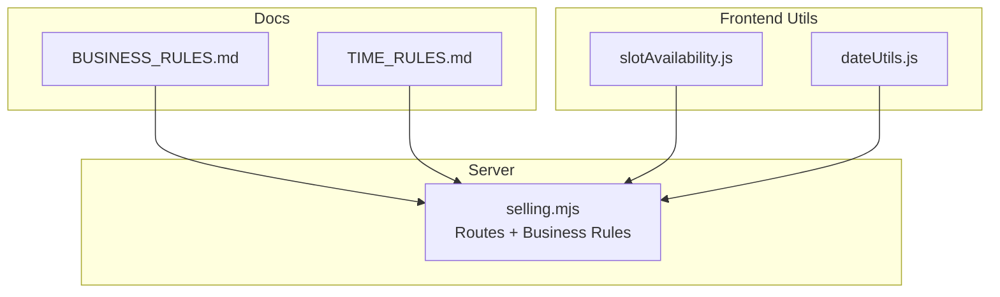
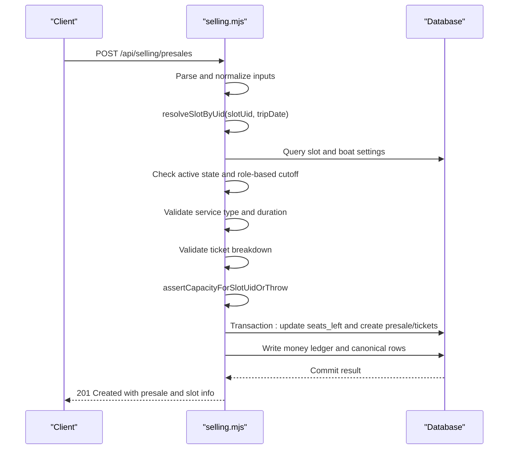
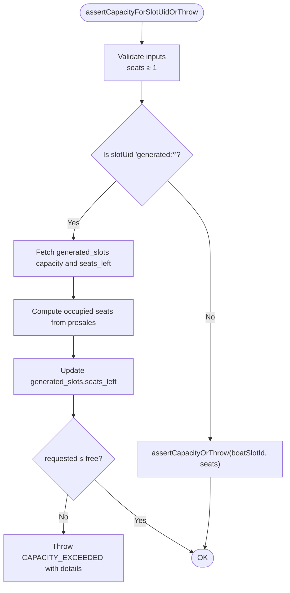
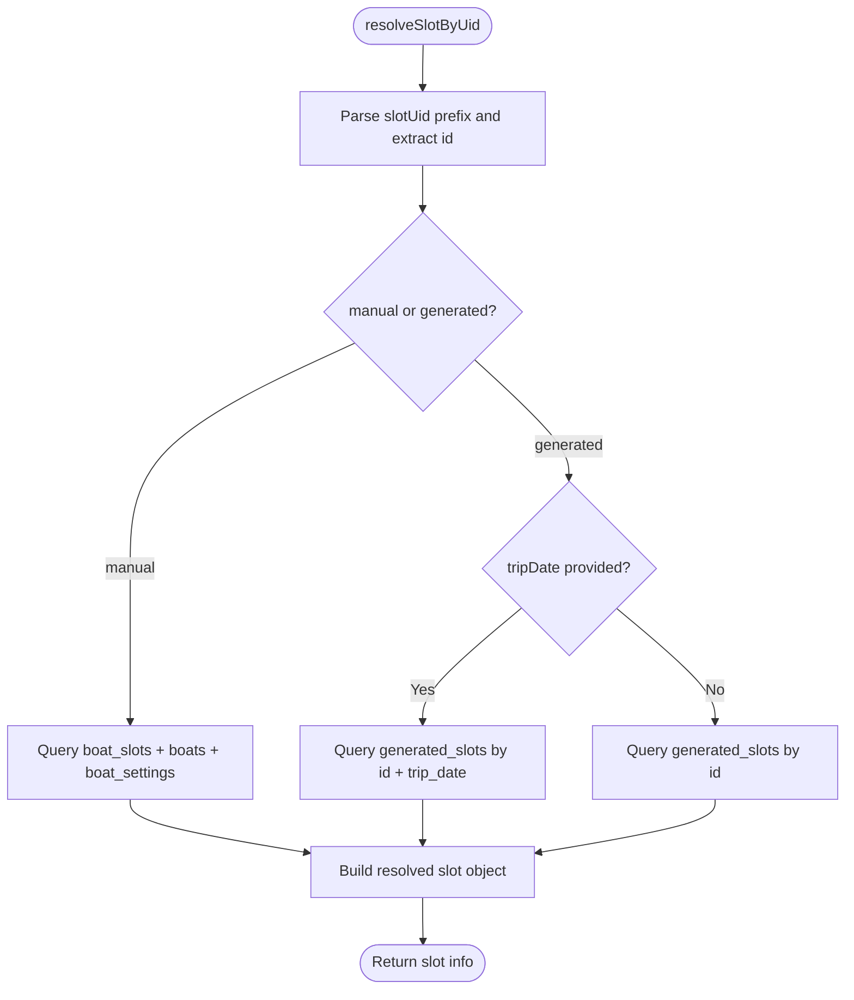
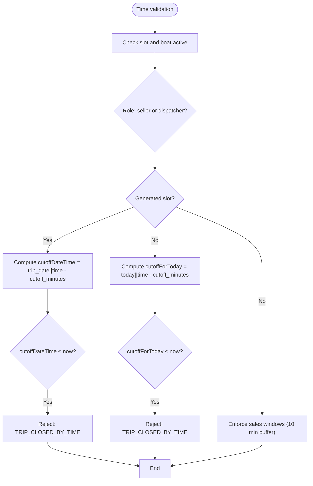
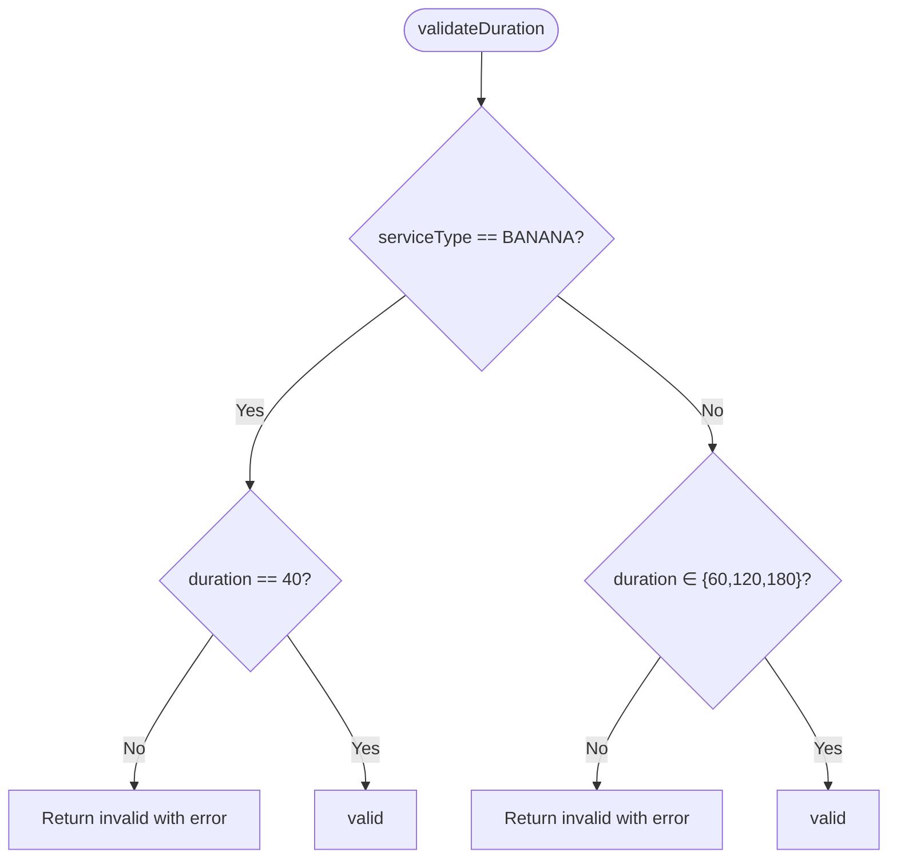
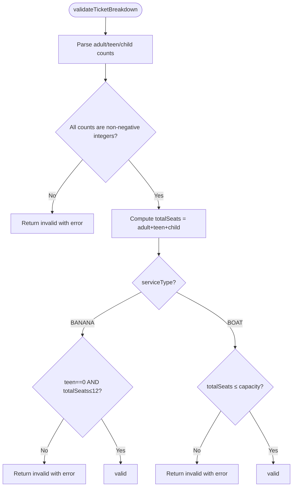
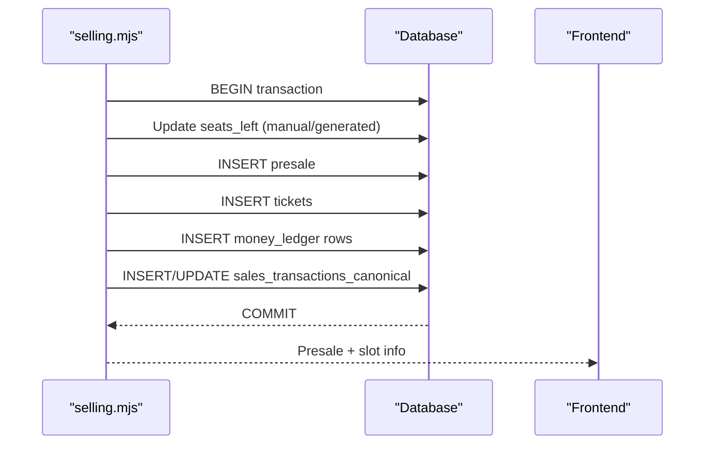
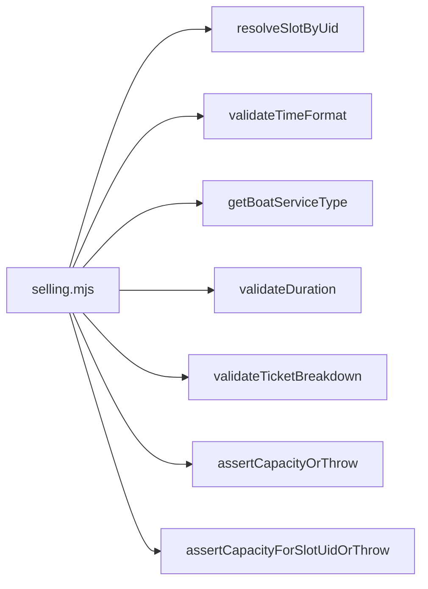

# Business Rule Validation

<cite>
**Referenced Files in This Document**
- [BUSINESS_RULES.md](file://docs/BUSINESS_RULES.md)
- [TIME_RULES.md](file://docs/TIME_RULES.md)
- [selling.mjs](file://server/selling.mjs)
- [slotAvailability.js](file://src/utils/slotAvailability.js)
- [dateUtils.js](file://src/utils/dateUtils.js)
</cite>

## Table of Contents
1. [Introduction](#introduction)
2. [Project Structure](#project-structure)
3. [Core Components](#core-components)
4. [Architecture Overview](#architecture-overview)
5. [Detailed Component Analysis](#detailed-component-analysis)
6. [Dependency Analysis](#dependency-analysis)
7. [Performance Considerations](#performance-considerations)
8. [Troubleshooting Guide](#troubleshooting-guide)
9. [Conclusion](#conclusion)

## Introduction
This document explains the business rule validation mechanisms in the selling API. It focuses on capacity validation (both manual and generated slots), time-based business rules (cutoff times for sellers and dispatchers), service-type constraints (boat vs banana), duration restrictions, seat allocation rules, ticket category validation (adult/teen/child), and validation helpers for time format, service type determination, and ticket breakdown validation. It also documents integration points with the broader ticketing workflow and provides examples of validation scenarios and error responses.

## Project Structure
The selling API is implemented as a server module that exposes endpoints for creating presales, validating inputs, enforcing business rules, and managing related operations. Supporting utilities in the frontend provide slot availability helpers and date utilities.

**Diagram sources**
- [selling.mjs](file://server/selling.mjs#L1-L120)
- [BUSINESS_RULES.md](file://docs/BUSINESS_RULES.md#L1-L49)
- [TIME_RULES.md](file://docs/TIME_RULES.md#L1-L47)
- [slotAvailability.js](file://src/utils/slotAvailability.js#L1-L19)
- [dateUtils.js](file://src/utils/dateUtils.js#L1-L74)

**Section sources**
- [selling.mjs](file://server/selling.mjs#L1-L120)
- [BUSINESS_RULES.md](file://docs/BUSINESS_RULES.md#L1-L49)
- [TIME_RULES.md](file://docs/TIME_RULES.md#L1-L47)
- [slotAvailability.js](file://src/utils/slotAvailability.js#L1-L19)
- [dateUtils.js](file://src/utils/dateUtils.js#L1-L74)

## Core Components
- Capacity validators
  - assertCapacityOrThrow: Validates capacity for manual slots by comparing requested seats to available seats.
  - assertCapacityForSlotUidOrThrow: Validates capacity for both manual and generated slots, using presales as the authoritative source for generated slots and keeping caches synchronized.
- Time-based business rules
  - resolveSlotByUid: Resolves slot information by slotUid, supporting both manual and generated slots and precise matching for generated slots by date.
  - Role-based cutoff enforcement: Enforces seller and dispatcher cutoffs based on slot settings and current server time.
  - Sales window enforcement: Prevents sales too close to departure for sellers and too late for dispatchers.
- Service-type and duration constraints
  - getBoatServiceType: Determines service type (BOAT or BANANA) from boat type.
  - validateDuration: Enforces duration constraints per service type.
- Ticket category and seat allocation
  - validateTicketBreakdown: Validates ticket breakdown (adult/teen/child) and enforces service-specific constraints.
  - assertCapacityForSlotUidOrThrow: Also ensures seat allocation respects capacity and service rules.
- Validation helpers
  - validateTimeFormat: Validates time format and acceptable intervals.
  - resolveSlotByUid: Central resolver for slot information and constraints.

**Section sources**
- [selling.mjs](file://server/selling.mjs#L52-L94)
- [selling.mjs](file://server/selling.mjs#L174-L262)
- [selling.mjs](file://server/selling.mjs#L264-L395)
- [selling.mjs](file://server/selling.mjs#L820-L1071)

## Architecture Overview
The selling API orchestrates validation and persistence in a transactional flow. The request lifecycle includes:
- Input parsing and normalization
- Slot resolution and active-state verification
- Role-based cutoff and sales-window checks
- Service-type and duration validation
- Ticket breakdown validation
- Capacity checks (manual and generated)
- Transactional seat allocation and presale creation
- Money ledger updates and canonical money synchronization

**Diagram sources**
- [selling.mjs](file://server/selling.mjs#L642-L1599)
- [selling.mjs](file://server/selling.mjs#L1129-L1509)

## Detailed Component Analysis

### Capacity Validation: assertCapacityOrThrow and assertCapacityForSlotUidOrThrow
- Purpose
  - Enforce seat availability before creating a presale.
  - Distinguish between manual and generated slots while ensuring consistent behavior.
- Behavior
  - Manual slots: Count occupied seats from tickets and compare to boat_slots capacity.
  - Generated slots: Use presales as the authoritative source for occupancy, compute free seats, and synchronize seats_left cache.
- Error handling
  - Throws structured errors with details (capacity, occupied, requested, free, boatSlotId) when capacity is exceeded.

**Diagram sources**
- [selling.mjs](file://server/selling.mjs#L66-L94)

**Section sources**
- [selling.mjs](file://server/selling.mjs#L52-L60)
- [selling.mjs](file://server/selling.mjs#L66-L94)

### Slot Resolution and Active-State Checks
- Purpose
  - Resolve slot by slotUid (manual or generated), support date-precise matching for generated slots, and expose slot and boat settings.
- Behavior
  - Manual slots: Join with boats and boat_settings to fetch cutoffs and pricing.
  - Generated slots: Support precise matching by ID and trip_date; compute seats_left using presales and fallback logic.
- Active-state enforcement
  - Rejects requests if slot or boat is inactive.

**Diagram sources**
- [selling.mjs](file://server/selling.mjs#L264-L395)

**Section sources**
- [selling.mjs](file://server/selling.mjs#L264-L395)

### Time-Based Business Rules: Cutoffs and Sales Windows
- Cutoff enforcement
  - Role-specific cutoffs: seller_cutoff_minutes and dispatcher_cutoff_minutes.
  - For generated slots: compute cutoff as trip_datetime minus cutoff_minutes; compare to current server time.
  - For manual slots: compute cutoff for the current day using slot time; compare to current server time.
- Sales windows
  - Sellers: sales closed within 10 minutes before departure.
  - Dispatchers: sales closed after 10 minutes past departure.
- Error responses
  - Structured errors with debug info including tripStart, now, and server timezone hint.

**Diagram sources**
- [selling.mjs](file://server/selling.mjs#L891-L1005)
- [TIME_RULES.md](file://docs/TIME_RULES.md#L16-L47)

**Section sources**
- [selling.mjs](file://server/selling.mjs#L891-L1005)
- [TIME_RULES.md](file://docs/TIME_RULES.md#L16-L47)

### Service-Type Constraints and Duration Restrictions
- Service type determination
  - getBoatServiceType: BOAT for non-banana types; BANANA otherwise.
- Duration validation
  - validateDuration: Enforce 40 minutes for banana; 60/120/180 minutes for boats.
- Enforcement points
  - During presale creation (service type derived from resolved slot).
  - During dispatcher slot creation/update (enforced for new/modified slots).

**Diagram sources**
- [selling.mjs](file://server/selling.mjs#L198-L206)
- [selling.mjs](file://server/selling.mjs#L247-L262)

**Section sources**
- [selling.mjs](file://server/selling.mjs#L198-L206)
- [selling.mjs](file://server/selling.mjs#L247-L262)

### Seat Allocation Rules and Ticket Category Validation
- Seat allocation
  - Enforce that requested seats do not exceed slot capacity (or free seats for generated slots).
  - For generated slots, seats_left is recomputed from presales and cached.
- Ticket category validation
  - validateTicketBreakdown: Validates non-negative integer counts for adult/teen/child and computes total seats.
  - Service-specific constraints:
    - BANANA: teen tickets not allowed; total seats must not exceed 12.
    - BOAT: total seats must not exceed slot capacity.
- Enforcement
  - Used when ticket breakdown is provided; otherwise legacy numberOfSeats is validated against capacity.

**Diagram sources**
- [selling.mjs](file://server/selling.mjs#L208-L245)

**Section sources**
- [selling.mjs](file://server/selling.mjs#L208-L245)

### Validation Helpers
- Time format validation
  - validateTimeFormat: Ensures HH:MM format, hours 08–21, minutes 00 or 30.
- Service type determination
  - getBoatServiceType: Maps boat type to BOAT or BANANA.
- Ticket breakdown validation
  - validateTicketBreakdown: Validates and computes totals with service-specific constraints.
- Slot resolution
  - resolveSlotByUid: Central resolver for manual and generated slots with date-aware matching.

**Section sources**
- [selling.mjs](file://server/selling.mjs#L174-L196)
- [selling.mjs](file://server/selling.mjs#L198-L206)
- [selling.mjs](file://server/selling.mjs#L208-L245)
- [selling.mjs](file://server/selling.mjs#L264-L395)

### Integration with the Ticketing Workflow
- Transactional creation
  - Seats_left decremented in the correct table (manual or generated).
  - Presale and tickets created atomically.
  - Money ledger rows written for prepayment and acceptance.
  - Canonical money rows synchronized for owner analytics.
- Seat restoration and adjustments
  - restoreSeatsForPresale: Restores seats when presales are canceled or modified.
  - recalcSlotSeatsLeft: Recompute seats_left for manual slots.
- Frontend integration
  - Utilities like getSlotAvailable and isSlotSoldOut help UI render accurate availability.

**Diagram sources**
- [selling.mjs](file://server/selling.mjs#L1129-L1509)

**Section sources**
- [selling.mjs](file://server/selling.mjs#L1129-L1509)
- [slotAvailability.js](file://src/utils/slotAvailability.js#L1-L19)

## Dependency Analysis
- Internal dependencies
  - selling.mjs depends on:
    - resolveSlotByUid for slot retrieval and constraints.
    - validateTimeFormat, getBoatServiceType, validateDuration, validateTicketBreakdown for validation helpers.
    - assertCapacityOrThrow and assertCapacityForSlotUidOrThrow for capacity checks.
- External dependencies
  - Database access via prepared statements and transactions.
  - Money ledger and canonical tables for financial tracking.

**Diagram sources**
- [selling.mjs](file://server/selling.mjs#L52-L94)
- [selling.mjs](file://server/selling.mjs#L174-L262)
- [selling.mjs](file://server/selling.mjs#L264-L395)

**Section sources**
- [selling.mjs](file://server/selling.mjs#L52-L94)
- [selling.mjs](file://server/selling.mjs#L174-L262)
- [selling.mjs](file://server/selling.mjs#L264-L395)

## Performance Considerations
- Capacity checks
  - Prefer assertCapacityForSlotUidOrThrow for generated slots to avoid mis-aggregation across dates.
  - Keep seats_left caches synchronized to minimize repeated computations.
- Time comparisons
  - Use server-side time consistently; avoid client-provided timestamps.
- Transactions
  - Bundle seat updates, presale creation, and ledger writes in a single transaction to maintain consistency and reduce contention.

## Troubleshooting Guide
Common validation scenarios and error responses:
- Capacity exceeded
  - Cause: Requested seats > free seats.
  - Response: CAPACITY_EXCEEDED with details (capacity, occupied, requested, free, boatSlotId).
  - Example: Generated slot with seats_left computed from presales.
- Slot not found or invalid slotUid
  - Cause: Malformed or unknown slotUid; mismatch for generated slots when tripDate is provided.
  - Response: SLOT_NOT_FOUND or SLOT_UID_INVALID; for date mismatch, SLOT_DATE_MISMATCH with debug info.
- Trip closed by time
  - Cause: Current time reached or exceeded cutoff for the user’s role.
  - Response: TRIP_CLOSED_BY_TIME with debug info (tripStart, now, server timezone hint).
- Sales window violation
  - Cause: Seller attempted sale within 10 minutes before departure; dispatcher attempted sale after 10 minutes past departure.
  - Response: SALES_CLOSED with explanatory message.
- Invalid ticket breakdown
  - Cause: Negative counts, unsupported categories for service type, or exceeding capacity/banana limits.
  - Response: INVALID_TICKET_BREAKDOWN with error message.
- Prepayment exceeds total
  - Cause: Prepayment amount larger than calculated total price.
  - Response: PREPAYMENT_EXCEEDS_TOTAL with message.

**Section sources**
- [selling.mjs](file://server/selling.mjs#L820-L1071)
- [selling.mjs](file://server/selling.mjs#L1586-L1599)
- [selling.mjs](file://server/selling.mjs#L1010-L1038)
- [selling.mjs](file://server/selling.mjs#L1120-L1127)

## Conclusion
The selling API enforces robust business rules across capacity, time, service type, and ticket categories. Its design ensures consistent behavior for manual and generated slots, strict role-based cutoff enforcement, and seamless integration with financial ledgers and canonical records. By leveraging centralized validation helpers and transactional operations, the system maintains correctness and transparency across the ticketing workflow.