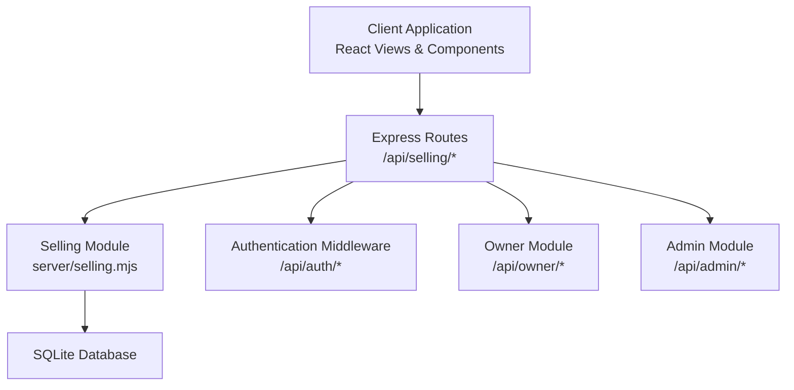
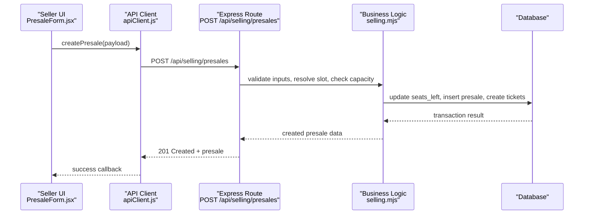
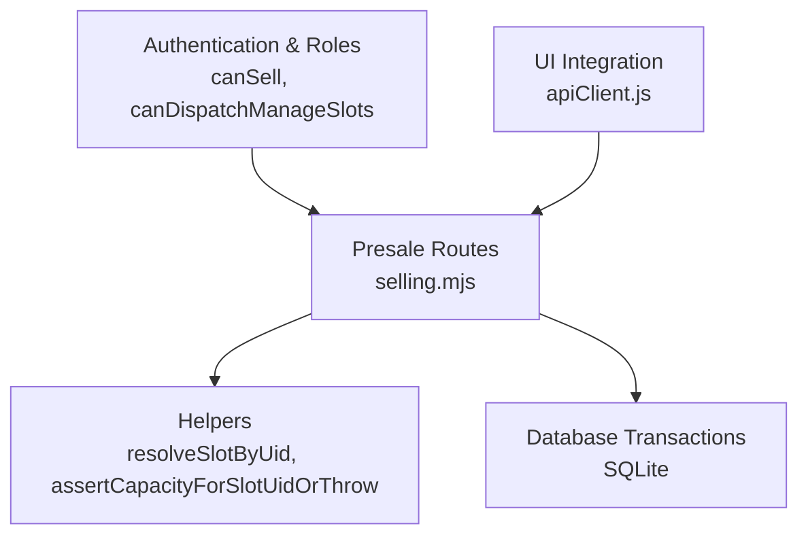

# Presale Management Endpoints

<cite>
**Referenced Files in This Document**
- [selling.mjs](file://server/selling.mjs)
- [index.js](file://server/index.js)
- [apiClient.js](file://src/utils/apiClient.js)
- [PresaleForm.jsx](file://src/components/seller/PresaleForm.jsx)
- [ConfirmationScreen.jsx](file://src/components/seller/ConfirmationScreen.jsx)
- [SellerView.jsx](file://src/views/SellerView.jsx)
- [PresaleListView.jsx](file://src/components/dispatcher/PresaleListView.jsx)
</cite>

## Table of Contents
1. [Introduction](#introduction)
2. [Project Structure](#project-structure)
3. [Core Components](#core-components)
4. [Architecture Overview](#architecture-overview)
5. [Detailed Component Analysis](#detailed-component-analysis)
6. [Dependency Analysis](#dependency-analysis)
7. [Performance Considerations](#performance-considerations)
8. [Troubleshooting Guide](#troubleshooting-guide)
9. [Conclusion](#conclusion)

## Introduction
This document provides comprehensive API documentation for presale management endpoints focused on creating advance bookings. It covers the POST /api/selling/presales endpoint, including request validation for slot identification, customer information, seat selection (both numeric and breakdown formats), prepayment amounts, and payment methods. It also documents the presale creation workflow, capacity validation, seat reservation, and payment method tracking. Additional endpoints for modifying and canceling presales are documented, along with error handling for invalid inputs, capacity exceeded scenarios, and payment validation failures. Practical examples demonstrate different presale creation scenarios, including family bookings with ticket breakdowns.

## Project Structure
The presale management functionality is implemented in the server module and exposed via Express routes. The client-side UI integrates with these endpoints through an API client abstraction.

**Diagram sources**
- [index.js](file://server/index.js#L25-L40)
- [selling.mjs](file://server/selling.mjs#L640-L640)

**Section sources**
- [index.js](file://server/index.js#L25-L40)

## Core Components
- Presale Creation Endpoint: POST /api/selling/presales
- Presale Modification Endpoints:
  - PATCH /api/selling/presales/:id/accept-payment
  - PATCH /api/selling/presales/:id/cancel-trip-pending
  - PATCH /api/selling/presales/:id/transfer
  - PATCH /api/selling/presales/:id/payment
  - PATCH /api/selling/presales/:id/cancel
  - PATCH /api/selling/presales/:id/move
  - PATCH /api/selling/presales/:id/seats
  - PATCH /api/selling/presales/:id/used
  - PATCH /api/selling/presales/:id/refund
  - PATCH /api/selling/presales/:id/delete
- Supporting Endpoints:
  - GET /api/selling/presales/:id/tickets
  - GET /api/selling/slots/:slotId/tickets

**Section sources**
- [selling.mjs](file://server/selling.mjs#L640-L640)
- [selling.mjs](file://server/selling.mjs#L3121-L3131)
- [selling.mjs](file://server/selling.mjs#L3133-L3199)
- [selling.mjs](file://server/selling.mjs#L3202-L3317)
- [selling.mjs](file://server/selling.mjs#L3319-L3460)
- [selling.mjs](file://server/selling.mjs#L3462-L3485)
- [selling.mjs](file://server/selling.mjs#L3487-L3530)

## Architecture Overview
The presale lifecycle spans client-side UI, API routing, business logic validation, and database persistence. The client interacts with the API through an abstraction layer that encapsulates HTTP requests and response handling.

**Diagram sources**
- [PresaleForm.jsx](file://src/components/seller/PresaleForm.jsx#L62-L82)
- [apiClient.js](file://src/utils/apiClient.js#L166-L168)
- [selling.mjs](file://server/selling.mjs#L643-L1600)

## Detailed Component Analysis

### POST /api/selling/presales (Create Presale)
Purpose: Create an advance booking for a specific trip slot with customer details, seat selection, and prepayment information.

Key Request Fields:
- slotUid (required): Identifies the trip slot. Supports manual:ID and generated:ID formats.
- customerName (required): Customer full name (minimum length varies by validation).
- customerPhone (required): Customer phone number (minimum length varies by validation).
- numberOfSeats (mutually exclusive with tickets): Total number of seats to reserve.
- tickets (mutually exclusive with numberOfSeats): Seat breakdown by category.
  - adult: non-negative integer
  - teen: non-negative integer
  - child: non-negative integer
- prepaymentAmount (required if payment method provided): Prepayment amount in smallest currency unit.
- prepaymentComment: Optional comment for prepayment.
- payment_method (optional): Accepted values include CASH, CARD, MIXED, and cashless variants mapped to CARD.
- trip_date/tripDate (optional): Required for generated slots to match the specific trip date.

Validation Rules:
- slotUid must be present and properly formatted.
- customerName and customerPhone must be present and meet minimum length requirements.
- numberOfSeats must be a positive integer or tickets breakdown must be provided.
- tickets breakdown must contain non-negative integers and total seats ≥ 1.
- prepaymentAmount must be a non-negative integer; if provided, payment_method must be valid.
- For generated slots, the system resolves the slot by ID and date; mismatches return SLOT_DATE_MISMATCH.
- Capacity checks ensure requested seats do not exceed available seats; otherwise CAPACITY_EXCEEDED or NO_SEATS is returned.
- Sales time windows restrict creation based on role and proximity to trip start.

Processing Logic:
- Resolves slot by UID (manual or generated), validates activity and cutoff times.
- Validates ticket breakdown against service type and capacity constraints.
- Calculates total price using per-category pricing when tickets are provided; otherwise legacy per-seat pricing applies.
- Enforces prepayment ≤ total price.
- Executes a transaction to:
  - Decrement seats_left in the appropriate slot table.
  - Create presale record with status ACTIVE.
  - Create tickets with deterministic order (adult → teen → child).
  - Write ledger entries for immediate payment tracking.
  - Maintain canonical sales records for accurate owner analytics.

Response:
- 201 Created with presale details, slot metadata, and computed remaining amount.
- On errors: structured error response with code and message.

Common Error Codes:
- SLOT_UID_REQUIRED, CUSTOMER_NAME_REQUIRED, CUSTOMER_PHONE_REQUIRED
- INVALID_CUSTOMER_NAME, INVALID_CUSTOMER_PHONE
- INVALID_TICKET_STRUCTURE, INVALID_TICKET_COUNT
- INVALID_SEAT_COUNT, SEAT_CAPACITY_EXCEEDED
- INVALID_PREPAYMENT_AMOUNT, PREPAYMENT_EXCEEDS_TOTAL
- INVALID_PAYMENT_METHOD, INVALID_PAYMENT_SPLIT
- SLOT_DATE_MISMATCH, SLOT_NOT_FOUND, SLOT_UID_INVALID
- TRIP_CLOSED_BY_TIME, SALES_CLOSED
- CAPACITY_EXCEEDED, NO_SEATS

Example Requests:
- Numeric seat selection:
  - slotUid: "generated:123"
  - customerName: "John Doe"
  - customerPhone: "+79991234567"
  - numberOfSeats: 4
  - prepaymentAmount: 2000
  - payment_method: "CASH"
- Ticket breakdown (family booking):
  - slotUid: "manual:456"
  - customerName: "Jane Smith"
  - customerPhone: "+79997654321"
  - tickets: { adult: 2, teen: 1, child: 1 }
  - prepaymentAmount: 0
  - payment_method: "MIXED"
  - cash_amount: 1500
  - card_amount: 1200

**Section sources**
- [selling.mjs](file://server/selling.mjs#L643-L1600)
- [PresaleForm.jsx](file://src/components/seller/PresaleForm.jsx#L62-L82)
- [apiClient.js](file://src/utils/apiClient.js#L166-L168)

### PATCH /api/selling/presales/:id/accept-payment
Purpose: Record additional payment for an existing presale.

Request Body:
- additionalPayment: Amount to add to the existing prepayment.

Behavior:
- Validates presale exists and remaining amount > 0.
- Updates presale totals and ledger entries accordingly.

**Section sources**
- [apiClient.js](file://src/utils/apiClient.js#L212-L215)
- [selling.mjs](file://server/selling.mjs#L3121-L3131)

### PATCH /api/selling/presales/:id/cancel-trip-pending
Purpose: Mark a presale as "cancelled trip pending" for future refund processing.

Behavior:
- Validates presale exists and is eligible for this status change.

**Section sources**
- [apiClient.js](file://src/utils/apiClient.js#L217-L220)
- [selling.mjs](file://server/selling.mjs#L4568-L4568)

### PATCH /api/selling/presales/:id/transfer
Purpose: Transfer a presale to another trip slot.

Request Body:
- to_slot_uid: Target slot identifier.

Behavior:
- Validates target slot availability and creates a new presale for the transferred ticket.
- Adjusts seat inventories for source and destination slots.
- Recalculates pending amounts for both presales.

**Section sources**
- [apiClient.js](file://src/utils/apiClient.js#L222-L225)
- [selling.mjs](file://server/selling.mjs#L3816-L4000)

### PATCH /api/selling/presales/:id/payment
Purpose: Update payment details for a presale.

Behavior:
- Updates payment method and amounts while maintaining ledger consistency.

**Section sources**
- [apiClient.js](file://src/utils/apiClient.js#L227-L229)
- [selling.mjs](file://server/selling.mjs#L3121-L3131)

### PATCH /api/selling/presales/:id/cancel
Purpose: Cancel a presale.

Behavior:
- Marks presale as CANCELLED and refunds tickets.
- Reverses ledger entries and clamps seat inventory adjustments.

**Section sources**
- [apiClient.js](file://src/utils/apiClient.js#L231-L233)
- [selling.mjs](file://server/selling.mjs#L3319-L3460)

### PATCH /api/selling/presales/:id/move
Purpose: Move a presale to a different slot (alternative to transfer).

Behavior:
- Similar to transfer but uses a different endpoint semantics.

**Section sources**
- [apiClient.js](file://src/utils/apiClient.js#L235-L237)
- [selling.mjs](file://server/selling.mjs#L3816-L4000)

### PATCH /api/selling/presales/:id/seats
Purpose: Modify the number of seats in a presale.

Behavior:
- Updates seat count and recalculates totals and ticket breakdown.

**Section sources**
- [apiClient.js](file://src/utils/apiClient.js#L239-L241)
- [selling.mjs](file://server/selling.mjs#L3121-L3131)

### PATCH /api/selling/presales/:id/used
Purpose: Mark a presale as used (boarding confirmation).

Eligible statuses: ACTIVE, CONFIRMED, PAID, PARTIALLY_PAID.
Blocked statuses: USED, CANCELLED, REFUNDED.

**Section sources**
- [apiClient.js](file://src/utils/apiClient.js#L243-L245)
- [selling.mjs](file://server/selling.mjs#L3133-L3199)

### PATCH /api/selling/presales/:id/refund
Purpose: Refund a presale that is in CANCELLED_TRIP_PENDING status.

Behavior:
- Updates presale to REFUNDED, refunds tickets, and restores seats.

**Section sources**
- [apiClient.js](file://src/utils/apiClient.js#L247-L249)
- [selling.mjs](file://server/selling.mjs#L3202-L3317)

### PATCH /api/selling/presales/:id/delete
Purpose: Delete a presale (irreversible cancellation).

Behavior:
- Marks presale as CANCELLED, refunds tickets, reverses ledger entries, and clamps seat inventory.

**Section sources**
- [apiClient.js](file://src/utils/apiClient.js#L251-L253)
- [selling.mjs](file://server/selling.mjs#L3319-L3460)

### GET /api/selling/presales/:id/tickets
Purpose: Retrieve all tickets associated with a presale.

Response: Array of ticket objects with status and pricing.

**Section sources**
- [apiClient.js](file://src/utils/apiClient.js#L255-L257)
- [selling.mjs](file://server/selling.mjs#L3462-L3485)

### GET /api/selling/slots/:slotId/tickets
Purpose: Retrieve all active tickets for a specific slot (supports generated and manual slot identifiers).

**Section sources**
- [apiClient.js](file://src/utils/apiClient.js#L259-L261)
- [selling.mjs](file://server/selling.mjs#L3487-L3530)

## Dependency Analysis
The presale endpoints depend on:
- Authentication middleware for role-based access control.
- Business logic helpers for slot resolution, capacity validation, and seat inventory management.
- Database transactions to ensure atomicity across seat updates, presale creation, and ledger entries.

**Diagram sources**
- [selling.mjs](file://server/selling.mjs#L151-L152)
- [selling.mjs](file://server/selling.mjs#L264-L395)
- [selling.mjs](file://server/selling.mjs#L643-L1600)
- [apiClient.js](file://src/utils/apiClient.js#L166-L253)

**Section sources**
- [selling.mjs](file://server/selling.mjs#L151-L152)
- [selling.mjs](file://server/selling.mjs#L264-L395)
- [selling.mjs](file://server/selling.mjs#L643-L1600)
- [apiClient.js](file://src/utils/apiClient.js#L166-L253)

## Performance Considerations
- Transactional writes ensure consistency but may impact throughput under high concurrency. Consider connection pooling and indexing on frequently queried columns (e.g., presales.id, tickets.presale_id).
- Seat inventory updates occur per presale creation; batch operations or caching strategies could reduce contention.
- Price calculation uses per-category pricing when tickets are provided, minimizing rounding discrepancies across multiple seats.

## Troubleshooting Guide
Common Issues and Resolutions:
- Invalid slotUid: Ensure slotUid follows manual:ID or generated:ID format and references an existing slot.
- Capacity exceeded: Reduce requested seats or choose a different trip slot.
- Prepayment exceeds total: Adjust prepaymentAmount to be less than or equal to total price.
- Payment method validation failure: Use accepted values (CASH, CARD, MIXED) and ensure mixed payments sum correctly.
- Sales window closed: Creation attempts near trip start/end times are rejected based on role-specific cutoffs.
- Slot date mismatch (generated slots): Provide the correct trip_date to match the generated slot.

**Section sources**
- [selling.mjs](file://server/selling.mjs#L820-L1005)
- [selling.mjs](file://server/selling.mjs#L1120-L1150)
- [selling.mjs](file://server/selling.mjs#L1584-L1599)

## Conclusion
The presale management endpoints provide a robust foundation for advance booking workflows, including flexible seat selection, precise payment tracking, and comprehensive lifecycle management. The implementation enforces strict validation, maintains seat inventory integrity, and ensures accurate financial analytics through ledger and canonical records. Clients should leverage the documented request schemas and error codes to build reliable integrations and user experiences.