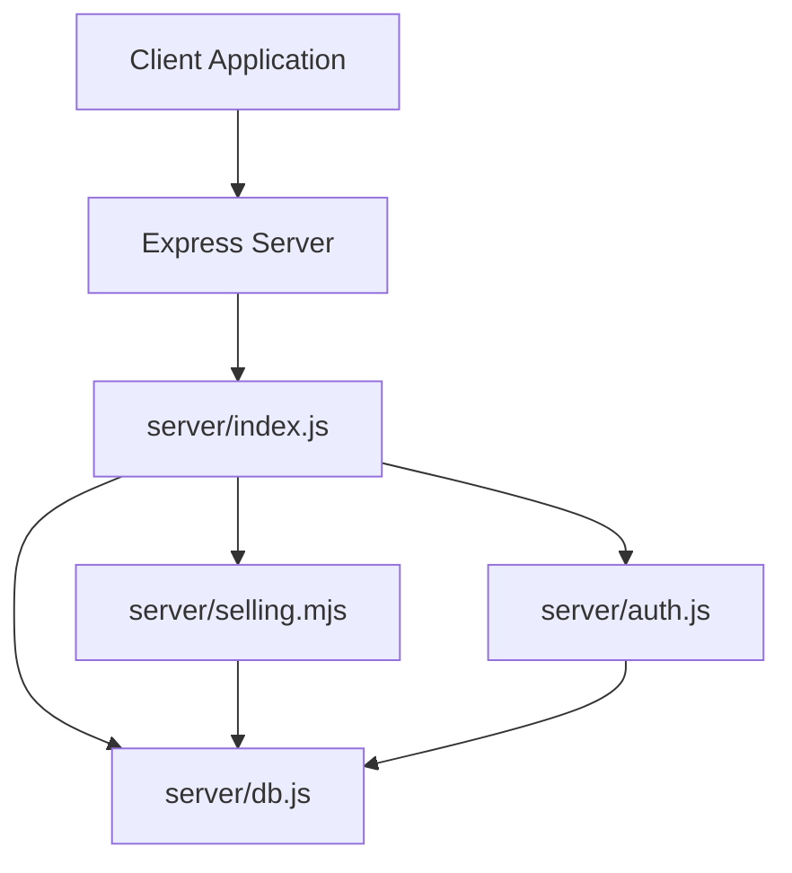
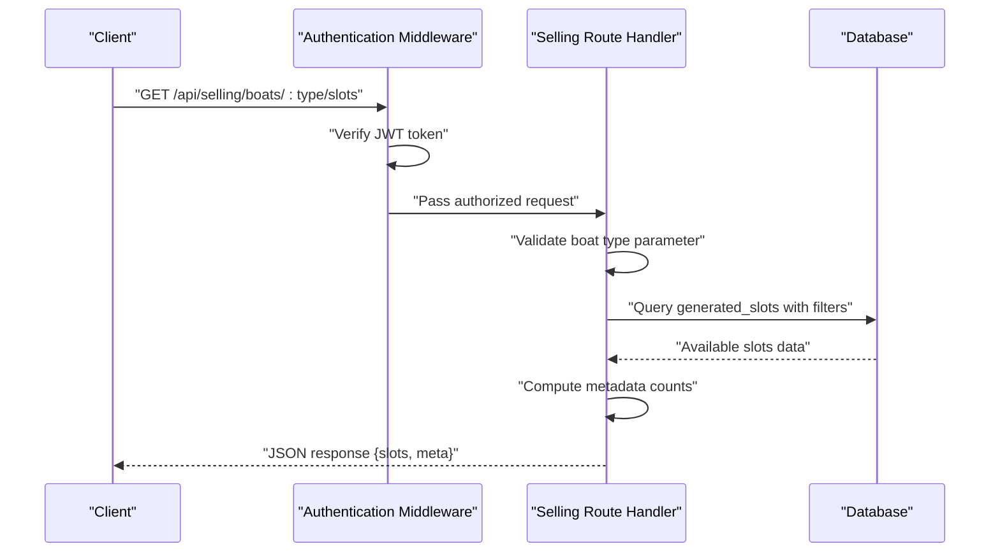
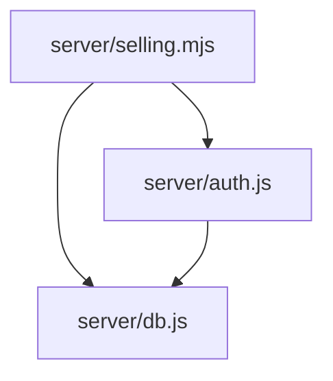

# Seat Management Endpoints

<cite>
**Referenced Files in This Document**
- [server/index.js](file://server/index.js)
- [server/selling.mjs](file://server/selling.mjs)
- [server/db.js](file://server/db.js)
- [server/auth.js](file://server/auth.js)
- [docs/API_CONTRACT.md](file://docs/API_CONTRACT.md)
- [src/utils/slotAvailability.js](file://src/utils/slotAvailability.js)
</cite>

## Table of Contents
1. [Introduction](#introduction)
2. [Project Structure](#project-structure)
3. [Core Components](#core-components)
4. [Architecture Overview](#architecture-overview)
5. [Detailed Component Analysis](#detailed-component-analysis)
6. [Dependency Analysis](#dependency-analysis)
7. [Performance Considerations](#performance-considerations)
8. [Troubleshooting Guide](#troubleshooting-guide)
9. [Conclusion](#conclusion)

## Introduction
This document provides comprehensive API documentation for the seat management endpoints in the selling API, focusing on the GET /api/selling/boats/:type/slots endpoint. It explains request parameters, response schemas, filtering logic for active boats and available seats, capacity calculation including COALESCE handling for legacy data, and error handling. Practical examples demonstrate how sellers can query available trips for different boat categories (speed, cruise, banana).

## Project Structure
The selling API is implemented as an Express router mounted under /api/selling. The relevant files include:
- server/index.js: Mounts the selling routes and sets up the server
- server/selling.mjs: Implements the selling API endpoints including the slot retrieval endpoint
- server/db.js: Provides database initialization and schema migrations
- server/auth.js: Authentication and authorization middleware
- docs/API_CONTRACT.md: API contract documentation including slotUid format
- src/utils/slotAvailability.js: Utility functions for slot availability calculations

**Diagram sources**
- [server/index.js](file://server/index.js#L20-L45)
- [server/selling.mjs](file://server/selling.mjs#L400-L460)
- [server/auth.js](file://server/auth.js#L10-L40)
- [server/db.js](file://server/db.js#L15-L36)

**Section sources**
- [server/index.js](file://server/index.js#L20-L45)

## Core Components
- Authentication and Authorization: The endpoint requires a valid JWT token and access level of seller or dispatcher.
- Route Handler: The GET /api/selling/boats/:type/slots endpoint validates the boat type parameter and returns available slots.
- Data Retrieval: Queries generated_slots for active, future or upcoming today's trips with available seats.
- Filtering Logic: Filters for active boats, active slots, and available seats using COALESCE to handle legacy data.
- Response Formatting: Returns slots array and metadata counts for active boats and slots.

Key implementation references:
- Route definition and handler: [server/selling.mjs](file://server/selling.mjs#L461-L638)
- Authentication middleware: [server/auth.js](file://server/auth.js#L10-L40)
- Database initialization and migrations: [server/db.js](file://server/db.js#L15-L36)

**Section sources**
- [server/selling.mjs](file://server/selling.mjs#L461-L638)
- [server/auth.js](file://server/auth.js#L10-L40)
- [server/db.js](file://server/db.js#L15-L36)

## Architecture Overview
The seat management endpoint follows a layered architecture:
- Presentation Layer: Express route handler
- Business Logic: Validation, filtering, and capacity calculation
- Data Access: SQLite database queries and prepared statements
- Security: JWT authentication and role-based authorization

**Diagram sources**
- [server/selling.mjs](file://server/selling.mjs#L461-L638)
- [server/auth.js](file://server/auth.js#L10-L40)
- [server/db.js](file://server/db.js#L15-L36)

## Detailed Component Analysis

### Endpoint: GET /api/selling/boats/:type/slots
Purpose: Retrieve available boat slots for a specified boat type (speed, cruise, banana).

#### Request
- Method: GET
- Path: /api/selling/boats/:type/slots
- Path Parameters:
  - type: Boat type string (speed, cruise, banana)
- Headers:
  - Authorization: Bearer <JWT_TOKEN>
- Query Parameters: None

Validation and behavior:
- The type parameter is trimmed and converted to lowercase.
- Only the allowed values are accepted; otherwise returns 400 with an error message.
- Authentication middleware enforces JWT presence and validity.
- Authorization middleware allows roles: seller, dispatcher, admin, owner.

**Section sources**
- [server/selling.mjs](file://server/selling.mjs#L461-L469)
- [server/auth.js](file://server/auth.js#L10-L40)

#### Response
Structure:
- Body: Object with two keys
  - slots: Array of slot objects
  - meta: Object containing metadata counts

Slot Schema:
Each slot object includes:
- slot_id: Numeric identifier for the slot
- slot_uid: Unique slot identifier string (format: generated:<id>)
- boat_id: Identifier of the associated boat
- time: Departure time (HH:MM format)
- price: Price for the slot (adult price)
- capacity: Maximum capacity of the slot
- seats_left: Remaining seats available
- duration_minutes: Trip duration in minutes
- boat_name: Name of the boat
- boat_type: Type of the boat (speed, cruise, banana)
- source_type: Source type ("generated")
- trip_date: Date of the trip (YYYY-MM-DD)
- price_adult: Adult price per seat
- price_child: Child price per seat
- price_teen: Teen price per seat
- available_seats: Computed available seats (capacity - occupied)

Metadata Schema:
- activeBoatsSpeed/Cruise/Banana: Count of active boats for the respective type
- activeSlotsSpeed/Cruise/Banana: Count of active slots returned for the respective type

Filtering Logic:
- Active boats: Only boats where is_active = 1
- Active slots: Only slots where is_active = 1
- Available seats: COALESCE(seats_left, capacity) > 0
- Future or upcoming today: trip_date > date('now') OR (trip_date = date('now') AND time > time(datetime('now', '+10 minutes')))

Capacity Calculation and COALESCE Handling:
- For generated slots, the endpoint computes available_seats as capacity - COALESCE(ticket_counts.active_tickets, 0).
- COALESCE is used to handle legacy data where seats_left might be NULL or 0.
- The query ensures only slots with available seats are returned.

Seat Availability Validation:
- The endpoint filters out slots where available seats are zero or less.
- For generated slots, the computation considers active tickets linked via presales.

Examples:
- Successful response with slots array and metadata counts
- Example response structure:
  - slots: [{ slot_id, slot_uid, boat_id, time, price, capacity, seats_left, duration_minutes, boat_name, boat_type, source_type, trip_date, price_adult, price_child, price_teen, available_seats }, ...]
  - meta: { activeBoatsSpeed, activeBoatsCruise, activeBoatsBanana, activeSlotsSpeed, activeSlotsCruise, activeSlotsBanana }

**Section sources**
- [server/selling.mjs](file://server/selling.mjs#L560-L638)

#### Error Handling
- Invalid boat type: Returns 400 with an error message indicating an invalid boat type.
- Database errors: Catches exceptions and returns 500 with a generic error message.
- Authentication failures: Handled by the authentication middleware (401/403).
- Authorization failures: Handled by the authorization middleware (403).

Practical Examples:
- Query available trips for speed boats: GET /api/selling/boats/speed/slots
- Query available trips for cruise boats: GET /api/selling/boats/cruise/slots
- Query available trips for banana boats: GET /api/selling/boats/banana/slots

**Section sources**
- [server/selling.mjs](file://server/selling.mjs#L461-L469)
- [server/selling.mjs](file://server/selling.mjs#L634-L638)

### Supporting Utilities and Contracts
- API Contract: Defines slotUid format (manual:<id>, generated:<id>) and emphasizes slotUid as the sole acceptable identifier for slots.
- Slot Availability Utility: Provides helpers to compute available seats and detect sold-out slots using normalized field precedence.

**Section sources**
- [docs/API_CONTRACT.md](file://docs/API_CONTRACT.md#L1-L34)
- [src/utils/slotAvailability.js](file://src/utils/slotAvailability.js#L1-L19)

## Dependency Analysis
The endpoint depends on:
- Authentication and authorization middleware for security
- Database queries for retrieving and filtering slot data
- Prepared statements for efficient and secure database access

**Diagram sources**
- [server/selling.mjs](file://server/selling.mjs#L400-L460)
- [server/auth.js](file://server/auth.js#L10-L40)
- [server/db.js](file://server/db.js#L15-L36)

**Section sources**
- [server/selling.mjs](file://server/selling.mjs#L400-L460)
- [server/auth.js](file://server/auth.js#L10-L40)
- [server/db.js](file://server/db.js#L15-L36)

## Performance Considerations
- Prepared Statements: The endpoint uses prepared statements to prevent SQL injection and improve query performance.
- Indexes: Consider adding indexes on frequently queried columns (e.g., generated_slots.trip_date, generated_slots.is_active) to optimize filtering.
- COALESCE Usage: Efficiently handles legacy data without requiring expensive joins or subqueries.
- Metadata Counts: The endpoint computes counts for metadata, which can be optimized by caching or precomputing aggregates if needed.

## Troubleshooting Guide
Common Issues and Resolutions:
- Invalid boat type parameter: Ensure the type is one of speed, cruise, or banana.
- Authentication failures: Verify the JWT token is present and valid.
- Authorization failures: Confirm the user has a valid role (seller, dispatcher, admin, owner).
- Database connectivity: Check database initialization and file path logging.
- Empty slots response: Verify that active boats and slots exist and that seats_left or capacity is properly set.

Debugging Tips:
- Enable logging for database path and request details.
- Review console logs for diagnostic messages indicating counts of boats, active boats, total slots, and available slots.

**Section sources**
- [server/selling.mjs](file://server/selling.mjs#L471-L479)
- [server/selling.mjs](file://server/selling.mjs#L481-L558)
- [server/selling.mjs](file://server/selling.mjs#L634-L638)

## Conclusion
The GET /api/selling/boats/:type/slots endpoint provides a robust mechanism for sellers to discover available trips across different boat categories. It enforces strict validation, applies comprehensive filtering for active and available slots, and handles legacy data gracefully using COALESCE. Proper authentication and authorization ensure secure access, while the response structure offers both slot details and metadata for informed decision-making.