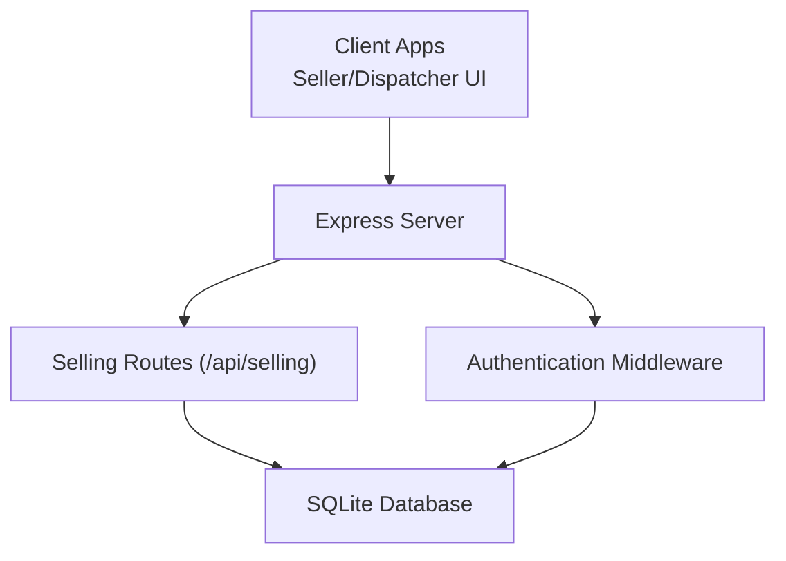
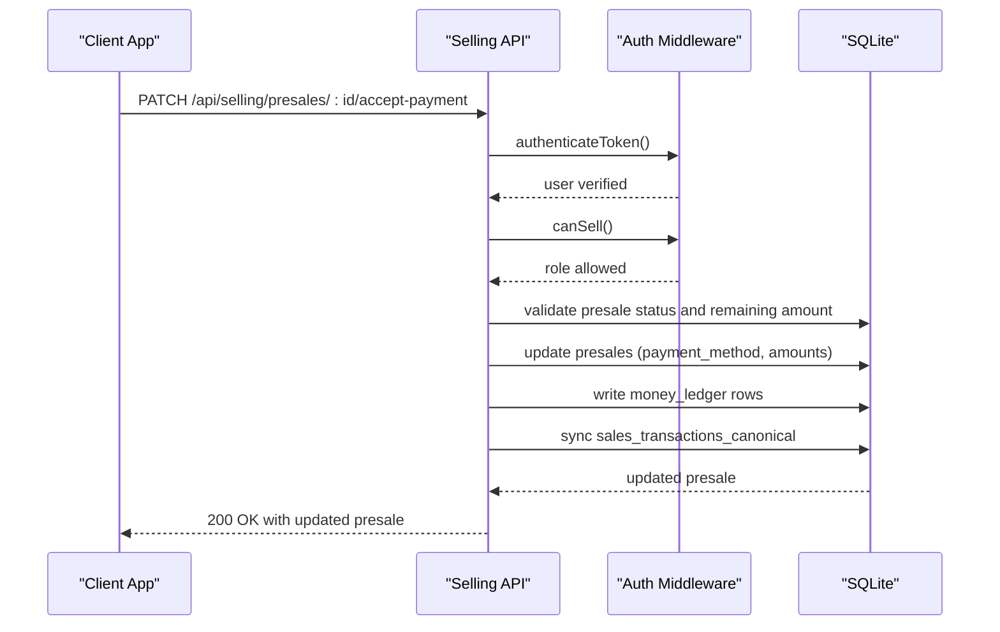
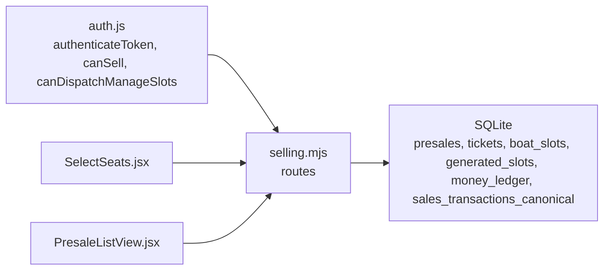

# Selling API

<cite>
**Referenced Files in This Document**
- [server/index.js](file://server/index.js)
- [server/selling.mjs](file://server/selling.mjs)
- [server/auth.js](file://server/auth.js)
- [src/components/seller/SelectSeats.jsx](file://src/components/seller/SelectSeats.jsx)
- [src/components/dispatcher/PresaleListView.jsx](file://src/components/dispatcher/PresaleListView.jsx)
</cite>

## Table of Contents
1. [Introduction](#introduction)
2. [Project Structure](#project-structure)
3. [Core Components](#core-components)
4. [Architecture Overview](#architecture-overview)
5. [Detailed Component Analysis](#detailed-component-analysis)
6. [Dependency Analysis](#dependency-analysis)
7. [Performance Considerations](#performance-considerations)
8. [Troubleshooting Guide](#troubleshooting-guide)
9. [Conclusion](#conclusion)

## Introduction
This document provides comprehensive API documentation for the ticket selling system. It covers seat availability checking, presale management, ticket purchase workflows, and transaction processing. The API supports two operational roles: seller and dispatcher. Business rules include capacity validation, cutoff times, and seat allocation logic for both manual and generated trips.

## Project Structure
The selling API is mounted under `/api/selling` and integrates with Express routing. Authentication middleware enforces role-based access, while the selling module implements all endpoints for seat availability, presales, payments, and ticket lifecycle management.

**Diagram sources**
- [server/index.js](file://server/index.js#L25-L25)
- [server/auth.js](file://server/auth.js#L10-L40)
- [server/selling.mjs](file://server/selling.mjs#L400-L400)

**Section sources**
- [server/index.js](file://server/index.js#L25-L25)

## Core Components
- Authentication and authorization:
  - JWT-based authentication with role checks for seller and dispatcher.
  - Middleware to restrict routes to authorized roles.
- Selling routes:
  - Seat availability and trip listings.
  - Presale creation, updates, and cancellations.
  - Payment acceptance and ticket lifecycle management.
  - Transfer operations for tickets and entire presales.

Key implementation references:
- Authentication middleware and role guards: [server/auth.js](file://server/auth.js#L10-L53)
- Route mounting: [server/index.js](file://server/index.js#L25-L25)
- Presale creation and validation: [server/selling.mjs](file://server/selling.mjs#L643-L816)
- Payment acceptance: [server/selling.mjs](file://server/selling.mjs#L2445-L2678)
- Ticket lifecycle and transfers: [server/selling.mjs](file://server/selling.mjs#L3463-L4039)

**Section sources**
- [server/auth.js](file://server/auth.js#L10-L53)
- [server/index.js](file://server/index.js#L25-L25)
- [server/selling.mjs](file://server/selling.mjs#L643-L816)
- [server/selling.mjs](file://server/selling.mjs#L2445-L2678)
- [server/selling.mjs](file://server/selling.mjs#L3463-L4039)

## Architecture Overview
The API follows a layered architecture:
- Presentation: Express routes in selling.mjs.
- Authorization: JWT verification and role checks in auth.js.
- Persistence: SQLite queries for CRUD operations.
- Business logic: Seat validation, cutoff enforcement, and transactional operations.

```mermaid
graph TB
subgraph "Presentation Layer"
R1["GET /api/selling/boats/:type/slots"]
R2["POST /api/selling/presales"]
R3["PATCH /api/selling/presales/:id/payment"]
R4["PATCH /api/selling/presales/:id/accept-payment"]
R5["PATCH /api/selling/presales/:id/cancel"]
R6["PATCH /api/selling/presales/:id/move"]
R7["PATCH /api/selling/presales/:id/seats"]
R8["PATCH /api/selling/presales/:id/used"]
R9["PATCH /api/selling/presales/:id/refund"]
R10["PATCH /api/selling/presales/:id/delete"]
R11["GET /api/selling/presales/:id/tickets"]
R12["GET /api/selling/slots/:slotId/tickets"]
R13["PATCH /api/selling/tickets/:ticketId/used"]
R14["PATCH /api/selling/tickets/:ticketId/refund"]
R15["PATCH /api/selling/tickets/:ticketId/delete"]
R16["POST /api/selling/tickets/:ticketId/transfer"]
R17["GET /api/selling/transfer-options"]
R18["POST /api/selling/presales/:id/transfer"]
end
subgraph "Authorization"
A1["authenticateToken"]
A2["canSell / canDispatchManageSlots"]
end
subgraph "Persistence"
D1["SQLite DB"]
end
R1 --> A1 --> A2 --> D1
R2 --> A1 --> A2 --> D1
R3 --> A1 --> A2 --> D1
R4 --> A1 --> A2 --> D1
R5 --> A1 --> A2 --> D1
R6 --> A1 --> A2 --> D1
R7 --> A1 --> A2 --> D1
R8 --> A1 --> A2 --> D1
R9 --> A1 --> A2 --> D1
R10 --> A1 --> A2 --> D1
R11 --> A1 --> A2 --> D1
R12 --> A1 --> A2 --> D1
R13 --> A1 --> A2 --> D1
R14 --> A1 --> A2 --> D1
R15 --> A1 --> A2 --> D1
R16 --> A1 --> A2 --> D1
R17 --> A1 --> A2 --> D1
R18 --> A1 --> A2 --> D1
```

**Diagram sources**
- [server/selling.mjs](file://server/selling.mjs#L400-L4679)
- [server/auth.js](file://server/auth.js#L10-L58)
- [server/index.js](file://server/index.js#L25-L25)

## Detailed Component Analysis

### Seat Availability Checking
Endpoints:
- GET /api/selling/boats/:type/slots
  - Purpose: Retrieve available generated slots for a given boat type with seat availability.
  - Path parameters:
    - :type: speed, cruise, or banana.
  - Response schema:
    - slots: array of slot objects with fields including slot_uid, boat_id, time, price, capacity, seats_left, duration_minutes, boat_name, boat_type, source_type, trip_date.
    - meta: counts for active boats and slots per type.
  - Business rules:
    - Filters out inactive boats and slots.
    - Excludes manual template slots; returns generated slots with trip dates.
    - Applies time-based availability (future dates or departures beyond 10 minutes from now).
  - Example request:
    - GET /api/selling/boats/banana/slots
  - Example response (schema):
    - {
        "slots": [
          {
            "slot_uid": "generated:123",
            "boat_id": 5,
            "time": "14:00",
            "price": 2500,
            "capacity": 12,
            "seats_left": 3,
            "duration_minutes": 40,
            "boat_name": "Banana Boat Alpha",
            "boat_type": "banana",
            "source_type": "generated",
            "trip_date": "2025-06-15"
          }
        ],
        "meta": {
          "activeBoatsBanana": 1,
          "activeSlotsBanana": 1
        }
      }

Authentication:
- Requires seller or dispatcher role.

Validation:
- Returns 400 for invalid type.
- Returns 500 on internal errors.

**Section sources**
- [server/selling.mjs](file://server/selling.mjs#L563-L638)

### Presale Management
Presale creation:
- POST /api/selling/presales
  - Request body fields:
    - Required: slotUid (string), customerName (string), customerPhone (string), numberOfSeats (integer) or tickets (object with adult, teen, child counts).
    - Optional: prepaymentAmount (integer), prepaymentComment (string), payment_method (CASH/CARD/MIXED), cash_amount, card_amount, trip_date/tripDate.
  - Validation rules:
    - slotUid must be provided.
    - numberOfSeats or tickets breakdown required.
    - Tickets breakdown must be non-negative integers; total seats >= 1.
    - Prepayment must not exceed total price.
    - Payment method must be one of CASH/CARD/MIXED; MIXED requires both cash_amount and card_amount.
    - Slot must be active and within cutoff rules.
    - Capacity must be sufficient.
  - Response:
    - 201 Created with presale details, slot info, and debug metadata.
    - 400/409/500 on validation or capacity errors.
  - Example request (JSON):
    - {
        "slotUid": "generated:123",
        "customerName": "Alexey Petrov",
        "customerPhone": "+79991234567",
        "tickets": {"adult": 1, "child": 1},
        "prepaymentAmount": 3000,
        "payment_method": "CASH"
      }
  - Example response (schema):
    - {
        "ok": true,
        "presale": {
          "id": 456,
          "customer_name": "Alexey Petrov",
          "customer_phone": "+79991234567",
          "number_of_seats": 2,
          "total_price": 5000,
          "prepayment_amount": 3000,
          "remaining_amount": 2000,
          "status": "ACTIVE"
        },
        "slot": {
          "slot_uid": "generated:123",
          "source_type": "generated",
          "trip_date": "2025-06-15",
          "time": "14:00",
          "boat_id": 5,
          "boat_name": "Banana Boat Alpha",
          "price": 2500,
          "capacity": 12
        }
      }

Presale retrieval:
- GET /api/selling/presales
  - Returns all presales with associated slot and boat details.
- GET /api/selling/presales/:id
  - Returns a specific presale with computed remaining_amount.
- GET /api/selling/presales/cancelled-trip-pending
  - Returns presales in CANCELLED_TRIP_PENDING status.

Payment updates:
- PATCH /api/selling/presales/:id/payment
  - Adds additional payment to an existing presale.
  - Validates remaining balance and amount limits.
- PATCH /api/selling/presales/:id/accept-payment
  - Accepts final payment with method tracking (CASH/CARD/MIXED).
  - Updates money ledger and canonical sales records.
- POST /api/selling/presales/:id/paid
  - Alternative endpoint to mark presale as paid with payment_method.

Cancellation and modifications:
- PATCH /api/selling/presales/:id/cancel
  - Cancels presale and refunds tickets; restores seats.
- PATCH /api/selling/presales/:id/move
  - Moves presale to another trip with capacity validation.
- PATCH /api/selling/presales/:id/seats
  - Reduces number of seats (decreases total price proportionally).
- PATCH /api/selling/presales/:id/used
  - Marks presale as used (boarding).
- PATCH /api/selling/presales/:id/refund
  - Refunds presale and restores seats.
- PATCH /api/selling/presales/:id/delete
  - Deletes presale by marking as CANCELLED and clearing data.

Ticket operations:
- GET /api/selling/presales/:id/tickets
  - Lists tickets for a presale.
- GET /api/selling/slots/:slotId/tickets
  - Lists active tickets for a slot (supports manual or generated slot IDs).
- PATCH /api/selling/tickets/:ticketId/used
  - Marks a single ticket as used.
- PATCH /api/selling/tickets/:ticketId/refund
  - Refunds a single ticket and recalculates presale totals.
- PATCH /api/selling/tickets/:ticketId/delete
  - Deletes a single ticket and recalculates presale totals.
- POST/PATCH /api/selling/tickets/:ticketId/transfer
  - Transfers a single ticket to another trip; creates a new presale for the transferred ticket.

Transfer options:
- GET /api/selling/transfer-options
  - Provides available trips for transfer (active, future, or today beyond cutoff).

Authentication:
- Presale creation and most operations require seller or dispatcher role.
- Some operations (e.g., accept-payment) require seller role.

**Section sources**
- [server/selling.mjs](file://server/selling.mjs#L643-L816)
- [server/selling.mjs](file://server/selling.mjs#L1603-L1644)
- [server/selling.mjs](file://server/selling.mjs#L1696-L1748)
- [server/selling.mjs](file://server/selling.mjs#L2332-L2391)
- [server/selling.mjs](file://server/selling.mjs#L2445-L2678)
- [server/selling.mjs](file://server/selling.mjs#L2681-L2812)
- [server/selling.mjs](file://server/selling.mjs#L2815-L3019)
- [server/selling.mjs](file://server/selling.mjs#L3022-L3131)
- [server/selling.mjs](file://server/selling.mjs#L3133-L3199)
- [server/selling.mjs](file://server/selling.mjs#L3202-L3317)
- [server/selling.mjs](file://server/selling.mjs#L3463-L3530)
- [server/selling.mjs](file://server/selling.mjs#L3533-L3566)
- [server/selling.mjs](file://server/selling.mjs#L3568-L3685)
- [server/selling.mjs](file://server/selling.mjs#L3816-L4039)
- [server/selling.mjs](file://server/selling.mjs#L4044-L4133)
- [server/selling.mjs](file://server/selling.mjs#L4525-L4566)

### Transaction Processing Endpoints
- Accept payment for presale:
  - PATCH /api/selling/presales/:id/accept-payment
  - Validates payment method and splits; writes money ledger entries; synchronizes canonical sales records.
- Mark presale as paid (alternative):
  - POST /api/selling/presales/:id/paid
  - Sets payment_method and persists totals; updates tickets with payment_method.
- Cancel presale with reversal of money movements:
  - PATCH /api/selling/presales/:id/cancel
  - Reverses posted ledger rows and refunds tickets; restores seats.

**Diagram sources**
- [server/selling.mjs](file://server/selling.mjs#L2445-L2678)
- [server/auth.js](file://server/auth.js#L10-L53)

**Section sources**
- [server/selling.mjs](file://server/selling.mjs#L2445-L2678)

### Seat Selection and Pricing Logic
Seat selection supports:
- Single seat count (numberOfSeats) or detailed breakdown (tickets: adult, teen, child).
- Automatic price calculation based on slot/boat pricing tiers.
- Prepayment validation and payment method splitting (MIXED).

UI integration references:
- Seat selection component (frontend): [src/components/seller/SelectSeats.jsx](file://src/components/seller/SelectSeats.jsx#L1-L549)
- Dispatcher presale list (frontend): [src/components/dispatcher/PresaleListView.jsx](file://src/components/dispatcher/PresaleListView.jsx#L1-L341)

**Section sources**
- [server/selling.mjs](file://server/selling.mjs#L1082-L1118)
- [src/components/seller/SelectSeats.jsx](file://src/components/seller/SelectSeats.jsx#L218-L222)
- [src/components/dispatcher/PresaleListView.jsx](file://src/components/dispatcher/PresaleListView.jsx#L76-L86)

## Dependency Analysis
- Route dependencies:
  - All selling routes depend on authentication middleware.
  - Dispatcher-only routes depend on canDispatchManageSlots.
- Database dependencies:
  - Core tables: presales, tickets, boat_slots, generated_slots, money_ledger, sales_transactions_canonical.
  - Seat availability logic uses boat_slots.seats_left and generated_slots.seats_left.
- Frontend dependencies:
  - Seller/Dispatcher UI components consume these endpoints for seat selection, payment, and presale management.

**Diagram sources**
- [server/auth.js](file://server/auth.js#L10-L58)
- [server/selling.mjs](file://server/selling.mjs#L400-L4679)
- [src/components/seller/SelectSeats.jsx](file://src/components/seller/SelectSeats.jsx#L1-L549)
- [src/components/dispatcher/PresaleListView.jsx](file://src/components/dispatcher/PresaleListView.jsx#L1-L341)

**Section sources**
- [server/auth.js](file://server/auth.js#L10-L58)
- [server/selling.mjs](file://server/selling.mjs#L400-L4679)
- [src/components/seller/SelectSeats.jsx](file://src/components/seller/SelectSeats.jsx#L1-L549)
- [src/components/dispatcher/PresaleListView.jsx](file://src/components/dispatcher/PresaleListView.jsx#L1-L341)

## Performance Considerations
- Seat caching:
  - boat_slots.seats_left is updated after transactions to prevent UI inconsistencies.
  - For generated slots, seats_left is recomputed from presales to maintain accuracy.
- Transactional integrity:
  - Critical operations (presale creation, payment acceptance, cancellations) use SQLite transactions to ensure atomicity.
- Indexing and queries:
  - Queries filter by status and join across presales, tickets, and slots; ensure appropriate indexing on status and foreign keys for optimal performance.

[No sources needed since this section provides general guidance]

## Troubleshooting Guide
Common errors and resolutions:
- Capacity exceeded:
  - Error code: CAPACITY_EXCEEDED.
  - Occurs when requested seats exceed available capacity or generated slot seats_left.
- Sold-out seats:
  - Error code: NO_SEATS.
  - Returned when seats_left is insufficient for the requested number of seats.
- Invalid selections:
  - Error codes: INVALID_SEAT_COUNT, INVALID_TICKET_BREAKDOWN, INVALID_PREPAYMENT_AMOUNT.
  - Validate numberOfSeats or tickets breakdown and prepayment amounts.
- Payment failures:
  - Error codes: PREPAYMENT_EXCEEDS_TOTAL, INVALID_PAYMENT_SPLIT.
  - Ensure prepayment does not exceed total price and payment split is valid for MIXED method.
- Trip closed by time:
  - Error code: TRIP_CLOSED_BY_TIME.
  - Enforced by cutoff rules based on user role and slot type.
- Slot resolution errors:
  - Error codes: SLOT_NOT_FOUND, SLOT_UID_INVALID, SLOT_DATE_MISMATCH.
  - Verify slotUid format and tripDate for generated slots.

**Section sources**
- [server/selling.mjs](file://server/selling.mjs#L1586-L1598)
- [server/selling.mjs](file://server/selling.mjs#L1074-L1080)
- [server/selling.mjs](file://server/selling.mjs#L817-L866)
- [server/selling.mjs](file://server/selling.mjs#L1045-L1071)
- [server/selling.mjs](file://server/selling.mjs#L1121-L1127)

## Conclusion
The Selling API provides a robust foundation for managing seat availability, presales, and payment workflows. It enforces strict business rules around capacity, cutoff times, and seat allocation, ensuring accurate inventory and reliable financial tracking. The documented endpoints, schemas, and error handling patterns enable consistent integration for seller and dispatcher applications.