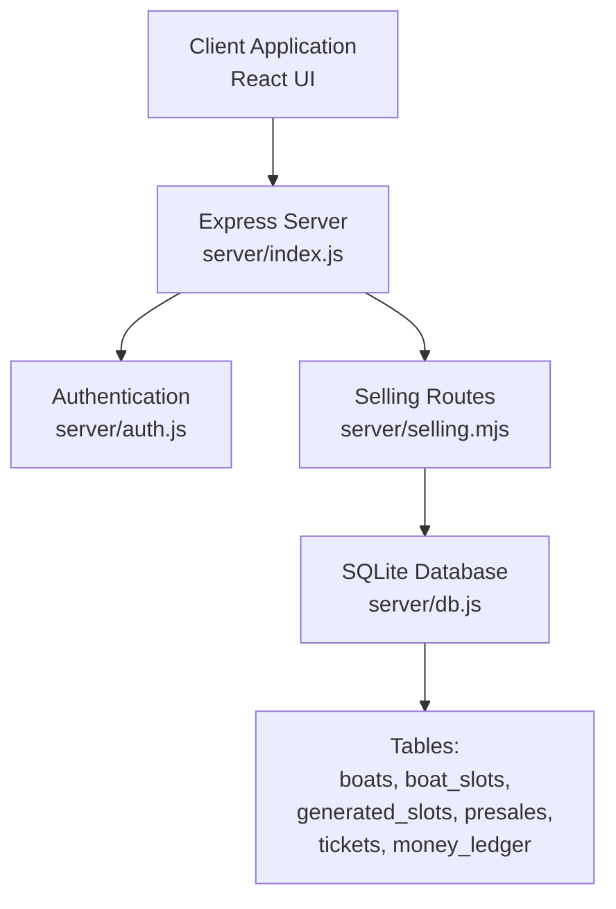
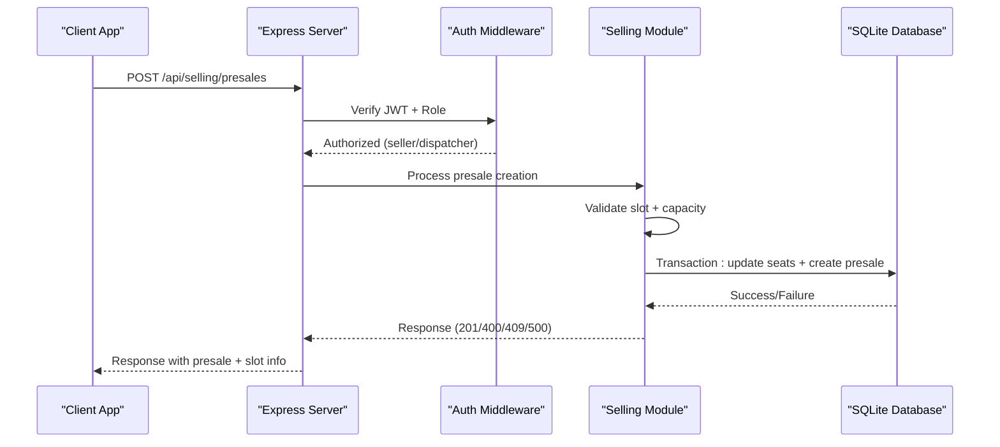
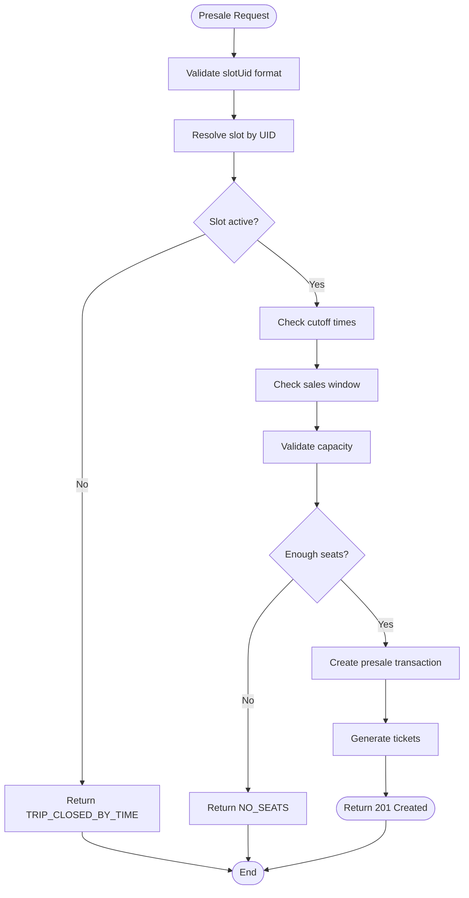
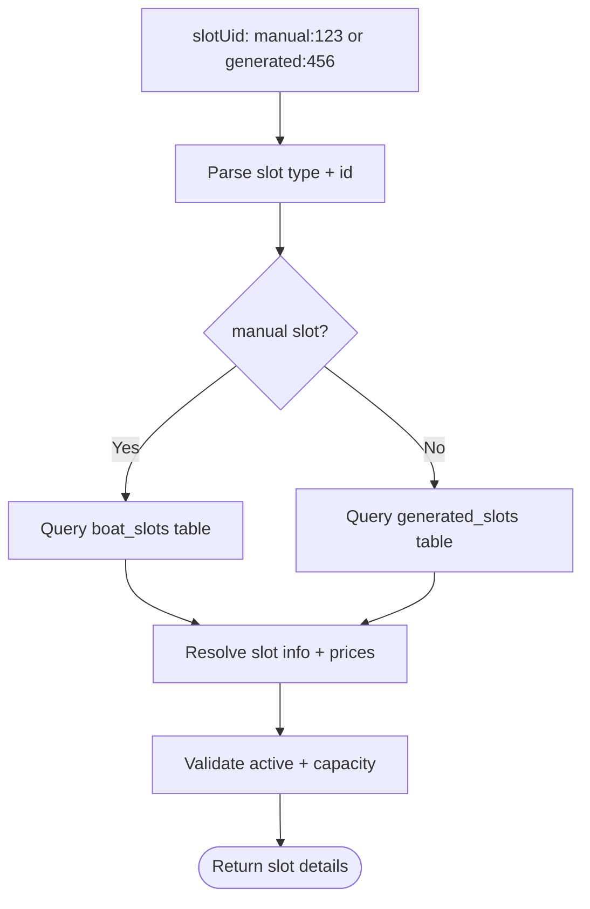
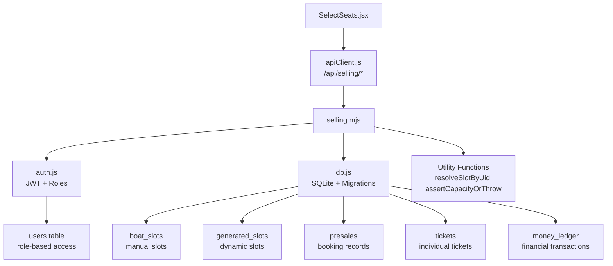

# Ticket Sale Endpoints

<cite>
**Referenced Files in This Document**
- [index.js](file://server/index.js)
- [selling.mjs](file://server/selling.mjs)
- [auth.js](file://server/auth.js)
- [db.js](file://server/db.js)
- [apiClient.js](file://src/utils/apiClient.js)
- [SelectSeats.jsx](file://src/components/seller/SelectSeats.jsx)
</cite>

## Table of Contents
1. [Introduction](#introduction)
2. [Project Structure](#project-structure)
3. [Core Components](#core-components)
4. [Architecture Overview](#architecture-overview)
5. [Detailed Component Analysis](#detailed-component-analysis)
6. [Dependency Analysis](#dependency-analysis)
7. [Performance Considerations](#performance-considerations)
8. [Troubleshooting Guide](#troubleshooting-guide)
9. [Conclusion](#conclusion)

## Introduction
This document provides comprehensive API documentation for ticket sale processing endpoints in the boat ticketing system. It covers seat selection and validation logic, capacity checking, seat availability verification, business rule enforcement, payment processing, seat confirmation, and ticket generation. It also documents the integration with the slot resolution system for both manual and generated slots, including request schemas, response formats, error handling, and practical examples of complete ticket purchase flows.

## Project Structure
The ticket sale system is implemented as a Node.js/Express server with SQLite database storage. The main entry point mounts the selling routes under `/api/selling`. Authentication middleware enforces role-based access control for sellers and dispatchers. The selling module encapsulates all ticket sale workflows, including presale creation, payment acceptance, seat management, and ticket lifecycle operations.



**Diagram sources**
- [index.js](file://server/index.js#L1-L45)
- [selling.mjs](file://server/selling.mjs#L1-L50)
- [auth.js](file://server/auth.js#L1-L75)
- [db.js](file://server/db.js#L1-L120)

**Section sources**
- [index.js](file://server/index.js#L1-L45)
- [selling.mjs](file://server/selling.mjs#L1-L50)
- [auth.js](file://server/auth.js#L1-L75)
- [db.js](file://server/db.js#L1-L120)

## Core Components
- **Authentication Layer**: JWT-based authentication with role-based access control (seller, dispatcher, admin, owner).
- **Selling Module**: Central module implementing all ticket sale endpoints including presale creation, payment processing, seat management, and ticket lifecycle operations.
- **Database Layer**: SQLite with schema migrations supporting manual and generated slots, presales, tickets, and financial ledger.
- **UI Integration**: React components and API client facilitating seat selection, customer information capture, and payment details submission.

Key responsibilities:
- Seat availability validation and capacity enforcement
- Business rule enforcement (sales windows, cutoff times)
- Payment processing and financial ledger updates
- Ticket generation and lifecycle management
- Integration with slot resolution system for manual and generated slots

**Section sources**
- [auth.js](file://server/auth.js#L10-L75)
- [selling.mjs](file://server/selling.mjs#L1-L150)
- [db.js](file://server/db.js#L38-L120)

## Architecture Overview
The system follows a layered architecture with clear separation of concerns:



**Diagram sources**
- [index.js](file://server/index.js#L25-L40)
- [auth.js](file://server/auth.js#L10-L75)
- [selling.mjs](file://server/selling.mjs#L642-L1599)

## Detailed Component Analysis

### Presale Creation Endpoint
The primary endpoint for creating ticket sales is `POST /api/selling/presales`. This endpoint handles seat selection, validation, payment processing, and ticket generation.

#### Request Schema
```javascript
{
  "slotUid": "string",           // Required - manual:123 or generated:456
  "customerName": "string",      // Required - 2+ chars
  "customerPhone": "string",     // Required - 5+ chars
  "numberOfSeats": "integer",    // Alternative to tickets (mutually exclusive)
  "tickets": {                   // Alternative to numberOfSeats (mutually exclusive)
    "adult": "integer",
    "teen": "integer", 
    "child": "integer"
  },
  "prepaymentAmount": "integer", // Optional - default 0
  "prepaymentComment": "string", // Optional
  "trip_date": "string",         // Optional - for generated slots
  "payment_method": "string",    // Optional - CASH/CARD/MIXED
  "cash_amount": "integer",      // Optional - for MIXED
  "card_amount": "integer"       // Optional - for MIXED
}
```

#### Validation Logic
The endpoint performs comprehensive validation:
- **Slot Resolution**: Validates slot UID format and resolves to either manual or generated slot
- **Capacity Checking**: Enforces capacity limits respecting both manual and generated slot systems
- **Business Rules**: Checks sales windows and cutoff times based on user role
- **Ticket Breakdown**: Validates ticket categories (adult/teen/child) per boat type
- **Payment Validation**: Ensures prepayment doesn't exceed total price

#### Seat Selection and Validation Flow


**Diagram sources**
- [selling.mjs](file://server/selling.mjs#L820-L1080)

#### Payment Processing
The endpoint supports three payment modes:
- **Full Payment**: Prepayment equals total price
- **Partial Payment**: Prepayment less than total price (remaining balance tracked)
- **Mixed Payment**: Cash + Card combination for mixed payments

Payment method persistence:
- `payment_method`: CASH, CARD, or MIXED
- `payment_cash_amount` and `payment_card_amount`: Split amounts
- Ledger entries written to `money_ledger` table for shift accounting

#### Response Format
Successful creation returns:
```javascript
{
  "ok": true,
  "presale": {
    "id": "integer",
    "customer_name": "string",
    "customer_phone": "string", 
    "number_of_seats": "integer",
    "total_price": "integer",
    "prepayment_amount": "integer",
    "remaining_amount": "integer",
    "status": "ACTIVE",
    "tickets_json": "string",
    "payment_method": "string",
    "created_at": "timestamp",
    "updated_at": "timestamp"
  },
  "slot": {
    "slot_uid": "string",
    "source_type": "string",
    "trip_date": "string",
    "time": "string", 
    "boat_id": "integer",
    "boat_name": "string",
    "price": "integer",
    "capacity": "integer"
  }
}
```

**Section sources**
- [selling.mjs](file://server/selling.mjs#L642-L1599)

### Payment Acceptance Endpoints
The system provides two complementary endpoints for payment processing:

#### POST /api/selling/presales/:id/accept-payment
Accepts remaining payment for an active presale with full method tracking.

Request schema:
```javascript
{
  "payment_method": "string",  // CASH, CARD, or MIXED
  "cash_amount": "integer",    // Required for MIXED
  "card_amount": "integer"     // Required for MIXED
}
```

Response includes updated presale with payment method persisted.

#### PATCH /api/selling/presales/:id/paid
Legacy endpoint for immediate payment acceptance with simplified method handling.

**Section sources**
- [selling.mjs](file://server/selling.mjs#L2444-L2678)

### Seat Management Operations
The system provides comprehensive seat management through various endpoints:

#### GET /api/selling/boats/:type/slots
Retrieves available slots for a specific boat type (speed, cruise, banana) with seat availability filtering.

#### GET /api/selling/presales/:id/tickets
Retrieves all tickets associated with a presale.

#### GET /api/selling/slots/:slotId/tickets
Retrieves tickets for a specific slot (manual or generated).

#### PATCH /api/selling/presales/:id/seats
Adjusts number of seats in a presale (currently only reduction supported).

**Section sources**
- [selling.mjs](file://server/selling.mjs#L1600-L1644)
- [selling.mjs](file://server/selling.mjs#L3462-L3530)
- [selling.mjs](file://server/selling.mjs#L3021-L3131)

### Ticket Lifecycle Management
Complete ticket lifecycle operations are supported:

#### Mark as Used
- Endpoint: `PATCH /api/selling/tickets/:ticketId/used`
- Purpose: Mark ticket as boarded/attended

#### Refund/Delete Ticket
- Endpoint: `PATCH /api/selling/tickets/:ticketId/refund`
- Endpoint: `PATCH /api/selling/tickets/:ticketId/delete`
- Purpose: Refund or delete individual tickets with seat restoration

#### Transfer Ticket
- Endpoint: `POST/PATCH /api/selling/tickets/:ticketId/transfer`
- Purpose: Transfer single ticket to another slot with price recomputation

**Section sources**
- [selling.mjs](file://server/selling.mjs#L3532-L3685)
- [selling.mjs](file://server/selling.mjs#L3816-L4039)

### Slot Resolution System Integration
The system integrates with both manual and generated slot systems:

#### Manual Slots (boat_slots)
- Fixed time slots with capacity limits
- Direct FK relationship to tickets
- Cutoff times configurable per boat

#### Generated Slots (generated_slots)
- Dynamic slots created from schedule templates
- Trip date and time combination
- Separate capacity tracking from manual slots
- Automatic seat availability calculation

#### Slot Resolution Logic


**Diagram sources**
- [selling.mjs](file://server/selling.mjs#L264-L395)

**Section sources**
- [selling.mjs](file://server/selling.mjs#L264-L395)
- [db.js](file://server/db.js#L688-L726)

## Dependency Analysis
The selling module has several critical dependencies and relationships:



**Diagram sources**
- [selling.mjs](file://server/selling.mjs#L1-L150)
- [auth.js](file://server/auth.js#L1-L75)
- [db.js](file://server/db.js#L38-L120)
- [apiClient.js](file://src/utils/apiClient.js#L166-L257)

**Section sources**
- [selling.mjs](file://server/selling.mjs#L1-L150)
- [auth.js](file://server/auth.js#L1-L75)
- [db.js](file://server/db.js#L38-L120)
- [apiClient.js](file://src/utils/apiClient.js#L1-L360)

## Performance Considerations
- **Seat Availability Caching**: The system maintains `seats_left` cache in both `boat_slots` and `generated_slots` tables to minimize expensive seat counting queries.
- **Transaction Isolation**: All critical operations (seat reservation, presale creation, payment processing) use database transactions to ensure atomicity.
- **Indexing Strategy**: Strategic indexes on frequently queried columns (slot_uid, boat_slot_id, status) improve query performance.
- **Capacity Validation**: Dual-source capacity validation (manual and generated) prevents overselling while maintaining flexibility.

## Troubleshooting Guide

### Common Error Codes and Resolutions

#### Capacity-Related Errors
- **CAPACITY_EXCEEDED**: Generated slot capacity exceeded. Check `seats_left` field in generated_slots table.
- **NO_SEATS**: Not enough seats available in selected slot. Verify slot availability and consider alternative slots.

#### Validation Errors  
- **SLOT_UID_INVALID**: Invalid slot UID format. Ensure proper prefix (manual: or generated:).
- **INVALID_SEAT_COUNT**: Invalid number of seats. Must be positive integer.
- **INVALID_TICKET_BREAKDOWN**: Ticket breakdown validation failed. Check adult/teen/child counts per boat type.

#### Business Rule Violations
- **TRIP_CLOSED_BY_TIME**: Slot is inactive or cutoff time exceeded. Check slot active status and cutoff minutes.
- **SALES_CLOSED**: Sales window closed for current user role. Verify trip time and user permissions.

#### Payment Errors
- **PREPAYMENT_EXCEEDS_TOTAL**: Prepayment amount exceeds total price. Adjust payment amount.
- **INVALID_PAYMENT_SPLIT**: Mixed payment amounts don't match total or are invalid.

### Error Response Format
```javascript
{
  "ok": false,
  "code": "ERROR_CODE",
  "message": "Descriptive error message",
  "details": {
    // Additional context specific to error type
  }
}
```

### Debugging Tips
1. **Enable Debug Logging**: The system logs detailed debug information for seat calculations and slot resolution.
2. **Check Database State**: Use SQLite browser to inspect presales, tickets, and slot tables for consistency.
3. **Verify JWT Token**: Ensure authentication token is valid and user has appropriate role.
4. **Review Slot Configuration**: Check boat_slots and generated_slots tables for proper configuration.

**Section sources**
- [selling.mjs](file://server/selling.mjs#L820-L1080)
- [selling.mjs](file://server/selling.mjs#L1584-L1599)

## Conclusion
The ticket sale processing system provides a robust, validated, and auditable solution for boat ticket sales. Its architecture supports both manual and generated slot systems, comprehensive seat management, flexible payment processing, and complete ticket lifecycle management. The system enforces business rules through multiple validation layers while maintaining performance through caching and transactional integrity. The documented APIs and error handling mechanisms provide clear guidance for integration and troubleshooting.