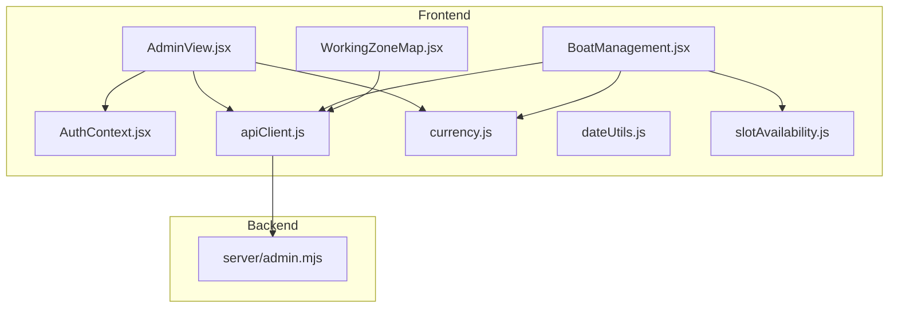
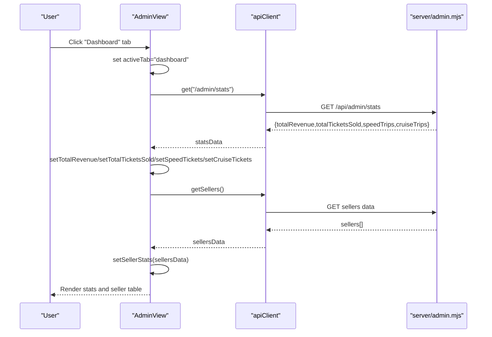
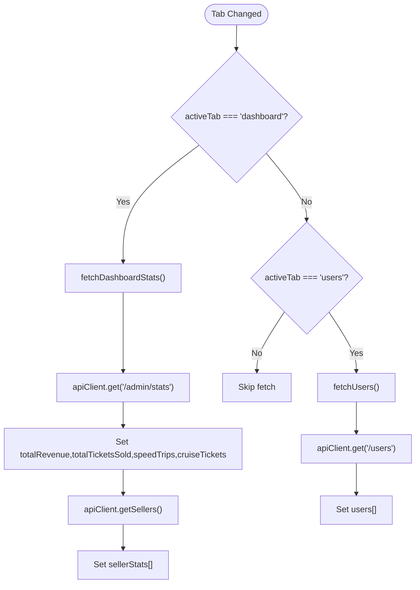
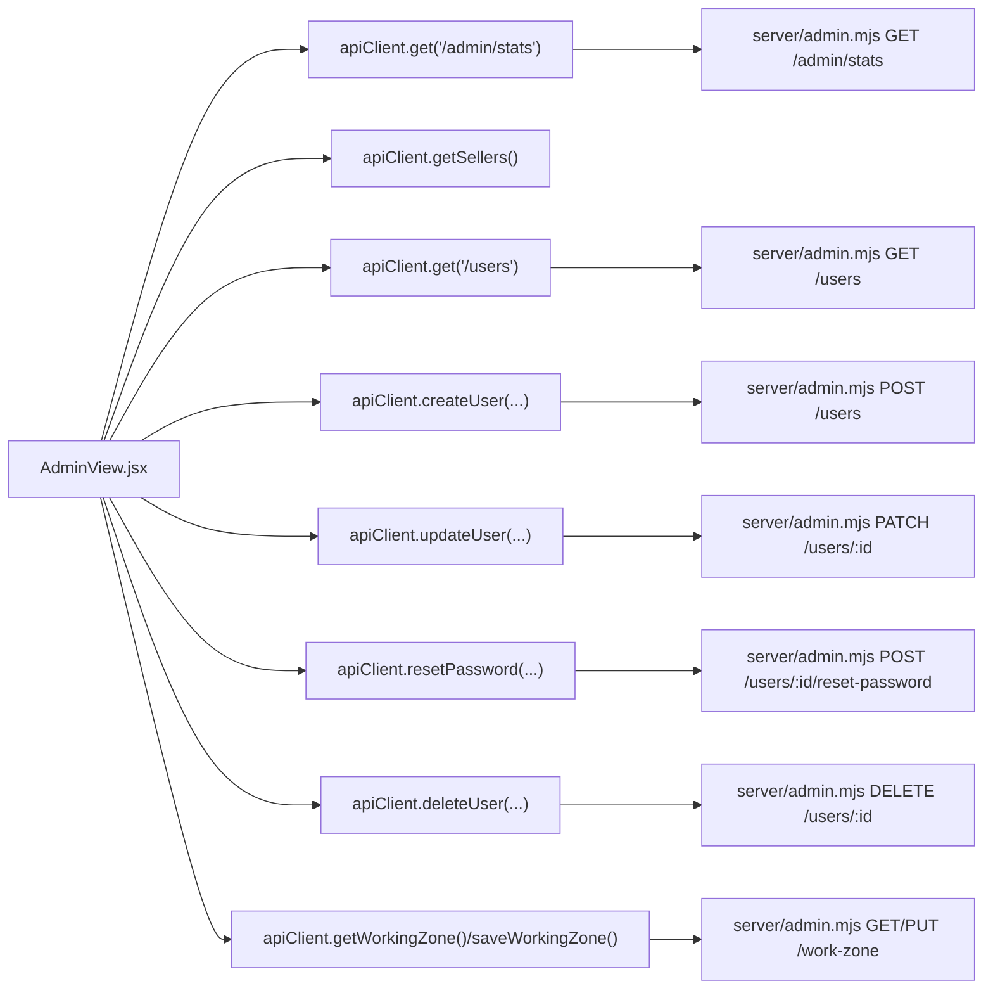
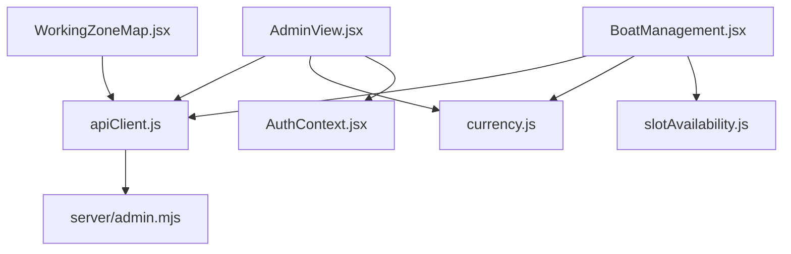

# Admin Dashboard

<cite>
**Referenced Files in This Document**
- [AdminView.jsx](file://src/views/AdminView.jsx)
- [apiClient.js](file://src/utils/apiClient.js)
- [currency.js](file://src/utils/currency.js)
- [admin.mjs](file://server/admin.mjs)
- [BoatManagement.jsx](file://src/components/admin/BoatManagement.jsx)
- [WorkingZoneMap.jsx](file://src/components/admin/WorkingZoneMap.jsx)
- [dateUtils.js](file://src/utils/dateUtils.js)
- [slotAvailability.js](file://src/utils/slotAvailability.js)
- [AuthContext.jsx](file://src/contexts/AuthContext.jsx)
- [bugReporter.js](file://src/utils/bugReporter.js)
</cite>

## Table of Contents
1. [Introduction](#introduction)
2. [Project Structure](#project-structure)
3. [Core Components](#core-components)
4. [Architecture Overview](#architecture-overview)
5. [Detailed Component Analysis](#detailed-component-analysis)
6. [Dependency Analysis](#dependency-analysis)
7. [Performance Considerations](#performance-considerations)
8. [Troubleshooting Guide](#troubleshooting-guide)
9. [Conclusion](#conclusion)

## Introduction
This document describes the admin dashboard functionality, focusing on real-time statistics display, seller performance tracking, tab navigation, data refresh mechanisms, API integration, currency formatting, responsive layout, visualization patterns, loading states, and error handling. It also documents the integration with admin API endpoints and outlines strategies for real-time data updates.

## Project Structure
The admin dashboard is implemented as a single-page view with tabbed navigation and integrates with a shared API client. Supporting utilities provide currency formatting, date normalization, and slot availability helpers. The backend exposes admin endpoints for statistics, user management, and working zone configuration.

**Diagram sources**
- [AdminView.jsx](file://src/views/AdminView.jsx#L1-L382)
- [apiClient.js](file://src/utils/apiClient.js#L1-L360)
- [currency.js](file://src/utils/currency.js#L1-L15)
- [admin.mjs](file://server/admin.mjs#L1-L549)
- [BoatManagement.jsx](file://src/components/admin/BoatManagement.jsx#L1-L784)
- [WorkingZoneMap.jsx](file://src/components/admin/WorkingZoneMap.jsx#L1-L117)
- [dateUtils.js](file://src/utils/dateUtils.js#L1-L74)
- [slotAvailability.js](file://src/utils/slotAvailability.js#L1-L19)
- [AuthContext.jsx](file://src/contexts/AuthContext.jsx#L1-L79)

**Section sources**
- [AdminView.jsx](file://src/views/AdminView.jsx#L1-L382)
- [apiClient.js](file://src/utils/apiClient.js#L1-L360)
- [admin.mjs](file://server/admin.mjs#L1-L549)

## Core Components
- AdminView: Hosts the dashboard tabs, manages loading/error states, and orchestrates data fetching for statistics and seller performance.
- apiClient: Centralized HTTP client with token injection, request/response logging, and convenience methods for admin endpoints.
- currency: Locale-aware currency formatter for rubles.
- admin.mjs: Express routes for admin statistics, user management, and working zone configuration.
- BoatManagement: Tab content for managing boats and slots.
- WorkingZoneMap: Tab content for working zone configuration (placeholder for map integration).
- Utilities: dateUtils for date normalization, slotAvailability for seat availability computation.

**Section sources**
- [AdminView.jsx](file://src/views/AdminView.jsx#L1-L382)
- [apiClient.js](file://src/utils/apiClient.js#L1-L360)
- [currency.js](file://src/utils/currency.js#L1-L15)
- [admin.mjs](file://server/admin.mjs#L418-L472)
- [BoatManagement.jsx](file://src/components/admin/BoatManagement.jsx#L1-L784)
- [WorkingZoneMap.jsx](file://src/components/admin/WorkingZoneMap.jsx#L1-L117)
- [dateUtils.js](file://src/utils/dateUtils.js#L1-L74)
- [slotAvailability.js](file://src/utils/slotAvailability.js#L1-L19)

## Architecture Overview
The admin dashboard follows a reactive pattern:
- On tab activation, AdminView triggers data fetches via apiClient.
- Statistics are fetched from /api/admin/stats; seller performance data comes from apiClient’s seller endpoints.
- Currency formatting is applied consistently using formatRUB.
- Loading and error states are managed locally and surfaced to the UI.

**Diagram sources**
- [AdminView.jsx](file://src/views/AdminView.jsx#L44-L77)
- [apiClient.js](file://src/utils/apiClient.js#L23-L88)
- [admin.mjs](file://server/admin.mjs#L418-L472)

## Detailed Component Analysis

### AdminView: Dashboard, Navigation, and Data Refresh
- Tab Navigation: Four tabs (Dashboard, Boats, Working Zone, Users) switch activeTab and trigger targeted data loads.
- Data Fetching:
  - Dashboard tab triggers fetchDashboardStats which calls apiClient.get('/admin/stats') and apiClient.getSellers().
  - Users tab triggers fetchUsers which calls apiClient.get('/users').
- Real-time Statistics:
  - Total revenue, total tickets sold, and speed vs cruise trip counts are stored in state and rendered with formatRUB.
- Seller Performance Tracking:
  - Seller table displays name, sold amount, commission, and total to pay; values are formatted with formatRUB.
- Loading and Error States:
  - Loading flags are toggled during requests; errors are captured and displayed.
- Authentication Guard:
  - Uses AuthContext to redirect unauthenticated users to login.

**Diagram sources**
- [AdminView.jsx](file://src/views/AdminView.jsx#L26-L105)

**Section sources**
- [AdminView.jsx](file://src/views/AdminView.jsx#L26-L105)
- [currency.js](file://src/utils/currency.js#L6-L15)
- [AuthContext.jsx](file://src/contexts/AuthContext.jsx#L19-L79)

### API Integration and Endpoints
- Admin Statistics Endpoint:
  - GET /api/admin/stats returns totalRevenue, totalTicketsSold, speedTrips, cruiseTrips.
- Seller Data:
  - AdminView calls apiClient.getSellers() to populate the seller table.
- User Management:
  - GET /users, POST /users, PATCH /users/:id, POST /users/:id/reset-password, DELETE /users/:id.
- Working Zone:
  - GET /api/admin/work-zone and PUT /api/admin/settings/working-zone for configuration.

**Diagram sources**
- [AdminView.jsx](file://src/views/AdminView.jsx#L50-L159)
- [apiClient.js](file://src/utils/apiClient.js#L23-L88)
- [admin.mjs](file://server/admin.mjs#L266-L415)

**Section sources**
- [admin.mjs](file://server/admin.mjs#L418-L472)
- [admin.mjs](file://server/admin.mjs#L266-L415)
- [apiClient.js](file://src/utils/apiClient.js#L23-L88)

### Currency Formatting and Responsive Layout
- Currency Formatting:
  - formatRUB applies locale-specific formatting for Russian Rubles with no decimals.
- Responsive Layout:
  - Grid and table layouts adapt to small screens; loading placeholders and compact cards improve UX.

**Section sources**
- [currency.js](file://src/utils/currency.js#L6-L15)
- [AdminView.jsx](file://src/views/AdminView.jsx#L215-L262)

### Seller Performance Tracking Details
- Metrics Displayed:
  - Sold amount (₽), Commission (₽), and Total to Pay (₽) per seller.
- Calculation Notes:
  - Commission is derived from the backend seller data; AdminView renders formatted values.
- Data Source:
  - apiClient.getSellers() supplies the seller list.

**Section sources**
- [AdminView.jsx](file://src/views/AdminView.jsx#L235-L261)
- [AdminView.jsx](file://src/views/AdminView.jsx#L62-L63)

### Dashboard Tab Navigation and Data Refresh Mechanisms
- Navigation:
  - Tab buttons set activeTab and conditionally trigger data fetches.
- Refresh:
  - On tab change, AdminView re-fetches data to reflect current view.
- Loading States:
  - Per-tab loading flags prevent concurrent conflicting requests and provide feedback.
- Error Handling:
  - Errors are caught, displayed, and state defaults are applied to avoid crashes.

**Section sources**
- [AdminView.jsx](file://src/views/AdminView.jsx#L180-L207)
- [AdminView.jsx](file://src/views/AdminView.jsx#L44-L77)
- [AdminView.jsx](file://src/views/AdminView.jsx#L80-L105)

### Boat Management Integration
- Boat and Slot Management:
  - BoatManagement integrates with apiClient to manage boats and slots, including pricing overrides per slot.
- Availability Helpers:
  - slotAvailability computes available seats for display.

**Section sources**
- [BoatManagement.jsx](file://src/components/admin/BoatManagement.jsx#L52-L74)
- [BoatManagement.jsx](file://src/components/admin/BoatManagement.jsx#L213-L248)
- [slotAvailability.js](file://src/utils/slotAvailability.js#L7-L10)

### Working Zone Configuration
- Placeholder Implementation:
  - WorkingZoneMap initializes editing mode and persists polygon data via apiClient.
- Backend Endpoints:
  - GET and PUT endpoints for working zone configuration.

**Section sources**
- [WorkingZoneMap.jsx](file://src/components/admin/WorkingZoneMap.jsx#L10-L45)
- [admin.mjs](file://server/admin.mjs#L474-L547)

## Dependency Analysis
- Frontend Dependencies:
  - AdminView depends on apiClient, currency, AuthContext, and child components.
  - BoatManagement depends on apiClient, currency, and slotAvailability.
  - WorkingZoneMap depends on apiClient.
- Backend Dependencies:
  - admin.mjs routes depend on the database layer and authentication middleware.

**Diagram sources**
- [AdminView.jsx](file://src/views/AdminView.jsx#L1-L10)
- [BoatManagement.jsx](file://src/components/admin/BoatManagement.jsx#L1-L6)
- [WorkingZoneMap.jsx](file://src/components/admin/WorkingZoneMap.jsx#L1-L3)
- [apiClient.js](file://src/utils/apiClient.js#L1-L10)
- [admin.mjs](file://server/admin.mjs#L1-L10)

**Section sources**
- [AdminView.jsx](file://src/views/AdminView.jsx#L1-L10)
- [BoatManagement.jsx](file://src/components/admin/BoatManagement.jsx#L1-L6)
- [WorkingZoneMap.jsx](file://src/components/admin/WorkingZoneMap.jsx#L1-L3)
- [apiClient.js](file://src/utils/apiClient.js#L1-L10)
- [admin.mjs](file://server/admin.mjs#L1-L10)

## Performance Considerations
- Minimize Repeated Fetches:
  - Use activeTab guards to avoid redundant stats fetches when switching tabs.
- Efficient Rendering:
  - Keep seller tables virtualized or paginated for large datasets.
- Debounce User Actions:
  - Debounce search/filter inputs in user management to reduce API churn.
- Network Logging:
  - Utilize addNetworkLog to monitor request durations and failures for optimization.

[No sources needed since this section provides general guidance]

## Troubleshooting Guide
- Authentication Failures:
  - AuthContext redirects unauthenticated users to login; ensure tokens are persisted and valid.
- API Errors:
  - apiClient.request captures HTTP errors and logs them; inspect network logs for status codes and messages.
- UI Errors:
  - AdminView displays error messages and sets defaults to prevent crashes; verify error boundaries and fallbacks.
- Network Diagnostics:
  - Use addNetworkLog to capture request/response metadata and exceptions.

**Section sources**
- [AuthContext.jsx](file://src/contexts/AuthContext.jsx#L19-L79)
- [apiClient.js](file://src/utils/apiClient.js#L23-L88)
- [AdminView.jsx](file://src/views/AdminView.jsx#L65-L77)
- [bugReporter.js](file://src/utils/bugReporter.js#L8-L13)

## Conclusion
The admin dashboard provides a responsive, tabbed interface for real-time statistics and seller performance tracking. It integrates with dedicated admin endpoints, applies consistent currency formatting, and manages loading and error states effectively. The architecture supports future enhancements such as periodic polling for live updates and expanded visualization components.