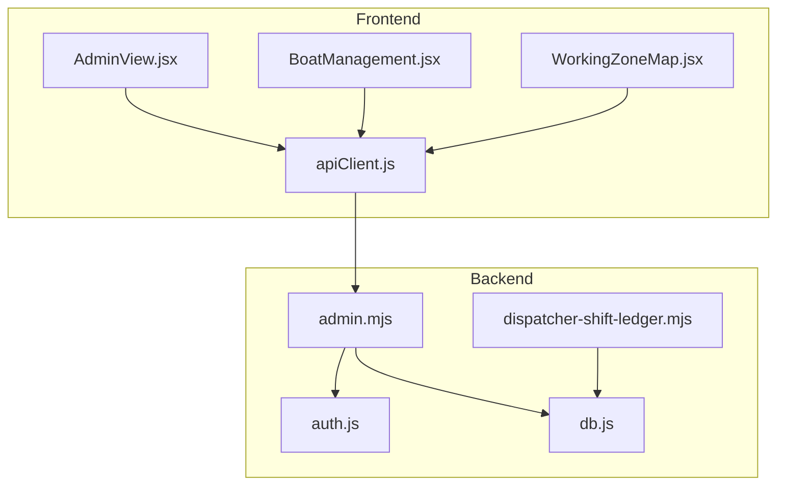
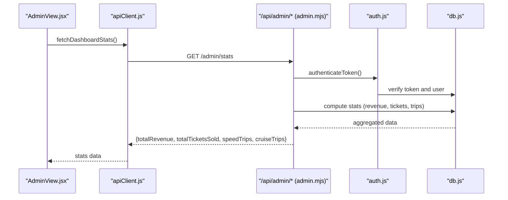
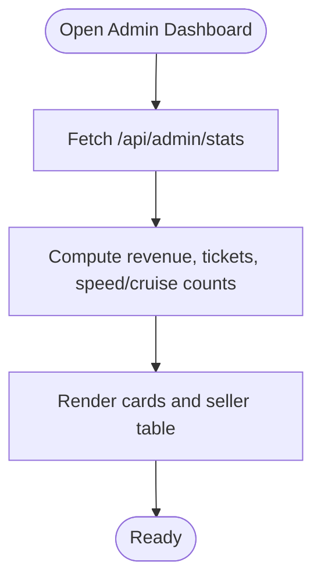
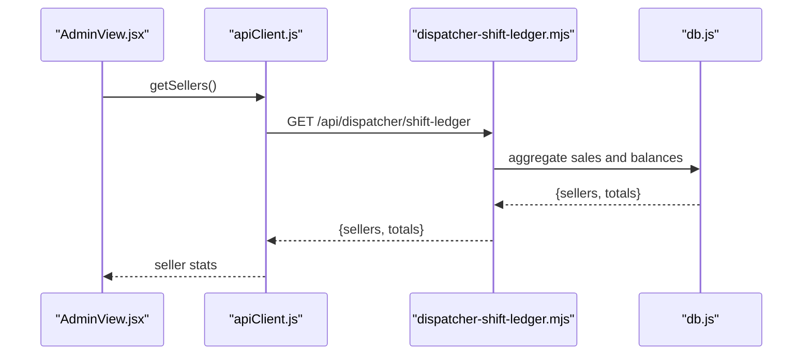
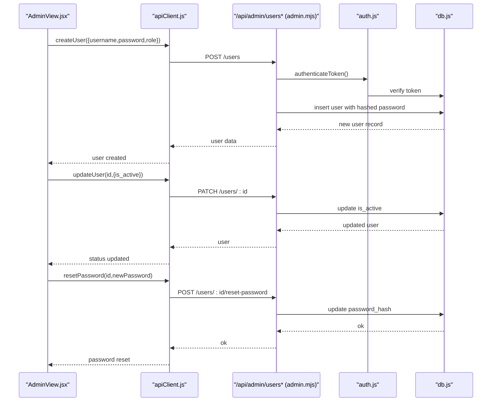
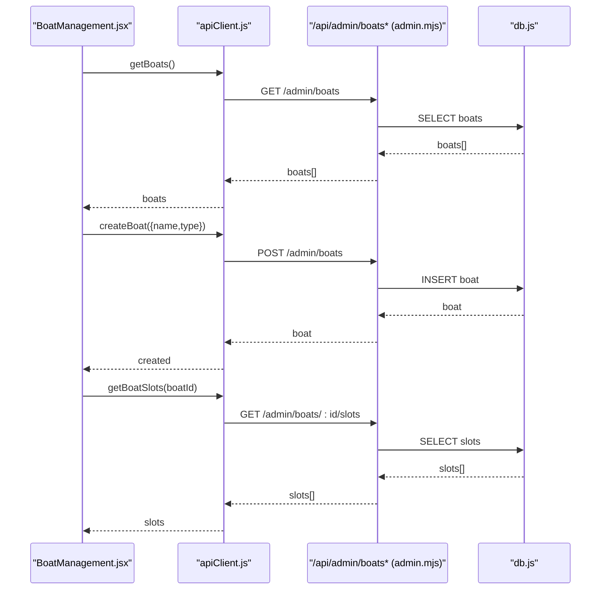
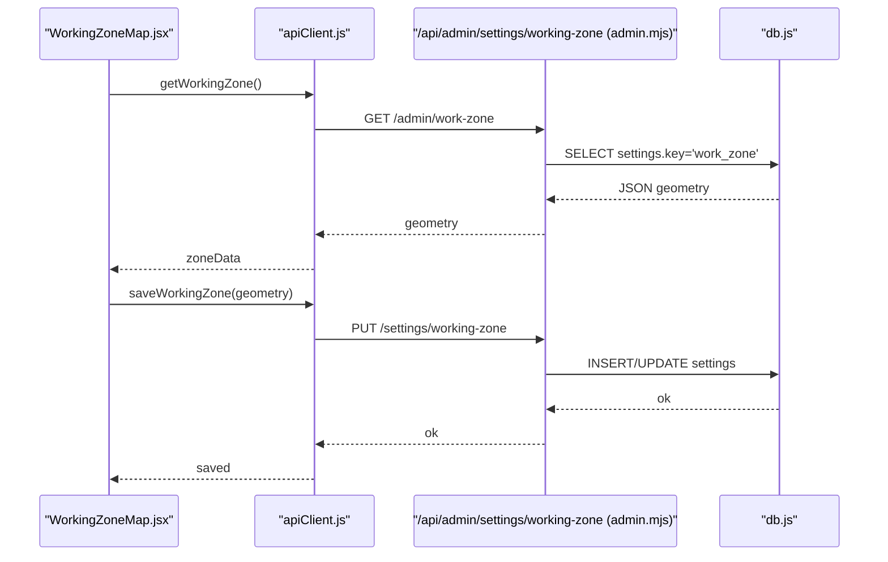
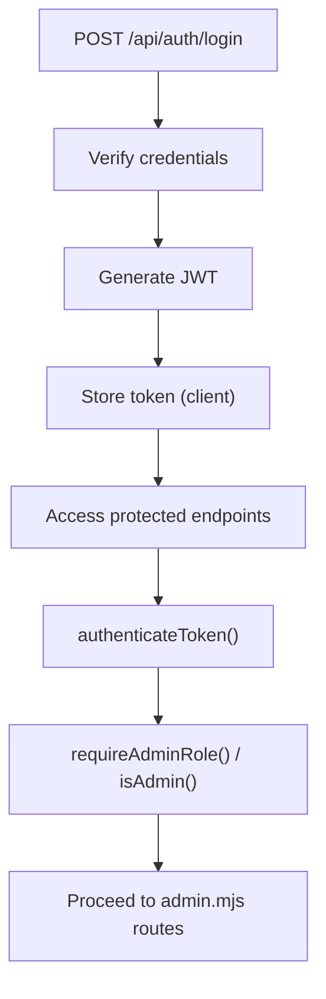
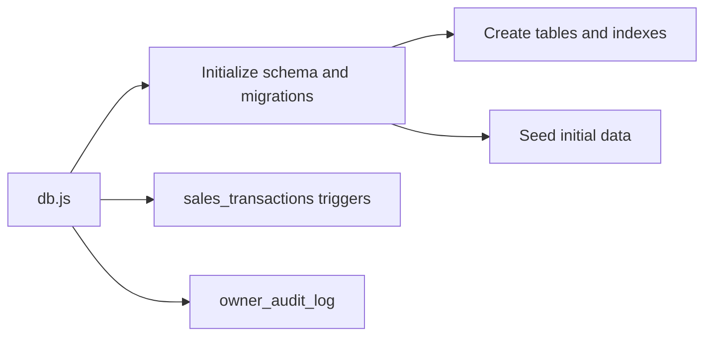
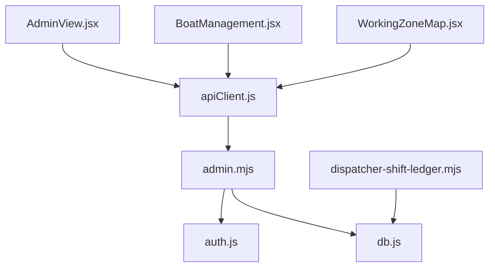

# Admin Portal

<cite>
**Referenced Files in This Document**
- [AdminView.jsx](file://src/views/AdminView.jsx)
- [BoatManagement.jsx](file://src/components/admin/BoatManagement.jsx)
- [WorkingZoneMap.jsx](file://src/components/admin/WorkingZoneMap.jsx)
- [apiClient.js](file://src/utils/apiClient.js)
- [admin.mjs](file://server/admin.mjs)
- [auth.js](file://server/auth.js)
- [db.js](file://server/db.js)
- [dispatcher-shift-ledger.mjs](file://server/dispatcher-shift-ledger.mjs)
</cite>

## Table of Contents
1. [Introduction](#introduction)
2. [Project Structure](#project-structure)
3. [Core Components](#core-components)
4. [Architecture Overview](#architecture-overview)
5. [Detailed Component Analysis](#detailed-component-analysis)
6. [Dependency Analysis](#dependency-analysis)
7. [Performance Considerations](#performance-considerations)
8. [Troubleshooting Guide](#troubleshooting-guide)
9. [Conclusion](#conclusion)

## Introduction
This document describes the Admin Portal functionality for managing administrative operations and system management. It covers:
- Dashboard statistics: total revenue, tickets sold, and speed/cruise sales comparison
- Seller performance tracking: sales amounts, commission calculations, and payment summaries
- User management: creation, role assignment, enabling/disabling accounts, and password resets
- Boat management: adding, updating, and configuring vessel information
- Working zone management and map integration for operational areas
- Administrative workflows, permission enforcement, and system configuration
- Security considerations, maintenance procedures, and reporting/export capabilities

## Project Structure
The Admin Portal spans React frontend components and Express backend routes:
- Frontend: AdminView, BoatManagement, WorkingZoneMap, and apiClient
- Backend: admin routes, authentication middleware, and database initialization

**Diagram sources**
- [AdminView.jsx](file://src/views/AdminView.jsx#L1-L382)
- [BoatManagement.jsx](file://src/components/admin/BoatManagement.jsx#L1-L784)
- [WorkingZoneMap.jsx](file://src/components/admin/WorkingZoneMap.jsx#L1-L117)
- [apiClient.js](file://src/utils/apiClient.js#L1-L360)
- [admin.mjs](file://server/admin.mjs#L1-L549)
- [auth.js](file://server/auth.js#L1-L154)
- [db.js](file://server/db.js#L1-L1269)
- [dispatcher-shift-ledger.mjs](file://server/dispatcher-shift-ledger.mjs#L263-L303)

**Section sources**
- [AdminView.jsx](file://src/views/AdminView.jsx#L1-L382)
- [BoatManagement.jsx](file://src/components/admin/BoatManagement.jsx#L1-L784)
- [WorkingZoneMap.jsx](file://src/components/admin/WorkingZoneMap.jsx#L1-L117)
- [apiClient.js](file://src/utils/apiClient.js#L1-L360)
- [admin.mjs](file://server/admin.mjs#L1-L549)
- [auth.js](file://server/auth.js#L1-L154)
- [db.js](file://server/db.js#L1-L1269)

## Core Components
- AdminView: Hosts dashboard, user management, and navigation tabs; fetches stats and manages users
- BoatManagement: Manages boats and their slots; supports CRUD operations and batch actions
- WorkingZoneMap: Placeholder for map-based working zone configuration with save/load
- apiClient: Centralized HTTP client with token handling and network logging
- admin routes: Boat and user management, stats, and working zone endpoints
- auth middleware: Token verification and role checks
- db initialization: Schema migrations, seeding, and canonical sales transaction layer

**Section sources**
- [AdminView.jsx](file://src/views/AdminView.jsx#L1-L382)
- [BoatManagement.jsx](file://src/components/admin/BoatManagement.jsx#L1-L784)
- [WorkingZoneMap.jsx](file://src/components/admin/WorkingZoneMap.jsx#L1-L117)
- [apiClient.js](file://src/utils/apiClient.js#L1-L360)
- [admin.mjs](file://server/admin.mjs#L1-L549)
- [auth.js](file://server/auth.js#L1-L154)
- [db.js](file://server/db.js#L1-L1269)

## Architecture Overview
The Admin Portal enforces role-based access and delegates administrative tasks to backend endpoints. The frontend communicates via apiClient, which attaches JWT tokens and logs requests.

**Diagram sources**
- [AdminView.jsx](file://src/views/AdminView.jsx#L50-L77)
- [apiClient.js](file://src/utils/apiClient.js#L23-L88)
- [admin.mjs](file://server/admin.mjs#L418-L472)
- [auth.js](file://server/auth.js#L10-L40)
- [db.js](file://server/db.js#L1-L1269)

## Detailed Component Analysis

### Dashboard Statistics
The dashboard displays:
- Today’s revenue
- Total tickets sold
- Speed vs cruise trip counts
- Seller performance table with sales, commission, and payable amounts

**Diagram sources**
- [AdminView.jsx](file://src/views/AdminView.jsx#L44-L77)
- [admin.mjs](file://server/admin.mjs#L418-L472)

**Section sources**
- [AdminView.jsx](file://src/views/AdminView.jsx#L215-L262)
- [admin.mjs](file://server/admin.mjs#L418-L472)

### Seller Performance Tracking
Seller performance is computed from backend sales data and displayed as:
- Sales amount (₽)
- Commission (₽)
- Amount to pay (₽)

**Diagram sources**
- [AdminView.jsx](file://src/views/AdminView.jsx#L62-L63)
- [dispatcher-shift-ledger.mjs](file://server/dispatcher-shift-ledger.mjs#L263-L303)
- [db.js](file://server/db.js#L1-L1269)

**Section sources**
- [AdminView.jsx](file://src/views/AdminView.jsx#L235-L261)
- [dispatcher-shift-ledger.mjs](file://server/dispatcher-shift-ledger.mjs#L263-L303)

### User Management
Admins can:
- Create users with role and password
- Enable/disable users
- Reset passwords
- Delete users (soft-delete by deactivating)

**Diagram sources**
- [AdminView.jsx](file://src/views/AdminView.jsx#L107-L159)
- [apiClient.js](file://src/utils/apiClient.js#L1-L360)
- [admin.mjs](file://server/admin.mjs#L290-L415)
- [auth.js](file://server/auth.js#L10-L40)
- [db.js](file://server/db.js#L1-L1269)

**Section sources**
- [AdminView.jsx](file://src/views/AdminView.jsx#L79-L159)
- [admin.mjs](file://server/admin.mjs#L266-L415)

### Boat Management
Admins can manage boats and their slots:
- Add/update/delete boats
- Toggle active status
- Create/update/delete slots
- View and manage schedules per boat
- Archive boats with dependencies

**Diagram sources**
- [BoatManagement.jsx](file://src/components/admin/BoatManagement.jsx#L52-L74)
- [apiClient.js](file://src/utils/apiClient.js#L1-L360)
- [admin.mjs](file://server/admin.mjs#L17-L216)
- [db.js](file://server/db.js#L1-L1269)

**Section sources**
- [BoatManagement.jsx](file://src/components/admin/BoatManagement.jsx#L36-L211)
- [admin.mjs](file://server/admin.mjs#L17-L216)

### Working Zone Management and Map Integration
Admins configure operational areas via a working zone setting persisted in the database. The UI provides a placeholder map area for editing polygons.

**Diagram sources**
- [WorkingZoneMap.jsx](file://src/components/admin/WorkingZoneMap.jsx#L24-L45)
- [apiClient.js](file://src/utils/apiClient.js#L1-L360)
- [admin.mjs](file://server/admin.mjs#L474-L547)
- [db.js](file://server/db.js#L1-L1269)

**Section sources**
- [WorkingZoneMap.jsx](file://src/components/admin/WorkingZoneMap.jsx#L1-L117)
- [admin.mjs](file://server/admin.mjs#L474-L547)

### Administrative Workflows and Permission Enforcement
- Authentication: JWT verification middleware ensures valid sessions
- Authorization: requireAdminRole restricts endpoints to admin/owner
- Role checks: canOwnerOrAdmin, canOwnerAccess, canDispatchManageSlots, isAdmin
- Token lifecycle: login generates JWT; logout clears token

**Diagram sources**
- [auth.js](file://server/auth.js#L10-L75)
- [admin.mjs](file://server/admin.mjs#L7-L15)
- [auth.js](file://server/auth.js#L42-L71)

**Section sources**
- [auth.js](file://server/auth.js#L1-L154)
- [admin.mjs](file://server/admin.mjs#L7-L15)

### System Configuration and Maintenance
- Database initialization and migrations: schema creation, column additions, indexes, and seeding
- Canonical sales transactions: append-only ledger with triggers to synchronize with tickets
- Owner audit log: append-only audit trail for owner actions

**Diagram sources**
- [db.js](file://server/db.js#L39-L1269)

**Section sources**
- [db.js](file://server/db.js#L39-L1269)

## Dependency Analysis
Administrative operations depend on:
- Authentication middleware for session validation
- Role-based authorization for sensitive endpoints
- Database for persistent storage and computed aggregates
- API client for standardized HTTP communication

**Diagram sources**
- [AdminView.jsx](file://src/views/AdminView.jsx#L1-L382)
- [BoatManagement.jsx](file://src/components/admin/BoatManagement.jsx#L1-L784)
- [WorkingZoneMap.jsx](file://src/components/admin/WorkingZoneMap.jsx#L1-L117)
- [apiClient.js](file://src/utils/apiClient.js#L1-L360)
- [admin.mjs](file://server/admin.mjs#L1-L549)
- [auth.js](file://server/auth.js#L1-L154)
- [db.js](file://server/db.js#L1-L1269)
- [dispatcher-shift-ledger.mjs](file://server/dispatcher-shift-ledger.mjs#L263-L303)

**Section sources**
- [AdminView.jsx](file://src/views/AdminView.jsx#L1-L382)
- [BoatManagement.jsx](file://src/components/admin/BoatManagement.jsx#L1-L784)
- [WorkingZoneMap.jsx](file://src/components/admin/WorkingZoneMap.jsx#L1-L117)
- [apiClient.js](file://src/utils/apiClient.js#L1-L360)
- [admin.mjs](file://server/admin.mjs#L1-L549)
- [auth.js](file://server/auth.js#L1-L154)
- [db.js](file://server/db.js#L1-L1269)
- [dispatcher-shift-ledger.mjs](file://server/dispatcher-shift-ledger.mjs#L263-L303)

## Performance Considerations
- Use pagination and filtering for large datasets (users, boats, slots)
- Batch operations for bulk updates (e.g., toggle multiple slots)
- Debounce frequent UI actions (e.g., search/filter)
- Indexes on frequently queried columns (e.g., business_day, status)
- Minimize redundant fetches by caching data where appropriate

## Troubleshooting Guide
Common issues and resolutions:
- Authentication failures: verify JWT presence and expiration; ensure login succeeds
- Authorization errors: confirm user role is admin or owner; check requireAdminRole middleware
- Boat deletion conflicts: soft-archive when dependencies exist; hard-delete only when safe
- Password reset validation: ensure new password meets length requirements
- Network errors: inspect apiClient logs for request/response details

**Section sources**
- [auth.js](file://server/auth.js#L10-L40)
- [admin.mjs](file://server/admin.mjs#L141-L180)
- [admin.mjs](file://server/admin.mjs#L355-L387)
- [apiClient.js](file://src/utils/apiClient.js#L23-L88)

## Conclusion
The Admin Portal provides a comprehensive interface for system administration, including dashboard analytics, user and boat management, and operational configuration. Robust authentication and authorization ensure secure access, while backend migrations and canonical sales transactions support reliable operations and future reporting integrations.