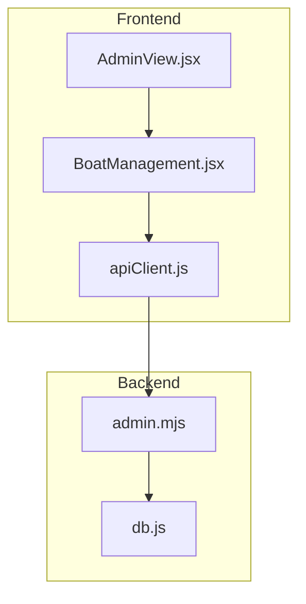
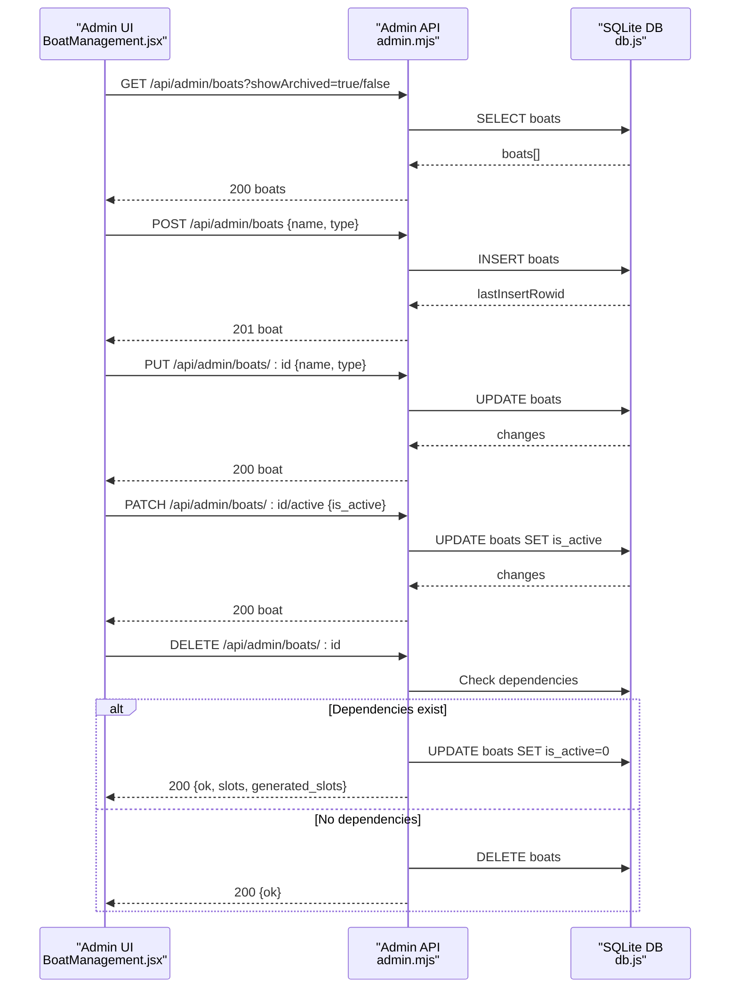
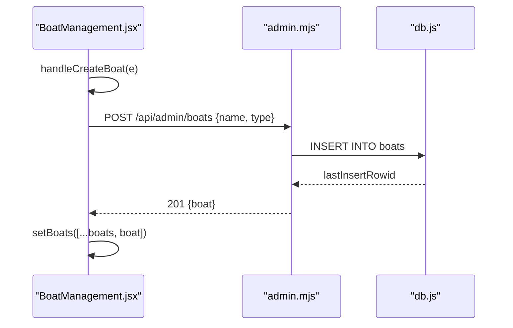
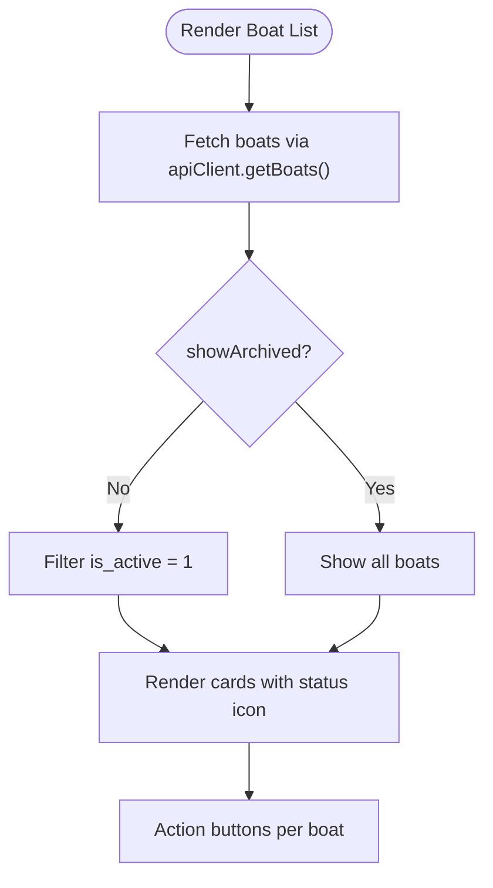
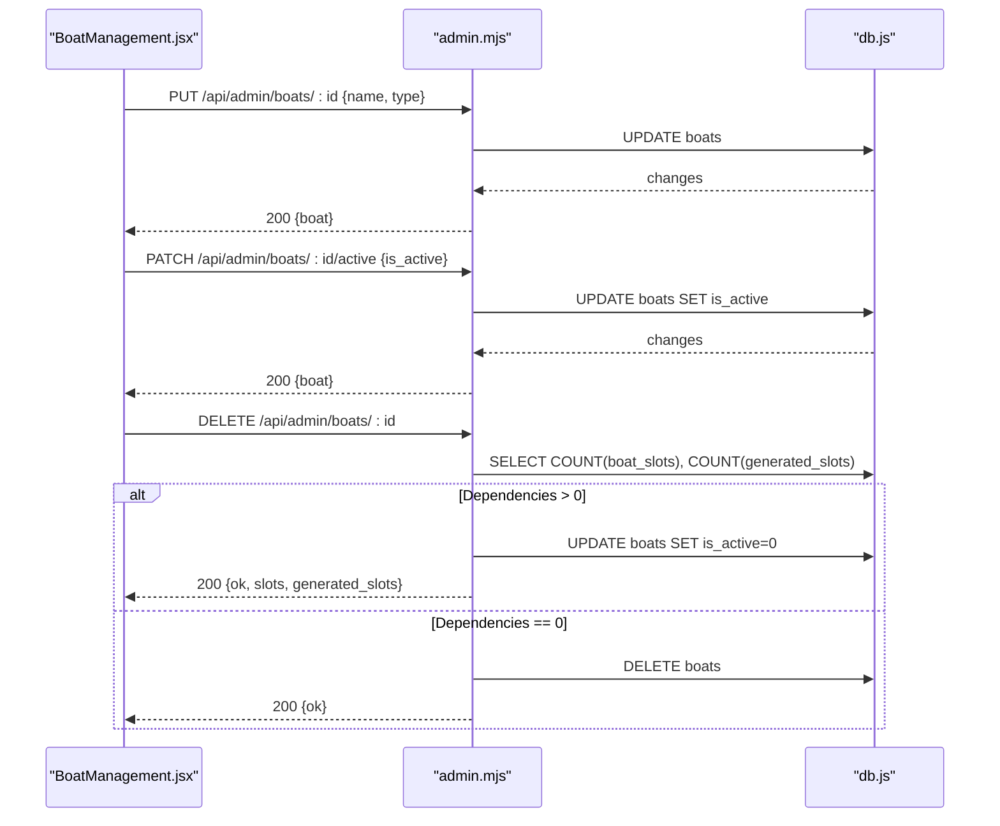
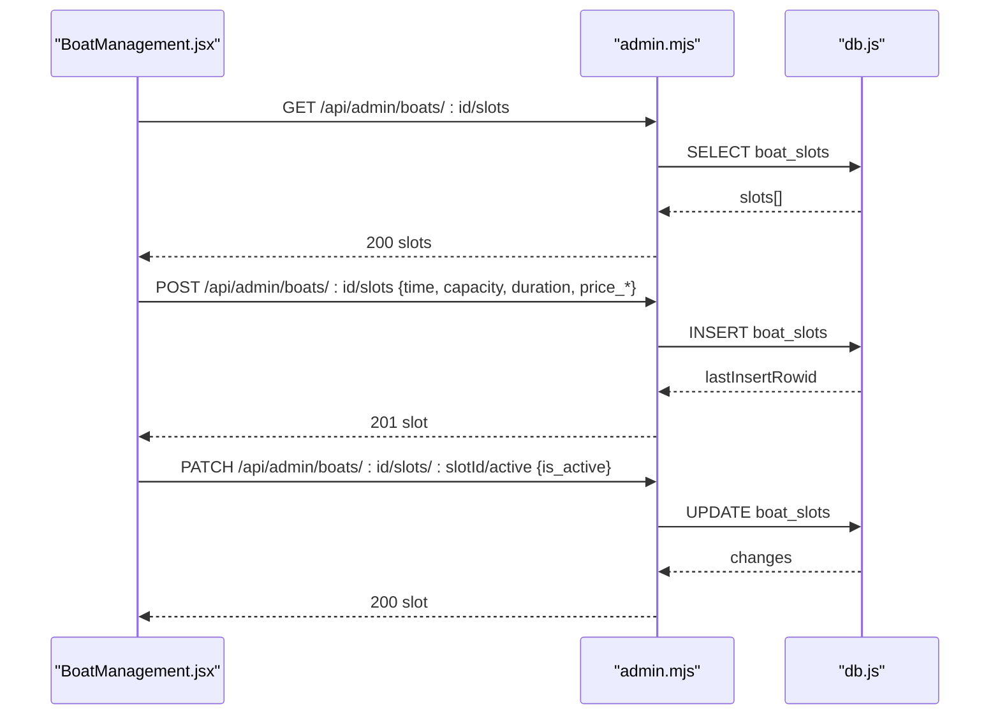
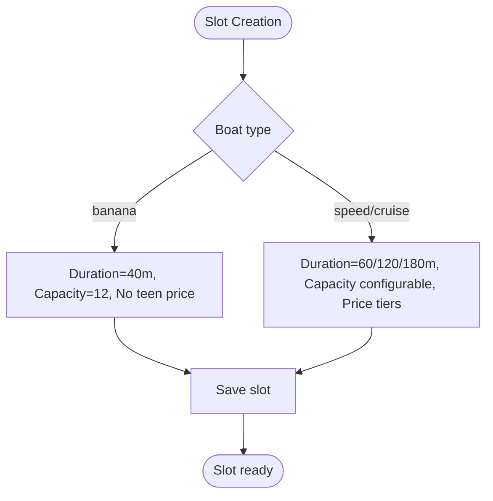
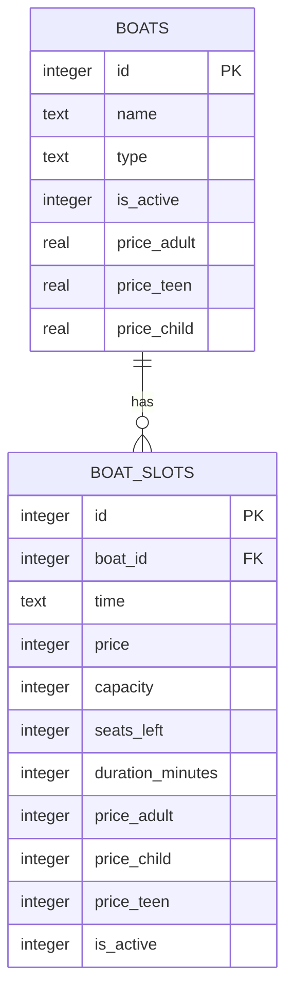
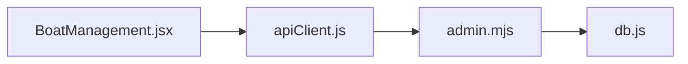

# Boat Management

<cite>
**Referenced Files in This Document**
- [BoatManagement.jsx](file://src/components/admin/BoatManagement.jsx)
- [AdminView.jsx](file://src/views/AdminView.jsx)
- [apiClient.js](file://src/utils/apiClient.js)
- [admin.mjs](file://server/admin.mjs)
- [db.js](file://server/db.js)
- [OwnerBoatsView.jsx](file://src/views/OwnerBoatsView.jsx)
- [README.md](file://README.md)
</cite>

## Table of Contents
1. [Introduction](#introduction)
2. [Project Structure](#project-structure)
3. [Core Components](#core-components)
4. [Architecture Overview](#architecture-overview)
5. [Detailed Component Analysis](#detailed-component-analysis)
6. [Dependency Analysis](#dependency-analysis)
7. [Performance Considerations](#performance-considerations)
8. [Troubleshooting Guide](#troubleshooting-guide)
9. [Conclusion](#conclusion)
10. [Appendices](#appendices)

## Introduction
This document describes the boat management functionality in the system, focusing on the administrative interface for registering, listing, modifying, and configuring operational status of vessels. It explains the end-to-end workflows for creating and updating boats, managing their schedules (slots), and archiving/deleting boats with dependency-aware soft deletion. It also documents the integration with the admin API, database schema, and best practices for capacity planning and operational constraints.

## Project Structure
The boat management feature spans the frontend admin view and the backend admin API routes. The frontend component renders a compact card-based list of boats, supports creation, updates, activation toggling, and per-boat schedule management. The backend exposes admin-only endpoints for CRUD operations on boats and slots, with validation and soft deletion semantics.

**Diagram sources**
- [AdminView.jsx](file://src/views/AdminView.jsx#L263-L265)
- [BoatManagement.jsx](file://src/components/admin/BoatManagement.jsx#L14-L38)
- [apiClient.js](file://src/utils/apiClient.js#L117-L119)
- [admin.mjs](file://server/admin.mjs#L17-L40)
- [db.js](file://server/db.js#L55-L66)

**Section sources**
- [README.md](file://README.md#L56-L65)
- [AdminView.jsx](file://src/views/AdminView.jsx#L263-L265)
- [BoatManagement.jsx](file://src/components/admin/BoatManagement.jsx#L14-L38)

## Core Components
- AdminView: Hosts the admin tabs and renders the BoatManagement component under the “Boats” tab.
- BoatManagement: Implements the boat listing, creation, editing, activation toggle, and per-boat schedule management UI and logic.
- apiClient: Provides typed HTTP helpers for admin endpoints (boats, slots).
- admin.mjs: Backend routes for boat CRUD, activation toggling, and slot management.
- db.js: Database initialization and schema migrations, including tables for boats and boat_slots.

Key responsibilities:
- Boat registration: Create new boats with name and type, validate type against allowed values.
- Listing: Display active or archived boats with status indicators and action buttons.
- Modification: Update boat name and type; toggle active status; delete boats with soft/hard deletion.
- Scheduling: Create and manage per-boat slots with capacity, duration, and pricing tiers.

**Section sources**
- [AdminView.jsx](file://src/views/AdminView.jsx#L263-L265)
- [BoatManagement.jsx](file://src/components/admin/BoatManagement.jsx#L14-L38)
- [apiClient.js](file://src/utils/apiClient.js#L117-L119)
- [admin.mjs](file://server/admin.mjs#L17-L40)
- [db.js](file://server/db.js#L55-L66)

## Architecture Overview
The admin UI communicates with the backend via the admin API. The backend enforces role-based access and validates inputs before interacting with the SQLite database.

**Diagram sources**
- [BoatManagement.jsx](file://src/components/admin/BoatManagement.jsx#L52-L63)
- [admin.mjs](file://server/admin.mjs#L17-L40)
- [admin.mjs](file://server/admin.mjs#L59-L83)
- [admin.mjs](file://server/admin.mjs#L85-L114)
- [admin.mjs](file://server/admin.mjs#L116-L139)
- [admin.mjs](file://server/admin.mjs#L141-L180)

## Detailed Component Analysis

### Boat Registration Workflow
- Input fields: name (required), type (one of speed, cruise, banana).
- Validation: type must be one of the allowed values; name must be present.
- Persistence: POST to admin API creates a new boat record with is_active=1.
- UI feedback: On success, the new boat appears in the list; on error, a user-visible message is shown.

**Diagram sources**
- [BoatManagement.jsx](file://src/components/admin/BoatManagement.jsx#L76-L101)
- [admin.mjs](file://server/admin.mjs#L59-L83)

**Section sources**
- [BoatManagement.jsx](file://src/components/admin/BoatManagement.jsx#L76-L101)
- [admin.mjs](file://server/admin.mjs#L59-L83)

### Boat Listing Interface
- Fetches boats from the admin API with optional showArchived filter.
- Renders a grid of cards with name, type, and status indicator.
- Supports toggling visibility of archived boats.
- Each card includes action buttons: edit, schedule, activate/deactivate, delete.

**Diagram sources**
- [BoatManagement.jsx](file://src/components/admin/BoatManagement.jsx#L36-L63)
- [BoatManagement.jsx](file://src/components/admin/BoatManagement.jsx#L359-L431)

**Section sources**
- [BoatManagement.jsx](file://src/components/admin/BoatManagement.jsx#L359-L431)

### Boat Modification Workflows
- Edit boat: Opens a modal with name and type fields; validates type and submits PUT to update.
- Activate/deactivate: Sends PATCH to toggle is_active; updates local state.
- Delete boat: Confirms and calls DELETE; if dependencies exist, performs soft archive; otherwise hard deletes.

**Diagram sources**
- [BoatManagement.jsx](file://src/components/admin/BoatManagement.jsx#L103-L128)
- [BoatManagement.jsx](file://src/components/admin/BoatManagement.jsx#L130-L144)
- [BoatManagement.jsx](file://src/components/admin/BoatManagement.jsx#L147-L211)
- [admin.mjs](file://server/admin.mjs#L85-L114)
- [admin.mjs](file://server/admin.mjs#L116-L139)
- [admin.mjs](file://server/admin.mjs#L141-L180)

**Section sources**
- [BoatManagement.jsx](file://src/components/admin/BoatManagement.jsx#L103-L128)
- [BoatManagement.jsx](file://src/components/admin/BoatManagement.jsx#L130-L144)
- [BoatManagement.jsx](file://src/components/admin/BoatManagement.jsx#L147-L211)
- [admin.mjs](file://server/admin.mjs#L85-L114)
- [admin.mjs](file://server/admin.mjs#L116-L139)
- [admin.mjs](file://server/admin.mjs#L141-L180)

### Per-Boat Schedule Management
- Opens a modal to manage slots for a selected boat.
- Fetches existing slots via GET /api/admin/boats/:id/slots.
- Creates new slots via POST /api/admin/boats/:id/slots with time, capacity, duration, and optional age-based pricing.
- Toggles slot activity via PATCH to toggle slot active status.

**Diagram sources**
- [BoatManagement.jsx](file://src/components/admin/BoatManagement.jsx#L65-L74)
- [BoatManagement.jsx](file://src/components/admin/BoatManagement.jsx#L213-L248)
- [BoatManagement.jsx](file://src/components/admin/BoatManagement.jsx#L250-L267)
- [admin.mjs](file://server/admin.mjs#L182-L216)
- [admin.mjs](file://server/admin.mjs#L218-L264)
- [admin.mjs](file://server/admin.mjs#L218-L264)

**Section sources**
- [BoatManagement.jsx](file://src/components/admin/BoatManagement.jsx#L65-L74)
- [BoatManagement.jsx](file://src/components/admin/BoatManagement.jsx#L213-L248)
- [BoatManagement.jsx](file://src/components/admin/BoatManagement.jsx#L250-L267)
- [admin.mjs](file://server/admin.mjs#L182-L216)
- [admin.mjs](file://server/admin.mjs#L218-L264)

### Boat Types and Operational Constraints
- Allowed types: speed, cruise, banana.
- Banana constraints:
  - Duration fixed at 40 minutes.
  - Capacity fixed at 12 seats.
  - Teen price disallowed.
- Speed/Cruise:
  - Duration configurable (e.g., 60, 120, 180 minutes).
  - Capacity configurable.
  - Age-based pricing supported (adult, child, teen).

**Diagram sources**
- [BoatManagement.jsx](file://src/components/admin/BoatManagement.jsx#L221-L233)
- [admin.mjs](file://server/admin.mjs#L182-L216)

**Section sources**
- [BoatManagement.jsx](file://src/components/admin/BoatManagement.jsx#L221-L233)
- [admin.mjs](file://server/admin.mjs#L182-L216)

### Data Models and Schema
- boats: id, name, type, is_active, price_adult, price_teen, price_child.
- boat_slots: id, boat_id, time, price, capacity, seats_left, duration_minutes, price_adult, price_child, price_teen, is_active.

**Diagram sources**
- [db.js](file://server/db.js#L55-L66)
- [db.js](file://server/db.js#L68-L85)

**Section sources**
- [db.js](file://server/db.js#L55-L66)
- [db.js](file://server/db.js#L68-L85)

## Dependency Analysis
- Frontend depends on apiClient for HTTP requests to admin endpoints.
- BoatManagement uses apiClient to fetch boats and slots, and to perform CRUD operations.
- Admin API routes depend on db.js for database operations.
- BoatManagement component manages local state for notifications, errors, and per-boat slot lists.

**Diagram sources**
- [BoatManagement.jsx](file://src/components/admin/BoatManagement.jsx#L1-L35)
- [apiClient.js](file://src/utils/apiClient.js#L117-L119)
- [admin.mjs](file://server/admin.mjs#L17-L40)
- [db.js](file://server/db.js#L55-L66)

**Section sources**
- [BoatManagement.jsx](file://src/components/admin/BoatManagement.jsx#L1-L35)
- [apiClient.js](file://src/utils/apiClient.js#L117-L119)
- [admin.mjs](file://server/admin.mjs#L17-L40)
- [db.js](file://server/db.js#L55-L66)

## Performance Considerations
- Batch operations: Prefer bulk fetches (e.g., getBoats once, then per-boat getBoatSlots only when needed).
- Debounce and caching: Cache per-boat slot lists keyed by boatId to avoid redundant network calls.
- UI responsiveness: Disable submit buttons while requests are in flight to prevent duplicate submissions.
- Database writes: Use transactions for multi-step operations when extending functionality.

## Troubleshooting Guide
Common issues and resolutions:
- Invalid boat type: Ensure type is one of speed, cruise, banana. The backend validates and returns a 400 error if invalid.
- Duplicate slot time: boat_slots has a unique constraint on (boat_id, time). Attempting to insert a duplicate will fail; adjust time or boat.
- Soft deletion: Deleting a boat with existing slots archives it (sets is_active=0). Use the “show archived” toggle to view.
- Capacity/Duration constraints: For banana boats, capacity must be 12 and duration must be 40 minutes; backend enforces these rules.

**Section sources**
- [admin.mjs](file://server/admin.mjs#L68-L72)
- [admin.mjs](file://server/admin.mjs#L146-L150)
- [admin.mjs](file://server/admin.mjs#L140-L144)
- [admin.mjs](file://server/admin.mjs#L182-L216)
- [db.js](file://server/db.js#L78-L84)

## Conclusion
The boat management system provides a robust admin interface for registering and operating vessels, with strong backend validation and safe deletion semantics. The frontend integrates cleanly with admin APIs to support listing, creation, updates, activation toggling, and per-boat scheduling. Operational constraints for different boat types are enforced at the API level, ensuring consistency and preventing invalid configurations.

## Appendices

### Best Practices for Boat Management
- Capacity planning:
  - Align capacity with boat type characteristics (e.g., banana fixed at 12).
  - Monitor seats_left vs. capacity to avoid overbooking.
- Operational constraints:
  - Use duration_minutes consistently per type (40m for banana, configurable for others).
  - Avoid teen pricing for banana boats.
- Data hygiene:
  - Archive boats with dependencies rather than hard-deleting to preserve historical data.
  - Regularly reconcile seats_left with actual bookings.

### API Reference Summary
- GET /api/admin/boats
- GET /api/admin/boats/:id
- POST /api/admin/boats
- PUT /api/admin/boats/:id
- PATCH /api/admin/boats/:id/active
- DELETE /api/admin/boats/:id
- GET /api/admin/boats/:id/slots
- POST /api/admin/boats/:id/slots
- PATCH /api/admin/boats/:id/slots/:slotId/active

**Section sources**
- [admin.mjs](file://server/admin.mjs#L17-L40)
- [admin.mjs](file://server/admin.mjs#L59-L83)
- [admin.mjs](file://server/admin.mjs#L85-L114)
- [admin.mjs](file://server/admin.mjs#L116-L139)
- [admin.mjs](file://server/admin.mjs#L141-L180)
- [admin.mjs](file://server/admin.mjs#L182-L216)
- [admin.mjs](file://server/admin.mjs#L218-L264)