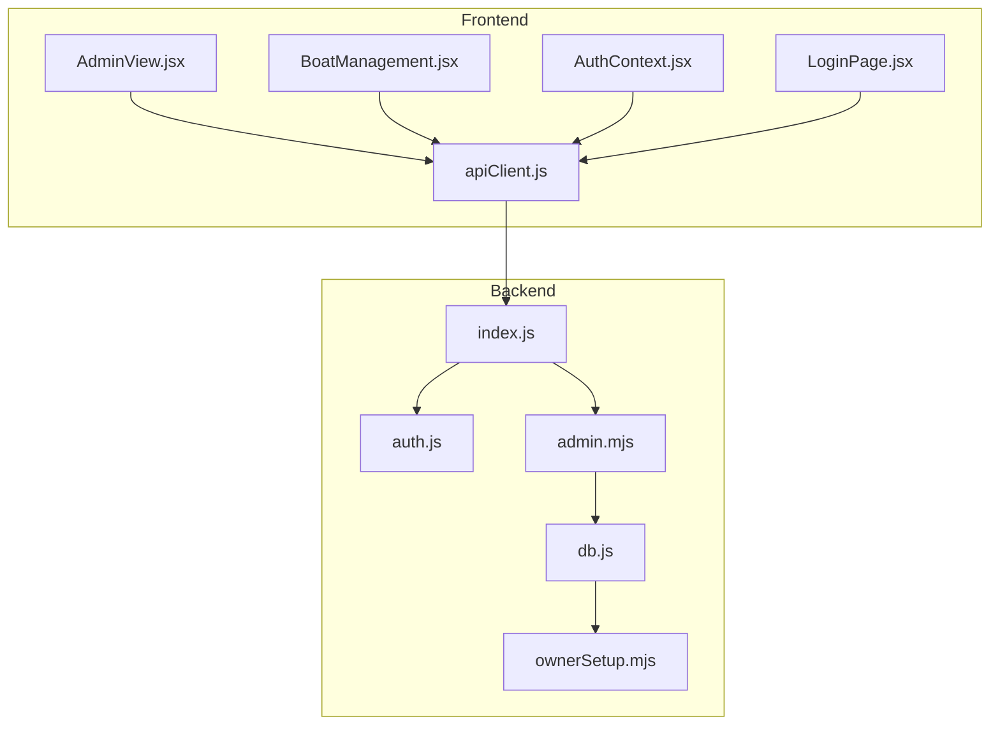
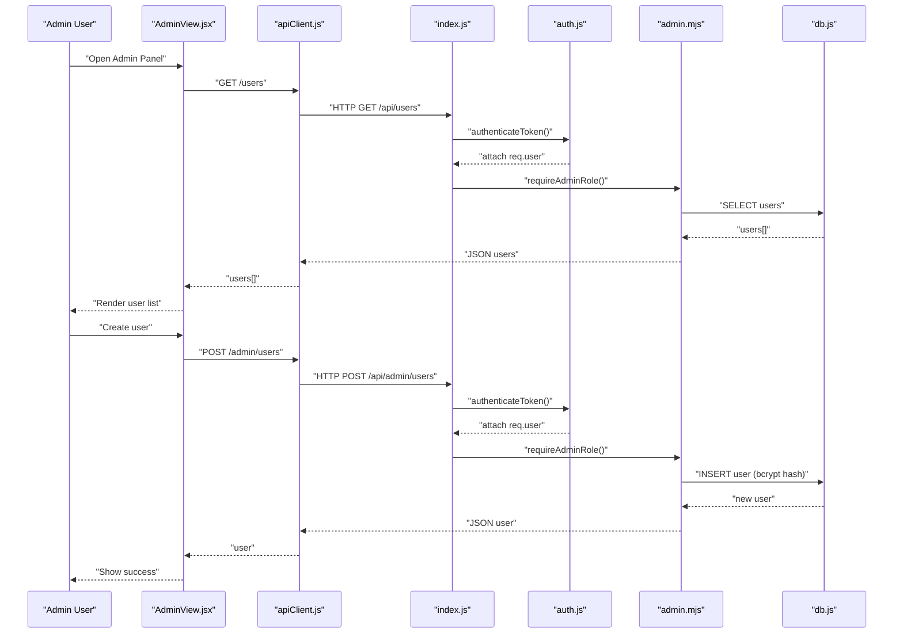
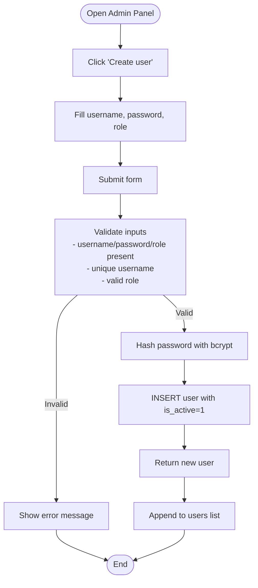
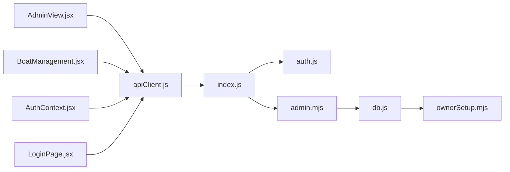

# User Management

<cite>
**Referenced Files in This Document**
- [README.md](file://README.md)
- [server/index.js](file://server/index.js)
- [server/db.js](file://server/db.js)
- [server/auth.js](file://server/auth.js)
- [server/admin.mjs](file://server/admin.mjs)
- [server/ownerSetup.mjs](file://server/ownerSetup.mjs)
- [src/views/AdminView.jsx](file://src/views/AdminView.jsx)
- [src/components/admin/BoatManagement.jsx](file://src/components/admin/BoatManagement.jsx)
- [src/utils/apiClient.js](file://src/utils/apiClient.js)
- [src/contexts/AuthContext.jsx](file://src/contexts/AuthContext.jsx)
- [src/views/LoginPage.jsx](file://src/views/LoginPage.jsx)
</cite>

## Table of Contents
1. [Introduction](#introduction)
2. [Project Structure](#project-structure)
3. [Core Components](#core-components)
4. [Architecture Overview](#architecture-overview)
5. [Detailed Component Analysis](#detailed-component-analysis)
6. [Dependency Analysis](#dependency-analysis)
7. [Performance Considerations](#performance-considerations)
8. [Troubleshooting Guide](#troubleshooting-guide)
9. [Conclusion](#conclusion)

## Introduction
This document describes the user management system for the Beach Boat Ticket Sales System. It covers the user creation workflow, listing interface, administrative controls (enable/disable, password reset, deletion), and the integration with authentication and authorization. It also documents security considerations, role-based permissions, and account lifecycle management.

## Project Structure
The user management system spans the backend (Express server) and the frontend (React SPA). The backend exposes admin endpoints under /api/admin and integrates with SQLite via better-sqlite3. The frontend provides an Admin panel with forms and lists for managing users and integrates with the backend via a typed API client.

**Diagram sources**
- [server/index.js](file://server/index.js#L39-L40)
- [server/admin.mjs](file://server/admin.mjs#L266-L415)
- [server/auth.js](file://server/auth.js#L10-L45)
- [server/db.js](file://server/db.js#L41-L48)
- [server/ownerSetup.mjs](file://server/ownerSetup.mjs#L19-L93)
- [src/views/AdminView.jsx](file://src/views/AdminView.jsx#L86-L160)
- [src/components/admin/BoatManagement.jsx](file://src/components/admin/BoatManagement.jsx#L52-L211)
- [src/utils/apiClient.js](file://src/utils/apiClient.js#L23-L88)
- [src/contexts/AuthContext.jsx](file://src/contexts/AuthContext.jsx#L19-L78)
- [src/views/LoginPage.jsx](file://src/views/LoginPage.jsx#L8-L79)

**Section sources**
- [README.md](file://README.md#L56-L64)
- [server/index.js](file://server/index.js#L39-L40)

## Core Components
- Backend user management endpoints:
  - GET /api/admin/users: list users with optional role filter
  - POST /api/admin/users: create user with username, password, and role
  - PATCH /api/admin/users/:id: toggle user is_active
  - POST /api/admin/users/:id/reset-password: reset user password
  - DELETE /api/admin/users/:id: soft delete user (set is_active = 0)
- Frontend Admin panel:
  - User listing with role and active status display
  - Create user form with role selection
  - Actions: enable/disable, reset password, delete
- Authentication and authorization:
  - JWT-based authentication middleware
  - Admin-only access enforcement for user management
  - Password hashing with bcrypt

**Section sources**
- [server/admin.mjs](file://server/admin.mjs#L266-L415)
- [src/views/AdminView.jsx](file://src/views/AdminView.jsx#L86-L160)
- [server/auth.js](file://server/auth.js#L10-L45)
- [server/db.js](file://server/db.js#L41-L48)

## Architecture Overview
The user management flow connects the Admin panel to backend endpoints through the API client. Requests are authenticated and authorized before accessing protected routes. Passwords are hashed before storage, and user records include an active flag for lifecycle management.

**Diagram sources**
- [src/views/AdminView.jsx](file://src/views/AdminView.jsx#L86-L120)
- [src/utils/apiClient.js](file://src/utils/apiClient.js#L23-L88)
- [server/index.js](file://server/index.js#L39-L40)
- [server/auth.js](file://server/auth.js#L10-L45)
- [server/admin.mjs](file://server/admin.mjs#L290-L329)
- [server/db.js](file://server/db.js#L41-L48)

## Detailed Component Analysis

### Backend: User Management Endpoints
- Listing users:
  - Supports role filter via query parameter
  - Returns id, username, role, is_active
- Creating users:
  - Validates presence of username, password, role
  - Enforces unique username
  - Validates role against allowed set
  - Hashes password with bcrypt before persisting
  - Sets is_active = 1 by default
- Updating user status:
  - Expects is_active as 0 or 1
  - Updates record and returns updated user
- Resetting password:
  - Requires admin/owner context
  - Validates password length and type
  - Hashes and updates password_hash
- Deleting users:
  - Soft deletes by setting is_active = 0
  - Prevents self-deletion
  - Returns success with userId

Security and validation highlights:
- Role validation prevents invalid role insertion.
- bcrypt hashing ensures secure password storage.
- Admin-only middleware protects sensitive operations.
- is_active flag enables account lifecycle management.

**Section sources**
- [server/admin.mjs](file://server/admin.mjs#L266-L415)

### Frontend: AdminView User Management
- User listing:
  - Fetches users via apiClient.get('/users')
  - Renders username, role, and active status badge
  - Provides action buttons per user
- Create user:
  - Form collects username, password, role
  - Submits via apiClient.createUser(newUser)
  - On success, appends to local list and clears form
- Toggle user status:
  - Calls apiClient.updateUser(userId, { is_active })
  - Updates local list with returned user
- Reset password:
  - Prompts for new password
  - Calls apiClient.resetPassword(userId, newPassword)
  - Alerts success or error
- Delete user:
  - Confirms irreversible action
  - Calls apiClient.deleteUser(id)
  - Refreshes user list

Integration patterns:
- Uses apiClient.request with Authorization header propagation
- Handles errors gracefully with user-visible messages
- Reflects backend responses in UI state

**Section sources**
- [src/views/AdminView.jsx](file://src/views/AdminView.jsx#L86-L160)
- [src/utils/apiClient.js](file://src/utils/apiClient.js#L23-L88)

### Authentication and Authorization
- Token verification middleware:
  - Extracts Bearer token from Authorization header
  - Verifies JWT and loads user from DB
  - Blocks inactive users
- Role checks:
  - requireAdminRole enforces admin/owner access for user management
  - Other role guards exist for dispatcher, seller, owner scopes
- Login flow:
  - apiClient.login posts credentials
  - Stores token and normalizes user data
  - AuthContext persists current user and handles logout

**Section sources**
- [server/auth.js](file://server/auth.js#L10-L45)
- [src/contexts/AuthContext.jsx](file://src/contexts/AuthContext.jsx#L19-L78)
- [src/views/LoginPage.jsx](file://src/views/LoginPage.jsx#L55-L79)

### Database Schema and Lifecycle
- Users table:
  - id, username (unique), password_hash, role (with CHECK constraint including 'owner'), is_active (default 1), created_at
- Owner role provisioning:
  - Migration patches users.role CHECK to include 'owner'
  - Seeds owner user if missing
- Account lifecycle:
  - is_active = 1 for enabled accounts
  - DELETE /users/:id sets is_active = 0 (soft delete)

**Section sources**
- [server/db.js](file://server/db.js#L41-L48)
- [server/ownerSetup.mjs](file://server/ownerSetup.mjs#L19-L93)

### API Integration Patterns
- Centralized request handler:
  - apiClient.request adds Authorization header automatically
  - Parses JSON, attaches network logs, and throws on non-OK responses
- Admin endpoints:
  - apiClient.get('/users'), apiClient.createUser(), apiClient.updateUser(), apiClient.resetPassword(), apiClient.deleteUser()
- Auth endpoints:
  - apiClient.login(), apiClient.logout(), apiClient.getCurrentUser()

**Section sources**
- [src/utils/apiClient.js](file://src/utils/apiClient.js#L23-L88)
- [src/utils/apiClient.js](file://src/utils/apiClient.js#L91-L103)

### User Creation Workflow

**Diagram sources**
- [server/admin.mjs](file://server/admin.mjs#L290-L329)
- [server/db.js](file://server/db.js#L41-L48)

**Section sources**
- [server/admin.mjs](file://server/admin.mjs#L290-L329)
- [server/db.js](file://server/db.js#L41-L48)

### User Administration Features
- Enable/Disable:
  - PATCH /api/admin/users/:id with is_active 0|1
  - Reflects in UI badge and action label
- Reset Password:
  - POST /api/admin/users/:id/reset-password
  - Requires admin/owner context
  - Hashes and updates password_hash
- Delete User:
  - DELETE /api/admin/users/:id (soft delete)
  - Prevents self-deletion
  - Confirms irreversible action in UI

**Section sources**
- [server/admin.mjs](file://server/admin.mjs#L331-L415)
- [src/views/AdminView.jsx](file://src/views/AdminView.jsx#L122-L159)

### Role-Based Permissions and Access Control
- Admin-only endpoints:
  - All user management endpoints are protected by requireAdminRole
- Supported roles:
  - seller, dispatcher, admin, owner
- Owner role provisioning:
  - Migration expands users.role CHECK to include 'owner'
  - Seeds owner user if missing

**Section sources**
- [server/admin.mjs](file://server/admin.mjs#L7-L15)
- [server/db.js](file://server/db.js#L45)
- [server/ownerSetup.mjs](file://server/ownerSetup.mjs#L19-L93)

### Security Considerations
- Password hashing:
  - bcrypt used for password_hash storage
- Token-based authentication:
  - JWT with expiration; middleware validates token and active status
- Input validation:
  - Username uniqueness, role validation, is_active constraints
- Account lifecycle:
  - Soft delete via is_active flag prevents accidental data loss
- Self-service limitations:
  - Cannot reset own password via admin endpoint (commented guard exists)

**Section sources**
- [server/admin.mjs](file://server/admin.mjs#L355-L387)
- [server/auth.js](file://server/auth.js#L10-L45)
- [server/db.js](file://server/db.js#L41-L48)

## Dependency Analysis

**Diagram sources**
- [src/utils/apiClient.js](file://src/utils/apiClient.js#L23-L88)
- [server/index.js](file://server/index.js#L39-L40)
- [server/auth.js](file://server/auth.js#L10-L45)
- [server/admin.mjs](file://server/admin.mjs#L266-L415)
- [server/db.js](file://server/db.js#L41-L48)
- [server/ownerSetup.mjs](file://server/ownerSetup.mjs#L19-L93)
- [src/views/AdminView.jsx](file://src/views/AdminView.jsx#L86-L160)
- [src/components/admin/BoatManagement.jsx](file://src/components/admin/BoatManagement.jsx#L52-L211)
- [src/contexts/AuthContext.jsx](file://src/contexts/AuthContext.jsx#L19-L78)
- [src/views/LoginPage.jsx](file://src/views/LoginPage.jsx#L55-L79)

**Section sources**
- [server/index.js](file://server/index.js#L39-L40)
- [src/utils/apiClient.js](file://src/utils/apiClient.js#L23-L88)

## Performance Considerations
- Database queries:
  - User listing uses simple SELECT with optional role filter
  - Consider adding indexes on role and username if scaling
- Request handling:
  - Centralized request handler performs JSON parse and logging
  - Keep payloads small for listing endpoints
- UI responsiveness:
  - Batch updates (toggle status) update local state immediately while awaiting backend confirmation

## Troubleshooting Guide
Common issues and resolutions:
- Authentication failures:
  - Verify token presence and validity; ensure JWT_SECRET is configured
  - Check that user is_active = 1
- Authorization failures:
  - Ensure requester has admin or owner role
  - Confirm requireAdminRole middleware is applied
- User creation errors:
  - Unique username violation: choose a different username
  - Invalid role: use one of seller, dispatcher, admin, owner
  - Password validation: ensure minimum length and type
- Password reset errors:
  - Ensure password meets length/type requirements
  - Confirm target user exists
- Soft delete behavior:
  - Deleted users appear as inactive; re-enable to restore

**Section sources**
- [server/auth.js](file://server/auth.js#L10-L45)
- [server/admin.mjs](file://server/admin.mjs#L290-L329)
- [server/admin.mjs](file://server/admin.mjs#L355-L387)
- [server/admin.mjs](file://server/admin.mjs#L389-L415)

## Conclusion
The user management system provides a secure, role-based interface for creating, listing, enabling/disabling, resetting passwords, and soft-deleting users. It leverages JWT authentication, bcrypt hashing, and admin-only protections to maintain integrity and usability. The frontend integrates seamlessly with backend endpoints through a centralized API client, offering immediate feedback and robust error handling.