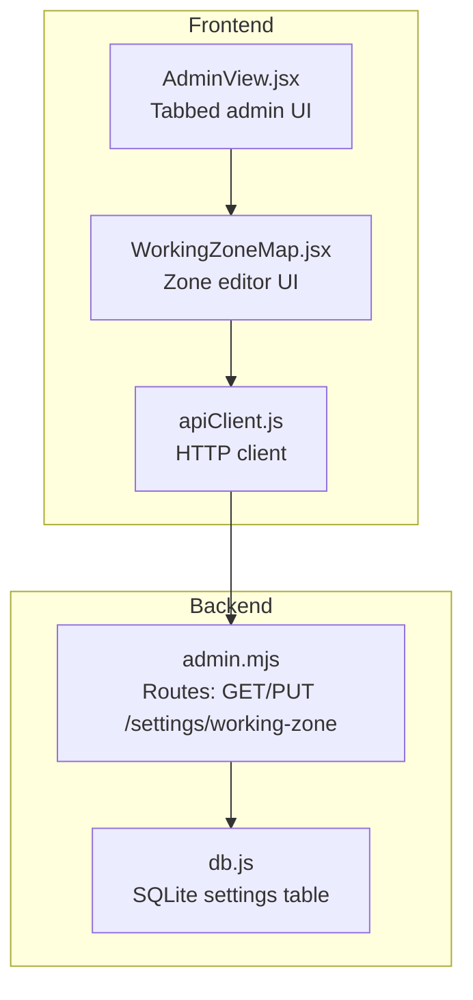
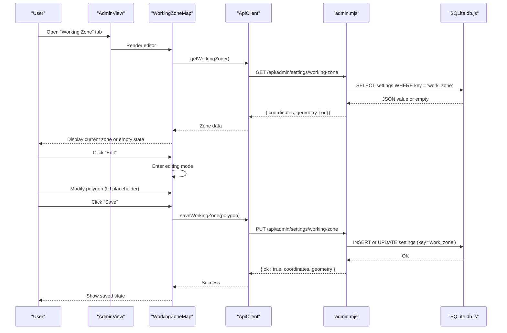
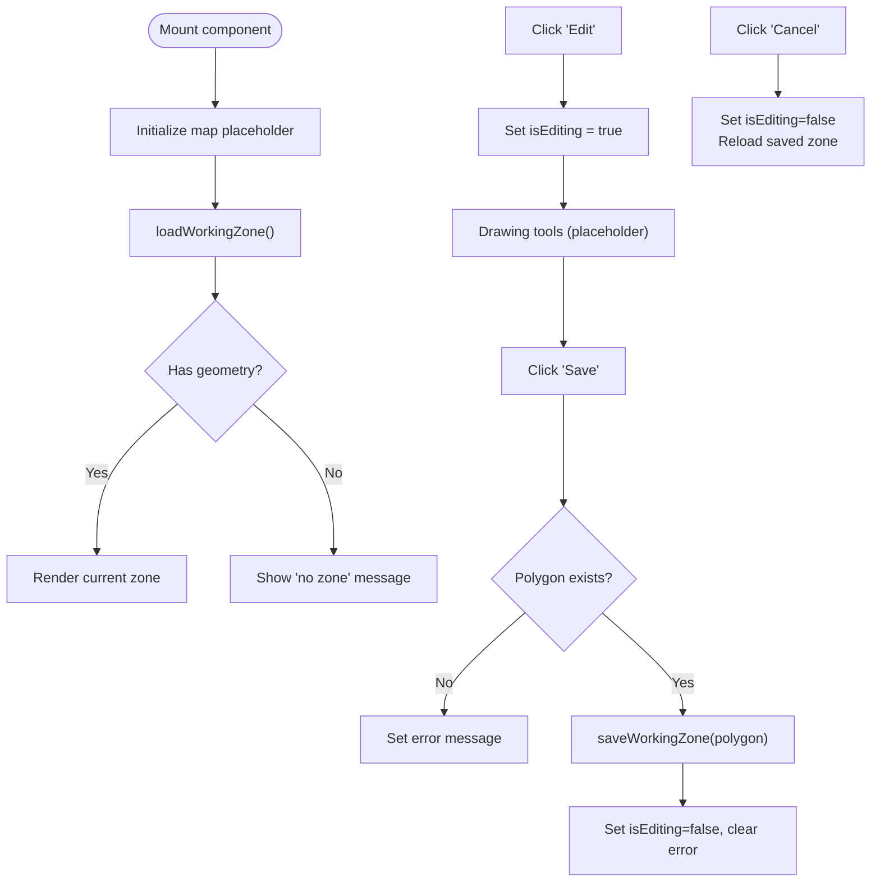
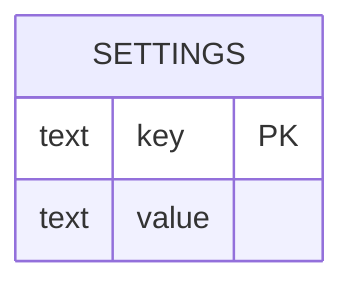
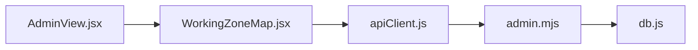

# Working Zone Management

<cite>
**Referenced Files in This Document**
- [WorkingZoneMap.jsx](file://src/components/admin/WorkingZoneMap.jsx)
- [AdminView.jsx](file://src/views/AdminView.jsx)
- [apiClient.js](file://src/utils/apiClient.js)
- [admin.mjs](file://server/admin.mjs)
- [db.js](file://server/db.js)
</cite>

## Table of Contents
1. [Introduction](#introduction)
2. [Project Structure](#project-structure)
3. [Core Components](#core-components)
4. [Architecture Overview](#architecture-overview)
5. [Detailed Component Analysis](#detailed-component-analysis)
6. [Dependency Analysis](#dependency-analysis)
7. [Performance Considerations](#performance-considerations)
8. [Troubleshooting Guide](#troubleshooting-guide)
9. [Conclusion](#conclusion)

## Introduction
This document explains the working zone management functionality for the application. It covers the interactive map interface used to define operational zones, the configuration workflow for area selection and boundary definition, and the coordinate-based persistence layer. It also documents the integration with the admin view and the backend architecture that stores and retrieves the working zone geometry.

The current implementation provides a UI shell for editing a polygon-based working zone and integrates with backend endpoints to persist and retrieve the geometry. The frontend currently logs initialization steps and defers actual map rendering to a future implementation using a mapping library.

## Project Structure
The working zone feature spans three layers:
- Frontend React component for the admin UI
- API client abstraction for network requests
- Backend routes and database storage for the working zone

**Diagram sources**
- [AdminView.jsx](file://src/views/AdminView.jsx#L196-L266)
- [WorkingZoneMap.jsx](file://src/components/admin/WorkingZoneMap.jsx#L1-L117)
- [apiClient.js](file://src/utils/apiClient.js#L23-L88)
- [admin.mjs](file://server/admin.mjs#L498-L547)
- [db.js](file://server/db.js#L87-L93)

**Section sources**
- [AdminView.jsx](file://src/views/AdminView.jsx#L196-L266)
- [WorkingZoneMap.jsx](file://src/components/admin/WorkingZoneMap.jsx#L1-L117)
- [apiClient.js](file://src/utils/apiClient.js#L23-L88)
- [admin.mjs](file://server/admin.mjs#L498-L547)
- [db.js](file://server/db.js#L87-L93)

## Core Components
- WorkingZoneMap: A React component that manages the UI state for viewing and editing the working zone polygon. It handles loading, editing, saving, and cancellation flows and displays status messages.
- AdminView: Hosts the working zone tab and orchestrates navigation and user interactions within the admin panel.
- apiClient: Provides a unified request mechanism and exposes methods for interacting with the backend. The working zone feature relies on two methods: one to fetch the current zone and one to save the updated zone.
- Backend routes: Two endpoints expose the working zone data:
  - GET /api/admin/settings/working-zone: Returns the persisted geometry.
  - PUT /api/admin/settings/working-zone: Accepts geometry and persists it under a settings key.
- Database: Stores the working zone as a JSON string in the settings table keyed by work_zone.

Key responsibilities:
- UI state: Track editing mode, polygon data, and error messages.
- Persistence: Serialize polygon geometry and send it to the backend.
- Integration: Connect to the admin view and API client.

**Section sources**
- [WorkingZoneMap.jsx](file://src/components/admin/WorkingZoneMap.jsx#L4-L117)
- [AdminView.jsx](file://src/views/AdminView.jsx#L196-L266)
- [apiClient.js](file://src/utils/apiClient.js#L23-L88)
- [admin.mjs](file://server/admin.mjs#L498-L547)
- [db.js](file://server/db.js#L87-L93)

## Architecture Overview
The working zone feature follows a clean separation of concerns:
- The admin view renders the working zone tab and hosts the editor component.
- The editor component encapsulates UI logic and delegates network operations to the API client.
- The API client centralizes HTTP behavior, headers, and error reporting.
- The backend routes validate incoming geometry and persist it to the settings table.
- The database schema defines a simple key-value settings table suitable for storing serialized geometry.

**Diagram sources**
- [AdminView.jsx](file://src/views/AdminView.jsx#L196-L266)
- [WorkingZoneMap.jsx](file://src/components/admin/WorkingZoneMap.jsx#L24-L54)
- [apiClient.js](file://src/utils/apiClient.js#L23-L88)
- [admin.mjs](file://server/admin.mjs#L498-L547)
- [db.js](file://server/db.js#L87-L93)

## Detailed Component Analysis

### WorkingZoneMap Component
Responsibilities:
- Initialize map placeholder and load existing working zone on mount.
- Manage editing lifecycle: start editing, cancel editing, and save changes.
- Persist polygon geometry via the API client and surface errors to the user.

State management:
- map: Placeholder for the map instance (to be implemented).
- polygon: Current working zone geometry.
- isEditing: Controls UI modes and editing controls.
- error: Displays user-facing errors.

User flows:
- View mode: Shows either the loaded polygon or a message indicating no zone is configured.
- Edit mode: Enables save and cancel actions and hints about drawing tools.
- Save: Sends the polygon to the backend and exits editing mode.
- Cancel: Exits editing and reloads the last saved zone.

**Diagram sources**
- [WorkingZoneMap.jsx](file://src/components/admin/WorkingZoneMap.jsx#L10-L54)

**Section sources**
- [WorkingZoneMap.jsx](file://src/components/admin/WorkingZoneMap.jsx#L4-L117)

### AdminView Integration
The admin view provides a tabbed interface and hosts the working zone editor. The "Zone" tab renders the WorkingZoneMap component, enabling administrators to manage the working zone alongside other administrative tasks.

Key integration points:
- Tab routing: The activeTab state determines which panel is shown.
- Rendering: When activeTab equals "zone", the WorkingZoneMap component is rendered.

**Section sources**
- [AdminView.jsx](file://src/views/AdminView.jsx#L196-L266)

### API Client Integration
The API client encapsulates HTTP behavior and provides a request method with standardized headers, token handling, and logging. The working zone feature uses two methods:
- getWorkingZone(): Fetches the current working zone geometry.
- saveWorkingZone(polygon): Persists the updated polygon geometry.

The client enforces JSON serialization for bodies and records network logs for diagnostics.

**Section sources**
- [apiClient.js](file://src/utils/apiClient.js#L23-L88)
- [WorkingZoneMap.jsx](file://src/components/admin/WorkingZoneMap.jsx#L24-L45)

### Backend Routes and Data Storage
Backend responsibilities:
- GET /api/admin/settings/working-zone: Returns the stored geometry as JSON. If the key does not exist, returns an empty object.
- PUT /api/admin/settings/working-zone: Validates that geometry is present, serializes coordinates and geometry, and inserts or updates the settings record under the key work_zone.

Database schema:
- settings table with key and value columns. The working zone is stored as a JSON string.

**Diagram sources**
- [db.js](file://server/db.js#L87-L93)
- [admin.mjs](file://server/admin.mjs#L498-L547)

**Section sources**
- [admin.mjs](file://server/admin.mjs#L498-L547)
- [db.js](file://server/db.js#L87-L93)

## Dependency Analysis
The working zone feature exhibits clear layering:
- UI depends on the API client for network operations.
- API client depends on the backend routes.
- Backend routes depend on the database for persistence.

**Diagram sources**
- [WorkingZoneMap.jsx](file://src/components/admin/WorkingZoneMap.jsx#L1-L117)
- [AdminView.jsx](file://src/views/AdminView.jsx#L196-L266)
- [apiClient.js](file://src/utils/apiClient.js#L23-L88)
- [admin.mjs](file://server/admin.mjs#L498-L547)
- [db.js](file://server/db.js#L87-L93)

**Section sources**
- [WorkingZoneMap.jsx](file://src/components/admin/WorkingZoneMap.jsx#L1-L117)
- [AdminView.jsx](file://src/views/AdminView.jsx#L196-L266)
- [apiClient.js](file://src/utils/apiClient.js#L23-L88)
- [admin.mjs](file://server/admin.mjs#L498-L547)
- [db.js](file://server/db.js#L87-L93)

## Performance Considerations
- Network efficiency: The API client consolidates headers and body handling, reducing overhead per request.
- Geometry size: Large polygons increase payload sizes. Consider simplification or compression strategies if polygons become complex.
- Rendering: The current UI uses a placeholder for map rendering. When integrating a mapping library, defer rendering until the zone is loaded to avoid unnecessary computations.
- Caching: The backend returns the entire geometry on GET. If the polygon is large, consider pagination or delta updates if the UI evolves to incremental edits.

## Troubleshooting Guide
Common issues and resolutions:
- Loading failures: If the backend returns an error while fetching the working zone, the UI displays an error message. Verify backend connectivity and that the settings key exists.
- Saving failures: If saving fails, the UI displays an error message. Ensure geometry is present and the backend route receives the required fields.
- JSON parsing errors: If the stored value is malformed, the backend returns an empty object. Re-save the working zone after correcting the stored data.

Operational checks:
- Confirm the backend endpoints are reachable and authenticated.
- Verify the settings table contains the work_zone key with valid JSON.
- Inspect network logs recorded by the API client for request/response details.

**Section sources**
- [WorkingZoneMap.jsx](file://src/components/admin/WorkingZoneMap.jsx#L30-L44)
- [admin.mjs](file://server/admin.mjs#L498-L547)

## Conclusion
The working zone management feature provides a structured foundation for defining and managing operational boundaries:
- The admin view integrates the working zone editor seamlessly.
- The editor component encapsulates UI state and persistence flows.
- The backend offers straightforward endpoints to fetch and update the working zone geometry.
- The database schema supports simple key-value storage for the serialized geometry.

Future enhancements could include:
- Integrating a mapping library to enable interactive polygon drawing and editing.
- Adding validation and sanitization for geometry inputs.
- Implementing spatial queries to optimize zone-related operations.
- Introducing audit trails or versioning for the working zone configuration.