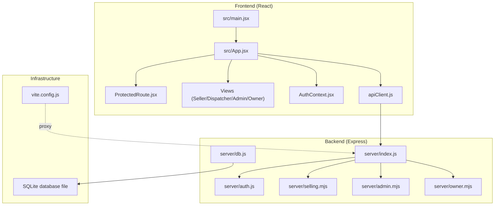
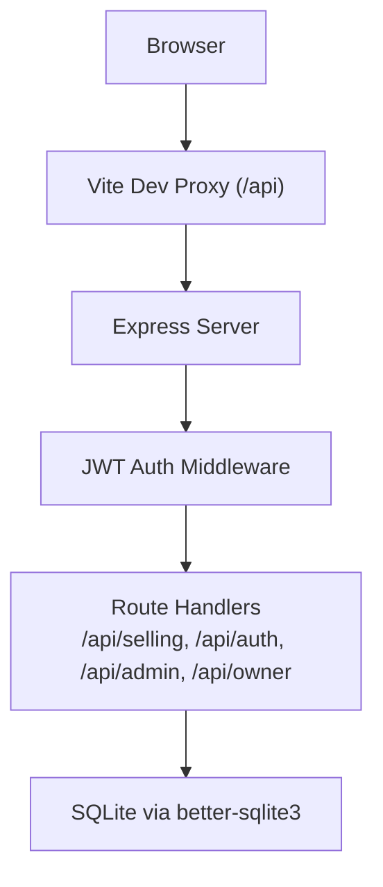
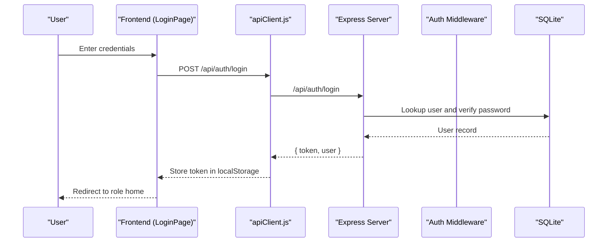
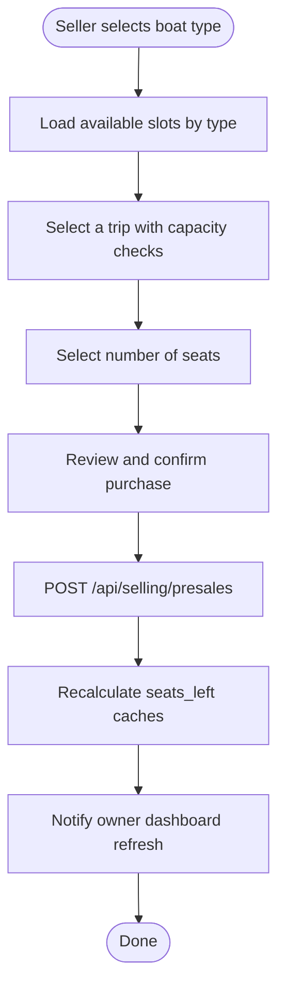
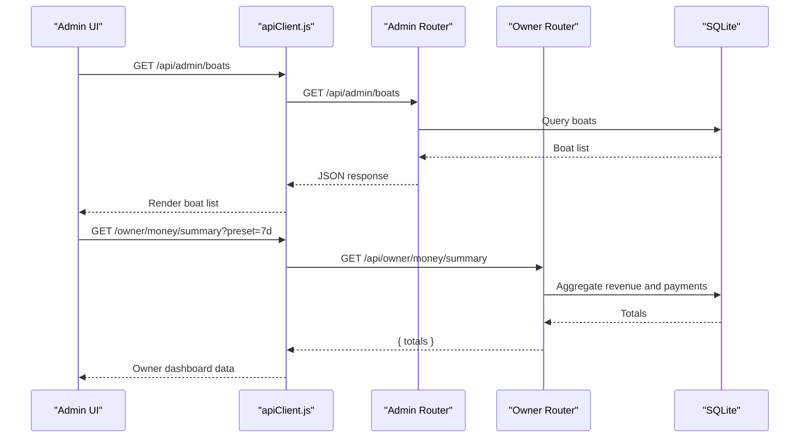
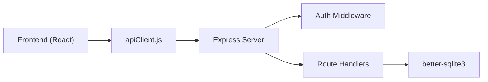
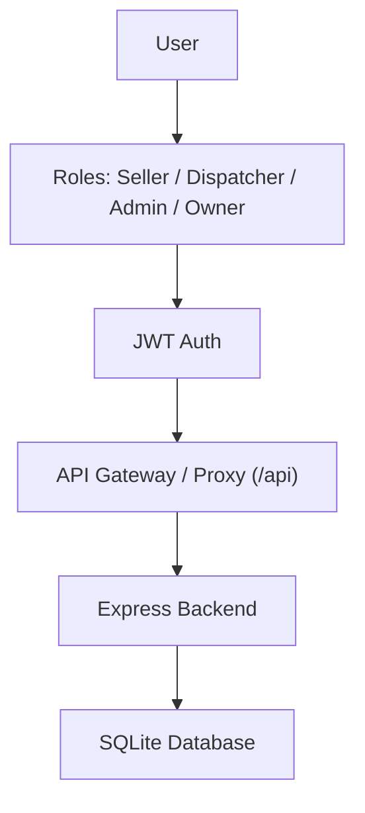

# Architecture Overview

<cite>
**Referenced Files in This Document**
- [README.md](file://README.md)
- [package.json](file://package.json)
- [server/index.js](file://server/index.js)
- [server/auth.js](file://server/auth.js)
- [server/db.js](file://server/db.js)
- [server/selling.mjs](file://server/selling.mjs)
- [server/admin.mjs](file://server/admin.mjs)
- [server/owner.mjs](file://server/owner.mjs)
- [src/App.jsx](file://src/App.jsx)
- [src/main.jsx](file://src/main.jsx)
- [src/contexts/AuthContext.jsx](file://src/contexts/AuthContext.jsx)
- [src/components/ProtectedRoute.jsx](file://src/components/ProtectedRoute.jsx)
- [src/views/LoginPage.jsx](file://src/views/LoginPage.jsx)
- [src/views/SellerView.jsx](file://src/views/SellerView.jsx)
- [src/views/DispatcherView.jsx](file://src/views/DispatcherView.jsx)
- [src/views/AdminView.jsx](file://src/views/AdminView.jsx)
- [src/utils/apiClient.js](file://src/utils/apiClient.js)
- [vite.config.js](file://vite.config.js)
</cite>

## Table of Contents
1. [Introduction](#introduction)
2. [Project Structure](#project-structure)
3. [Core Components](#core-components)
4. [Architecture Overview](#architecture-overview)
5. [Detailed Component Analysis](#detailed-component-analysis)
6. [Dependency Analysis](#dependency-analysis)
7. [Performance Considerations](#performance-considerations)
8. [Troubleshooting Guide](#troubleshooting-guide)
9. [Conclusion](#conclusion)
10. [Appendices](#appendices)

## Introduction
This document describes the architecture of the boat ticket application system. It follows an MVC-like pattern with a React frontend and an Express backend. The frontend organizes views and components around user roles, while the backend exposes modular route handlers for selling, dispatching, administration, and owner analytics. Cross-cutting concerns include JWT-based authentication, SQLite-backed persistence, and a centralized API client for HTTP communication.

## Project Structure
The repository is organized into:
- Frontend (React + Vite): Views, components, contexts, utilities, and styling
- Backend (Express + better-sqlite3): Modular route handlers, authentication middleware, and database initialization
- Shared configuration: Vite proxy, package dependencies, and environment



**Diagram sources**
- [src/main.jsx](file://src/main.jsx#L1-L26)
- [src/App.jsx](file://src/App.jsx#L1-L139)
- [src/components/ProtectedRoute.jsx](file://src/components/ProtectedRoute.jsx#L1-L38)
- [src/contexts/AuthContext.jsx](file://src/contexts/AuthContext.jsx#L1-L79)
- [src/utils/apiClient.js](file://src/utils/apiClient.js#L1-L360)
- [server/index.js](file://server/index.js#L1-L45)
- [server/auth.js](file://server/auth.js#L1-L154)
- [server/db.js](file://server/db.js#L1-L1269)
- [server/selling.mjs](file://server/selling.mjs#L1-L200)
- [server/admin.mjs](file://server/admin.mjs#L1-L200)
- [server/owner.mjs](file://server/owner.mjs#L1-L200)
- [vite.config.js](file://vite.config.js#L1-L25)

**Section sources**
- [README.md](file://README.md#L1-L150)
- [package.json](file://package.json#L1-L41)
- [vite.config.js](file://vite.config.js#L1-L25)

## Core Components
- Frontend bootstrap and routing:
  - Application entry initializes React Router and global providers, then mounts the App.
  - App defines role-based routes and protected routes with role checks.
- Authentication and state:
  - AuthContext manages current user, login/logout, and token persistence in localStorage.
  - ProtectedRoute enforces role-based access control per route.
- API client:
  - Centralized HTTP client that injects Authorization headers and normalizes responses.
- Backend:
  - Express server mounts modular route handlers under /api/*.
  - Authentication middleware validates JWT and attaches user info to requests.
  - Database layer initializes SQLite and performs migrations and schema normalization.

**Section sources**
- [src/main.jsx](file://src/main.jsx#L1-L26)
- [src/App.jsx](file://src/App.jsx#L1-L139)
- [src/components/ProtectedRoute.jsx](file://src/components/ProtectedRoute.jsx#L1-L38)
- [src/contexts/AuthContext.jsx](file://src/contexts/AuthContext.jsx#L1-L79)
- [src/utils/apiClient.js](file://src/utils/apiClient.js#L1-L360)
- [server/index.js](file://server/index.js#L1-L45)
- [server/auth.js](file://server/auth.js#L1-L154)
- [server/db.js](file://server/db.js#L1-L1269)

## Architecture Overview
The system adheres to a layered architecture:
- Presentation layer: React views and components
- Application layer: Route handlers and middleware
- Domain layer: Business logic for selling, dispatching, and owner analytics
- Data layer: SQLite via better-sqlite3



**Diagram sources**
- [vite.config.js](file://vite.config.js#L1-L25)
- [server/index.js](file://server/index.js#L1-L45)
- [server/auth.js](file://server/auth.js#L1-L154)
- [server/db.js](file://server/db.js#L1-L1269)

## Detailed Component Analysis

### Authentication and Authorization
- JWT-based authentication:
  - Login endpoint verifies credentials and issues a signed token with a 24-hour expiration.
  - Subsequent requests include an Authorization header; middleware validates the token and attaches user info.
  - Role-based access control is enforced via dedicated middleware functions.
- Frontend authentication flow:
  - LoginPage collects credentials, calls the API, stores the token, and redirects to the role home.
  - AuthContext loads the current user on startup by calling /api/auth/me and normalizes roles to lowercase.
  - ProtectedRoute enforces role checks and redirects unauthenticated or unauthorized users.



**Diagram sources**
- [src/views/LoginPage.jsx](file://src/views/LoginPage.jsx#L1-L159)
- [src/utils/apiClient.js](file://src/utils/apiClient.js#L91-L103)
- [server/auth.js](file://server/auth.js#L120-L142)
- [server/db.js](file://server/db.js#L1-L1269)

**Section sources**
- [server/auth.js](file://server/auth.js#L1-L154)
- [src/views/LoginPage.jsx](file://src/views/LoginPage.jsx#L1-L159)
- [src/contexts/AuthContext.jsx](file://src/contexts/AuthContext.jsx#L1-L79)
- [src/components/ProtectedRoute.jsx](file://src/components/ProtectedRoute.jsx#L1-L38)

### Selling Workflow (Seller and Dispatcher)
- The selling domain orchestrates trips, slots, presales, and tickets:
  - Capacity checks ensure seat availability for both manual and generated slots.
  - Presales capture customer details and payment splits; tickets are tracked per presale.
  - Dispatcher can manage slots and passenger lists; seller drives the sale flow.
- Frontend integration:
  - SellerView coordinates steps: select boat type → select trip → select seats → confirm and create presale.
  - DispatcherView provides tabs for trips, selling, slot management, and shift close.



**Diagram sources**
- [src/views/SellerView.jsx](file://src/views/SellerView.jsx#L1-L200)
- [src/utils/apiClient.js](file://src/utils/apiClient.js#L166-L253)
- [server/selling.mjs](file://server/selling.mjs#L52-L102)

**Section sources**
- [server/selling.mjs](file://server/selling.mjs#L1-L200)
- [src/views/SellerView.jsx](file://src/views/SellerView.jsx#L1-L200)
- [src/views/DispatcherView.jsx](file://src/views/DispatcherView.jsx#L1-L200)

### Administration and Owner Analytics
- Admin module:
  - Provides boat CRUD, slot management, and user administration endpoints.
  - Requires admin or owner roles for access.
- Owner module:
  - Computes revenue, cash/card payments, and pending balances grouped by trip day.
  - Supports preset ranges (today, yesterday, last 7/30/90 days) and dynamic last-nonzero-day resolution.



**Diagram sources**
- [server/admin.mjs](file://server/admin.mjs#L1-L200)
- [server/owner.mjs](file://server/owner.mjs#L118-L187)
- [src/utils/apiClient.js](file://src/utils/apiClient.js#L354-L358)
- [server/db.js](file://server/db.js#L1-L1269)

**Section sources**
- [server/admin.mjs](file://server/admin.mjs#L1-L200)
- [server/owner.mjs](file://server/owner.mjs#L1-L200)
- [src/views/AdminView.jsx](file://src/views/AdminView.jsx#L1-L200)

### Database Layer and Schema
- SQLite with better-sqlite3:
  - Initializes WAL mode and sets a busy timeout for concurrency.
  - Creates and migrates tables for users, boats, boat_slots, presales, tickets, schedule templates, and generated slots.
  - Enforces role constraints and adds pricing and capacity columns with backward-compatible migrations.
- Data integrity:
  - Unique constraints for generated slots prevent duplicate trips.
  - Seat availability is computed from tickets for manual slots and from presales for generated slots.

```mermaid
erDiagram
USERS {
int id PK
text username UK
text password_hash
text role
int is_active
text created_at
}
BOATS {
int id PK
text name UK
int is_active
text type
real price_adult
real price_teen
real price_child
}
BOAT_SLOTS {
int id PK
int boat_id FK
text time
int price
int capacity
int seats_left
int is_active
int price_adult
int price_child
int price_teen
int seller_cutoff_minutes
unique boat_id time
}
PRESALES {
int id PK
int boat_slot_id FK
text customer_name
text customer_phone
int number_of_seats
int total_price
int prepayment_amount
text prepayment_comment
text status
text slot_uid
text tickets_json
int payment_cash_amount
int payment_card_amount
text payment_method
text created_at
text updated_at
}
TICKETS {
int id PK
int presale_id FK
int boat_slot_id FK
text ticket_code
text status
int price
text created_at
text updated_at
}
USERS ||--o{ PRESALES : "creates"
BOATS ||--o{ BOAT_SLOTS : "has"
BOAT_SLOTS ||--o{ PRESALES : "generates"
PRESALES ||--o{ TICKETS : "produces"
```

**Diagram sources**
- [server/db.js](file://server/db.js#L40-L1269)

**Section sources**
- [server/db.js](file://server/db.js#L1-L1269)

## Dependency Analysis
- Technology stack:
  - Frontend: React, React Router, Tailwind CSS, Vite
  - Backend: Express, better-sqlite3, jsonwebtoken, bcrypt
- Module coupling:
  - Frontend depends on apiClient for all backend interactions.
  - Backend composes route handlers and shares db.js across modules.
  - Vite proxy forwards /api requests to the backend server.



**Diagram sources**
- [package.json](file://package.json#L15-L38)
- [src/utils/apiClient.js](file://src/utils/apiClient.js#L1-L360)
- [server/index.js](file://server/index.js#L1-L45)
- [server/db.js](file://server/db.js#L1-L1269)

**Section sources**
- [package.json](file://package.json#L1-L41)
- [vite.config.js](file://vite.config.js#L1-L25)

## Performance Considerations
- Database:
  - WAL mode improves concurrent reads; busy timeout reduces lock contention.
  - Seat availability recomputation uses efficient SQL queries and caches.
- Frontend:
  - Centralized API client minimizes network overhead and simplifies caching strategies at the app level.
- Scalability:
  - Current setup targets a single-instance deployment. Horizontal scaling would require shared state/session storage and a stateless backend.

[No sources needed since this section provides general guidance]

## Troubleshooting Guide
- Authentication failures:
  - Verify JWT_SECRET environment variable and token presence in Authorization header.
  - Check user activity status and credential verification logic.
- Database initialization errors:
  - Ensure the database file path resolves correctly and the process has write permissions.
- CORS/proxy issues:
  - Confirm Vite proxy configuration forwards Authorization headers to the backend.

**Section sources**
- [server/auth.js](file://server/auth.js#L10-L40)
- [server/db.js](file://server/db.js#L17-L26)
- [vite.config.js](file://vite.config.js#L10-L22)

## Conclusion
The system cleanly separates presentation, application, and data layers with modular backend routes and centralized state management. JWT-based authentication and role checks enforce access control, while SQLite provides a lightweight persistence layer suitable for small-scale deployments. The architecture supports incremental enhancements such as session storage for horizontal scaling, rate limiting, and advanced caching strategies.

[No sources needed since this section summarizes without analyzing specific files]

## Appendices

### System Context Diagram


[No sources needed since this diagram shows conceptual workflow, not actual code structure]

### API Endpoint Overview
- Authentication
  - POST /api/auth/login
  - GET /api/auth/me
- Selling
  - GET /api/selling/slots
  - GET /api/selling/boats
  - POST /api/selling/presales
  - PATCH /api/selling/presales/:id/accept-payment
  - PATCH /api/selling/presales/:id/refund
  - PATCH /api/selling/slots/:id/active
- Admin
  - GET /api/admin/boats
  - POST /api/admin/boats
  - PUT /api/admin/boats/:id
  - PATCH /api/admin/boats/:id/active
  - DELETE /api/admin/boats/:id
- Owner
  - GET /api/owner/money/summary

**Section sources**
- [src/utils/apiClient.js](file://src/utils/apiClient.js#L105-L358)
- [server/auth.js](file://server/auth.js#L120-L151)
- [server/admin.mjs](file://server/admin.mjs#L17-L180)
- [server/owner.mjs](file://server/owner.mjs#L118-L187)