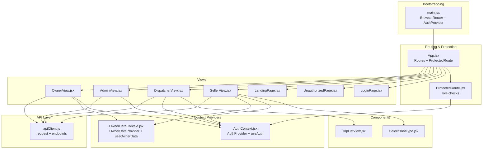
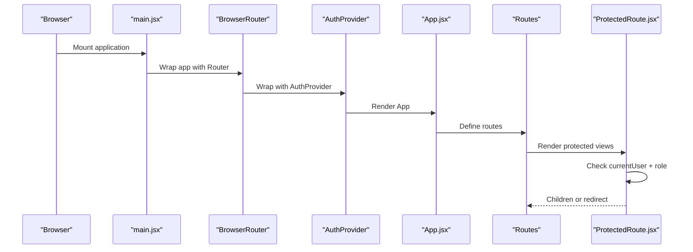
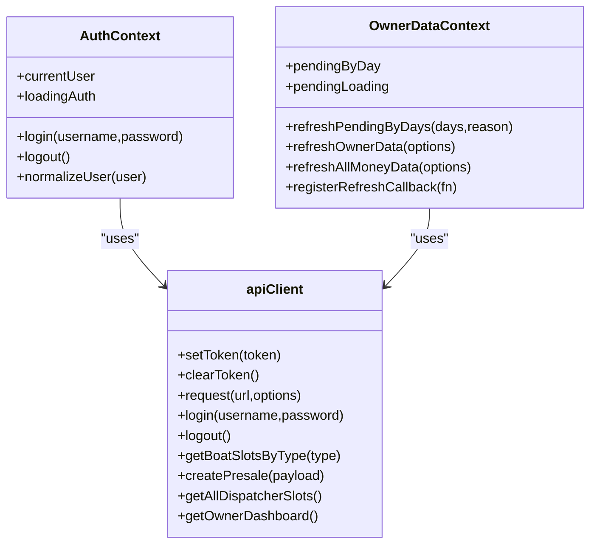
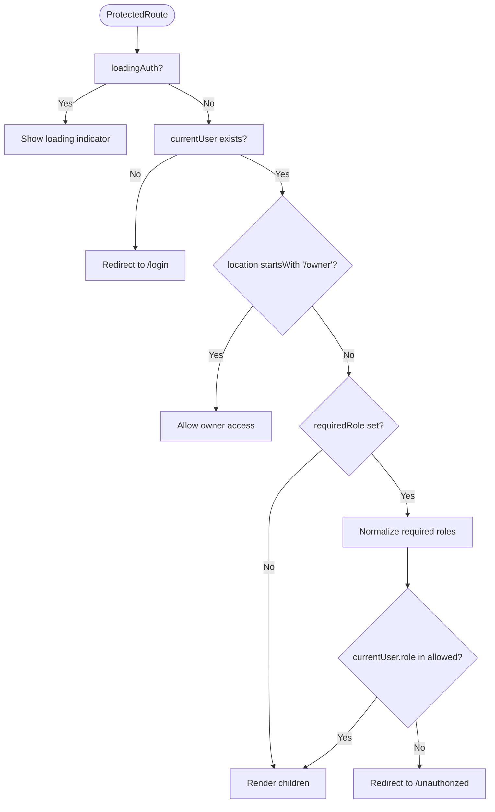
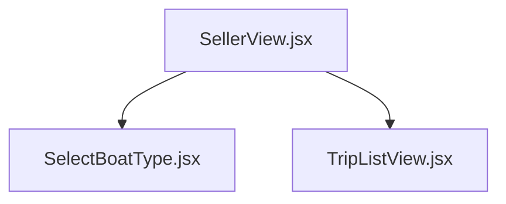
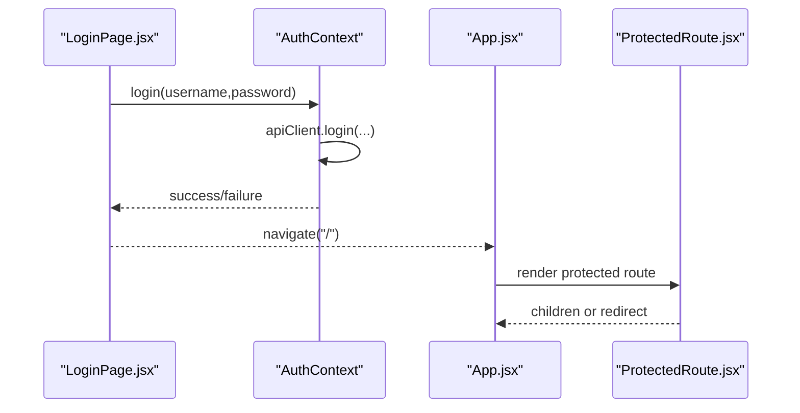
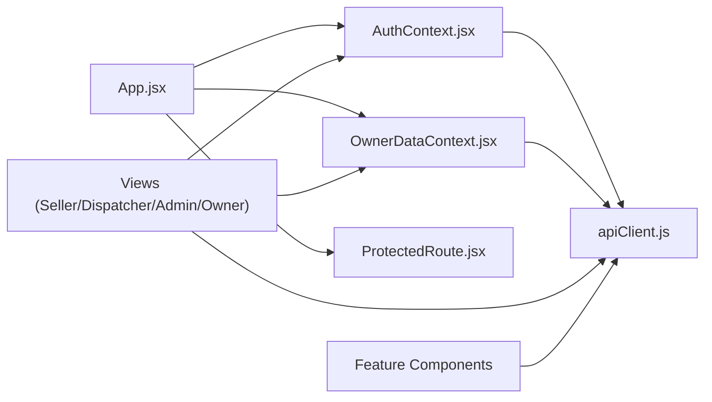

# Component Interactions

<cite>
**Referenced Files in This Document**
- [App.jsx](file://src/App.jsx)
- [main.jsx](file://src/main.jsx)
- [AuthContext.jsx](file://src/contexts/AuthContext.jsx)
- [OwnerDataContext.jsx](file://src/contexts/OwnerDataContext.jsx)
- [ProtectedRoute.jsx](file://src/components/ProtectedRoute.jsx)
- [apiClient.js](file://src/utils/apiClient.js)
- [SellerView.jsx](file://src/views/SellerView.jsx)
- [DispatcherView.jsx](file://src/views/DispatcherView.jsx)
- [AdminView.jsx](file://src/views/AdminView.jsx)
- [OwnerView.jsx](file://src/views/OwnerView.jsx)
- [LoginPage.jsx](file://src/views/LoginPage.jsx)
- [UnauthorizedPage.jsx](file://src/views/UnauthorizedPage.jsx)
- [LandingPage.jsx](file://src/views/LandingPage.jsx)
- [SelectBoatType.jsx](file://src/components/seller/SelectBoatType.jsx)
- [TripListView.jsx](file://src/components/dispatcher/TripListView.jsx)
</cite>

## Table of Contents
1. [Introduction](#introduction)
2. [Project Structure](#project-structure)
3. [Core Components](#core-components)
4. [Architecture Overview](#architecture-overview)
5. [Detailed Component Analysis](#detailed-component-analysis)
6. [Dependency Analysis](#dependency-analysis)
7. [Performance Considerations](#performance-considerations)
8. [Troubleshooting Guide](#troubleshooting-guide)
9. [Conclusion](#conclusion)

## Introduction
This document explains how components interact in the boat ticket application, focusing on routing and role-based access control, authentication state management, and centralized API communication. It traces the component hierarchy from the application root down to feature components, documents data flow patterns, and shows how context providers prevent prop drilling. It also outlines how ProtectedRoute enforces access control, how AuthContext centralizes authentication state, and how apiClient encapsulates all network requests.

## Project Structure
The application is a React SPA bootstrapped with Vite. Routing is handled by React Router, with route protection implemented via a dedicated component. Authentication and owner-specific data are managed by React Context providers. Feature views compose smaller components and use apiClient for all backend interactions.

**Diagram sources**
- [main.jsx](file://src/main.jsx#L15-L23)
- [App.jsx](file://src/App.jsx#L40-L136)
- [ProtectedRoute.jsx](file://src/components/ProtectedRoute.jsx#L4-L35)
- [AuthContext.jsx](file://src/contexts/AuthContext.jsx#L19-L78)
- [OwnerDataContext.jsx](file://src/contexts/OwnerDataContext.jsx#L21-L128)
- [SellerView.jsx](file://src/views/SellerView.jsx#L37-L370)
- [DispatcherView.jsx](file://src/views/DispatcherView.jsx#L23-L291)
- [AdminView.jsx](file://src/views/AdminView.jsx#L10-L382)
- [OwnerView.jsx](file://src/views/OwnerView.jsx#L164-L384)
- [SelectBoatType.jsx](file://src/components/seller/SelectBoatType.jsx#L3-L45)
- [TripListView.jsx](file://src/components/dispatcher/TripListView.jsx#L71-L257)
- [apiClient.js](file://src/utils/apiClient.js#L23-L88)

**Section sources**
- [main.jsx](file://src/main.jsx#L15-L23)
- [App.jsx](file://src/App.jsx#L40-L136)

## Core Components
- App.jsx: Declares routes, public pages, and protected routes. Wraps the app with OwnerDataProvider and renders DebugButton.
- ProtectedRoute.jsx: Enforces role-based access control and handles special owner path exceptions.
- AuthContext.jsx: Provides authentication state, login/logout, and initial token validation on startup.
- OwnerDataContext.jsx: Centralizes owner-related data fetching and refresh orchestration.
- apiClient.js: Encapsulates all HTTP requests, token handling, response parsing, and logging.

Key responsibilities:
- App.jsx orchestrates navigation and protection.
- ProtectedRoute ensures only authorized roles enter protected areas.
- AuthContext normalizes user roles and exposes login/logout to all views.
- OwnerDataContext enables owner UI tabs to share data without prop drilling.
- apiClient abstracts network concerns and provides typed endpoints for features.

**Section sources**
- [App.jsx](file://src/App.jsx#L40-L136)
- [ProtectedRoute.jsx](file://src/components/ProtectedRoute.jsx#L4-L35)
- [AuthContext.jsx](file://src/contexts/AuthContext.jsx#L19-L78)
- [OwnerDataContext.jsx](file://src/contexts/OwnerDataContext.jsx#L21-L128)
- [apiClient.js](file://src/utils/apiClient.js#L23-L88)

## Architecture Overview
The runtime initialization and rendering pipeline:

**Diagram sources**
- [main.jsx](file://src/main.jsx#L15-L23)
- [App.jsx](file://src/App.jsx#L40-L136)
- [ProtectedRoute.jsx](file://src/components/ProtectedRoute.jsx#L4-L35)

## Detailed Component Analysis

### Authentication and Context Providers
AuthContext manages login state, persists tokens, and normalizes user roles. OwnerDataContext augments the owner UI shell with shared data and refresh callbacks.

**Diagram sources**
- [AuthContext.jsx](file://src/contexts/AuthContext.jsx#L19-L78)
- [OwnerDataContext.jsx](file://src/contexts/OwnerDataContext.jsx#L21-L128)
- [apiClient.js](file://src/utils/apiClient.js#L10-L360)

**Section sources**
- [AuthContext.jsx](file://src/contexts/AuthContext.jsx#L19-L78)
- [OwnerDataContext.jsx](file://src/contexts/OwnerDataContext.jsx#L21-L128)
- [apiClient.js](file://src/utils/apiClient.js#L23-L88)

### Route Protection and Role-Based Access Control
ProtectedRoute enforces role checks and allows owner users to access owner routes regardless of the base path. It redirects unauthenticated users to login and unauthorized roles to an unauthorized page.

**Diagram sources**
- [ProtectedRoute.jsx](file://src/components/ProtectedRoute.jsx#L4-L35)

**Section sources**
- [ProtectedRoute.jsx](file://src/components/ProtectedRoute.jsx#L4-L35)

### Component Hierarchy and Data Flow Patterns
The Seller view composes multiple steps and components, orchestrating state and API calls while delegating UI concerns to child components. The Dispatcher view aggregates multiple feature components and maintains filters and tabs. The Owner view hosts a bottom-navigation shell with multiple tabs, each backed by its own view.

**Diagram sources**
- [SellerView.jsx](file://src/views/SellerView.jsx#L37-L370)
- [SelectBoatType.jsx](file://src/components/seller/SelectBoatType.jsx#L3-L45)
- [TripListView.jsx](file://src/components/dispatcher/TripListView.jsx#L71-L257)

**Section sources**
- [SellerView.jsx](file://src/views/SellerView.jsx#L37-L370)
- [SelectBoatType.jsx](file://src/components/seller/SelectBoatType.jsx#L3-L45)
- [TripListView.jsx](file://src/components/dispatcher/TripListView.jsx#L71-L257)

### Event Handling Between Components
- Login form dispatches login action via AuthContext and navigates on success.
- Seller view handles navigation events (logout, step transitions) and delegates API calls to apiClient.
- Dispatcher view uses custom events to trigger refresh across components.
- Owner view switches tabs and triggers owner data refresh via OwnerDataContext.

**Diagram sources**
- [LoginPage.jsx](file://src/views/LoginPage.jsx#L56-L79)
- [AuthContext.jsx](file://src/contexts/AuthContext.jsx#L55-L63)
- [App.jsx](file://src/App.jsx#L40-L136)
- [ProtectedRoute.jsx](file://src/components/ProtectedRoute.jsx#L4-L35)

**Section sources**
- [LoginPage.jsx](file://src/views/LoginPage.jsx#L56-L79)
- [SellerView.jsx](file://src/views/SellerView.jsx#L75-L125)
- [DispatcherView.jsx](file://src/views/DispatcherView.jsx#L88-L93)
- [OwnerView.jsx](file://src/views/OwnerView.jsx#L172-L179)

### Component Composition Patterns
- SellerView composes SelectBoatType, SelectTrip, SelectSeats, and ConfirmationScreen. State is hoisted to SellerView and passed down as props; callbacks update state and drive navigation.
- DispatcherView composes TripListView, SlotManagement, TicketSellingView, and others. Filters and tabs are maintained in DispatcherView and passed to children.
- OwnerView composes multiple owner-specific views behind a bottom navigation shell, sharing data via OwnerDataContext.

These patterns minimize prop drilling by placing shared state in higher-level components and passing only necessary props and callbacks.

**Section sources**
- [SellerView.jsx](file://src/views/SellerView.jsx#L234-L317)
- [DispatcherView.jsx](file://src/views/DispatcherView.jsx#L232-L285)
- [OwnerView.jsx](file://src/views/OwnerView.jsx#L164-L194)

### How Different User Roles Interact Through Shared Components
- Seller: Uses SellerView to select boat type, trips, seats, and confirm sales. Uses apiClient for presales and tickets. Owner data refresh is triggered after presale creation.
- Dispatcher: Uses DispatcherView to manage trips, slots, and boarding. Uses apiClient for dispatcher endpoints and emits refresh events.
- Admin: Uses AdminView to manage users and statistics. Uses apiClient for admin endpoints.
- Owner: Uses OwnerView shell to navigate owner tabs. Uses OwnerDataContext for money and comparison data, and apiClient for owner endpoints.

**Section sources**
- [SellerView.jsx](file://src/views/SellerView.jsx#L150-L170)
- [DispatcherView.jsx](file://src/views/DispatcherView.jsx#L88-L93)
- [AdminView.jsx](file://src/views/AdminView.jsx#L50-L77)
- [OwnerView.jsx](file://src/views/OwnerView.jsx#L164-L194)

## Dependency Analysis
The following diagram highlights key dependencies among providers, views, and the API client.

**Diagram sources**
- [AuthContext.jsx](file://src/contexts/AuthContext.jsx#L19-L78)
- [OwnerDataContext.jsx](file://src/contexts/OwnerDataContext.jsx#L21-L128)
- [App.jsx](file://src/App.jsx#L40-L136)
- [ProtectedRoute.jsx](file://src/components/ProtectedRoute.jsx#L4-L35)
- [apiClient.js](file://src/utils/apiClient.js#L23-L88)

**Section sources**
- [AuthContext.jsx](file://src/contexts/AuthContext.jsx#L19-L78)
- [OwnerDataContext.jsx](file://src/contexts/OwnerDataContext.jsx#L21-L128)
- [App.jsx](file://src/App.jsx#L40-L136)
- [ProtectedRoute.jsx](file://src/components/ProtectedRoute.jsx#L4-L35)
- [apiClient.js](file://src/utils/apiClient.js#L23-L88)

## Performance Considerations
- apiClient.request includes automatic JSON parsing and network logging, which aids debugging but should be monitored for excessive log volume in production.
- OwnerDataContext performs parallel refreshes for multiple days and includes stale-checking via request IDs to avoid race conditions.
- ProtectedRoute renders a loading indicator during authentication checks to avoid blocking the UI while validating tokens.
- SellerView and DispatcherView use memoization and controlled effects to minimize unnecessary re-renders and API calls.

[No sources needed since this section provides general guidance]

## Troubleshooting Guide
Common issues and where to look:
- Authentication failures on startup: Check AuthContext initialization and token retrieval in apiClient.
- Unauthorized access errors: Verify ProtectedRoute role checks and requiredRole values in App.jsx routes.
- API errors: Inspect apiClient.request error handling and network logs.
- Owner data not refreshing: Ensure OwnerDataContext.refreshAllMoneyData is called and OwnerView tabs trigger refresh callbacks.

**Section sources**
- [AuthContext.jsx](file://src/contexts/AuthContext.jsx#L23-L53)
- [ProtectedRoute.jsx](file://src/components/ProtectedRoute.jsx#L8-L32)
- [apiClient.js](file://src/utils/apiClient.js#L75-L87)
- [OwnerDataContext.jsx](file://src/contexts/OwnerDataContext.jsx#L52-L90)

## Conclusion
The application’s component interactions are structured around three pillars: routing with ProtectedRoute, centralized authentication via AuthContext, and unified API access through apiClient. Context providers (AuthContext and OwnerDataContext) eliminate prop drilling and enable shared state across feature views. The documented hierarchy and data flow support scalable development and clear separation of concerns.