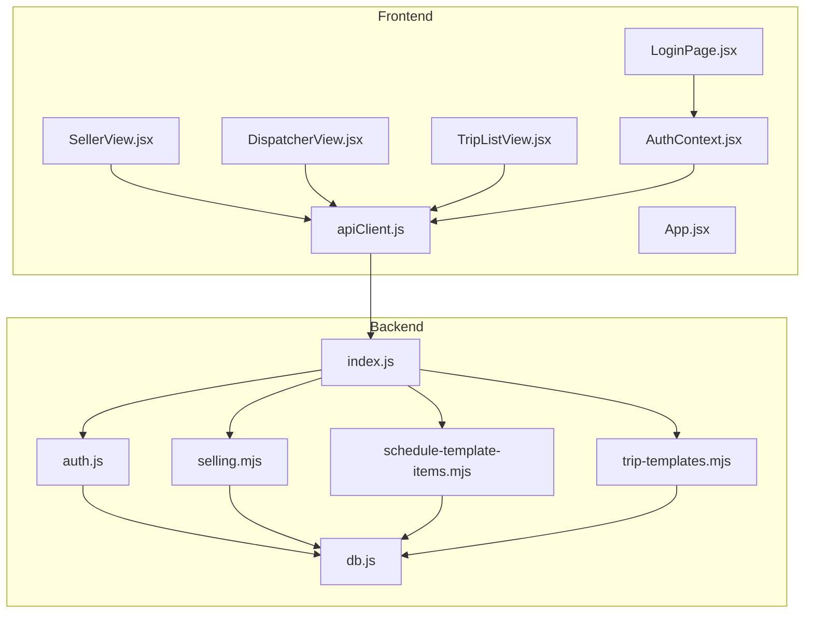
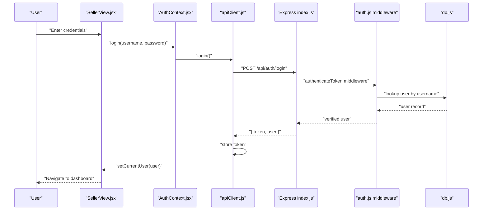
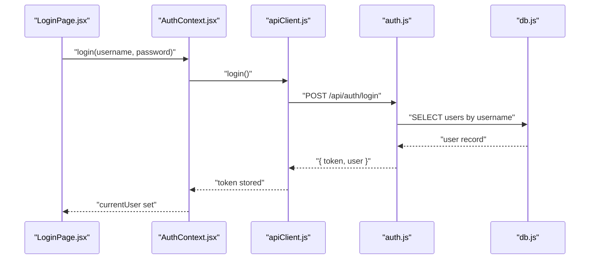
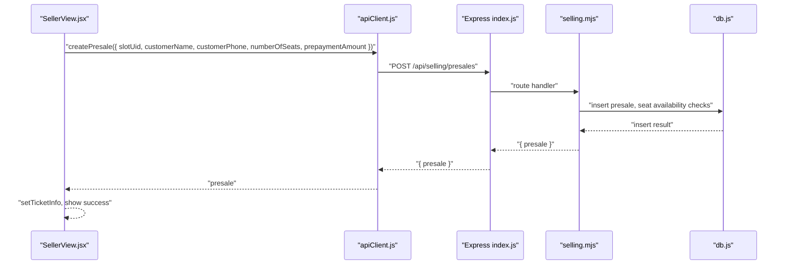
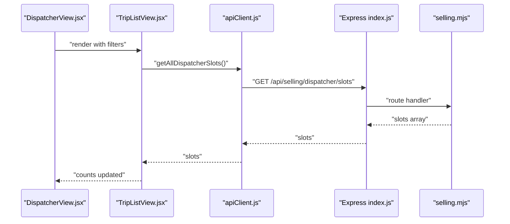
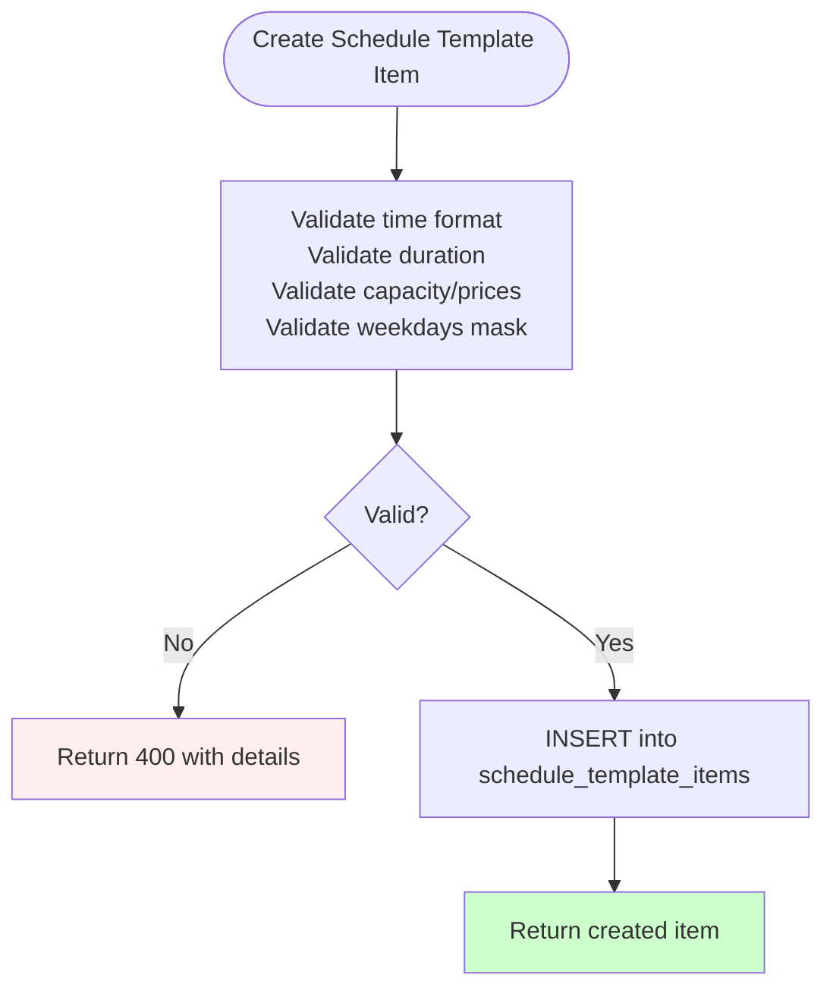
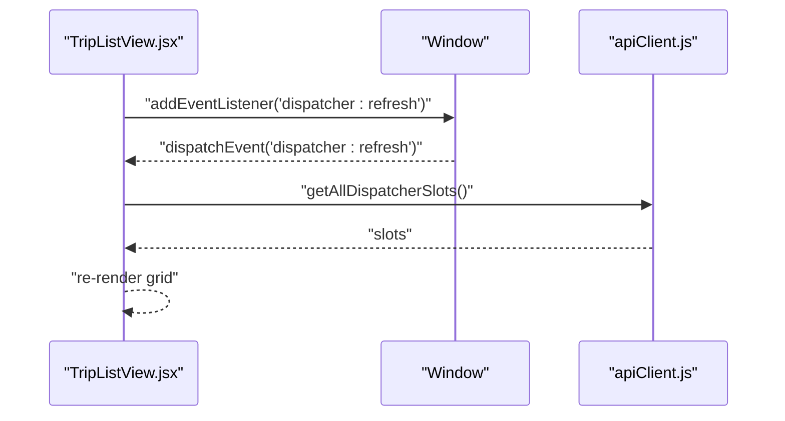
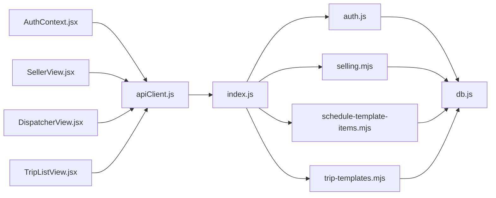

# Data Flow Architecture

<cite>
**Referenced Files in This Document**
- [apiClient.js](file://src/utils/apiClient.js)
- [AuthContext.jsx](file://src/contexts/AuthContext.jsx)
- [index.js](file://server/index.js)
- [auth.js](file://server/auth.js)
- [db.js](file://server/db.js)
- [selling.mjs](file://server/selling.mjs)
- [schedule-template-items.mjs](file://server/schedule-template-items.mjs)
- [trip-templates.mjs](file://server/trip-templates.mjs)
- [LoginPage.jsx](file://src/views/LoginPage.jsx)
- [SellerView.jsx](file://src/views/SellerView.jsx)
- [DispatcherView.jsx](file://src/views/DispatcherView.jsx)
- [TripListView.jsx](file://src/components/dispatcher/TripListView.jsx)
- [App.jsx](file://src/App.jsx)
</cite>

## Table of Contents
1. [Introduction](#introduction)
2. [Project Structure](#project-structure)
3. [Core Components](#core-components)
4. [Architecture Overview](#architecture-overview)
5. [Detailed Component Analysis](#detailed-component-analysis)
6. [Dependency Analysis](#dependency-analysis)
7. [Performance Considerations](#performance-considerations)
8. [Troubleshooting Guide](#troubleshooting-guide)
9. [Conclusion](#conclusion)
10. [Appendices](#appendices)

## Introduction
This document explains the end-to-end data flow for the boat ticket application. It traces how user interactions propagate through the frontend to the backend API, how Express routes process requests and interact with SQLite, and how responses are returned to the UI. It covers authentication using JWT tokens, the request pipeline via the apiClient utility, bidirectional data movement between frontend state and backend persistence, error handling, validation points, and mechanisms for keeping the UI synchronized with backend state.

## Project Structure
The application follows a clear separation of concerns:
- Frontend (React) handles UI, routing, state, and user interactions.
- A shared apiClient encapsulates HTTP requests and JWT token handling.
- Backend (Express) exposes REST-like endpoints under /api, secured by JWT middleware and role-based guards.
- SQLite persists users, boats, slots, presales, tickets, and scheduling metadata.

**Diagram sources**
- [App.jsx](file://src/App.jsx#L40-L136)
- [apiClient.js](file://src/utils/apiClient.js#L1-L360)
- [AuthContext.jsx](file://src/contexts/AuthContext.jsx#L1-L79)
- [index.js](file://server/index.js#L1-L45)
- [auth.js](file://server/auth.js#L1-L154)
- [db.js](file://server/db.js#L1-L1269)
- [selling.mjs](file://server/selling.mjs#L1-L200)
- [schedule-template-items.mjs](file://server/schedule-template-items.mjs#L1-L200)
- [trip-templates.mjs](file://server/trip-templates.mjs#L1-L200)
- [LoginPage.jsx](file://src/views/LoginPage.jsx#L1-L159)
- [SellerView.jsx](file://src/views/SellerView.jsx#L1-L370)
- [DispatcherView.jsx](file://src/views/DispatcherView.jsx#L1-L291)
- [TripListView.jsx](file://src/components/dispatcher/TripListView.jsx#L1-L257)

**Section sources**
- [App.jsx](file://src/App.jsx#L40-L136)
- [apiClient.js](file://src/utils/apiClient.js#L1-L360)
- [AuthContext.jsx](file://src/contexts/AuthContext.jsx#L1-L79)
- [index.js](file://server/index.js#L1-L45)

## Core Components
- apiClient: Centralized HTTP client that injects Authorization headers, parses responses, records network logs, and exposes domain-specific methods for authentication, selling, presales, tickets, and scheduling.
- AuthContext: Provides authentication state, login/logout, and user normalization; integrates with apiClient for token propagation.
- Express server: Mounts routes for selling, auth, schedule templates, trip templates, dispatcher shift ledger, and owner endpoints.
- Authentication middleware: Validates JWT, verifies user activity, and enforces role-based access.
- Database layer: Initializes SQLite, creates tables, seeds roles/users, and provides prepared statements for queries and migrations.

Key responsibilities:
- apiClient manages token retrieval from memory or localStorage, request/response parsing, and centralized error logging.
- AuthContext initializes session on startup by validating token and fetching current user; login stores token and normalizes user shape.
- Backend routes enforce authentication and roles, perform validations, compute derived state (e.g., seats_left), and persist changes to SQLite.

**Section sources**
- [apiClient.js](file://src/utils/apiClient.js#L10-L88)
- [AuthContext.jsx](file://src/contexts/AuthContext.jsx#L19-L78)
- [index.js](file://server/index.js#L20-L45)
- [auth.js](file://server/auth.js#L10-L40)
- [db.js](file://server/db.js#L11-L80)

## Architecture Overview
The system uses a unidirectional data flow augmented by event-driven refreshes:
- UI triggers actions (login, booking, slot updates).
- apiClient sends authenticated requests to Express routes.
- Routes validate inputs, enforce policies, compute derived metrics, and write to SQLite.
- Responses update React state; UI components re-render and may trigger further reads.
- Periodic refreshes and DOM events (e.g., dispatcher:refresh) synchronize UI with backend state.

**Diagram sources**
- [SellerView.jsx](file://src/views/SellerView.jsx#L150-L170)
- [AuthContext.jsx](file://src/contexts/AuthContext.jsx#L55-L63)
- [apiClient.js](file://src/utils/apiClient.js#L91-L98)
- [index.js](file://server/index.js#L25-L26)
- [auth.js](file://server/auth.js#L120-L142)
- [db.js](file://server/db.js#L11-L26)

## Detailed Component Analysis

### Authentication Flow (JWT)
- Frontend login:
  - LoginPage collects credentials and delegates to AuthContext.login.
  - AuthContext.login calls apiClient.login, which posts to /api/auth/login.
  - On success, apiClient stores token; AuthContext sets currentUser.
- Token propagation:
  - apiClient.request automatically attaches Authorization: Bearer <token> if present in memory or localStorage.
- Backend verification:
  - authenticateToken extracts token from Authorization header, verifies signature, loads user from DB, and ensures is_active.
  - Route handlers use role guards (canSell, canDispatchManageSlots, canOwnerAccess) to restrict endpoints.

**Diagram sources**
- [LoginPage.jsx](file://src/views/LoginPage.jsx#L56-L79)
- [AuthContext.jsx](file://src/contexts/AuthContext.jsx#L55-L63)
- [apiClient.js](file://src/utils/apiClient.js#L91-L98)
- [auth.js](file://server/auth.js#L120-L142)
- [db.js](file://server/db.js#L11-L26)

**Section sources**
- [apiClient.js](file://src/utils/apiClient.js#L15-L21)
- [AuthContext.jsx](file://src/contexts/AuthContext.jsx#L23-L48)
- [auth.js](file://server/auth.js#L10-L40)

### Booking and Presale Creation (Seller)
- Workflow:
  - Seller selects boat type, filters trips by date, chooses seats, and confirms.
  - SellerView constructs payload and calls apiClient.createPresale.
  - Backend validates capacity, computes seats_left, and persists presale.
  - UI receives presale and optionally refreshes owner dashboard.

**Diagram sources**
- [SellerView.jsx](file://src/views/SellerView.jsx#L150-L170)
- [apiClient.js](file://src/utils/apiClient.js#L166-L168)
- [index.js](file://server/index.js#L25-L26)
- [selling.mjs](file://server/selling.mjs#L1-L200)
- [db.js](file://server/db.js#L11-L26)

**Section sources**
- [SellerView.jsx](file://src/views/SellerView.jsx#L150-L170)
- [apiClient.js](file://src/utils/apiClient.js#L166-L168)
- [selling.mjs](file://server/selling.mjs#L52-L94)

### Dispatcher Slot Management
- DispatcherView aggregates filters and delegates to TripListView.
- TripListView loads all dispatcher slots via apiClient.getAllDispatcherSlots.
- Filters include date range, type, status, and search term; sorting is applied client-side.
- Refresh events trigger reloads without page navigation.

**Diagram sources**
- [DispatcherView.jsx](file://src/views/DispatcherView.jsx#L23-L77)
- [TripListView.jsx](file://src/components/dispatcher/TripListView.jsx#L85-L98)
- [apiClient.js](file://src/utils/apiClient.js#L126-L128)
- [index.js](file://server/index.js#L25-L26)
- [selling.mjs](file://server/selling.mjs#L1-L200)

**Section sources**
- [TripListView.jsx](file://src/components/dispatcher/TripListView.jsx#L85-L105)
- [apiClient.js](file://src/utils/apiClient.js#L126-L128)

### Schedule Templates and Trip Templates
- Schedule Template Items:
  - GET /api/selling/schedule-template-items returns items with formatted weekdays.
  - POST validates time format, duration, capacity, prices, and weekdays mask; inserts item.
- Trip Templates:
  - GET /api/selling/trip-templates/templates lists templates.
  - POST validates and inserts a new template; PATCH updates fields with validation.

**Diagram sources**
- [schedule-template-items.mjs](file://server/schedule-template-items.mjs#L127-L200)
- [trip-templates.mjs](file://server/trip-templates.mjs#L95-L174)

**Section sources**
- [schedule-template-items.mjs](file://server/schedule-template-items.mjs#L66-L90)
- [trip-templates.mjs](file://server/trip-templates.mjs#L49-L64)

### Real-Time Updates and UI Synchronization
- Event-driven refresh:
  - TripListView listens for a custom event dispatcher:refresh and reloads slots.
- Owner dashboard refresh:
  - After successful presale creation, SellerView calls refreshOwnerData to update owner metrics.

**Diagram sources**
- [TripListView.jsx](file://src/components/dispatcher/TripListView.jsx#L100-L105)
- [apiClient.js](file://src/utils/apiClient.js#L126-L128)

**Section sources**
- [TripListView.jsx](file://src/components/dispatcher/TripListView.jsx#L100-L105)
- [SellerView.jsx](file://src/views/SellerView.jsx#L158-L161)

## Dependency Analysis
- Frontend depends on:
  - apiClient for all HTTP interactions.
  - AuthContext for authentication state and token propagation.
  - Router/App for protected routes and role-based navigation.
- Backend depends on:
  - Express for routing and middleware.
  - auth.js for JWT verification and role guards.
  - db.js for database initialization, migrations, and prepared statements.

**Diagram sources**
- [apiClient.js](file://src/utils/apiClient.js#L1-L360)
- [AuthContext.jsx](file://src/contexts/AuthContext.jsx#L1-L79)
- [index.js](file://server/index.js#L1-L45)
- [auth.js](file://server/auth.js#L1-L154)
- [db.js](file://server/db.js#L1-L1269)
- [selling.mjs](file://server/selling.mjs#L1-L200)
- [schedule-template-items.mjs](file://server/schedule-template-items.mjs#L1-L200)
- [trip-templates.mjs](file://server/trip-templates.mjs#L1-L200)
- [SellerView.jsx](file://src/views/SellerView.jsx#L1-L370)
- [DispatcherView.jsx](file://src/views/DispatcherView.jsx#L1-L291)
- [TripListView.jsx](file://src/components/dispatcher/TripListView.jsx#L1-L257)

**Section sources**
- [App.jsx](file://src/App.jsx#L40-L136)
- [index.js](file://server/index.js#L20-L45)

## Performance Considerations
- Network logging:
  - apiClient.request records response time, status, and bodies for diagnostics.
- Seat availability computation:
  - Backend recomputes seats_left from tickets for accuracy; caches are updated to keep UI consistent.
- Validation early exits:
  - Route handlers validate inputs and roles early to avoid unnecessary DB work.
- UI filtering:
  - Client-side filtering reduces server load but can be optimized with server-side pagination/search for large datasets.

[No sources needed since this section provides general guidance]

## Troubleshooting Guide
- Login failures:
  - Verify credentials and account activation; inspect network logs recorded by apiClient.
- Token errors:
  - Ensure Authorization header is present; check token validity and role permissions.
- Capacity exceeded:
  - Backend throws explicit errors when requested seats exceed free capacity; UI should surface user-friendly messages.
- Seat counts mismatch:
  - Backend recomputes seats_left from tickets; if discrepancies occur, investigate presale transfers or ledger entries.

**Section sources**
- [apiClient.js](file://src/utils/apiClient.js#L53-L87)
- [auth.js](file://server/auth.js#L17-L35)
- [selling.mjs](file://server/selling.mjs#L52-L94)

## Conclusion
The application implements a robust, layered architecture where the frontend communicates through a unified apiClient, backed by Express routes secured with JWT and role-based guards. SQLite serves as the single source of truth, with careful validation and derived-state computations ensuring data integrity. The UI remains responsive through event-driven refreshes and centralized state management, while error handling and logging provide visibility into failures.

[No sources needed since this section summarizes without analyzing specific files]

## Appendices

### API Surface Summary
- Authentication
  - POST /api/auth/login
  - GET /api/auth/me
- Selling
  - GET /api/selling/dispatcher/slots
  - POST /api/selling/presales
  - PATCH /api/selling/presales/:id/accept-payment
  - PATCH /api/selling/presales/:id/cancel-trip-pending
  - PATCH /api/selling/presales/:id/transfer
  - PATCH /api/selling/presales/:id/payment
  - PATCH /api/selling/presales/:id/cancel
  - PATCH /api/selling/presales/:id/move
  - PATCH /api/selling/presales/:id/seats
  - PATCH /api/selling/presales/:id/used
  - PATCH /api/selling/presales/:id/refund
  - PATCH /api/selling/presales/:id/delete
  - GET /api/selling/presales/:id/tickets
  - GET /api/selling/slots/:id/tickets
  - PATCH /api/selling/tickets/:id/used
  - PATCH /api/selling/tickets/:id/refund
  - PATCH /api/selling/tickets/:id/delete
  - PATCH /api/selling/tickets/:id/transfer
  - GET /api/selling/transfer-options
- Schedule Templates
  - GET /api/selling/schedule-templates
  - POST /api/selling/schedule-templates
  - PATCH /api/selling/schedule-templates/:id
  - DELETE /api/selling/schedule-templates/:id
  - GET /api/selling/schedule-template-items
  - POST /api/selling/schedule-template-items
  - PATCH /api/selling/schedule-template-items/:id
  - DELETE /api/selling/schedule-template-items/:id?delete_future_trips=1
  - POST /api/selling/schedule-template-items/generate
- Trip Templates
  - GET /api/selling/trip-templates/templates
  - GET /api/selling/trip-templates/templates/:id
  - POST /api/selling/trip-templates/templates
  - PATCH /api/selling/trip-templates/templates/:id
  - DELETE /api/selling/trip-templates/templates/:id

**Section sources**
- [apiClient.js](file://src/utils/apiClient.js#L90-L358)
- [index.js](file://server/index.js#L25-L40)