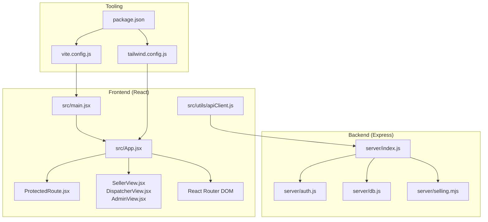
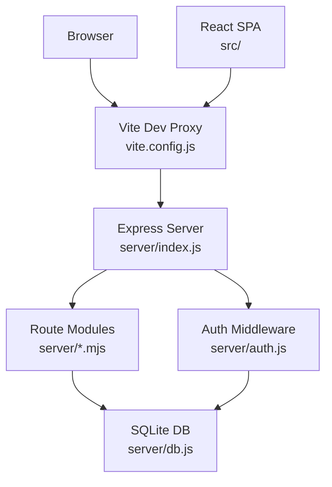
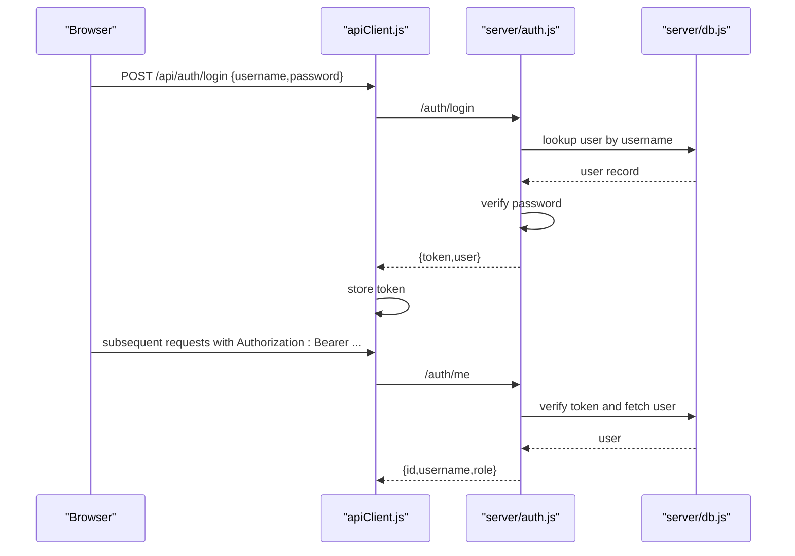
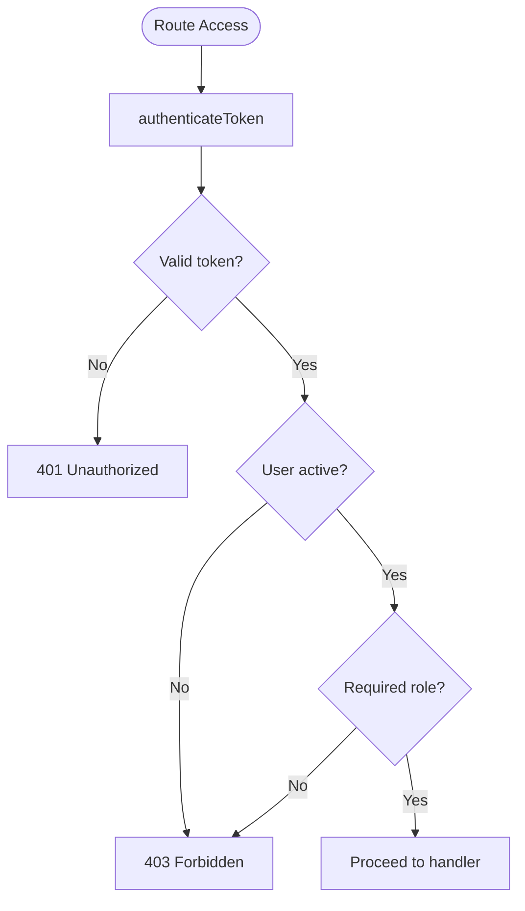
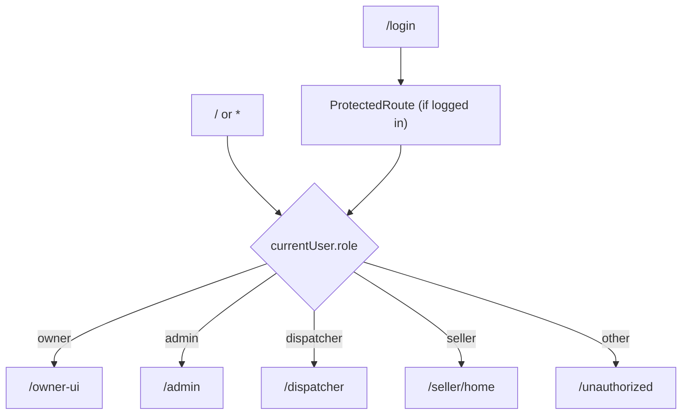
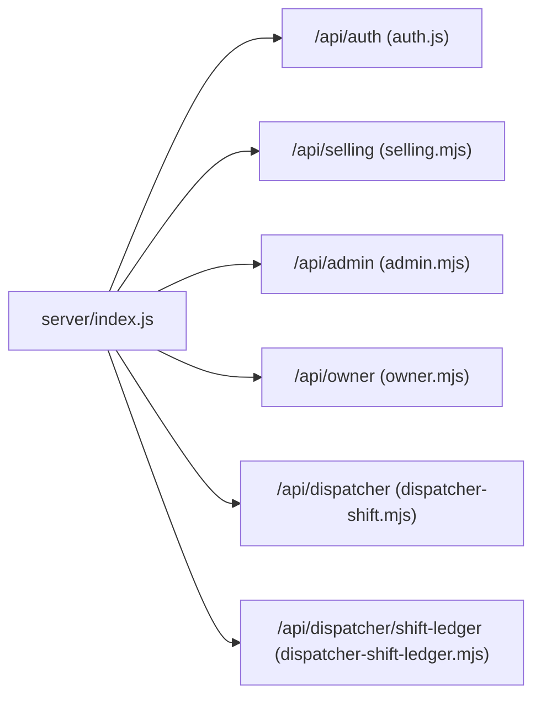
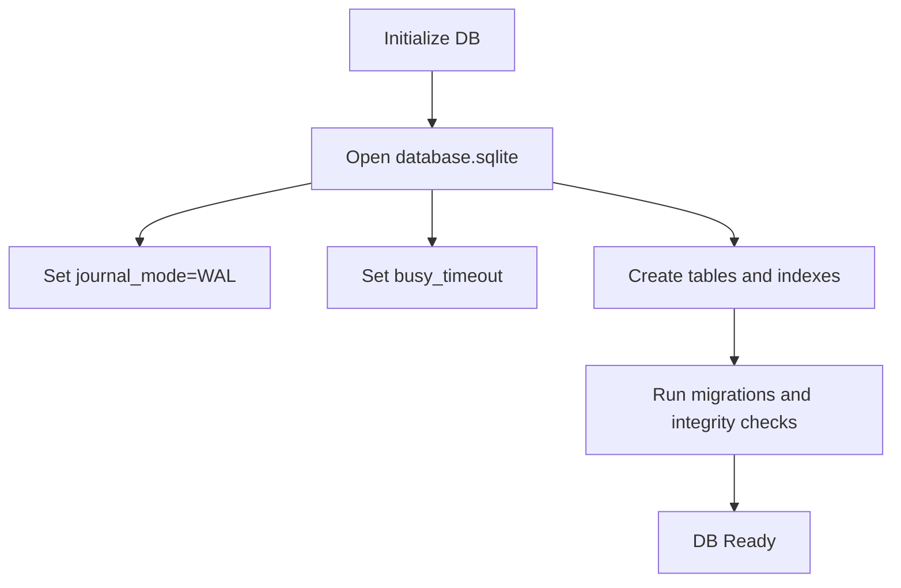
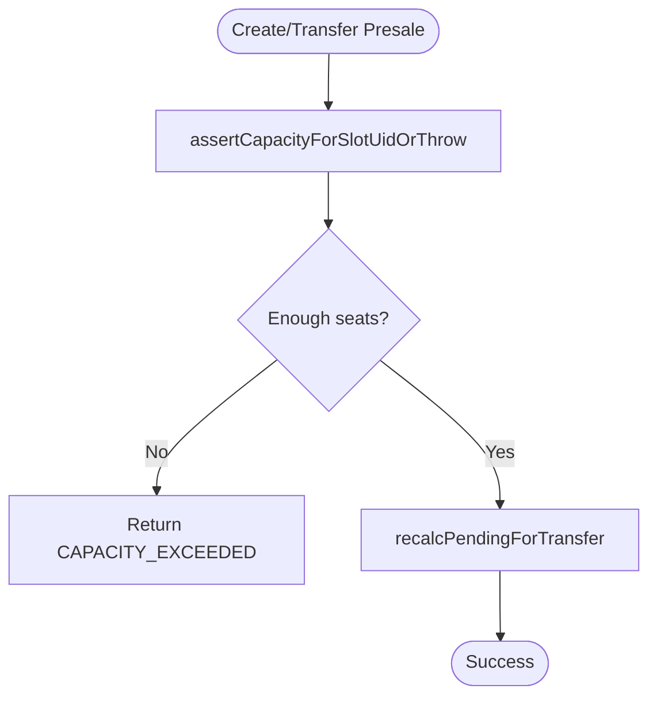
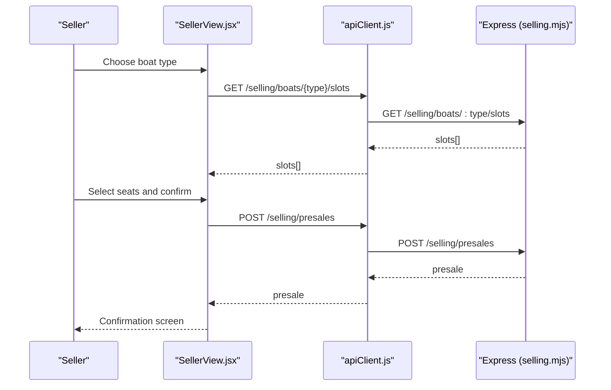
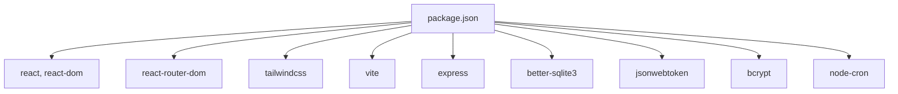

# System Design

<cite>
**Referenced Files in This Document**
- [package.json](file://package.json)
- [README.md](file://README.md)
- [server/index.js](file://server/index.js)
- [server/auth.js](file://server/auth.js)
- [server/db.js](file://server/db.js)
- [server/selling.mjs](file://server/selling.mjs)
- [src/main.jsx](file://src/main.jsx)
- [src/App.jsx](file://src/App.jsx)
- [src/components/ProtectedRoute.jsx](file://src/components/ProtectedRoute.jsx)
- [src/views/LandingPage.jsx](file://src/views/LandingPage.jsx)
- [src/views/SellerView.jsx](file://src/views/SellerView.jsx)
- [src/views/DispatcherView.jsx](file://src/views/DispatcherView.jsx)
- [src/views/AdminView.jsx](file://src/views/AdminView.jsx)
- [src/utils/apiClient.js](file://src/utils/apiClient.js)
- [vite.config.js](file://vite.config.js)
- [tailwind.config.js](file://tailwind.config.js)
</cite>

## Table of Contents
1. [Introduction](#introduction)
2. [Project Structure](#project-structure)
3. [Core Components](#core-components)
4. [Architecture Overview](#architecture-overview)
5. [Detailed Component Analysis](#detailed-component-analysis)
6. [Dependency Analysis](#dependency-analysis)
7. [Performance Considerations](#performance-considerations)
8. [Troubleshooting Guide](#troubleshooting-guide)
9. [Conclusion](#conclusion)
10. [Appendices](#appendices)

## Introduction
This document describes the system design of the boat ticket application. It follows an MVC-like separation of concerns:
- Presentation layer (React): Handles UI composition, routing, and user interactions.
- Business logic layer (Express): Implements route handlers and middleware for authentication, authorization, and domain operations.
- Data persistence layer (SQLite): Provides structured storage for users, trips, slots, and related entities.

The system enforces role-based access control (RBAC), integrates a modular backend with route handlers, and uses Vite for development/build, Tailwind CSS for styling, and better-sqlite3 for database operations. The document also covers scalability considerations, performance characteristics, and deployment topology.

## Project Structure
The repository is organized into:
- Frontend (React + Vite): src/ for components, views, contexts, and utilities; vite.config.js for dev/proxy; tailwind.config.js for styling.
- Backend (Express): server/ for route modules, middleware, and database initialization.
- Root scripts and configs for development, linting, and build.

**Diagram sources**
- [server/index.js](file://server/index.js#L1-L45)
- [server/auth.js](file://server/auth.js#L1-L154)
- [server/db.js](file://server/db.js#L1-L120)
- [server/selling.mjs](file://server/selling.mjs#L1-L200)
- [src/main.jsx](file://src/main.jsx#L1-L26)
- [src/App.jsx](file://src/App.jsx#L1-L139)
- [src/components/ProtectedRoute.jsx](file://src/components/ProtectedRoute.jsx#L1-L38)
- [src/views/SellerView.jsx](file://src/views/SellerView.jsx#L1-L370)
- [src/views/DispatcherView.jsx](file://src/views/DispatcherView.jsx#L1-L291)
- [src/views/AdminView.jsx](file://src/views/AdminView.jsx#L1-L382)
- [src/utils/apiClient.js](file://src/utils/apiClient.js#L1-L360)
- [vite.config.js](file://vite.config.js#L1-L25)
- [tailwind.config.js](file://tailwind.config.js#L1-L12)
- [package.json](file://package.json#L1-L41)

**Section sources**
- [README.md](file://README.md#L1-L150)
- [package.json](file://package.json#L1-L41)
- [vite.config.js](file://vite.config.js#L1-L25)
- [tailwind.config.js](file://tailwind.config.js#L1-L12)

## Core Components
- Frontend entry and routing:
  - Application bootstrap initializes React, Router, and Auth provider.
  - App defines protected routes per role and redirects unauthenticated users.
- Authentication and RBAC:
  - JWT-based authentication with middleware validating tokens and enforcing role gates.
- Backend modular routes:
  - Central Express server mounts route modules for selling, auth, admin, owner, dispatcher, and others.
- Data persistence:
  - SQLite database initialized with better-sqlite3; schema migrations and integrity checks handled at startup.

Key implementation references:
- Frontend bootstrap and provider wiring: [src/main.jsx](file://src/main.jsx#L1-L26)
- Routing and role-based protection: [src/App.jsx](file://src/App.jsx#L1-L139), [src/components/ProtectedRoute.jsx](file://src/components/ProtectedRoute.jsx#L1-L38)
- Authentication middleware and guards: [server/auth.js](file://server/auth.js#L1-L154)
- Backend mounting and route modules: [server/index.js](file://server/index.js#L1-L45)
- Database initialization and migrations: [server/db.js](file://server/db.js#L1-L120)
- Selling/business logic module: [server/selling.mjs](file://server/selling.mjs#L1-L200)

**Section sources**
- [src/main.jsx](file://src/main.jsx#L1-L26)
- [src/App.jsx](file://src/App.jsx#L1-L139)
- [src/components/ProtectedRoute.jsx](file://src/components/ProtectedRoute.jsx#L1-L38)
- [server/auth.js](file://server/auth.js#L1-L154)
- [server/index.js](file://server/index.js#L1-L45)
- [server/db.js](file://server/db.js#L1-L120)
- [server/selling.mjs](file://server/selling.mjs#L1-L200)

## Architecture Overview
The system follows a layered architecture:
- Presentation layer (React):
  - Views orchestrate user flows (seller, dispatcher, admin).
  - ProtectedRoute enforces role-based access.
  - apiClient abstracts backend calls and token propagation.
- Business logic layer (Express):
  - Route modules encapsulate domain operations (selling, dispatching, admin).
  - Middleware handles authentication and authorization.
- Data persistence layer (SQLite):
  - Single-file database with WAL mode and pragmas for concurrency.
  - Schema migrations and integrity safeguards on startup.

**Diagram sources**
- [vite.config.js](file://vite.config.js#L1-L25)
- [server/index.js](file://server/index.js#L1-L45)
- [server/auth.js](file://server/auth.js#L1-L154)
- [server/db.js](file://server/db.js#L1-L120)
- [src/utils/apiClient.js](file://src/utils/apiClient.js#L1-L360)

## Detailed Component Analysis

### Authentication and RBAC
- Token lifecycle:
  - Login endpoint validates credentials and issues JWT.
  - Subsequent requests propagate Authorization header to backend.
  - /me endpoint returns current user profile.
- Role enforcement:
  - authenticateToken verifies JWT and active user status.
  - Role-specific guards restrict access to admin, owner, seller, dispatcher routes.
- Password handling:
  - Supports bcrypt or bcryptjs fallback; tolerates plain-text for development.

**Diagram sources**
- [src/utils/apiClient.js](file://src/utils/apiClient.js#L90-L104)
- [server/auth.js](file://server/auth.js#L120-L151)
- [server/db.js](file://server/db.js#L1-L120)

**Section sources**
- [server/auth.js](file://server/auth.js#L1-L154)
- [src/utils/apiClient.js](file://src/utils/apiClient.js#L90-L104)

### Role-Based Access Control (RBAC)
- Frontend:
  - ProtectedRoute enforces requiredRole and allows owner to access owner UI.
- Backend:
  - authenticateToken middleware sets req.user.
  - Role guards (isAdmin, canSell, canDispatchManageSlots, canOwnerAccess, canOwnerOrAdmin) protect routes.

**Diagram sources**
- [server/auth.js](file://server/auth.js#L10-L71)
- [src/components/ProtectedRoute.jsx](file://src/components/ProtectedRoute.jsx#L4-L35)

**Section sources**
- [src/components/ProtectedRoute.jsx](file://src/components/ProtectedRoute.jsx#L1-L38)
- [server/auth.js](file://server/auth.js#L42-L71)

### Routing Architecture (React Router DOM)
- App defines public and protected routes:
  - Public: /login, /unauthorized
  - Protected: /seller/*, /dispatcher/*, /admin/*, /owner-ui/*
- RoleHomeRedirect navigates users to role-specific home pages.
- ProtectedRoute enforces role-based access and owner exceptions.

**Diagram sources**
- [src/App.jsx](file://src/App.jsx#L24-L50)
- [src/views/LandingPage.jsx](file://src/views/LandingPage.jsx#L1-L35)
- [src/components/ProtectedRoute.jsx](file://src/components/ProtectedRoute.jsx#L4-L35)

**Section sources**
- [src/App.jsx](file://src/App.jsx#L1-L139)
- [src/views/LandingPage.jsx](file://src/views/LandingPage.jsx#L1-L35)
- [src/components/ProtectedRoute.jsx](file://src/components/ProtectedRoute.jsx#L1-L38)

### Backend Modular Design
- server/index.js mounts route modules under /api/* namespaces:
  - /api/auth (authentication)
  - /api/selling (trips, slots, presales, tickets)
  - /api/admin (admin stats and user management)
  - /api/owner (owner UI data)
  - /api/dispatcher (dispatcher shift ledger and shift routes)
- Each module exports an Express router and is mounted by the central server.

**Diagram sources**
- [server/index.js](file://server/index.js#L6-L40)

**Section sources**
- [server/index.js](file://server/index.js#L1-L45)

### Data Persistence Layer (SQLite)
- Database initialization:
  - better-sqlite3 opens database.sqlite in project root.
  - WAL mode and busy_timeout configured for concurrency.
- Schema and migrations:
  - Creates tables for users, boats, boat_slots, presales, tickets, schedule templates, and generated slots.
  - Applies one-time and lightweight migrations to normalize data and add columns.
- Data integrity:
  - Pragmas and indexes improve reliability and performance.

**Diagram sources**
- [server/db.js](file://server/db.js#L11-L36)
- [server/db.js](file://server/db.js#L39-L120)

**Section sources**
- [server/db.js](file://server/db.js#L1-L120)

### Business Logic Module (Selling)
- Seat availability and capacity checks:
  - Validates requested seats against capacity and occupied seats.
  - Syncs seats_left cache for both manual and generated slots.
- Money ledger recalculations:
  - Recalculate pending expectations after transfers.
- Time validation helpers:
  - Enforces time format and operational hours.

**Diagram sources**
- [server/selling.mjs](file://server/selling.mjs#L52-L94)
- [server/selling.mjs](file://server/selling.mjs#L106-L150)

**Section sources**
- [server/selling.mjs](file://server/selling.mjs#L1-L200)

### Frontend Views and Flows
- Seller flow:
  - Stepwise journey: SelectBoatType → SelectTrip → SelectSeats → ConfirmationScreen.
  - Uses apiClient to fetch slots, create presales, and refresh owner data.
- Dispatcher view:
  - Tabbed interface for trips, selling, slot management, maps, and shift close.
  - Filters by date range, type, status, and search term.
- Admin view:
  - Dashboard statistics, seller performance, boat management, working zone map, and user management.

**Diagram sources**
- [src/views/SellerView.jsx](file://src/views/SellerView.jsx#L127-L170)
- [src/utils/apiClient.js](file://src/utils/apiClient.js#L166-L168)
- [server/selling.mjs](file://server/selling.mjs#L1-L200)

**Section sources**
- [src/views/SellerView.jsx](file://src/views/SellerView.jsx#L1-L370)
- [src/views/DispatcherView.jsx](file://src/views/DispatcherView.jsx#L1-L291)
- [src/views/AdminView.jsx](file://src/views/AdminView.jsx#L1-L382)
- [src/utils/apiClient.js](file://src/utils/apiClient.js#L105-L164)

## Dependency Analysis
- Technology stack:
  - Frontend: React, React Router DOM, Tailwind CSS, Vite.
  - Backend: Express, better-sqlite3, bcrypt, jsonwebtoken, node-cron.
- Tooling and configs:
  - Vite config proxies /api to backend and forwards Authorization header.
  - Tailwind scans src/**/* for class usage.

**Diagram sources**
- [package.json](file://package.json#L15-L39)

**Section sources**
- [package.json](file://package.json#L1-L41)
- [vite.config.js](file://vite.config.js#L1-L25)
- [tailwind.config.js](file://tailwind.config.js#L1-L12)

## Performance Considerations
- Database:
  - WAL mode improves concurrent reads/writes.
  - busy_timeout reduces deadlocks under contention.
  - Indexes and unique constraints on generated_slots reduce duplicate entries and improve lookups.
- Frontend:
  - Vite’s fast refresh and proxy reduce dev iteration latency.
  - Tailwind’s purgeable class scanning keeps bundle sizes manageable.
- Backend:
  - Modular route handlers keep middleware and handlers focused.
  - Token verification and role checks short-circuit unauthorized requests early.

[No sources needed since this section provides general guidance]

## Troubleshooting Guide
- Authentication failures:
  - Verify JWT_SECRET environment variable and token validity.
  - Ensure user is active and credentials match stored hash.
- Capacity errors:
  - CAPACITY_EXCEEDED indicates requested seats exceed free capacity; review seat calculations and caches.
- Database initialization:
  - Check database.sqlite path and permissions; ensure migrations succeeded.

**Section sources**
- [server/auth.js](file://server/auth.js#L10-L40)
- [server/selling.mjs](file://server/selling.mjs#L52-L94)
- [server/db.js](file://server/db.js#L11-L36)

## Conclusion
The boat ticket application implements a clean separation of concerns with a React frontend, Express backend, and SQLite persistence. Role-based access control is enforced at both frontend and backend layers. The modular backend design simplifies maintenance and extensibility. With Vite and Tailwind, the development experience is efficient and styling is consistent. The system is suitable for small-scale deployments and can be scaled horizontally by adding load balancers and scaling the backend nodes while keeping the single-file SQLite database for simplicity.

[No sources needed since this section summarizes without analyzing specific files]

## Appendices

### System Boundaries and Integration Points
- Internal boundaries:
  - Frontend SPA communicates with backend via /api/* endpoints.
  - Backend modules encapsulate domain logic and share a single database connection.
- External dependencies:
  - better-sqlite3 for local database.
  - bcrypt/bcryptjs for password hashing.
  - jsonwebtoken for token signing/verification.
  - node-cron for scheduled tasks.

**Section sources**
- [server/db.js](file://server/db.js#L1-L120)
- [server/auth.js](file://server/auth.js#L73-L113)
- [package.json](file://package.json#L15-L39)