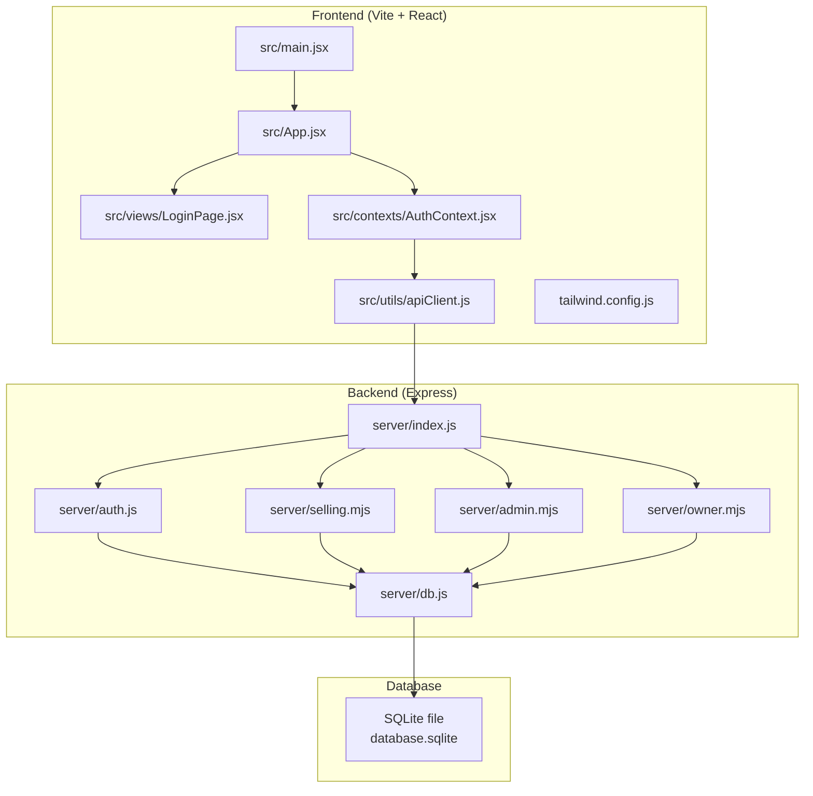
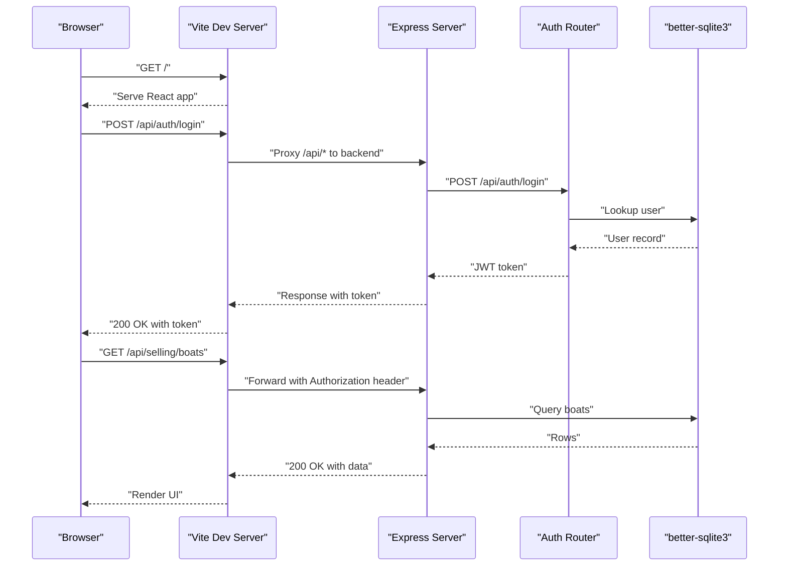
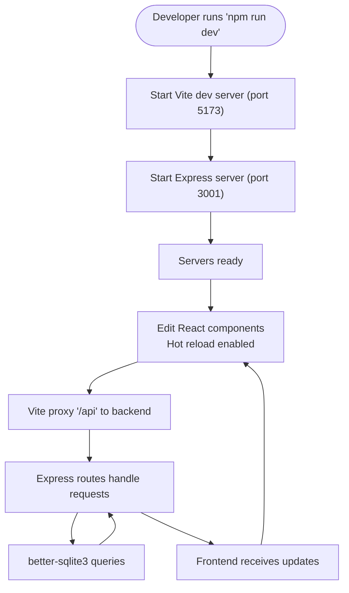
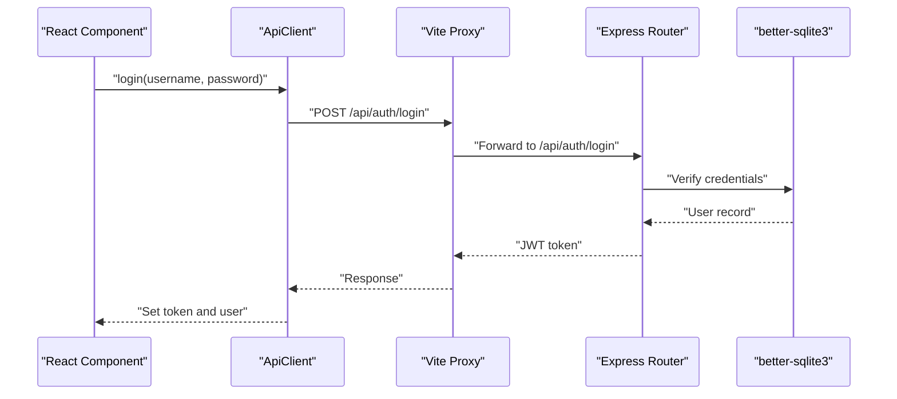
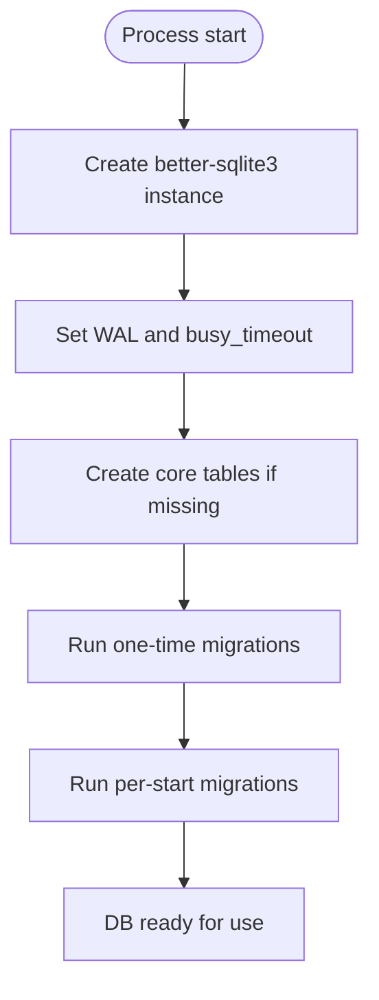
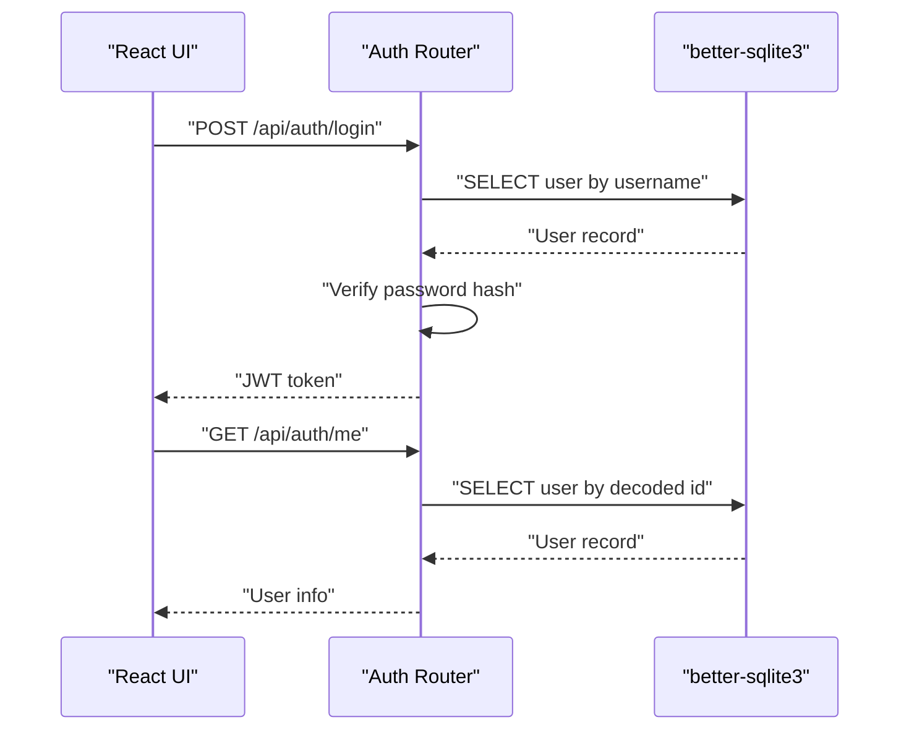
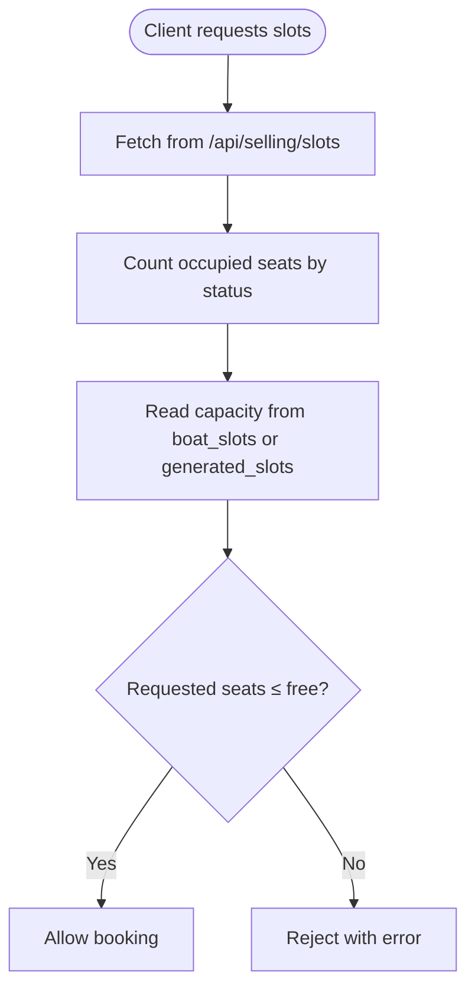
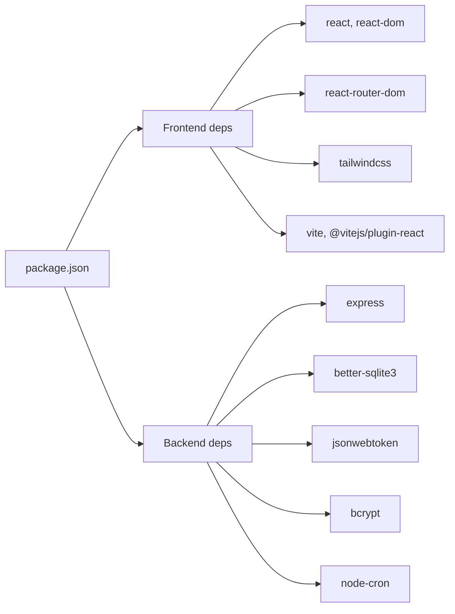

# Technology Integration

<cite>
**Referenced Files in This Document**
- [package.json](file://package.json)
- [vite.config.js](file://vite.config.js)
- [server/index.js](file://server/index.js)
- [server/db.js](file://server/db.js)
- [server/auth.js](file://server/auth.js)
- [server/selling.mjs](file://server/selling.mjs)
- [server/admin.mjs](file://server/admin.mjs)
- [server/owner.mjs](file://server/owner.mjs)
- [src/main.jsx](file://src/main.jsx)
- [src/App.jsx](file://src/App.jsx)
- [src/views/LoginPage.jsx](file://src/views/LoginPage.jsx)
- [src/contexts/AuthContext.jsx](file://src/contexts/AuthContext.jsx)
- [src/utils/apiClient.js](file://src/utils/apiClient.js)
- [src/views/SellerView.jsx](file://src/views/SellerView.jsx)
- [src/utils/dateUtils.js](file://src/utils/dateUtils.js)
- [src/utils/currency.js](file://src/utils/currency.js)
- [tailwind.config.js](file://tailwind.config.js)
- [README.md](file://README.md)
- [init_db.js](file://init_db.js)
</cite>

## Table of Contents
1. [Introduction](#introduction)
2. [Project Structure](#project-structure)
3. [Core Components](#core-components)
4. [Architecture Overview](#architecture-overview)
5. [Detailed Component Analysis](#detailed-component-analysis)
6. [Dependency Analysis](#dependency-analysis)
7. [Performance Considerations](#performance-considerations)
8. [Troubleshooting Guide](#troubleshooting-guide)
9. [Conclusion](#conclusion)

## Introduction
This document explains how the boat ticket application integrates React, Express, SQLite, and supporting technologies into a cohesive system. It covers:
- Vite’s development and build pipeline and how it connects to React
- Tailwind CSS integration with React components
- Frontend API client and backend route alignment
- Database integration with better-sqlite3, including initialization, migrations, and data access patterns
- Third-party dependency management and version compatibility
- How the pieces fit together to deliver the application’s features

## Project Structure
The project follows a clear separation of concerns:
- Frontend: React SPA bootstrapped via Vite, styled with Tailwind CSS, and routed with React Router
- Backend: Node.js + Express REST API with modular route handlers
- Database: SQLite file-backed via better-sqlite3, with robust initialization and migration logic
- Utilities: Shared helpers for dates, currency, and API communication

**Diagram sources**
- [src/main.jsx](file://src/main.jsx#L1-L26)
- [src/App.jsx](file://src/App.jsx#L1-L139)
- [src/views/LoginPage.jsx](file://src/views/LoginPage.jsx#L1-L159)
- [src/contexts/AuthContext.jsx](file://src/contexts/AuthContext.jsx#L1-L79)
- [src/utils/apiClient.js](file://src/utils/apiClient.js#L1-L360)
- [server/index.js](file://server/index.js#L1-L45)
- [server/auth.js](file://server/auth.js#L1-L154)
- [server/selling.mjs](file://server/selling.mjs#L1-L200)
- [server/admin.mjs](file://server/admin.mjs#L1-L200)
- [server/owner.mjs](file://server/owner.mjs#L1-L200)
- [server/db.js](file://server/db.js#L1-L1269)
- [tailwind.config.js](file://tailwind.config.js#L1-L12)

**Section sources**
- [README.md](file://README.md#L1-L150)
- [package.json](file://package.json#L1-L41)
- [vite.config.js](file://vite.config.js#L1-L25)
- [tailwind.config.js](file://tailwind.config.js#L1-L12)

## Core Components
- React + Vite: SPA bootstrap, routing, and development server with hot reload
- Tailwind CSS: Utility-first styling integrated via Vite and configured for content paths
- Express: Modular route handlers for authentication, selling, administration, and owner dashboards
- better-sqlite3: SQLite driver with initialization, pragmas, and extensive migrations
- API client: Centralized HTTP client with token propagation and structured logging

**Section sources**
- [src/main.jsx](file://src/main.jsx#L1-L26)
- [src/App.jsx](file://src/App.jsx#L1-L139)
- [src/views/LoginPage.jsx](file://src/views/LoginPage.jsx#L1-L159)
- [src/contexts/AuthContext.jsx](file://src/contexts/AuthContext.jsx#L1-L79)
- [src/utils/apiClient.js](file://src/utils/apiClient.js#L1-L360)
- [server/index.js](file://server/index.js#L1-L45)
- [server/db.js](file://server/db.js#L1-L1269)

## Architecture Overview
The system uses a thin-client architecture:
- Frontend (React) communicates with backend (Express) via REST endpoints under /api
- Authentication is JWT-based; tokens are stored in localStorage and forwarded automatically
- Database operations are encapsulated in the backend with careful SQL and migrations
- Vite proxies /api requests to the backend during development

**Diagram sources**
- [vite.config.js](file://vite.config.js#L1-L25)
- [server/index.js](file://server/index.js#L1-L45)
- [server/auth.js](file://server/auth.js#L1-L154)
- [server/db.js](file://server/db.js#L1-L1269)
- [src/utils/apiClient.js](file://src/utils/apiClient.js#L1-L360)

## Detailed Component Analysis

### Vite Build System and React Development Workflow
- Vite plugin chain includes React fast-refresh and JSX transforms
- Development server runs on localhost:5173 with strict port enforcement
- Proxy configuration forwards /api requests to the backend (localhost:3001) and preserves Authorization headers
- Scripts orchestrate concurrent frontend and backend startup for development

**Diagram sources**
- [vite.config.js](file://vite.config.js#L1-L25)
- [package.json](file://package.json#L1-L41)

**Section sources**
- [vite.config.js](file://vite.config.js#L1-L25)
- [package.json](file://package.json#L1-L41)

### Tailwind CSS Integration with React
- Tailwind is configured to scan HTML and all JS/TSX files under src/**
- Utility classes are applied directly in React components (e.g., LoginPage)
- The approach keeps styling close to components while enabling global design tokens

**Section sources**
- [tailwind.config.js](file://tailwind.config.js#L1-L12)
- [src/views/LoginPage.jsx](file://src/views/LoginPage.jsx#L80-L159)

### Frontend API Client and Backend Route Alignment
- The API client centralizes base URL (/api), token propagation, and response parsing
- Routes are mounted under /api in Express and aligned with client method names (e.g., /api/selling/*, /api/auth/*)
- Authentication middleware enforces protected endpoints and decodes JWTs

**Diagram sources**
- [src/utils/apiClient.js](file://src/utils/apiClient.js#L1-L360)
- [server/index.js](file://server/index.js#L1-L45)
- [server/auth.js](file://server/auth.js#L1-L154)
- [server/db.js](file://server/db.js#L1-L1269)
- [vite.config.js](file://vite.config.js#L1-L25)

**Section sources**
- [src/utils/apiClient.js](file://src/utils/apiClient.js#L1-L360)
- [server/index.js](file://server/index.js#L1-L45)
- [server/auth.js](file://server/auth.js#L1-L154)

### Database Integration with better-sqlite3
- Initialization sets journal mode WAL and a busy timeout for concurrency
- Robust schema initialization and one-time/per-run migrations ensure schema stability
- Migration logic handles column additions, data normalization, and unique constraints
- Data access patterns use prepared statements and helper functions for seat availability and capacity checks

**Diagram sources**
- [server/db.js](file://server/db.js#L1-L1269)

**Section sources**
- [server/db.js](file://server/db.js#L1-L1269)
- [init_db.js](file://init_db.js#L1-L8)

### Authentication and Authorization
- JWT-based login validates credentials against the database and returns a signed token
- Middleware verifies tokens and attaches user info to requests
- Role-based guards restrict access to admin and owner endpoints

**Diagram sources**
- [server/auth.js](file://server/auth.js#L1-L154)
- [server/db.js](file://server/db.js#L1-L1269)

**Section sources**
- [server/auth.js](file://server/auth.js#L1-L154)
- [server/db.js](file://server/db.js#L1-L1269)

### Selling and Slot Management
- Seat availability and capacity checks are enforced with precise SQL queries
- For generated slots, occupancy is computed from presales to avoid cache drift
- Endpoints expose slots, boats, presales, and ticket operations

**Diagram sources**
- [server/selling.mjs](file://server/selling.mjs#L1-L200)
- [server/db.js](file://server/db.js#L1-L1269)

**Section sources**
- [server/selling.mjs](file://server/selling.mjs#L1-L200)
- [server/db.js](file://server/db.js#L1-L1269)

### Owner Dashboard and Reporting
- Owner endpoints compute revenue, cash/card totals, and pending amounts using SQL aggregates
- Flexible date ranges and “last nonzero day” presets enable dynamic reporting

**Section sources**
- [server/owner.mjs](file://server/owner.mjs#L1-L200)

### Admin Management
- Admin endpoints manage boats, slots, and user-related operations with validation and soft/hard deletes

**Section sources**
- [server/admin.mjs](file://server/admin.mjs#L1-L200)

### React Routing and Protected Views
- ProtectedRoute wraps views by role, redirecting unauthenticated or unauthorized users
- AuthProvider initializes token-based session and normalizes user roles

**Section sources**
- [src/App.jsx](file://src/App.jsx#L1-L139)
- [src/contexts/AuthContext.jsx](file://src/contexts/AuthContext.jsx#L1-L79)
- [src/views/LoginPage.jsx](file://src/views/LoginPage.jsx#L1-L159)

### Utilities and Helpers
- Date utilities normalize and format dates consistently
- Currency formatter renders amounts in RUB
- Seller view composes UI steps and coordinates with the API client

**Section sources**
- [src/utils/dateUtils.js](file://src/utils/dateUtils.js#L1-L74)
- [src/utils/currency.js](file://src/utils/currency.js#L1-L15)
- [src/views/SellerView.jsx](file://src/views/SellerView.jsx#L1-L200)

## Dependency Analysis
The application relies on a focused set of libraries:
- Frontend: React, React Router DOM, Tailwind CSS, Vite, and React fast-refresh
- Backend: Express, better-sqlite3, bcrypt, jsonwebtoken, node-cron
- Development: concurrently for dev orchestration

**Diagram sources**
- [package.json](file://package.json#L1-L41)

**Section sources**
- [package.json](file://package.json#L1-L41)

## Performance Considerations
- SQLite WAL mode improves concurrency and write performance
- Prepared statements and parameterized queries reduce overhead and risk
- Seat availability recomputation uses targeted counts to minimize scans
- Vite’s development server and React fast-refresh provide efficient iteration cycles
- Tailwind’s JIT scanning is scoped to minimize rebuild times

[No sources needed since this section provides general guidance]

## Troubleshooting Guide
Common issues and remedies:
- Database initialization failures: Verify the SQLite file path and permissions; the initializer logs the resolved path
- Migration inconsistencies: The database module runs one-time and per-run migrations; re-run initialization if schema diverges
- Proxy not forwarding Authorization: Ensure Vite proxy configuration passes headers and targets the correct backend port
- Token errors: Confirm JWT_SECRET is set and consistent; verify token presence in localStorage and Authorization header propagation
- Capacity exceeded errors: Review seat accounting logic and ensure generated slot caches are synchronized

**Section sources**
- [server/db.js](file://server/db.js#L1-L1269)
- [vite.config.js](file://vite.config.js#L1-L25)
- [server/auth.js](file://server/auth.js#L1-L154)
- [src/utils/apiClient.js](file://src/utils/apiClient.js#L1-L360)

## Conclusion
The application integrates React, Express, and SQLite with a clean separation of concerns. Vite streamlines development and build workflows, Tailwind enables rapid UI iteration, and the API client provides a unified interface to backend routes. The backend’s database layer is resilient, with careful initialization and migration handling. Together, these technologies deliver a maintainable, extensible system for managing boat ticket sales.