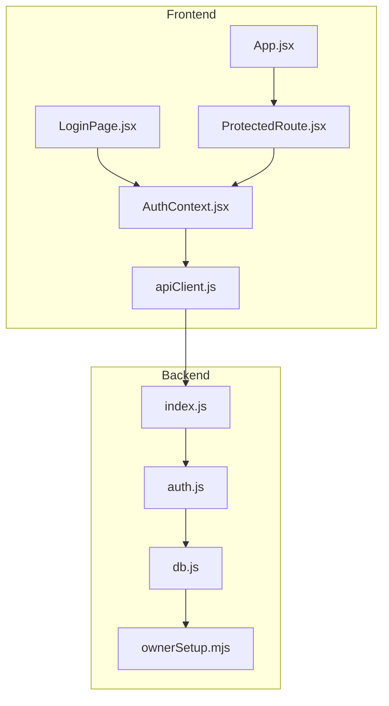
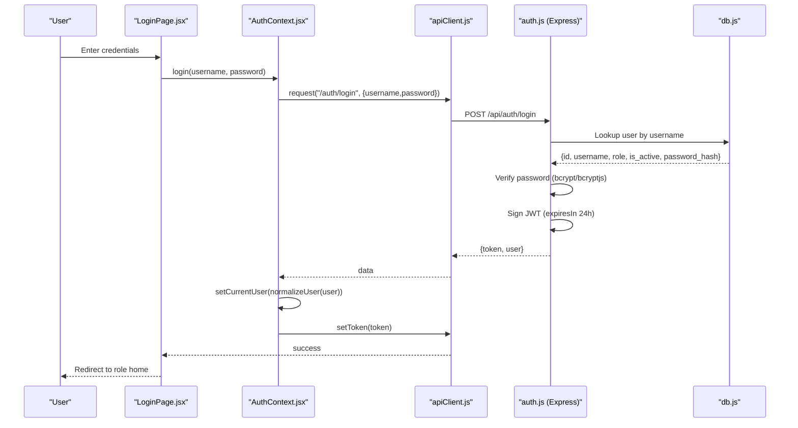
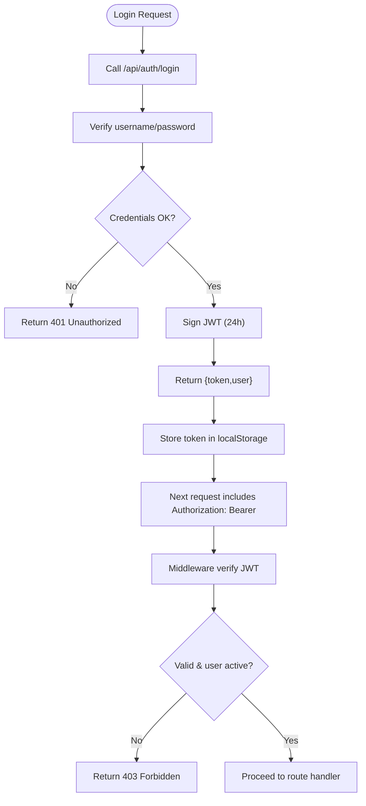
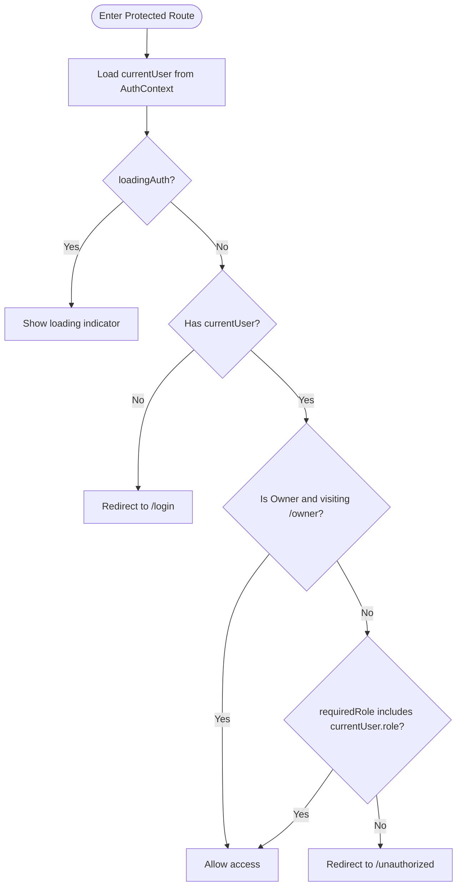
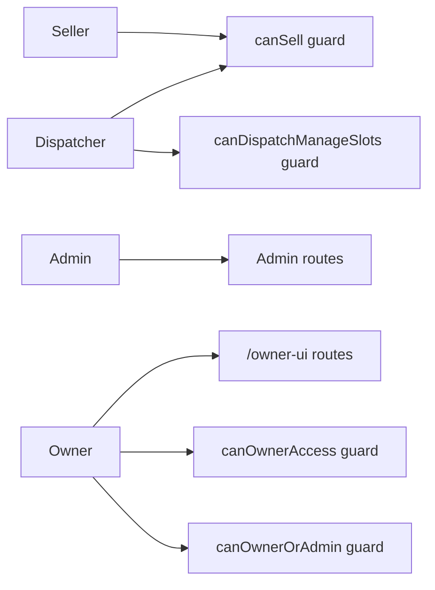
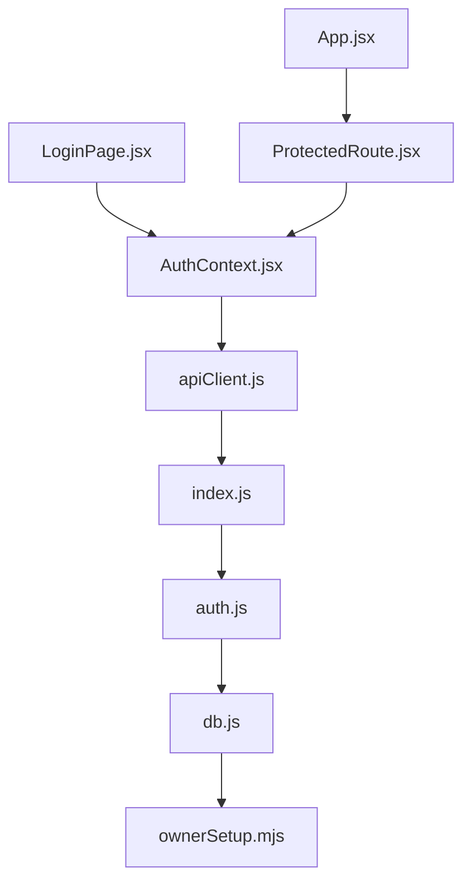

# Authentication & Authorization

<cite>
**Referenced Files in This Document**
- [AuthContext.jsx](file://src/contexts/AuthContext.jsx)
- [ProtectedRoute.jsx](file://src/components/ProtectedRoute.jsx)
- [LoginPage.jsx](file://src/views/LoginPage.jsx)
- [App.jsx](file://src/App.jsx)
- [apiClient.js](file://src/utils/apiClient.js)
- [auth.js](file://server/auth.js)
- [index.js](file://server/index.js)
- [db.js](file://server/db.js)
- [ownerSetup.mjs](file://server/ownerSetup.mjs)
- [UnauthorizedPage.jsx](file://src/views/UnauthorizedPage.jsx)
- [AUTH_FIX_SUMMARY.md](file://AUTH_FIX_SUMMARY.md)
</cite>

## Table of Contents
1. [Introduction](#introduction)
2. [Project Structure](#project-structure)
3. [Core Components](#core-components)
4. [Architecture Overview](#architecture-overview)
5. [Detailed Component Analysis](#detailed-component-analysis)
6. [Dependency Analysis](#dependency-analysis)
7. [Performance Considerations](#performance-considerations)
8. [Troubleshooting Guide](#troubleshooting-guide)
9. [Conclusion](#conclusion)
10. [Appendices](#appendices)

## Introduction
This document explains the multi-role authentication and authorization system used by the application. It covers JWT-based authentication, token lifecycle, role hierarchy (Sellers, Dispatchers, Admins, and Owners), protected routing, and backend enforcement. It also documents password security, token storage, session management, and practical access patterns with security best practices.

## Project Structure
The authentication stack spans frontend and backend:
- Frontend: React context for authentication state, protected routing, login UI, and a shared API client.
- Backend: Express routes for login and current-user retrieval, JWT verification middleware, role-based guards, and database-backed user records.

**Diagram sources**
- [AuthContext.jsx](file://src/contexts/AuthContext.jsx#L1-L79)
- [ProtectedRoute.jsx](file://src/components/ProtectedRoute.jsx#L1-L38)
- [LoginPage.jsx](file://src/views/LoginPage.jsx#L1-L159)
- [App.jsx](file://src/App.jsx#L1-L139)
- [apiClient.js](file://src/utils/apiClient.js#L1-L360)
- [index.js](file://server/index.js#L1-L45)
- [auth.js](file://server/auth.js#L1-L154)
- [db.js](file://server/db.js#L1-L1269)
- [ownerSetup.mjs](file://server/ownerSetup.mjs#L1-L99)

**Section sources**
- [AuthContext.jsx](file://src/contexts/AuthContext.jsx#L1-L79)
- [ProtectedRoute.jsx](file://src/components/ProtectedRoute.jsx#L1-L38)
- [LoginPage.jsx](file://src/views/LoginPage.jsx#L1-L159)
- [App.jsx](file://src/App.jsx#L1-L139)
- [apiClient.js](file://src/utils/apiClient.js#L1-L360)
- [auth.js](file://server/auth.js#L1-L154)
- [index.js](file://server/index.js#L1-L45)
- [db.js](file://server/db.js#L1-L1269)
- [ownerSetup.mjs](file://server/ownerSetup.mjs#L1-L99)

## Core Components
- AuthContext: Centralizes login, logout, and current user state. On startup, it loads a token from localStorage and validates it via the backend.
- ProtectedRoute: Enforces role-based access to routes and redirects unauthorized users.
- LoginPage: Provides the login form, handles saved logins, and persists optional “remember password” entries.
- apiClient: Shared HTTP client that injects Authorization headers and manages token persistence.
- auth.js: Backend JWT middleware and role guards; exposes login and current-user endpoints.
- db.js and ownerSetup.mjs: Database schema and seeding, including user roles and initial accounts.

Key behaviors:
- Token storage: Frontend stores tokens in localStorage under multiple keys for robustness.
- Token propagation: apiClient automatically attaches Authorization: Bearer headers for all requests.
- Role enforcement: Backend middleware verifies tokens and checks user activity and role.

**Section sources**
- [AuthContext.jsx](file://src/contexts/AuthContext.jsx#L1-L79)
- [ProtectedRoute.jsx](file://src/components/ProtectedRoute.jsx#L1-L38)
- [LoginPage.jsx](file://src/views/LoginPage.jsx#L1-L159)
- [apiClient.js](file://src/utils/apiClient.js#L1-L360)
- [auth.js](file://server/auth.js#L1-L154)
- [db.js](file://server/db.js#L1-L1269)
- [ownerSetup.mjs](file://server/ownerSetup.mjs#L1-L99)

## Architecture Overview
The authentication flow integrates frontend and backend:

**Diagram sources**
- [LoginPage.jsx](file://src/views/LoginPage.jsx#L56-L79)
- [AuthContext.jsx](file://src/contexts/AuthContext.jsx#L55-L63)
- [apiClient.js](file://src/utils/apiClient.js#L91-L98)
- [auth.js](file://server/auth.js#L120-L142)
- [db.js](file://server/db.js#L811-L823)

## Detailed Component Analysis

### JWT-Based Authentication Flow
- Token generation: Backend signs a JWT containing user id, username, and role with a 24-hour expiry.
- Token validation: Middleware extracts Authorization header, verifies the signature, decodes the payload, and re-validates the user record’s activity.
- Token propagation: apiClient reads tokens from localStorage and adds Authorization headers to all requests.

**Diagram sources**
- [auth.js](file://server/auth.js#L10-L40)
- [auth.js](file://server/auth.js#L120-L142)
- [apiClient.js](file://src/utils/apiClient.js#L27-L28)
- [apiClient.js](file://src/utils/apiClient.js#L91-L98)

**Section sources**
- [auth.js](file://server/auth.js#L73-L75)
- [auth.js](file://server/auth.js#L10-L40)
- [apiClient.js](file://src/utils/apiClient.js#L27-L28)

### ProtectedRoute Implementation and Role-Based Navigation
- ProtectedRoute enforces role checks against the current user and redirects unauthenticated or unauthorized users.
- Special rule: Owners can access owner-specific routes regardless of the requiredRole.
- App routes wrap page components with ProtectedRoute and specify allowed roles.

**Diagram sources**
- [ProtectedRoute.jsx](file://src/components/ProtectedRoute.jsx#L4-L35)
- [App.jsx](file://src/App.jsx#L52-L130)

**Section sources**
- [ProtectedRoute.jsx](file://src/components/ProtectedRoute.jsx#L1-L38)
- [App.jsx](file://src/App.jsx#L24-L38)

### Role Hierarchy and Access Controls
- Roles: seller, dispatcher, admin, owner.
- Access patterns:
  - Sellers and Dispatchers share selling endpoints; dispatchers additionally manage slots.
  - Admins operate administrative routes behind authentication.
  - Owners have dedicated UI routes and elevated permissions.
- Backend guards enforce role checks consistently.

**Diagram sources**
- [auth.js](file://server/auth.js#L42-L71)
- [index.js](file://server/index.js#L39-L40)

**Section sources**
- [auth.js](file://server/auth.js#L42-L71)
- [index.js](file://server/index.js#L39-L40)

### API Endpoints for Authentication
- POST /api/auth/login
  - Purpose: Authenticate user and return JWT plus user identity.
  - Request: { username, password }
  - Response: { token, user: { id, username, role } }
  - Errors: 400 (missing fields), 401 (invalid credentials or inactive), 500 (server error).
- GET /api/auth/me
  - Purpose: Return currently authenticated user identity.
  - Requires: Valid JWT.
  - Response: { id, username, role }.
  - Errors: 401/403 if token missing/invalid/expired or user inactive.

Notes:
- The backend normalizes role strings to lowercase on the frontend for consistent comparisons.
- The API client supports multiple localStorage token keys for resilience.

**Section sources**
- [auth.js](file://server/auth.js#L120-L151)
- [apiClient.js](file://src/utils/apiClient.js#L91-L103)
- [AuthContext.jsx](file://src/contexts/AuthContext.jsx#L6-L11)

### Password Security and Storage
- Password hashing: bcrypt or bcryptjs comparison is used when available; falls back to plaintext comparison for development scenarios.
- Database seeding: Initial admin and owner users are created with hashed passwords.
- Token storage: Tokens are stored in localStorage; the API client reads multiple token keys to improve reliability.

Best practices:
- Prefer bcrypt hashing in production.
- Consider HttpOnly cookies for tokens in production-grade applications.
- Rotate JWT_SECRET regularly and restrict token storage to secure contexts.

**Section sources**
- [auth.js](file://server/auth.js#L78-L113)
- [db.js](file://server/db.js#L795-L823)
- [apiClient.js](file://src/utils/apiClient.js#L27-L28)

### Session Management, Expiration, and Logout
- Token lifetime: 24 hours.
- Logout: Frontend clears the token and calls a backend logout endpoint abstraction; the API client clears its internal token reference.
- Automatic logout: If token validation fails on the backend, the frontend logs out the user and clears state.

Recommendations:
- Implement token refresh endpoints for long sessions.
- Add silent refresh logic on the frontend to renew tokens before expiry.
- Consider sliding expiration or refresh tokens for better UX.

**Section sources**
- [auth.js](file://server/auth.js#L73-L75)
- [apiClient.js](file://src/utils/apiClient.js#L100-L103)
- [AuthContext.jsx](file://src/contexts/AuthContext.jsx#L42-L47)

### Practical Examples of Role-Based Access Patterns
- Seller access:
  - Routes under /seller are protected and require role "seller".
  - Redirects to role home after login based on user role.
- Dispatcher access:
  - Routes under /dispatcher are protected and require role "dispatcher".
- Admin access:
  - Routes under /admin are protected and require role "admin".
- Owner access:
  - Routes under /owner-ui are protected and require role "owner".

**Section sources**
- [App.jsx](file://src/App.jsx#L52-L130)
- [ProtectedRoute.jsx](file://src/components/ProtectedRoute.jsx#L18-L32)

## Dependency Analysis

**Diagram sources**
- [AuthContext.jsx](file://src/contexts/AuthContext.jsx#L1-L79)
- [ProtectedRoute.jsx](file://src/components/ProtectedRoute.jsx#L1-L38)
- [LoginPage.jsx](file://src/views/LoginPage.jsx#L1-L159)
- [App.jsx](file://src/App.jsx#L1-L139)
- [apiClient.js](file://src/utils/apiClient.js#L1-L360)
- [index.js](file://server/index.js#L1-L45)
- [auth.js](file://server/auth.js#L1-L154)
- [db.js](file://server/db.js#L1-L1269)
- [ownerSetup.mjs](file://server/ownerSetup.mjs#L1-L99)

**Section sources**
- [index.js](file://server/index.js#L6-L40)
- [auth.js](file://server/auth.js#L1-L154)
- [db.js](file://server/db.js#L1-L1269)

## Performance Considerations
- Token verification occurs on every protected request; keep JWT_SECRET secure and avoid excessive middleware overhead.
- Use indexes on user lookup queries if scaling to many users.
- Consider caching validated user info per request to reduce repeated DB lookups.

## Troubleshooting Guide
Common issues and resolutions:
- 401 Unauthorized on protected routes:
  - Ensure the Authorization header is present and contains a valid JWT.
  - Verify the token is not expired and the user remains active.
- 403 Forbidden:
  - The token may be valid but the user lacks the required role.
- Login appears successful but routes redirect to unauthorized:
  - Confirm the user role matches the route’s requiredRole.
  - Check that the frontend normalized role strings to lowercase.
- Authentication appears broken but selling screen shows empty data:
  - Authentication is working; the issue may be lack of active trips/data availability.

Debugging tips:
- Inspect localStorage for tokens and confirm Authorization headers are sent.
- Use network logs to verify request/response bodies.
- Review backend logs for authentication failures and user lookup errors.

**Section sources**
- [AUTH_FIX_SUMMARY.md](file://AUTH_FIX_SUMMARY.md#L1-L43)
- [apiClient.js](file://src/utils/apiClient.js#L53-L87)
- [auth.js](file://server/auth.js#L10-L40)

## Conclusion
The system implements a robust JWT-based authentication and authorization model with clear role boundaries and enforced access control. The frontend and backend work cohesively to validate tokens, enforce roles, and manage sessions. By following the recommended best practices—such as secure token storage, refresh mechanisms, and strict role checks—the system can be hardened for production deployment.

## Appendices

### API Endpoint Reference
- POST /api/auth/login
  - Body: { username, password }
  - Success: 200 { token, user }
  - Errors: 400, 401, 500
- GET /api/auth/me
  - Headers: Authorization: Bearer <token>
  - Success: 200 { id, username, role }
  - Errors: 401, 403

**Section sources**
- [auth.js](file://server/auth.js#L120-L151)

### Role-Based Navigation Summary
- /seller/*: requiredRole "seller"
- /dispatcher/*: requiredRole "dispatcher"
- /admin/*: requiredRole "admin"
- /owner-ui*: requiredRole "owner"

**Section sources**
- [App.jsx](file://src/App.jsx#L52-L130)
- [ProtectedRoute.jsx](file://src/components/ProtectedRoute.jsx#L18-L32)