# JWT Authentication Flow

<cite>
**Referenced Files in This Document**
- [AuthContext.jsx](file://src/contexts/AuthContext.jsx)
- [apiClient.js](file://src/utils/apiClient.js)
- [auth.js](file://server/auth.js)
- [index.js](file://server/index.js)
- [LoginPage.jsx](file://src/views/LoginPage.jsx)
- [App.jsx](file://src/App.jsx)
- [ProtectedRoute.jsx](file://src/components/ProtectedRoute.jsx)
- [db.js](file://server/db.js)
- [README.md](file://README.md)
- [AUTH_FIX_SUMMARY.md](file://AUTH_FIX_SUMMARY.md)
</cite>

## Table of Contents
1. [Introduction](#introduction)
2. [Project Structure](#project-structure)
3. [Core Components](#core-components)
4. [Architecture Overview](#architecture-overview)
5. [Detailed Component Analysis](#detailed-component-analysis)
6. [Dependency Analysis](#dependency-analysis)
7. [Performance Considerations](#performance-considerations)
8. [Troubleshooting Guide](#troubleshooting-guide)
9. [Conclusion](#conclusion)

## Introduction
This document explains the JWT authentication flow implemented in the application. It covers the complete authentication cycle from login to protected routing, token generation and validation, payload structure, signing process, secure storage, and integration between the frontend AuthContext and the API client. It also documents role-based access control, error handling, and practical examples of requests and responses.

## Project Structure
The authentication system spans the frontend React application and the Node.js/Express backend:
- Frontend: AuthContext manages authentication state, LoginPage handles user input, ProtectedRoute enforces role-based access, and apiClient centralizes HTTP requests and token injection.
- Backend: Express routes handle login and user info retrieval, jsonwebtoken signs and verifies tokens, and database queries validate users and roles.

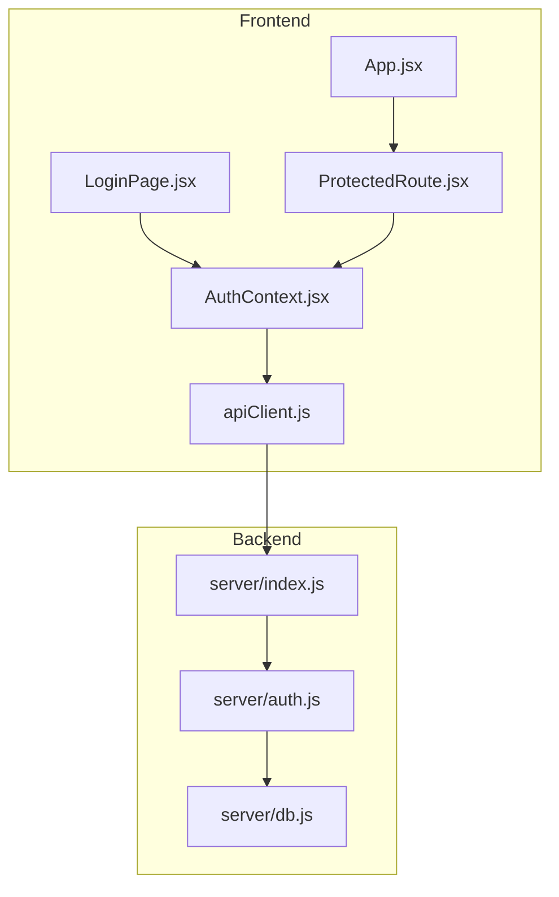

**Diagram sources**
- [LoginPage.jsx](file://src/views/LoginPage.jsx#L1-L159)
- [AuthContext.jsx](file://src/contexts/AuthContext.jsx#L1-L79)
- [ProtectedRoute.jsx](file://src/components/ProtectedRoute.jsx#L1-L38)
- [apiClient.js](file://src/utils/apiClient.js#L1-L360)
- [App.jsx](file://src/App.jsx#L1-L139)
- [index.js](file://server/index.js#L1-L45)
- [auth.js](file://server/auth.js#L1-L154)
- [db.js](file://server/db.js#L1-L1269)

**Section sources**
- [README.md](file://README.md#L30-L76)
- [index.js](file://server/index.js#L1-L45)

## Core Components
- AuthContext: Provides authentication state, login/logout, and initial token validation on app load.
- apiClient: Centralizes HTTP requests, injects Authorization headers, and manages token lifecycle.
- auth.js: Implements login endpoint, token generation, and middleware to validate tokens and enforce roles.
- LoginPage: Collects credentials, triggers login, persists login history, and optionally remembers credentials.
- ProtectedRoute: Guards routes based on current user role and current location.
- db.js: Defines user schema and seeds initial users and data.

**Section sources**
- [AuthContext.jsx](file://src/contexts/AuthContext.jsx#L1-L79)
- [apiClient.js](file://src/utils/apiClient.js#L1-L360)
- [auth.js](file://server/auth.js#L1-L154)
- [LoginPage.jsx](file://src/views/LoginPage.jsx#L1-L159)
- [ProtectedRoute.jsx](file://src/components/ProtectedRoute.jsx#L1-L38)
- [db.js](file://server/db.js#L40-L823)

## Architecture Overview
The authentication flow integrates frontend and backend components to provide secure, role-aware access.

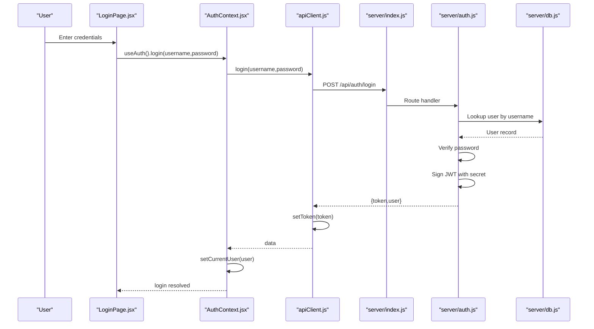

**Diagram sources**
- [LoginPage.jsx](file://src/views/LoginPage.jsx#L56-L79)
- [AuthContext.jsx](file://src/contexts/AuthContext.jsx#L55-L63)
- [apiClient.js](file://src/utils/apiClient.js#L91-L98)
- [index.js](file://server/index.js#L25-L26)
- [auth.js](file://server/auth.js#L120-L142)
- [db.js](file://server/db.js#L125-L133)

## Detailed Component Analysis

### AuthContext: Authentication State and Lifecycle
- Initializes from localStorage on mount and validates the token by fetching current user.
- Supports two response formats for user data from backend endpoints.
- Provides login, logout, and exposes loading state for authentication resolution.

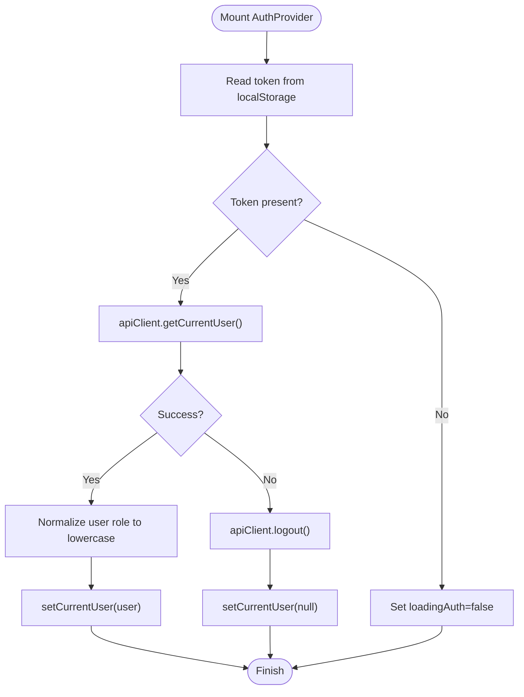

**Diagram sources**
- [AuthContext.jsx](file://src/contexts/AuthContext.jsx#L23-L53)

**Section sources**
- [AuthContext.jsx](file://src/contexts/AuthContext.jsx#L1-L79)

### apiClient: HTTP Requests and Token Injection
- Centralizes request building, JSON parsing, and network logging.
- Automatically attaches Authorization: Bearer <token> when a token is present in memory or localStorage.
- Exposes login, logout, and user retrieval helpers; sets/clears token on successful login/logout.

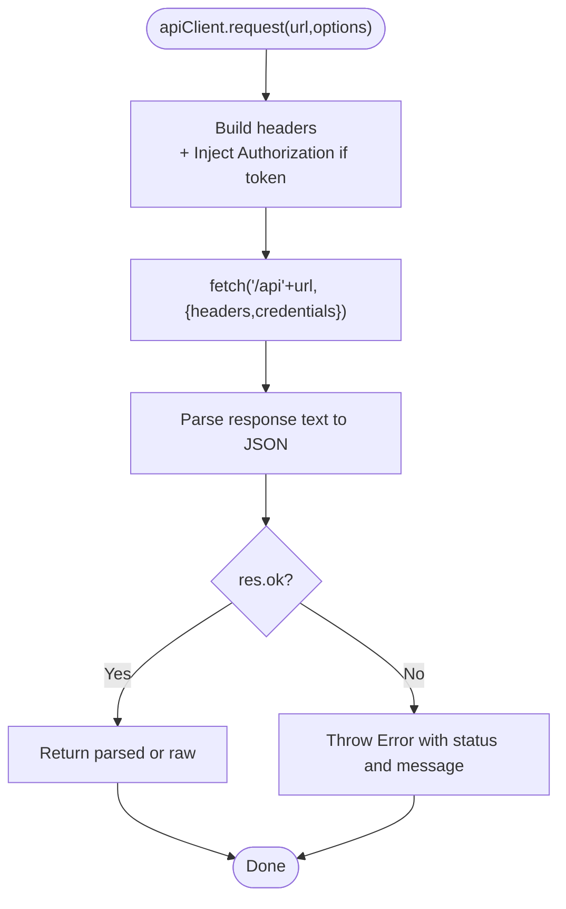

**Diagram sources**
- [apiClient.js](file://src/utils/apiClient.js#L23-L88)

**Section sources**
- [apiClient.js](file://src/utils/apiClient.js#L1-L360)

### Backend Authentication: Login, Token Generation, and Validation
- Login endpoint validates credentials against the database and returns a signed JWT along with user info.
- Token verification middleware extracts Authorization header, decodes JWT, and ensures the user still exists and is active.
- Role-based guards restrict access to admin and owner endpoints.

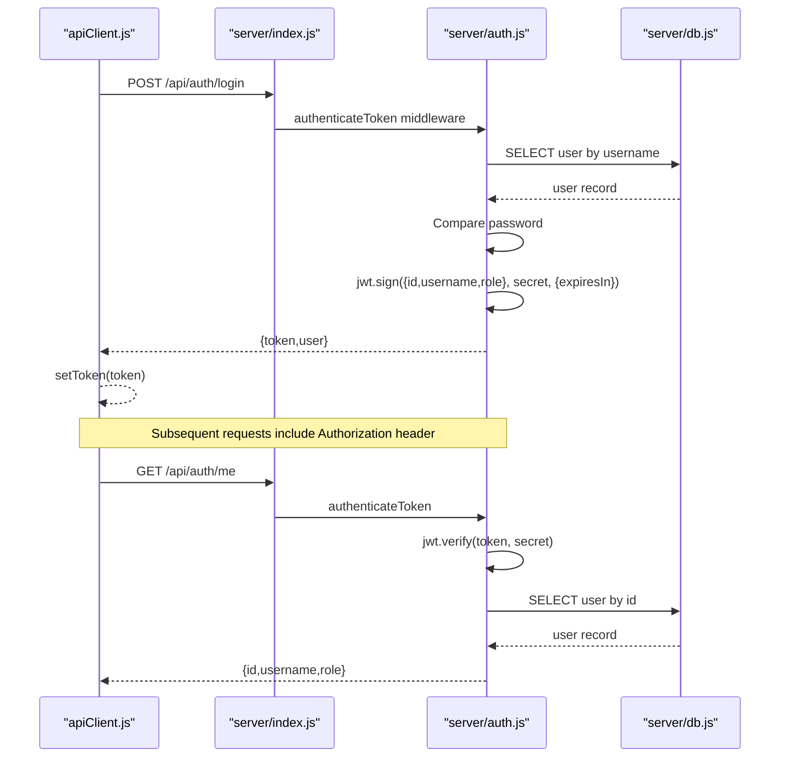

**Diagram sources**
- [auth.js](file://server/auth.js#L120-L151)
- [index.js](file://server/index.js#L25-L40)
- [db.js](file://server/db.js#L125-L133)

**Section sources**
- [auth.js](file://server/auth.js#L1-L154)
- [index.js](file://server/index.js#L1-L45)
- [db.js](file://server/db.js#L40-L823)

### Login Page: User Input and Credential Persistence
- Captures username/password, submits to AuthContext.login, and updates saved logins.
- Optionally stores credentials in localStorage for convenience (with explicit opt-in).

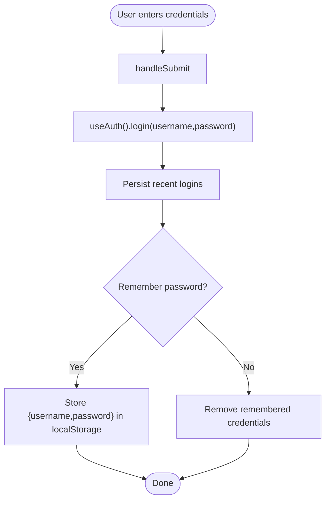

**Diagram sources**
- [LoginPage.jsx](file://src/views/LoginPage.jsx#L56-L79)

**Section sources**
- [LoginPage.jsx](file://src/views/LoginPage.jsx#L1-L159)

### ProtectedRoute: Role-Based Access Control
- Blocks unauthenticated users and enforces role checks.
- Allows owner users to access owner-specific routes regardless of the requested role.

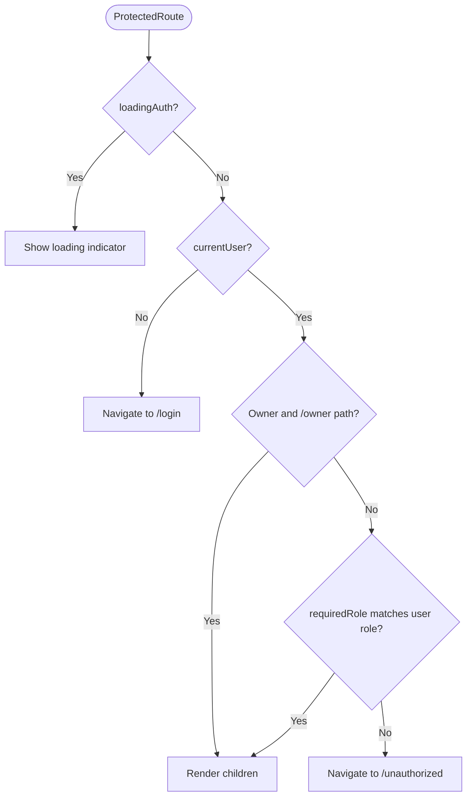

**Diagram sources**
- [ProtectedRoute.jsx](file://src/components/ProtectedRoute.jsx#L4-L35)

**Section sources**
- [ProtectedRoute.jsx](file://src/components/ProtectedRoute.jsx#L1-L38)
- [App.jsx](file://src/App.jsx#L24-L38)

### JWT Payload Structure and Signing
- Payload includes user identity and role: { id, username, role }.
- Signed with a shared secret from environment configuration.
- Expires in 24 hours.

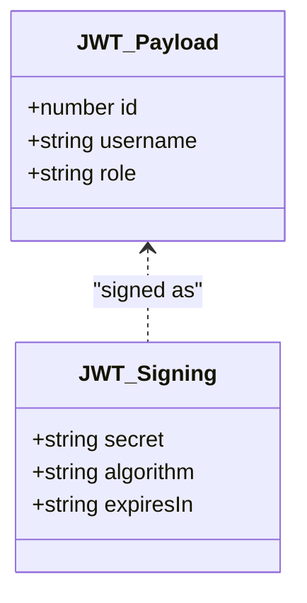

**Diagram sources**
- [auth.js](file://server/auth.js#L73-L75)

**Section sources**
- [auth.js](file://server/auth.js#L5-L75)

### Secure Storage in localStorage
- Tokens are stored in localStorage after successful login.
- apiClient reads token from localStorage for each request when not present in memory.
- The system supports multiple localStorage keys for compatibility.

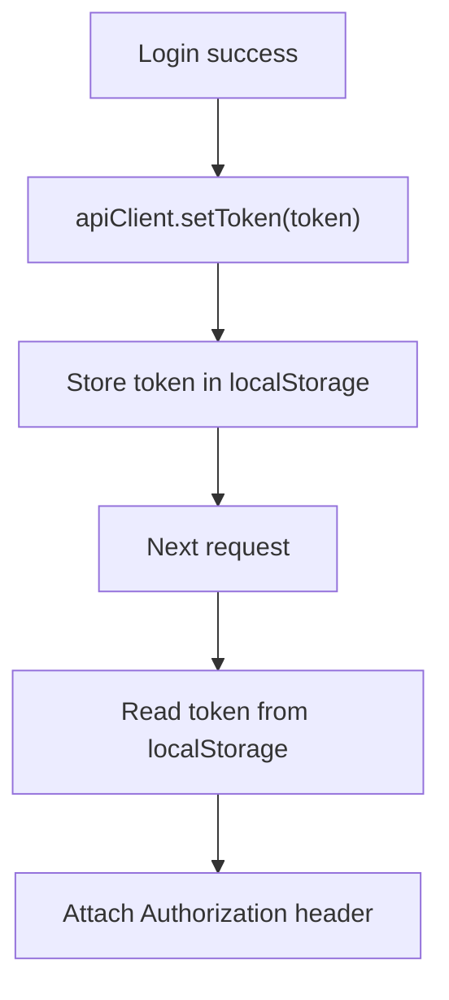

**Diagram sources**
- [apiClient.js](file://src/utils/apiClient.js#L27-L28)
- [apiClient.js](file://src/utils/apiClient.js#L96-L97)

**Section sources**
- [apiClient.js](file://src/utils/apiClient.js#L1-L360)

### Token Refresh Strategy and Automatic Logout
- The backend does not implement a dedicated token refresh endpoint; tokens expire after 24 hours.
- On authentication failure or invalid/expired tokens, the frontend clears the token and redirects to login.

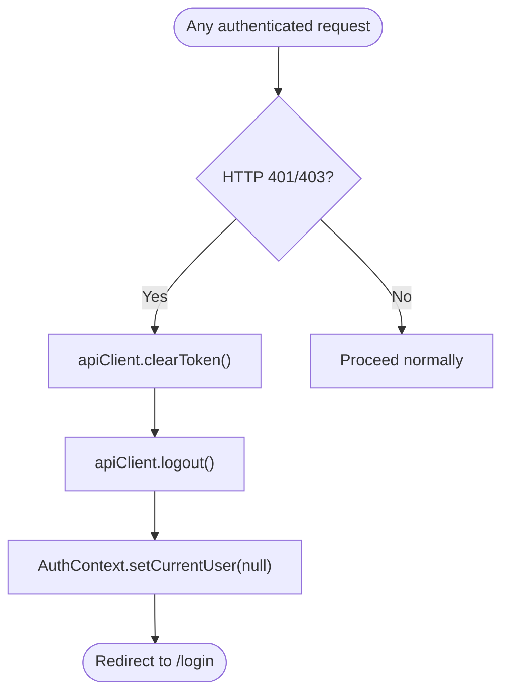

**Diagram sources**
- [AuthContext.jsx](file://src/contexts/AuthContext.jsx#L42-L47)
- [apiClient.js](file://src/utils/apiClient.js#L100-L103)

**Section sources**
- [AuthContext.jsx](file://src/contexts/AuthContext.jsx#L1-L79)
- [apiClient.js](file://src/utils/apiClient.js#L1-L360)

### Concurrent Sessions Handling
- The current implementation does not enforce single-session constraints.
- Tokens are validated server-side; no explicit revocation or session limiting is implemented.

**Section sources**
- [auth.js](file://server/auth.js#L10-L40)
- [AUTH_FIX_SUMMARY.md](file://AUTH_FIX_SUMMARY.md#L1-L43)

### Practical Examples

- Login Request
  - Endpoint: POST /api/auth/login
  - Body: { username, password }
  - Success Response: { token, user: { id, username, role } }
  - Failure Responses: 400 (bad input), 401 (invalid credentials), 401 (inactive user)

- Get Current User
  - Endpoint: GET /api/auth/me
  - Requires: Authorization: Bearer <token>
  - Success Response: { id, username, role }
  - Failure Responses: 401 (no token), 403 (invalid/expired token), 403 (user inactive)

- Protected Route Access
  - Example: GET /api/selling/slots
  - Requires: Authorization: Bearer <token>
  - Success Response: Array of slots or empty array
  - Failure Responses: 401 (no token), 403 (invalid/expired token)

**Section sources**
- [auth.js](file://server/auth.js#L120-L151)
- [apiClient.js](file://src/utils/apiClient.js#L91-L103)
- [AUTH_FIX_SUMMARY.md](file://AUTH_FIX_SUMMARY.md#L28-L32)

## Dependency Analysis
The frontend and backend components depend on each other as follows:
- LoginPage depends on AuthContext for login.
- AuthContext depends on apiClient for HTTP operations.
- apiClient depends on server endpoints for authentication and protected resources.
- server/index.js mounts auth routes and applies authentication middleware to admin/owner routes.
- server/auth.js depends on server/db.js for user lookup and bcrypt-like password comparison.

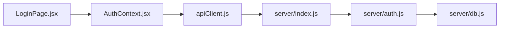

**Diagram sources**
- [LoginPage.jsx](file://src/views/LoginPage.jsx#L1-L159)
- [AuthContext.jsx](file://src/contexts/AuthContext.jsx#L1-L79)
- [apiClient.js](file://src/utils/apiClient.js#L1-L360)
- [index.js](file://server/index.js#L1-L45)
- [auth.js](file://server/auth.js#L1-L154)
- [db.js](file://server/db.js#L1-L1269)

**Section sources**
- [index.js](file://server/index.js#L1-L45)
- [auth.js](file://server/auth.js#L1-L154)
- [db.js](file://server/db.js#L1-L1269)

## Performance Considerations
- Token verification occurs on every protected request; keep the number of protected endpoints reasonable.
- Avoid excessive re-renders by memoizing user data and using stable references in AuthContext.
- Network logging is enabled; monitor logs for latency and error rates.

[No sources needed since this section provides general guidance]

## Troubleshooting Guide
Common issues and resolutions:
- 401 Unauthorized on protected endpoints: Ensure the Authorization header is present and the token is valid and not expired.
- 403 Forbidden after login: Verify the user account is active and the token was signed by the same secret.
- Empty data on selling screens: Confirm that active slots exist; authentication is working, but data availability may be zero.

**Section sources**
- [AUTH_FIX_SUMMARY.md](file://AUTH_FIX_SUMMARY.md#L1-L43)
- [auth.js](file://server/auth.js#L10-L40)
- [apiClient.js](file://src/utils/apiClient.js#L63-L87)

## Conclusion
The application implements a straightforward JWT authentication flow with clear separation of concerns between frontend and backend. The frontend manages state and token injection, while the backend validates credentials, generates tokens, and enforces role-based access. The system is secure, extensible, and suitable for the described use case.