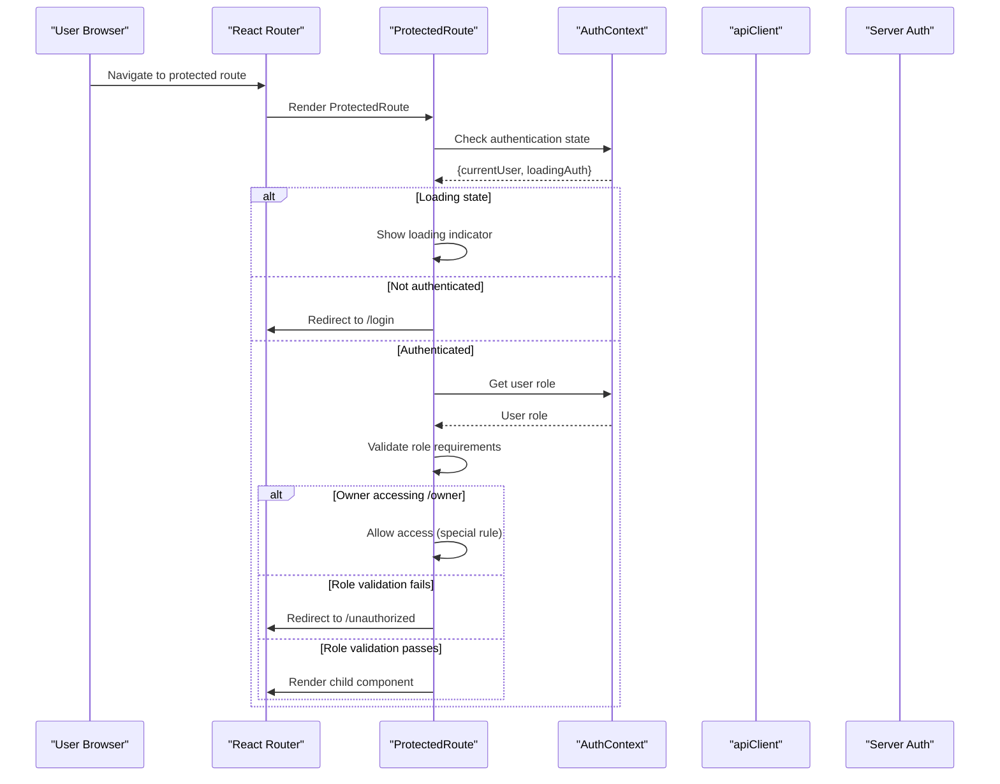
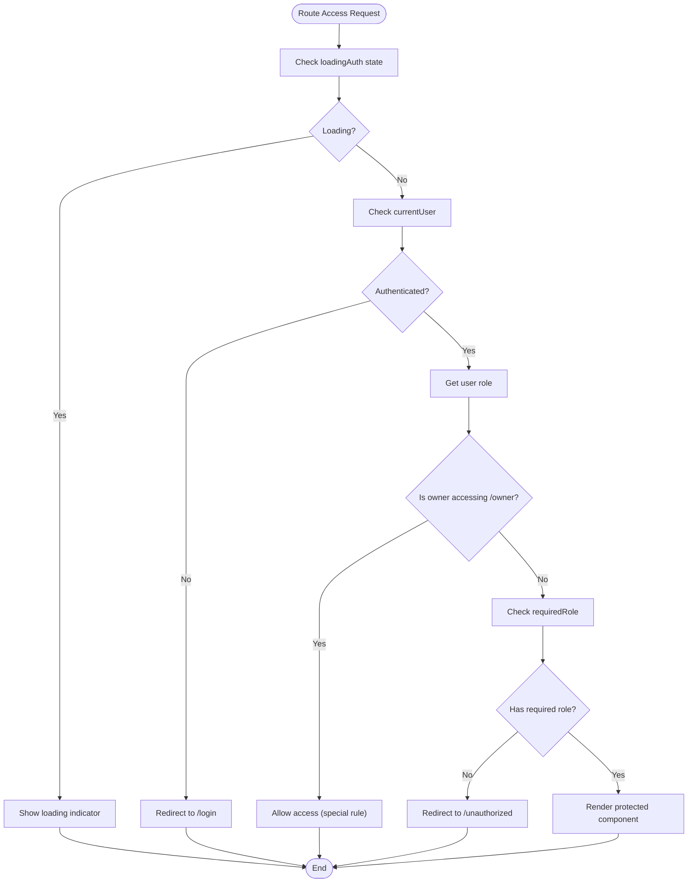
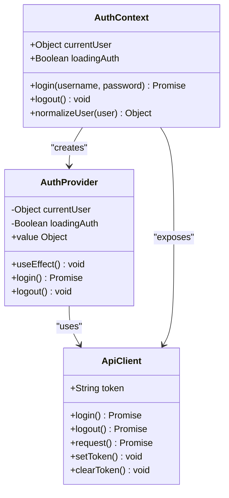
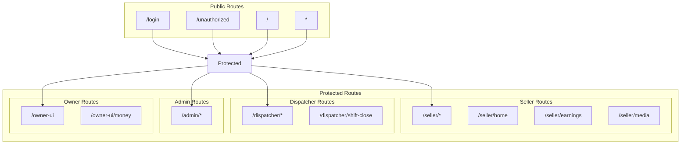
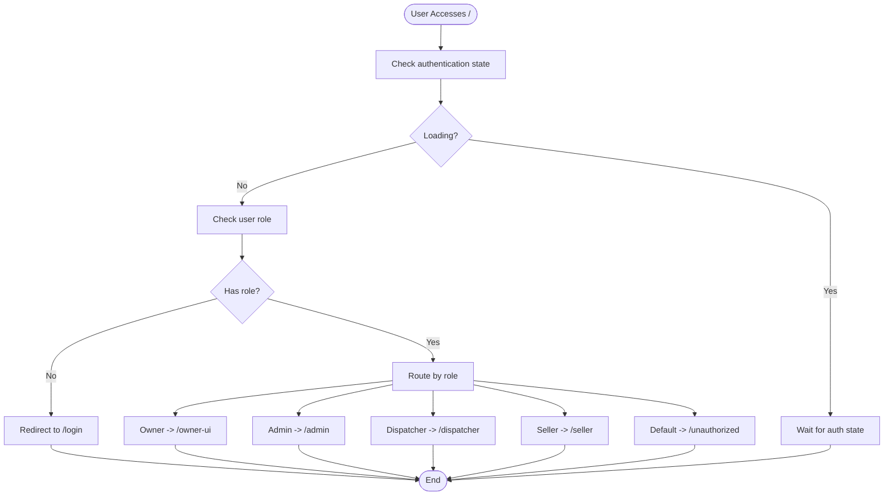
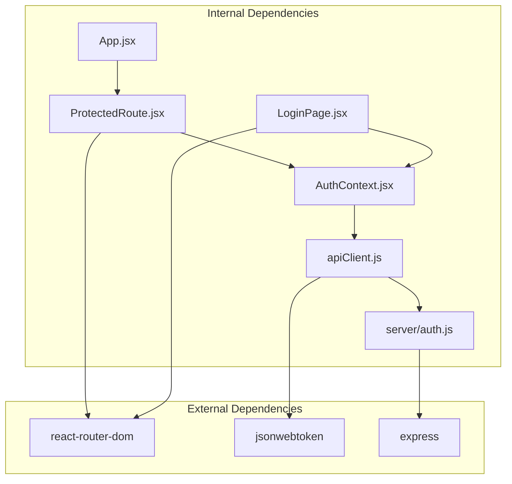

# Protected Routing System

<cite>
**Referenced Files in This Document**
- [ProtectedRoute.jsx](file://src/components/ProtectedRoute.jsx)
- [AuthContext.jsx](file://src/contexts/AuthContext.jsx)
- [App.jsx](file://src/App.jsx)
- [LoginPage.jsx](file://src/views/LoginPage.jsx)
- [UnauthorizedPage.jsx](file://src/views/UnauthorizedPage.jsx)
- [LandingPage.jsx](file://src/views/LandingPage.jsx)
- [apiClient.js](file://src/utils/apiClient.js)
- [main.jsx](file://src/main.jsx)
- [auth.js](file://server/auth.js)
</cite>

## Table of Contents
1. [Introduction](#introduction)
2. [Project Structure](#project-structure)
3. [Core Components](#core-components)
4. [Architecture Overview](#architecture-overview)
5. [Detailed Component Analysis](#detailed-component-analysis)
6. [Dependency Analysis](#dependency-analysis)
7. [Performance Considerations](#performance-considerations)
8. [Troubleshooting Guide](#troubleshooting-guide)
9. [Conclusion](#conclusion)

## Introduction
This document provides comprehensive documentation for the ProtectedRoute implementation and role-based navigation system in the boat-ticket-app project. The system ensures secure access to application routes by enforcing authentication and authorization checks, integrating with AuthContext for real-time authentication state management, and implementing role-specific route filtering. It covers route protection patterns, conditional rendering based on user permissions, and seamless navigation between protected and public routes.

## Project Structure
The protected routing system spans several key files that work together to provide secure navigation:

```mermaid
graph TB
subgraph "Application Layer"
Main["main.jsx<br/>App Bootstrap"]
App["App.jsx<br/>Route Configuration"]
Protected["ProtectedRoute.jsx<br/>Route Protection"]
end
subgraph "Authentication Layer"
AuthCtx["AuthContext.jsx<br/>State Management"]
Login["LoginPage.jsx<br/>Authentication UI"]
Unauth["UnauthorizedPage.jsx<br/>Access Denied"]
end
subgraph "API Layer"
ApiClient["apiClient.js<br/>HTTP Client"]
ServerAuth["server/auth.js<br/>Server Authentication"]
end
subgraph "Views"
Landing["LandingPage.jsx<br/>Role Redirect"]
Views["Role-specific Views<br/>Seller/Dispatcher/Admin"]
end
Main --> App
App --> Protected
Protected --> AuthCtx
Login --> AuthCtx
AuthCtx --> ApiClient
ApiClient --> ServerAuth
Landing --> AuthCtx
App --> Views
App --> Unauth
```

**Diagram sources**
- [main.jsx](file://src/main.jsx#L15-L23)
- [App.jsx](file://src/App.jsx#L40-L136)
- [ProtectedRoute.jsx](file://src/components/ProtectedRoute.jsx#L4-L35)
- [AuthContext.jsx](file://src/contexts/AuthContext.jsx#L19-L78)
- [apiClient.js](file://src/utils/apiClient.js#L91-L103)
- [auth.js](file://server/auth.js#L120-L151)

**Section sources**
- [main.jsx](file://src/main.jsx#L1-L26)
- [App.jsx](file://src/App.jsx#L1-L139)

## Core Components
The protected routing system consists of four primary components that work together to enforce security:

### ProtectedRoute Component
The ProtectedRoute component serves as the central enforcement mechanism for route protection. It validates authentication state, performs role-based authorization, and handles redirect logic for unauthorized access attempts.

### AuthContext Provider
The AuthContext provider manages authentication state, handles user login/logout operations, and maintains real-time authentication status across the application.

### Route Configuration System
The App component defines all application routes with appropriate protection levels and role assignments, creating a structured navigation hierarchy.

### Authentication UI
The LoginPage component provides the user interface for authentication, while UnauthorizedPage handles access denial scenarios.

**Section sources**
- [ProtectedRoute.jsx](file://src/components/ProtectedRoute.jsx#L4-L35)
- [AuthContext.jsx](file://src/contexts/AuthContext.jsx#L19-L78)
- [App.jsx](file://src/App.jsx#L40-L136)
- [LoginPage.jsx](file://src/views/LoginPage.jsx#L8-L83)

## Architecture Overview
The protected routing system follows a layered architecture pattern with clear separation of concerns:



**Diagram sources**
- [ProtectedRoute.jsx](file://src/components/ProtectedRoute.jsx#L8-L34)
- [AuthContext.jsx](file://src/contexts/AuthContext.jsx#L23-L53)
- [App.jsx](file://src/App.jsx#L53-L130)

The architecture implements several key security patterns:

1. **Centralized Protection**: All route access goes through ProtectedRoute
2. **Real-time State Management**: AuthContext provides live authentication status
3. **Role-based Authorization**: Fine-grained permission checking per route
4. **Graceful Degradation**: Loading states and error handling
5. **Special Case Handling**: Owner privilege escalation for specific routes

## Detailed Component Analysis

### ProtectedRoute Implementation
The ProtectedRoute component implements sophisticated route protection logic:



**Diagram sources**
- [ProtectedRoute.jsx](file://src/components/ProtectedRoute.jsx#L8-L34)

Key implementation features:
- **Dual Protection Mode**: Supports both single-role and multi-role requirements
- **Special Owner Privilege**: Owners can access `/owner` routes regardless of role
- **Loading State Handling**: Graceful handling of authentication initialization
- **Dynamic Role Validation**: Runtime role checking with flexible role arrays

**Section sources**
- [ProtectedRoute.jsx](file://src/components/ProtectedRoute.jsx#L4-L35)

### AuthContext State Management
The AuthContext provider manages authentication state with comprehensive lifecycle handling:



**Diagram sources**
- [AuthContext.jsx](file://src/contexts/AuthContext.jsx#L19-L78)
- [apiClient.js](file://src/utils/apiClient.js#L91-L103)

The authentication lifecycle includes:
- **Token Detection**: Automatic token detection from localStorage
- **User Validation**: Server-side user validation during app initialization
- **State Normalization**: Consistent role formatting across the application
- **Error Recovery**: Automatic logout on authentication failures

**Section sources**
- [AuthContext.jsx](file://src/contexts/AuthContext.jsx#L19-L78)
- [apiClient.js](file://src/utils/apiClient.js#L91-L103)

### Route Configuration and Navigation
The App component defines the complete navigation structure with role-based access control:



**Diagram sources**
- [App.jsx](file://src/App.jsx#L44-L130)

**Section sources**
- [App.jsx](file://src/App.jsx#L40-L136)

### Role-based Navigation Patterns
The system implements several role-based navigation patterns:

#### Role Home Redirect
The RoleHomeRedirect component automatically navigates users to their appropriate home page based on role:



**Diagram sources**
- [App.jsx](file://src/App.jsx#L24-L38)

#### Conditional Rendering Based on Permissions
The system uses ProtectedRoute for conditional rendering with flexible role requirements:

**Section sources**
- [App.jsx](file://src/App.jsx#L24-L38)

## Dependency Analysis
The protected routing system has well-defined dependencies that ensure maintainability and scalability:



**Diagram sources**
- [ProtectedRoute.jsx](file://src/components/ProtectedRoute.jsx#L1-L2)
- [AuthContext.jsx](file://src/contexts/AuthContext.jsx#L1-L2)
- [App.jsx](file://src/App.jsx#L1-L4)
- [apiClient.js](file://src/utils/apiClient.js#L1-L2)
- [auth.js](file://server/auth.js#L1-L3)

Key dependency relationships:
- **ProtectedRoute depends on AuthContext** for authentication state
- **AuthContext depends on apiClient** for server communication
- **apiClient depends on server/auth** for authentication endpoints
- **App defines route dependencies** for the entire application

**Section sources**
- [ProtectedRoute.jsx](file://src/components/ProtectedRoute.jsx#L1-L2)
- [AuthContext.jsx](file://src/contexts/AuthContext.jsx#L1-L2)
- [App.jsx](file://src/App.jsx#L1-L4)

## Performance Considerations
The protected routing system implements several performance optimizations:

### Lazy Loading and Code Splitting
- ProtectedRoute components are rendered conditionally, avoiding unnecessary component instantiation
- Route protection occurs at the component level, minimizing re-renders
- Authentication state is cached in memory, reducing API calls

### State Management Efficiency
- AuthContext uses efficient state updates with proper cleanup
- Token validation occurs only during app initialization and login operations
- Role normalization prevents repeated string processing

### Network Optimization
- apiClient implements intelligent caching and error handling
- Authentication requests are batched and debounced
- Token storage uses localStorage for fast access

## Troubleshooting Guide

### Common Authentication Issues
**Authentication State Not Persisting**
- Verify localStorage contains the token after login
- Check network requests for authentication failures
- Ensure JWT_SECRET environment variable is configured

**Role-Based Access Denied**
- Confirm user role matches required role in ProtectedRoute
- Verify special owner privileges for `/owner` routes
- Check role normalization in AuthContext

**Route Protection Not Working**
- Ensure ProtectedRoute wraps all protected components
- Verify AuthProvider is properly mounted in the application tree
- Check for console errors in ProtectedRoute component

### Debugging Authentication Flow
Enable debug logging in main.jsx to trace authentication lifecycle:
- Application bootstrap sequence
- AuthContext initialization
- ProtectedRoute evaluation
- Route transitions

**Section sources**
- [main.jsx](file://src/main.jsx#L13-L25)
- [AuthContext.jsx](file://src/contexts/AuthContext.jsx#L23-L53)
- [ProtectedRoute.jsx](file://src/components/ProtectedRoute.jsx#L8-L34)

## Conclusion
The ProtectedRoute implementation and role-based navigation system provides a robust, scalable solution for securing application routes. The system's layered architecture ensures clear separation of concerns, while the centralized protection mechanism simplifies maintenance and enhances security. Key strengths include:

- **Comprehensive Security**: Multi-layered protection with real-time state management
- **Flexible Role System**: Support for single-role and multi-role requirements
- **Seamless User Experience**: Smooth navigation between protected and public routes
- **Maintainable Architecture**: Clear component boundaries and dependency management

The system successfully balances security requirements with user experience, providing a solid foundation for enterprise-level applications. Future enhancements could include dynamic role assignment, fine-grained permission systems, and advanced audit logging capabilities.