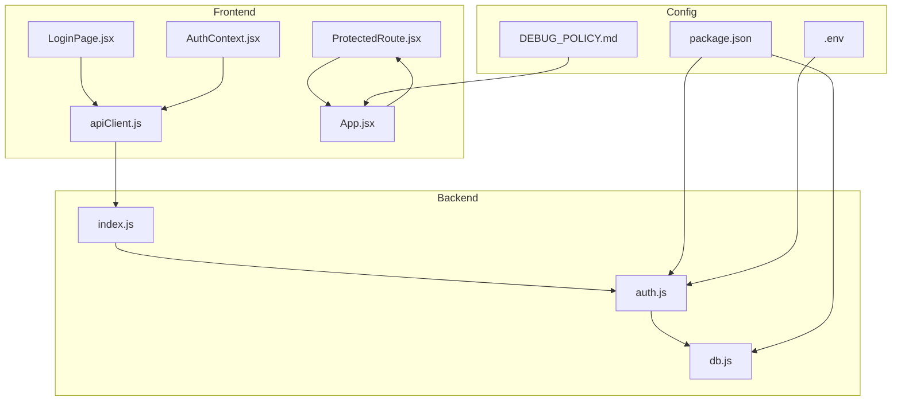
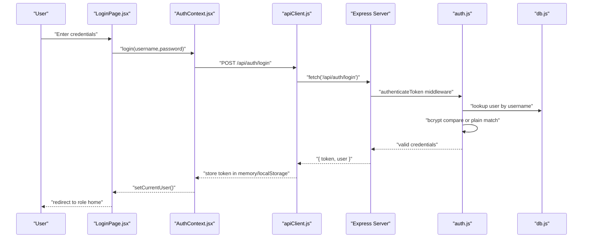
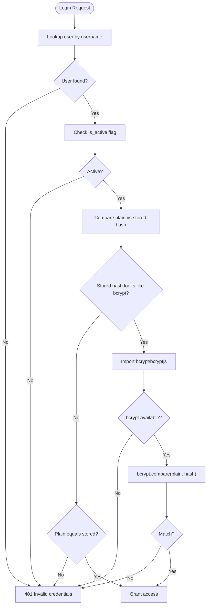
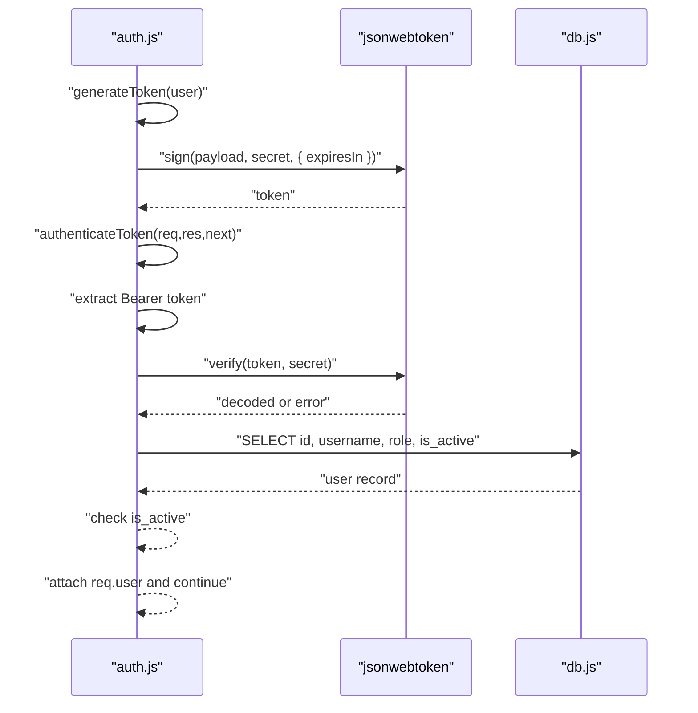
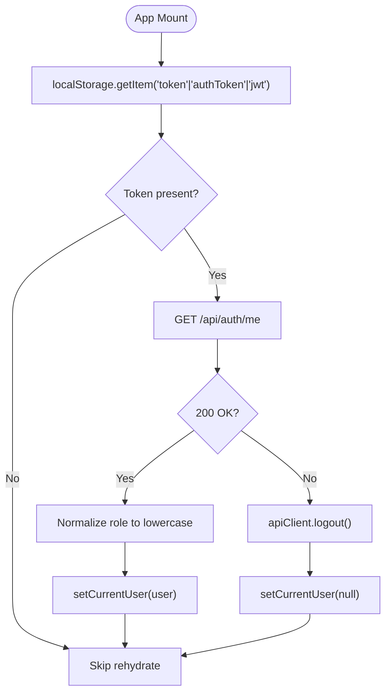
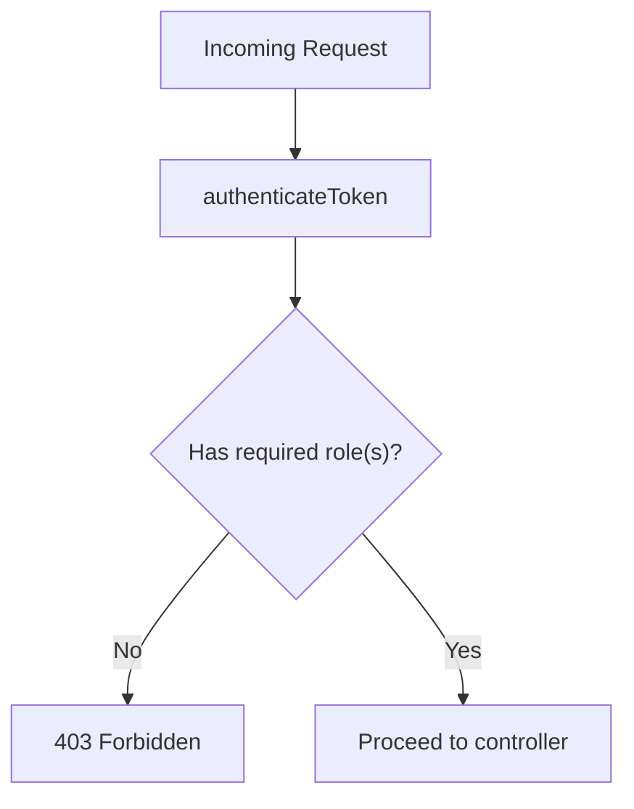
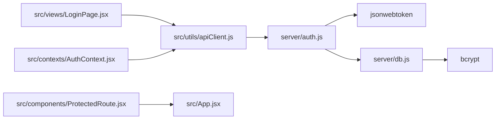

# Security Implementation

<cite>
**Referenced Files in This Document**
- [server/auth.js](file://server/auth.js)
- [server/db.js](file://server/db.js)
- [server/index.js](file://server/index.js)
- [src/utils/apiClient.js](file://src/utils/apiClient.js)
- [src/views/LoginPage.jsx](file://src/views/LoginPage.jsx)
- [src/App.jsx](file://src/App.jsx)
- [src/components/ProtectedRoute.jsx](file://src/components/ProtectedRoute.jsx)
- [src/contexts/AuthContext.jsx](file://src/contexts/AuthContext.jsx)
- [package.json](file://package.json)
- [.env](file://.env)
- [docs/DEBUG_POLICY.md](file://docs/DEBUG_POLICY.md)
- [SOLUTION.md](file://SOLUTION.md)
</cite>

## Table of Contents
1. [Introduction](#introduction)
2. [Project Structure](#project-structure)
3. [Core Components](#core-components)
4. [Architecture Overview](#architecture-overview)
5. [Detailed Component Analysis](#detailed-component-analysis)
6. [Dependency Analysis](#dependency-analysis)
7. [Performance Considerations](#performance-considerations)
8. [Troubleshooting Guide](#troubleshooting-guide)
9. [Conclusion](#conclusion)
10. [Appendices](#appendices)

## Introduction
This document explains the security implementation of the application, focusing on password hashing with bcrypt, secure token generation and verification, and session management. It also covers environment variable configuration for secrets, token lifecycle, and production hardening practices. Practical authentication flows, error handling for security violations, and debugging techniques are included to help operators deploy and operate the system securely.

## Project Structure
Security-relevant parts of the system span the backend (authentication service, database initialization and migrations), the frontend (API client, login page, protected routing), and configuration files (environment and package dependencies).

**Diagram sources**
- [src/views/LoginPage.jsx](file://src/views/LoginPage.jsx#L1-L159)
- [src/contexts/AuthContext.jsx](file://src/contexts/AuthContext.jsx#L1-L79)
- [src/components/ProtectedRoute.jsx](file://src/components/ProtectedRoute.jsx#L1-L38)
- [src/utils/apiClient.js](file://src/utils/apiClient.js#L1-L360)
- [src/App.jsx](file://src/App.jsx#L1-L139)
- [server/index.js](file://server/index.js#L1-L45)
- [server/auth.js](file://server/auth.js#L1-L154)
- [server/db.js](file://server/db.js#L1-L1269)
- [package.json](file://package.json#L1-L41)
- [.env](file://.env#L1-L1)
- [docs/DEBUG_POLICY.md](file://docs/DEBUG_POLICY.md#L1-L12)

**Section sources**
- [server/index.js](file://server/index.js#L1-L45)
- [server/auth.js](file://server/auth.js#L1-L154)
- [server/db.js](file://server/db.js#L1-L1269)
- [src/utils/apiClient.js](file://src/utils/apiClient.js#L1-L360)
- [src/views/LoginPage.jsx](file://src/views/LoginPage.jsx#L1-L159)
- [src/App.jsx](file://src/App.jsx#L1-L139)
- [src/components/ProtectedRoute.jsx](file://src/components/ProtectedRoute.jsx#L1-L38)
- [src/contexts/AuthContext.jsx](file://src/contexts/AuthContext.jsx#L1-L79)
- [package.json](file://package.json#L1-L41)
- [.env](file://.env#L1-L1)
- [docs/DEBUG_POLICY.md](file://docs/DEBUG_POLICY.md#L1-L12)

## Core Components
- Authentication service: JWT-based bearer tokens, middleware to verify tokens, role-based access checks, and password comparison with bcrypt/bcryptjs fallback.
- Database layer: SQLite-backed user storage with bcrypt password hashing during seeding and administrative password resets.
- Frontend authentication client: automatic Authorization header injection, token persistence in local storage, and centralized error handling.
- Routing and protection: protected routes enforcing roles and ownership semantics.

Key implementation references:
- Token generation and verification: [server/auth.js](file://server/auth.js#L5-L75)
- Password hashing and comparison: [server/db.js](file://server/db.js#L795-L800), [server/auth.js](file://server/auth.js#L78-L113)
- API client token handling: [src/utils/apiClient.js](file://src/utils/apiClient.js#L23-L28), [src/utils/apiClient.js](file://src/utils/apiClient.js#L91-L103)
- Login UI and local storage: [src/views/LoginPage.jsx](file://src/views/LoginPage.jsx#L5-L79)
- Protected routing: [src/components/ProtectedRoute.jsx](file://src/components/ProtectedRoute.jsx#L4-L35), [src/App.jsx](file://src/App.jsx#L40-L135)

**Section sources**
- [server/auth.js](file://server/auth.js#L1-L154)
- [server/db.js](file://server/db.js#L795-L800)
- [src/utils/apiClient.js](file://src/utils/apiClient.js#L1-L360)
- [src/views/LoginPage.jsx](file://src/views/LoginPage.jsx#L1-L159)
- [src/components/ProtectedRoute.jsx](file://src/components/ProtectedRoute.jsx#L1-L38)
- [src/App.jsx](file://src/App.jsx#L1-L139)

## Architecture Overview
The authentication flow integrates frontend and backend components to deliver secure, role-aware access.

**Diagram sources**
- [src/views/LoginPage.jsx](file://src/views/LoginPage.jsx#L55-L79)
- [src/contexts/AuthContext.jsx](file://src/contexts/AuthContext.jsx#L55-L63)
- [src/utils/apiClient.js](file://src/utils/apiClient.js#L91-L98)
- [server/index.js](file://server/index.js#L25-L26)
- [server/auth.js](file://server/auth.js#L10-L40)
- [server/auth.js](file://server/auth.js#L120-L142)
- [server/db.js](file://server/db.js#L795-L800)

## Detailed Component Analysis

### Password Hashing with bcrypt and Secure Comparison
- Storage: Users’ passwords are stored as bcrypt hashes in the database. During seeding and administrative resets, bcrypt is used with a configurable number of rounds.
- Comparison: The server attempts bcrypt.compare via either the native bcrypt module or bcryptjs as a fallback. If the stored hash does not appear to be a bcrypt hash, the system falls back to constant-time-like plain-text comparison for development scenarios.
- Salt generation: Salt is managed internally by bcrypt; the application configures the cost factor and relies on bcrypt’s internal randomness.

**Diagram sources**
- [server/auth.js](file://server/auth.js#L120-L142)
- [server/auth.js](file://server/auth.js#L78-L113)
- [server/db.js](file://server/db.js#L795-L800)

**Section sources**
- [server/auth.js](file://server/auth.js#L78-L113)
- [server/db.js](file://server/db.js#L795-L800)

### Secure Token Generation and Verification
- Secret: The JWT signing secret is loaded from an environment variable. If not present, a default is used for development.
- Expiration: Tokens are issued with a short TTL to reduce exposure windows.
- Verification: The middleware extracts the Authorization header, verifies the signature, decodes the payload, and ensures the referenced user exists and is active.

**Diagram sources**
- [server/auth.js](file://server/auth.js#L5-L75)
- [server/auth.js](file://server/auth.js#L10-L40)
- [server/auth.js](file://server/auth.js#L120-L142)

**Section sources**
- [server/auth.js](file://server/auth.js#L5-L75)
- [server/auth.js](file://server/auth.js#L10-L40)

### Session Management and Frontend Token Handling
- Persistence: The frontend stores the JWT in local storage and automatically attaches it to all outgoing requests via the API client.
- Lifecycle: On successful login, the client sets the token; on logout, it clears the token from both memory and storage.
- Rehydration: On app load, the client attempts to fetch the current user profile using the stored token, normalizing roles and handling failures by clearing state.

**Diagram sources**
- [src/contexts/AuthContext.jsx](file://src/contexts/AuthContext.jsx#L23-L53)
- [src/utils/apiClient.js](file://src/utils/apiClient.js#L23-L28)
- [src/utils/apiClient.js](file://src/utils/apiClient.js#L91-L103)

**Section sources**
- [src/views/LoginPage.jsx](file://src/views/LoginPage.jsx#L55-L79)
- [src/contexts/AuthContext.jsx](file://src/contexts/AuthContext.jsx#L19-L78)
- [src/utils/apiClient.js](file://src/utils/apiClient.js#L1-L360)

### Environment Variables and Secret Management
- JWT_SECRET: Controls the signing secret for JWTs. It should be set to a strong random value in production.
- VITE_DEV_MODE: Development-only flag indicating dev mode; not used for security secrets.
- Production recommendation: Store JWT_SECRET in a secrets manager or environment provisioning tool and inject it at runtime.

**Section sources**
- [server/auth.js](file://server/auth.js#L5-L5)
- [.env](file://.env#L1-L1)

### Role-Based Access Control (RBAC)
- Middleware enforces role checks for different resource prefixes.
- ProtectedRoute enforces per-route roles and special handling for owner access.

**Diagram sources**
- [server/auth.js](file://server/auth.js#L42-L71)
- [src/components/ProtectedRoute.jsx](file://src/components/ProtectedRoute.jsx#L4-L35)

**Section sources**
- [server/auth.js](file://server/auth.js#L42-L71)
- [src/components/ProtectedRoute.jsx](file://src/components/ProtectedRoute.jsx#L1-L38)

## Dependency Analysis
- bcrypt/bcryptjs availability: The server dynamically imports bcrypt (preferred) or bcryptjs as a fallback for password comparison.
- jsonwebtoken: Used for signing and verifying JWTs.
- better-sqlite3: Provides database access for user records and migrations.

**Diagram sources**
- [server/auth.js](file://server/auth.js#L1-L3)
- [server/db.js](file://server/db.js#L4-L4)
- [package.json](file://package.json#L15-L24)
- [src/utils/apiClient.js](file://src/utils/apiClient.js#L1-L360)
- [src/views/LoginPage.jsx](file://src/views/LoginPage.jsx#L1-L159)
- [src/contexts/AuthContext.jsx](file://src/contexts/AuthContext.jsx#L1-L79)
- [src/components/ProtectedRoute.jsx](file://src/components/ProtectedRoute.jsx#L1-L38)
- [src/App.jsx](file://src/App.jsx#L1-L139)

**Section sources**
- [package.json](file://package.json#L15-L24)
- [server/auth.js](file://server/auth.js#L1-L3)
- [server/db.js](file://server/db.js#L4-L4)

## Performance Considerations
- bcrypt cost factor: A higher number of rounds increases CPU cost for hashing and verification. Balance security and latency; typical production values are 12–14.
- Token TTL: Short-lived tokens reduce risk but increase refresh frequency. Consider refresh tokens for long sessions if needed.
- Database queries: Keep user lookups indexed on username and ensure is_active filtering is efficient.

[No sources needed since this section provides general guidance]

## Troubleshooting Guide
Common issues and remedies:
- ECONNREFUSED on auth endpoints: Indicates backend did not start due to a syntax error. Fix the reported missing brace and run the syntax checker before redeploying.
- Invalid or expired token errors: Verify JWT_SECRET is configured and consistent across deployments; ensure clients send the Authorization header.
- Login failures: Confirm bcrypt availability and that stored hashes are bcrypt-formatted; check fallback logic for plain-text matches in development.
- Debug visibility: The debug policy allows logging of sensitive info during development; remove debug artifacts before production.

Practical references:
- Syntax fix and prevention: [SOLUTION.md](file://SOLUTION.md#L1-L56)
- Debug policy: [docs/DEBUG_POLICY.md](file://docs/DEBUG_POLICY.md#L1-L12)
- Token verification and user lookup: [server/auth.js](file://server/auth.js#L10-L40), [server/auth.js](file://server/auth.js#L120-L142)
- API client request flow and error propagation: [src/utils/apiClient.js](file://src/utils/apiClient.js#L23-L88)

**Section sources**
- [SOLUTION.md](file://SOLUTION.md#L1-L56)
- [docs/DEBUG_POLICY.md](file://docs/DEBUG_POLICY.md#L1-L12)
- [server/auth.js](file://server/auth.js#L10-L40)
- [server/auth.js](file://server/auth.js#L120-L142)
- [src/utils/apiClient.js](file://src/utils/apiClient.js#L23-L88)

## Conclusion
The system implements a robust, layered security model:
- Passwords are hashed with bcrypt and compared securely, with fallback support for development.
- JWTs are signed with a configurable secret and validated centrally with role enforcement.
- The frontend persists tokens safely and forwards them automatically.
- Production readiness requires strong secret management, hardened deployment practices, and careful handling of development debug artifacts.

[No sources needed since this section summarizes without analyzing specific files]

## Appendices

### Practical Authentication Flows
- Successful login:
  - User submits credentials on the login page.
  - Frontend posts to the auth endpoint, receives a token, and stores it.
  - Subsequent requests include the Authorization header.
- Protected navigation:
  - ProtectedRoute checks current user and role before rendering.
  - Owner role is granted broader access to owner-specific routes.

References:
- [src/views/LoginPage.jsx](file://src/views/LoginPage.jsx#L55-L79)
- [src/utils/apiClient.js](file://src/utils/apiClient.js#L91-L103)
- [src/components/ProtectedRoute.jsx](file://src/components/ProtectedRoute.jsx#L4-L35)
- [src/App.jsx](file://src/App.jsx#L40-L135)

### Security Best Practices for Production
- Secrets
  - Set JWT_SECRET to a cryptographically random value and rotate periodically.
  - Avoid committing secrets to version control; use environment provisioning tools.
- Transport and Headers
  - Enforce HTTPS in production to protect tokens in transit.
  - Consider SameSite cookies and HttpOnly flags for session cookies if switching to cookie-based sessions.
- Logging and Debugging
  - Remove debug UI and verbose logs before production.
  - Follow the documented debug policy to avoid leaking sensitive data.
- Database Hardening
  - Restrict filesystem permissions on the SQLite file.
  - Back up and monitor the database regularly.
- Monitoring and Auditing
  - Log authentication events and failed attempts.
  - Monitor for unusual token issuance or repeated login failures.

References:
- [docs/DEBUG_POLICY.md](file://docs/DEBUG_POLICY.md#L1-L12)
- [server/auth.js](file://server/auth.js#L5-L5)
- [server/db.js](file://server/db.js#L11-L26)