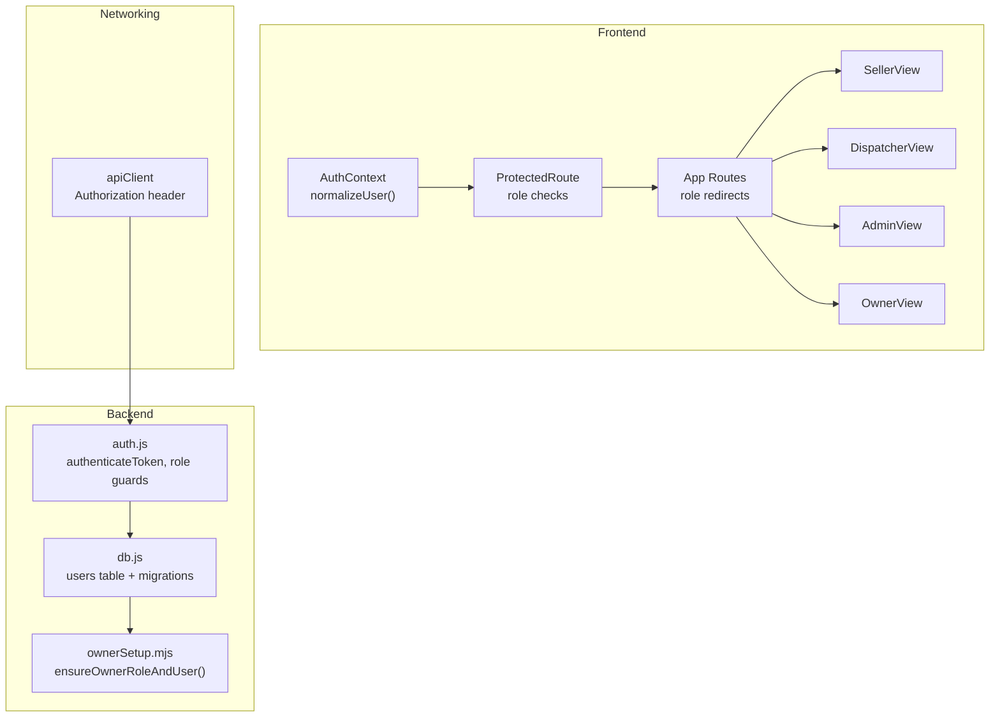
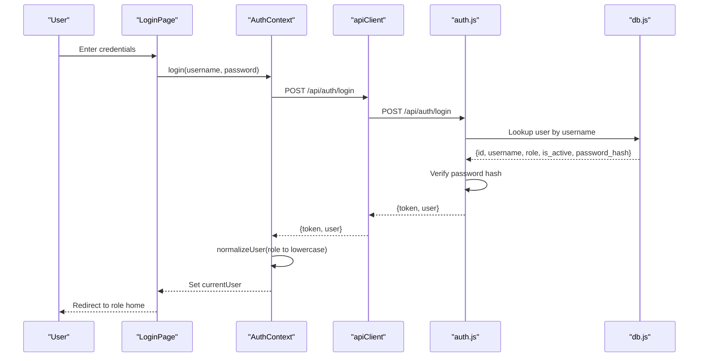
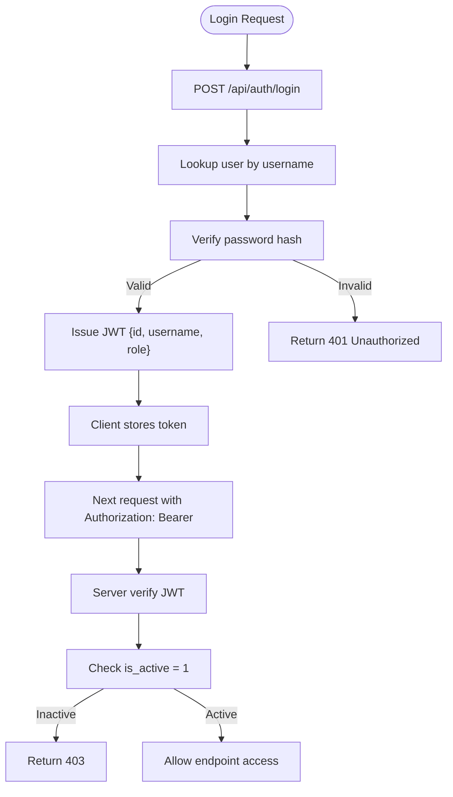
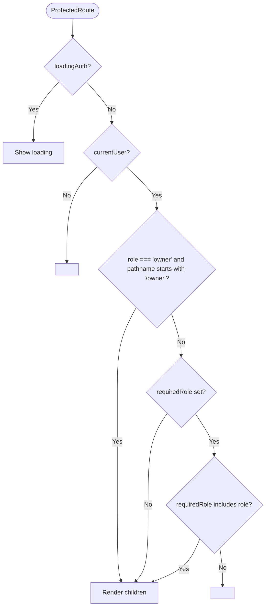
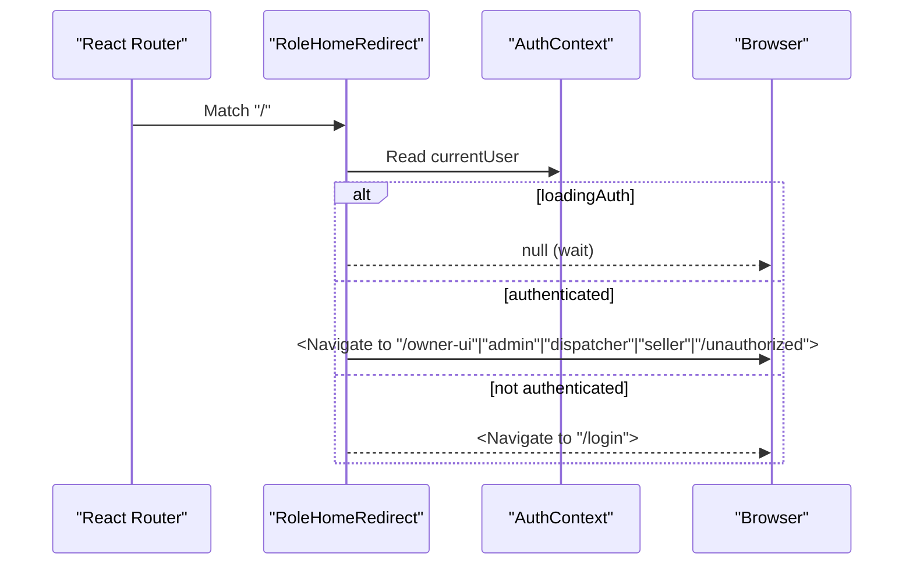
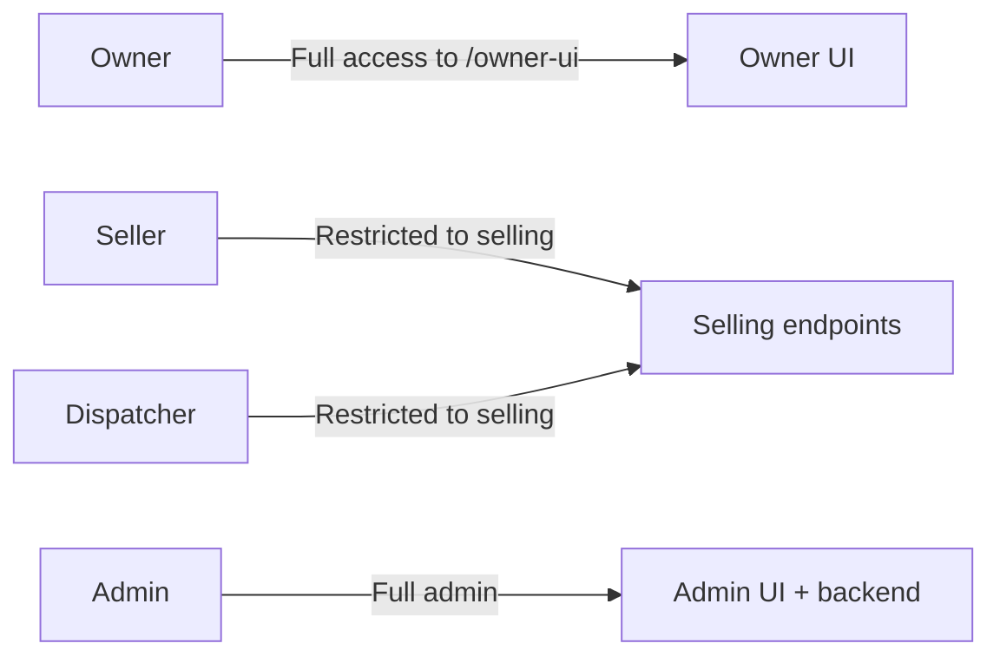
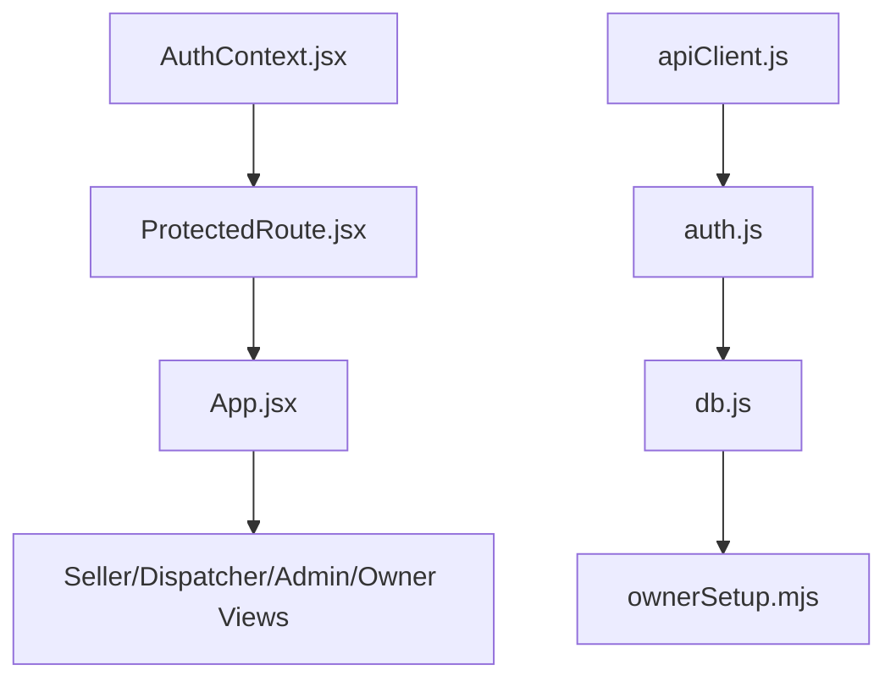

# User Roles & Permissions

<cite>
**Referenced Files in This Document**
- [AuthContext.jsx](file://src/contexts/AuthContext.jsx)
- [ProtectedRoute.jsx](file://src/components/ProtectedRoute.jsx)
- [App.jsx](file://src/App.jsx)
- [LoginPage.jsx](file://src/views/LoginPage.jsx)
- [UnauthorizedPage.jsx](file://src/views/UnauthorizedPage.jsx)
- [auth.js](file://server/auth.js)
- [db.js](file://server/db.js)
- [ownerSetup.mjs](file://server/ownerSetup.mjs)
- [apiClient.js](file://src/utils/apiClient.js)
- [SellerView.jsx](file://src/views/SellerView.jsx)
- [DispatcherView.jsx](file://src/views/DispatcherView.jsx)
- [AdminView.jsx](file://src/views/AdminView.jsx)
- [OwnerView.jsx](file://src/views/OwnerView.jsx)
</cite>

## Table of Contents
1. [Introduction](#introduction)
2. [Project Structure](#project-structure)
3. [Core Components](#core-components)
4. [Architecture Overview](#architecture-overview)
5. [Detailed Component Analysis](#detailed-component-analysis)
6. [Dependency Analysis](#dependency-analysis)
7. [Performance Considerations](#performance-considerations)
8. [Troubleshooting Guide](#troubleshooting-guide)
9. [Conclusion](#conclusion)

## Introduction
This document explains the multi-role user permission system used by the application. It covers the four user roles—Sellers, Dispatchers, Admins, and Owners—detailing their hierarchical permissions, access levels, and enforcement across the frontend and backend. It documents how roles are validated during authentication, how ProtectedRoute enforces navigation restrictions, and how role normalization occurs. Practical examples illustrate role-specific UI rendering, route protection patterns, and scenarios where higher roles can access lower-role areas.

## Project Structure
The permission system spans three layers:
- Frontend routing and protection: App routes, ProtectedRoute, AuthContext, and UI views
- Authentication and authorization middleware: server-side auth routes and role guards
- Database and seeding: users table with role constraints and owner seeding



**Diagram sources**
- [AuthContext.jsx](file://src/contexts/AuthContext.jsx#L6-L11)
- [ProtectedRoute.jsx](file://src/components/ProtectedRoute.jsx#L4-L35)
- [App.jsx](file://src/App.jsx#L24-L38)
- [apiClient.js](file://src/utils/apiClient.js#L23-L28)
- [auth.js](file://server/auth.js#L10-L40)
- [db.js](file://server/db.js#L41-L49)
- [ownerSetup.mjs](file://server/ownerSetup.mjs#L19-L69)

**Section sources**
- [App.jsx](file://src/App.jsx#L40-L136)
- [AuthContext.jsx](file://src/contexts/AuthContext.jsx#L19-L78)
- [ProtectedRoute.jsx](file://src/components/ProtectedRoute.jsx#L4-L35)
- [auth.js](file://server/auth.js#L10-L75)
- [db.js](file://server/db.js#L41-L49)
- [ownerSetup.mjs](file://server/ownerSetup.mjs#L19-L69)

## Core Components
- Role normalization: The frontend normalizes the user role to lowercase to ensure consistent comparisons.
- ProtectedRoute: Enforces role-based access to routes, with special handling for Owner access to the Owner UI.
- AuthContext: Provides login, logout, and current user state; loads user info on startup.
- Server auth: Validates JWT, verifies active user, and exposes role-gated middleware.
- UI views: Render role-specific content and controls.

Key responsibilities:
- Frontend: Route protection, role-aware UI, and user session management
- Backend: Token verification, active-user checks, and role-based endpoint access

**Section sources**
- [AuthContext.jsx](file://src/contexts/AuthContext.jsx#L6-L11)
- [ProtectedRoute.jsx](file://src/components/ProtectedRoute.jsx#L4-L35)
- [auth.js](file://server/auth.js#L10-L75)
- [apiClient.js](file://src/utils/apiClient.js#L23-L28)

## Architecture Overview
The permission architecture combines frontend route protection with backend authorization middleware. On login, the server issues a JWT containing user identity and role. The frontend stores the token and attaches it to all API requests. ProtectedRoute enforces role checks before rendering protected views. Certain routes (Owner UI) are accessible to Owners regardless of the requested route prefix.



**Diagram sources**
- [LoginPage.jsx](file://src/views/LoginPage.jsx#L56-L79)
- [AuthContext.jsx](file://src/contexts/AuthContext.jsx#L55-L63)
- [apiClient.js](file://src/utils/apiClient.js#L91-L98)
- [auth.js](file://server/auth.js#L120-L142)
- [db.js](file://server/db.js#L41-L49)

## Detailed Component Analysis

### Role Model and Hierarchy
- Roles: seller, dispatcher, admin, owner
- Database constraint ensures role values are one of the above
- Owner is granted broad access to the Owner UI regardless of route prefix
- Sellers and Dispatchers share some selling-related capabilities on the backend

```mermaid
classDiagram
class User {
+integer id
+string username
+string role
+integer is_active
}
class Roles {
<<enumeration>>
"seller"
"dispatcher"
"admin"
"owner"
}
User --> Roles : "role"
```

**Diagram sources**
- [db.js](file://server/db.js#L41-L49)

**Section sources**
- [db.js](file://server/db.js#L41-L49)
- [ownerSetup.mjs](file://server/ownerSetup.mjs#L19-L69)

### Role Normalization
The frontend normalizes the user role to lowercase to avoid mismatches caused by inconsistent casing returned by the server.

- Purpose: Ensure consistent role comparisons across the app
- Mechanism: A small utility transforms the role field to lowercase before storing in context

**Section sources**
- [AuthContext.jsx](file://src/contexts/AuthContext.jsx#L6-L11)

### Authentication and Authorization Flow
- Login: Client posts credentials; server validates and returns a JWT with user identity and role
- Token storage: Client stores token and attaches it to all subsequent requests
- Token verification: Server middleware decodes JWT and verifies active user
- Endpoint gating: Role-specific middleware restricts access to sensitive endpoints



**Diagram sources**
- [auth.js](file://server/auth.js#L120-L142)
- [auth.js](file://server/auth.js#L10-L40)
- [apiClient.js](file://src/utils/apiClient.js#L23-L28)

**Section sources**
- [auth.js](file://server/auth.js#L10-L75)
- [apiClient.js](file://src/utils/apiClient.js#L23-L28)

### ProtectedRoute Enforcement
ProtectedRoute enforces role-based navigation:
- If loadingAuth, renders a loading indicator
- If not authenticated, redirects to login
- Owner gets automatic access to Owner UI routes
- Otherwise, compares requiredRole against currentUser.role



**Diagram sources**
- [ProtectedRoute.jsx](file://src/components/ProtectedRoute.jsx#L4-L35)

**Section sources**
- [ProtectedRoute.jsx](file://src/components/ProtectedRoute.jsx#L4-L35)

### Role-Based Navigation and Redirection
- Root and wildcard routes redirect authenticated users to role-specific home pages
- Owner is redirected to Owner UI; others to their respective dashboards
- Unauthorized users are redirected to an unauthorized page



**Diagram sources**
- [App.jsx](file://src/App.jsx#L24-L38)

**Section sources**
- [App.jsx](file://src/App.jsx#L24-L38)

### Role-Specific UI Rendering Examples
- Seller UI: Step-based ticket sale flow with trip selection and seat confirmation
- Dispatcher UI: Trips list, selling and boarding, slot management, maps, and shift close
- Admin UI: Dashboard stats, boat management, working zone map, and user management
- Owner UI: Money, comparison, boats, sellers, motivation, settings, load, export

These views are rendered behind ProtectedRoute with requiredRole set appropriately.

**Section sources**
- [SellerView.jsx](file://src/views/SellerView.jsx#L37-L370)
- [DispatcherView.jsx](file://src/views/DispatcherView.jsx#L23-L291)
- [AdminView.jsx](file://src/views/AdminView.jsx#L10-L382)
- [OwnerView.jsx](file://src/views/OwnerView.jsx#L164-L384)

### Permission Escalation Scenarios
- Owner access to Owner UI: Owners can access Owner UI routes regardless of the route prefix
- Seller/Dispatcher shared capabilities: Both can access selling endpoints on the backend
- Admin access: Full administrative capabilities across the Admin UI and backend



**Diagram sources**
- [ProtectedRoute.jsx](file://src/components/ProtectedRoute.jsx#L18-L21)
- [auth.js](file://server/auth.js#L47-L71)

**Section sources**
- [ProtectedRoute.jsx](file://src/components/ProtectedRoute.jsx#L18-L32)
- [auth.js](file://server/auth.js#L47-L71)

## Dependency Analysis
- Frontend depends on AuthContext for user state and ProtectedRoute for route protection
- ProtectedRoute depends on AuthContext and React Router for navigation
- apiClient attaches Authorization headers for all API calls
- Server auth middleware depends on JWT verification and database user lookup
- Database enforces role constraints and seeds Owner role and user



**Diagram sources**
- [AuthContext.jsx](file://src/contexts/AuthContext.jsx#L19-L78)
- [ProtectedRoute.jsx](file://src/components/ProtectedRoute.jsx#L4-L35)
- [App.jsx](file://src/App.jsx#L40-L136)
- [apiClient.js](file://src/utils/apiClient.js#L23-L28)
- [auth.js](file://server/auth.js#L10-L40)
- [db.js](file://server/db.js#L41-L49)
- [ownerSetup.mjs](file://server/ownerSetup.mjs#L19-L69)

**Section sources**
- [App.jsx](file://src/App.jsx#L40-L136)
- [ProtectedRoute.jsx](file://src/components/ProtectedRoute.jsx#L4-L35)
- [auth.js](file://server/auth.js#L10-L75)
- [db.js](file://server/db.js#L41-L49)

## Performance Considerations
- Token verification occurs on every protected request; keep JWT payload minimal
- Role checks are O(1) string comparisons in the frontend
- Avoid unnecessary re-renders by memoizing derived values (e.g., role normalization)
- Network logging in apiClient helps diagnose slow or failing requests

## Troubleshooting Guide
Common issues and resolutions:
- Unauthorized access: Ensure the user’s role matches the route’s requiredRole; Owners can access Owner UI regardless of route prefix
- Login failures: Verify credentials and that the user account is active
- Token errors: Confirm Authorization header is present and valid; re-login if needed
- Role mismatch: Check role normalization to lowercase and ensure backend role values are valid

**Section sources**
- [ProtectedRoute.jsx](file://src/components/ProtectedRoute.jsx#L4-L35)
- [auth.js](file://server/auth.js#L10-L40)
- [apiClient.js](file://src/utils/apiClient.js#L23-L28)
- [UnauthorizedPage.jsx](file://src/views/UnauthorizedPage.jsx#L1-L23)

## Conclusion
The application implements a clear, layered permission model:
- Roles are normalized and enforced consistently on the frontend
- ProtectedRoute provides robust navigation restrictions
- Server-side auth middleware validates tokens and active users
- Owners receive broad access to the Owner UI while other roles are restricted to their domains
- The system balances usability with strong security boundaries across roles