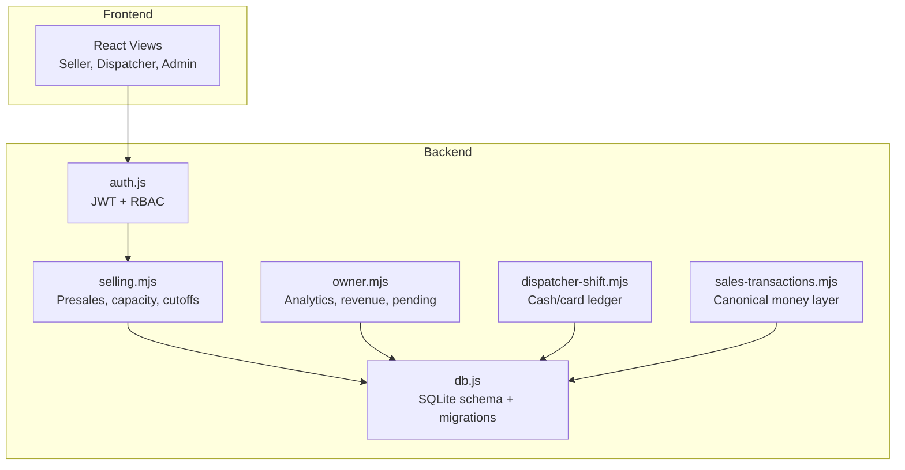
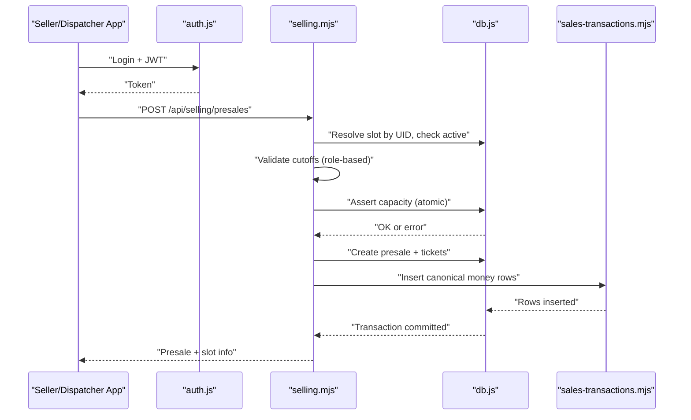
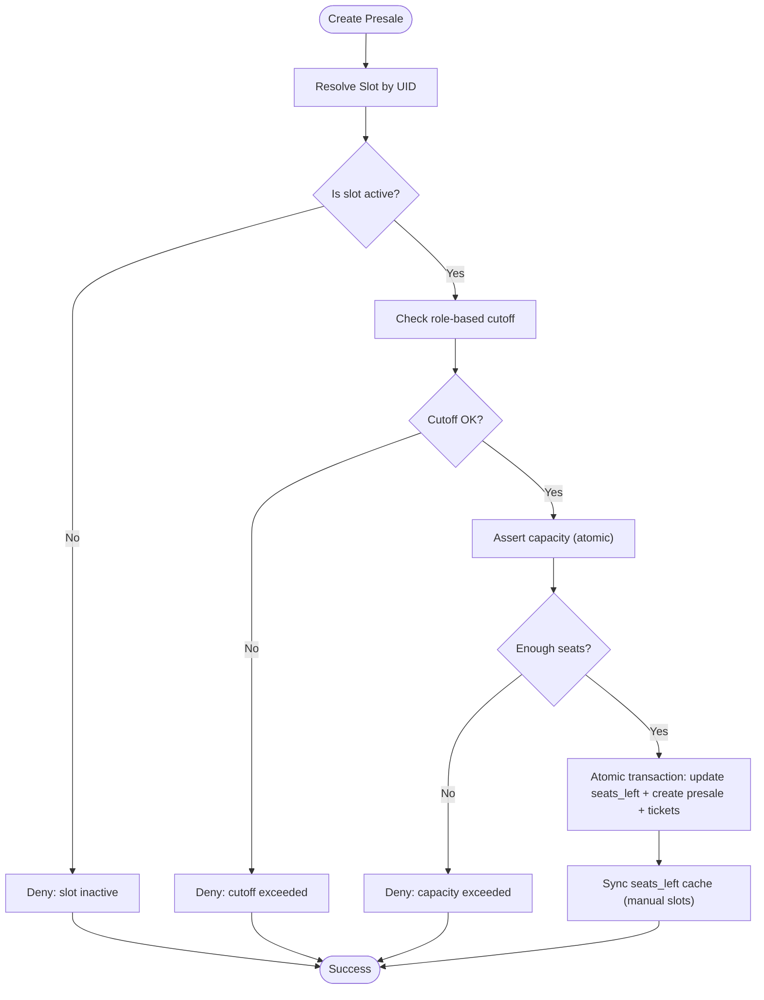
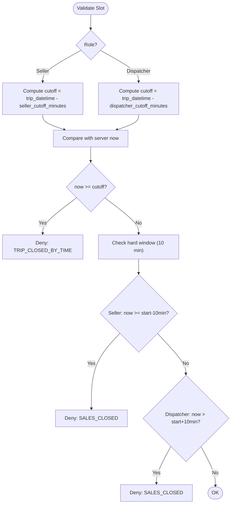
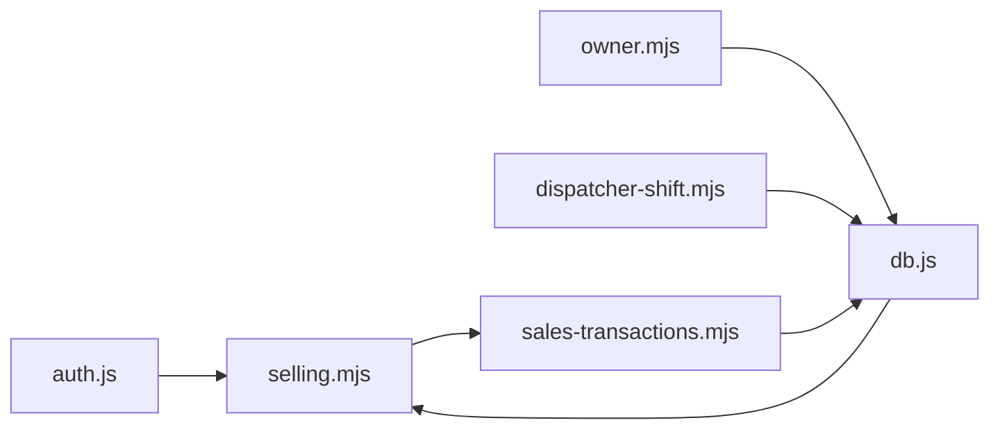

# Business Rules & Policies

<cite>
**Referenced Files in This Document**
- [BUSINESS_RULES.md](file://docs/BUSINESS_RULES.md)
- [TIME_RULES.md](file://docs/TIME_RULES.md)
- [GLOSSARY.md](file://docs/GLOSSARY.md)
- [PROJECT_PRINCIPLES.md](file://docs/PROJECT_PRINCIPLES.md)
- [README.md](file://README.md)
- [selling.mjs](file://server/selling.mjs)
- [db.js](file://server/db.js)
- [auth.js](file://server/auth.js)
- [sales-transactions.mjs](file://server/sales-transactions.mjs)
- [owner.mjs](file://server/owner.mjs)
- [dispatcher-shift.mjs](file://server/dispatcher-shift.mjs)
- [migration_add_trip_date.sql](file://server/migration_add_trip_date.sql)
</cite>

## Table of Contents
1. [Introduction](#introduction)
2. [Project Structure](#project-structure)
3. [Core Components](#core-components)
4. [Architecture Overview](#architecture-overview)
5. [Detailed Component Analysis](#detailed-component-analysis)
6. [Dependency Analysis](#dependency-analysis)
7. [Performance Considerations](#performance-considerations)
8. [Troubleshooting Guide](#troubleshooting-guide)
9. [Conclusion](#conclusion)
10. [Appendices](#appendices)

## Introduction
This document codifies the business rules and operational policies for the boat ticketing system. It covers seat availability and capacity management, real-time updates and overbooking prevention, time management rules (cutoffs, scheduling constraints, and late booking policies), pricing strategies (base fares, surcharges, discounts, and promotional models), presale management (advance booking limits, cancellation and refund procedures), revenue sharing and payouts, and operational guidelines for peak season management, capacity planning, and demand forecasting. It also includes a glossary of business terms and the project principles that guide system behavior, along with practical examples of rule enforcement, exception handling, and policy violations.

## Project Structure
The system is a mobile-first web application with a React frontend and a Node.js/Express backend. Business logic is primarily implemented in server-side modules:
- Authentication and authorization middleware
- Selling and presale creation/validation
- Database schema and migrations
- Owner analytics and money ledger
- Dispatcher shift and cash handling

**Diagram sources**
- [auth.js](file://server/auth.js#L1-L154)
- [db.js](file://server/db.js#L1-L1269)
- [selling.mjs](file://server/selling.mjs#L1-L4679)
- [sales-transactions.mjs](file://server/sales-transactions.mjs#L1-L237)
- [owner.mjs](file://server/owner.mjs#L1-L515)
- [dispatcher-shift.mjs](file://server/dispatcher-shift.mjs#L1-L62)

**Section sources**
- [README.md](file://README.md#L1-L150)

## Core Components
- Seat availability and capacity management:
  - Real-time seat counting using active ticket statuses
  - Separate handling for manual and generated slots
  - Overbooking prevention via atomic transactions and seat cache synchronization
- Time management:
  - Role-based cutoff logic (seller and dispatcher)
  - Hard cutoff windows around trip start/end times
  - Consistent server-time usage with no client-time
- Pricing:
  - Inheritance of prices from generated slots, boats, or legacy slot prices
  - Support for per-ticket-type pricing (adult/teen/child) and legacy per-seat totals
- Presales and refunds:
  - Structured error codes and explicit failures
  - Payment split persistence and canonical money rows
- Revenue and payouts:
  - Owner analytics by trip day and payment method
  - Dispatcher shift deposit ledger for cash/card reconciliation

**Section sources**
- [BUSINESS_RULES.md](file://docs/BUSINESS_RULES.md#L1-L49)
- [TIME_RULES.md](file://docs/TIME_RULES.md#L1-L47)
- [PROJECT_PRINCIPLES.md](file://docs/PROJECT_PRINCIPLES.md#L1-L9)
- [selling.mjs](file://server/selling.mjs#L1-L4679)
- [owner.mjs](file://server/owner.mjs#L1-L515)
- [dispatcher-shift.mjs](file://server/dispatcher-shift.mjs#L1-L62)

## Architecture Overview
The system enforces business rules at the API boundary and in the database layer:
- Authentication middleware validates roles and active status
- Selling endpoints validate capacity, cutoffs, and seat availability
- Canonical money layer records cash/card splits per ticket
- Owner endpoints compute revenue, pending, and analytics by trip day

**Diagram sources**
- [auth.js](file://server/auth.js#L10-L75)
- [selling.mjs](file://server/selling.mjs#L642-L1599)
- [db.js](file://server/db.js#L1-L1269)
- [sales-transactions.mjs](file://server/sales-transactions.mjs#L167-L236)

## Detailed Component Analysis

### Seat Availability, Capacity Management, and Overbooking Prevention
- Source of truth:
  - For manual slots: count tickets by boat slot ID with active/occupied statuses
  - For generated slots: count presales by slot UID and keep generated_slots.seats_left synchronized
- Overbooking prevention:
  - Atomic transaction decrements seats_left and creates presale
  - Additional capacity assertion using presales aggregation for generated slots
  - Cache synchronization for UI consistency
- Real-time updates:
  - seats_left updated on presale creation and seat restoration
  - Manual slots also refresh seats_left cache after recalculations

**Diagram sources**
- [selling.mjs](file://server/selling.mjs#L1129-L1509)
- [selling.mjs](file://server/selling.mjs#L30-L102)

**Section sources**
- [selling.mjs](file://server/selling.mjs#L30-L102)
- [selling.mjs](file://server/selling.mjs#L1129-L1509)

### Time Management Rules: Cutoffs, Scheduling Constraints, and Late Booking
- Time source:
  - Server time only; no client-side time or timezone guessing
- Cutoff logic:
  - seller_cutoff_minutes: seller cannot sell after trip_datetime - seller_cutoff_minutes
  - dispatcher_cutoff_minutes: dispatcher can sell until trip_datetime + dispatcher_cutoff_minutes
  - For generated slots, cutoff computed using trip_date + time; for manual slots, today’s time is used
- Additional hard windows:
  - Seller sales closed 10 minutes before trip start
  - Dispatcher sales closed 10 minutes after trip start
- Cutoff enforcement:
  - Explicit error codes and debug logs for time violations

**Diagram sources**
- [TIME_RULES.md](file://docs/TIME_RULES.md#L16-L47)
- [selling.mjs](file://server/selling.mjs#L894-L1071)

**Section sources**
- [TIME_RULES.md](file://docs/TIME_RULES.md#L1-L47)
- [selling.mjs](file://server/selling.mjs#L894-L1071)

### Pricing Strategies: Base Fares, Surcharges, Discounts, Promotions
- Price inheritance:
  - Generated slots: per-type prices (adult/teen/child) or legacy price
  - Boats: default per-type prices
  - Fallback: legacy slot.price
- Ticket breakdown:
  - New model supports specifying adult/teen/child counts with per-type pricing
  - Legacy model: total price equals unit price × number of seats
- Payment method:
  - Supports CASH, CARD, MIXED; enforced and persisted for analytics consistency

**Section sources**
- [selling.mjs](file://server/selling.mjs#L1082-L1118)
- [selling.mjs](file://server/selling.mjs#L1304-L1333)

### Presale Management: Advance Booking Limits, Cancellations, Refunds
- Presale lifecycle:
  - Creation requires slotUid, customer details, and seat count
  - Prepayment validation and payment split persistence
  - Tickets created with deterministic order (adult → teen → child) for UI consistency
- Cancellation/refund:
  - Presales tracked with status; excluded statuses prevent canonical money insertion
  - Dispatcher shift ledger supports cash/card reconciliation

**Section sources**
- [selling.mjs](file://server/selling.mjs#L642-L816)
- [sales-transactions.mjs](file://server/sales-transactions.mjs#L6-L144)
- [dispatcher-shift.mjs](file://server/dispatcher-shift.mjs#L7-L59)

### Revenue Sharing, Commission, and Payout Calculations
- Owner analytics:
  - Revenue by trip day (business_day) using presales and generated slots
  - Cash/card totals computed from presales payment splits
  - Pending computed as total_price minus posted payments
- Dispatcher shift ledger:
  - Deposits categorized for owner cash/terminal and salary payouts
- Canonical money layer:
  - One row per ticket with amount and method for accurate analytics

**Section sources**
- [owner.mjs](file://server/owner.mjs#L118-L187)
- [owner.mjs](file://server/owner.mjs#L193-L248)
- [owner.mjs](file://server/owner.mjs#L293-L414)
- [sales-transactions.mjs](file://server/sales-transactions.mjs#L167-L236)
- [dispatcher-shift.mjs](file://server/dispatcher-shift.mjs#L7-L59)

### Operational Guidelines: Peak Season, Capacity Planning, Demand Forecasting
- Capacity planning:
  - seats_left maintained per slot; cache refreshed after presale creation
  - generated_slots seats_left synchronized from presales for accuracy
- Demand forecasting:
  - Owner endpoints aggregate revenue, tickets, and trips by preset ranges
  - Fill percentage estimation for generated slots based on sold + seats_left
- Seasonal scheduling:
  - schedule_template_items and schedule_templates tables support recurring schedules

**Section sources**
- [selling.mjs](file://server/selling.mjs#L96-L102)
- [owner.mjs](file://server/owner.mjs#L359-L400)
- [db.js](file://server/db.js#L650-L793)

### Glossary of Business Terms
- slot: trip instance
- slotUid: global identifier for a slot (manual:<id> or generated:<id>)
- manual slot: created directly
- generated slot: created from a schedule template
- cutoff: moment when sales close for a role
- presale: ticket sale record
- seller: front-line salesperson
- dispatcher: supervisor who can override and manage operations

**Section sources**
- [GLOSSARY.md](file://docs/GLOSSARY.md#L1-L11)

### Project Principles
- No guessing, no silent fallbacks, no magic defaults
- Errors must be explicit
- Same logic for manual and generated slots
- slotUid everywhere for consistent linking

**Section sources**
- [PROJECT_PRINCIPLES.md](file://docs/PROJECT_PRINCIPLES.md#L1-L9)

## Dependency Analysis
Key dependencies and relationships:
- selling.mjs depends on db.js for seat counting, slot resolution, and transactions
- sales-transactions.mjs depends on presales and generated_slots for canonical money rows
- owner.mjs depends on presales, money ledger, and generated_slots for analytics
- auth.js provides role-based access for selling and dispatcher actions

**Diagram sources**
- [auth.js](file://server/auth.js#L1-L154)
- [selling.mjs](file://server/selling.mjs#L1-L4679)
- [db.js](file://server/db.js#L1-L1269)
- [sales-transactions.mjs](file://server/sales-transactions.mjs#L1-L237)
- [owner.mjs](file://server/owner.mjs#L1-L515)
- [dispatcher-shift.mjs](file://server/dispatcher-shift.mjs#L1-L62)

**Section sources**
- [auth.js](file://server/auth.js#L1-L154)
- [selling.mjs](file://server/selling.mjs#L1-L4679)
- [db.js](file://server/db.js#L1-L1269)
- [sales-transactions.mjs](file://server/sales-transactions.mjs#L1-L237)
- [owner.mjs](file://server/owner.mjs#L1-L515)
- [dispatcher-shift.mjs](file://server/dispatcher-shift.mjs#L1-L62)

## Performance Considerations
- Atomic transactions ensure consistency and reduce race conditions
- seats_left cache updates minimize UI inconsistencies
- Canonical money triggers and indexes improve analytics performance
- Role-based cutoff checks leverage database datetime comparisons

[No sources needed since this section provides general guidance]

## Troubleshooting Guide
Common issues and resolutions:
- Capacity exceeded:
  - Symptom: 409 CAPACITY_EXCEEDED
  - Resolution: Verify seats_left and presales aggregation; ensure generated_slots cache is fresh
- Slot not found or invalid:
  - Symptom: SLOT_NOT_FOUND or SLOT_UID_INVALID
  - Resolution: Validate slotUid format and existence; for generated slots, confirm tripDate alignment
- Cutoff exceeded:
  - Symptom: TRIP_CLOSED_BY_TIME or SALES_CLOSED
  - Resolution: Respect role-based cutoffs and hard windows around trip start
- Payment split mismatch:
  - Symptom: INVALID_PAYMENT_SPLIT
  - Resolution: Ensure prepayment equals sum of cash and card amounts
- Missing trip_date:
  - Symptom: SLOT_DATE_MISMATCH
  - Resolution: Provide trip_date for generated slots or ensure generated_slots has trip_date

**Section sources**
- [selling.mjs](file://server/selling.mjs#L820-L866)
- [selling.mjs](file://server/selling.mjs#L908-L948)
- [selling.mjs](file://server/selling.mjs#L1050-L1071)
- [selling.mjs](file://server/selling.mjs#L800-L811)

## Conclusion
The boat ticketing system enforces strict, explicit business rules across seat availability, time management, pricing, presales, and revenue analytics. Its architecture couples role-based authorization, atomic transactions, and canonical money recording to ensure correctness, transparency, and operability under peak conditions. Adhering to the documented policies and troubleshooting steps will maintain system integrity and compliance.

[No sources needed since this section summarizes without analyzing specific files]

## Appendices

### Practical Examples of Rule Enforcement and Policy Violations
- Example: Seller attempts to book 5 seats on a manual slot with 3 seats left
  - Enforced by assertCapacityOrThrow and seat availability checks
  - Violation: NO_SEATS or CAPACITY_EXCEEDED
- Example: Dispatcher tries to sell 2 hours after trip start
  - Enforced by hard window logic
  - Violation: SALES_CLOSED
- Example: Prepayment exceeds total price
  - Enforced by prepayment validation
  - Violation: PREPAYMENT_EXCEEDS_TOTAL
- Example: Generated slot with mismatched date
  - Enforced by resolveSlotByUid with date-specific query
  - Violation: SLOT_DATE_MISMATCH

**Section sources**
- [selling.mjs](file://server/selling.mjs#L52-L60)
- [selling.mjs](file://server/selling.mjs#L1074-L1080)
- [selling.mjs](file://server/selling.mjs#L1121-L1127)
- [selling.mjs](file://server/selling.mjs#L826-L844)

### Compliance and Regulatory Considerations
- Explicit error reporting and structured messages
- Canonical money layer for auditability
- Owner audit log table present for owner actions
- Server-only time source avoids timezone ambiguity

**Section sources**
- [PROJECT_PRINCIPLES.md](file://docs/PROJECT_PRINCIPLES.md#L1-L9)
- [sales-transactions.mjs](file://server/sales-transactions.mjs#L1-L237)
- [db.js](file://server/db.js#L1250-L1269)

### Business Continuity Procedures
- Database file location and WAL mode configured for reliability
- Seeding of initial users and boats for bootstrap
- Unique constraints on generated_slots to prevent duplicate trips
- Migration scripts to evolve schema safely

**Section sources**
- [db.js](file://server/db.js#L11-L26)
- [db.js](file://server/db.js#L825-L871)
- [db.js](file://server/db.js#L728-L751)
- [migration_add_trip_date.sql](file://server/migration_add_trip_date.sql#L1-L9)