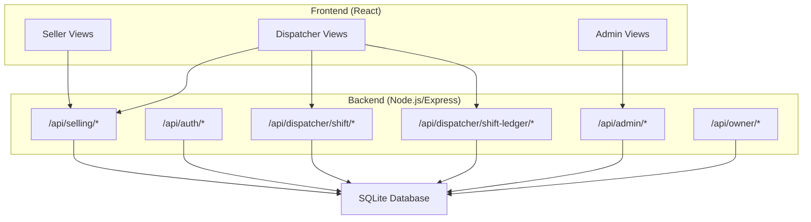
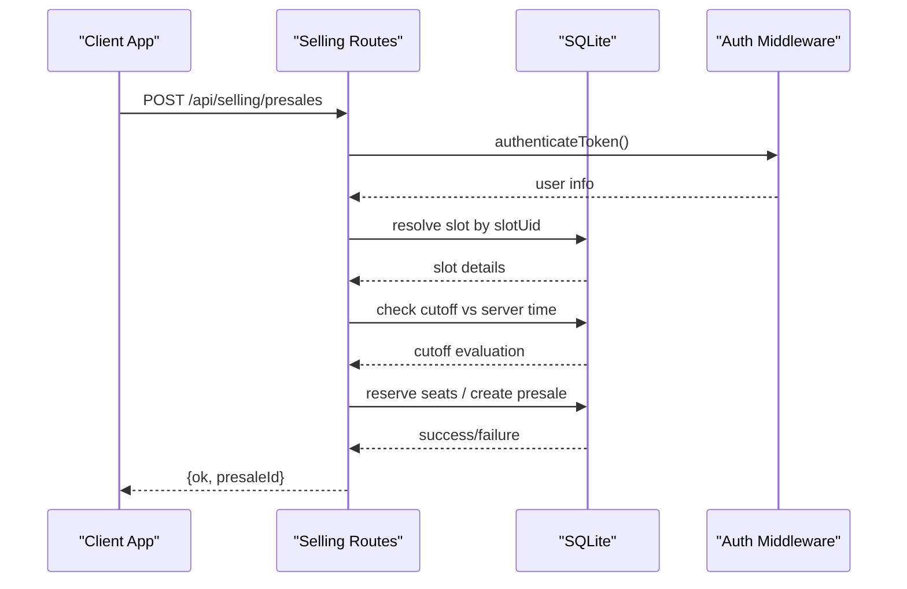
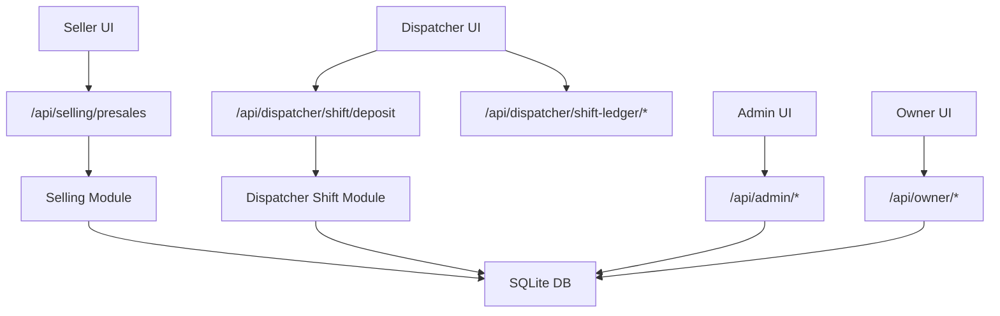

# Glossary & Terms

<cite>
**Referenced Files in This Document**
- [docs/README.md](file://docs/README.md)
- [docs/GLOSSARY.md](file://docs/GLOSSARY.md)
- [docs/BUSINESS_RULES.md](file://docs/BUSINESS_RULES.md)
- [docs/API_CONTRACT.md](file://docs/API_CONTRACT.md)
- [docs/TIME_RULES.md](file://docs/TIME_RULES.md)
- [server/db.js](file://server/db.js)
- [server/index.js](file://server/index.js)
- [server/sales-transactions.mjs](file://server/sales-transactions.mjs)
- [server/dispatcher-shift.mjs](file://server/dispatcher-shift.mjs)
- [server/selling.mjs](file://server/selling.mjs)
- [src/components/seller/SellTicketScreen.jsx](file://src/components/seller/SellTicketScreen.jsx)
- [src/components/dispatcher/SlotManagement.jsx](file://src/components/dispatcher/SlotManagement.jsx)
- [src/views/AdminView.jsx](file://src/views/AdminView.jsx)
- [src/utils/slotAvailability.js](file://src/utils/slotAvailability.js)
</cite>

## Table of Contents
1. [Introduction](#introduction)
2. [Project Structure](#project-structure)
3. [Core Components](#core-components)
4. [Architecture Overview](#architecture-overview)
5. [Detailed Component Analysis](#detailed-component-analysis)
6. [Dependency Analysis](#dependency-analysis)
7. [Performance Considerations](#performance-considerations)
8. [Troubleshooting Guide](#troubleshooting-guide)
9. [Conclusion](#conclusion)
10. [Appendices](#appendices)

## Introduction
This glossary defines all business and technical terminology used throughout the boat ticketing system. It covers:
- Business concepts: slot, trip, presale, cutoff time, capacity management, and related operational terms
- Technical terminology: database schemas, API endpoints, and system components
- Role-specific terms for sellers, dispatchers, administrators, and owners
- Acronyms, abbreviations, and industry-specific jargon
- Pronunciation guides and contextual usage examples
- Term evolution, historical context, and standardization efforts

## Project Structure
The system is a mobile-first web application with a React frontend and a Node.js/Express backend. The backend uses SQLite for persistence and exposes REST endpoints under /api.

**Diagram sources**
- [server/index.js](file://server/index.js#L25-L40)
- [server/db.js](file://server/db.js#L11-L93)

**Section sources**
- [docs/README.md](file://docs/README.md#L1-L150)
- [server/index.js](file://server/index.js#L20-L45)

## Core Components
- Slot: A scheduled departure instance for a specific boat at a given time and date. Slots are either manually created or generated from templates.
- Trip: Synonymous with slot in this system; a scheduled sailing instance.
- Presale: A booking or pre-sale transaction linked to a slotUid.
- Cutoff time: A time threshold derived from the trip’s departure time and configured cutoff minutes; after this time, sales are restricted by role.
- Capacity management: Tracks total capacity, remaining seats, and seat availability across slots and boats.
- Role-based access: Sellers and dispatchers have different cutoff windows; administrators manage users and settings; owners oversee operations.

**Section sources**
- [docs/GLOSSARY.md](file://docs/GLOSSARY.md#L1-L11)
- [docs/BUSINESS_RULES.md](file://docs/BUSINESS_RULES.md#L3-L49)
- [docs/API_CONTRACT.md](file://docs/API_CONTRACT.md#L1-L34)
- [docs/TIME_RULES.md](file://docs/TIME_RULES.md#L9-L47)

## Architecture Overview
The system enforces time-based cutoff logic centrally in the backend. Sales requests are validated against role-specific cutoff rules and slot availability before being processed.

**Diagram sources**
- [docs/API_CONTRACT.md](file://docs/API_CONTRACT.md#L18-L34)
- [server/selling.mjs](file://server/selling.mjs#L941-L974)
- [server/db.js](file://server/db.js#L11-L93)

## Detailed Component Analysis

### Business Concepts Glossary
- Slot
  - Definition: A scheduled departure instance for a specific boat at a given time and date.
  - Variants: manual slot (created directly), generated slot (created from a schedule template).
  - Context: All slots must behave identically regarding cutoff rules regardless of type.
  - Usage: Linked to presales via slotUid.
  - Pronunciation guide: “slot” as in “slot”.
  - Historical note: Manual and generated slots were unified to ensure consistent business rules.
  - Section sources
    - [docs/BUSINESS_RULES.md](file://docs/BUSINESS_RULES.md#L21-L30)
    - [docs/API_CONTRACT.md](file://docs/API_CONTRACT.md#L3-L14)

- Trip
  - Definition: Synonym for slot; refers to a scheduled sailing instance.
  - Usage: Often used interchangeably with slot in UI and business logic.
  - Section sources
    - [docs/BUSINESS_RULES.md](file://docs/BUSINESS_RULES.md#L21-L30)

- Presale
  - Definition: A booking or pre-sale transaction tied to a slotUid.
  - Data linkage: Presales reference slots via slotUid; later, a dedicated slot_uid column supports generated slots.
  - Section sources
    - [docs/BUSINESS_RULES.md](file://docs/BUSINESS_RULES.md#L44-L49)
    - [docs/API_CONTRACT.md](file://docs/API_CONTRACT.md#L18-L34)
    - [server/db.js](file://server/db.js#L334-L361)

- Cutoff time
  - Definition: A computed time threshold used to restrict sales based on role and slot type.
  - Formula: trip_datetime minus cutoff minutes; enforced server-side.
  - Roles:
    - Seller cutoff: applies to both manual and generated slots.
    - Dispatcher cutoff: always greater than or equal to seller cutoff.
  - Section sources
    - [docs/TIME_RULES.md](file://docs/TIME_RULES.md#L16-L47)
    - [docs/BUSINESS_RULES.md](file://docs/BUSINESS_RULES.md#L3-L19)

- Capacity management
  - Definitions:
    - Capacity: Total seats available for a slot.
    - Seats left: Remaining seats for sale.
    - Seats available: Normalized availability across multiple fields.
  - Section sources
    - [server/db.js](file://server/db.js#L68-L85)
    - [src/utils/slotAvailability.js](file://src/utils/slotAvailability.js#L7-L19)

- Role-specific terms
  - Seller: Can sell tickets only up to seller_cutoff_minutes before departure; cannot override cutoff rules.
  - Dispatcher: Can sell tickets up to dispatcher_cutoff_minutes before departure; may override seller restrictions.
  - Administrator: Manages users, boats, templates, and system settings.
  - Owner: Operates at a higher level; owner role and user seeding are part of migrations.
  - Section sources
    - [docs/BUSINESS_RULES.md](file://docs/BUSINESS_RULES.md#L3-L19)
    - [server/db.js](file://server/db.js#L51-L52)

### Technical Terminology Glossary
- slotUid
  - Definition: The single acceptable identifier for a slot. Format: manual:<id> or generated:<id>.
  - Usage: Required in presale requests; replaces legacy identifiers.
  - Section sources
    - [docs/API_CONTRACT.md](file://docs/API_CONTRACT.md#L3-L14)
    - [docs/BUSINESS_RULES.md](file://docs/BUSINESS_RULES.md#L46-L49)

- Presales endpoint
  - Endpoint: POST /api/selling/presales
  - Payload fields: slotUid, numberOfSeats, tickets, customerName, customerPhone, prepaymentAmount.
  - Section sources
    - [docs/API_CONTRACT.md](file://docs/API_CONTRACT.md#L18-L34)

- Dispatcher shift deposit
  - Endpoint: POST /api/dispatcher/shift/deposit
  - Purpose: Records dispatcher shift-related cash terminal deposits or payouts.
  - Section sources
    - [server/dispatcher-shift.mjs](file://server/dispatcher-shift.mjs#L7-L59)

- Money ledger and sales transactions
  - Money ledger: Tracks dispatcher shift events with business_day and trip_day.
  - Sales transactions: Canonical owner analytics records created after a trip is auto-completed; aggregates cash/card amounts by slotUid.
  - Section sources
    - [server/dispatcher-shift.mjs](file://server/dispatcher-shift.mjs#L32-L52)
    - [server/sales-transactions.mjs](file://server/sales-transactions.mjs#L34-L63)
    - [server/sales-transactions.mjs](file://server/sales-transactions.mjs#L167-L236)

- Database schemas
  - Users: Stores usernames, hashed passwords, roles, and activity status.
  - Boats: Stores boat metadata including type and pricing tiers.
  - Boat slots: Stores manual slot details including capacity, seats_left, cutoff minutes, and pricing tiers.
  - Presales: Stores presale records with customer info, totals, and optional payment splits.
  - Tickets: Tracks individual tickets derived from presales.
  - Trip templates and schedule templates: Support recurring scheduling and generation of slots.
  - Generated slots: Persisted copies of generated slots with date and pricing.
  - Settings: Stores migration markers and normalization flags.
  - Section sources
    - [server/db.js](file://server/db.js#L41-L109)
    - [server/db.js](file://server/db.js#L559-L593)
    - [server/db.js](file://server/db.js#L616-L647)
    - [server/db.js](file://server/db.js#L688-L726)
    - [server/db.js](file://server/db.js#L649-L686)

### Role-Specific Terms
- Seller
  - Responsibilities: Sell tickets up to seller_cutoff_minutes before departure; cannot override cutoff rules.
  - UI context: Sell ticket flow, earnings summary, and sales history.
  - Section sources
    - [docs/BUSINESS_RULES.md](file://docs/BUSINESS_RULES.md#L5-L10)
    - [src/components/seller/SellTicketScreen.jsx](file://src/components/seller/SellTicketScreen.jsx#L1-L29)

- Dispatcher
  - Responsibilities: Manage trips, view passenger lists, mark boarding/refunds, and operate shift deposit ledger.
  - UI context: Slot management, schedule templates, and trip lists.
  - Section sources
    - [docs/BUSINESS_RULES.md](file://docs/BUSINESS_RULES.md#L11-L19)
    - [src/components/dispatcher/SlotManagement.jsx](file://src/components/dispatcher/SlotManagement.jsx#L1-L800)

- Administrator
  - Responsibilities: Dashboard stats, seller performance, user management (create, enable/disable, reset password).
  - Section sources
    - [docs/BUSINESS_RULES.md](file://docs/BUSINESS_RULES.md#L16-L19)
    - [src/views/AdminView.jsx](file://src/views/AdminView.jsx#L1-L382)

- Owner
  - Responsibilities: Operational oversight; owner role and user seeding are part of migrations.
  - Section sources
    - [server/db.js](file://server/db.js#L51-L52)

### Acronyms and Abbreviations
- UI: User Interface
- API: Application Programming Interface
- DB: Database
- UTC: Coordinated Universal Time
- CASH/CARD/MIXED: Payment method categories
- OK: Success indicator in responses
- ID: Identifier

### Industry-Specific Jargon
- Presale: Pre-sale booking prior to departure.
- Cutoff: Closing time window for sales relative to departure.
- Auto-complete: Automated completion of trips to finalize analytics.
- Shift deposit: Cash terminal deposit or payout for dispatcher shifts.

### Pronunciation Guides
- slot: “slot”
- presale: “pre-sale”
- dispatcher: “dis-PATCH-er”
- cutoff: “CUT-off”

### Contextual Usage Examples
- “The presale must reference a valid slotUid.”
- “Seller cutoff prevents sales within the last N minutes before departure.”
- “Dispatcher cutoff must be greater than or equal to seller cutoff.”

### Term Evolution and Standardization
- Unified slot types: Manual and generated slots now behave identically for cutoff enforcement.
- slotUid standardization: Replaced legacy identifiers; enforced in API contract.
- Sales transactions canonicalization: Owner analytics created only after trip auto-completion.
- Migration-driven schema evolution: Extensive migrations add columns and tables over time while preserving data.

**Section sources**
- [docs/BUSINESS_RULES.md](file://docs/BUSINESS_RULES.md#L21-L49)
- [docs/API_CONTRACT.md](file://docs/API_CONTRACT.md#L3-L14)
- [server/sales-transactions.mjs](file://server/sales-transactions.mjs#L167-L236)
- [server/db.js](file://server/db.js#L334-L361)

## Dependency Analysis

**Diagram sources**
- [server/index.js](file://server/index.js#L25-L40)
- [server/db.js](file://server/db.js#L11-L93)

**Section sources**
- [server/index.js](file://server/index.js#L20-L45)

## Performance Considerations
- Prefer server-side time checks to avoid client-side discrepancies.
- Use unique constraints and indexes on generated slots to prevent duplicates and improve lookup performance.
- Normalize seat availability across fields to reduce branching logic in UI and backend.

## Troubleshooting Guide
- Cutoff violations:
  - Symptom: 403 Forbidden with TRIP_CLOSED_BY_TIME.
  - Causes: Current time reached or exceeded cutoff thresholds for the user’s role.
  - Resolution: Wait until after cutoff; adjust role-based cutoff settings if applicable.
  - Section sources
    - [server/selling.mjs](file://server/selling.mjs#L941-L974)
    - [server/.mjs](file://server/.mjs#L625-L717)
    - [docs/TIME_RULES.md](file://docs/TIME_RULES.md#L40-L47)

- Missing or invalid slotUid:
  - Symptom: API rejects presale due to invalid slotUid.
  - Resolution: Ensure slotUid follows manual:<id> or generated:<id> format.
  - Section sources
    - [docs/API_CONTRACT.md](file://docs/API_CONTRACT.md#L3-L14)

- Seat availability issues:
  - Symptom: Sold-out or insufficient seats.
  - Resolution: Verify seats_left and capacity; ensure normalization logic is applied.
  - Section sources
    - [src/utils/slotAvailability.js](file://src/utils/slotAvailability.js#L7-L19)
    - [server/db.js](file://server/db.js#L68-L85)

## Conclusion
This glossary consolidates business and technical terminology, clarifies role-specific responsibilities, and documents the evolution of key terms and schemas. It serves as a single source of truth for consistent communication across teams and helps maintain standards as the system evolves.

## Appendices
- API endpoints overview
  - POST /api/selling/presales
  - POST /api/dispatcher/shift/deposit
  - Additional routes mounted under /api/selling, /api/dispatcher, /api/admin, /api/owner
  - Section sources
    - [docs/API_CONTRACT.md](file://docs/API_CONTRACT.md#L18-L34)
    - [server/index.js](file://server/index.js#L25-L40)