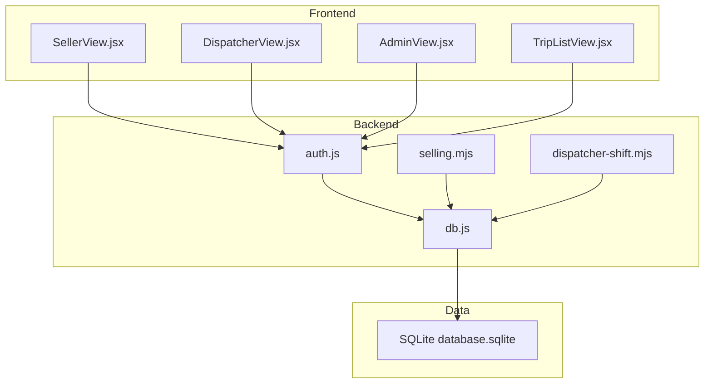
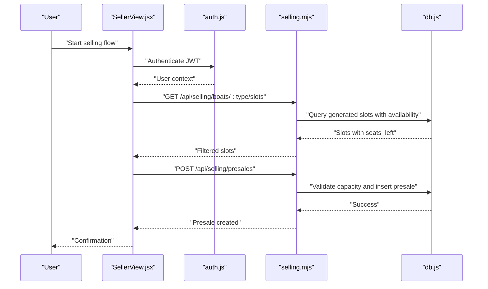
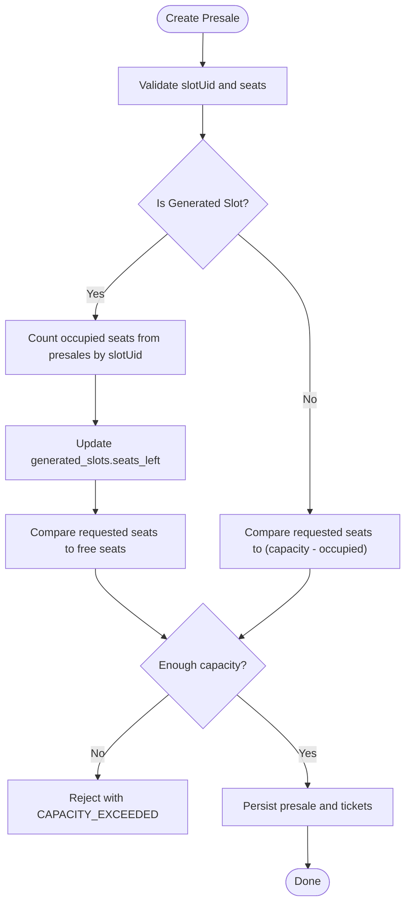
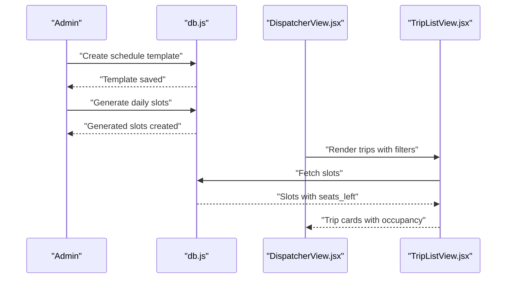
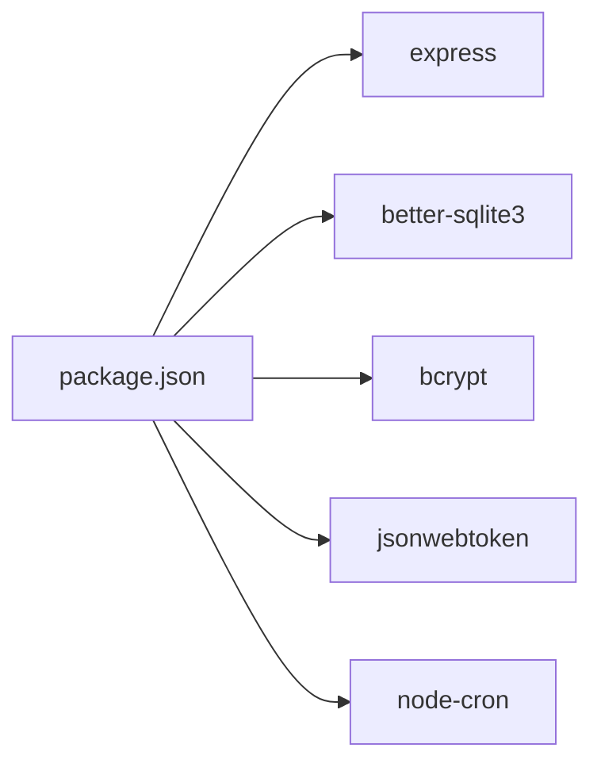

# Operational Guidelines

<cite>
**Referenced Files in This Document**
- [README.md](file://README.md)
- [docs/BUSINESS_RULES.md](file://docs/BUSINESS_RULES.md)
- [docs/API_CONTRACT.md](file://docs/API_CONTRACT.md)
- [docs/TIME_RULES.md](file://docs/TIME_RULES.md)
- [package.json](file://package.json)
- [server/db.js](file://server/db.js)
- [server/auth.js](file://server/auth.js)
- [server/selling.mjs](file://server/selling.mjs)
- [server/dispatcher-shift.mjs](file://server/dispatcher-shift.mjs)
- [src/views/SellerView.jsx](file://src/views/SellerView.jsx)
- [src/views/DispatcherView.jsx](file://src/views/DispatcherView.jsx)
- [src/views/AdminView.jsx](file://src/views/AdminView.jsx)
- [src/components/dispatcher/TripListView.jsx](file://src/components/dispatcher/TripListView.jsx)
- [src/data/mockData.js](file://src/data/mockData.js)
</cite>

## Table of Contents
1. [Introduction](#introduction)
2. [Project Structure](#project-structure)
3. [Core Components](#core-components)
4. [Architecture Overview](#architecture-overview)
5. [Detailed Component Analysis](#detailed-component-analysis)
6. [Dependency Analysis](#dependency-analysis)
7. [Performance Considerations](#performance-considerations)
8. [Troubleshooting Guide](#troubleshooting-guide)
9. [Conclusion](#conclusion)
10. [Appendices](#appendices)

## Introduction
This document provides day-to-day operational guidelines for managing the boat ticketing system. It covers peak season strategies, capacity planning, demand forecasting, trip scheduling, crew coordination, resource allocation, compliance and regulatory considerations, business continuity, system maintenance and disaster recovery, quality assurance and performance monitoring, operational metrics, staff training, role-based procedures, escalation protocols, integrations, reporting, and stakeholder communication.

## Project Structure
The system is a mobile-first React application with a Vite frontend and a Node.js/Express backend. Data persistence uses a SQLite database file managed by better-sqlite3. Authentication is JWT-based and role-scoped. Business logic for selling, scheduling, and slot generation resides in server-side modules.

**Diagram sources**
- [src/views/SellerView.jsx](file://src/views/SellerView.jsx#L1-L370)
- [src/views/DispatcherView.jsx](file://src/views/DispatcherView.jsx#L1-L291)
- [src/views/AdminView.jsx](file://src/views/AdminView.jsx#L1-L382)
- [src/components/dispatcher/TripListView.jsx](file://src/components/dispatcher/TripListView.jsx#L1-L257)
- [server/auth.js](file://server/auth.js#L1-L154)
- [server/db.js](file://server/db.js#L1-L1269)
- [server/selling.mjs](file://server/selling.mjs#L1-L800)
- [server/dispatcher-shift.mjs](file://server/dispatcher-shift.mjs#L1-L62)

**Section sources**
- [README.md](file://README.md#L1-L150)
- [package.json](file://package.json#L1-L41)

## Core Components
- Authentication and authorization: JWT-based with role gates for seller, dispatcher, admin, and owner.
- Selling pipeline: presales with seat validation, capacity checks, and payment metadata.
- Dispatch operations: trip listing, passenger lists, and shift deposit ledger entries.
- Admin dashboard: statistics, user management, and operational controls.
- Database schema: users, boats, slots, presales, tickets, generated slots, schedule templates, and money ledger.

Key operational policies:
- Time source is server time; cutoff logic enforces pre-departure sales windows per role.
- slotUid is the canonical identifier for trips; manual and generated slots must behave consistently.
- Capacity checks respect generated slot caches and seat truth derived from presales.

**Section sources**
- [server/auth.js](file://server/auth.js#L1-L154)
- [docs/TIME_RULES.md](file://docs/TIME_RULES.md#L1-L47)
- [docs/BUSINESS_RULES.md](file://docs/BUSINESS_RULES.md#L1-L49)
- [docs/API_CONTRACT.md](file://docs/API_CONTRACT.md#L1-L34)
- [server/selling.mjs](file://server/selling.mjs#L1-L800)
- [server/db.js](file://server/db.js#L1-L1269)

## Architecture Overview
The system separates concerns across roles and responsibilities:
- Seller: selects boat type, finds available trips, chooses seats, and creates presales.
- Dispatcher: manages trips, passenger lists, and shift financial entries.
- Admin: monitors performance, manages users, and configures operations.
- Backend: enforces business rules, validates inputs, and maintains data integrity.

**Diagram sources**
- [src/views/SellerView.jsx](file://src/views/SellerView.jsx#L186-L210)
- [server/auth.js](file://server/auth.js#L10-L40)
- [server/selling.mjs](file://server/selling.mjs#L462-L638)
- [server/selling.mjs](file://server/selling.mjs#L642-L800)
- [server/db.js](file://server/db.js#L1-L1269)

## Detailed Component Analysis

### Peak Season Management Strategies
- Dynamic cutoff windows: adjust seller and dispatcher cutoffs to control last-minute sales and boarding readiness.
- Capacity scaling: increase boat capacity or add more boats during high-demand periods; monitor seats_left and occupancy.
- Demand forecasting: use historical presale trends and booking velocity to anticipate demand and pre-generate slots.

Operational actions:
- Admin adjusts cutoff settings and schedules additional generated slots.
- Dispatcher monitors real-time occupancy and coordinates crew for high-turnover trips.
- Owner analytics guide decisions on fleet sizing and pricing.

**Section sources**
- [docs/BUSINESS_RULES.md](file://docs/BUSINESS_RULES.md#L11-L28)
- [docs/TIME_RULES.md](file://docs/TIME_RULES.md#L16-L47)
- [server/selling.mjs](file://server/selling.mjs#L62-L94)

### Capacity Planning Procedures
- Real-time capacity checks: enforce seat availability per slotUid and boatSlotId.
- Generated slot cache synchronization: compute occupied seats from presales and update seats_left.
- Manual slot cache maintenance: recalculate seats_left based on ticket statuses.

**Diagram sources**
- [server/selling.mjs](file://server/selling.mjs#L62-L94)
- [server/selling.mjs](file://server/selling.mjs#L154-L171)

**Section sources**
- [server/selling.mjs](file://server/selling.mjs#L62-L94)
- [server/selling.mjs](file://server/selling.mjs#L154-L171)

### Demand Forecasting Methodologies
- Historical presales: analyze past booking patterns by time, type, and date.
- Velocity modeling: measure bookings per time window to predict saturation.
- External factors: integrate weather, events, and seasonality signals into scheduling templates.

Implementation hooks:
- Use schedule templates and generated slots to model recurring patterns.
- Admin dashboard displays aggregated stats to inform forecasts.

**Section sources**
- [server/db.js](file://server/db.js#L559-L593)
- [server/db.js](file://server/db.js#L649-L686)
- [src/views/AdminView.jsx](file://src/views/AdminView.jsx#L44-L77)

### Trip Scheduling and Crew Coordination
- Schedule templates define recurring trips; generated slots instantiate daily trips with capacity and cutoffs.
- Dispatcher view aggregates trips, filters by date/type/status, and surfaces occupancy.
- Crew assignments: align boarding resources with generated slot volumes and peak times.

**Diagram sources**
- [server/db.js](file://server/db.js#L559-L593)
- [server/db.js](file://server/db.js#L649-L686)
- [src/views/DispatcherView.jsx](file://src/views/DispatcherView.jsx#L23-L291)
- [src/components/dispatcher/TripListView.jsx](file://src/components/dispatcher/TripListView.jsx#L85-L157)

**Section sources**
- [server/db.js](file://server/db.js#L559-L593)
- [server/db.js](file://server/db.js#L649-L686)
- [src/views/DispatcherView.jsx](file://src/views/DispatcherView.jsx#L23-L291)
- [src/components/dispatcher/TripListView.jsx](file://src/components/dispatcher/TripListView.jsx#L1-L257)

### Resource Allocation
- Fleet sizing: balance boat types (speed, cruise, banana) to meet demand profiles.
- Staffing: assign dispatchers and sellers based on trip frequency and expected passenger volume.
- Inventory: ensure adequate supplies for boarding and customer service.

**Section sources**
- [server/db.js](file://server/db.js#L55-L85)
- [docs/BUSINESS_RULES.md](file://docs/BUSINESS_RULES.md#L23-L28)

### Compliance and Regulatory Considerations
- Time enforcement: server-side time only; no client-side time assumptions.
- Cutoff adherence: enforce seller and dispatcher cutoffs strictly; role-based permissions apply.
- Data integrity: consistent seat accounting across manual and generated slots; structured error reporting.

**Section sources**
- [docs/TIME_RULES.md](file://docs/TIME_RULES.md#L9-L14)
- [docs/TIME_RULES.md](file://docs/TIME_RULES.md#L16-L47)
- [docs/BUSINESS_RULES.md](file://docs/BUSINESS_RULES.md#L32-L49)

### Business Continuity Procedures
- Database durability: WAL mode and busy timeouts configured for reliability.
- Shift ledger: dispatcher shift deposits recorded to money ledger for auditability.
- Recovery: restart services; verify database connectivity and schema migrations.

**Section sources**
- [server/db.js](file://server/db.js#L11-L26)
- [server/dispatcher-shift.mjs](file://server/dispatcher-shift.mjs#L7-L58)

### System Maintenance, Backup, and Disaster Recovery
- Maintenance:
  - Apply schema and data migrations safely; verify settings flags to avoid re-running.
  - Monitor seat_left and capacity normalization.
- Backup:
  - Copy database.sqlite to a secure location regularly.
  - Keep WAL and SHM/WAL files consistent during backups.
- Disaster recovery:
  - Restore from latest backup.
  - Reinitialize database and confirm migrations.
  - Validate JWT secret and user accounts.

**Section sources**
- [server/db.js](file://server/db.js#L166-L311)
- [server/db.js](file://server/db.js#L334-L383)
- [server/db.js](file://server/db.js#L559-L593)
- [server/db.js](file://server/db.js#L649-L686)

### Quality Assurance and Performance Monitoring
- QA:
  - Validate seat validation rules for different boat types and durations.
  - Test cutoff logic under various server times and role permissions.
  - Verify capacity sync for generated slots.
- Metrics:
  - Occupancy rates, free seats, and booking velocity.
  - Revenue and ticket counts by type and day.
  - Error rates and structured error messages.

**Section sources**
- [server/selling.mjs](file://server/selling.mjs#L174-L262)
- [src/views/AdminView.jsx](file://src/views/AdminView.jsx#L44-L77)

### Staff Training, Role-Based Procedures, and Escalation Protocols
- Training:
  - Seller: presale creation, cutoff awareness, and customer handling.
  - Dispatcher: trip management, passenger list handling, and shift close.
  - Admin: user management, dashboard interpretation, and operational controls.
- Role-based procedures:
  - Sellers cannot override cutoffs; dispatchers may operate beyond seller cutoffs.
  - SlotUid is mandatory for all presales.
- Escalation:
  - Capacity issues escalate to Admin/Owner.
  - Authentication failures escalate to IT.

**Section sources**
- [docs/BUSINESS_RULES.md](file://docs/BUSINESS_RULES.md#L3-L18)
- [docs/API_CONTRACT.md](file://docs/API_CONTRACT.md#L3-L16)
- [server/auth.js](file://server/auth.js#L47-L71)

### Integration with External Systems, Reporting, and Stakeholder Communication
- Integrations:
  - No external integrations in the current codebase; maintain API contract stability for future integrations.
- Reporting:
  - Admin dashboard reports revenue, tickets sold, and seller performance.
- Communication:
  - Dispatcher refresh events trigger UI updates.
  - Owner data refresh after presale creation.

**Section sources**
- [src/views/AdminView.jsx](file://src/views/AdminView.jsx#L44-L77)
- [src/views/DispatcherView.jsx](file://src/views/DispatcherView.jsx#L88-L93)
- [src/views/SellerView.jsx](file://src/views/SellerView.jsx#L158-L162)

## Dependency Analysis
Runtime dependencies include Express, better-sqlite3, bcrypt, jsonwebtoken, and node-cron. These enable HTTP routing, database operations, authentication, encryption, and scheduling.

**Diagram sources**
- [package.json](file://package.json#L15-L24)

**Section sources**
- [package.json](file://package.json#L1-L41)

## Performance Considerations
- Database tuning: WAL mode improves concurrency; busy_timeout reduces contention.
- Indexes: ensure presence of indexes on frequently queried columns (e.g., presales slot_uid).
- Frontend responsiveness: debounce filters and limit rendered trip cards; lazy-load heavy components.
- Caching: rely on server-side seat_left computation and cache updates for generated slots.

**Section sources**
- [server/db.js](file://server/db.js#L11-L26)
- [server/db.js](file://server/db.js#L347-L350)
- [server/selling.mjs](file://server/selling.mjs#L76-L82)

## Troubleshooting Guide
Common issues and resolutions:
- Authentication failures: verify JWT secret and user status; ensure bcrypt availability.
- Capacity exceeded: review generated_slots seats_left and presales; reconcile discrepancies.
- Cutoff violations: confirm server time and role permissions; check cutoff settings.
- Database initialization errors: validate database file path and permissions.

**Section sources**
- [server/auth.js](file://server/auth.js#L10-L40)
- [server/selling.mjs](file://server/selling.mjs#L52-L60)
- [docs/TIME_RULES.md](file://docs/TIME_RULES.md#L9-L14)
- [server/db.js](file://server/db.js#L17-L26)

## Conclusion
This operational guide consolidates best practices for running the boat ticketing system. By enforcing strict time and cutoff policies, maintaining accurate capacity, leveraging scheduling templates, and following robust maintenance and recovery procedures, operators can ensure reliable, compliant, and efficient daily operations.

## Appendices
- Example mock data for testing and demonstrations.

**Section sources**
- [src/data/mockData.js](file://src/data/mockData.js#L1-L40)