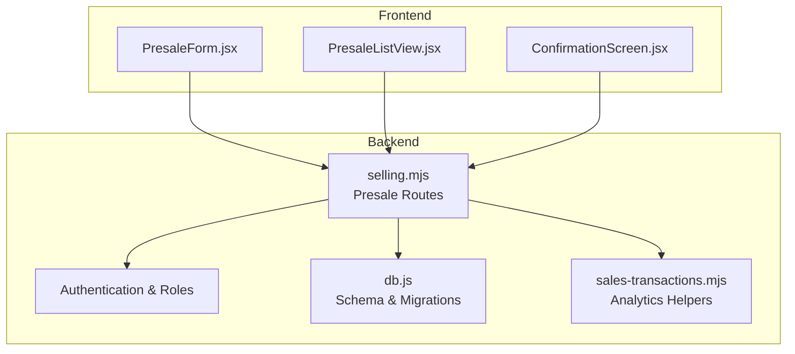
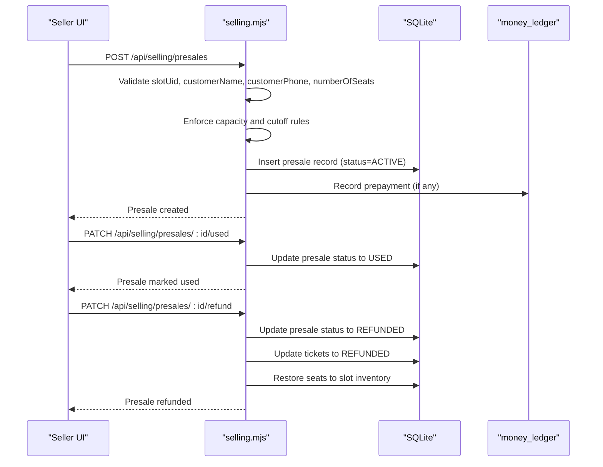
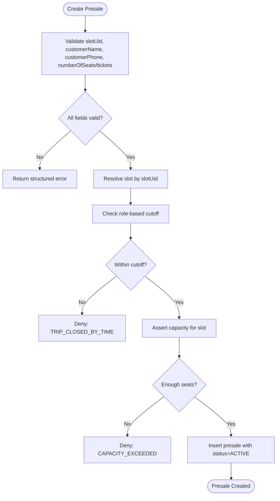
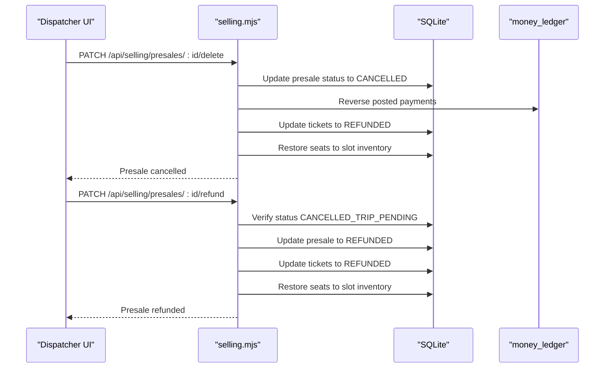
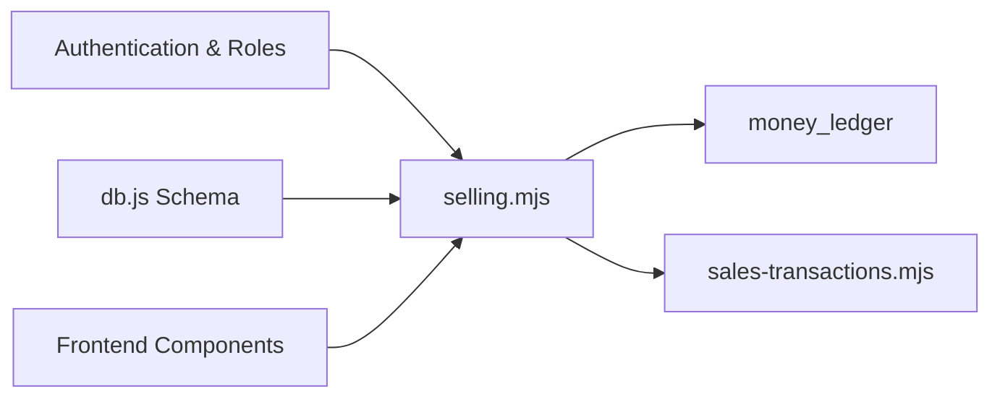

# Presale Management Policies

<cite>
**Referenced Files in This Document**
- [selling.mjs](file://server/selling.mjs)
- [.mjs](file://server/.mjs)
- [PresaleForm.jsx](file://src/components/seller/PresaleForm.jsx)
- [PresaleListView.jsx](file://src/components/dispatcher/PresaleListView.jsx)
- [ConfirmationScreen.jsx](file://src/components/seller/ConfirmationScreen.jsx)
- [db.js](file://server/db.js)
- [sales-transactions.mjs](file://server/sales-transactions.mjs)
- [BUSINESS_RULES.md](file://docs/BUSINESS_RULES.md)
- [TIME_RULES.md](file://docs/TIME_RULES.md)
</cite>

## Table of Contents
1. [Introduction](#introduction)
2. [Project Structure](#project-structure)
3. [Core Components](#core-components)
4. [Architecture Overview](#architecture-overview)
5. [Detailed Component Analysis](#detailed-component-analysis)
6. [Dependency Analysis](#dependency-analysis)
7. [Performance Considerations](#performance-considerations)
8. [Troubleshooting Guide](#troubleshooting-guide)
9. [Conclusion](#conclusion)
10. [Appendices](#appendices)

## Introduction
This document defines presale management policies and procedures for the boat ticketing application. It covers advance booking limits, presale duration restrictions, booking window management, cancellation and refund procedures, fee structures, validation rules, customer verification, booking confirmation workflows, tracking/reporting, audit trails, exceptions, and integration with seat availability and time-based restrictions.

## Project Structure
The presale lifecycle spans frontend components and backend routes:
- Frontend: seller and dispatcher UIs collect customer and booking data.
- Backend: selling routes validate inputs, enforce time-based cutoffs, manage presale state, and maintain audit-consistent accounting.
- Database: schema supports presales, tickets, slots, and generated slots with capacity and cutoff controls.

**Diagram sources**
- [selling.mjs](file://server/selling.mjs#L642-L3195)
- [PresaleForm.jsx](file://src/components/seller/PresaleForm.jsx#L1-L219)
- [PresaleListView.jsx](file://src/components/dispatcher/PresaleListView.jsx#L1-L341)
- [ConfirmationScreen.jsx](file://src/components/seller/ConfirmationScreen.jsx#L76-L107)
- [db.js](file://server/db.js#L95-L109)
- [sales-transactions.mjs](file://server/sales-transactions.mjs#L104-L145)

**Section sources**
- [selling.mjs](file://server/selling.mjs#L642-L3195)
- [db.js](file://server/db.js#L95-L109)

## Core Components
- Presale creation endpoint validates customer data, seat count, and payment method; enforces slot availability and time cutoffs; persists presale with status and optional ticket breakdown.
- Presale modification supports partial payments and seat adjustments via ticket-level operations.
- Presale cancellation and refund paths ensure audit-consistent reversals in money ledger and seat inventory restoration.
- Seat availability and capacity enforcement integrate with both manual and generated slots.
- Time-based cutoff logic enforces role-specific booking windows using server-side time.

**Section sources**
- [selling.mjs](file://server/selling.mjs#L642-L3195)
- [db.js](file://server/db.js#L95-L109)
- [BUSINESS_RULES.md](file://docs/BUSINESS_RULES.md#L1-L49)
- [TIME_RULES.md](file://docs/TIME_RULES.md#L1-L47)

## Architecture Overview
The presale workflow integrates UI, backend validation, database persistence, and financial audit.

**Diagram sources**
- [selling.mjs](file://server/selling.mjs#L642-L3195)

## Detailed Component Analysis

### Presale Creation and Validation
- Required fields: slotUid, customerName, customerPhone, numberOfSeats or tickets breakdown.
- Data type and length validations for customer name and phone.
- Ticket breakdown validation supports adult/teen/child counts with non-negative integer constraints.
- Seat count validation enforces minimum 1 seat and respects per-service limits (e.g., banana capacity).
- Prepayment validation and payment method normalization (CASH/CARD/MIXED).
- Capacity checks:
  - For generated slots, seats_left is computed from presales and synchronized with generated_slots cache.
  - For manual slots, boat_slots capacity is enforced.
- Time-based cutoff enforcement:
  - Role-specific cutoffs (seller/dispatcher) apply to generated and manual slots.
  - Cutoff calculated as trip_datetime minus cutoff_minutes; if current server time meets or exceeds cutoff, booking is denied.

**Diagram sources**
- [selling.mjs](file://server/selling.mjs#L642-L800)
- [selling.mjs](file://server/selling.mjs#L913-L944)
- [selling.mjs](file://server/selling.mjs#L625-L746)

**Section sources**
- [selling.mjs](file://server/selling.mjs#L642-L800)
- [selling.mjs](file://server/selling.mjs#L913-L944)
- [selling.mjs](file://server/selling.mjs#L625-L746)
- [BUSINESS_RULES.md](file://docs/BUSINESS_RULES.md#L1-L49)
- [TIME_RULES.md](file://docs/TIME_RULES.md#L1-L47)

### Booking Window Management
- Cutoff logic uses server-side time exclusively.
- seller_cutoff_minutes and dispatcher_cutoff_minutes define permitted booking windows.
- For generated slots, cutoffs are stored per slot; for manual slots, cutoffs are derived from boat_slots.
- Cutoff enforcement prevents sales when current time reaches or exceeds cutoff thresholds.

**Section sources**
- [TIME_RULES.md](file://docs/TIME_RULES.md#L1-L47)
- [BUSINESS_RULES.md](file://docs/BUSINESS_RULES.md#L1-L49)
- [selling.mjs](file://server/selling.mjs#L625-L746)
- [selling.mjs](file://server/selling.mjs#L913-L944)

### Seat Availability and Capacity Enforcement
- Seat occupancy counted from presales for generated slots and from tickets for manual slots.
- For generated slots, seats_left is recomputed and cached in generated_slots to ensure consistency.
- Capacity checks compare requested seats against computed free seats.

**Section sources**
- [selling.mjs](file://server/selling.mjs#L30-L102)
- [selling.mjs](file://server/selling.mjs#L66-L94)

### Presale Modification and Partial Payments
- Dispatcher UI supports adding remaining payments to a presale; validation ensures payment amount does not exceed remaining balance.
- Backend maintains presale totals and ticket breakdowns; updates reflect in analytics.

**Section sources**
- [PresaleListView.jsx](file://src/components/dispatcher/PresaleListView.jsx#L88-L128)
- [selling.mjs](file://server/selling.mjs#L3462-L3530)

### Boarding and Attendance
- Presale status eligibility for boarding includes ACTIVE, CONFIRMED, PAID, PARTIALLY_PAID.
- Boarding marks presale status to USED; previously used or canceled/refunded presales cannot be marked used.

**Section sources**
- [selling.mjs](file://server/selling.mjs#L3133-L3195)

### Cancellation and Refund Procedures
- Cancel presale:
  - Marks presale as CANCELLED and reverses posted money movements in money_ledger.
  - Updates tickets to REFUNDED and restores seats to inventory.
- Refund presale:
  - Requires presale status CANCELLED_TRIP_PENDING; transitions to REFUNDED and updates tickets.
- Ticket-level refund/delete:
  - Marks ticket as REFUNDED, removes from canonical sales transactions, frees seat, recalculates presale totals and ticket breakdown.

**Diagram sources**
- [selling.mjs](file://server/selling.mjs#L3319-L3460)
- [selling.mjs](file://server/selling.mjs#L3202-L3317)

**Section sources**
- [selling.mjs](file://server/selling.mjs#L3319-L3460)
- [selling.mjs](file://server/selling.mjs#L3202-L3317)

### Fee Structures and Payment Methods
- Prepayment recorded with explicit payment_method (CASH/CARD/MIXED) and split amounts.
- If prepayment is zero or omitted, defaults preserve backward compatibility while ensuring analytics consistency.
- Money ledger reversals on cancellation ensure cash/card balances reconcile correctly.

**Section sources**
- [selling.mjs](file://server/selling.mjs#L756-L806)
- [selling.mjs](file://server/selling.mjs#L2709-L2729)
- [selling.mjs](file://server/selling.mjs#L3335-L3373)

### Customer Verification and Booking Confirmation
- Frontend forms validate customer name and phone length and enforce prepayment bounds.
- Confirmation screen triggers cancellation via API client or falls back to direct fetch.
- Backend routes return structured errors for missing or invalid fields.

**Section sources**
- [PresaleForm.jsx](file://src/components/seller/PresaleForm.jsx#L39-L82)
- [ConfirmationScreen.jsx](file://src/components/seller/ConfirmationScreen.jsx#L76-L107)
- [selling.mjs](file://server/selling.mjs#L642-L781)

### Presale Tracking, Reporting, and Audit Trails
- Presales tracked with status, payment splits, and ticket breakdowns.
- Analytics helpers derive cash/card totals from presale records and payment columns.
- Money ledger entries provide audit trail for cancellations and refunds.
- Seat inventory restored consistently to maintain accurate reporting.

**Section sources**
- [sales-transactions.mjs](file://server/sales-transactions.mjs#L104-L145)
- [selling.mjs](file://server/selling.mjs#L2709-L2729)
- [selling.mjs](file://server/selling.mjs#L3335-L3373)

### Examples: Creation, Modification, Cancellation
- Creation: Seller selects a generated slot, enters customer details and prepayment, submits form; backend validates and creates ACTIVE presale.
- Modification: Dispatcher adds remaining payment to a partially paid presale; backend updates totals and remaining amount.
- Cancellation: Dispatcher cancels presale; backend reverses money movements and restores seats.
- Refund: After trip cancellation, dispatcher refunds presale; backend sets status to REFUNDED and updates tickets.

**Section sources**
- [PresaleForm.jsx](file://src/components/seller/PresaleForm.jsx#L62-L82)
- [PresaleListView.jsx](file://src/components/dispatcher/PresaleListView.jsx#L88-L128)
- [selling.mjs](file://server/selling.mjs#L3319-L3460)
- [selling.mjs](file://server/selling.mjs#L3202-L3317)

## Dependency Analysis
Presale management depends on:
- Authentication and role checks for seller/dispatcher/admin.
- Database schema for presales, tickets, slots, and generated slots.
- Money ledger for audit-consistent financial reversals.
- Analytics helpers for deriving payment amounts.

**Diagram sources**
- [selling.mjs](file://server/selling.mjs#L151-L152)
- [db.js](file://server/db.js#L95-L109)
- [sales-transactions.mjs](file://server/sales-transactions.mjs#L104-L145)

**Section sources**
- [selling.mjs](file://server/selling.mjs#L151-L152)
- [db.js](file://server/db.js#L95-L109)
- [sales-transactions.mjs](file://server/sales-transactions.mjs#L104-L145)

## Performance Considerations
- Seat availability recomputation uses targeted queries to minimize overhead.
- Generated slot cache synchronization ensures UI and checks remain consistent.
- Transactional updates for cancellations/refunds reduce risk of inconsistent state.

## Troubleshooting Guide
Common issues and resolutions:
- TRIP_CLOSED_BY_TIME: Occurs when current server time meets or exceeds cutoff threshold; verify role-specific cutoffs and slot timing.
- CAPACITY_EXCEEDED: Not enough seats available; confirm generated/manual slot capacity and occupancy.
- INVALID_PREPAYMENT_AMOUNT: Prepayment exceeds total price or negative; adjust payment amount.
- Cannot mark as used: Presale not in eligible status or already processed; verify status and eligibility rules.
- Cannot delete/refund: Presale in incompatible status; ensure correct status before attempting operations.

**Section sources**
- [selling.mjs](file://server/selling.mjs#L913-L944)
- [selling.mjs](file://server/selling.mjs#L625-L746)
- [selling.mjs](file://server/selling.mjs#L3133-L3195)
- [selling.mjs](file://server/selling.mjs#L3319-L3460)
- [selling.mjs](file://server/selling.mjs#L3202-L3317)

## Conclusion
Presale management enforces strict validation, time-based cutoffs, and capacity controls while maintaining audit-consistent financial records. The system supports flexible booking, partial payments, and robust cancellation/refund workflows across generated and manual slots.

## Appendices

### Presale Status Lifecycle
- ACTIVE → CONFIRMED → PAID/PARTIALLY_PAID → USED (boarding)
- ACTIVE → CANCELLED (via deletion/cancellation)
- CANCELLED_TRIP_PENDING → REFUNDED (after trip cancellation)

**Section sources**
- [selling.mjs](file://server/selling.mjs#L3133-L3195)
- [selling.mjs](file://server/selling.mjs#L3202-L3317)
- [selling.mjs](file://server/selling.mjs#L3319-L3460)