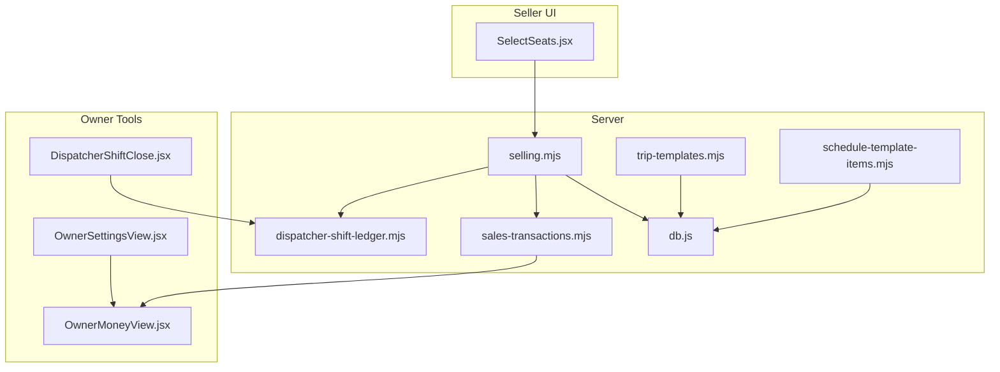
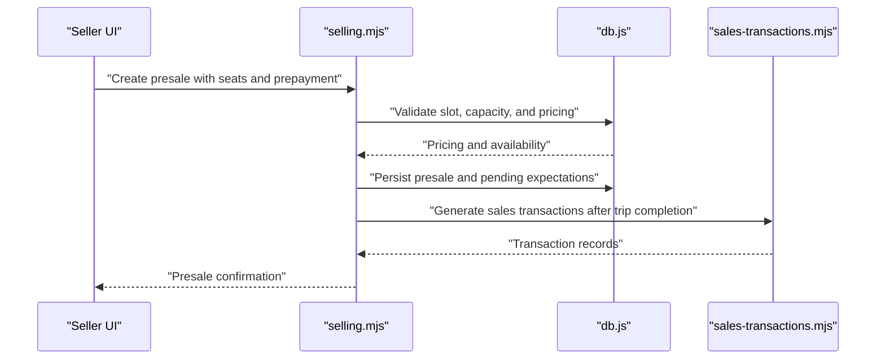
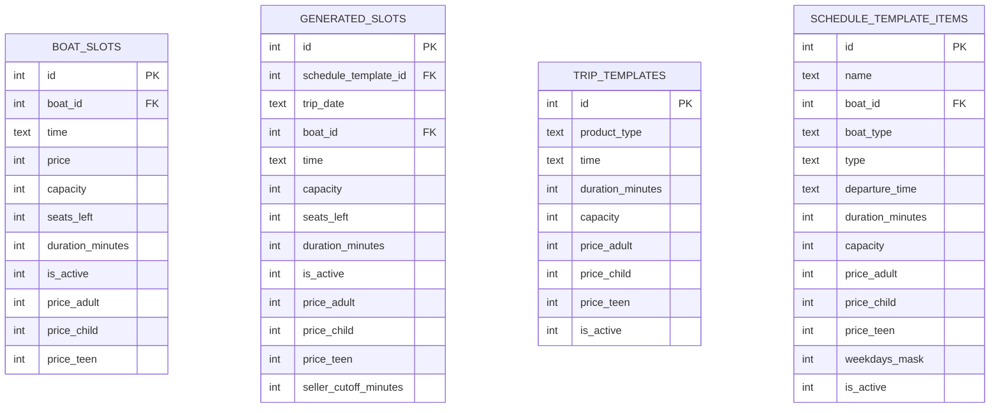
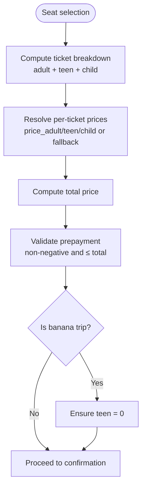
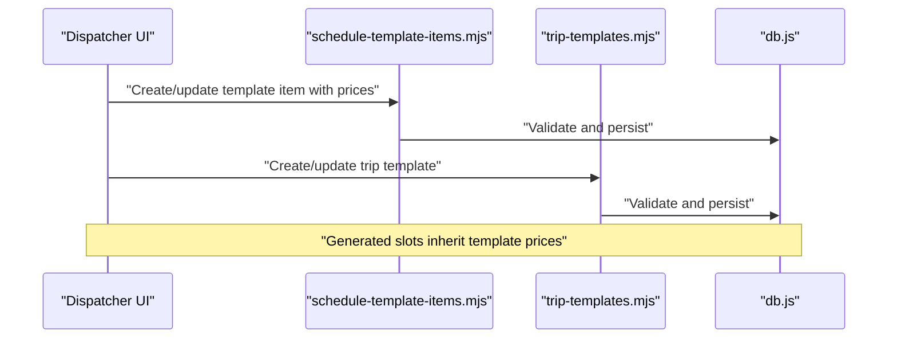
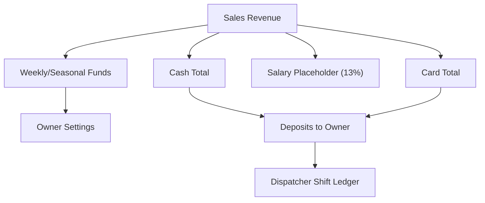
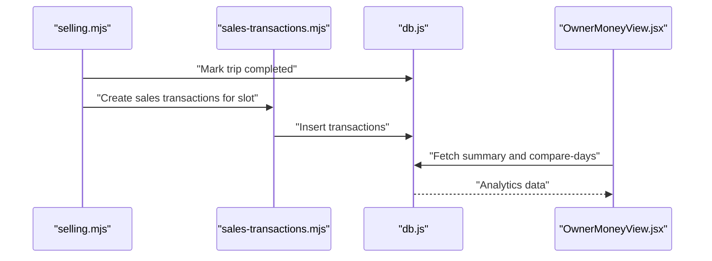
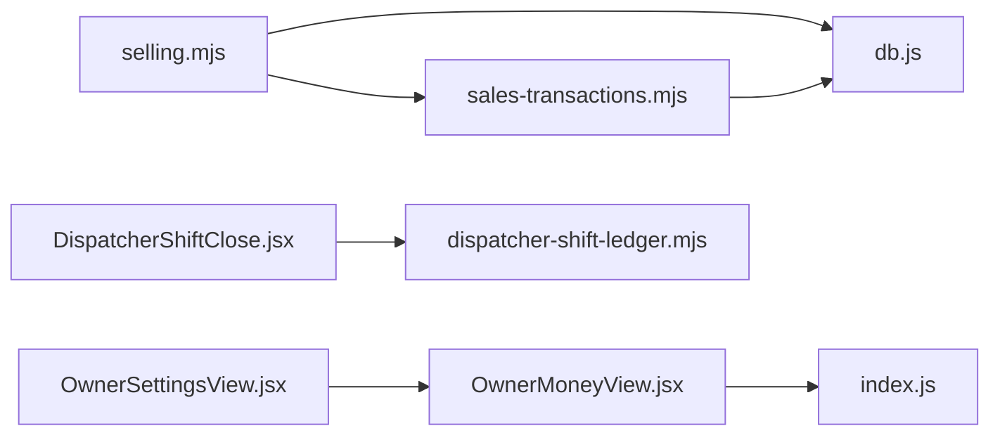

# Pricing Strategies

<cite>
**Referenced Files in This Document**
- [sales-transactions.mjs](file://server/sales-transactions.mjs)
- [migrate-price-column.js](file://server/migrate-price-column.js)
- [currency.js](file://src/utils/currency.js)
- [OwnerMoneyView.jsx](file://src/views/OwnerMoneyView.jsx)
- [index.js](file://server/index.js)
- [selling.mjs](file://server/selling.mjs)
- [db.js](file://server/db.js)
- [SelectSeats.jsx](file://src/components/seller/SelectSeats.jsx)
- [OwnerSettingsView.jsx](file://src/views/OwnerSettingsView.jsx)
- [DispatcherShiftClose.jsx](file://src/views/DispatcherShiftClose.jsx)
- [dispatcher-shift-ledger.mjs](file://server/dispatcher-shift-ledger.mjs)
- [ConfirmCancelTripModal.jsx](file://src/components/dispatcher/ConfirmCancelTripModal.jsx)
- [trip-templates.mjs](file://server/trip-templates.mjs)
- [schedule-template-items.mjs](file://server/schedule-template-items.mjs)
- [migrate-db-constraints.js](file://migrate-db-constraints.js)
</cite>

## Table of Contents
1. [Introduction](#introduction)
2. [Project Structure](#project-structure)
3. [Core Components](#core-components)
4. [Architecture Overview](#architecture-overview)
5. [Detailed Component Analysis](#detailed-component-analysis)
6. [Dependency Analysis](#dependency-analysis)
7. [Performance Considerations](#performance-considerations)
8. [Troubleshooting Guide](#troubleshooting-guide)
9. [Conclusion](#conclusion)
10. [Appendices](#appendices)

## Introduction
This document explains the pricing models and revenue management strategies implemented in the boat ticketing system. It covers base fare structures, surcharge and discount mechanisms, promotional pricing, price validation, currency handling, international considerations, revenue sharing, commission structures, payouts, dynamic pricing, peak surcharges, promotional campaigns, price modification policies, refunds, financial transaction processing, pricing transparency, taxes, and multi-currency support.

## Project Structure
The pricing and revenue pipeline spans client-side UI components, server-side selling logic, database schema migrations, and owner analytics. Key areas include:
- Pricing schema and validation in the database
- Price calculation and selection in the seller UI
- Sales transaction generation and owner analytics
- Dispatcher-ledger revenue and commission computation
- Owner settings for motivation and funds allocation

**Diagram sources**
- [SelectSeats.jsx](file://src/components/seller/SelectSeats.jsx#L218-L222)
- [selling.mjs](file://server/selling.mjs#L1-L200)
- [db.js](file://server/db.js#L68-L85)
- [sales-transactions.mjs](file://server/sales-transactions.mjs#L34-L63)
- [dispatcher-shift-ledger.mjs](file://server/dispatcher-shift-ledger.mjs#L263-L303)
- [trip-templates.mjs](file://server/trip-templates.mjs#L49-L85)
- [schedule-template-items.mjs](file://server/schedule-template-items.mjs#L175-L396)
- [OwnerMoneyView.jsx](file://src/views/OwnerMoneyView.jsx#L16-L27)
- [OwnerSettingsView.jsx](file://src/views/OwnerSettingsView.jsx#L288-L293)
- [DispatcherShiftClose.jsx](file://src/views/DispatcherShiftClose.jsx#L7-L11)

**Section sources**
- [index.js](file://server/index.js#L25-L40)
- [db.js](file://server/db.js#L68-L85)

## Core Components
- Base fare structures:
  - Per-slot pricing columns for adult, teen, child, and fallback price on boat_slots and generated_slots
  - Trip templates and schedule template items define canonical pricing per product type and weekday mask
- Surcharge and discount mechanisms:
  - Dynamic pricing via generated_slots and schedule templates
  - Prepayment handling influences outstanding amounts and pending revenue
- Promotional pricing:
  - Template-based pricing allows setting promotional rates per template item
- Price validation:
  - Triggers and route validations ensure positive, non-negative prices and correct formats
- Currency handling:
  - RUB formatting utilities and owner analytics display
- Revenue management:
  - Sales transactions generation, dispatcher shift ledger, owner money view, and settings for motivation/funds

**Section sources**
- [db.js](file://server/db.js#L68-L85)
- [db.js](file://server/db.js#L497-L557)
- [trip-templates.mjs](file://server/trip-templates.mjs#L49-L85)
- [schedule-template-items.mjs](file://server/schedule-template-items.mjs#L175-L396)
- [migrate-db-constraints.js](file://migrate-db-constraints.js#L63-L93)
- [SelectSeats.jsx](file://src/components/seller/SelectSeats.jsx#L218-L222)
- [currency.js](file://src/utils/currency.js#L6-L15)
- [OwnerMoneyView.jsx](file://src/views/OwnerMoneyView.jsx#L16-L27)
- [sales-transactions.mjs](file://server/sales-transactions.mjs#L34-L63)
- [dispatcher-shift-ledger.mjs](file://server/dispatcher-shift-ledger.mjs#L283-L284)
- [OwnerSettingsView.jsx](file://src/views/OwnerSettingsView.jsx#L288-L293)

## Architecture Overview
The pricing lifecycle integrates UI seat selection, server-side price computation, booking persistence, sales transaction generation, and owner analytics.

**Diagram sources**
- [SelectSeats.jsx](file://src/components/seller/SelectSeats.jsx#L218-L222)
- [selling.mjs](file://server/selling.mjs#L1-L200)
- [db.js](file://server/db.js#L68-L85)
- [sales-transactions.mjs](file://server/sales-transactions.mjs#L167-L236)

## Detailed Component Analysis

### Base Fare Structures and Schema
- Pricing columns:
  - boat_slots: price, price_adult, price_child, price_teen
  - generated_slots: price_adult, price_child, price_teen, capacity, seats_left
  - trip_templates and schedule_template_items: price_adult, price_child, price_teen, duration_minutes, capacity
- Migration supports nullable price fields for flexible pricing per slot/template
- Validation enforces positive and non-negative prices and correct formats

**Diagram sources**
- [db.js](file://server/db.js#L68-L85)
- [db.js](file://server/db.js#L560-L593)
- [db.js](file://server/db.js#L650-L686)
- [db.js](file://server/db.js#L688-L726)
- [migrate-price-column.js](file://server/migrate-price-column.js#L14-L30)

**Section sources**
- [db.js](file://server/db.js#L68-L85)
- [db.js](file://server/db.js#L497-L557)
- [db.js](file://server/db.js#L559-L593)
- [db.js](file://server/db.js#L616-L647)
- [db.js](file://server/db.js#L688-L726)
- [migrate-price-column.js](file://server/migrate-price-column.js#L14-L30)
- [migrate-db-constraints.js](file://migrate-db-constraints.js#L63-L93)

### Price Calculation and Selection (Seller UI)
- Ticket breakdown: adult, teen, child counts drive total price
- Price resolution:
  - For each category, use slot-specific price_adult/price_teen/price_child if present, otherwise fallback to slot.price
- Prepayment validation prevents overpayments and enforces non-negative values
- Banana trips restrict teen tickets to zero

**Diagram sources**
- [SelectSeats.jsx](file://src/components/seller/SelectSeats.jsx#L218-L222)
- [SelectSeats.jsx](file://src/components/seller/SelectSeats.jsx#L231-L245)

**Section sources**
- [SelectSeats.jsx](file://src/components/seller/SelectSeats.jsx#L218-L222)
- [SelectSeats.jsx](file://src/components/seller/SelectSeats.jsx#L231-L245)

### Surcharge Calculations and Dynamic Pricing
- Dynamic pricing:
  - generated_slots and schedule_template_items store per-slot and per-template prices
  - Templates enable weekday-based pricing and capacity/duration defaults
- Peak season surcharges:
  - Implemented via template items with higher price_adult/price_child/price_teen
  - Dispatcher UI supports cancellation with refund-to-client or fund allocation
- Promotion campaigns:
  - Template-based promotional rates via schedule_template_items and trip_templates

**Diagram sources**
- [schedule-template-items.mjs](file://server/schedule-template-items.mjs#L175-L396)
- [trip-templates.mjs](file://server/trip-templates.mjs#L49-L85)
- [db.js](file://server/db.js#L559-L593)
- [db.js](file://server/db.js#L650-L686)

**Section sources**
- [schedule-template-items.mjs](file://server/schedule-template-items.mjs#L175-L396)
- [trip-templates.mjs](file://server/trip-templates.mjs#L49-L85)
- [ConfirmCancelTripModal.jsx](file://src/components/dispatcher/ConfirmCancelTripModal.jsx#L36-L65)

### Discount Applications and Prepayment Handling
- Prepayment reduces expected payment at trip day:
  - recalculation logic computes expected amount = total - prepayment
  - pending ledger entries reflect expected payment by trip day
- Discounts:
  - Applied via template pricing (lower price_adult/price_child/price_teen)
  - UI validates prepayment against total price

**Section sources**
- [selling.mjs](file://server/selling.mjs#L106-L150)
- [SelectSeats.jsx](file://src/components/seller/SelectSeats.jsx#L224-L228)

### Price Validation Rules
- Backend validation:
  - Route-level checks ensure numeric, positive prices and correct formats
  - Triggers enforce constraints on generated_slots and related fields
- Frontend validation:
  - UI prevents negative prepayment and overpayments

**Section sources**
- [schedule-template-items.mjs](file://server/schedule-template-items.mjs#L175-L191)
- [migrate-db-constraints.js](file://migrate-db-constraints.js#L63-L93)
- [SelectSeats.jsx](file://src/components/seller/SelectSeats.jsx#L248-L256)

### Currency Handling and Multi-Currency Support
- Currency formatting:
  - RUB formatting utility for display
  - Owner money view uses RUB formatting for revenue and pending
- Multi-currency:
  - Current implementation is RUB-centric
  - To add multi-currency, extend schema with currency codes, exchange rates, and per-transaction currency fields; adjust UI and analytics accordingly

**Section sources**
- [currency.js](file://src/utils/currency.js#L6-L15)
- [OwnerMoneyView.jsx](file://src/views/OwnerMoneyView.jsx#L16-L27)

### Revenue Sharing, Commission, and Payouts
- Dispatcher shift ledger:
  - Computes total revenue, cash/card totals, and salary placeholder (13%)
  - Aggregates seller balances and deposits
- Owner settings:
  - Weekly and seasonal fund allocations
  - Motivation percentage and team participation toggles
- Payouts:
  - UI notes temporary 13% salary; can be replaced by motivation engine

**Diagram sources**
- [dispatcher-shift-ledger.mjs](file://server/dispatcher-shift-ledger.mjs#L283-L284)
- [OwnerSettingsView.jsx](file://src/views/OwnerSettingsView.jsx#L288-L293)
- [DispatcherShiftClose.jsx](file://src/views/DispatcherShiftClose.jsx#L7-L11)

**Section sources**
- [dispatcher-shift-ledger.mjs](file://server/dispatcher-shift-ledger.mjs#L263-L303)
- [OwnerSettingsView.jsx](file://src/views/OwnerSettingsView.jsx#L269-L293)
- [DispatcherShiftClose.jsx](file://src/views/DispatcherShiftClose.jsx#L7-L11)

### Financial Transaction Processing and Owner Analytics
- Sales transactions:
  - Generated after trip completion for generated slots
  - Records amount, method, status, and source per presale
- Owner money view:
  - Summarizes revenue, cash, card, pending, and trends
  - Supports presets and auto-refresh

**Diagram sources**
- [selling.mjs](file://server/selling.mjs#L167-L175)
- [sales-transactions.mjs](file://server/sales-transactions.mjs#L167-L236)
- [OwnerMoneyView.jsx](file://src/views/OwnerMoneyView.jsx#L99-L132)

**Section sources**
- [sales-transactions.mjs](file://server/sales-transactions.mjs#L34-L63)
- [sales-transactions.mjs](file://server/sales-transactions.mjs#L167-L236)
- [OwnerMoneyView.jsx](file://src/views/OwnerMoneyView.jsx#L99-L132)

### Refund Calculations and Price Modification Policies
- Refunds:
  - Presale refund path updates status and remaining amounts
  - Dispatcher modal supports refund-to-client or fund allocation
- Price modifications:
  - Template updates propagate to generated slots
  - Constraints ensure valid prices and formats

**Section sources**
- [selling.mjs](file://server/selling.mjs#L3285-L3317)
- [ConfirmCancelTripModal.jsx](file://src/components/dispatcher/ConfirmCancelTripModal.jsx#L36-L65)
- [schedule-template-items.mjs](file://server/schedule-template-items.mjs#L367-L392)

## Dependency Analysis
Key dependencies and coupling:
- selling.mjs depends on db.js for schema and queries
- sales-transactions.mjs depends on presales and generated_slots
- OwnerMoneyView.jsx consumes owner API endpoints mounted in index.js
- DispatcherShiftClose.jsx integrates with dispatcher-shift-ledger.mjs

**Diagram sources**
- [index.js](file://server/index.js#L25-L40)
- [selling.mjs](file://server/selling.mjs#L1-L200)
- [sales-transactions.mjs](file://server/sales-transactions.mjs#L34-L63)
- [OwnerMoneyView.jsx](file://src/views/OwnerMoneyView.jsx#L99-L132)
- [dispatcher-shift-ledger.mjs](file://server/dispatcher-shift-ledger.mjs#L263-L303)

**Section sources**
- [index.js](file://server/index.js#L25-L40)

## Performance Considerations
- Prefer template-driven pricing to minimize per-slot overrides
- Use batched generation of sales transactions for completed slots
- Indexes on business_day and slot_uid improve analytics queries
- Keep prepayment and total_price aligned to reduce pending recalculations

## Troubleshooting Guide
- Price validation failures:
  - Ensure price_adult/price_child/price_teen are positive and formatted correctly
  - Verify template items and generated slots constraints
- Prepayment errors:
  - Confirm prepayment ≤ total price and non-negative
- Pending revenue discrepancies:
  - Recalculate pending expectations after transfers or status changes
- Dispatcher ledger mismatches:
  - Reconcile cash/card totals and deposits; confirm salary placeholder alignment

**Section sources**
- [migrate-db-constraints.js](file://migrate-db-constraints.js#L63-L93)
- [SelectSeats.jsx](file://src/components/seller/SelectSeats.jsx#L248-L256)
- [selling.mjs](file://server/selling.mjs#L106-L150)
- [dispatcher-shift-ledger.mjs](file://server/dispatcher-shift-ledger.mjs#L283-L284)

## Conclusion
The system implements robust, template-driven pricing with strong validation and clear revenue capture. Sellers compute accurate totals from per-category prices, while dispatcher and owner tools manage revenue, commissions, and fund allocations. Extending to multi-currency and advanced promotions requires schema and UI enhancements aligned with the existing template and ledger architecture.

## Appendices
- Example scenarios:
  - Dynamic pricing: Adjust schedule_template_items price_teen to zero for banana trips
  - Promotional campaign: Create trip_templates with discounted price_adult/price_child
  - Peak surcharge: Increase price_adult/price_child on high-demand weekdays
- International pricing considerations:
  - Add currency field to presales and tickets
  - Store exchange rates and convert on display and analytics
  - Update UI and owner analytics to support multiple currencies