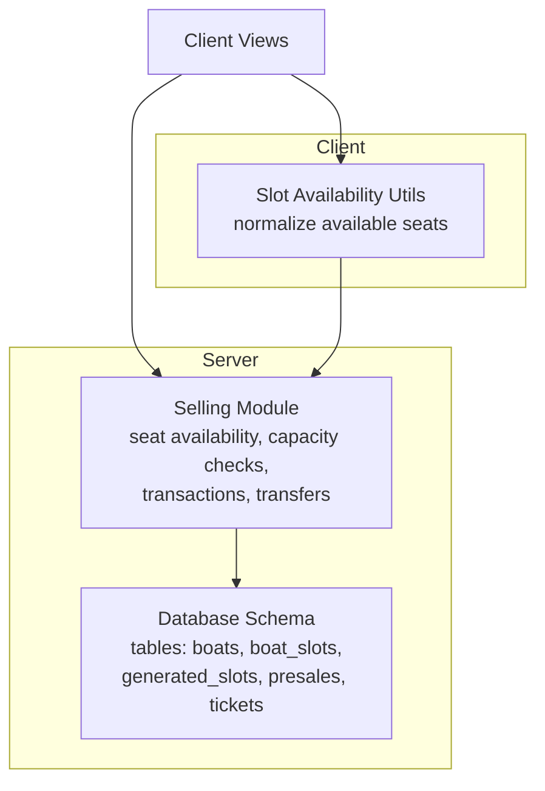
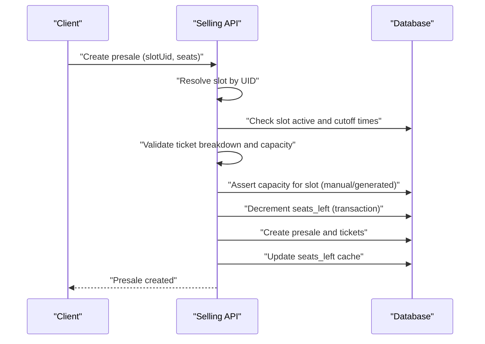
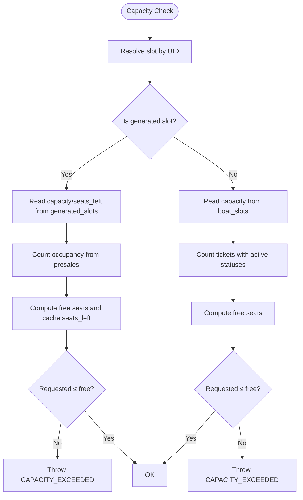
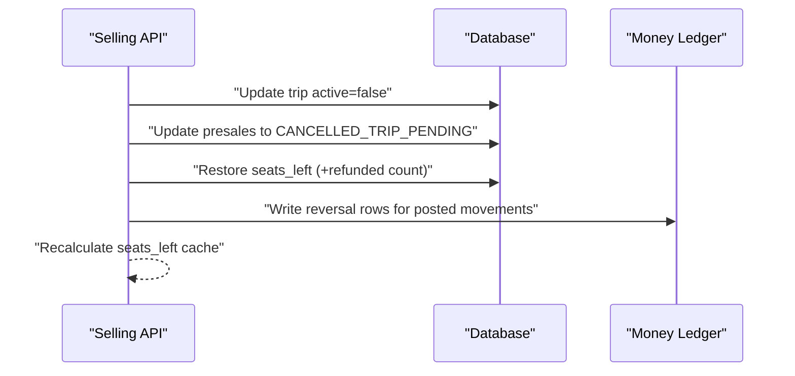
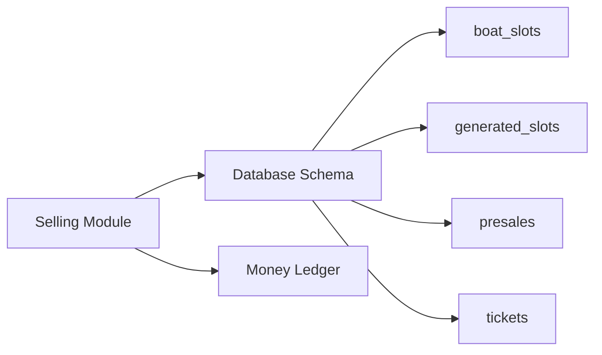

# Seat Availability Rules

<cite>
**Referenced Files in This Document**
- [selling.mjs](file://server/selling.mjs)
- [db.js](file://server/db.js)
- [slotAvailability.js](file://src/utils/slotAvailability.js)
</cite>

## Table of Contents
1. [Introduction](#introduction)
2. [Project Structure](#project-structure)
3. [Core Components](#core-components)
4. [Architecture Overview](#architecture-overview)
5. [Detailed Component Analysis](#detailed-component-analysis)
6. [Dependency Analysis](#dependency-analysis)
7. [Performance Considerations](#performance-considerations)
8. [Troubleshooting Guide](#troubleshooting-guide)
9. [Conclusion](#conclusion)

## Introduction
This document describes the seat availability management rules in the boat ticketing system. It explains how capacity is enforced per boat type, how real-time seat tracking works, how overbooking is prevented, and how seat allocation, blocking/unblocking, and inventory management operate. It also covers slot availability calculations, concurrent booking handling, seat conflict resolution, and special cases such as partial cancellations, seat transfers, and capacity adjustments during peak seasons.

## Project Structure
The seat availability logic spans the server-side selling module, database schema definitions, and client-side utilities for slot availability display:

- Server-side seat management: [selling.mjs](file://server/selling.mjs)
- Database schema and migrations: [db.js](file://server/db.js)
- Frontend slot availability helpers: [slotAvailability.js](file://src/utils/slotAvailability.js)

**Diagram sources**
- [selling.mjs](file://server/selling.mjs#L1-L120)
- [db.js](file://server/db.js#L55-L120)
- [slotAvailability.js](file://src/utils/slotAvailability.js#L1-L19)

**Section sources**
- [selling.mjs](file://server/selling.mjs#L1-L120)
- [db.js](file://server/db.js#L55-L120)
- [slotAvailability.js](file://src/utils/slotAvailability.js#L1-L19)

## Core Components
- Seat occupancy and capacity retrieval
- Capacity validation for manual and generated slots
- Real-time seat tracking and caching
- Transactional seat allocation and deallocation
- Overbooking prevention mechanisms
- Seat allocation strategies and blocking/unblocking
- Inventory management policies
- Slot availability calculation logic
- Concurrent booking handling
- Seat conflict resolution
- Examples of capacity constraints, seat selection workflows, and availability updates
- Relationship between boat capacity, trip slots, and seat reservation states
- Edge cases: partial cancellations, seat transfers, capacity adjustments

**Section sources**
- [selling.mjs](file://server/selling.mjs#L48-L102)
- [selling.mjs](file://server/selling.mjs#L1129-L1509)
- [selling.mjs](file://server/selling.mjs#L1533-L1547)

## Architecture Overview
The seat availability system enforces capacity constraints at multiple levels:
- Per-slot capacity checks
- Per-slot occupancy counting
- Generated slot vs manual slot handling
- Transactional seat allocation and deallocation
- Seat inventory synchronization

**Diagram sources**
- [selling.mjs](file://server/selling.mjs#L820-L1080)
- [selling.mjs](file://server/selling.mjs#L1129-L1509)

**Section sources**
- [selling.mjs](file://server/selling.mjs#L820-L1080)
- [selling.mjs](file://server/selling.mjs#L1129-L1509)

## Detailed Component Analysis

### Capacity Management and Validation
- Capacity retrieval:
  - Manual slots: fetch capacity from `boat_slots`
  - Generated slots: use `generated_slots.capacity` and `seats_left`
- Occupancy counting:
  - Manual slots: count tickets with specific statuses in `tickets`
  - Generated slots: sum `presales.number_of_seats` for active/confirmed statuses
- Capacity assertion:
  - Manual: compare requested seats vs `capacity - occupied`
  - Generated: compute occupancy from presales and update cache

**Diagram sources**
- [selling.mjs](file://server/selling.mjs#L48-L94)
- [selling.mjs](file://server/selling.mjs#L1134-L1150)

**Section sources**
- [selling.mjs](file://server/selling.mjs#L48-L94)
- [selling.mjs](file://server/selling.mjs#L1134-L1150)

### Seat Allocation Strategies and Blocking/Unblocking
- Allocation:
  - Transaction decrements `seats_left` in the correct table (`boat_slots` or `generated_slots`)
  - Creates presale and tickets atomically
- Blocking:
  - When a trip is deactivated or canceled, presales are moved to a pending cancellation state and seats are restored
- Unblocking:
  - When a trip is reactivated, seats_left is recalculated to reflect sold inventory

**Diagram sources**
- [selling.mjs](file://server/selling.mjs#L2017-L2027)
- [selling.mjs](file://server/selling.mjs#L2754-L2790)

**Section sources**
- [selling.mjs](file://server/selling.mjs#L2017-L2027)
- [selling.mjs](file://server/selling.mjs#L2754-L2790)

### Inventory Management Policies
- Seat inventory:
  - `boat_slots.seats_left`: cached free seats for manual slots
  - `generated_slots.seats_left`: cached free seats for generated slots
- Seat restoration:
  - On cancellation/refund, seats are restored respecting capacity bounds
- Seat cache synchronization:
  - After transactions, seats_left is recalculated and updated

**Section sources**
- [selling.mjs](file://server/selling.mjs#L96-L102)
- [selling.mjs](file://server/selling.mjs#L1501-L1506)
- [selling.mjs](file://server/selling.mjs#L2080-L2081)

### Slot Availability Calculation Logic
- Frontend availability:
  - Uses `seats_available` with fallbacks to `seats_left`, `capacity`, `boat_capacity`
- Backend availability:
  - Manual slots: `seats_left` from `boat_slots`
  - Generated slots: `seats_left` from `generated_slots` with fallback logic

**Section sources**
- [slotAvailability.js](file://src/utils/slotAvailability.js#L7-L19)
- [selling.mjs](file://server/selling.mjs#L563-L607)

### Concurrent Booking Handling and Conflict Resolution
- Transactions:
  - Seat decrement and presale creation occur in a single transaction to prevent race conditions
- Optimistic concurrency:
  - Seat decrement includes a condition to ensure sufficient seats remain
- Conflict resolution:
  - If insufficient seats remain, the transaction fails and returns an error
  - Capacity assertions prevent oversell even under concurrent load

**Section sources**
- [selling.mjs](file://server/selling.mjs#L1134-L1150)
- [selling.mjs](file://server/selling.mjs#L1148-L1150)

### Seat Selection Workflows and Examples
- Example: Banana boat capacity constraints
  - Capacity fixed at 12 seats
  - Duration fixed at 40 minutes
  - Teen tickets not allowed
- Example: Speed/Cruise boat capacity constraints
  - Capacity equals slot capacity
  - Duration 60, 120, or 180 minutes
- Example: Ticket breakdown validation
  - Validates non-negative integers
  - Enforces boat-specific constraints (e.g., banana ban on teen tickets)

**Section sources**
- [selling.mjs](file://server/selling.mjs#L209-L245)
- [selling.mjs](file://server/selling.mjs#L1786-L1797)
- [selling.mjs](file://server/selling.mjs#L1010-L1038)

### Availability Update Mechanisms
- Real-time updates:
  - After successful presale creation, seats_left is updated in the correct table
- Cache maintenance:
  - seats_left cache is recalculated and synchronized
- Generated slot cache:
  - For generated slots, seats_left is recomputed from presales and cached

**Section sources**
- [selling.mjs](file://server/selling.mjs#L1134-L1150)
- [selling.mjs](file://server/selling.mjs#L1501-L1506)
- [selling.mjs](file://server/selling.mjs#L73-L89)

### Relationship Between Boat Capacity, Trip Slots, and Reservation States
- Boat capacity:
  - Defined per boat type and slot
  - Enforced during seat allocation and transfers
- Trip slots:
  - Manual slots: `boat_slots`
  - Generated slots: `generated_slots` with trip_date/time
- Reservation states:
  - ACTIVE, PAID, PARTIALLY_PAID, CONFIRMED, USED, CANCELLED, REFUNDED
  - Seat inventory reflects only non-refunded reservations

**Section sources**
- [selling.mjs](file://server/selling.mjs#L297-L395)
- [selling.mjs](file://server/selling.mjs#L1786-L1797)

### Edge Cases: Partial Cancellations, Transfers, and Capacity Adjustments
- Partial cancellations:
  - Reducing number of seats updates presale totals and restores seats proportionally
- Seat transfers:
  - Single ticket transfer creates a new presale and moves the ticket
  - Whole presale transfer recomputes prices based on destination slot rates
- Capacity adjustments:
  - Increasing capacity adjusts seats_left accordingly
  - Decreasing capacity validates against sold seats

**Section sources**
- [selling.mjs](file://server/selling.mjs#L3022-L3131)
- [selling.mjs](file://server/selling.mjs#L3816-L4036)
- [selling.mjs](file://server/selling.mjs#L4230-L4523)
- [selling.mjs](file://server/selling.mjs#L2029-L2077)

## Dependency Analysis
Seat availability depends on:
- Database schema for slots and inventory
- Transaction boundaries for atomic seat allocation
- Money ledger for pending payments and analytics alignment

**Diagram sources**
- [selling.mjs](file://server/selling.mjs#L1129-L1509)
- [db.js](file://server/db.js#L68-L120)

**Section sources**
- [selling.mjs](file://server/selling.mjs#L1129-L1509)
- [db.js](file://server/db.js#L68-L120)

## Performance Considerations
- Indexes and constraints:
  - Unique constraints on generated slots prevent duplicate trips
  - Migrations ensure seats_left and capacity defaults are normalized
- Query efficiency:
  - Direct seat counting queries minimize joins
  - Cache updates reduce repeated computation
- Concurrency:
  - Transactional seat decrements prevent race conditions
  - Conditional updates ensure correctness under contention

[No sources needed since this section provides general guidance]

## Troubleshooting Guide
Common issues and resolutions:
- Capacity exceeded errors:
  - Verify slot capacity and occupancy
  - Check generated slot cache synchronization
- Seat not available:
  - Confirm slot active status and cutoff times
  - Review pending cancellations affecting inventory
- Transfer failures:
  - Ensure target slot has sufficient seats
  - Validate presale status and ticket state
- Analytics mismatches:
  - Confirm money ledger expectations and canonical rows are updated after transfers and cancellations

**Section sources**
- [selling.mjs](file://server/selling.mjs#L1533-L1547)
- [selling.mjs](file://server/selling.mjs#L2814-L3019)
- [selling.mjs](file://server/selling.mjs#L3200-L3317)

## Conclusion
The seat availability system enforces strict capacity limits per boat type and slot, maintains real-time inventory through transactional updates, and provides robust mechanisms for transfers, cancellations, and capacity adjustments. By leveraging generated slot caches, transactional guarantees, and seat restoration logic, the system prevents overbooking and ensures accurate availability across manual and generated slots.