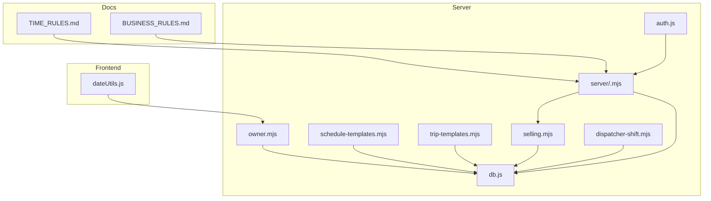
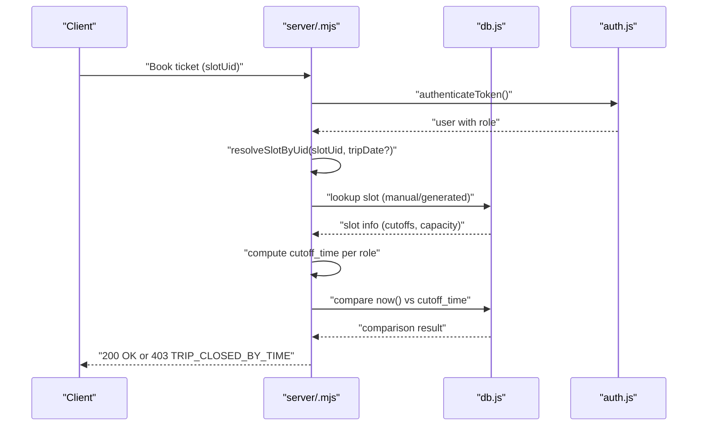
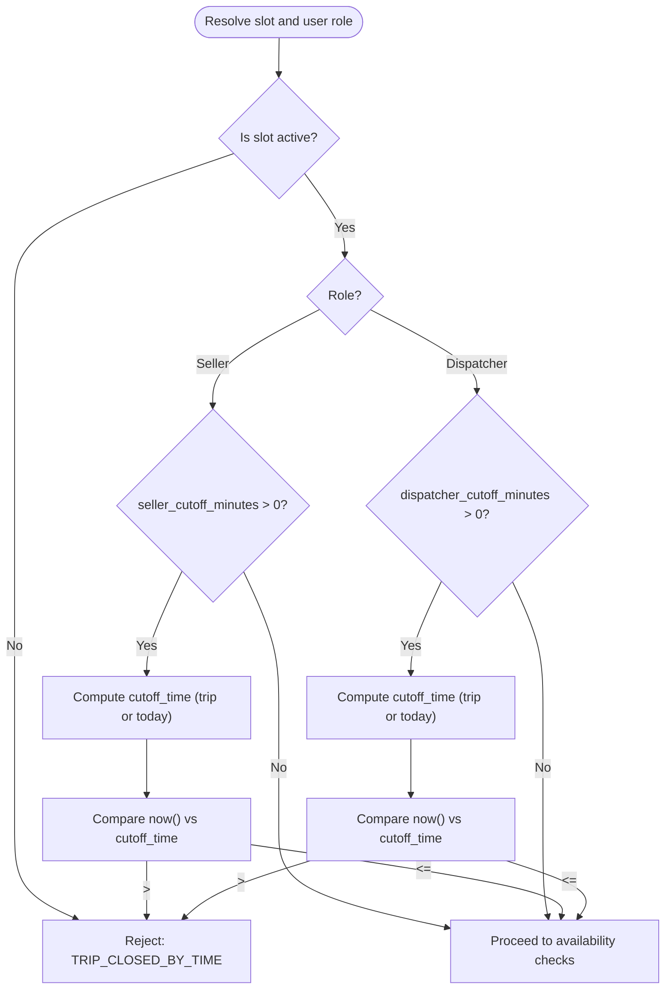
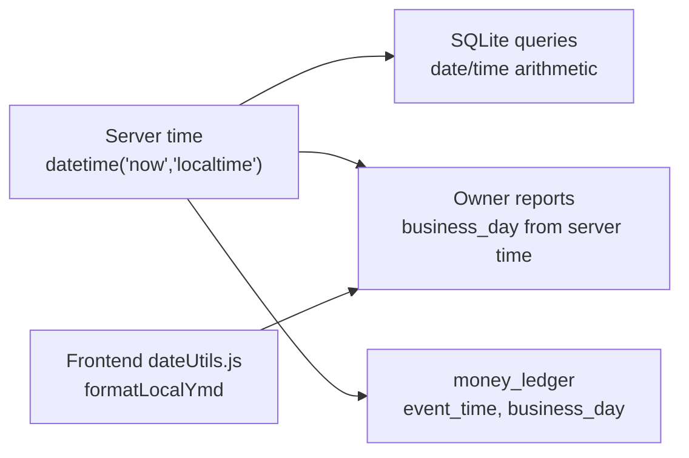
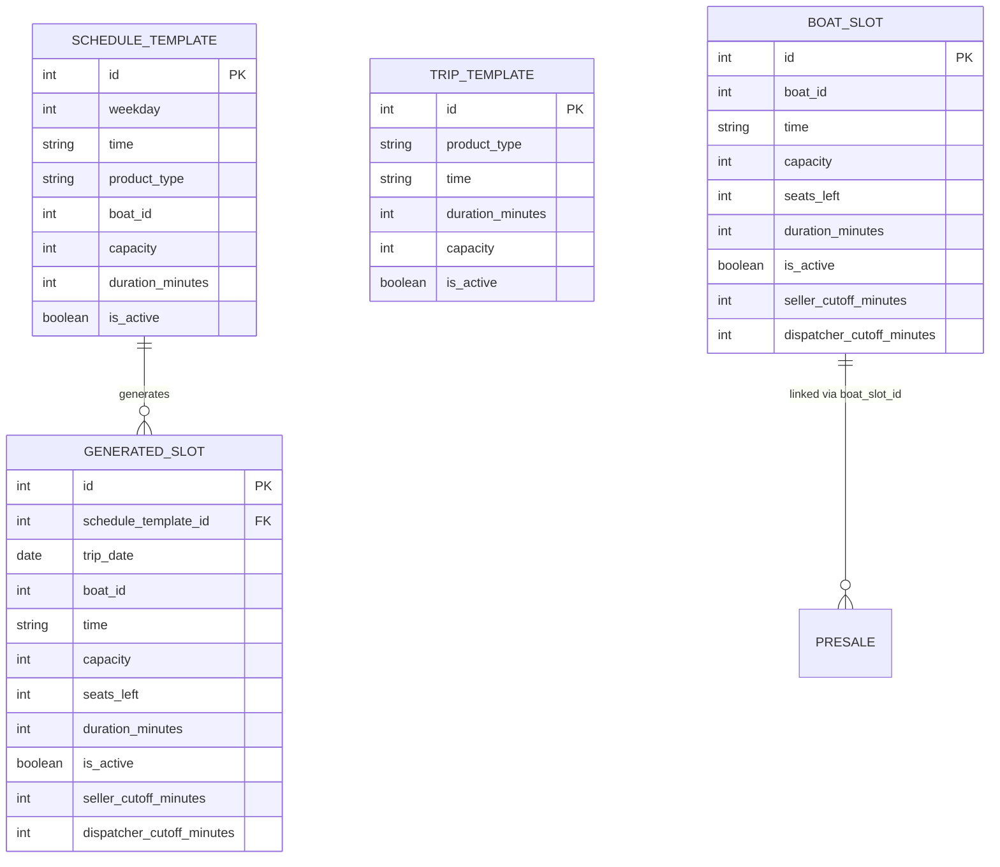
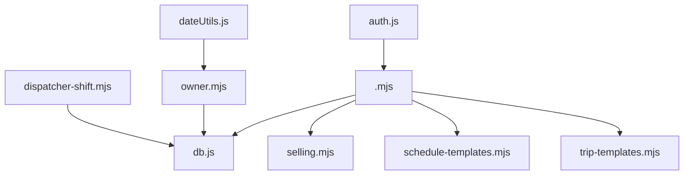

# Time Management Rules

<cite>
**Referenced Files in This Document**
- [TIME_RULES.md](file://docs/TIME_RULES.md)
- [BUSINESS_RULES.md](file://docs/BUSINESS_RULES.md)
- [selling.mjs](file://server/selling.mjs)
- [.mjs](file://server/.mjs)
- [db.js](file://server/db.js)
- [schedule-templates.mjs](file://server/schedule-templates.mjs)
- [trip-templates.mjs](file://server/trip-templates.mjs)
- [owner.mjs](file://server/owner.mjs)
- [dispatcher-shift.mjs](file://server/dispatcher-shift.mjs)
- [dateUtils.js](file://src/utils/dateUtils.js)
- [auth.js](file://server/auth.js)
- [package.json](file://package.json)
</cite>

## Table of Contents
1. [Introduction](#introduction)
2. [Project Structure](#project-structure)
3. [Core Components](#core-components)
4. [Architecture Overview](#architecture-overview)
5. [Detailed Component Analysis](#detailed-component-analysis)
6. [Dependency Analysis](#dependency-analysis)
7. [Performance Considerations](#performance-considerations)
8. [Troubleshooting Guide](#troubleshooting-guide)
9. [Conclusion](#conclusion)

## Introduction
This document defines the time management policies for the boat ticketing system, focusing on cutoff time mechanisms, role-based access controls, and server-side time synchronization. It explains how seller_cutoff_minutes and dispatcher_cutoff_minutes govern booking windows, how time-based access controls are enforced for different user roles, and how server time is used consistently across the system. It also covers trip scheduling constraints, departure time management, real-time updates, and time-related business scenarios such as early morning trips, overnight schedules, and seasonal time changes.

## Project Structure
The time management logic spans several backend modules and documentation files:
- Business and time policy definitions: docs/TIME_RULES.md, docs/BUSINESS_RULES.md
- Booking and cutoff enforcement: server/selling.mjs, server/.mjs
- Database schema and migrations: server/db.js
- Schedule and template management: server/schedule-templates.mjs, server/trip-templates.mjs
- Owner analytics and time-sensitive reporting: server/owner.mjs
- Dispatcher shift ledger and time tagging: server/dispatcher-shift.mjs
- Frontend date utilities: src/utils/dateUtils.js
- Authentication and role gating: server/auth.js
- Dependencies and runtime: package.json

**Diagram sources**
- [TIME_RULES.md](file://docs/TIME_RULES.md#L1-L47)
- [BUSINESS_RULES.md](file://docs/BUSINESS_RULES.md#L1-L49)
- [selling.mjs](file://server/selling.mjs#L1-L120)
- [.mjs](file://server/.mjs#L600-L799)
- [db.js](file://server/db.js#L688-L726)
- [schedule-templates.mjs](file://server/schedule-templates.mjs#L1-L120)
- [trip-templates.mjs](file://server/trip-templates.mjs#L1-L120)
- [owner.mjs](file://server/owner.mjs#L1-L120)
- [dispatcher-shift.mjs](file://server/dispatcher-shift.mjs#L1-L62)
- [dateUtils.js](file://src/utils/dateUtils.js#L1-L74)
- [auth.js](file://server/auth.js#L1-L154)

**Section sources**
- [TIME_RULES.md](file://docs/TIME_RULES.md#L1-L47)
- [BUSINESS_RULES.md](file://docs/BUSINESS_RULES.md#L1-L49)
- [selling.mjs](file://server/selling.mjs#L1-L120)
- [.mjs](file://server/.mjs#L600-L799)
- [db.js](file://server/db.js#L688-L726)
- [schedule-templates.mjs](file://server/schedule-templates.mjs#L1-L120)
- [trip-templates.mjs](file://server/trip-templates.mjs#L1-L120)
- [owner.mjs](file://server/owner.mjs#L1-L120)
- [dispatcher-shift.mjs](file://server/dispatcher-shift.mjs#L1-L62)
- [dateUtils.js](file://src/utils/dateUtils.js#L1-L74)
- [auth.js](file://server/auth.js#L1-L154)

## Core Components
- Time source policy: The system uses exclusively server-side time and avoids client-provided time or timezone guessing.
- Cutoff definitions:
  - seller_cutoff_minutes: optional number of minutes before departure that sales close for sellers; NULL means no cutoff.
  - dispatcher_cutoff_minutes: optional number of minutes before departure that sales close for dispatchers; must be greater than or equal to seller cutoff when both are set.
- Cutoff formulas:
  - trip_datetime = datetime(trip_date + trip_time)
  - seller_cutoff_time = trip_datetime - seller_cutoff_minutes
  - dispatcher_cutoff_time = trip_datetime - dispatcher_cutoff_minutes
- Access control checks:
  - If current server time >= seller_cutoff_time → seller cannot sell
  - If current server time >= dispatcher_cutoff_time → dispatcher cannot sell
- Role-specific behavior:
  - Sellers: bound by their own cutoff window.
  - Dispatchers: can override seller cutoff and operate under their own extended window.
  - Admin/Owner: administrative access, not bound by cutoffs for operational tasks.

**Section sources**
- [TIME_RULES.md](file://docs/TIME_RULES.md#L9-L47)
- [BUSINESS_RULES.md](file://docs/BUSINESS_RULES.md#L3-L19)

## Architecture Overview
The time enforcement pipeline integrates slot resolution, role-based cutoff computation, and server-side time comparisons.

**Diagram sources**
- [.mjs](file://server/.mjs#L640-L754)
- [auth.js](file://server/auth.js#L10-L40)
- [db.js](file://server/db.js#L28-L36)

## Detailed Component Analysis

### Cutoff Enforcement Engine
- Slot resolution supports both manual and generated slots, retrieving cutoff values per slot.
- For generated slots, cutoff is computed using the trip’s actual date and time.
- For manual slots, cutoff is computed using today’s date plus the slot’s time.
- Role-based enforcement:
  - Sellers: require seller_cutoff_minutes > 0 and non-null to apply.
  - Dispatchers: require dispatcher_cutoff_minutes > 0 and non-null to apply; can operate beyond seller cutoff.

**Diagram sources**
- [.mjs](file://server/.mjs#L640-L754)

**Section sources**
- [.mjs](file://server/.mjs#L640-L754)

### Time-Based Access Controls and Role Windows
- Sellers:
  - Bound by seller_cutoff_minutes; cannot sell once server time reaches or exceeds cutoff.
  - Cannot override cutoff rules.
- Dispatchers:
  - Can sell up to dispatcher_cutoff_minutes; may operate beyond seller cutoff.
  - Cannot override rules arbitrarily; cutoffs are per-slot and per-role.
- Admin/Owner:
  - Administrative access; not bound by cutoffs for operational tasks.

**Section sources**
- [BUSINESS_RULES.md](file://docs/BUSINESS_RULES.md#L3-L19)

### Server Time Synchronization and Timezone Handling
- Policy:
  - Only server time is used; no client-provided time or timezone guessing.
- Implementation:
  - Backend consistently uses SQLite datetime functions operating on server-local time.
  - Owner analytics and ledger entries tag events with server-local time and business day derived from server time.
- Frontend date utilities:
  - Utilities format and normalize dates as local YYYY-MM-DD without UTC shifts.

**Diagram sources**
- [owner.mjs](file://server/owner.mjs#L35-L44)
- [owner.mjs](file://server/owner.mjs#L170-L181)
- [dispatcher-shift.mjs](file://server/dispatcher-shift.mjs#L32-L52)
- [dateUtils.js](file://src/utils/dateUtils.js#L6-L9)

**Section sources**
- [TIME_RULES.md](file://docs/TIME_RULES.md#L9-L12)
- [owner.mjs](file://server/owner.mjs#L35-L44)
- [owner.mjs](file://server/owner.mjs#L170-L181)
- [dispatcher-shift.mjs](file://server/dispatcher-shift.mjs#L32-L52)
- [dateUtils.js](file://src/utils/dateUtils.js#L6-L9)

### Trip Scheduling Constraints and Departure Time Management
- Generated slots:
  - Persist trip_date, time, capacity, and per-slot cutoffs.
  - Unique constraint prevents duplicate generated trips for the same date/time/boat.
- Schedule templates:
  - Define recurring weekday/time/duration/capacity/pricing.
  - Generate slots for a date range; skip duplicates if they already exist.
- Manual slots:
  - Store time, capacity, seats_left, and per-slot cutoffs.
- Validation:
  - Time format constrained to HH:MM within 08:00–21:00 with 30-minute steps.
  - Duration constrained per service type (banana vs others).

**Diagram sources**
- [db.js](file://server/db.js#L688-L726)
- [db.js](file://server/db.js#L728-L751)
- [schedule-templates.mjs](file://server/schedule-templates.mjs#L220-L303)
- [trip-templates.mjs](file://server/trip-templates.mjs#L94-L174)

**Section sources**
- [db.js](file://server/db.js#L688-L726)
- [db.js](file://server/db.js#L728-L751)
- [schedule-templates.mjs](file://server/schedule-templates.mjs#L220-L303)
- [trip-templates.mjs](file://server/trip-templates.mjs#L94-L174)

### Real-Time Time Updates and Late Booking Restrictions
- Real-time enforcement:
  - Cutoff checks compare server time with computed cutoff_time at booking time.
  - Generated slots enforce cutoff using their specific trip_date and time.
  - Manual slots enforce cutoff using today’s date plus the slot’s time.
- Grace periods:
  - No built-in grace period beyond the configured cutoff window; strict enforcement applies.
- Exception handling:
  - On cutoff violation, returns structured error code TRIP_CLOSED_BY_TIME with debug info.

**Section sources**
- [.mjs](file://server/.mjs#L656-L754)

### Examples of Cutoff Enforcement
- Example A: Seller attempts to book a generated slot whose cutoff time has passed.
  - Resolution: Enforce cutoff using slot’s trip_date and time; reject with TRIP_CLOSED_BY_TIME.
- Example B: Dispatcher extends sale window beyond seller cutoff for the same slot.
  - Resolution: Dispatcher cutoff applied; if exceeded, reject with TRIP_CLOSED_BY_TIME.
- Example C: Manual slot cutoff for today’s departure.
  - Resolution: Cutoff computed using today’s date and slot’s time; reject if now >= cutoff.

**Section sources**
- [.mjs](file://server/.mjs#L640-L754)

### Time-Related Business Scenarios
- Early morning trips:
  - Allowed within 08:00–21:00 window; enforced by time format validation.
- Overnight schedules:
  - Cutoff logic uses datetime arithmetic; generated slots persist trip_date and time independently of server date, ensuring correct boundary crossing.
- Seasonal time changes:
  - Schedule templates define recurring weekday/time; generated slots created for date ranges; server-local time governs all comparisons.

**Section sources**
- [schedule-templates.mjs](file://server/schedule-templates.mjs#L8-L29)
- [schedule-templates.mjs](file://server/schedule-templates.mjs#L220-L303)
- [owner.mjs](file://server/owner.mjs#L170-L181)

## Dependency Analysis
- Role gating depends on authentication middleware.
- Cutoff enforcement depends on slot resolution and database-backed cutoff values.
- Owner analytics depend on server-local time expressions and consistent business_day derivation.

**Diagram sources**
- [auth.js](file://server/auth.js#L10-L40)
- [.mjs](file://server/.mjs#L640-L754)
- [db.js](file://server/db.js#L28-L36)
- [owner.mjs](file://server/owner.mjs#L35-L44)
- [dispatcher-shift.mjs](file://server/dispatcher-shift.mjs#L32-L52)
- [dateUtils.js](file://src/utils/dateUtils.js#L6-L9)

**Section sources**
- [auth.js](file://server/auth.js#L10-L40)
- [.mjs](file://server/.mjs#L640-L754)
- [db.js](file://server/db.js#L28-L36)
- [owner.mjs](file://server/owner.mjs#L35-L44)
- [dispatcher-shift.mjs](file://server/dispatcher-shift.mjs#L32-L52)
- [dateUtils.js](file://src/utils/dateUtils.js#L6-L9)

## Performance Considerations
- Cutoff computations rely on SQLite datetime arithmetic; keep slot resolution minimal and indexed where possible.
- Generated slots enforce uniqueness via a unique index on (trip_date, time, boat_id), preventing redundant generation and reducing runtime checks.
- Owner analytics derive business_day from server time; avoid excessive recomputation by caching server-local date expressions.

[No sources needed since this section provides general guidance]

## Troubleshooting Guide
- Symptom: “TRIP_CLOSED_BY_TIME” error
  - Cause: Current server time reached or exceeded the computed cutoff_time for the slot and user role.
  - Action: Verify slot’s seller/dispatcher cutoff values and ensure server time is synchronized.
- Symptom: Generated slot appears but cannot be booked
  - Cause: Cutoff reached or slot inactive; verify trip_date/time and cutoff configuration.
- Symptom: Owner reports show unexpected revenue grouping
  - Cause: business_day derivation from server time; confirm server timezone and date settings.

**Section sources**
- [.mjs](file://server/.mjs#L670-L697)
- [owner.mjs](file://server/owner.mjs#L35-L44)

## Conclusion
The system enforces strict, server-centric time management with role-aware cutoff windows. Cutoffs are computed per slot and per role, ensuring sellers and dispatchers operate within defined temporal boundaries. The design leverages SQLite’s datetime functions and consistent server-local time across scheduling, booking, and reporting. By adhering to documented policies and maintaining accurate server time, operators can reliably manage early morning, overnight, and seasonal schedules while preventing unauthorized late bookings.