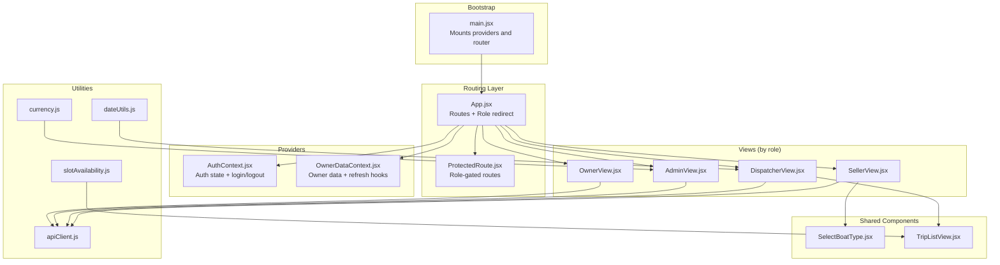
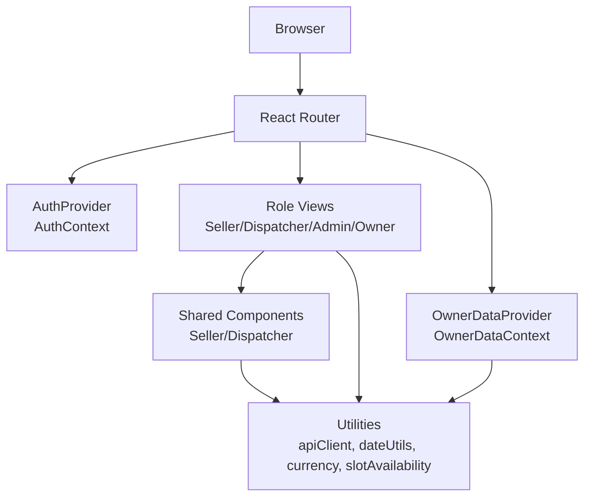
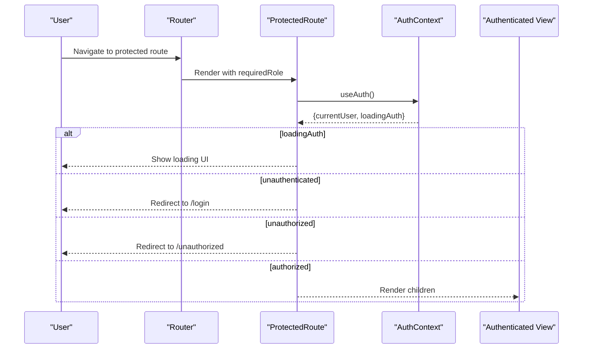
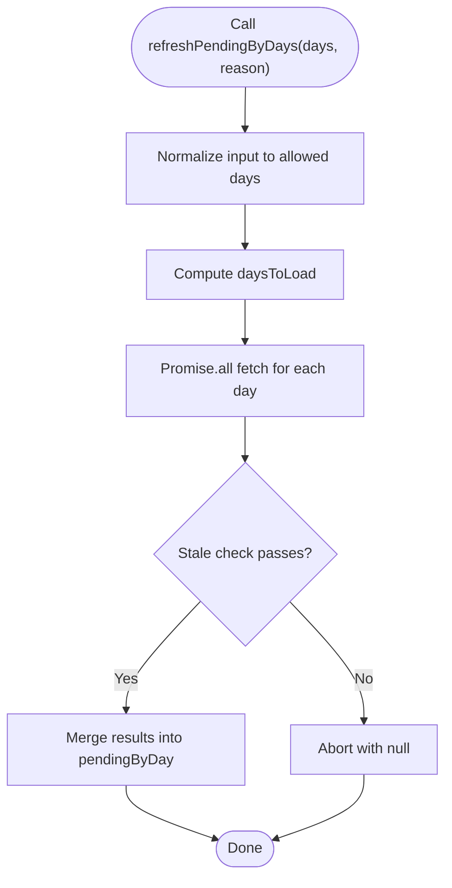
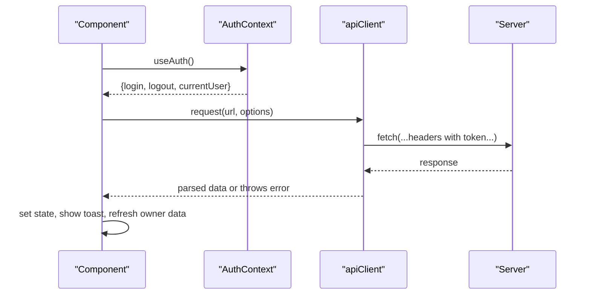
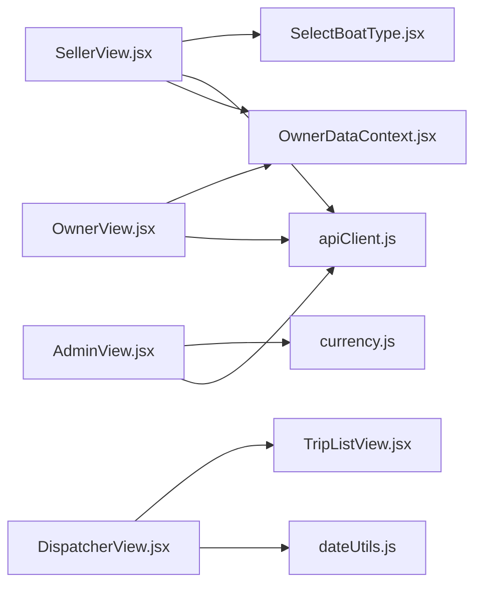
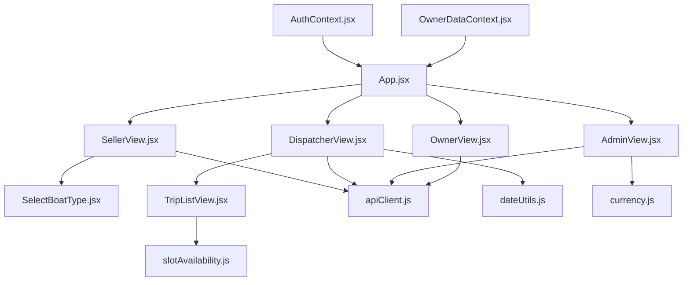

# Component Architecture

<cite>
**Referenced Files in This Document**
- [main.jsx](file://src/main.jsx)
- [App.jsx](file://src/App.jsx)
- [AuthContext.jsx](file://src/contexts/AuthContext.jsx)
- [OwnerDataContext.jsx](file://src/contexts/OwnerDataContext.jsx)
- [ProtectedRoute.jsx](file://src/components/ProtectedRoute.jsx)
- [apiClient.js](file://src/utils/apiClient.js)
- [dateUtils.js](file://src/utils/dateUtils.js)
- [currency.js](file://src/utils/currency.js)
- [slotAvailability.js](file://src/utils/slotAvailability.js)
- [SellerView.jsx](file://src/views/SellerView.jsx)
- [DispatcherView.jsx](file://src/views/DispatcherView.jsx)
- [AdminView.jsx](file://src/views/AdminView.jsx)
- [OwnerView.jsx](file://src/views/OwnerView.jsx)
- [SelectBoatType.jsx](file://src/components/seller/SelectBoatType.jsx)
- [TripListView.jsx](file://src/components/dispatcher/TripListView.jsx)
</cite>

## Table of Contents
1. [Introduction](#introduction)
2. [Project Structure](#project-structure)
3. [Core Components](#core-components)
4. [Architecture Overview](#architecture-overview)
5. [Detailed Component Analysis](#detailed-component-analysis)
6. [Dependency Analysis](#dependency-analysis)
7. [Performance Considerations](#performance-considerations)
8. [Troubleshooting Guide](#troubleshooting-guide)
9. [Conclusion](#conclusion)
10. [Appendices](#appendices)

## Introduction
This document describes the React component architecture and UI component library for the boat-ticket-app. It explains the component hierarchy among role-specific views (Seller, Dispatcher, Admin, Owner), shared components, and utility modules. It documents state management patterns using React Context API for authentication and owner-related global state, reusable component design, lifecycle and rendering optimization, utility functions for API communication and data formatting, and integration with backend APIs including error handling and loading states.

## Project Structure
The application bootstraps inside a strict React environment and mounts routing and providers at the root. Views are organized by role and feature, with shared components and utilities under dedicated folders. Context providers wrap the app to supply authentication and owner data globally.

**Diagram sources**
- [main.jsx](file://src/main.jsx#L15-L23)
- [App.jsx](file://src/App.jsx#L40-L136)
- [ProtectedRoute.jsx](file://src/components/ProtectedRoute.jsx#L4-L35)
- [AuthContext.jsx](file://src/contexts/AuthContext.jsx#L19-L78)
- [OwnerDataContext.jsx](file://src/contexts/OwnerDataContext.jsx#L21-L128)
- [SellerView.jsx](file://src/views/SellerView.jsx#L37-L370)
- [DispatcherView.jsx](file://src/views/DispatcherView.jsx#L23-L291)
- [AdminView.jsx](file://src/views/AdminView.jsx#L10-L382)
- [OwnerView.jsx](file://src/views/OwnerView.jsx#L164-L194)
- [SelectBoatType.jsx](file://src/components/seller/SelectBoatType.jsx#L3-L48)
- [TripListView.jsx](file://src/components/dispatcher/TripListView.jsx#L71-L257)
- [apiClient.js](file://src/utils/apiClient.js#L23-L88)
- [dateUtils.js](file://src/utils/dateUtils.js#L16-L74)
- [currency.js](file://src/utils/currency.js#L6-L15)
- [slotAvailability.js](file://src/utils/slotAvailability.js#L7-L19)

**Section sources**
- [main.jsx](file://src/main.jsx#L1-L26)
- [App.jsx](file://src/App.jsx#L1-L139)

## Core Components
- Authentication Provider and Hook: Centralizes login, logout, persisted session restoration, and exposes current user and loading state to the app.
- Owner Data Provider and Hook: Manages owner-specific data fetching and refresh orchestration with stale checks and parallelization.
- Protected Route: Enforces role-based access and redirects for unauthorized or unauthenticated users.
- API Client: Unified HTTP client with token injection, response normalization, and structured error reporting.
- Utility Modules: Date normalization, currency formatting, and slot availability helpers.

Key responsibilities:
- AuthContext: Token persistence, session restoration, login/logout, and exposing state to consumers.
- OwnerDataContext: Pending-by-day data, loading flags, refresh strategies, and callback registration for cross-component synchronization.
- ProtectedRoute: Role gating, owner exception for owner routes, and loading UX.
- apiClient: Request lifecycle, token handling, response parsing, and error propagation.
- Utilities: Consistent formatting and normalization across components.

**Section sources**
- [AuthContext.jsx](file://src/contexts/AuthContext.jsx#L19-L78)
- [OwnerDataContext.jsx](file://src/contexts/OwnerDataContext.jsx#L21-L128)
- [ProtectedRoute.jsx](file://src/components/ProtectedRoute.jsx#L4-L35)
- [apiClient.js](file://src/utils/apiClient.js#L23-L88)
- [dateUtils.js](file://src/utils/dateUtils.js#L16-L74)
- [currency.js](file://src/utils/currency.js#L6-L15)
- [slotAvailability.js](file://src/utils/slotAvailability.js#L7-L19)

## Architecture Overview
The app uses React Router for navigation and React Context for global state. Providers are initialized at the root and consumed by role-specific views and shared components. Shared components encapsulate UI concerns and delegate data operations to the API client. Owner data is managed separately to avoid polluting the auth context with UI-specific state.

**Diagram sources**
- [main.jsx](file://src/main.jsx#L15-L23)
- [App.jsx](file://src/App.jsx#L40-L136)
- [AuthContext.jsx](file://src/contexts/AuthContext.jsx#L19-L78)
- [OwnerDataContext.jsx](file://src/contexts/OwnerDataContext.jsx#L21-L128)
- [SellerView.jsx](file://src/views/SellerView.jsx#L37-L370)
- [DispatcherView.jsx](file://src/views/DispatcherView.jsx#L23-L291)
- [AdminView.jsx](file://src/views/AdminView.jsx#L10-L382)
- [OwnerView.jsx](file://src/views/OwnerView.jsx#L164-L194)
- [SelectBoatType.jsx](file://src/components/seller/SelectBoatType.jsx#L3-L48)
- [TripListView.jsx](file://src/components/dispatcher/TripListView.jsx#L71-L257)
- [apiClient.js](file://src/utils/apiClient.js#L23-L88)

## Detailed Component Analysis

### Authentication Provider and Protected Routing
- AuthProvider initializes and normalizes user roles, restores sessions from localStorage, and exposes login/logout plus loading state.
- ProtectedRoute enforces role checks, handles owner exceptions for owner routes, and renders a loading indicator while auth is initializing.

**Diagram sources**
- [ProtectedRoute.jsx](file://src/components/ProtectedRoute.jsx#L4-L35)
- [AuthContext.jsx](file://src/contexts/AuthContext.jsx#L19-L78)
- [App.jsx](file://src/App.jsx#L53-L112)

**Section sources**
- [AuthContext.jsx](file://src/contexts/AuthContext.jsx#L19-L78)
- [ProtectedRoute.jsx](file://src/components/ProtectedRoute.jsx#L4-L35)

### Owner Data Provider and Refresh Orchestration
- OwnerDataProvider manages pending-by-day data with per-day request IDs to prevent stale updates, supports targeted refreshes, and exposes a callback registration mechanism for broader refresh coordination.
- It consolidates owner money data refresh and integrates with owner views that need synchronized updates.

**Diagram sources**
- [OwnerDataContext.jsx](file://src/contexts/OwnerDataContext.jsx#L52-L90)

**Section sources**
- [OwnerDataContext.jsx](file://src/contexts/OwnerDataContext.jsx#L21-L128)

### API Client and Backend Integration
- apiClient centralizes HTTP requests, injects tokens from localStorage, normalizes responses, and reports network logs. It exposes methods for auth, selling, presales, tickets, schedule templates, and owner dashboards.
- Components call apiClient methods to fetch and mutate data, handling errors and loading states locally.

**Diagram sources**
- [apiClient.js](file://src/utils/apiClient.js#L23-L88)
- [AuthContext.jsx](file://src/contexts/AuthContext.jsx#L55-L68)
- [SellerView.jsx](file://src/views/SellerView.jsx#L150-L170)

**Section sources**
- [apiClient.js](file://src/utils/apiClient.js#L23-L88)
- [SellerView.jsx](file://src/views/SellerView.jsx#L150-L170)

### Role-Specific Views and Composition Patterns
- SellerView orchestrates a multi-step flow (boat type → trip → seats → confirmation) using local state and shared components. It delegates data fetching to apiClient and owner data refresh to OwnerDataContext.
- DispatcherView aggregates filters and tabs, composing TripListView, SlotManagement, and other dispatcher-centric components. It uses date utilities for presets and maintains shift-closed state.
- AdminView loads dashboard statistics and user management lists, handling loading and error states with utility formatters.
- OwnerView provides a shell with bottom tabs and composes owner-focused views without performing operational actions.

**Diagram sources**
- [SellerView.jsx](file://src/views/SellerView.jsx#L37-L370)
- [SelectBoatType.jsx](file://src/components/seller/SelectBoatType.jsx#L3-L48)
- [DispatcherView.jsx](file://src/views/DispatcherView.jsx#L23-L291)
- [TripListView.jsx](file://src/components/dispatcher/TripListView.jsx#L71-L257)
- [dateUtils.js](file://src/utils/dateUtils.js#L16-L74)
- [AdminView.jsx](file://src/views/AdminView.jsx#L10-L382)
- [currency.js](file://src/utils/currency.js#L6-L15)
- [OwnerView.jsx](file://src/views/OwnerView.jsx#L164-L194)
- [OwnerDataContext.jsx](file://src/contexts/OwnerDataContext.jsx#L21-L128)
- [apiClient.js](file://src/utils/apiClient.js#L23-L88)

**Section sources**
- [SellerView.jsx](file://src/views/SellerView.jsx#L37-L370)
- [DispatcherView.jsx](file://src/views/DispatcherView.jsx#L23-L291)
- [AdminView.jsx](file://src/views/AdminView.jsx#L10-L382)
- [OwnerView.jsx](file://src/views/OwnerView.jsx#L164-L194)

### Shared Components and Props Interfaces
- SelectBoatType: Receives onSelect and onBack callbacks to drive parent state transitions.
- TripListView: Receives dateFrom, dateTo, typeFilter, statusFilter, searchTerm, and a callback to report counts. It manages its own loading/error state and renders a grid of trip cards with capacity and availability indicators.

Props interfaces (descriptive):
- SelectBoatType: { onSelect: (type) => void, onBack: () => void }
- TripListView: { dateFrom: string, dateTo: string, typeFilter?: string, statusFilter?: string, searchTerm?: string, onTripCountsChange?: (counts) => void, shiftClosed?: boolean }

Event handling patterns:
- Callback props for navigation and data updates.
- Local state for UI-only concerns (selection, loading, errors).
- Memoized computations for filtering and sorting.

**Section sources**
- [SelectBoatType.jsx](file://src/components/seller/SelectBoatType.jsx#L3-L48)
- [TripListView.jsx](file://src/components/dispatcher/TripListView.jsx#L71-L257)

### Component Lifecycle Management and Rendering Optimization
- Effect-driven data loading: Views and shared components fetch data on mount and in response to dependency changes, minimizing redundant requests.
- Memoization: useMemo is used to compute derived data (e.g., filtered trips) and constants (e.g., steps) to avoid unnecessary re-renders.
- Controlled loading states: Components display loading indicators and error messages during async operations.
- Parallel owner data refresh: OwnerDataProvider fetches multiple days concurrently and merges results atomically.

Recommendations:
- Consider caching and pagination for large datasets.
- Debounce search inputs to reduce frequent re-fetches.
- Use React.lazy and Suspense for heavy views if needed.

**Section sources**
- [SellerView.jsx](file://src/views/SellerView.jsx#L186-L210)
- [TripListView.jsx](file://src/components/dispatcher/TripListView.jsx#L107-L157)
- [OwnerDataContext.jsx](file://src/contexts/OwnerDataContext.jsx#L69-L90)

### Utility Functions for API Communication, Formatting, and Helpers
- apiClient: request, login, logout, and domain-specific methods for selling, presales, tickets, schedule templates, and owner dashboard.
- dateUtils: normalizeDate, getTodayDate, getTomorrowDate, getDay2Date for consistent date handling.
- currency: formatRUB for localized currency formatting.
- slotAvailability: getSlotAvailable, isSlotSoldOut for seat availability logic.

Integration patterns:
- Components import apiClient to perform CRUD operations and pass normalized data to child components.
- Utilities are imported where needed to format dates, currency, and availability.

**Section sources**
- [apiClient.js](file://src/utils/apiClient.js#L23-L358)
- [dateUtils.js](file://src/utils/dateUtils.js#L16-L74)
- [currency.js](file://src/utils/currency.js#L6-L15)
- [slotAvailability.js](file://src/utils/slotAvailability.js#L7-L19)

### Practical Examples
- Context provider usage: App wraps routes with AuthProvider and OwnerDataProvider to make state available across views.
- Prop drilling solution: Instead of deep prop passing, shared components receive only the data they need via props, and higher-order components manage state transitions.
- Context provider usage example path: [App.jsx](file://src/App.jsx#L40-L136), [main.jsx](file://src/main.jsx#L15-L23)

**Section sources**
- [App.jsx](file://src/App.jsx#L40-L136)
- [main.jsx](file://src/main.jsx#L15-L23)

### Accessibility Compliance and Responsive Design
- Accessibility: Use semantic HTML, focus management, and ARIA attributes where appropriate. Ensure keyboard navigation support for interactive elements.
- Responsive design: Components use grid layouts and responsive breakpoints to adapt to mobile and desktop screens. OwnerView demonstrates mobile-first tabs with a “More” menu.

**Section sources**
- [OwnerView.jsx](file://src/views/OwnerView.jsx#L196-L342)
- [TripListView.jsx](file://src/components/dispatcher/TripListView.jsx#L194-L251)

### Testing Strategies
- Unit tests for utilities: Validate date normalization, currency formatting, and slot availability helpers.
- Component tests: Mock apiClient and context providers to isolate component behavior. Test event handlers and state transitions.
- Integration tests: Verify routing, protected routes, and provider initialization sequences.

[No sources needed since this section provides general guidance]

## Dependency Analysis
The following diagram shows key dependencies among providers, views, shared components, and utilities.

**Diagram sources**
- [AuthContext.jsx](file://src/contexts/AuthContext.jsx#L19-L78)
- [OwnerDataContext.jsx](file://src/contexts/OwnerDataContext.jsx#L21-L128)
- [App.jsx](file://src/App.jsx#L40-L136)
- [SellerView.jsx](file://src/views/SellerView.jsx#L37-L370)
- [DispatcherView.jsx](file://src/views/DispatcherView.jsx#L23-L291)
- [AdminView.jsx](file://src/views/AdminView.jsx#L10-L382)
- [OwnerView.jsx](file://src/views/OwnerView.jsx#L164-L194)
- [SelectBoatType.jsx](file://src/components/seller/SelectBoatType.jsx#L3-L48)
- [TripListView.jsx](file://src/components/dispatcher/TripListView.jsx#L71-L257)
- [apiClient.js](file://src/utils/apiClient.js#L23-L88)
- [dateUtils.js](file://src/utils/dateUtils.js#L16-L74)
- [currency.js](file://src/utils/currency.js#L6-L15)
- [slotAvailability.js](file://src/utils/slotAvailability.js#L7-L19)

**Section sources**
- [App.jsx](file://src/App.jsx#L40-L136)
- [SellerView.jsx](file://src/views/SellerView.jsx#L37-L370)
- [DispatcherView.jsx](file://src/views/DispatcherView.jsx#L23-L291)
- [AdminView.jsx](file://src/views/AdminView.jsx#L10-L382)
- [OwnerView.jsx](file://src/views/OwnerView.jsx#L164-L194)

## Performance Considerations
- Minimize re-renders: Use memoization for derived data and constants; separate UI state from data state.
- Network efficiency: Parallelize owner data refresh; implement stale checks to avoid race conditions.
- Lazy loading: Defer heavy views or images; consider code splitting for large components.
- Virtualization: For long lists, implement virtual scrolling to improve rendering performance.

[No sources needed since this section provides general guidance]

## Troubleshooting Guide
- Authentication issues: Verify token presence in localStorage and session restoration flow. Check error logs from apiClient and ensure logout clears token.
- Data staleness: Confirm request IDs and stale checks in OwnerDataProvider; ensure refresh reasons are passed consistently.
- API failures: Inspect network logs and error responses; confirm headers include Authorization when present.
- UI freezes: Review effect dependencies and memoization; avoid heavy computations in render.

**Section sources**
- [AuthContext.jsx](file://src/contexts/AuthContext.jsx#L23-L53)
- [OwnerDataContext.jsx](file://src/contexts/OwnerDataContext.jsx#L37-L49)
- [apiClient.js](file://src/utils/apiClient.js#L53-L87)

## Conclusion
The component architecture leverages React Router and Context API to deliver role-specific experiences with shared components and utilities. Authentication and owner data are centralized, while UI components remain focused on presentation and user interactions. The API client provides a unified integration surface with robust error handling and logging. By applying memoization, controlled loading states, and careful dependency management, the app achieves maintainable and performant UI flows.

[No sources needed since this section summarizes without analyzing specific files]

## Appendices
- Example paths for quick reference:
  - [App.jsx](file://src/App.jsx#L40-L136)
  - [AuthContext.jsx](file://src/contexts/AuthContext.jsx#L19-L78)
  - [OwnerDataContext.jsx](file://src/contexts/OwnerDataContext.jsx#L21-L128)
  - [apiClient.js](file://src/utils/apiClient.js#L23-L88)
  - [SellerView.jsx](file://src/views/SellerView.jsx#L37-L370)
  - [DispatcherView.jsx](file://src/views/DispatcherView.jsx#L23-L291)
  - [AdminView.jsx](file://src/views/AdminView.jsx#L10-L382)
  - [OwnerView.jsx](file://src/views/OwnerView.jsx#L164-L194)
  - [SelectBoatType.jsx](file://src/components/seller/SelectBoatType.jsx#L3-L48)
  - [TripListView.jsx](file://src/components/dispatcher/TripListView.jsx#L71-L257)
  - [dateUtils.js](file://src/utils/dateUtils.js#L16-L74)
  - [currency.js](file://src/utils/currency.js#L6-L15)
  - [slotAvailability.js](file://src/utils/slotAvailability.js#L7-L19)