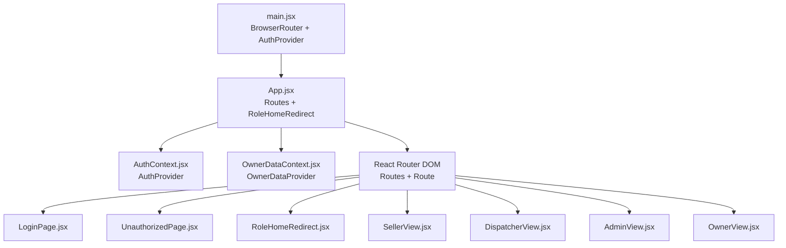
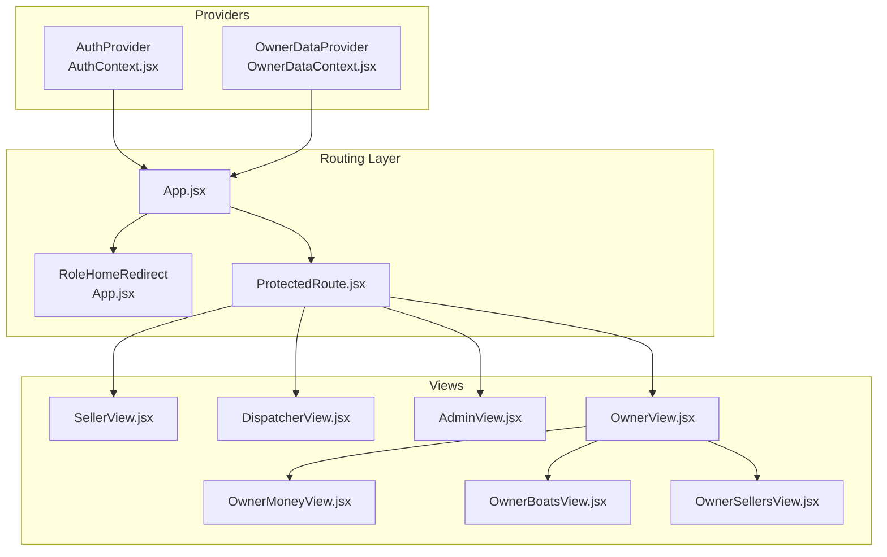
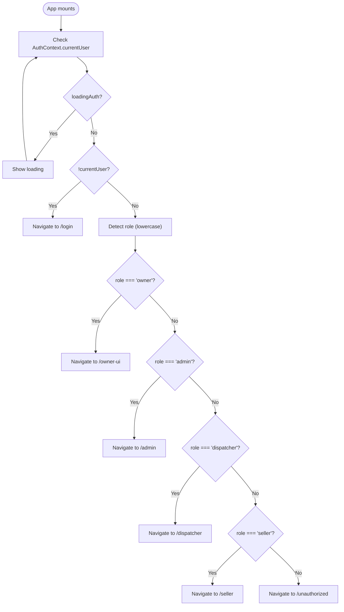
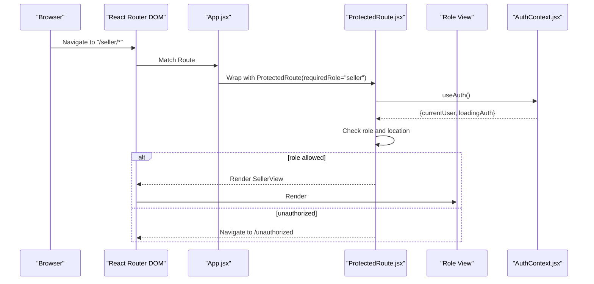
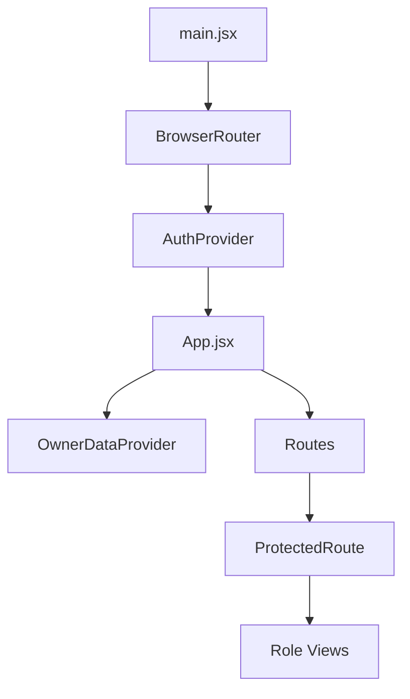
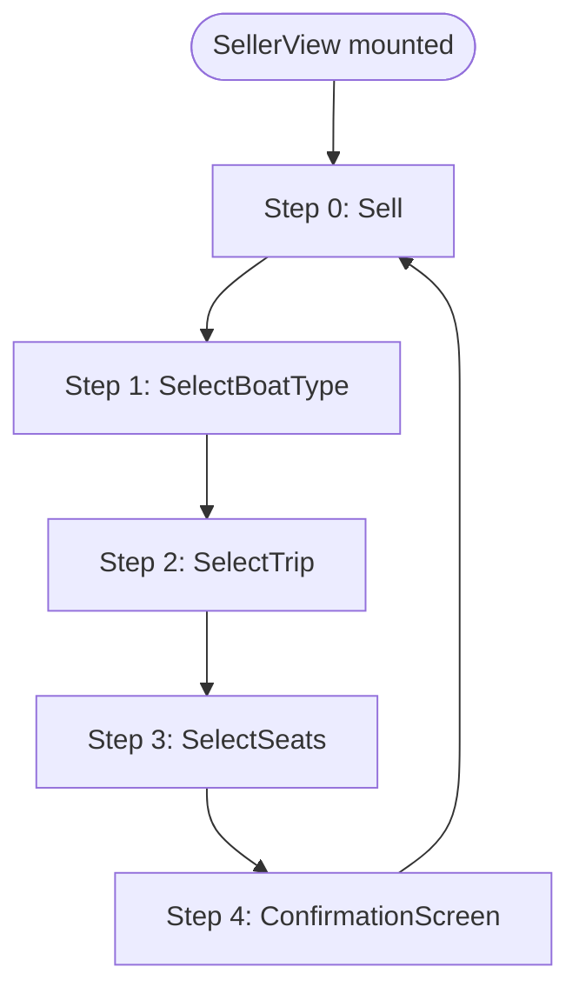
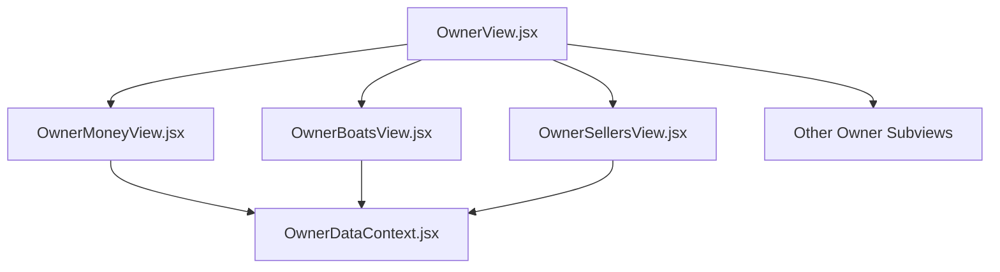
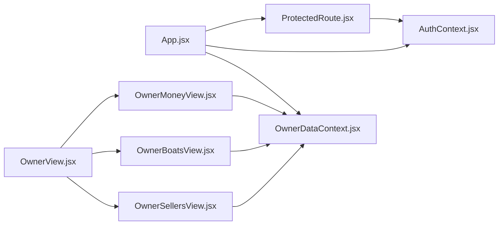

# Component Hierarchy

<cite>
**Referenced Files in This Document**
- [App.jsx](file://src/App.jsx)
- [main.jsx](file://src/main.jsx)
- [ProtectedRoute.jsx](file://src/components/ProtectedRoute.jsx)
- [AuthContext.jsx](file://src/contexts/AuthContext.jsx)
- [OwnerDataContext.jsx](file://src/contexts/OwnerDataContext.jsx)
- [AdminView.jsx](file://src/views/AdminView.jsx)
- [DispatcherView.jsx](file://src/views/DispatcherView.jsx)
- [SellerView.jsx](file://src/views/SellerView.jsx)
- [OwnerView.jsx](file://src/views/OwnerView.jsx)
- [OwnerMoneyView.jsx](file://src/views/OwnerMoneyView.jsx)
- [OwnerBoatsView.jsx](file://src/views/OwnerBoatsView.jsx)
- [OwnerSellersView.jsx](file://src/views/OwnerSellersView.jsx)
- [SellerHome.jsx](file://src/views/SellerHome.jsx)
- [LoginPage.jsx](file://src/views/LoginPage.jsx)
</cite>

## Table of Contents
1. [Introduction](#introduction)
2. [Project Structure](#project-structure)
3. [Core Components](#core-components)
4. [Architecture Overview](#architecture-overview)
5. [Detailed Component Analysis](#detailed-component-analysis)
6. [Dependency Analysis](#dependency-analysis)
7. [Performance Considerations](#performance-considerations)
8. [Troubleshooting Guide](#troubleshooting-guide)
9. [Conclusion](#conclusion)

## Introduction
This document explains the React component hierarchy and routing structure of the boat-ticket-app. It focuses on how role-specific views (SellerView, DispatcherView, AdminView, OwnerView) are organized under the main App component, how routing works with React Router DOM (including protected routes and role-based navigation), and how component composition manages state through context providers. It also documents the route configuration, role redirection mechanism, and provides component tree visualizations to clarify parent-child relationships.

## Project Structure
The application bootstraps inside a strict React environment with routing and authentication providers. The main entry point wraps the app with providers that supply authentication and owner data to the entire component tree.

**Diagram sources**
- [main.jsx](file://src/main.jsx#L15-L23)
- [App.jsx](file://src/App.jsx#L40-L136)
- [AuthContext.jsx](file://src/contexts/AuthContext.jsx#L19-L78)
- [OwnerDataContext.jsx](file://src/contexts/OwnerDataContext.jsx#L21-L128)

**Section sources**
- [main.jsx](file://src/main.jsx#L1-L26)
- [App.jsx](file://src/App.jsx#L1-L139)

## Core Components
- App.jsx: Defines the routing tree, protected routes, and role redirection logic.
- ProtectedRoute.jsx: Enforces role-based access control and handles owner exceptions.
- AuthContext.jsx: Provides authentication state and lifecycle (login/logout/getCurrentUser).
- OwnerDataContext.jsx: Provides owner-specific data caching and refresh orchestration.
- Role views: SellerView, DispatcherView, AdminView, OwnerView (and their subviews).

Key responsibilities:
- Routing: URL patterns, nested routes, and wildcard handling.
- Protection: Role checks and redirects for unauthorized access.
- Composition: Provider wrappers around views to share state.
- Redirection: Automatic routing to role-specific home pages.

**Section sources**
- [App.jsx](file://src/App.jsx#L24-L136)
- [ProtectedRoute.jsx](file://src/components/ProtectedRoute.jsx#L4-L35)
- [AuthContext.jsx](file://src/contexts/AuthContext.jsx#L19-L78)
- [OwnerDataContext.jsx](file://src/contexts/OwnerDataContext.jsx#L21-L128)

## Architecture Overview
The routing architecture centers on a single-page application with role-aware navigation. Authentication is global, while owner data is scoped to owner-related screens. ProtectedRoute enforces role permissions and allows owners special access to owner UI.

**Diagram sources**
- [App.jsx](file://src/App.jsx#L40-L136)
- [ProtectedRoute.jsx](file://src/components/ProtectedRoute.jsx#L4-L35)
- [OwnerView.jsx](file://src/views/OwnerView.jsx#L164-L194)
- [OwnerMoneyView.jsx](file://src/views/OwnerMoneyView.jsx#L54-L132)
- [OwnerBoatsView.jsx](file://src/views/OwnerBoatsView.jsx#L48-L91)
- [OwnerSellersView.jsx](file://src/views/OwnerSellersView.jsx#L48-L83)

## Detailed Component Analysis

### Role Redirection Mechanism
The application determines the user’s role and redirects them to their home page upon initial load or wildcard matches.

**Diagram sources**
- [App.jsx](file://src/App.jsx#L24-L38)
- [AuthContext.jsx](file://src/contexts/AuthContext.jsx#L19-L53)

**Section sources**
- [App.jsx](file://src/App.jsx#L24-L38)
- [AuthContext.jsx](file://src/contexts/AuthContext.jsx#L19-L53)

### Routing Patterns and Protected Routes
The routing configuration defines:
- Public routes: /login, /unauthorized
- Entry routes: / and * both delegate to RoleHomeRedirect
- Nested routes for each role:
  - /seller/*
  - /seller/home, /seller/earnings, /seller/media
  - /dispatcher/* and /dispatcher/shift-close
  - /admin/*
  - /owner-ui and /owner-ui/money (plus other owner subviews)

ProtectedRoute enforces role checks and allows owners special access to owner UI.

**Diagram sources**
- [App.jsx](file://src/App.jsx#L53-L84)
- [ProtectedRoute.jsx](file://src/components/ProtectedRoute.jsx#L4-L35)
- [AuthContext.jsx](file://src/contexts/AuthContext.jsx#L13-L17)

**Section sources**
- [App.jsx](file://src/App.jsx#L40-L136)
- [ProtectedRoute.jsx](file://src/components/ProtectedRoute.jsx#L4-L35)

### Component Composition and Context Providers
- App.jsx wraps the entire routing tree with OwnerDataProvider to enable owner data sharing across owner-related views.
- main.jsx wraps the app with AuthProvider to provide authentication state globally.
- ProtectedRoute.jsx composes with each role view to enforce role-based access.

**Diagram sources**
- [main.jsx](file://src/main.jsx#L15-L23)
- [App.jsx](file://src/App.jsx#L42-L135)

**Section sources**
- [main.jsx](file://src/main.jsx#L15-L23)
- [App.jsx](file://src/App.jsx#L42-L135)

### Role-Specific Views

#### SellerView
- Purpose: Ticket selling flow with multi-step wizard (type → trip → seats → confirm).
- State management: Uses local state for selection and navigation, integrates with OwnerDataContext for owner data refresh.
- Navigation: Exposes dedicated routes for home, earnings, media; nested route under /seller/*.

**Diagram sources**
- [SellerView.jsx](file://src/views/SellerView.jsx#L67-L73)
- [SellerView.jsx](file://src/views/SellerView.jsx#L234-L317)

**Section sources**
- [SellerView.jsx](file://src/views/SellerView.jsx#L37-L370)
- [SellerHome.jsx](file://src/views/SellerHome.jsx#L4-L67)

#### DispatcherView
- Purpose: Dispatcher dashboard for managing trips, selling tickets, slot management, and shift close.
- State management: Local filters and tabs; integrates with AuthContext for logout and navigation.

**Section sources**
- [DispatcherView.jsx](file://src/views/DispatcherView.jsx#L23-L291)

#### AdminView
- Purpose: Administrative dashboard with statistics, user management, and boat/zone controls.
- State management: Tabs, forms, and API-driven data fetching; integrates with AuthContext for logout and navigation.

**Section sources**
- [AdminView.jsx](file://src/views/AdminView.jsx#L10-L382)

#### OwnerView and Subviews
- Purpose: Owner UI shell with bottom navigation and multiple subviews (money, boats, sellers, motivation, settings, load, export).
- Data: OwnerMoneyView, OwnerBoatsView, OwnerSellersView consume OwnerDataContext for data refresh and polling.

**Diagram sources**
- [OwnerView.jsx](file://src/views/OwnerView.jsx#L164-L194)
- [OwnerMoneyView.jsx](file://src/views/OwnerMoneyView.jsx#L54-L132)
- [OwnerBoatsView.jsx](file://src/views/OwnerBoatsView.jsx#L48-L91)
- [OwnerSellersView.jsx](file://src/views/OwnerSellersView.jsx#L48-L83)
- [OwnerDataContext.jsx](file://src/contexts/OwnerDataContext.jsx#L21-L128)

**Section sources**
- [OwnerView.jsx](file://src/views/OwnerView.jsx#L164-L384)
- [OwnerMoneyView.jsx](file://src/views/OwnerMoneyView.jsx#L54-L526)
- [OwnerBoatsView.jsx](file://src/views/OwnerBoatsView.jsx#L48-L249)
- [OwnerSellersView.jsx](file://src/views/OwnerSellersView.jsx#L48-L222)

### Route Configuration Summary
- Public:
  - /login
  - /unauthorized
- Entry:
  - /
  - *
- Seller:
  - /seller/*
  - /seller/home
  - /seller/earnings
  - /seller/media
- Dispatcher:
  - /dispatcher/*
  - /dispatcher/shift-close
- Admin:
  - /admin/*
- Owner UI:
  - /owner-ui
  - /owner-ui/money

Nested route patterns:
- SellerView renders child components (SelectBoatType, SelectTrip, SelectSeats, ConfirmationScreen) based on step state.
- OwnerView renders subviews (OwnerMoneyView, OwnerBoatsView, OwnerSellersView, etc.) based on tab state.

**Section sources**
- [App.jsx](file://src/App.jsx#L40-L136)
- [SellerView.jsx](file://src/views/SellerView.jsx#L234-L317)
- [OwnerView.jsx](file://src/views/OwnerView.jsx#L164-L194)

## Dependency Analysis
- App.jsx depends on:
  - ProtectedRoute.jsx for role enforcement
  - AuthContext.jsx for user state
  - OwnerDataContext.jsx for owner data provider
  - Individual view components for rendering
- ProtectedRoute.jsx depends on:
  - AuthContext.jsx for current user and loading state
  - React Router DOM for navigation
- OwnerDataContext.jsx provides:
  - Data refresh orchestration and caching for owner-related screens
  - Callback registration for cross-component refresh coordination

**Diagram sources**
- [App.jsx](file://src/App.jsx#L40-L136)
- [ProtectedRoute.jsx](file://src/components/ProtectedRoute.jsx#L4-L35)
- [OwnerView.jsx](file://src/views/OwnerView.jsx#L164-L194)
- [OwnerMoneyView.jsx](file://src/views/OwnerMoneyView.jsx#L54-L132)
- [OwnerBoatsView.jsx](file://src/views/OwnerBoatsView.jsx#L48-L91)
- [OwnerSellersView.jsx](file://src/views/OwnerSellersView.jsx#L48-L83)
- [OwnerDataContext.jsx](file://src/contexts/OwnerDataContext.jsx#L21-L128)

**Section sources**
- [App.jsx](file://src/App.jsx#L1-L139)
- [ProtectedRoute.jsx](file://src/components/ProtectedRoute.jsx#L1-L38)
- [OwnerDataContext.jsx](file://src/contexts/OwnerDataContext.jsx#L1-L132)

## Performance Considerations
- OwnerDataContext implements per-day caching and stale checks to avoid redundant network requests and stale data.
- OwnerMoneyView uses polling only for the “today” preset and debounces refreshes to minimize API load.
- OwnerView’s bottom tabs avoid unnecessary re-renders by switching subviews via state.
- ProtectedRoute defers navigation until authentication resolves to prevent flicker.

[No sources needed since this section provides general guidance]

## Troubleshooting Guide
Common issues and resolutions:
- Unauthorized access: ProtectedRoute navigates unauthenticated users to /login and unauthorized roles to /unauthorized.
- Role mismatch: Ensure the user’s role matches the requiredRole prop passed to ProtectedRoute.
- Owner UI access: Owners can access owner UI regardless of the exact path due to special handling in ProtectedRoute.
- Login persistence: LoginPage stores recent logins and optional password remember preferences in localStorage.

**Section sources**
- [ProtectedRoute.jsx](file://src/components/ProtectedRoute.jsx#L4-L35)
- [LoginPage.jsx](file://src/views/LoginPage.jsx#L8-L159)

## Conclusion
The application employs a clean, role-centric routing architecture with strong separation of concerns:
- App.jsx orchestrates routing and role redirection.
- ProtectedRoute.jsx centralizes role-based access control.
- AuthContext.jsx and OwnerDataContext.jsx provide global and scoped state respectively.
- Role views encapsulate UI and business logic, with OwnerView serving as a shell for owner subviews.

This structure enables predictable navigation, robust protection, and scalable extension for additional roles or views.