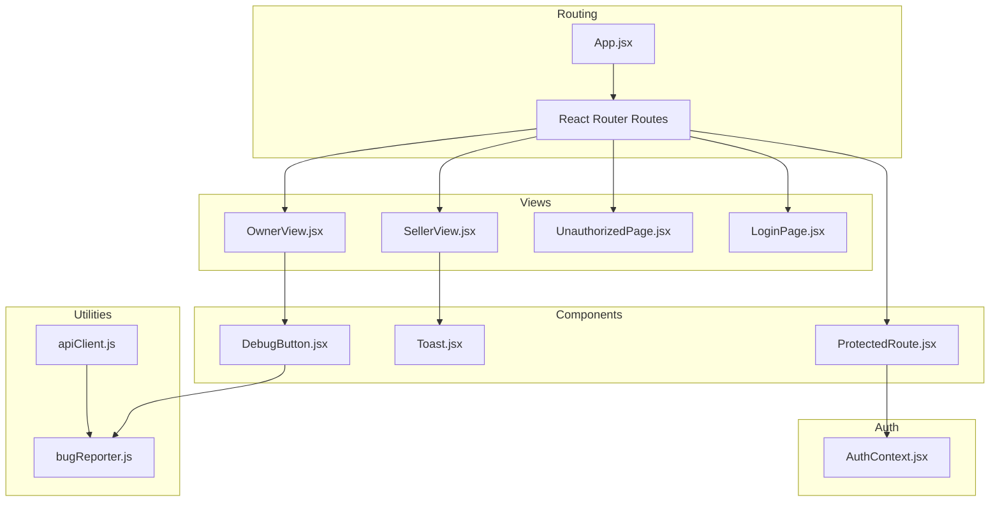
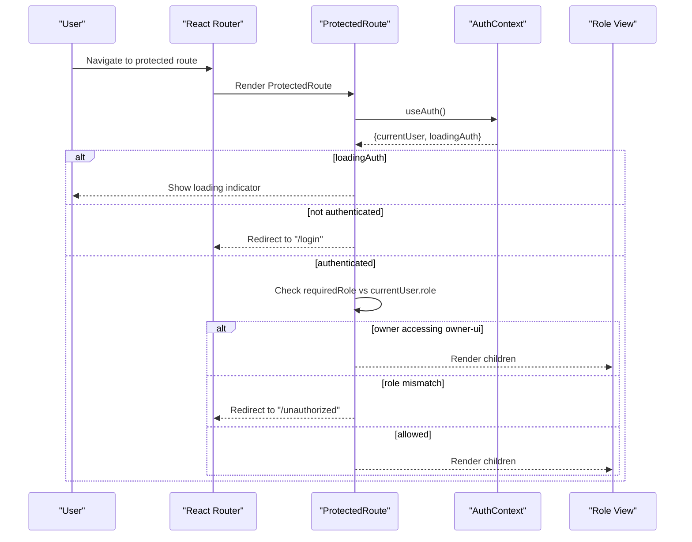
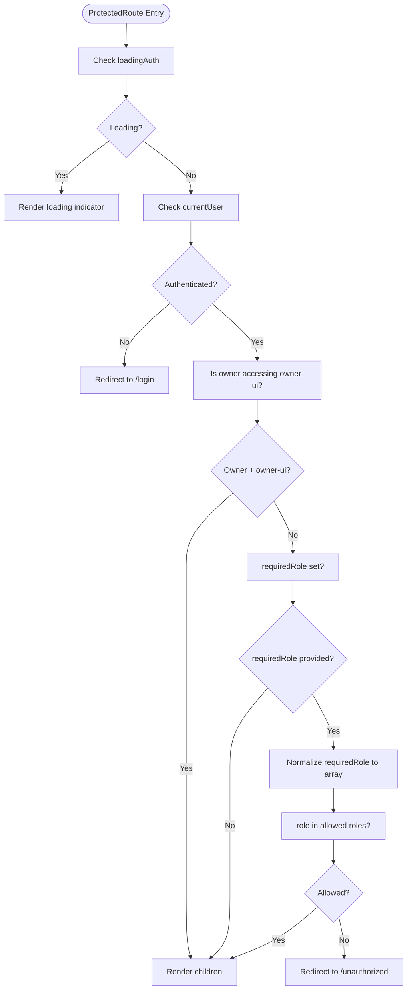
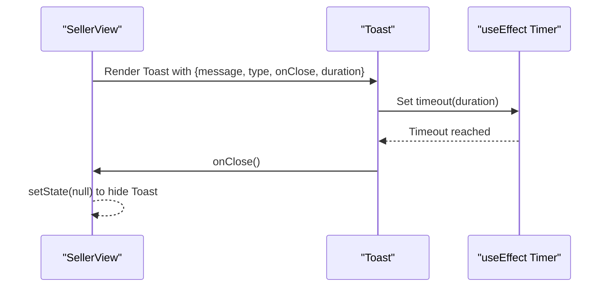
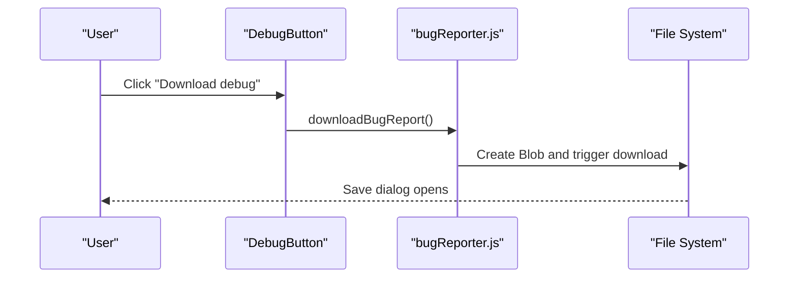
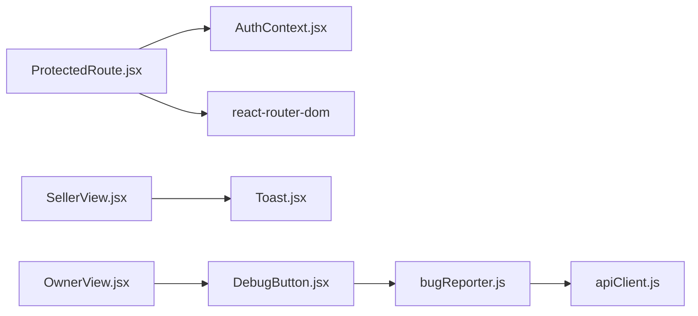

# Reusable Components

<cite>
**Referenced Files in This Document**
- [ProtectedRoute.jsx](file://src/components/ProtectedRoute.jsx)
- [Toast.jsx](file://src/components/Toast.jsx)
- [DebugButton.jsx](file://src/components/DebugButton.jsx)
- [AuthContext.jsx](file://src/contexts/AuthContext.jsx)
- [App.jsx](file://src/App.jsx)
- [bugReporter.js](file://src/utils/bugReporter.js)
- [apiClient.js](file://src/utils/apiClient.js)
- [UnauthorizedPage.jsx](file://src/views/UnauthorizedPage.jsx)
- [LoginPage.jsx](file://src/views/LoginPage.jsx)
- [SellerView.jsx](file://src/views/SellerView.jsx)
- [OwnerView.jsx](file://src/views/OwnerView.jsx)
- [index.css](file://src/index.css)
- [tailwind.config.js](file://tailwind.config.js)
</cite>

## Table of Contents
1. [Introduction](#introduction)
2. [Project Structure](#project-structure)
3. [Core Components](#core-components)
4. [Architecture Overview](#architecture-overview)
5. [Detailed Component Analysis](#detailed-component-analysis)
6. [Dependency Analysis](#dependency-analysis)
7. [Performance Considerations](#performance-considerations)
8. [Troubleshooting Guide](#troubleshooting-guide)
9. [Conclusion](#conclusion)
10. [Appendices](#appendices)

## Introduction
This document describes three reusable UI components used across roles in the application:
- ProtectedRoute: Enforces role-based access control for protected routes.
- Toast: Displays transient notifications and alerts with configurable styles and durations.
- DebugButton: Provides a quick way to download a structured bug report during development.

It explains component interfaces, event handling patterns, styling with Tailwind CSS, accessibility considerations, and integration examples within role-specific views.

## Project Structure
The reusable components live under src/components and are integrated into the routing and views under src/App.jsx and role-specific views such as src/views/SellerView.jsx and src/views/OwnerView.jsx. Authentication state is managed via src/contexts/AuthContext.jsx, and global styling is configured via src/index.css and Tailwind configuration in tailwind.config.js.

**Diagram sources**
- [App.jsx](file://src/App.jsx#L1-L139)
- [ProtectedRoute.jsx](file://src/components/ProtectedRoute.jsx#L1-L38)
- [Toast.jsx](file://src/components/Toast.jsx#L1-L42)
- [DebugButton.jsx](file://src/components/DebugButton.jsx#L1-L27)
- [AuthContext.jsx](file://src/contexts/AuthContext.jsx#L1-L79)
- [bugReporter.js](file://src/utils/bugReporter.js#L1-L55)
- [apiClient.js](file://src/utils/apiClient.js#L1-L360)
- [SellerView.jsx](file://src/views/SellerView.jsx#L1-L370)
- [OwnerView.jsx](file://src/views/OwnerView.jsx#L1-L384)
- [UnauthorizedPage.jsx](file://src/views/UnauthorizedPage.jsx#L1-L23)
- [LoginPage.jsx](file://src/views/LoginPage.jsx#L1-L159)

**Section sources**
- [App.jsx](file://src/App.jsx#L1-L139)
- [index.css](file://src/index.css#L1-L33)
- [tailwind.config.js](file://tailwind.config.js#L1-L12)

## Core Components
- ProtectedRoute: A route wrapper that checks authentication state, redirects unauthenticated users to the login page, enforces role-based access, and allows special-case handling for owner roles accessing owner UI.
- Toast: A transient notification component with type-based styling, automatic dismissal, and a close button.
- DebugButton: A fixed-position developer tool that triggers a structured bug report download.

Key integration points:
- ProtectedRoute is used inside App.jsx routes to protect role-specific paths.
- Toast is rendered conditionally in role-specific views (e.g., SellerView) and accepts props for message, type, and onClose.
- DebugButton is rendered at the application root level in App.jsx.

**Section sources**
- [ProtectedRoute.jsx](file://src/components/ProtectedRoute.jsx#L1-L38)
- [Toast.jsx](file://src/components/Toast.jsx#L1-L42)
- [DebugButton.jsx](file://src/components/DebugButton.jsx#L1-L27)
- [App.jsx](file://src/App.jsx#L1-L139)

## Architecture Overview
The reusable components participate in a layered architecture:
- Routing layer: App.jsx defines routes and wraps protected paths with ProtectedRoute.
- Authentication layer: AuthContext manages user session and exposes normalized role information.
- UI layer: Views render role-specific content and compose reusable components like Toast and DebugButton.
- Utilities layer: bugReporter.js captures runtime diagnostics and apiClient.js centralizes API requests and logging.

**Diagram sources**
- [App.jsx](file://src/App.jsx#L40-L135)
- [ProtectedRoute.jsx](file://src/components/ProtectedRoute.jsx#L4-L35)
- [AuthContext.jsx](file://src/contexts/AuthContext.jsx#L13-L78)

## Detailed Component Analysis

### ProtectedRoute
Purpose:
- Guard routes by enforcing authentication and role-based access control.
- Provide special handling for owner role accessing owner UI.

Props:
- children: Element to render if access is granted.
- requiredRole: String or array of strings representing allowed roles.

Behavior:
- If authentication is still loading, renders a loading indicator.
- If not authenticated, redirects to the login page.
- Applies special rule: owners can access owner UI regardless of the requiredRole.
- Otherwise, checks if the user’s role matches the requiredRole (supports single role or multiple roles).
- If access is denied, redirects to the unauthorized page.

Accessibility and UX:
- Uses programmatic navigation via react-router-dom to maintain SPA behavior.
- No keyboard traps; relies on standard browser navigation.

Styling:
- Rendering a simple loading message; no Tailwind classes applied here.

Integration examples:
- Used in App.jsx to wrap role-specific views (seller, dispatcher, admin, owner-ui).

**Diagram sources**
- [ProtectedRoute.jsx](file://src/components/ProtectedRoute.jsx#L4-L35)

**Section sources**
- [ProtectedRoute.jsx](file://src/components/ProtectedRoute.jsx#L1-L38)
- [App.jsx](file://src/App.jsx#L52-L130)
- [UnauthorizedPage.jsx](file://src/views/UnauthorizedPage.jsx#L1-L23)
- [LoginPage.jsx](file://src/views/LoginPage.jsx#L1-L159)

### Toast
Purpose:
- Display transient notifications with type-specific styling and an optional close action.

Props:
- message: Text to display.
- type: One of info, success, error, warning (default info).
- onClose: Callback invoked when the toast should be dismissed.
- duration: Milliseconds before automatic dismissal (default 3000).

Event handling:
- Uses useEffect to schedule automatic dismissal.
- Close button triggers onClose.

Styling:
- Uses Tailwind utility classes for positioning, color, padding, rounded corners, and shadow.
- Color determined by type via a helper that maps type to a background color class.

Accessibility:
- Close button is focusable and uses visible focus styles.
- No auto-focus behavior; relies on user interaction.

Integration examples:
- SellerView composes Toast to show feedback after creating a presale.

**Diagram sources**
- [Toast.jsx](file://src/components/Toast.jsx#L3-L10)
- [SellerView.jsx](file://src/views/SellerView.jsx#L358-L364)

**Section sources**
- [Toast.jsx](file://src/components/Toast.jsx#L1-L42)
- [SellerView.jsx](file://src/views/SellerView.jsx#L150-L170)

### DebugButton
Purpose:
- Provide a developer shortcut to download a structured bug report.

Behavior:
- Click handler invokes downloadBugReport from bugReporter.js.
- Fixed positioning near the top-right corner with high z-index.

Styling:
- Inline styles define position, padding, font size, background, color, border radius, and opacity.
- Positioned fixed with absolute coordinates.

Accessibility:
- Button is visible and clickable; consider adding an aria-label for screen readers.

Integration examples:
- Rendered at the root of App.jsx alongside routes.

**Diagram sources**
- [DebugButton.jsx](file://src/components/DebugButton.jsx#L4-L23)
- [bugReporter.js](file://src/utils/bugReporter.js#L45-L54)

**Section sources**
- [DebugButton.jsx](file://src/components/DebugButton.jsx#L1-L27)
- [App.jsx](file://src/App.jsx#L133-L133)
- [bugReporter.js](file://src/utils/bugReporter.js#L1-L55)

## Dependency Analysis
- ProtectedRoute depends on:
  - AuthContext for currentUser and loadingAuth.
  - React Router for navigation.
- Toast depends on:
  - React lifecycle hooks for timing.
  - Tailwind classes for styling.
- DebugButton depends on:
  - bugReporter.js for capturing and exporting diagnostics.
  - apiClient.js indirectly through network logging.

**Diagram sources**
- [ProtectedRoute.jsx](file://src/components/ProtectedRoute.jsx#L1-L2)
- [AuthContext.jsx](file://src/contexts/AuthContext.jsx#L1-L17)
- [App.jsx](file://src/App.jsx#L1-L4)
- [SellerView.jsx](file://src/views/SellerView.jsx#L1-L11)
- [OwnerView.jsx](file://src/views/OwnerView.jsx#L1-L12)
- [DebugButton.jsx](file://src/components/DebugButton.jsx#L1-L2)
- [bugReporter.js](file://src/utils/bugReporter.js#L1-L55)
- [apiClient.js](file://src/utils/apiClient.js#L1-L360)

**Section sources**
- [ProtectedRoute.jsx](file://src/components/ProtectedRoute.jsx#L1-L38)
- [AuthContext.jsx](file://src/contexts/AuthContext.jsx#L1-L79)
- [App.jsx](file://src/App.jsx#L1-L139)
- [SellerView.jsx](file://src/views/SellerView.jsx#L1-L370)
- [OwnerView.jsx](file://src/views/OwnerView.jsx#L1-L384)
- [DebugButton.jsx](file://src/components/DebugButton.jsx#L1-L27)
- [bugReporter.js](file://src/utils/bugReporter.js#L1-L55)
- [apiClient.js](file://src/utils/apiClient.js#L1-L360)

## Performance Considerations
- ProtectedRoute: Minimal overhead; uses shallow checks and early returns. Avoid heavy computations in guards.
- Toast: Lightweight component; ensure onClose clears references promptly to allow garbage collection.
- DebugButton: No runtime cost except click handler; bug report generation occurs on demand.

## Troubleshooting Guide
Common issues and resolutions:
- ProtectedRoute redirects to login unexpectedly:
  - Verify AuthContext.currentUser is populated after login.
  - Check that tokens are persisted and apiClient attaches Authorization headers.
- Access denied to owner-ui:
  - Confirm the user role is normalized to lowercase and equals "owner".
  - Ensure the route path starts with "/owner" to match the special rule.
- Toast does not dismiss:
  - Ensure duration is a positive number and onClose is passed correctly.
  - Confirm the parent removes the toast state after onClose.
- DebugButton does nothing:
  - Ensure downloadBugReport is imported and that the DOM supports anchor downloads.
  - Verify bugReporter.js is initialized and network logs are being captured.

**Section sources**
- [AuthContext.jsx](file://src/contexts/AuthContext.jsx#L6-L11)
- [ProtectedRoute.jsx](file://src/components/ProtectedRoute.jsx#L18-L21)
- [Toast.jsx](file://src/components/Toast.jsx#L3-L10)
- [DebugButton.jsx](file://src/components/DebugButton.jsx#L4-L23)
- [bugReporter.js](file://src/utils/bugReporter.js#L45-L54)
- [apiClient.js](file://src/utils/apiClient.js#L23-L88)

## Conclusion
These reusable components form the backbone of the application’s security, communication, and developer experience:
- ProtectedRoute ensures secure access to role-specific areas.
- Toast provides consistent, accessible feedback.
- DebugButton streamlines diagnostics during development.

They integrate cleanly with the existing routing and context layers, leveraging Tailwind for styling and React best practices for composition.

## Appendices

### Component Prop Interfaces
- ProtectedRoute
  - requiredRole: string | string[]
  - children: ReactNode
- Toast
  - message: string
  - type: "info" | "success" | "error" | "warning"
  - onClose: () => void
  - duration: number
- DebugButton
  - None (no props)

**Section sources**
- [ProtectedRoute.jsx](file://src/components/ProtectedRoute.jsx#L4-L5)
- [Toast.jsx](file://src/components/Toast.jsx#L3-L3)
- [DebugButton.jsx](file://src/components/DebugButton.jsx#L4-L4)

### Styling Approach with Tailwind CSS
- Global baseline and utilities are included via src/index.css.
- Tailwind content configuration scans the entire src directory.
- Components apply utility classes directly for layout, colors, spacing, and shadows.

**Section sources**
- [index.css](file://src/index.css#L1-L33)
- [tailwind.config.js](file://tailwind.config.js#L1-L12)
- [Toast.jsx](file://src/components/Toast.jsx#L25-L38)

### Accessibility Considerations
- Toast close button is focusable and styled for visibility.
- ProtectedRoute relies on standard navigation; ensure focus returns appropriately after redirects.
- DebugButton should include an aria-label for screen reader support.

**Section sources**
- [Toast.jsx](file://src/components/Toast.jsx#L29-L36)

### Integration Examples
- ProtectedRoute in App.jsx:
  - Wraps role-specific routes with requiredRole.
  - Special-case for owner accessing owner-ui.
- Toast in SellerView:
  - Conditionally renders based on local state.
  - Calls onClose to dismiss.
- DebugButton in App.jsx:
  - Rendered at the root to be accessible from any view.

**Section sources**
- [App.jsx](file://src/App.jsx#L52-L130)
- [SellerView.jsx](file://src/views/SellerView.jsx#L358-L364)
- [OwnerView.jsx](file://src/views/OwnerView.jsx#L164-L194)
- [DebugButton.jsx](file://src/components/DebugButton.jsx#L4-L23)