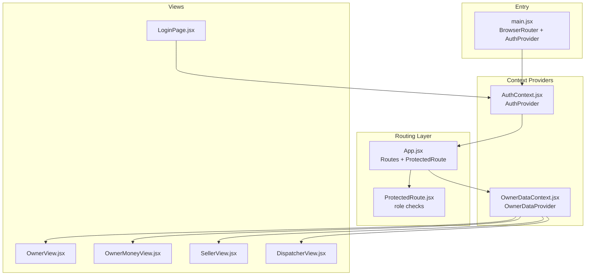
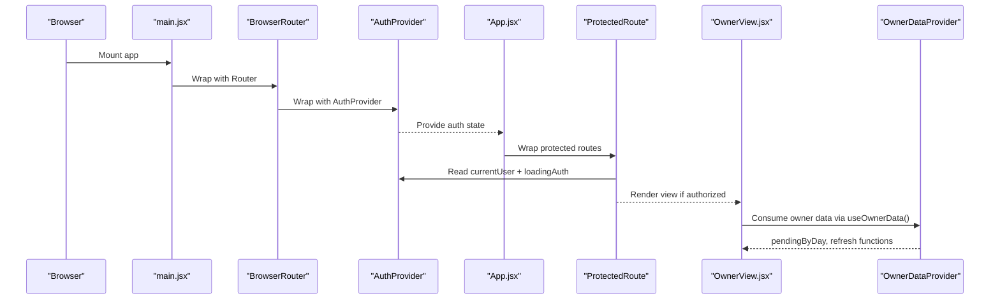
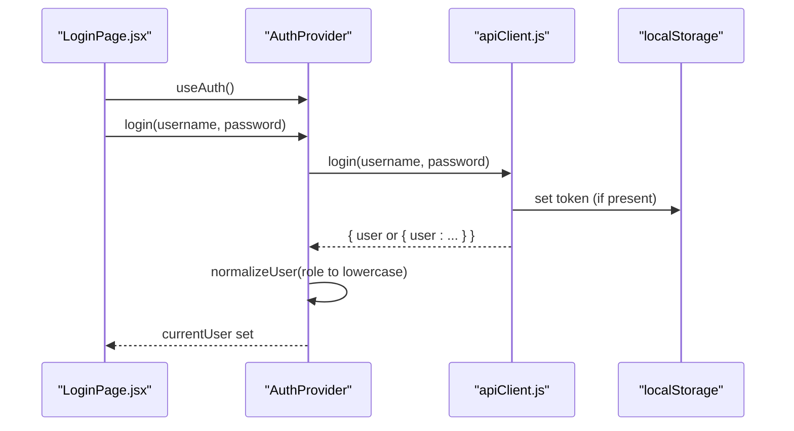
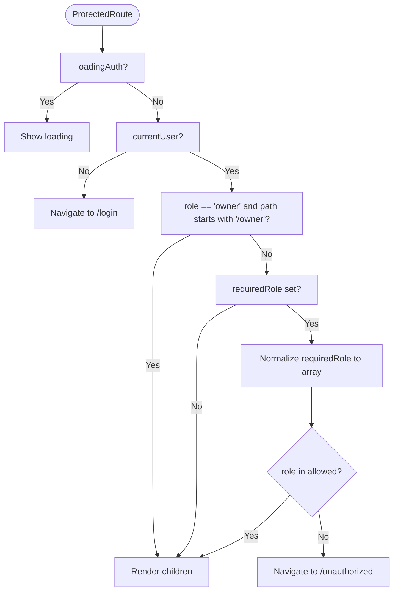
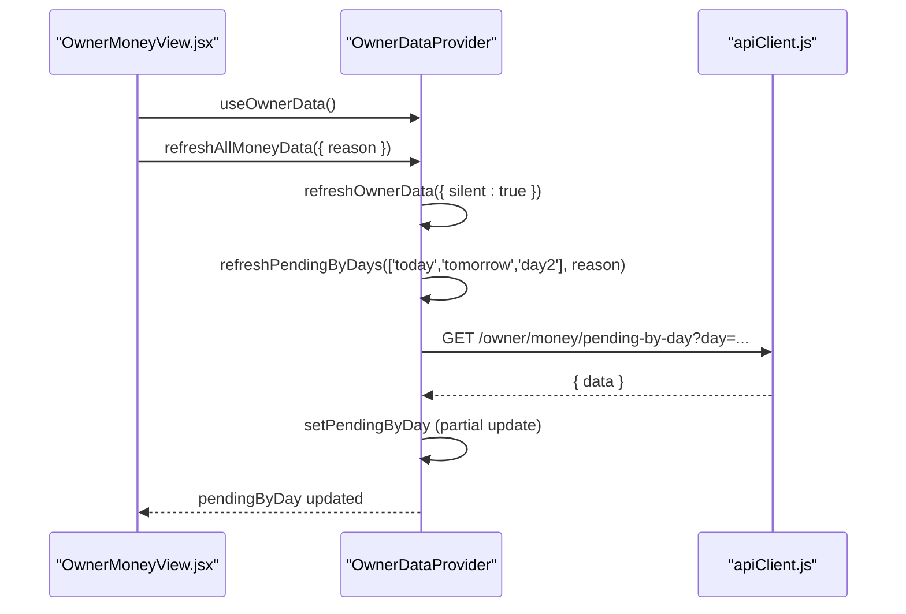
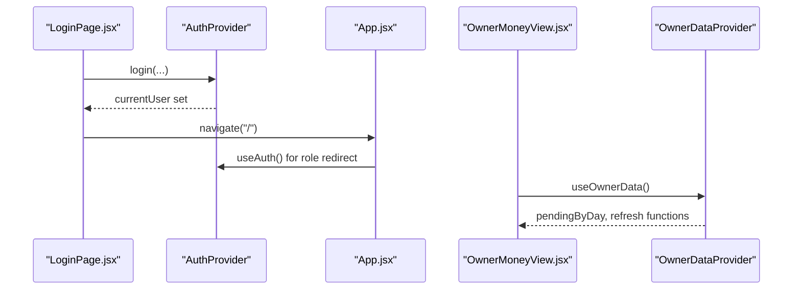
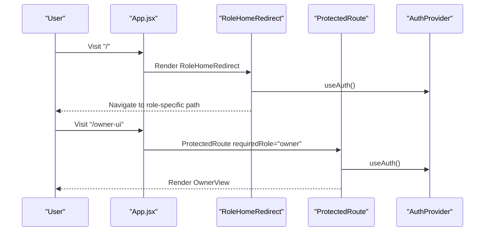
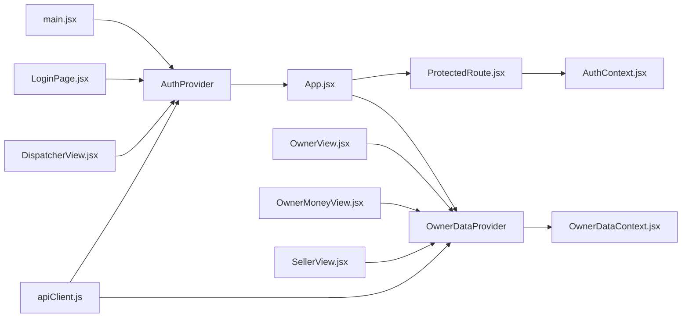

# State Management

<cite>
**Referenced Files in This Document**
- [AuthContext.jsx](file://src/contexts/AuthContext.jsx)
- [OwnerDataContext.jsx](file://src/contexts/OwnerDataContext.jsx)
- [main.jsx](file://src/main.jsx)
- [App.jsx](file://src/App.jsx)
- [ProtectedRoute.jsx](file://src/components/ProtectedRoute.jsx)
- [apiClient.js](file://src/utils/apiClient.js)
- [LoginPage.jsx](file://src/views/LoginPage.jsx)
- [OwnerView.jsx](file://src/views/OwnerView.jsx)
- [OwnerMoneyView.jsx](file://src/views/OwnerMoneyView.jsx)
- [SellerView.jsx](file://src/views/SellerView.jsx)
- [DispatcherView.jsx](file://src/views/DispatcherView.jsx)
- [package.json](file://package.json)
</cite>

## Table of Contents
1. [Introduction](#introduction)
2. [Project Structure](#project-structure)
3. [Core Components](#core-components)
4. [Architecture Overview](#architecture-overview)
5. [Detailed Component Analysis](#detailed-component-analysis)
6. [Dependency Analysis](#dependency-analysis)
7. [Performance Considerations](#performance-considerations)
8. [Troubleshooting Guide](#troubleshooting-guide)
9. [Conclusion](#conclusion)
10. [Appendices](#appendices)

## Introduction
This document explains the React state management architecture using the Context API in the boat ticket application. It focuses on:
- Authentication state management via AuthContext, including user authentication flow, JWT token handling, and role-based access control
- Global state management via OwnerDataProvider for owner-related data
- How providers wrap the application and how components consume context
- Patterns for updating state, subscribing to changes, and protecting routes
- Practical examples of provider implementation, consumer usage, and state mutation handling
- Integration between authentication state and routing protection
- State persistence, re-render optimization, and best practices for context usage in large applications

## Project Structure
The application initializes providers at the root and organizes routing and role-based access control centrally. Providers are declared in the entry file and consumed by views and route guards.

**Diagram sources**
- [main.jsx](file://src/main.jsx#L15-L23)
- [App.jsx](file://src/App.jsx#L40-L136)
- [ProtectedRoute.jsx](file://src/components/ProtectedRoute.jsx#L4-L35)
- [AuthContext.jsx](file://src/contexts/AuthContext.jsx#L19-L78)
- [OwnerDataContext.jsx](file://src/contexts/OwnerDataContext.jsx#L21-L128)
- [LoginPage.jsx](file://src/views/LoginPage.jsx#L8-L83)
- [OwnerView.jsx](file://src/views/OwnerView.jsx#L164-L194)
- [OwnerMoneyView.jsx](file://src/views/OwnerMoneyView.jsx#L54-L200)
- [SellerView.jsx](file://src/views/SellerView.jsx#L37-L370)
- [DispatcherView.jsx](file://src/views/DispatcherView.jsx#L23-L291)

**Section sources**
- [main.jsx](file://src/main.jsx#L15-L23)
- [App.jsx](file://src/App.jsx#L40-L136)

## Core Components
- AuthContext: Centralizes authentication state, login/logout, and role normalization. Provides a hook for consuming context safely.
- OwnerDataProvider: Centralizes owner-related data fetching and refresh orchestration with per-day pending data and callbacks for coordinated refreshes.
- ProtectedRoute: Enforces role-based access control and redirects unauthenticated or unauthorized users.
- apiClient: Encapsulates HTTP requests, token handling, and response normalization.

Key responsibilities:
- AuthContext manages currentUser, loadingAuth, login, logout, and exposes normalized roles.
- OwnerDataProvider manages pendingByDay, pendingLoading, and refresh orchestration across owner screens.
- ProtectedRoute consumes AuthContext to enforce access rules and redirect behavior.
- apiClient handles Authorization headers, token storage, and request/response normalization.

**Section sources**
- [AuthContext.jsx](file://src/contexts/AuthContext.jsx#L13-L78)
- [OwnerDataContext.jsx](file://src/contexts/OwnerDataContext.jsx#L21-L128)
- [ProtectedRoute.jsx](file://src/components/ProtectedRoute.jsx#L4-L35)
- [apiClient.js](file://src/utils/apiClient.js#L15-L103)

## Architecture Overview
The app composes providers at the root and uses route guards to protect areas by role. Views consume context hooks to access state and trigger mutations.

**Diagram sources**
- [main.jsx](file://src/main.jsx#L15-L23)
- [App.jsx](file://src/App.jsx#L40-L136)
- [ProtectedRoute.jsx](file://src/components/ProtectedRoute.jsx#L4-L35)
- [OwnerView.jsx](file://src/views/OwnerView.jsx#L164-L194)
- [OwnerDataContext.jsx](file://src/contexts/OwnerDataContext.jsx#L21-L128)

## Detailed Component Analysis

### Authentication State Management with AuthContext
AuthContext centralizes authentication state and exposes a hook for safe consumption. It normalizes user roles to lowercase and integrates with apiClient for login/logout and token handling.

- Initialization and hydration:
  - On mount, reads token from local storage and validates via getCurrentUser
  - Normalizes user role to lowercase
  - Handles errors by logging out and clearing state
- Login/logout:
  - login delegates to apiClient.login and sets normalized user
  - logout delegates to apiClient.logout and clears state
- Hook usage:
  - useAuth throws if used outside AuthProvider
  - Consumers receive currentUser, login, logout, loadingAuth

**Diagram sources**
- [LoginPage.jsx](file://src/views/LoginPage.jsx#L56-L79)
- [AuthContext.jsx](file://src/contexts/AuthContext.jsx#L55-L68)
- [apiClient.js](file://src/utils/apiClient.js#L91-L103)

**Section sources**
- [AuthContext.jsx](file://src/contexts/AuthContext.jsx#L19-L78)
- [apiClient.js](file://src/utils/apiClient.js#L91-L103)
- [LoginPage.jsx](file://src/views/LoginPage.jsx#L56-L79)

### Role-Based Access Control with ProtectedRoute
ProtectedRoute enforces role-based access control:
- Blocks navigation while loadingAuth
- Redirects to login if no currentUser
- Allows owner to access owner-related routes regardless of route-required role
- Validates requiredRole against currentUser.role

**Diagram sources**
- [ProtectedRoute.jsx](file://src/components/ProtectedRoute.jsx#L4-L35)

**Section sources**
- [ProtectedRoute.jsx](file://src/components/ProtectedRoute.jsx#L4-L35)
- [App.jsx](file://src/App.jsx#L24-L38)

### OwnerDataProvider for Global State Management
OwnerDataProvider orchestrates owner-related data fetching and refresh coordination:
- pendingByDay: per-day pending data cache
- pendingLoading: loading indicator for pending data
- fetchPendingForDay: single-day fetch with stale-check via request IDs
- refreshPendingByDays: multi-day refresh with deduplication and partial updates
- registerRefreshCallback: allows external components to register refresh handlers
- refreshOwnerData: invokes registered callback (e.g., OwnerMoneyView)
- refreshAllMoneyData: coordinated refresh of summary, boats, compare, and pending

**Diagram sources**
- [OwnerMoneyView.jsx](file://src/views/OwnerMoneyView.jsx#L134-L146)
- [OwnerDataContext.jsx](file://src/contexts/OwnerDataContext.jsx#L52-L90)
- [OwnerDataContext.jsx](file://src/contexts/OwnerDataContext.jsx#L106-L112)
- [apiClient.js](file://src/utils/apiClient.js#L23-L88)

**Section sources**
- [OwnerDataContext.jsx](file://src/contexts/OwnerDataContext.jsx#L21-L128)
- [OwnerMoneyView.jsx](file://src/views/OwnerMoneyView.jsx#L54-L200)

### Context Consumption Patterns and State Mutation
- AuthContext consumers:
  - LoginPage uses useAuth to call login and navigate on success
  - OwnerView uses useAuth to log out and redirect
  - DispatcherView uses useAuth to redirect when unauthenticated
- OwnerDataProvider consumers:
  - OwnerView uses useOwnerData to switch tabs and render child views
  - OwnerMoneyView uses useOwnerData to read pendingByDay and call refresh functions
  - SellerView uses useOwnerData to notify owner dashboard after creating a presale

**Diagram sources**
- [LoginPage.jsx](file://src/views/LoginPage.jsx#L56-L79)
- [App.jsx](file://src/App.jsx#L24-L38)
- [OwnerMoneyView.jsx](file://src/views/OwnerMoneyView.jsx#L54-L132)
- [OwnerDataContext.jsx](file://src/contexts/OwnerDataContext.jsx#L114-L121)

**Section sources**
- [LoginPage.jsx](file://src/views/LoginPage.jsx#L8-L83)
- [OwnerView.jsx](file://src/views/OwnerView.jsx#L164-L194)
- [SellerView.jsx](file://src/views/SellerView.jsx#L150-L170)
- [OwnerMoneyView.jsx](file://src/views/OwnerMoneyView.jsx#L54-L200)

### Integration Between Authentication State and Routing Protection
- App.jsx defines role-based routes and uses ProtectedRoute to enforce access
- RoleHomeRedirect uses useAuth to redirect users to role-specific home pages
- ProtectedRoute uses useAuth to enforce requiredRole and owner exceptions

**Diagram sources**
- [App.jsx](file://src/App.jsx#L24-L38)
- [App.jsx](file://src/App.jsx#L115-L130)
- [ProtectedRoute.jsx](file://src/components/ProtectedRoute.jsx#L4-L35)
- [AuthContext.jsx](file://src/contexts/AuthContext.jsx#L13-L17)

**Section sources**
- [App.jsx](file://src/App.jsx#L24-L38)
- [App.jsx](file://src/App.jsx#L115-L130)
- [ProtectedRoute.jsx](file://src/components/ProtectedRoute.jsx#L4-L35)

## Dependency Analysis
Providers and consumers form a layered dependency graph:
- main.jsx depends on AuthProvider
- App.jsx depends on AuthProvider and OwnerDataProvider
- ProtectedRoute depends on AuthContext
- Views depend on both AuthContext and OwnerDataProvider
- apiClient is a shared dependency for token handling and HTTP requests

**Diagram sources**
- [main.jsx](file://src/main.jsx#L15-L23)
- [App.jsx](file://src/App.jsx#L40-L136)
- [ProtectedRoute.jsx](file://src/components/ProtectedRoute.jsx#L4-L35)
- [AuthContext.jsx](file://src/contexts/AuthContext.jsx#L19-L78)
- [OwnerDataContext.jsx](file://src/contexts/OwnerDataContext.jsx#L21-L128)
- [apiClient.js](file://src/utils/apiClient.js#L15-L103)

**Section sources**
- [package.json](file://package.json#L15-L24)

## Performance Considerations
- Minimize re-renders:
  - Use useCallback for functions passed to consumers (e.g., refreshPendingByDays, refreshAllMoneyData)
  - Use useMemo for derived values (e.g., presets in OwnerMoneyView)
- Avoid unnecessary provider wrapping:
  - Keep providers near the root to reduce context churn
- Debounce or throttle frequent updates:
  - OwnerMoneyView polls every 20 seconds only when preset is "today"
- Stale data prevention:
  - OwnerDataProvider uses per-day request IDs to prevent stale updates
- Token handling:
  - apiClient reads tokens from localStorage and sets Authorization header automatically

[No sources needed since this section provides general guidance]

## Troubleshooting Guide
Common issues and resolutions:
- useAuth used outside AuthProvider:
  - Symptom: Error thrown when calling useAuth
  - Fix: Ensure component is rendered inside AuthProvider
- Unhandled token errors:
  - Symptom: AuthContext clears user on invalid token
  - Fix: Verify token presence and validity; ensure apiClient.logout clears token
- ProtectedRoute redirect loops:
  - Symptom: Navigations to /login or /unauthorized fail to settle
  - Fix: Ensure requiredRole matches user role; confirm owner exceptions for /owner paths
- Owner data not refreshing:
  - Symptom: pendingByDay does not update
  - Fix: Call refreshPendingByDays with valid days; ensure registerRefreshCallback is invoked

**Section sources**
- [AuthContext.jsx](file://src/contexts/AuthContext.jsx#L13-L17)
- [AuthContext.jsx](file://src/contexts/AuthContext.jsx#L42-L47)
- [ProtectedRoute.jsx](file://src/components/ProtectedRoute.jsx#L18-L32)
- [OwnerDataContext.jsx](file://src/contexts/OwnerDataContext.jsx#L37-L49)
- [OwnerDataContext.jsx](file://src/contexts/OwnerDataContext.jsx#L92-L103)

## Conclusion
The application uses a clean, layered Context API architecture:
- AuthContext centralizes authentication state and integrates with apiClient for token handling
- OwnerDataProvider coordinates owner data fetching and refreshes with robust stale-check mechanisms
- ProtectedRoute enforces role-based access control consistently across routes
- Views consume context hooks to access state and trigger mutations, enabling a scalable and predictable state model

[No sources needed since this section summarizes without analyzing specific files]

## Appendices

### Practical Examples Index
- Provider implementation:
  - AuthProvider in [AuthContext.jsx](file://src/contexts/AuthContext.jsx#L19-L78)
  - OwnerDataProvider in [OwnerDataContext.jsx](file://src/contexts/OwnerDataContext.jsx#L21-L128)
- Consumer usage patterns:
  - LoginPage uses useAuth to login in [LoginPage.jsx](file://src/views/LoginPage.jsx#L56-L79)
  - OwnerView uses useAuth to logout in [OwnerView.jsx](file://src/views/OwnerView.jsx#L164-L194)
  - OwnerMoneyView uses useOwnerData to read pending data in [OwnerMoneyView.jsx](file://src/views/OwnerMoneyView.jsx#L54-L132)
  - SellerView uses useOwnerData to notify owner dashboard in [SellerView.jsx](file://src/views/SellerView.jsx#L150-L170)
- State mutation handling:
  - AuthContext login/logout in [AuthContext.jsx](file://src/contexts/AuthContext.jsx#L55-L68)
  - OwnerDataProvider refresh functions in [OwnerDataContext.jsx](file://src/contexts/OwnerDataContext.jsx#L52-L112)

[No sources needed since this section indexes examples without analyzing specific files]