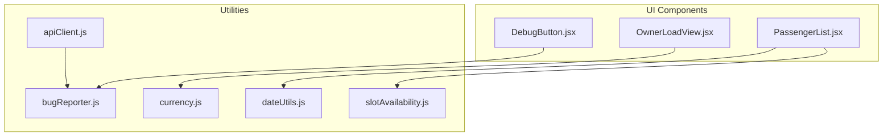
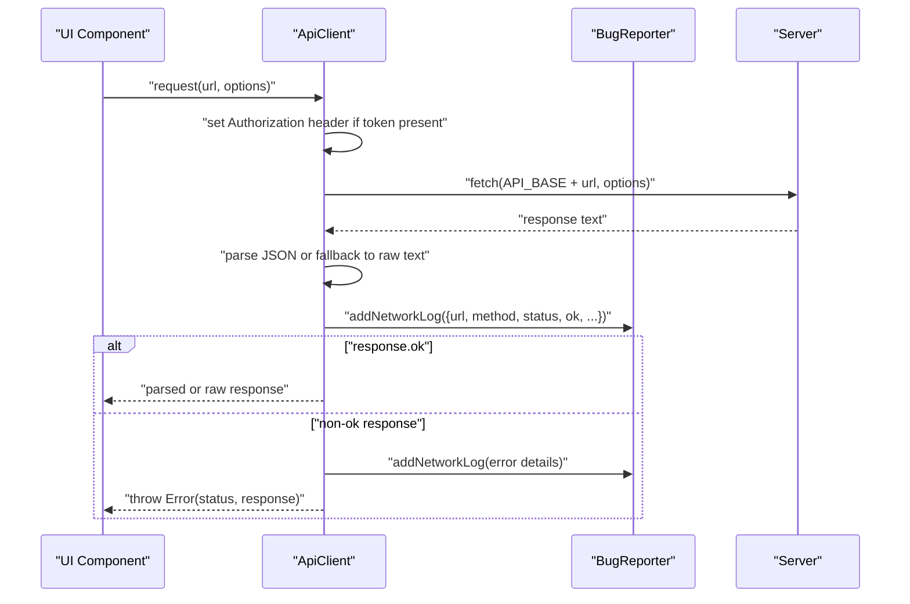
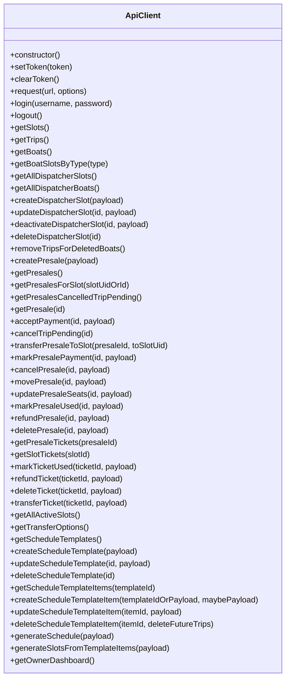
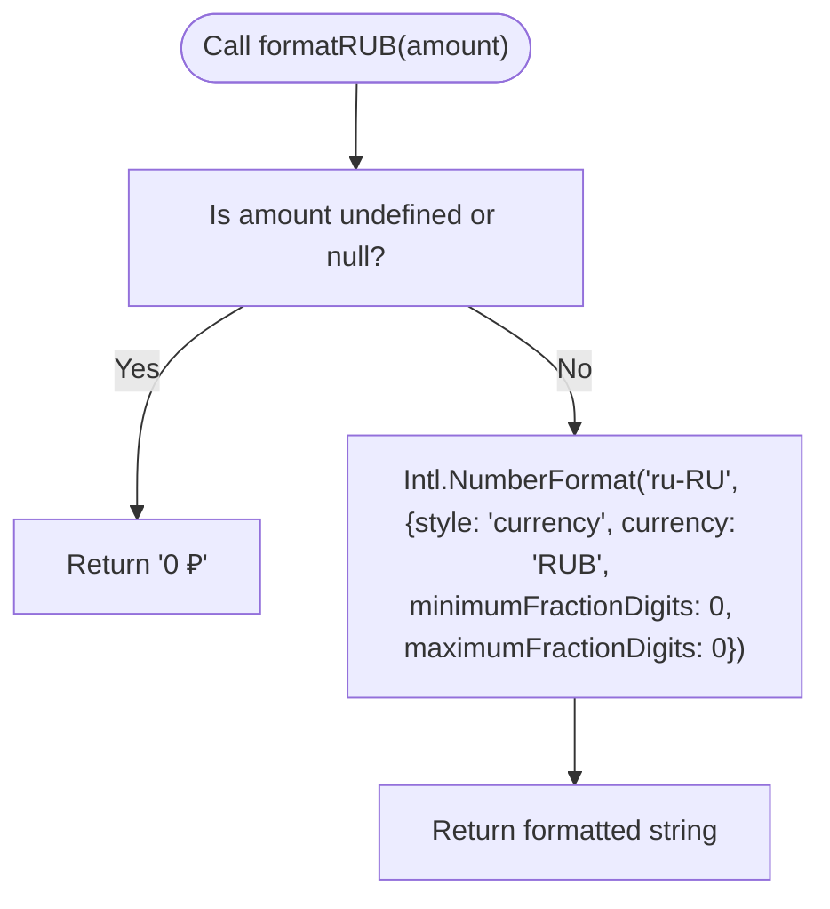
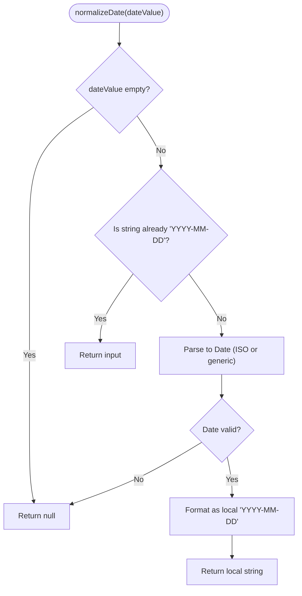
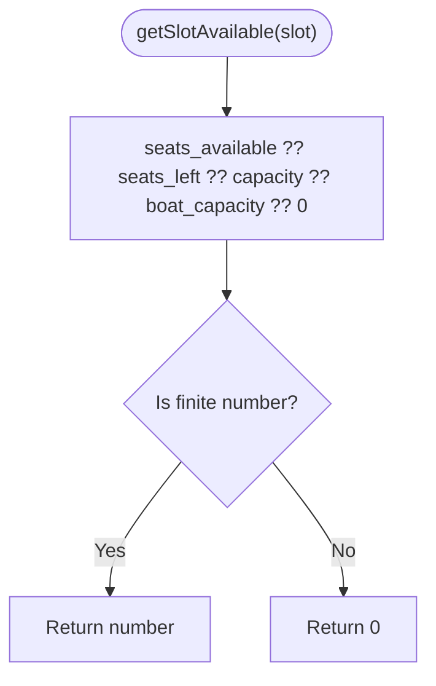
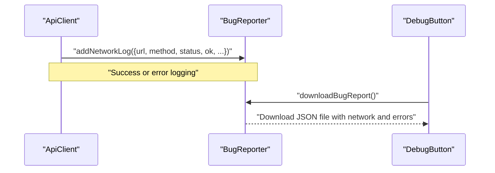
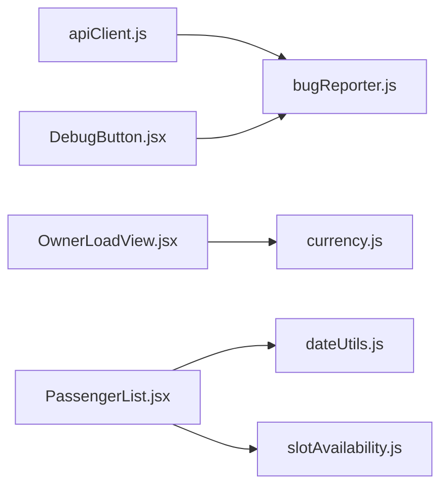

# Utility Functions

<cite>
**Referenced Files in This Document**
- [apiClient.js](file://src/utils/apiClient.js)
- [bugReporter.js](file://src/utils/bugReporter.js)
- [currency.js](file://src/utils/currency.js)
- [dateUtils.js](file://src/utils/dateUtils.js)
- [slotAvailability.js](file://src/utils/slotAvailability.js)
- [DebugButton.jsx](file://src/components/DebugButton.jsx)
- [OwnerLoadView.jsx](file://src/views/OwnerLoadView.jsx)
- [PassengerList.jsx](file://src/components/dispatcher/PassengerList.jsx)
</cite>

## Table of Contents
1. [Introduction](#introduction)
2. [Project Structure](#project-structure)
3. [Core Components](#core-components)
4. [Architecture Overview](#architecture-overview)
5. [Detailed Component Analysis](#detailed-component-analysis)
6. [Dependency Analysis](#dependency-analysis)
7. [Performance Considerations](#performance-considerations)
8. [Troubleshooting Guide](#troubleshooting-guide)
9. [Conclusion](#conclusion)

## Introduction
This document provides comprehensive documentation for the utility functions and helper modules that support the application’s functionality. It focuses on:
- HTTP client for API communication, authentication headers, error handling, and request patterns
- Currency formatting utilities for price display
- Date utilities for parsing, formatting, timezone handling, and business-day helpers
- Seat availability utilities for capacity management and booking validation
- Bug reporter utility for error logging and debugging support

The goal is to explain function signatures, parameters, return values, error handling strategies, performance considerations, and integration patterns with the main application components.

## Project Structure
The utility modules live under src/utils and are consumed by various components and views across the application. The DebugButton component demonstrates how the bug reporter can be triggered to export diagnostic logs.

**Diagram sources**
- [apiClient.js](file://src/utils/apiClient.js#L1-L360)
- [bugReporter.js](file://src/utils/bugReporter.js#L1-L55)
- [currency.js](file://src/utils/currency.js#L1-L15)
- [dateUtils.js](file://src/utils/dateUtils.js#L1-L74)
- [slotAvailability.js](file://src/utils/slotAvailability.js#L1-L19)
- [DebugButton.jsx](file://src/components/DebugButton.jsx#L1-L26)
- [OwnerLoadView.jsx](file://src/views/OwnerLoadView.jsx#L340-L362)
- [PassengerList.jsx](file://src/components/dispatcher/PassengerList.jsx#L459-L485)

**Section sources**
- [apiClient.js](file://src/utils/apiClient.js#L1-L360)
- [bugReporter.js](file://src/utils/bugReporter.js#L1-L55)
- [currency.js](file://src/utils/currency.js#L1-L15)
- [dateUtils.js](file://src/utils/dateUtils.js#L1-L74)
- [slotAvailability.js](file://src/utils/slotAvailability.js#L1-L19)
- [DebugButton.jsx](file://src/components/DebugButton.jsx#L1-L26)
- [OwnerLoadView.jsx](file://src/views/OwnerLoadView.jsx#L340-L362)
- [PassengerList.jsx](file://src/components/dispatcher/PassengerList.jsx#L459-L485)

## Core Components
This section summarizes the responsibilities and usage patterns of each utility module.

- apiClient.js
  - Provides a centralized HTTP client with automatic bearer token injection, JSON serialization, and robust error reporting via the bug reporter.
  - Exposes convenience methods for authentication, selling operations (slots, presales, tickets), schedule templates, and owner dashboard.
  - Integrates with the backend API base path and supports FormData for multipart uploads.

- bugReporter.js
  - Captures network requests, unhandled errors, and promise rejections globally.
  - Intercepts fetch to log failures and exposes a function to download a structured bug report.

- currency.js
  - Formats numeric amounts as Russian Ruble (RUB) using locale-aware formatting.

- dateUtils.js
  - Normalizes dates to local YYYY-MM-DD strings, and provides helpers for today, tomorrow, and day-after-tomorrow.
  - Ensures consistent date comparisons and avoids timezone shifts by working with local date strings.

- slotAvailability.js
  - Computes available seats from multiple potential fields and determines if a slot is sold out.

**Section sources**
- [apiClient.js](file://src/utils/apiClient.js#L1-L360)
- [bugReporter.js](file://src/utils/bugReporter.js#L1-L55)
- [currency.js](file://src/utils/currency.js#L1-L15)
- [dateUtils.js](file://src/utils/dateUtils.js#L1-L74)
- [slotAvailability.js](file://src/utils/slotAvailability.js#L1-L19)

## Architecture Overview
The utilities integrate with the UI and server-side components as follows:
- Components import and use apiClient to communicate with backend endpoints.
- bugReporter is used by apiClient to record network logs and by the DebugButton to export diagnostics.
- currency.js is used for consistent price formatting across views and components.
- dateUtils.js and slotAvailability.js support UI logic for scheduling, filtering, and availability checks.

**Diagram sources**
- [apiClient.js](file://src/utils/apiClient.js#L23-L88)
- [bugReporter.js](file://src/utils/bugReporter.js#L8-L13)

## Detailed Component Analysis

### apiClient Module
Purpose:
- Encapsulate HTTP request logic, authentication, and standardized error handling.
- Provide convenient methods for authentication, selling operations, schedule templates, and owner dashboard.

Key capabilities:
- Token management and automatic Authorization header injection
- Automatic JSON serialization for object bodies and FormData passthrough
- Robust error handling with structured logging
- Convenience methods for:
  - Authentication: login, logout
  - Selling: trips, slots, boats, presales, tickets
  - Schedule templates: CRUD and generation
  - Owner: dashboard

Error handling:
- Parses response text and attempts JSON parsing; falls back to raw text
- Throws a custom Error with status and response fields when non-OK
- Logs both success and error network events

Integration patterns:
- Consumed by AuthContext, OwnerDataContext, and numerous views/components
- Used for dispatcher and seller workflows, including slot management and ticket operations

Practical usage examples (paths):
- Authentication: [login](file://src/utils/apiClient.js#L91-L98), [logout](file://src/utils/apiClient.js#L100-L103)
- Slots: [getSlots](file://src/utils/apiClient.js#L112-L114), [getAllDispatcherSlots](file://src/utils/apiClient.js#L126-L128)
- Presales: [getPresalesForSlot](file://src/utils/apiClient.js#L175-L201), [acceptPayment](file://src/utils/apiClient.js#L212-L215)
- Tickets: [markTicketUsed](file://src/utils/apiClient.js#L264-L266), [transferTicket](file://src/utils/apiClient.js#L276-L279)
- Schedule templates: [generateSchedule](file://src/utils/apiClient.js#L345-L347)
- Owner: [getOwnerDashboard](file://src/utils/apiClient.js#L355-L357)

**Diagram sources**
- [apiClient.js](file://src/utils/apiClient.js#L10-L358)

**Section sources**
- [apiClient.js](file://src/utils/apiClient.js#L1-L360)

### Currency Utilities
Purpose:
- Provide consistent formatting of numeric amounts as Russian Ruble (RUB) strings.

Function signature:
- formatRUB(amount): number → string
  - Parameters: amount (number)
  - Returns: formatted currency string (e.g., "1 500 ₽"); returns "0 ₽" for undefined or null

Usage examples (paths):
- [formatRUB](file://src/utils/currency.js#L6-L15)
- Alternative implementation in OwnerLoadView.jsx for comparison: [formatRUB](file://src/views/OwnerLoadView.jsx#L342-L353)

**Diagram sources**
- [currency.js](file://src/utils/currency.js#L6-L15)

**Section sources**
- [currency.js](file://src/utils/currency.js#L1-L15)
- [OwnerLoadView.jsx](file://src/views/OwnerLoadView.jsx#L340-L362)

### Date Utilities
Purpose:
- Normalize date inputs to local YYYY-MM-DD strings and provide helpers for today, tomorrow, and day-after-tomorrow.

Functions:
- normalizeDate(dateValue): string | null
  - Parameters: dateValue (string | Date)
  - Returns: local date string "YYYY-MM-DD" or null if invalid
- getTodayDate(): string ("YYYY-MM-DD")
- getTomorrowDate(): string ("YYYY-MM-DD")
- getDay2Date(): string ("YYYY-MM-DD")

Behavior:
- Accepts ISO-like datetime strings, plain date strings, or Date objects
- Validates and rejects invalid dates
- Produces local date strings without UTC conversion

Usage examples (paths):
- [normalizeDate](file://src/utils/dateUtils.js#L16-L46)
- [getTodayDate](file://src/utils/dateUtils.js#L52-L54)
- [getTomorrowDate](file://src/utils/dateUtils.js#L60-L64)
- [getDay2Date](file://src/utils/dateUtils.js#L70-L74)
- UI usage in PassengerList.jsx for date normalization and refresh triggers: [usage](file://src/components/dispatcher/PassengerList.jsx#L459-L485)

**Diagram sources**
- [dateUtils.js](file://src/utils/dateUtils.js#L16-L46)

**Section sources**
- [dateUtils.js](file://src/utils/dateUtils.js#L1-L74)
- [PassengerList.jsx](file://src/components/dispatcher/PassengerList.jsx#L459-L485)

### Slot Availability Utilities
Purpose:
- Compute available seats for a slot and determine if it is sold out.

Functions:
- getSlotAvailable(slot): number
  - Parameters: slot (object) with potential fields for availability
  - Returns: normalized available seats (fallback chain: seats_available → seats_left → capacity → boat_capacity)
- isSlotSoldOut(slot): boolean
  - Parameters: slot (object)
  - Returns: true if available seats are less than or equal to zero

Usage examples (paths):
- [getSlotAvailable](file://src/utils/slotAvailability.js#L7-L10)
- [isSlotSoldOut](file://src/utils/slotAvailability.js#L17-L19)

**Diagram sources**
- [slotAvailability.js](file://src/utils/slotAvailability.js#L7-L10)

**Section sources**
- [slotAvailability.js](file://src/utils/slotAvailability.js#L1-L19)

### Bug Reporter Utility
Purpose:
- Capture network logs and runtime errors for debugging and diagnostics.

Key features:
- Network logging: addNetworkLog(entry) records request metadata and outcomes
- Global error capture: listens to window 'error' and 'unhandledrejection'
- Fetch interception: wraps window.fetch to log failures
- Export: downloadBugReport() generates a downloadable JSON file with collected state

Integration patterns:
- apiClient uses addNetworkLog for every request
- DebugButton triggers downloadBugReport()

Practical usage examples (paths):
- [addNetworkLog](file://src/utils/bugReporter.js#L8-L13)
- [downloadBugReport](file://src/utils/bugReporter.js#L45-L54)
- [DebugButton integration](file://src/components/DebugButton.jsx#L1-L26)

**Diagram sources**
- [apiClient.js](file://src/utils/apiClient.js#L53-L85)
- [bugReporter.js](file://src/utils/bugReporter.js#L8-L13)
- [bugReporter.js](file://src/utils/bugReporter.js#L45-L54)
- [DebugButton.jsx](file://src/components/DebugButton.jsx#L1-L26)

**Section sources**
- [bugReporter.js](file://src/utils/bugReporter.js#L1-L55)
- [apiClient.js](file://src/utils/apiClient.js#L1-L360)
- [DebugButton.jsx](file://src/components/DebugButton.jsx#L1-L26)

## Dependency Analysis
The following diagram shows how the utilities depend on each other and are consumed by UI components.

**Diagram sources**
- [apiClient.js](file://src/utils/apiClient.js#L1-L3)
- [bugReporter.js](file://src/utils/bugReporter.js#L1-L55)
- [currency.js](file://src/utils/currency.js#L1-L15)
- [dateUtils.js](file://src/utils/dateUtils.js#L1-L74)
- [slotAvailability.js](file://src/utils/slotAvailability.js#L1-L19)
- [DebugButton.jsx](file://src/components/DebugButton.jsx#L1-L26)
- [OwnerLoadView.jsx](file://src/views/OwnerLoadView.jsx#L340-L362)
- [PassengerList.jsx](file://src/components/dispatcher/PassengerList.jsx#L459-L485)

**Section sources**
- [apiClient.js](file://src/utils/apiClient.js#L1-L360)
- [bugReporter.js](file://src/utils/bugReporter.js#L1-L55)
- [currency.js](file://src/utils/currency.js#L1-L15)
- [dateUtils.js](file://src/utils/dateUtils.js#L1-L74)
- [slotAvailability.js](file://src/utils/slotAvailability.js#L1-L19)
- [DebugButton.jsx](file://src/components/DebugButton.jsx#L1-L26)
- [OwnerLoadView.jsx](file://src/views/OwnerLoadView.jsx#L340-L362)
- [PassengerList.jsx](file://src/components/dispatcher/PassengerList.jsx#L459-L485)

## Performance Considerations
- apiClient
  - Minimizes overhead by auto-serializing object bodies and avoiding unnecessary conversions
  - Uses raw text extraction followed by JSON parsing to handle non-JSON responses gracefully
  - Adds timing metrics per request for observability
- currency.js
  - Relies on native Intl.NumberFormat for efficient locale-aware formatting
- dateUtils.js
  - Avoids timezone shifts by returning local date strings and validating inputs early
- slotAvailability.js
  - Performs simple numeric checks and fallbacks; negligible computational cost
- bugReporter.js
  - Maintains in-memory state and logs; keep logs concise to avoid memory pressure

## Troubleshooting Guide
Common issues and resolutions:
- Authentication failures
  - Verify token presence in storage and ensure Authorization header is attached
  - Check login/logout flows and token lifecycle
  - Reference: [login](file://src/utils/apiClient.js#L91-L98), [logout](file://src/utils/apiClient.js#L100-L103)
- Non-OK responses
  - Inspect thrown Error fields (status, response) and review network logs
  - Reference: [request error handling](file://src/utils/apiClient.js#L63-L87)
- Date normalization errors
  - Ensure inputs are valid strings or Date objects; invalid inputs return null
  - Reference: [normalizeDate](file://src/utils/dateUtils.js#L16-L46)
- Availability checks
  - Confirm slot object contains expected fields; fallback chain ensures robustness
  - Reference: [getSlotAvailable](file://src/utils/slotAvailability.js#L7-L10)
- Diagnostics
  - Use DebugButton to export bug reports and share with developers
  - Reference: [downloadBugReport](file://src/utils/bugReporter.js#L45-L54)

**Section sources**
- [apiClient.js](file://src/utils/apiClient.js#L63-L87)
- [dateUtils.js](file://src/utils/dateUtils.js#L16-L46)
- [slotAvailability.js](file://src/utils/slotAvailability.js#L7-L10)
- [bugReporter.js](file://src/utils/bugReporter.js#L45-L54)

## Conclusion
The utility modules provide a cohesive foundation for HTTP communication, formatting, date handling, availability checks, and debugging. They are integrated across components to ensure consistent behavior, reliable error handling, and maintainable code. Following the documented patterns and using the provided functions will help maintain correctness and performance across the application.