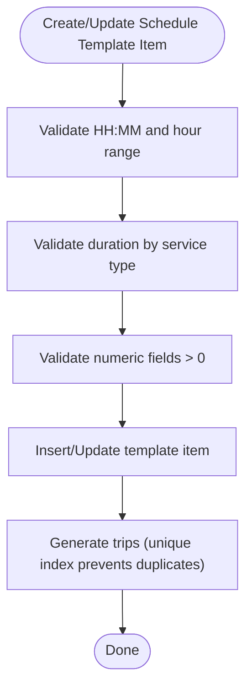

# Business Rules Enforcement

<cite>
**Referenced Files in This Document**
- [BUSINESS_RULES.md](file://docs/BUSINESS_RULES.md)
- [db.js](file://server/db.js)
- [migrate-db-constraints.js](file://migrate-db-constraints.js)
- [migrate-db-schema.js](file://migrate-db-schema.js)
- [selling.mjs](file://server/selling.mjs)
- [schedule-template-items.mjs](file://server/schedule-template-items.mjs)
- [migration_add_trip_date.sql](file://server/migration_add_trip_date.sql)
- [test-constraints.js](file://test-constraints.js)
</cite>

## Table of Contents
1. [Introduction](#introduction)
2. [Project Structure](#project-structure)
3. [Core Components](#core-components)
4. [Architecture Overview](#architecture-overview)
5. [Detailed Component Analysis](#detailed-component-analysis)
6. [Dependency Analysis](#dependency-analysis)
7. [Performance Considerations](#performance-considerations)
8. [Troubleshooting Guide](#troubleshooting-guide)
9. [Conclusion](#conclusion)

## Introduction
This document explains how the Boat Ticket App enforces business rules at the database level using constraints, triggers, and foreign keys. It focuses on seat capacity management, trip scheduling rules, pricing validation, and user role restrictions. It also documents how real-time seat availability is maintained to prevent overbooking and how constraint violations are prevented and surfaced.

## Project Structure
The enforcement spans schema definitions, migrations, triggers, and runtime logic:
- Schema and roles are defined in the database initialization module.
- Constraints and triggers are applied via dedicated migration scripts.
- Runtime enforcement occurs in the selling and schedule template modules.
- Tests validate constraints and expected failures.

**Diagram sources**
- [db.js](file://server/db.js#L41-L85)
- [migrate-db-schema.js](file://migrate-db-schema.js#L82-L131)
- [migrate-db-constraints.js](file://migrate-db-constraints.js#L44-L104)
- [migration_add_trip_date.sql](file://server/migration_add_trip_date.sql#L1-L9)
- [selling.mjs](file://server/selling.mjs#L48-L102)
- [schedule-template-items.mjs](file://server/schedule-template-items.mjs#L127-L200)

**Section sources**
- [db.js](file://server/db.js#L41-L85)
- [migrate-db-schema.js](file://migrate-db-schema.js#L82-L131)
- [migrate-db-constraints.js](file://migrate-db-constraints.js#L44-L104)
- [migration_add_trip_date.sql](file://server/migration_add_trip_date.sql#L1-L9)
- [selling.mjs](file://server/selling.mjs#L48-L102)
- [schedule-template-items.mjs](file://server/schedule-template-items.mjs#L127-L200)

## Core Components
- Role enforcement: The users table restricts role values to predefined values via a CHECK constraint.
- Pricing validation: Triggers on generated_slots enforce positive adult prices, non-negative child/teen prices, and sensible defaults for capacity and duration.
- Seat capacity management: Two complementary mechanisms ensure correctness:
  - Real-time seat accounting: The selling module computes occupied seats from presales/tickets and compares against capacity.
  - Cache synchronization: The selling module updates seats_left in boat_slots and seats_left in generated_slots to reflect current occupancy.
- Duplicate trip prevention: A unique index on generated_slots prevents duplicate trips per date/time/boat combination.
- Trip scheduling rules: Template items enforce time windows, durations, and weekday masks; schema-level constraints further limit acceptable values.

**Section sources**
- [db.js](file://server/db.js#L41-L85)
- [migrate-db-constraints.js](file://migrate-db-constraints.js#L44-L104)
- [selling.mjs](file://server/selling.mjs#L48-L102)
- [schedule-template-items.mjs](file://server/schedule-template-items.mjs#L127-L200)

## Architecture Overview
The system enforces business rules across three layers:
- Database schema defines domain constraints (CHECK, UNIQUE, foreign keys).
- Triggers enforce runtime validations on sensitive tables.
- Application logic performs capacity checks and maintains seat availability caches.

**Diagram sources**
- [selling.mjs](file://server/selling.mjs#L48-L102)

## Detailed Component Analysis

### Seat Capacity Management
Seat availability is managed through two complementary mechanisms:
- Real-time seat accounting: The selling module counts occupied seats from presales and tickets and compares against capacity.
- Cache synchronization: The selling module updates seats_left in boat_slots and generated_slots to maintain a consistent cache.

Key behaviors:
- Capacity checks differentiate between manual slots (boat_slots) and generated slots (generated_slots).
- For generated slots, the source of truth for occupancy is presales; generated_slots.seats_left is refreshed to match computed occupancy.
- The cache is updated after successful transactions to keep UI and subsequent checks accurate.

**Diagram sources**
- [selling.mjs](file://server/selling.mjs#L66-L94)

**Section sources**
- [selling.mjs](file://server/selling.mjs#L48-L102)

### Pricing Validation
Pricing constraints are enforced at the database level via triggers on generated_slots:
- Adult price must be greater than zero.
- Child price must be greater than or equal to zero.
- Teen price must be greater than or equal to zero (when provided).
- Capacity and duration must be greater than zero.
- Date and time must match expected formats.
- Active flag must be 0 or 1.

These checks prevent invalid pricing and scheduling data from entering the database.

**Section sources**
- [migrate-db-constraints.js](file://migrate-db-constraints.js#L44-L96)

### Trip Scheduling Rules
Trip scheduling is governed by:
- Template items: Enforce time windows, durations, and weekday masks.
- Schema-level constraints: Limit acceptable values for product types and weekday indices.
- Unique index on generated_slots: Prevents duplicate trips per date/time/boat combination.

**Diagram sources**
- [schedule-template-items.mjs](file://server/schedule-template-items.mjs#L127-L200)
- [db.js](file://server/db.js#L568-L581)

**Section sources**
- [schedule-template-items.mjs](file://server/schedule-template-items.mjs#L127-L200)
- [db.js](file://server/db.js#L568-L581)

### User Role Restrictions
User roles are restricted to predefined values via a CHECK constraint on the users table. This ensures only authorized roles exist in the system.

**Section sources**
- [db.js](file://server/db.js#L41-L49)

### Duplicate Trip Prevention
A unique index on generated_slots prevents duplicate trips for the same date, time, and boat. This prevents overbooking and data inconsistencies.

**Section sources**
- [migrate-db-constraints.js](file://migrate-db-constraints.js#L98-L104)

### Real-Time Seat Availability and Overbooking Prevention
Real-time checks and cache updates work together to prevent overbooking:
- Occupancy is computed from presales/tickets.
- Free seats are compared to requested seats.
- Seats_left is updated in both boat_slots and generated_slots to reflect current state.

**Diagram sources**
- [selling.mjs](file://server/selling.mjs#L48-L102)

**Section sources**
- [selling.mjs](file://server/selling.mjs#L48-L102)

## Dependency Analysis
The following diagram shows how components depend on database schema and migrations:

**Diagram sources**
- [db.js](file://server/db.js#L41-L85)
- [migrate-db-constraints.js](file://migrate-db-constraints.js#L44-L104)
- [migrate-db-schema.js](file://migrate-db-schema.js#L82-L131)
- [migration_add_trip_date.sql](file://server/migration_add_trip_date.sql#L1-L9)
- [selling.mjs](file://server/selling.mjs#L48-L102)
- [schedule-template-items.mjs](file://server/schedule-template-items.mjs#L127-L200)

**Section sources**
- [db.js](file://server/db.js#L41-L85)
- [migrate-db-constraints.js](file://migrate-db-constraints.js#L44-L104)
- [migrate-db-schema.js](file://migrate-db-schema.js#L82-L131)
- [migration_add_trip_date.sql](file://server/migration_add_trip_date.sql#L1-L9)
- [selling.mjs](file://server/selling.mjs#L48-L102)
- [schedule-template-items.mjs](file://server/schedule-template-items.mjs#L127-L200)

## Performance Considerations
- Indexes improve lookup performance for generated_slots and presales:
  - Unique index on (trip_date, time, boat_id) for generated_slots.
  - Additional indexes on generated_slots for filtering by boat/date/template/active status.
- Seat cache updates occur only after successful transactions to minimize write overhead.
- Time-based queries leverage indexes and avoid expensive joins where possible.

[No sources needed since this section provides general guidance]

## Troubleshooting Guide
Common constraint violations and their prevention mechanisms:
- Invalid pricing or capacity in generated_slots:
  - Violation: Non-positive adult price, negative child/teen price, non-positive capacity/duration.
  - Prevention: Triggers abort inserts/updates with explicit messages.
  - Example: See tests that intentionally insert invalid data and expect failures.
- Duplicate trips in generated_slots:
  - Violation: Same date/time/boat combination already exists.
  - Prevention: Unique index blocks insertion; application logic handles the error and reports reasons.
- Overbooking attempts:
  - Violation: Requested seats exceed computed free seats.
  - Prevention: Real-time capacity checks raise structured errors with details.

Validation and testing:
- Dedicated tests exercise constraints and report expected failures.
- Migration scripts include checks for existing bad data and tests for trigger behavior.

**Section sources**
- [migrate-db-constraints.js](file://migrate-db-constraints.js#L22-L131)
- [test-constraints.js](file://test-constraints.js#L10-L82)
- [selling.mjs](file://server/selling.mjs#L48-L102)

## Conclusion
The Boat Ticket App enforces critical business rules at the database level using schema constraints, triggers, and unique indexes. Together with runtime logic in the selling and scheduling modules, the system ensures:
- Seat capacity integrity and real-time availability.
- Valid pricing and scheduling data.
- Role restrictions and duplicate prevention.
These mechanisms collectively prevent overbooking, enforce pricing rules, and maintain data quality across manual and generated trips.