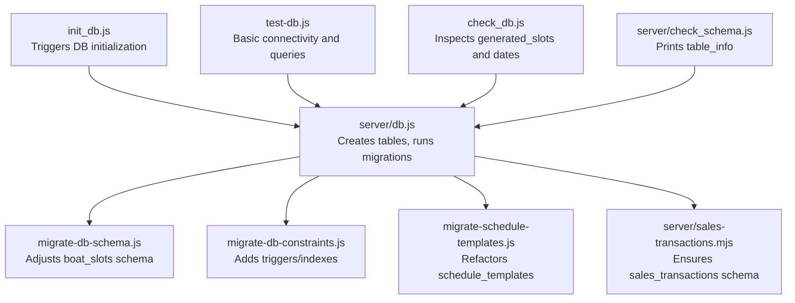
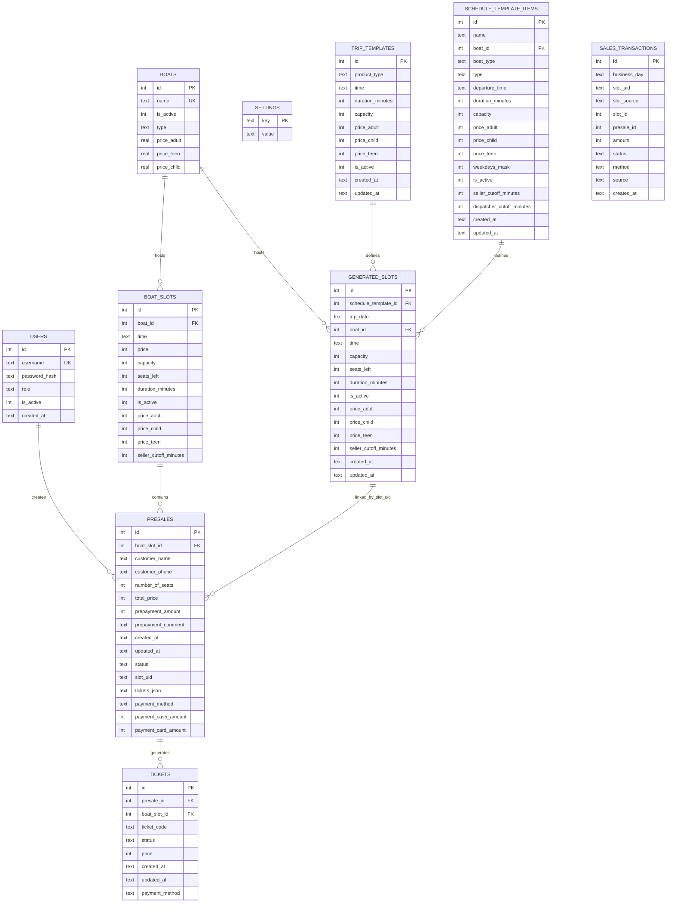
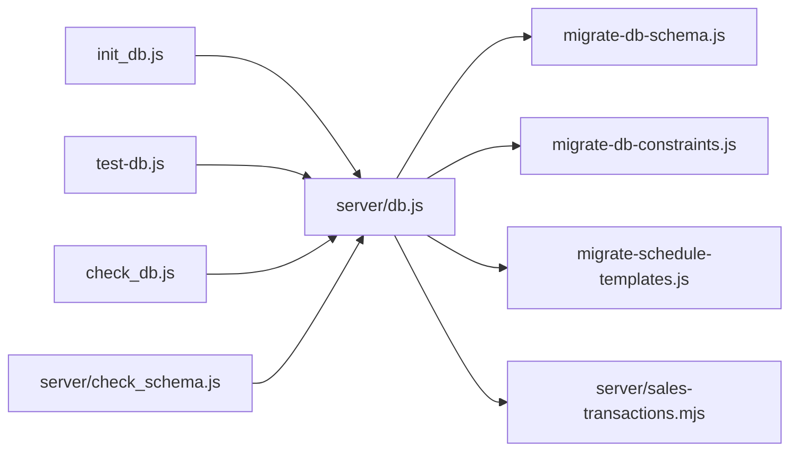

# Database Design

<cite>
**Referenced Files in This Document**
- [server/db.js](file://server/db.js)
- [migrate-db-schema.js](file://migrate-db-schema.js)
- [migrate-db-constraints.js](file://migrate-db-constraints.js)
- [migrate-schedule-templates.js](file://migrate-schedule-templates.js)
- [server/sales-transactions.mjs](file://server/sales-transactions.mjs)
- [init_db.js](file://init_db.js)
- [test-db.js](file://test-db.js)
- [check_db.js](file://check_db.js)
- [server/check_schema.js](file://server/check_schema.js)
</cite>

## Table of Contents
1. [Introduction](#introduction)
2. [Project Structure](#project-structure)
3. [Core Components](#core-components)
4. [Architecture Overview](#architecture-overview)
5. [Detailed Component Analysis](#detailed-component-analysis)
6. [Dependency Analysis](#dependency-analysis)
7. [Performance Considerations](#performance-considerations)
8. [Troubleshooting Guide](#troubleshooting-guide)
9. [Conclusion](#conclusion)
10. [Appendices](#appendices)

## Introduction
This document describes the SQLite database schema and operational model for the boat ticketing application. It covers entity definitions, relationships, constraints, indexes, and business rules enforced at the database level. It also documents data lifecycle patterns (user management, scheduling, booking, transactions), migration strategies, and performance considerations. The schema supports two primary trip generation modes: manually managed slots and schedule templates with generated slots.

## Project Structure
The database is initialized and evolved via scripts and the backend module. Initialization triggers migrations and schema creation. Additional migration scripts handle incremental schema updates and constraints.

**Diagram sources**
- [init_db.js](file://init_db.js#L1-L8)
- [server/db.js](file://server/db.js#L1-L1269)
- [migrate-db-schema.js](file://migrate-db-schema.js#L1-L153)
- [migrate-db-constraints.js](file://migrate-db-constraints.js#L1-L136)
- [migrate-schedule-templates.js](file://migrate-schedule-templates.js#L1-L327)
- [server/sales-transactions.mjs](file://server/sales-transactions.mjs#L1-L237)
- [test-db.js](file://test-db.js#L1-L99)
- [check_db.js](file://check_db.js#L1-L40)
- [server/check_schema.js](file://server/check_schema.js#L1-L9)

**Section sources**
- [init_db.js](file://init_db.js#L1-L8)
- [server/db.js](file://server/db.js#L1-L1269)
- [migrate-db-schema.js](file://migrate-db-schema.js#L1-L153)
- [migrate-db-constraints.js](file://migrate-db-constraints.js#L1-L136)
- [migrate-schedule-templates.js](file://migrate-schedule-templates.js#L1-L327)
- [server/sales-transactions.mjs](file://server/sales-transactions.mjs#L1-L237)
- [test-db.js](file://test-db.js#L1-L99)
- [check_db.js](file://check_db.js#L1-L40)
- [server/check_schema.js](file://server/check_schema.js#L1-L9)

## Core Components
This section defines the core tables and their constraints. All definitions are derived from the initialization and migration logic.

- Users
  - Purpose: Authentication and authorization for sellers, dispatchers, admins, and owners.
  - Fields:
    - id: integer, primary key, autoincrement
    - username: text, unique, not null
    - password_hash: text, not null
    - role: text, not null, check constraint: ('seller','dispatcher','admin','owner')
    - is_active: integer, not null, default 1
    - created_at: text, default current_timestamp
  - Indexes: none (unique enforced by unique constraint on username)
  - Notes: Owner role and seed user are ensured during initialization.

- Boats
  - Purpose: Defines vessel inventory and default pricing per ticket category.
  - Fields:
    - id: integer, primary key, autoincrement
    - name: text, unique, not null
    - is_active: integer, not null, default 1
    - type: text
    - price_adult: real, not null, default 0
    - price_teen: real, nullable
    - price_child: real, not null, default 0
  - Indexes: none
  - Constraints: name is unique; type constrained to supported categories via downstream logic.

- Boat Slots (manual)
  - Purpose: Manually managed trip slots with capacity and optional per-category pricing overrides.
  - Fields:
    - id: integer, primary key, autoincrement
    - boat_id: integer, not null, references boats(id)
    - time: text, not null
    - price: integer, nullable
    - capacity: integer, not null
    - seats_left: integer, not null
    - duration_minutes: integer, nullable
    - is_active: integer, not null, default 1
    - price_adult: integer, nullable
    - price_child: integer, nullable
    - price_teen: integer, nullable
    - seller_cutoff_minutes: integer, nullable
    - Unique constraint: (boat_id, time)
  - Indexes: none
  - Notes: Seats availability starts equal to capacity; defaults applied during migrations.

- Presales (Bookings)
  - Purpose: Pre-sales records linked to either manual slots or generated slots.
  - Fields:
    - id: integer, primary key, autoincrement
    - boat_slot_id: integer, not null, references boat_slots(id)
    - customer_name: text, not null
    - customer_phone: text, not null
    - number_of_seats: integer, not null
    - total_price: integer, not null
    - prepayment_amount: integer, not null, default 0
    - prepayment_comment: text, nullable
    - created_at: text, default current_timestamp
    - updated_at: text, default current_timestamp
    - status: text, not null, default 'ACTIVE'
    - slot_uid: text, nullable
    - tickets_json: text, nullable
    - payment_method: text, nullable
    - payment_cash_amount: integer, not null, default 0
    - payment_card_amount: integer, not null, default 0
  - Indexes: idx_presales_slot_uid (created during migration)
  - Notes: Status and payment fields added via migrations; slot_uid links to generated_slots.

- Tickets
  - Purpose: Individual ticket records derived from presales.
  - Fields:
    - id: integer, primary key, autoincrement
    - presale_id: integer, not null, references presales(id)
    - boat_slot_id: integer, not null, references boat_slots(id)
    - ticket_code: text, not null
    - status: text, not null, default 'ACTIVE'
    - price: integer, not null
    - created_at: text, default current_timestamp
    - updated_at: text, default current_timestamp
    - payment_method: text, nullable
  - Indexes: none
  - Notes: Created during tickets table migration.

- Settings
  - Purpose: Lightweight key-value store for migration/version markers.
  - Fields:
    - key: text, primary key
    - value: text
  - Indexes: none

- Trip Templates
  - Purpose: Template definitions for recurring schedules (deprecated in favor of schedule_template_items).
  - Fields:
    - id: integer, primary key, autoincrement
    - product_type: text, not null, check constraint: ('speed','cruise','banana')
    - time: text, not null
    - duration_minutes: integer, not null
    - capacity: integer, not null
    - price_adult: integer, not null
    - price_child: integer, not null
    - price_teen: integer, nullable
    - is_active: integer, not null, default 1
    - created_at: text, default current_timestamp
    - updated_at: text, default current_timestamp
  - Indexes: none

- Schedule Templates Items
  - Purpose: New structure replacing schedule_templates with a single record per template and a weekday bitmask.
  - Fields:
    - id: integer, primary key, autoincrement
    - name: text
    - boat_id: integer, references boats(id)
    - boat_type: text
    - type: text, not null, check constraint: ('speed','cruise','banana')
    - departure_time: text, not null
    - duration_minutes: integer, not null
    - capacity: integer, not null
    - price_adult: integer, not null
    - price_child: integer, not null
    - price_teen: integer, nullable
    - weekdays_mask: integer, not null, default 0
    - is_active: integer, not null, default 1
    - seller_cutoff_minutes: integer, nullable
    - dispatcher_cutoff_minutes: integer, nullable
    - created_at: text, default current_timestamp
    - updated_at: text, default current_timestamp
  - Indexes: none

- Generated Slots
  - Purpose: Runtime instances of scheduled trips created from schedule_template_items.
  - Fields:
    - id: integer, primary key, autoincrement
    - schedule_template_id: integer, not null, references schedule_templates(id)
    - trip_date: text, not null
    - boat_id: integer, not null, references boats(id)
    - time: text, not null
    - capacity: integer, not null
    - seats_left: integer, not null
    - duration_minutes: integer, not null
    - is_active: integer, not null, default 1
    - price_adult: integer, not null
    - price_child: integer, not null
    - price_teen: integer, nullable
    - seller_cutoff_minutes: integer, nullable
    - created_at: text, default current_timestamp
    - updated_at: text, default current_timestamp
  - Indexes:
    - idx_generated_slots_unique: unique on (trip_date, time, boat_id)
    - idx_generated_slots_boat_date: on (boat_id, trip_date)
    - idx_generated_slots_template: on (schedule_template_id)
    - idx_generated_slots_active: on (is_active)
  - Notes: Triggers enforce validation on insert/update.

- Sales Transactions
  - Purpose: Canonical owner revenue ledger for completed trips.
  - Fields:
    - id: integer, primary key, autoincrement
    - business_day: text, not null
    - slot_uid: text, not null
    - slot_source: text, not null
    - slot_id: integer, not null
    - presale_id: integer
    - amount: integer, not null
    - status: text, not null, default 'VALID'
    - method: text, not null
    - source: text, not null, default 'online'
    - created_at: text, default current_timestamp
  - Indexes:
    - idx_sales_tx_unique: unique on (slot_uid, presale_id, method, source, status)
    - idx_sales_tx_business_day: on (business_day)
  - Notes: Created lazily and idempotently; populated after trip completion.

**Section sources**
- [server/db.js](file://server/db.js#L41-L93)
- [server/db.js](file://server/db.js#L95-L110)
- [server/db.js](file://server/db.js#L68-L85)
- [server/db.js](file://server/db.js#L56-L66)
- [server/db.js](file://server/db.js#L38-L49)
- [server/db.js](file://server/db.js#L559-L594)
- [server/db.js](file://server/db.js#L616-L647)
- [server/db.js](file://server/db.js#L649-L687)
- [server/db.js](file://server/db.js#L688-L727)
- [migrate-db-constraints.js](file://migrate-db-constraints.js#L44-L96)
- [migrate-db-constraints.js](file://migrate-db-constraints.js#L98-L104)
- [server/sales-transactions.mjs](file://server/sales-transactions.mjs#L34-L63)

## Architecture Overview
The database architecture centers on two trip generation modes:
- Manual mode: Uses boat_slots with direct seat capacity and availability.
- Generated mode: Uses schedule_template_items to produce generated_slots with runtime validation and uniqueness.

**Diagram sources**
- [server/db.js](file://server/db.js#L41-L93)
- [server/db.js](file://server/db.js#L95-L110)
- [server/db.js](file://server/db.js#L68-L85)
- [server/db.js](file://server/db.js#L56-L66)
- [server/db.js](file://server/db.js#L559-L594)
- [server/db.js](file://server/db.js#L616-L647)
- [server/db.js](file://server/db.js#L649-L687)
- [server/db.js](file://server/db.js#L688-L727)
- [migrate-db-constraints.js](file://migrate-db-constraints.js#L44-L96)
- [server/sales-transactions.mjs](file://server/sales-transactions.mjs#L34-L63)

## Detailed Component Analysis

### Users
- Role-based access control is enforced by the role field with allowed values.
- Password hashing is handled at the application layer; the database stores hashed credentials.
- Initialization ensures an owner role and seeds an owner user.

**Section sources**
- [server/db.js](file://server/db.js#L41-L49)
- [server/db.js](file://server/db.js#L51-L52)

### Boats
- Supports type categorization and default pricing per category.
- Migrations add type and pricing columns if missing and normalize values.

**Section sources**
- [server/db.js](file://server/db.js#L55-L66)
- [server/db.js](file://server/db.js#L111-L144)
- [server/db.js](file://server/db.js#L229-L247)

### Boat Slots (Manual)
- Enforces uniqueness of (boat_id, time).
- Seats availability defaults to capacity; capacity defaults to 12 if missing.
- Pricing columns for adults/children/teens can be overridden at the slot level.

**Section sources**
- [server/db.js](file://server/db.js#L68-L85)
- [migrate-db-schema.js](file://migrate-db-schema.js#L25-L80)
- [migrate-db-schema.js](file://migrate-db-schema.js#L82-L136)

### Presales (Bookings)
- Links to manual slots via boat_slot_id.
- Supports status tracking, partial payments, and payment splits (cash/card).
- slot_uid enables linking to generated slots for unified reporting.

**Section sources**
- [server/db.js](file://server/db.js#L95-L110)
- [server/db.js](file://server/db.js#L313-L383)

### Tickets
- Derived from presales; maintains per-ticket state and optional payment method.
- Ensures referential integrity with presales and boat_slots.

**Section sources**
- [server/db.js](file://server/db.js#L616-L647)

### Generated Slots and Schedule Templates
- schedule_template_items replaces schedule_templates with a single record per template and a weekday bitmask.
- generated_slots are created from schedule_template_items; uniqueness enforced by a composite unique index.
- Triggers validate generated_slots on insert/update.

**Section sources**
- [migrate-schedule-templates.js](file://migrate-schedule-templates.js#L1-L327)
- [server/db.js](file://server/db.js#L649-L687)
- [server/db.js](file://server/db.js#L688-L727)
- [migrate-db-constraints.js](file://migrate-db-constraints.js#L44-L96)
- [migrate-db-constraints.js](file://migrate-db-constraints.js#L98-L104)

### Sales Transactions
- Canonical owner revenue ledger for completed trips.
- Populated after a trip is completed and locked; idempotent and deduplicated by unique index.

**Section sources**
- [server/sales-transactions.mjs](file://server/sales-transactions.mjs#L34-L63)
- [server/sales-transactions.mjs](file://server/sales-transactions.mjs#L167-L236)

### Data Validation and Business Rules
- Database-level checks:
  - Users.role constrained to allowed values.
  - Boats.name unique.
  - Boat Slots unique (boat_id, time).
  - Generated Slots unique (trip_date, time, boat_id).
  - Triggers validate generated_slots insert/update for positive prices, capacity, duration, and formats.
- Application-level checks:
  - Presales status values and payment method normalization.
  - Sales transactions derivation from presales with explicit cash/card amounts preferred.

**Section sources**
- [server/db.js](file://server/db.js#L41-L49)
- [server/db.js](file://server/db.js#L55-L66)
- [server/db.js](file://server/db.js#L68-L85)
- [migrate-db-constraints.js](file://migrate-db-constraints.js#L44-L96)
- [server/sales-transactions.mjs](file://server/sales-transactions.mjs#L115-L144)

## Dependency Analysis
The following diagram shows key dependencies among modules and the database.

**Diagram sources**
- [init_db.js](file://init_db.js#L1-L8)
- [server/db.js](file://server/db.js#L1-L1269)
- [migrate-db-schema.js](file://migrate-db-schema.js#L1-L153)
- [migrate-db-constraints.js](file://migrate-db-constraints.js#L1-L136)
- [migrate-schedule-templates.js](file://migrate-schedule-templates.js#L1-L327)
- [server/sales-transactions.mjs](file://server/sales-transactions.mjs#L1-L237)
- [test-db.js](file://test-db.js#L1-L99)
- [check_db.js](file://check_db.js#L1-L40)
- [server/check_schema.js](file://server/check_schema.js#L1-L9)

**Section sources**
- [init_db.js](file://init_db.js#L1-L8)
- [server/db.js](file://server/db.js#L1-L1269)
- [migrate-db-schema.js](file://migrate-db-schema.js#L1-L153)
- [migrate-db-constraints.js](file://migrate-db-constraints.js#L1-L136)
- [migrate-schedule-templates.js](file://migrate-schedule-templates.js#L1-L327)
- [server/sales-transactions.mjs](file://server/sales-transactions.mjs#L1-L237)
- [test-db.js](file://test-db.js#L1-L99)
- [check_db.js](file://check_db.js#L1-L40)
- [server/check_schema.js](file://server/check_schema.js#L1-L9)

## Performance Considerations
- Indexes:
  - generated_slots: unique index on (trip_date, time, boat_id); additional indexes on (boat_id, trip_date), (schedule_template_id), and (is_active).
  - presales: index on slot_uid for fast lookup by generated slot linkage.
- Journaling and concurrency:
  - WAL mode enabled for improved concurrency and reduced locking.
  - Busy timeout configured to handle contention.
- Query patterns:
  - Prefer filtering by active status and date ranges for generated_slots.
  - Use unique indexes to avoid duplicate insertions and reduce conflict resolution overhead.
- Seat availability:
  - seats_left defaults to capacity; ensure consistent updates when issuing tickets.

**Section sources**
- [migrate-db-constraints.js](file://migrate-db-constraints.js#L98-L104)
- [server/db.js](file://server/db.js#L19-L21)
- [server/db.js](file://server/db.js#L146-L164)

## Troubleshooting Guide
- Schema inspection:
  - Use the provided check_schema script to print table_info for boat_slots and boats.
- Generated slots anomalies:
  - The check_db script lists active generated_slots and compares with current date; useful for diagnosing scheduling issues.
- Basic connectivity:
  - The test-db script verifies users, boats, and slots queries and demonstrates step-by-step filtering for active speed-type slots.
- Migration issues:
  - migrate-db-schema and migrate-db-constraints scripts log detailed steps and rollback on failure; review logs for column additions and table recreations.
- Sales transactions:
  - Ensure generated_slots have trip_date; otherwise, sales transactions will not be created for those slots.

**Section sources**
- [server/check_schema.js](file://server/check_schema.js#L1-L9)
- [check_db.js](file://check_db.js#L1-L40)
- [test-db.js](file://test-db.js#L1-L99)
- [migrate-db-schema.js](file://migrate-db-schema.js#L141-L151)
- [migrate-db-constraints.js](file://migrate-db-constraints.js#L133-L136)
- [server/sales-transactions.mjs](file://server/sales-transactions.mjs#L177-L187)

## Conclusion
The database schema supports robust trip scheduling and booking workflows across manual and generated modes, with strong constraints and indexes to ensure data integrity and performance. Migrations evolve the schema safely while preserving data, and the sales_transactions table provides a canonical audit trail for owner analytics.

## Appendices

### Data Lifecycle
- User management:
  - Create users with roles; owner role is ensured during initialization.
- Trip scheduling:
  - Define schedule_template_items (or legacy schedule_templates) and generate generated_slots.
- Booking management:
  - Create presales against manual slots or generated slots via slot_uid.
- Transaction recording:
  - After a trip completes, sales_transactions are created for validated cash/card amounts.

**Section sources**
- [server/db.js](file://server/db.js#L51-L52)
- [migrate-schedule-templates.js](file://migrate-schedule-templates.js#L1-L327)
- [server/db.js](file://server/db.js#L688-L727)
- [server/db.js](file://server/db.js#L95-L110)
- [server/sales-transactions.mjs](file://server/sales-transactions.mjs#L167-L236)

### Schema Evolution and Version Management
- Lightweight migrations run on startup to add missing columns and normalize data.
- Separate migration scripts handle major structural changes (e.g., boat_slots schema, constraints, schedule templates).
- A settings table tracks migration/version markers to avoid re-running idempotent steps.

**Section sources**
- [server/db.js](file://server/db.js#L111-L184)
- [server/db.js](file://server/db.js#L185-L227)
- [server/db.js](file://server/db.js#L229-L277)
- [server/db.js](file://server/db.js#L278-L311)
- [migrate-db-schema.js](file://migrate-db-schema.js#L1-L153)
- [migrate-db-constraints.js](file://migrate-db-constraints.js#L1-L136)
- [migrate-schedule-templates.js](file://migrate-schedule-templates.js#L1-L327)

### Security and Access Control
- Authentication:
  - Passwords are hashed at the application layer; the database stores only hashed values.
- Authorization:
  - Roles define access boundaries; enforced at the application level.
- Database-level safeguards:
  - Unique constraints on usernames and boat names.
  - Triggers and indexes prevent duplicate/triplicate entries and improve integrity.

**Section sources**
- [server/db.js](file://server/db.js#L41-L49)
- [server/db.js](file://server/db.js#L55-L66)
- [migrate-db-constraints.js](file://migrate-db-constraints.js#L44-L96)

### Automatic Migration and Initialization
- Initialization:
  - init_db.js imports the DB module, triggering table creation and migrations.
- DB module:
  - Creates tables, applies lightweight migrations, and seeds owner role/user.
- Migration scripts:
  - migrate-db-schema adjusts boat_slots schema and price column nullability.
  - migrate-db-constraints adds triggers and indexes for generated_slots.
  - migrate-schedule-templates refactors schedule_templates to schedule_template_items and creates a compatibility view.

**Section sources**
- [init_db.js](file://init_db.js#L1-L8)
- [server/db.js](file://server/db.js#L1-L1269)
- [migrate-db-schema.js](file://migrate-db-schema.js#L1-L153)
- [migrate-db-constraints.js](file://migrate-db-constraints.js#L1-L136)
- [migrate-schedule-templates.js](file://migrate-schedule-templates.js#L1-L327)