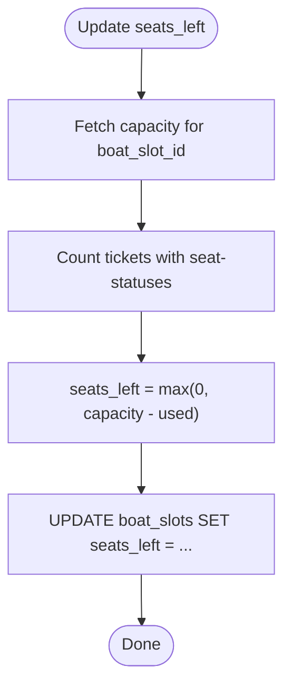

# Entity Relationships

<cite>
**Referenced Files in This Document**
- [server/db.js](file://server/db.js)
- [migrate-db-schema.js](file://migrate-db-schema.js)
- [migrate-db-constraints.js](file://migrate-db-constraints.js)
- [server/selling.mjs](file://server/selling.mjs)
- [server/schedule-templates.mjs](file://server/schedule-templates.mjs)
- [server/trip-templates.mjs](file://server/trip-templates.mjs)
- [test-constraints.js](file://test-constraints.js)
- [check-generated-slots.js](file://check-generated-slots.js)
- [server/.mjs](file://server/.mjs)
</cite>

## Table of Contents
1. [Introduction](#introduction)
2. [Project Structure](#project-structure)
3. [Core Components](#core-components)
4. [Architecture Overview](#architecture-overview)
5. [Detailed Component Analysis](#detailed-component-analysis)
6. [Dependency Analysis](#dependency-analysis)
7. [Performance Considerations](#performance-considerations)
8. [Troubleshooting Guide](#troubleshooting-guide)
9. [Conclusion](#conclusion)

## Introduction
This document explains the entity relationships and foreign key constraints across the database schema, focusing on how users, boats, boat_slots, presales, tickets, and scheduling templates connect. It documents referential integrity, cascading behavior, and constraint validation enforced at the database and application levels. It also provides practical examples of join operations and query patterns that demonstrate these relationships, along with the impact of entity deletions and updates on related records.

## Project Structure
The schema is defined and evolved by the backend initialization and migration scripts, and consumed by business logic modules that enforce business rules and maintain referential integrity.

**Diagram sources**
- [server/db.js](file://server/db.js#L40-L120)
- [server/selling.mjs](file://server/selling.mjs#L17-L60)
- [server/schedule-templates.mjs](file://server/schedule-templates.mjs#L657-L726)
- [server/trip-templates.mjs](file://server/trip-templates.mjs#L142-L173)
- [migrate-db-schema.js](file://migrate-db-schema.js#L92-L131)
- [migrate-db-constraints.js](file://migrate-db-constraints.js#L44-L104)

**Section sources**
- [server/db.js](file://server/db.js#L40-L120)
- [migrate-db-schema.js](file://migrate-db-schema.js#L92-L131)
- [migrate-db-constraints.js](file://migrate-db-constraints.js#L44-L104)

## Core Components
- Users: Authentication and roles for sellers, dispatchers, admins, and owners.
- Boats: Fleet inventory with type and pricing defaults.
- Boat Slots: Manual time slots per boat with capacity and pricing overrides.
- Presales: Pre-bookings linked to either manual slots or generated slots via slot identifiers.
- Tickets: Individual ticket records linked to presales and boat slots.
- Schedule Templates: Repeating schedules that generate dated slots.
- Generated Slots: Dated, validated slots created from templates.
- Trip Templates: Static templates for trip definitions without dates.

**Section sources**
- [server/db.js](file://server/db.js#L41-L120)
- [server/selling.mjs](file://server/selling.mjs#L642-L800)
- [server/schedule-templates.mjs](file://server/schedule-templates.mjs#L220-L303)
- [server/trip-templates.mjs](file://server/trip-templates.mjs#L94-L173)

## Architecture Overview
The system enforces referential integrity through foreign keys and validates business constraints at both the database and application layers. Generated slots encapsulate schedule-driven trips, while manual slots remain independent. Presales link to either manual or generated slots via slot identifiers, and tickets link to presales and boat slots.

**Diagram sources**
- [server/db.js](file://server/db.js#L41-L120)
- [server/selling.mjs](file://server/selling.mjs#L625-L640)
- [server/schedule-templates.mjs](file://server/schedule-templates.mjs#L696-L726)
- [server/trip-templates.mjs](file://server/trip-templates.mjs#L142-L173)

## Detailed Component Analysis

### Users and Presales
- Presales are created by users (via authenticated routes) and store customer contact and booking details.
- Presales reference boat_slots via boat_slot_id and may carry a slot_uid for generated slots.
- Presales include status tracking and optional breakdown of tickets.

**Diagram sources**
- [server/selling.mjs](file://server/selling.mjs#L642-L800)

**Section sources**
- [server/selling.mjs](file://server/selling.mjs#L642-L800)

### Boats and Boat Slots
- Boat slots are per-boat time entries with capacity, seats_left, and optional pricing overrides.
- Unique constraint prevents duplicate slots for the same boat/time combination.
- Seat availability is maintained and recalculated based on tickets.

**Diagram sources**
- [server/selling.mjs](file://server/selling.mjs#L154-L171)

**Section sources**
- [server/db.js](file://server/db.js#L68-L85)
- [server/selling.mjs](file://server/selling.mjs#L154-L171)

### Presales to Tickets and Boat Slots
- Tickets are linked to presales and boat slots; their status determines seat occupancy.
- Business logic computes occupied seats from tickets and updates caches accordingly.

**Diagram sources**
- [server/selling.mjs](file://server/selling.mjs#L17-L94)

**Section sources**
- [server/selling.mjs](file://server/selling.mjs#L17-L94)

### Schedule Templates, Generated Slots, and Trip Templates
- Schedule templates define recurring trips by weekday/time/product type and optionally tie to a specific boat.
- Generated slots are created from schedule templates for specific dates, inheriting pricing and capacity.
- Trip templates define static trip definitions without dates.

**Diagram sources**
- [server/schedule-templates.mjs](file://server/schedule-templates.mjs#L220-L303)
- [server/schedule-templates.mjs](file://server/schedule-templates.mjs#L638-L678)

**Section sources**
- [server/schedule-templates.mjs](file://server/schedule-templates.mjs#L220-L303)
- [server/schedule-templates.mjs](file://server/schedule-templates.mjs#L638-L678)
- [server/trip-templates.mjs](file://server/trip-templates.mjs#L94-L173)

### Relationship Details and Constraints

#### Foreign Keys and Referential Integrity
- boat_slots.boat_id → boats.id
- presales.boat_slot_id → boat_slots.id
- tickets.presale_id → presales.id
- tickets.boat_slot_id → boat_slots.id
- generated_slots.schedule_template_id → schedule_templates.id
- generated_slots.boat_id → boats.id

These relationships ensure that:
- Deleting a boat may orphan or invalidate dependent slots depending on cascade behavior.
- Deleting a schedule template does not automatically delete generated slots; deletion logic must be explicit.

**Section sources**
- [server/db.js](file://server/db.js#L68-L120)
- [server/schedule-templates.mjs](file://server/schedule-templates.mjs#L269-L286)

#### Unique Constraints and Indexes
- boat_slots: UNIQUE(boat_id, time)
- generated_slots: UNIQUE(trip_date, time, boat_id)
- tickets: ticket_code is unique
- Additional indexes: idx_generated_slots_unique, idx_generated_slots_boat_date, idx_generated_slots_template, idx_generated_slots_active

**Section sources**
- [server/db.js](file://server/db.js#L82-L84)
- [migrate-db-constraints.js](file://migrate-db-constraints.js#L98-L104)

#### Business Rule Validation (Triggers and Application-Level)
- Triggers validate generated_slots insert/update for price_adult, capacity, duration_minutes, date/time formats, is_active, and price_child/price_teen ranges.
- Application logic validates seat counts, durations, and ticket breakdowns.

**Diagram sources**
- [migrate-db-constraints.js](file://migrate-db-constraints.js#L44-L96)

**Section sources**
- [migrate-db-constraints.js](file://migrate-db-constraints.js#L44-L96)
- [server/selling.mjs](file://server/selling.mjs#L208-L262)

### Join Operations and Query Patterns

#### Example 1: List generated slots with boat and ticket counts
- Join generated_slots with boats and aggregated ticket counts to compute available seats.

**Section sources**
- [server/selling.mjs](file://server/selling.mjs#L585-L607)

#### Example 2: Resolve slot by UID (manual or generated)
- Resolve slot by slotUid, joining boat_slots or generated_slots with boats and optional cutoff settings.

**Section sources**
- [server/selling.mjs](file://server/selling.mjs#L264-L395)

#### Example 3: Generate slots from schedule template
- Create generated_slots rows for matching weekdays within a date range.

**Section sources**
- [server/schedule-templates.mjs](file://server/schedule-templates.mjs#L220-L303)

#### Example 4: Presale-to-ticket reconciliation
- Recalculate presale totals and number_of_seats based on active tickets and slot pricing.

**Section sources**
- [server/selling.mjs](file://server/selling.mjs#L3629-L3648)

### Impact of Deletions and Updates

#### Deleting a Boat
- Impacts boat_slots and tickets if foreign keys are not configured with ON DELETE CASCADE.
- Recommendation: Soft-delete pattern or explicit cleanup of dependent records.

#### Deleting a Schedule Template
- Does not automatically delete generated_slots; explicit deletion logic is required.

#### Updating Pricing and Capacity
- Application logic recomputes seats_left and validates constraints before updates.

**Section sources**
- [server/schedule-templates.mjs](file://server/schedule-templates.mjs#L541-L569)
- [server/selling.mjs](file://server/selling.mjs#L96-L102)

## Dependency Analysis
The application depends on:
- Database schema defined in server/db.js
- Migrations ensuring schema and constraints evolve safely
- Business modules enforcing runtime validations and joins

**Diagram sources**
- [server/db.js](file://server/db.js#L40-L120)
- [migrate-db-schema.js](file://migrate-db-schema.js#L92-L131)
- [migrate-db-constraints.js](file://migrate-db-constraints.js#L44-L104)
- [server/selling.mjs](file://server/selling.mjs#L17-L60)
- [server/schedule-templates.mjs](file://server/schedule-templates.mjs#L657-L726)
- [server/trip-templates.mjs](file://server/trip-templates.mjs#L142-L173)

**Section sources**
- [server/db.js](file://server/db.js#L40-L120)
- [migrate-db-schema.js](file://migrate-db-schema.js#L92-L131)
- [migrate-db-constraints.js](file://migrate-db-constraints.js#L44-L104)
- [server/selling.mjs](file://server/selling.mjs#L17-L60)
- [server/schedule-templates.mjs](file://server/schedule-templates.mjs#L657-L726)
- [server/trip-templates.mjs](file://server/trip-templates.mjs#L142-L173)

## Performance Considerations
- Indexes on frequently filtered columns (e.g., generated_slots indexes) improve query performance.
- Prefer using slot_uid for generated slots to avoid cross-date aggregation pitfalls.
- Keep seats_left as a cached field updated by application logic to minimize expensive seat-count queries.

[No sources needed since this section provides general guidance]

## Troubleshooting Guide
Common constraint violations and resolutions:
- Invalid price_adult/capacity/duration in generated_slots: Blocked by triggers; adjust values to satisfy constraints.
- Duplicate slot entries: UNIQUE constraints prevent duplicates; ensure correct trip_date/time/boat_id combinations.
- Seat availability mismatches: Use seat-counting logic from tickets and recalculate seats_left.

Validation tests confirm expected behavior.

**Section sources**
- [migrate-db-constraints.js](file://migrate-db-constraints.js#L112-L131)
- [test-constraints.js](file://test-constraints.js#L10-L82)

## Conclusion
The schema establishes clear relationships among users, boats, slots, presales, tickets, and scheduling templates. Referential integrity is enforced via foreign keys, while database triggers and application logic validate business rules. Unique constraints and indexes optimize correctness and performance. Understanding these relationships enables safe updates and deletions, and supports robust query patterns for reporting and sales operations.